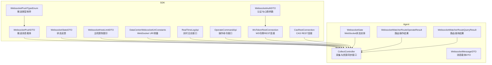
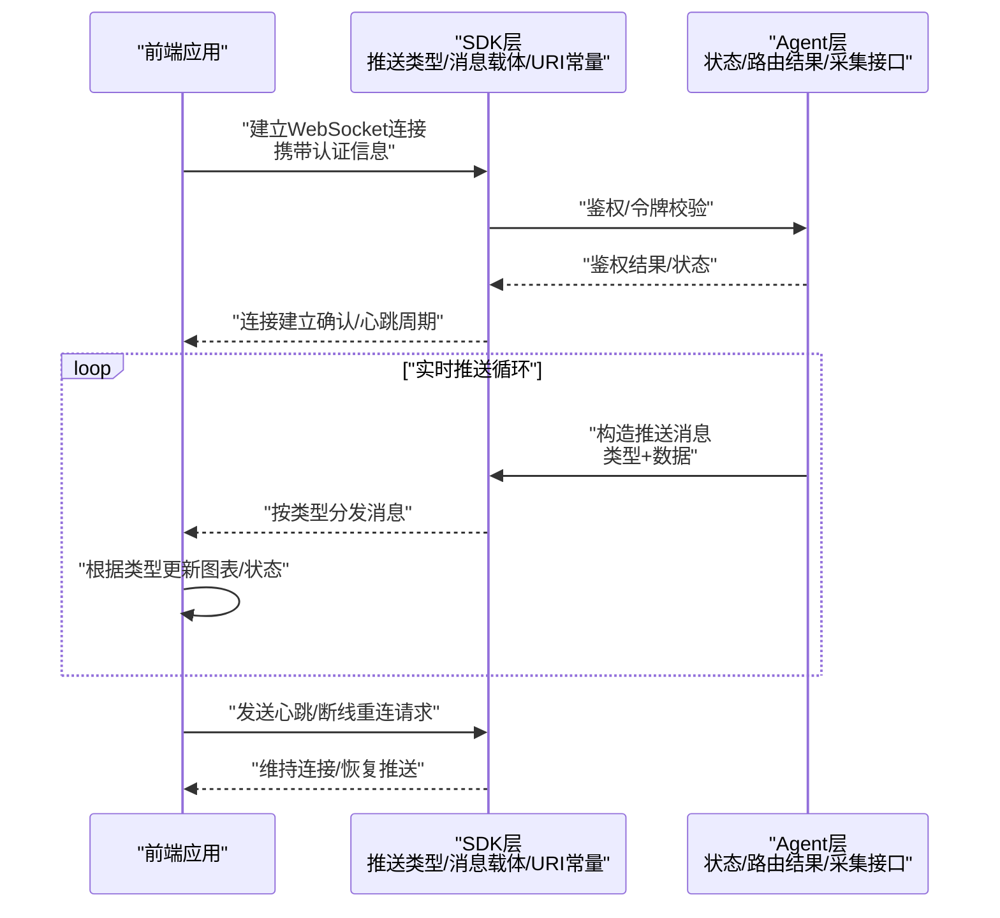
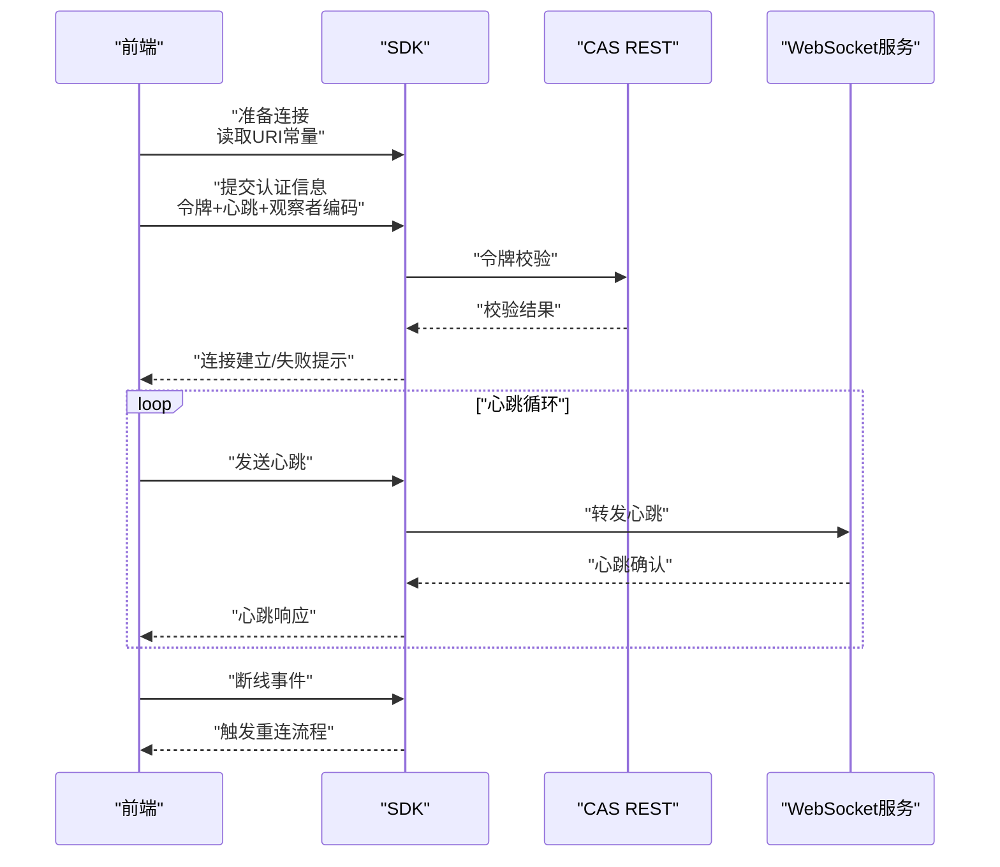
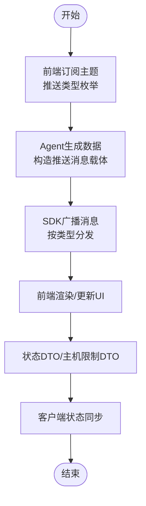
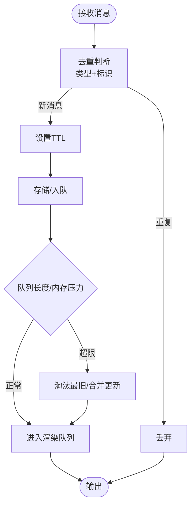
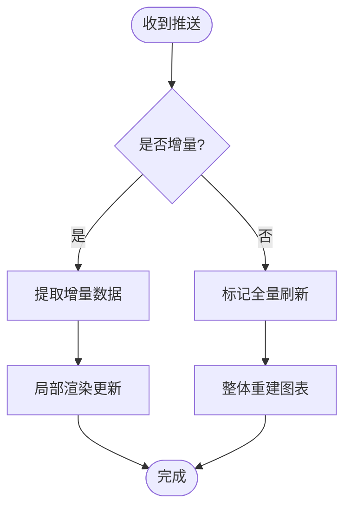
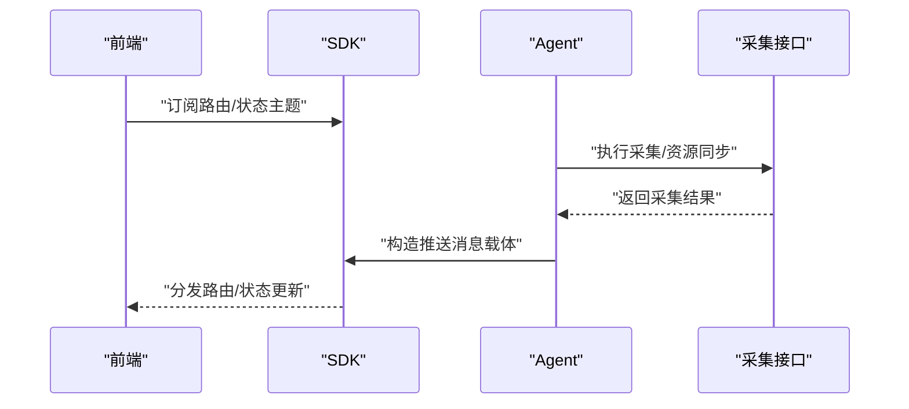
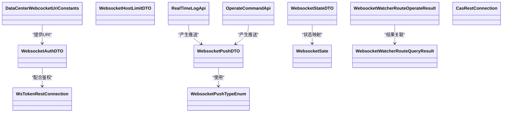

# 实时数据流处理

<cite>
**本文引用的文件**
- [WebsocketPushTypeEnum.java](file://watcher-sdk/src/main/java/com/virtual/cloud/om/sdk/constant/WebsocketPushTypeEnum.java)
- [WebsocketPushDTO.java](file://watcher-sdk/src/main/java/com/virtual/cloud/om/sdk/dto/websocket/WebsocketPushDTO.java)
- [WebsocketAuthDTO.java](file://watcher-sdk/src/main/java/com/virtual/cloud/om/sdk/dto/websocket/WebsocketAuthDTO.java)
- [WebsocketStateDTO.java](file://watcher-sdk/src/main/java/com/virtual/cloud/om/sdk/dto/websocket/WebsocketStateDTO.java)
- [WebsocketHostLimitDTO.java](file://watcher-sdk/src/main/java/com/virtual/cloud/om/sdk/dto/websocket/WebsocketHostLimitDTO.java)
- [DataCenterWebcocketUriConstants.java](file://watcher-sdk/src/main/java/com/virtual/cloud/om/sdk/constant/uri/DataCenterWebcocketUriConstants.java)
- [WebsocketSate.java](file://watcher-agent/src/main/java/com/virtual/cloud/om/agent/entity/WebsocketSate.java)
- [WebsocketWatcherRouteOperateResult.java](file://watcher-agent/src/main/java/com/virtual/cloud/om/agent/dto/WebsocketWatcherRouteOperateResult.java)
- [WebsocketWatcherRouteQueryResult.java](file://watcher-agent/src/main/java/com/virtual/cloud/om/agent/dto/WebsocketWatcherRouteQueryResult.java)
- [CollectController.java](file://watcher-agent/src/main/java/com/virtual/cloud/om/agent/controller/CollectController.java)
- [RealTimeLogApi.java](file://watcher-sdk/src/main/java/com/virtual/cloud/om/sdk/api/RealTimeLogApi.java)
- [OperateCommandApi.java](file://watcher-sdk/src/main/java/com/virtual/cloud/om/sdk/api/OperateCommandApi.java)
- [WsTokenRestConnection.java](file://watcher-sdk/src/main/java/com/virtual/cloud/om/sdk/api/WsTokenRestConnection.java)
- [CasRestConnection.java](file://watcher-sdk/src/main/java/com/virtual/cloud/om/sdk/api/CasRestConnection.java)
- [WebsocketMessageDTO.java](file://watcher-agent/src/main/java/com/virtual/cloud/om/agent/dto/WebsocketMessageDTO.java)
- [WebsocketMessageDTO.java](file://watcher-sdk/src/main/java/com/virtual/cloud/om/sdk/dto/websocket/WebsocketMessageDTO.java)
</cite>

## 目录
1. [引言](#引言)
2. [项目结构](#项目结构)
3. [核心组件](#核心组件)
4. [架构总览](#架构总览)
5. [详细组件分析](#详细组件分析)
6. [依赖关系分析](#依赖关系分析)
7. [性能考虑](#性能考虑)
8. [故障排查指南](#故障排查指南)
9. [结论](#结论)
10. [附录](#附录)

## 引言
本文件面向ShowTime监控系统的实时数据流处理，聚焦WebSocket实时推送机制与前端图表渲染链路。内容涵盖：连接建立、心跳保持与断线重连策略；订阅/发布模型（主题订阅、消息广播、客户端状态同步）；缓存策略与内存管理（去重、过期清理、溢出防护）；实时图表的增量更新、全量刷新与渲染优化；以及性能监控与质量保障（延迟、丢包、体验优化）。本文以仓库中已存在的WebSocket相关类型与常量为依据，结合典型实时架构进行说明。

## 项目结构
围绕实时数据流的关键模块分布于SDK与Agent工程中：
- SDK侧定义了WebSocket推送类型、消息载体、认证与状态等通用数据结构，并提供REST连接能力用于鉴权与令牌获取。
- Agent侧包含实体与DTO，承载与WebSocket相关的状态、路由查询/操作结果等，同时提供采集与资源同步等HTTP接口，作为实时数据来源之一。

图示来源
- [WebsocketPushTypeEnum.java:1-21](file://watcher-sdk/src/main/java/com/virtual/cloud/om/sdk/constant/WebsocketPushTypeEnum.java#L1-L21)
- [WebsocketPushDTO.java:1-13](file://watcher-sdk/src/main/java/com/virtual/cloud/om/sdk/dto/websocket/WebsocketPushDTO.java#L1-L13)
- [WebsocketAuthDTO.java:1-22](file://watcher-sdk/src/main/java/com/virtual/cloud/om/sdk/dto/websocket/WebsocketAuthDTO.java#L1-L22)
- [WebsocketStateDTO.java:1-23](file://watcher-sdk/src/main/java/com/virtual/cloud/om/sdk/dto/websocket/WebsocketStateDTO.java#L1-L23)
- [WebsocketHostLimitDTO.java:1-11](file://watcher-sdk/src/main/java/com/virtual/cloud/om/sdk/dto/websocket/WebsocketHostLimitDTO.java#L1-L11)
- [DataCenterWebcocketUriConstants.java:1-13](file://watcher-sdk/src/main/java/com/virtual/cloud/om/sdk/constant/uri/DataCenterWebcocketUriConstants.java#L1-L13)
- [RealTimeLogApi.java](file://watcher-sdk/src/main/java/com/virtual/cloud/om/sdk/api/RealTimeLogApi.java)
- [OperateCommandApi.java:92-116](file://watcher-sdk/src/main/java/com/virtual/cloud/om/sdk/api/OperateCommandApi.java#L92-L116)
- [WsTokenRestConnection.java](file://watcher-sdk/src/main/java/com/virtual/cloud/om/sdk/api/WsTokenRestConnection.java)
- [CasRestConnection.java](file://watcher-sdk/src/main/java/com/virtual/cloud/om/sdk/api/CasRestConnection.java)
- [WebsocketSate.java:1-28](file://watcher-agent/src/main/java/com/virtual/cloud/om/agent/entity/WebsocketSate.java#L1-L28)
- [WebsocketWatcherRouteOperateResult.java:1-13](file://watcher-agent/src/main/java/com/virtual/cloud/om/agent/dto/WebsocketWatcherRouteOperateResult.java#L1-L13)
- [WebsocketWatcherRouteQueryResult.java:1-16](file://watcher-agent/src/main/java/com/virtual/cloud/om/agent/dto/WebsocketWatcherRouteQueryResult.java#L1-L16)
- [CollectController.java:1-67](file://watcher-agent/src/main/java/com/virtual/cloud/om/agent/controller/CollectController.java#L1-L67)
- [WebsocketMessageDTO.java](file://watcher-agent/src/main/java/com/virtual/cloud/om/agent/dto/WebsocketMessageDTO.java)
- [WebsocketMessageDTO.java](file://watcher-sdk/src/main/java/com/virtual/cloud/om/sdk/dto/websocket/WebsocketMessageDTO.java)

章节来源
- [WebsocketPushTypeEnum.java:1-21](file://watcher-sdk/src/main/java/com/virtual/cloud/om/sdk/constant/WebsocketPushTypeEnum.java#L1-L21)
- [DataCenterWebcocketUriConstants.java:1-13](file://watcher-sdk/src/main/java/com/virtual/cloud/om/sdk/constant/uri/DataCenterWebcocketUriConstants.java#L1-L13)
- [CollectController.java:1-67](file://watcher-agent/src/main/java/com/virtual/cloud/om/agent/controller/CollectController.java#L1-L67)

## 核心组件
- 推送类型与消息载体
  - 推送类型枚举覆盖心跳、SSH限制、测试连接、服务器/域/桌面池/设备状态报告、远程资源、路由检查/增删改查等，用于区分不同主题的消息类别。
  - 推送消息载体封装type与data，便于统一序列化与分发。
- 认证与状态
  - 认证DTO包含令牌、心跳周期、观察者编码等字段，支撑连接建立与保活。
  - 状态DTO与主机限制DTO用于反馈连接状态与异常提示。
- URI常量
  - 定义数据中心WebSocket端点路径，便于前后端约定接入地址。
- Agent侧实体与结果
  - WebSocket状态实体与路由操作/查询结果DTO，用于Agent内部状态与对外返回结构。

章节来源
- [WebsocketPushTypeEnum.java:1-21](file://watcher-sdk/src/main/java/com/virtual/cloud/om/sdk/constant/WebsocketPushTypeEnum.java#L1-L21)
- [WebsocketPushDTO.java:1-13](file://watcher-sdk/src/main/java/com/virtual/cloud/om/sdk/dto/websocket/WebsocketPushDTO.java#L1-L13)
- [WebsocketAuthDTO.java:1-22](file://watcher-sdk/src/main/java/com/virtual/cloud/om/sdk/dto/websocket/WebsocketAuthDTO.java#L1-L22)
- [WebsocketStateDTO.java:1-23](file://watcher-sdk/src/main/java/com/virtual/cloud/om/sdk/dto/websocket/WebsocketStateDTO.java#L1-L23)
- [WebsocketHostLimitDTO.java:1-11](file://watcher-sdk/src/main/java/com/virtual/cloud/om/sdk/dto/websocket/WebsocketHostLimitDTO.java#L1-L11)
- [DataCenterWebcocketUriConstants.java:1-13](file://watcher-sdk/src/main/java/com/virtual/cloud/om/sdk/constant/uri/DataCenterWebcocketUriConstants.java#L1-L13)
- [WebsocketSate.java:1-28](file://watcher-agent/src/main/java/com/virtual/cloud/om/agent/entity/WebsocketSate.java#L1-L28)
- [WebsocketWatcherRouteOperateResult.java:1-13](file://watcher-agent/src/main/java/com/virtual/cloud/om/agent/dto/WebsocketWatcherRouteOperateResult.java#L1-L13)
- [WebsocketWatcherRouteQueryResult.java:1-16](file://watcher-agent/src/main/java/com/virtual/cloud/om/agent/dto/WebsocketWatcherRouteQueryResult.java#L1-L16)

## 架构总览
下图展示从Agent到SDK再到前端的实时数据流：Agent通过HTTP接口提供数据源，SDK定义WebSocket协议与消息格式，前端基于统一推送类型进行订阅与渲染。

图示来源
- [WebsocketAuthDTO.java:1-22](file://watcher-sdk/src/main/java/com/virtual/cloud/om/sdk/dto/websocket/WebsocketAuthDTO.java#L1-L22)
- [WebsocketPushTypeEnum.java:1-21](file://watcher-sdk/src/main/java/com/virtual/cloud/om/sdk/constant/WebsocketPushTypeEnum.java#L1-L21)
- [WebsocketPushDTO.java:1-13](file://watcher-sdk/src/main/java/com/virtual/cloud/om/sdk/dto/websocket/WebsocketPushDTO.java#L1-L13)
- [DataCenterWebcocketUriConstants.java:1-13](file://watcher-sdk/src/main/java/com/virtual/cloud/om/sdk/constant/uri/DataCenterWebcocketUriConstants.java#L1-L13)
- [CollectController.java:1-67](file://watcher-agent/src/main/java/com/virtual/cloud/om/agent/controller/CollectController.java#L1-L67)

## 详细组件分析

### 组件A：WebSocket连接与认证
- 连接建立
  - 使用URI常量定义WebSocket端点，前端在初始化时发起连接。
  - 认证阶段携带令牌与心跳周期，SDK侧通过REST连接完成令牌校验。
- 心跳保持
  - 推送类型包含心跳，前端按心跳周期发送心跳帧，SDK侧负责识别与响应。
- 断线重连策略
  - 建议采用指数退避与最大重试次数控制，避免风暴式重连；在收到主机限制提示时，应降低频率或等待窗口。

图示来源
- [DataCenterWebcocketUriConstants.java:1-13](file://watcher-sdk/src/main/java/com/virtual/cloud/om/sdk/constant/uri/DataCenterWebcocketUriConstants.java#L1-L13)
- [WebsocketAuthDTO.java:1-22](file://watcher-sdk/src/main/java/com/virtual/cloud/om/sdk/dto/websocket/WebsocketAuthDTO.java#L1-L22)
- [WebsocketPushTypeEnum.java:1-21](file://watcher-sdk/src/main/java/com/virtual/cloud/om/sdk/constant/WebsocketPushTypeEnum.java#L1-L21)
- [CasRestConnection.java](file://watcher-sdk/src/main/java/com/virtual/cloud/om/sdk/api/CasRestConnection.java)
- [WsTokenRestConnection.java](file://watcher-sdk/src/main/java/com/virtual/cloud/om/sdk/api/WsTokenRestConnection.java)

章节来源
- [WebsocketAuthDTO.java:1-22](file://watcher-sdk/src/main/java/com/virtual/cloud/om/sdk/dto/websocket/WebsocketAuthDTO.java#L1-L22)
- [DataCenterWebcocketUriConstants.java:1-13](file://watcher-sdk/src/main/java/com/virtual/cloud/om/sdk/constant/uri/DataCenterWebcocketUriConstants.java#L1-L13)
- [WebsocketPushTypeEnum.java:1-21](file://watcher-sdk/src/main/java/com/virtual/cloud/om/sdk/constant/WebsocketPushTypeEnum.java#L1-L21)

### 组件B：订阅/发布与客户端状态同步
- 主题订阅
  - 前端根据推送类型枚举订阅对应主题，如服务器状态、路由变更等。
- 消息广播
  - Agent侧采集/处理完成后，通过SDK构造推送消息载体，按类型广播至前端。
- 客户端状态同步
  - 使用状态DTO反馈连接/业务状态；当出现主机限制时，使用主机限制DTO提示用户。

图示来源
- [WebsocketPushTypeEnum.java:1-21](file://watcher-sdk/src/main/java/com/virtual/cloud/om/sdk/constant/WebsocketPushTypeEnum.java#L1-L21)
- [WebsocketPushDTO.java:1-13](file://watcher-sdk/src/main/java/com/virtual/cloud/om/sdk/dto/websocket/WebsocketPushDTO.java#L1-L13)
- [WebsocketStateDTO.java:1-23](file://watcher-sdk/src/main/java/com/virtual/cloud/om/sdk/dto/websocket/WebsocketStateDTO.java#L1-L23)
- [WebsocketHostLimitDTO.java:1-11](file://watcher-sdk/src/main/java/com/virtual/cloud/om/sdk/dto/websocket/WebsocketHostLimitDTO.java#L1-L11)

章节来源
- [WebsocketPushDTO.java:1-13](file://watcher-sdk/src/main/java/com/virtual/cloud/om/sdk/dto/websocket/WebsocketPushDTO.java#L1-L13)
- [WebsocketStateDTO.java:1-23](file://watcher-sdk/src/main/java/com/virtual/cloud/om/sdk/dto/websocket/WebsocketStateDTO.java#L1-L23)
- [WebsocketHostLimitDTO.java:1-11](file://watcher-sdk/src/main/java/com/virtual/cloud/om/sdk/dto/websocket/WebsocketHostLimitDTO.java#L1-L11)

### 组件C：实时数据缓存与内存管理
- 数据去重
  - 基于消息载体中的类型与数据标识，对重复消息进行去重过滤，减少无效渲染。
- 过期清理
  - 对历史状态与临时消息设置TTL，到期后清理，避免长期累积。
- 内存溢出防护
  - 限制消息队列长度与单条消息大小；在内存压力高时降级为批量合并更新。

图示来源
- [WebsocketPushDTO.java:1-13](file://watcher-sdk/src/main/java/com/virtual/cloud/om/sdk/dto/websocket/WebsocketPushDTO.java#L1-L13)
- [WebsocketPushTypeEnum.java:1-21](file://watcher-sdk/src/main/java/com/virtual/cloud/om/sdk/constant/WebsocketPushTypeEnum.java#L1-L21)

章节来源
- [WebsocketPushDTO.java:1-13](file://watcher-sdk/src/main/java/com/virtual/cloud/om/sdk/dto/websocket/WebsocketPushDTO.java#L1-L13)

### 组件D：实时图表更新机制
- 增量更新
  - 仅推送变化部分，前端局部更新图表元素，降低渲染开销。
- 全量刷新
  - 在首次加载或异常恢复时进行全量刷新，确保一致性。
- 渲染优化
  - 合理设置渲染节流/防抖；对时间序列采用采样与聚合策略，避免高频绘制。

图示来源
- [WebsocketPushTypeEnum.java:1-21](file://watcher-sdk/src/main/java/com/virtual/cloud/om/sdk/constant/WebsocketPushTypeEnum.java#L1-L21)

章节来源
- [WebsocketPushTypeEnum.java:1-21](file://watcher-sdk/src/main/java/com/virtual/cloud/om/sdk/constant/WebsocketPushTypeEnum.java#L1-L21)

### 组件E：实时数据流与Agent数据源
- Agent采集与资源同步
  - 采集控制器提供实时日志与资源同步接口，作为SDK推送的数据来源之一。
- 路由操作与查询
  - Agent侧提供路由操作与查询结果DTO，支持前端对路由状态的订阅与更新。

图示来源
- [CollectController.java:1-67](file://watcher-agent/src/main/java/com/virtual/cloud/om/agent/controller/CollectController.java#L1-L67)
- [WebsocketWatcherRouteOperateResult.java:1-13](file://watcher-agent/src/main/java/com/virtual/cloud/om/agent/dto/WebsocketWatcherRouteOperateResult.java#L1-L13)
- [WebsocketWatcherRouteQueryResult.java:1-16](file://watcher-agent/src/main/java/com/virtual/cloud/om/agent/dto/WebsocketWatcherRouteQueryResult.java#L1-L16)
- [WebsocketPushDTO.java:1-13](file://watcher-sdk/src/main/java/com/virtual/cloud/om/sdk/dto/websocket/WebsocketPushDTO.java#L1-L13)

章节来源
- [CollectController.java:1-67](file://watcher-agent/src/main/java/com/virtual/cloud/om/agent/controller/CollectController.java#L1-L67)
- [WebsocketWatcherRouteOperateResult.java:1-13](file://watcher-agent/src/main/java/com/virtual/cloud/om/agent/dto/WebsocketWatcherRouteOperateResult.java#L1-L13)
- [WebsocketWatcherRouteQueryResult.java:1-16](file://watcher-agent/src/main/java/com/virtual/cloud/om/agent/dto/WebsocketWatcherRouteQueryResult.java#L1-L16)

## 依赖关系分析
- 类型耦合
  - 推送类型枚举与消息载体强关联，确保消息的可识别性与可扩展性。
- 状态与结果
  - Agent侧状态与路由结果DTO与SDK消息载体配合，形成“状态—推送—前端”的闭环。
- 接口契约
  - RealTimeLogApi与OperateCommandApi定义了刷新与操作命令的接口契约，为实时数据流提供业务入口。

图示来源
- [WebsocketPushTypeEnum.java:1-21](file://watcher-sdk/src/main/java/com/virtual/cloud/om/sdk/constant/WebsocketPushTypeEnum.java#L1-L21)
- [WebsocketPushDTO.java:1-13](file://watcher-sdk/src/main/java/com/virtual/cloud/om/sdk/dto/websocket/WebsocketPushDTO.java#L1-L13)
- [WebsocketAuthDTO.java:1-22](file://watcher-sdk/src/main/java/com/virtual/cloud/om/sdk/dto/websocket/WebsocketAuthDTO.java#L1-L22)
- [WebsocketStateDTO.java:1-23](file://watcher-sdk/src/main/java/com/virtual/cloud/om/sdk/dto/websocket/WebsocketStateDTO.java#L1-L23)
- [WebsocketHostLimitDTO.java:1-11](file://watcher-sdk/src/main/java/com/virtual/cloud/om/sdk/dto/websocket/WebsocketHostLimitDTO.java#L1-L11)
- [DataCenterWebcocketUriConstants.java:1-13](file://watcher-sdk/src/main/java/com/virtual/cloud/om/sdk/constant/uri/DataCenterWebcocketUriConstants.java#L1-L13)
- [WebsocketSate.java:1-28](file://watcher-agent/src/main/java/com/virtual/cloud/om/agent/entity/WebsocketSate.java#L1-L28)
- [WebsocketWatcherRouteOperateResult.java:1-13](file://watcher-agent/src/main/java/com/virtual/cloud/om/agent/dto/WebsocketWatcherRouteOperateResult.java#L1-L13)
- [WebsocketWatcherRouteQueryResult.java:1-16](file://watcher-agent/src/main/java/com/virtual/cloud/om/agent/dto/WebsocketWatcherRouteQueryResult.java#L1-L16)
- [RealTimeLogApi.java](file://watcher-sdk/src/main/java/com/virtual/cloud/om/sdk/api/RealTimeLogApi.java)
- [OperateCommandApi.java:92-116](file://watcher-sdk/src/main/java/com/virtual/cloud/om/sdk/api/OperateCommandApi.java#L92-L116)
- [WsTokenRestConnection.java](file://watcher-sdk/src/main/java/com/virtual/cloud/om/sdk/api/WsTokenRestConnection.java)
- [CasRestConnection.java](file://watcher-sdk/src/main/java/com/virtual/cloud/om/sdk/api/CasRestConnection.java)

章节来源
- [OperateCommandApi.java:92-116](file://watcher-sdk/src/main/java/com/virtual/cloud/om/sdk/api/OperateCommandApi.java#L92-L116)

## 性能考虑
- 延迟监控
  - 记录从Agent产生数据到前端渲染完成的时间戳，计算端到端延迟与95/99分位。
- 丢包检测
  - 基于心跳与序列号，统计丢包率；在阈值过高时触发重连或降级。
- 用户体验优化
  - 图表渲染节流与抽样；在弱网环境下减少推送频率或合并更新；提供离线提示与自动重连。

## 故障排查指南
- 连接失败
  - 检查认证信息是否正确、URI是否匹配；确认CAS与WS令牌连接可用。
- 心跳异常
  - 校验心跳周期配置；观察SDK是否持续收到心跳确认。
- 主机限制
  - 当收到主机限制提示时，遵循提示信息调整频率或等待冷却窗口。
- 状态不一致
  - 使用状态DTO核对Agent与SDK状态；必要时触发全量刷新。

章节来源
- [WebsocketAuthDTO.java:1-22](file://watcher-sdk/src/main/java/com/virtual/cloud/om/sdk/dto/websocket/WebsocketAuthDTO.java#L1-L22)
- [WebsocketStateDTO.java:1-23](file://watcher-sdk/src/main/java/com/virtual/cloud/om/sdk/dto/websocket/WebsocketStateDTO.java#L1-L23)
- [WebsocketHostLimitDTO.java:1-11](file://watcher-sdk/src/main/java/com/virtual/cloud/om/sdk/dto/websocket/WebsocketHostLimitDTO.java#L1-L11)
- [WebsocketSate.java:1-28](file://watcher-agent/src/main/java/com/virtual/cloud/om/agent/entity/WebsocketSate.java#L1-L28)

## 结论
ShowTime的实时数据流以SDK定义的推送类型与消息载体为核心，结合Agent侧的数据采集与状态管理，形成从数据源到前端渲染的完整链路。通过心跳与断线重连策略、缓存与内存管理、增量与全量更新机制，以及性能监控与质量保障，系统能够在复杂场景下保持稳定与高效。后续可在现有基础上进一步完善前端重连策略、图表渲染优化与监控指标体系。

## 附录
- 关键路径参考
  - 推送类型与消息载体：[WebsocketPushTypeEnum.java:1-21](file://watcher-sdk/src/main/java/com/virtual/cloud/om/sdk/constant/WebsocketPushTypeEnum.java#L1-L21)，[WebsocketPushDTO.java:1-13](file://watcher-sdk/src/main/java/com/virtual/cloud/om/sdk/dto/websocket/WebsocketPushDTO.java#L1-L13)
  - 认证与URI：[WebsocketAuthDTO.java:1-22](file://watcher-sdk/src/main/java/com/virtual/cloud/om/sdk/dto/websocket/WebsocketAuthDTO.java#L1-L22)，[DataCenterWebcocketUriConstants.java:1-13](file://watcher-sdk/src/main/java/com/virtual/cloud/om/sdk/constant/uri/DataCenterWebcocketUriConstants.java#L1-L13)
  - 状态与限制：[WebsocketStateDTO.java:1-23](file://watcher-sdk/src/main/java/com/virtual/cloud/om/sdk/dto/websocket/WebsocketStateDTO.java#L1-L23)，[WebsocketHostLimitDTO.java:1-11](file://watcher-sdk/src/main/java/com/virtual/cloud/om/sdk/dto/websocket/WebsocketHostLimitDTO.java#L1-L11)
  - Agent侧实体与结果：[WebsocketSate.java:1-28](file://watcher-agent/src/main/java/com/virtual/cloud/om/agent/entity/WebsocketSate.java#L1-L28)，[WebsocketWatcherRouteOperateResult.java:1-13](file://watcher-agent/src/main/java/com/virtual/cloud/om/agent/dto/WebsocketWatcherRouteOperateResult.java#L1-L13)，[WebsocketWatcherRouteQueryResult.java:1-16](file://watcher-agent/src/main/java/com/virtual/cloud/om/agent/dto/WebsocketWatcherRouteQueryResult.java#L1-L16)
  - 数据源接口：[CollectController.java:1-67](file://watcher-agent/src/main/java/com/virtual/cloud/om/agent/controller/CollectController.java#L1-L67)
  - 刷新与操作命令：[OperateCommandApi.java:92-116](file://watcher-sdk/src/main/java/com/virtual/cloud/om/sdk/api/OperateCommandApi.java#L92-L116)