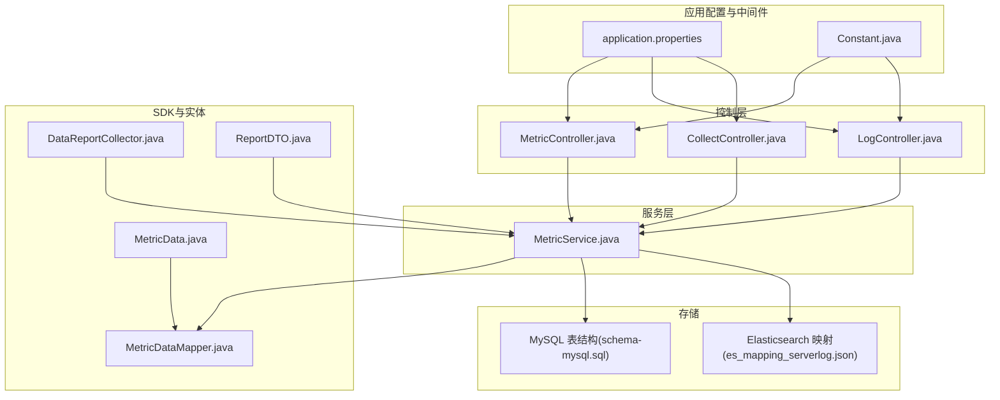
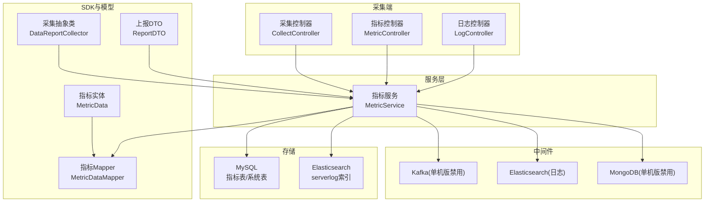
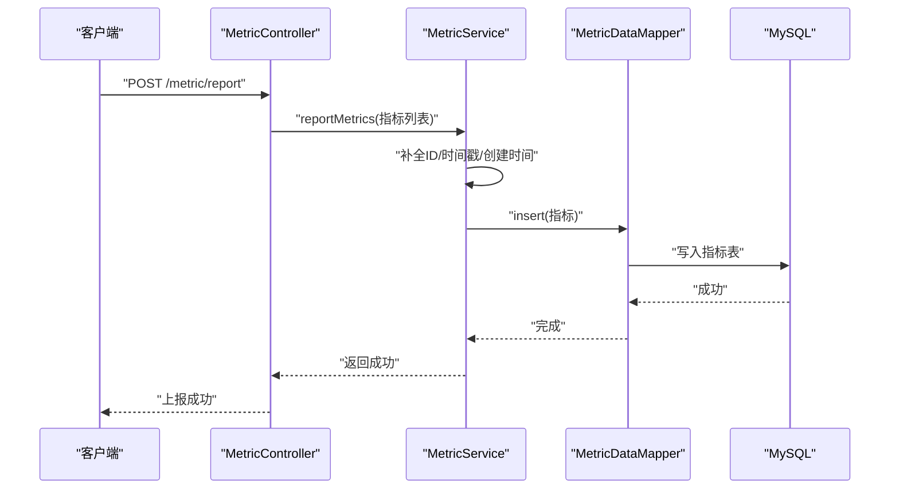
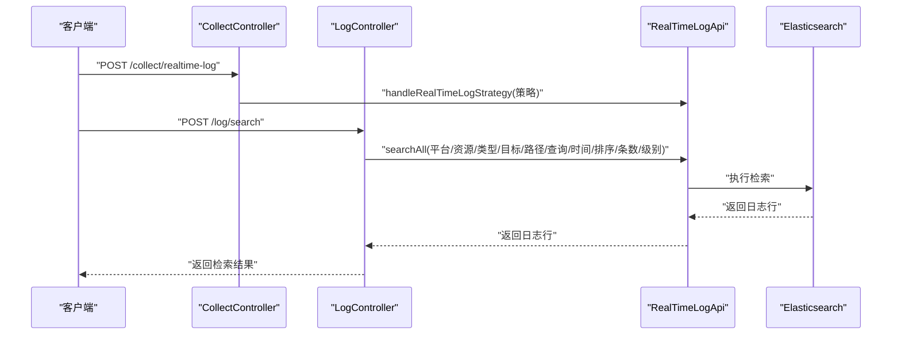
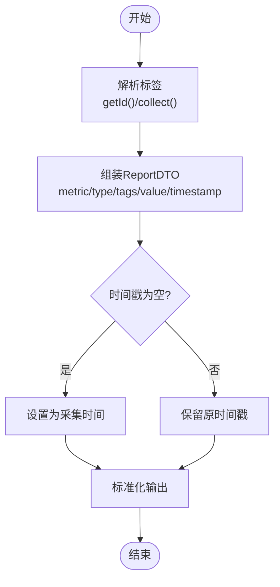
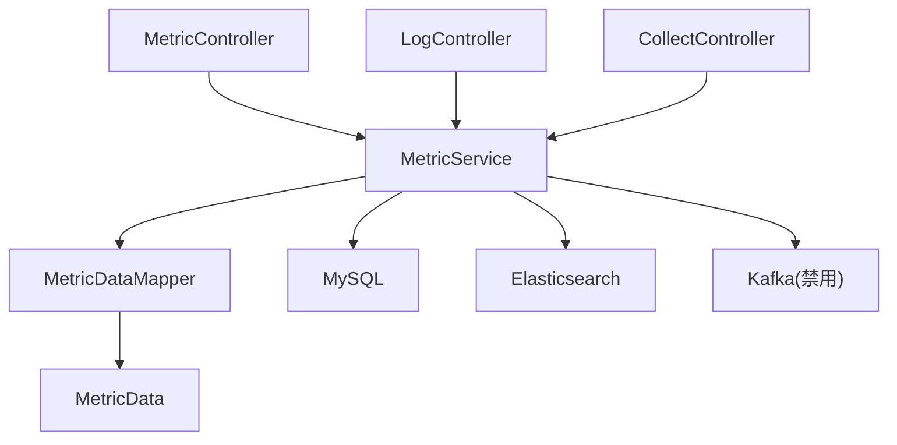

# 数据流架构

<cite>
**本文引用的文件**
- [application.properties](file://watcher-agent/src/main/resources/application.properties)
- [schema-mysql.sql](file://watcher-agent/src/main/resources/schema-mysql.sql)
- [es_mapping_serverlog.json](file://watcher-agent/src/main/resources/es_mapping_serverlog.json)
- [MetricController.java](file://watcher-agent/src/main/java/com/virtual/cloud/om/agent/controller/MetricController.java)
- [LogController.java](file://watcher-agent/src/main/java/com/virtual/cloud/om/agent/controller/LogController.java)
- [CollectController.java](file://watcher-agent/src/main/java/com/virtual/cloud/om/agent/controller/CollectController.java)
- [MetricService.java](file://watcher-agent/src/main/java/com/virtual/cloud/om/agent/service/report/MetricService.java)
- [DataReportCollector.java](file://watcher-sdk/src/main/java/com/virtual/cloud/om/sdk/api/DataReportCollector.java)
- [ReportDTO.java](file://watcher-sdk/src/main/java/com/virtual/cloud/om/sdk/dto/dataReport/workspace/ReportDTO.java)
- [MetricData.java](file://watcher-sdk/src/main/java/com/virtual/cloud/om/sdk/entity/mysql/MetricData.java)
- [MetricDataMapper.java](file://watcher-sdk/src/main/java/com/virtual/cloud/om/sdk/mapper/MetricDataMapper.java)
- [KafkaConsumerUtil.java](file://watcher-sdk/src/main/java/com/virtual/cloud/om/sdk/utils/KafkaConsumerUtil.java)
- [Constant.java](file://watcher-sdk/src/main/java/com/virtual/cloud/om/sdk/constant/Constant.java)
- [KafkaConsumerOffsetLog.java](file://watcher-agent/src/main/java/com/virtual/cloud/om/agent/entity/KafkaConsumerOffsetLog.java)
</cite>

## 目录
1. [简介](#简介)
2. [项目结构](#项目结构)
3. [核心组件](#核心组件)
4. [架构总览](#架构总览)
5. [详细组件分析](#详细组件分析)
6. [依赖分析](#依赖分析)
7. [性能考量](#性能考量)
8. [故障排查指南](#故障排查指南)
9. [结论](#结论)
10. [附录](#附录)

## 简介
本文件面向ShowTime监控系统，聚焦“数据流架构”，系统性梳理从数据采集、指标与日志上报、数据传输、存储与查询的完整链路，并结合仓库中实际实现说明多数据库与中间件的角色分工、Kafka在单机版中的状态与限制、以及数据转换与清洗的关键环节。文档同时提供多种可视化图示，帮助开发者快速理解数据在系统中的运动轨迹。

## 项目结构
围绕数据流，系统主要由以下部分构成：
- 应用配置与中间件开关：集中于应用配置文件，定义MySQL数据源、中间件开关（如Kafka、Elasticsearch、MongoDB等）及插件服务地址。
- 控制层：提供指标查询、日志检索、资源与部署相关接口。
- 服务层：封装指标查询、实时采集、数据库访问与资源校验等逻辑。
- SDK与实体：定义指标数据模型、上报DTO、采集抽象类、常量与工具。
- 数据库脚本：定义MySQL表结构与索引，支撑指标与系统基础数据持久化。
- 搜索引擎映射：定义Elasticsearch索引映射，支撑日志检索场景。

图表来源
- [application.properties:1-80](file://watcher-agent/src/main/resources/application.properties#L1-L80)
- [MetricController.java:1-103](file://watcher-agent/src/main/java/com/virtual/cloud/om/agent/controller/MetricController.java#L1-L103)
- [LogController.java:1-36](file://watcher-agent/src/main/java/com/virtual/cloud/om/agent/controller/LogController.java#L1-L36)
- [CollectController.java:1-67](file://watcher-agent/src/main/java/com/virtual/cloud/om/agent/controller/CollectController.java#L1-L67)
- [MetricService.java:1-266](file://watcher-agent/src/main/java/com/virtual/cloud/om/agent/service/report/MetricService.java#L1-L266)
- [DataReportCollector.java:1-118](file://watcher-sdk/src/main/java/com/virtual/cloud/om/sdk/api/DataReportCollector.java#L1-L118)
- [ReportDTO.java:1-25](file://watcher-sdk/src/main/java/com/virtual/cloud/om/sdk/dto/dataReport/workspace/ReportDTO.java#L1-L25)
- [MetricData.java:1-43](file://watcher-sdk/src/main/java/com/virtual/cloud/om/sdk/entity/mysql/MetricData.java#L1-L43)
- [MetricDataMapper.java:1-14](file://watcher-sdk/src/main/java/com/virtual/cloud/om/sdk/mapper/MetricDataMapper.java#L1-L14)
- [schema-mysql.sql:1-204](file://watcher-agent/src/main/resources/schema-mysql.sql#L1-L204)
- [es_mapping_serverlog.json:1-155](file://watcher-agent/src/main/resources/es_mapping_serverlog.json#L1-L155)
- [Constant.java:1-312](file://watcher-sdk/src/main/java/com/virtual/cloud/om/sdk/constant/Constant.java#L1-L312)

章节来源
- [application.properties:1-80](file://watcher-agent/src/main/resources/application.properties#L1-L80)
- [schema-mysql.sql:1-204](file://watcher-agent/src/main/resources/schema-mysql.sql#L1-L204)
- [es_mapping_serverlog.json:1-155](file://watcher-agent/src/main/resources/es_mapping_serverlog.json#L1-L155)

## 核心组件
- 指标控制器与服务
  - 指标查询接口：支持按资源、平台、指标类型、时间范围查询；支持获取最新指标与趋势数据；支持上报指标并入库。
  - 指标服务：负责指标类型与平台枚举、实时采集与数据库查询、汇总统计与资源存在性校验。
- 日志控制器与服务
  - 日志检索接口：基于平台、资源、类型、目标、路径、查询条件、时间范围、排序与条数进行在线检索。
  - 日志服务：通过SDK提供的实时日志能力完成检索与返回。
- 采集控制器
  - 资源同步与批量部署接口：对接资源服务与部署API，支持资源同步与批量部署。
- 数据采集抽象与上报DTO
  - 采集抽象类：统一采集流程、标签解析、时间戳处理与上报结构生成。
  - 上报DTO：定义指标上报的数据结构，包含指标类型、值类型、标签、批次号、值与时间戳。
- MySQL实体与Mapper
  - 指标数据实体：映射指标数据表，包含资源ID、平台、指标类型、值、单位、标签与上报时间等。
  - Mapper接口：MyBatis-Plus基础映射，支撑指标数据的增删改查。
- 中间件与常量
  - 常量：定义Kafka主题、Elasticsearch索引别名、日志目标类型等。
  - Kafka消费者工具：在单机版中通过配置条件禁用，表明当前版本不启用Kafka消费。

章节来源
- [MetricController.java:1-103](file://watcher-agent/src/main/java/com/virtual/cloud/om/agent/controller/MetricController.java#L1-L103)
- [MetricService.java:1-266](file://watcher-agent/src/main/java/com/virtual/cloud/om/agent/service/report/MetricService.java#L1-L266)
- [LogController.java:1-36](file://watcher-agent/src/main/java/com/virtual/cloud/om/agent/controller/LogController.java#L1-L36)
- [CollectController.java:1-67](file://watcher-agent/src/main/java/com/virtual/cloud/om/agent/controller/CollectController.java#L1-L67)
- [DataReportCollector.java:1-118](file://watcher-sdk/src/main/java/com/virtual/cloud/om/sdk/api/DataReportCollector.java#L1-L118)
- [ReportDTO.java:1-25](file://watcher-sdk/src/main/java/com/virtual/cloud/om/sdk/dto/dataReport/workspace/ReportDTO.java#L1-L25)
- [MetricData.java:1-43](file://watcher-sdk/src/main/java/com/virtual/cloud/om/sdk/entity/mysql/MetricData.java#L1-L43)
- [MetricDataMapper.java:1-14](file://watcher-sdk/src/main/java/com/virtual/cloud/om/sdk/mapper/MetricDataMapper.java#L1-L14)
- [Constant.java:1-312](file://watcher-sdk/src/main/java/com/virtual/cloud/om/sdk/constant/Constant.java#L1-L312)
- [KafkaConsumerUtil.java:1-15](file://watcher-sdk/src/main/java/com/virtual/cloud/om/sdk/utils/KafkaConsumerUtil.java#L1-L15)

## 架构总览
下图展示了从采集端到存储与查询的整体数据流，涵盖指标与日志两条主线，并标注了中间件开关与存储角色：

图表来源
- [application.properties:14-28](file://watcher-agent/src/main/resources/application.properties#L14-L28)
- [MetricController.java:1-103](file://watcher-agent/src/main/java/com/virtual/cloud/om/agent/controller/MetricController.java#L1-L103)
- [LogController.java:1-36](file://watcher-agent/src/main/java/com/virtual/cloud/om/agent/controller/LogController.java#L1-L36)
- [CollectController.java:1-67](file://watcher-agent/src/main/java/com/virtual/cloud/om/agent/controller/CollectController.java#L1-L67)
- [MetricService.java:1-266](file://watcher-agent/src/main/java/com/virtual/cloud/om/agent/service/report/MetricService.java#L1-L266)
- [DataReportCollector.java:1-118](file://watcher-sdk/src/main/java/com/virtual/cloud/om/sdk/api/DataReportCollector.java#L1-L118)
- [ReportDTO.java:1-25](file://watcher-sdk/src/main/java/com/virtual/cloud/om/sdk/dto/dataReport/workspace/ReportDTO.java#L1-L25)
- [MetricData.java:1-43](file://watcher-sdk/src/main/java/com/virtual/cloud/om/sdk/entity/mysql/MetricData.java#L1-L43)
- [MetricDataMapper.java:1-14](file://watcher-sdk/src/main/java/com/virtual/cloud/om/sdk/mapper/MetricDataMapper.java#L1-L14)
- [schema-mysql.sql:182-204](file://watcher-agent/src/main/resources/schema-mysql.sql#L182-L204)
- [es_mapping_serverlog.json:1-155](file://watcher-agent/src/main/resources/es_mapping_serverlog.json#L1-L155)
- [KafkaConsumerUtil.java:1-15](file://watcher-sdk/src/main/java/com/virtual/cloud/om/sdk/utils/KafkaConsumerUtil.java#L1-L15)

## 详细组件分析

### 指标数据流（采集-入库-查询）
- 采集与上报
  - 采集端通过指标控制器接收上报请求，服务层对每条指标进行ID、创建时间、上报时间补全后写入MySQL指标表。
  - 实时查询时，若提供资源ID与指标类型，则调用SDK采集服务进行实时采集；否则走数据库查询路径。
- 存储与索引
  - 指标表包含资源ID、平台、指标类型、值、单位、标签与上报时间等字段，并建立多维度索引以支撑查询与趋势分析。
- 查询与趋势
  - 支持按资源、平台、指标类型与时间范围查询；支持获取最新指标与指定小时内的趋势数据；支持汇总统计与资源存在性校验。

图表来源
- [MetricController.java:80-91](file://watcher-agent/src/main/java/com/virtual/cloud/om/agent/controller/MetricController.java#L80-L91)
- [MetricService.java:212-226](file://watcher-agent/src/main/java/com/virtual/cloud/om/agent/service/report/MetricService.java#L212-L226)
- [MetricDataMapper.java:1-14](file://watcher-sdk/src/main/java/com/virtual/cloud/om/sdk/mapper/MetricDataMapper.java#L1-L14)
- [schema-mysql.sql:182-204](file://watcher-agent/src/main/resources/schema-mysql.sql#L182-L204)

章节来源
- [MetricController.java:1-103](file://watcher-agent/src/main/java/com/virtual/cloud/om/agent/controller/MetricController.java#L1-L103)
- [MetricService.java:1-266](file://watcher-agent/src/main/java/com/virtual/cloud/om/agent/service/report/MetricService.java#L1-L266)
- [schema-mysql.sql:182-204](file://watcher-agent/src/main/resources/schema-mysql.sql#L182-L204)

### 日志检索数据流（实时策略-检索-返回）
- 实时策略下发
  - 采集控制器提供实时日志策略下发接口，服务层委托给实时日志API处理。
- 在线检索
  - 日志控制器接收检索请求，调用实时日志API进行跨平台、跨资源、跨类型的日志检索，返回日志行集合。
- 存储与查询
  - Elasticsearch索引映射定义了日志字段类型与分词器，支持按平台、资源ID、路径、关键字等条件检索。

图表来源
- [CollectController.java:45-51](file://watcher-agent/src/main/java/com/virtual/cloud/om/agent/controller/CollectController.java#L45-L51)
- [LogController.java:27-34](file://watcher-agent/src/main/java/com/virtual/cloud/om/agent/controller/LogController.java#L27-L34)
- [es_mapping_serverlog.json:1-155](file://watcher-agent/src/main/resources/es_mapping_serverlog.json#L1-L155)
- [Constant.java:212-220](file://watcher-sdk/src/main/java/com/virtual/cloud/om/sdk/constant/Constant.java#L212-L220)

章节来源
- [CollectController.java:1-67](file://watcher-agent/src/main/java/com/virtual/cloud/om/agent/controller/CollectController.java#L1-L67)
- [LogController.java:1-36](file://watcher-agent/src/main/java/com/virtual/cloud/om/agent/controller/LogController.java#L1-L36)
- [es_mapping_serverlog.json:1-155](file://watcher-agent/src/main/resources/es_mapping_serverlog.json#L1-L155)
- [Constant.java:1-312](file://watcher-sdk/src/main/java/com/virtual/cloud/om/sdk/constant/Constant.java#L1-L312)

### 数据采集抽象与清洗
- 采集抽象类
  - 统一采集入口，解析标签、调用具体采集方法、组装上报DTO、填充时间戳，确保上报结构一致。
- 上报DTO
  - 定义指标类型、值类型、标签、批次号、值与时间戳，作为跨模块传递的标准载体。
- 清洗与标准化
  - 时间戳缺失时自动回填采集时间；空值处理与结构标准化由采集抽象类统一完成。
- 异常处理
  - 采集与查询过程中均包含异常捕获与日志记录，保障流程健壮性。

图表来源
- [DataReportCollector.java:27-86](file://watcher-sdk/src/main/java/com/virtual/cloud/om/sdk/api/DataReportCollector.java#L27-L86)
- [ReportDTO.java:1-25](file://watcher-sdk/src/main/java/com/virtual/cloud/om/sdk/dto/dataReport/workspace/ReportDTO.java#L1-L25)

章节来源
- [DataReportCollector.java:1-118](file://watcher-sdk/src/main/java/com/virtual/cloud/om/sdk/api/DataReportCollector.java#L1-L118)
- [ReportDTO.java:1-25](file://watcher-sdk/src/main/java/com/virtual/cloud/om/sdk/dto/dataReport/workspace/ReportDTO.java#L1-L25)

### 多数据库与中间件角色分工
- MySQL（指标与系统表）
  - 指标数据表：存储指标值、单位、标签、上报时间等，支撑查询、趋势与汇总。
  - 系统表：用户、资源、参数、任务、部署、操作日志、告警等基础数据。
- Elasticsearch（日志检索）
  - serverlog索引映射定义字段类型与分词器，支撑日志全文检索与聚合。
- MongoDB（单机版禁用）
  - 当前配置中MongoDB处于禁用状态，未参与数据流。
- Kafka（单机版禁用）
  - Kafka消费者工具类在单机版中被条件禁用，表明当前版本不启用Kafka消费；生产者侧常量定义了主题名称，便于后续扩展。

章节来源
- [schema-mysql.sql:1-204](file://watcher-agent/src/main/resources/schema-mysql.sql#L1-L204)
- [es_mapping_serverlog.json:1-155](file://watcher-agent/src/main/resources/es_mapping_serverlog.json#L1-L155)
- [application.properties:14-28](file://watcher-agent/src/main/resources/application.properties#L14-L28)
- [KafkaConsumerUtil.java:1-15](file://watcher-sdk/src/main/java/com/virtual/cloud/om/sdk/utils/KafkaConsumerUtil.java#L1-L15)
- [Constant.java:22-26](file://watcher-sdk/src/main/java/com/virtual/cloud/om/sdk/constant/Constant.java#L22-L26)

## 依赖分析
- 控制层依赖服务层，服务层依赖Mapper与实体，Mapper依赖MyBatis-Plus与数据库。
- 日志与指标分别通过各自的控制器进入服务层，服务层根据输入参数选择实时采集或数据库查询路径。
- 中间件开关集中于应用配置，影响功能启用与运行时行为。

图表来源
- [MetricController.java:1-103](file://watcher-agent/src/main/java/com/virtual/cloud/om/agent/controller/MetricController.java#L1-L103)
- [LogController.java:1-36](file://watcher-agent/src/main/java/com/virtual/cloud/om/agent/controller/LogController.java#L1-L36)
- [CollectController.java:1-67](file://watcher-agent/src/main/java/com/virtual/cloud/om/agent/controller/CollectController.java#L1-L67)
- [MetricService.java:1-266](file://watcher-agent/src/main/java/com/virtual/cloud/om/agent/service/report/MetricService.java#L1-L266)
- [MetricDataMapper.java:1-14](file://watcher-sdk/src/main/java/com/virtual/cloud/om/sdk/mapper/MetricDataMapper.java#L1-L14)
- [MetricData.java:1-43](file://watcher-sdk/src/main/java/com/virtual/cloud/om/sdk/entity/mysql/MetricData.java#L1-L43)
- [application.properties:14-28](file://watcher-agent/src/main/resources/application.properties#L14-L28)

章节来源
- [MetricController.java:1-103](file://watcher-agent/src/main/java/com/virtual/cloud/om/agent/controller/MetricController.java#L1-L103)
- [LogController.java:1-36](file://watcher-agent/src/main/java/com/virtual/cloud/om/agent/controller/LogController.java#L1-L36)
- [CollectController.java:1-67](file://watcher-agent/src/main/java/com/virtual/cloud/om/agent/controller/CollectController.java#L1-L67)
- [MetricService.java:1-266](file://watcher-agent/src/main/java/com/virtual/cloud/om/agent/service/report/MetricService.java#L1-L266)
- [MetricDataMapper.java:1-14](file://watcher-sdk/src/main/java/com/virtual/cloud/om/sdk/mapper/MetricDataMapper.java#L1-L14)
- [MetricData.java:1-43](file://watcher-sdk/src/main/java/com/virtual/cloud/om/sdk/entity/mysql/MetricData.java#L1-L43)
- [application.properties:14-28](file://watcher-agent/src/main/resources/application.properties#L14-L28)

## 性能考量
- 索引优化
  - 指标表针对资源ID、指标类型、上报时间、平台建立索引，有助于查询与趋势分析的性能提升。
- 查询范围控制
  - 控制器与服务层支持按时间范围、资源ID、指标类型过滤，建议前端传入合理的时间窗口与筛选条件，避免全表扫描。
- 实时采集与缓存
  - 对频繁查询的最新指标可考虑在应用层做短期缓存，减少数据库压力。
- 日志检索
  - Elasticsearch分词与字段类型配置需与查询模式匹配，避免过度分词导致查询变慢。

章节来源
- [schema-mysql.sql:200-204](file://watcher-agent/src/main/resources/schema-mysql.sql#L200-L204)
- [MetricController.java:41-78](file://watcher-agent/src/main/java/com/virtual/cloud/om/agent/controller/MetricController.java#L41-L78)
- [MetricService.java:118-158](file://watcher-agent/src/main/java/com/virtual/cloud/om/agent/service/report/MetricService.java#L118-L158)

## 故障排查指南
- Kafka相关
  - 单机版中Kafka消费者工具类被禁用，若业务需要消息队列，请检查配置开关与服务部署状态。
  - 若启用Kafka，可关注消费者偏移量记录实体，辅助定位消费进度与异常。
- MySQL相关
  - 检查指标表与系统表是否存在、索引是否生效；确认连接参数与驱动配置正确。
- Elasticsearch相关
  - 确认serverlog索引映射与别名配置正确；检查索引健康状态与分片副本设置。
- 日志检索
  - 核对检索参数（平台、资源、类型、路径、关键字、时间范围、排序方向），确保查询条件合理。
- 采集与上报
  - 关注采集抽象类的日志输出，确认标签解析与时间戳填充逻辑正常；检查上报DTO结构是否符合预期。

章节来源
- [KafkaConsumerUtil.java:1-15](file://watcher-sdk/src/main/java/com/virtual/cloud/om/sdk/utils/KafkaConsumerUtil.java#L1-L15)
- [KafkaConsumerOffsetLog.java:1-42](file://watcher-agent/src/main/java/com/virtual/cloud/om/agent/entity/KafkaConsumerOffsetLog.java#L1-L42)
- [schema-mysql.sql:1-204](file://watcher-agent/src/main/resources/schema-mysql.sql#L1-L204)
- [es_mapping_serverlog.json:1-155](file://watcher-agent/src/main/resources/es_mapping_serverlog.json#L1-L155)
- [LogController.java:27-34](file://watcher-agent/src/main/java/com/virtual/cloud/om/agent/controller/LogController.java#L27-L34)
- [DataReportCollector.java:52-86](file://watcher-sdk/src/main/java/com/virtual/cloud/om/sdk/api/DataReportCollector.java#L52-L86)

## 结论
ShowTime监控系统在当前单机版配置下，采用MySQL作为主要存储，Elasticsearch支撑日志检索，Kafka与MongoDB处于禁用状态。数据流从采集端的控制器进入服务层，经过采集抽象与DTO标准化，最终落库或返回查询结果。通过合理的索引设计与查询参数控制，可在保证功能完整性的同时兼顾性能。未来如需引入消息队列或分布式存储，可基于现有常量与配置扩展。

## 附录
- 关键配置项
  - 中间件开关：elasticsearch.enable、kafka.enable、mongodb.enable、clickhouse.enable、quartz.enable。
  - 数据源：spring.datasource.* 与 MyBatis-Plus 配置。
  - 插件服务地址：cas.*/uis.*/ws.*/onestor.* 服务URL。
- 常量与主题
  - Kafka主题：topic-log-receiver、topic-filebeat-receiver。
  - Elasticsearch索引：serverlog、serverlog.aliases。

章节来源
- [application.properties:14-70](file://watcher-agent/src/main/resources/application.properties#L14-L70)
- [Constant.java:22-26](file://watcher-sdk/src/main/java/com/virtual/cloud/om/sdk/constant/Constant.java#L22-L26)
- [Constant.java:212-220](file://watcher-sdk/src/main/java/com/virtual/cloud/om/sdk/constant/Constant.java#L212-L220)