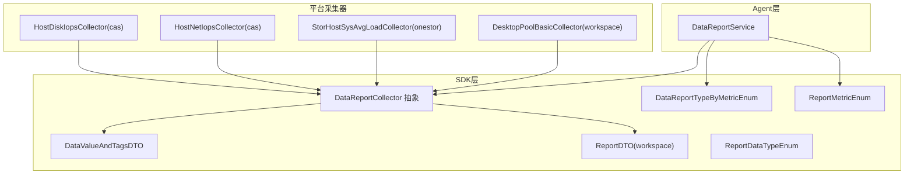
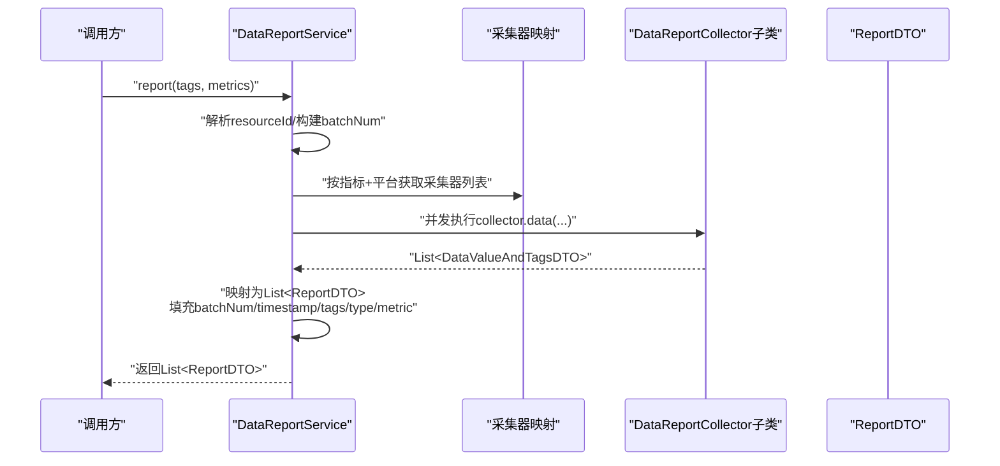
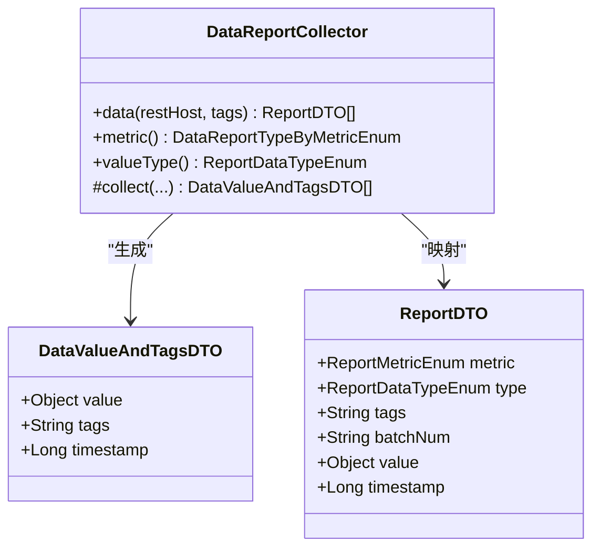
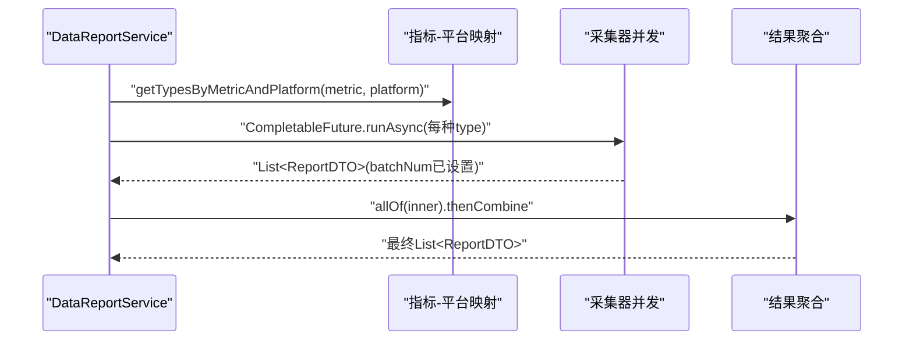
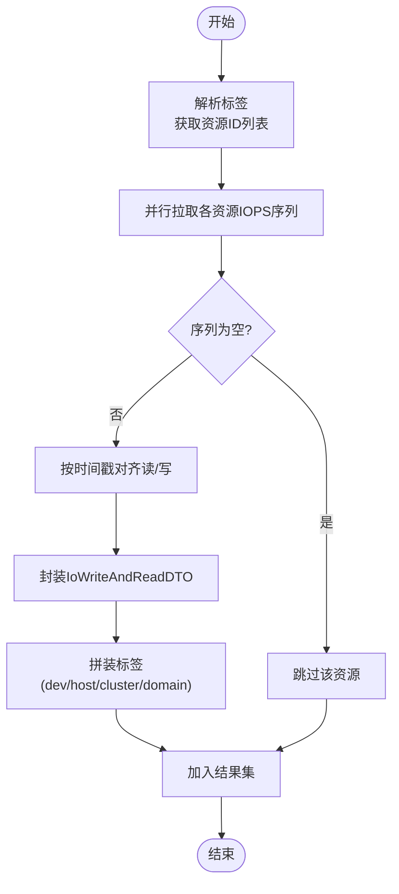
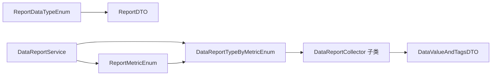

# 数据转换管道

<cite>
**本文引用的文件**
- [DataReportCollector.java](file://watcher-sdk/src/main/java/com/virtual/cloud/om/sdk/api/DataReportCollector.java)
- [DataValueAndTagsDTO.java](file://watcher-sdk/src/main/java/com/virtual/cloud/om/sdk/dto/dataReport/DataValueAndTagsDTO.java)
- [ReportDTO.java（workspace）](file://watcher-sdk/src/main/java/com/virtual/cloud/om/sdk/dto/dataReport/workspace/ReportDTO.java)
- [ReportMetricEnum.java](file://watcher-sdk/src/main/java/com/virtual/cloud/om/sdk/constant/report/ReportMetricEnum.java)
- [DataReportTypeByMetricEnum.java](file://watcher-sdk/src/main/java/com/virtual/cloud/om/sdk/constant/DataReportTypeByMetricEnum.java)
- [ReportDataTypeEnum.java](file://watcher-sdk/src/main/java/com/virtual/cloud/om/sdk/constant/report/ReportDataTypeEnum.java)
- [DataReportService.java](file://watcher-agent/src/main/java/com/virtual/cloud/om/agent/service/report/DataReportService.java)
- [HostDiskIopsCollector.java](file://watcher-cas/src/main/java/com/virtual/cloud/om/cas/service/severPerformanceMonitor/HostDiskIopsCollector.java)
- [HostNetIopsCollector.java](file://watcher-cas/src/main/java/com/virtual/cloud/om/cas/service/severPerformanceMonitor/HostNetIopsCollector.java)
- [StorHostSysAvgLoadCollector.java](file://watcher-onestor/src/main/java/com/virtual/cloud/om/onestor/service/report/monitor/host/StorHostSysAvgLoadCollector.java)
- [DesktopPoolBasicCollector.java](file://watcher-workspace/src/main/java/com/virtual/cloud/om/workspace/service/report/DesktopPoolBasicCollector.java)
- [DataReportAspect.java](file://watcher-sdk/src/main/java/com/virtual/cloud/om/sdk/aop/DataReportAspect.java)
- [StringManager.java](file://watcher-sdk/src/main/java/com/virtual/cloud/om/sdk/utils/StringManager.java)
</cite>

## 目录
1. [简介](#简介)
2. [项目结构](#项目结构)
3. [核心组件](#核心组件)
4. [架构总览](#架构总览)
5. [详细组件分析](#详细组件分析)
6. [依赖分析](#依赖分析)
7. [性能考量](#性能考量)
8. [故障排查指南](#故障排查指南)
9. [结论](#结论)
10. [附录](#附录)

## 简介
本文件面向ShowTime监控系统的“数据转换管道”，系统性阐述从原始采集数据到标准报告数据的转换流程，覆盖以下方面：
- 数据格式标准化、字段映射与类型转换
- 数据清洗与验证机制（空值处理、异常过滤、完整性检查）
- 批量数据处理优化（内存管理、分页与并发控制）
- 聚合与统计（时间窗口聚合、滚动统计、趋势分析）
- 性能监控与错误处理（重试与回滚策略）

## 项目结构
围绕数据转换管道的关键模块分布如下：
- SDK层：定义通用采集抽象、数据模型与枚举常量
- Agent层：调度与并发执行采集任务，组装标准报告
- 平台采集器：按平台与指标实现具体采集逻辑
- AOP与工具：提供清洗与校验能力

图表来源
- [DataReportCollector.java:1-118](file://watcher-sdk/src/main/java/com/virtual/cloud/om/sdk/api/DataReportCollector.java#L1-L118)
- [DataValueAndTagsDTO.java:1-17](file://watcher-sdk/src/main/java/com/virtual/cloud/om/sdk/dto/dataReport/DataValueAndTagsDTO.java#L1-L17)
- [ReportDTO.java（workspace）:1-25](file://watcher-sdk/src/main/java/com/virtual/cloud/om/sdk/dto/dataReport/workspace/ReportDTO.java#L1-L25)
- [ReportMetricEnum.java:1-118](file://watcher-sdk/src/main/java/com/virtual/cloud/om/sdk/constant/report/ReportMetricEnum.java#L1-L118)
- [DataReportTypeByMetricEnum.java:1-190](file://watcher-sdk/src/main/java/com/virtual/cloud/om/sdk/constant/DataReportTypeByMetricEnum.java#L1-L190)
- [ReportDataTypeEnum.java:1-17](file://watcher-sdk/src/main/java/com/virtual/cloud/om/sdk/constant/report/ReportDataTypeEnum.java#L1-L17)
- [DataReportService.java:1-334](file://watcher-agent/src/main/java/com/virtual/cloud/om/agent/service/report/DataReportService.java#L1-L334)
- [HostDiskIopsCollector.java:1-224](file://watcher-cas/src/main/java/com/virtual/cloud/om/cas/service/severPerformanceMonitor/HostDiskIopsCollector.java#L1-L224)
- [HostNetIopsCollector.java:116-150](file://watcher-cas/src/main/java/com/virtual/cloud/om/cas/service/severPerformanceMonitor/HostNetIopsCollector.java#L116-L150)
- [StorHostSysAvgLoadCollector.java:1-114](file://watcher-onestor/src/main/java/com/virtual/cloud/om/onestor/service/report/monitor/host/StorHostSysAvgLoadCollector.java#L1-L114)
- [DesktopPoolBasicCollector.java:1-150](file://watcher-workspace/src/main/java/com/virtual/cloud/om/workspace/service/report/DesktopPoolBasicCollector.java#L1-L150)

章节来源
- [DataReportCollector.java:1-118](file://watcher-sdk/src/main/java/com/virtual/cloud/om/sdk/api/DataReportCollector.java#L1-L118)
- [DataReportService.java:1-334](file://watcher-agent/src/main/java/com/virtual/cloud/om/agent/service/report/DataReportService.java#L1-L334)

## 核心组件
- 采集抽象与数据模型
  - DataReportCollector：定义采集入口、标准化输出（ReportDTO），并负责将DataValueAndTagsDTO映射为ReportDTO
  - DataValueAndTagsDTO：承载单条采集值、标签与时间戳
  - ReportDTO：标准上报载体，包含指标类型、值类型、标签、批次号与时间戳
  - 枚举体系：ReportMetricEnum（指标）、DataReportTypeByMetricEnum（指标-平台映射）、ReportDataTypeEnum（值类型）
- Agent调度与并发
  - DataReportService：解析标签、选择采集器、并发执行、合并结果、设置批次号与时间戳，并记录错误

章节来源
- [DataReportCollector.java:48-86](file://watcher-sdk/src/main/java/com/virtual/cloud/om/sdk/api/DataReportCollector.java#L48-L86)
- [DataValueAndTagsDTO.java:9-16](file://watcher-sdk/src/main/java/com/virtual/cloud/om/sdk/dto/dataReport/DataValueAndTagsDTO.java#L9-L16)
- [ReportDTO.java（workspace）:11-24](file://watcher-sdk/src/main/java/com/virtual/cloud/om/sdk/dto/dataReport/workspace/ReportDTO.java#L11-L24)
- [ReportMetricEnum.java:9-118](file://watcher-sdk/src/main/java/com/virtual/cloud/om/sdk/constant/report/ReportMetricEnum.java#L9-L118)
- [DataReportTypeByMetricEnum.java:169-186](file://watcher-sdk/src/main/java/com/virtual/cloud/om/sdk/constant/DataReportTypeByMetricEnum.java#L169-L186)
- [ReportDataTypeEnum.java:3-17](file://watcher-sdk/src/main/java/com/virtual/cloud/om/sdk/constant/report/ReportDataTypeEnum.java#L3-L17)
- [DataReportService.java:115-140](file://watcher-agent/src/main/java/com/virtual/cloud/om/agent/service/report/DataReportService.java#L115-L140)

## 架构总览
数据转换管道的端到端流程如下：

图表来源
- [DataReportService.java:188-230](file://watcher-agent/src/main/java/com/virtual/cloud/om/agent/service/report/DataReportService.java#L188-L230)
- [DataReportCollector.java:48-86](file://watcher-sdk/src/main/java/com/virtual/cloud/om/sdk/api/DataReportCollector.java#L48-L86)
- [DataReportTypeByMetricEnum.java:177-186](file://watcher-sdk/src/main/java/com/virtual/cloud/om/sdk/constant/DataReportTypeByMetricEnum.java#L177-L186)

## 详细组件分析

### 组件A：采集抽象与标准化（DataReportCollector）
- 职责
  - 将平台特定采集结果封装为DataValueAndTagsDTO
  - 统一映射为ReportDTO，填充指标类型、值类型、标签、时间戳等
  - 对空结果进行兜底（空值列表）
- 关键点
  - 时间戳处理：若采集器未提供，统一回填采集时刻
  - 值类型：由子类声明，决定ReportDTO.type与value结构
  - 指标枚举：由子类声明，决定ReportDTO.metric

图表来源
- [DataReportCollector.java:48-86](file://watcher-sdk/src/main/java/com/virtual/cloud/om/sdk/api/DataReportCollector.java#L48-L86)
- [DataValueAndTagsDTO.java:9-16](file://watcher-sdk/src/main/java/com/virtual/cloud/om/sdk/dto/dataReport/DataValueAndTagsDTO.java#L9-L16)
- [ReportDTO.java（workspace）:11-24](file://watcher-sdk/src/main/java/com/virtual/cloud/om/sdk/dto/dataReport/workspace/ReportDTO.java#L11-L24)

章节来源
- [DataReportCollector.java:48-86](file://watcher-sdk/src/main/java/com/virtual/cloud/om/sdk/api/DataReportCollector.java#L48-L86)

### 组件B：Agent调度与并发（DataReportService）
- 职责
  - 解析标签，确定resourceId与batchNum
  - 根据指标与平台选择采集器集合
  - 并发执行，合并结果，设置batchNum与timestamp
  - 错误收集与上报
- 并发策略
  - 使用CompletableFuture分层并发：外层按指标并发，内层按资源维度并发
  - 设置线程上下文类加载器以避免JAXB类加载问题
- 批次与时间戳
  - batchNum按分钟级生成，便于批处理与去重
  - 未显式设置timestamp时回填采集时刻

图表来源
- [DataReportService.java:188-230](file://watcher-agent/src/main/java/com/virtual/cloud/om/agent/service/report/DataReportService.java#L188-L230)
- [DataReportTypeByMetricEnum.java:177-186](file://watcher-sdk/src/main/java/com/virtual/cloud/om/sdk/constant/DataReportTypeByMetricEnum.java#L177-L186)

章节来源
- [DataReportService.java:115-140](file://watcher-agent/src/main/java/com/virtual/cloud/om/agent/service/report/DataReportService.java#L115-L140)
- [DataReportService.java:188-230](file://watcher-agent/src/main/java/com/virtual/cloud/om/agent/service/report/DataReportService.java#L188-L230)

### 组件C：CAS磁盘IOPS采集（HostDiskIopsCollector）
- 功能
  - 支持按集群、主机、域三种粒度采集磁盘读写IOPS
  - 通过时间序列匹配同一时刻的读/写速率，封装为IoWriteAndReadDTO
  - 并行拉取各资源的IOPS序列，合并为DataValueAndTagsDTO列表
- 清洗与验证
  - 过滤空序列与异常请求
  - 通过时间戳对齐，确保读写在同一时刻

图表来源
- [HostDiskIopsCollector.java:58-96](file://watcher-cas/src/main/java/com/virtual/cloud/om/cas/service/severPerformanceMonitor/HostDiskIopsCollector.java#L58-L96)
- [HostDiskIopsCollector.java:174-195](file://watcher-cas/src/main/java/com/virtual/cloud/om/cas/service/severPerformanceMonitor/HostDiskIopsCollector.java#L174-L195)

章节来源
- [HostDiskIopsCollector.java:58-96](file://watcher-cas/src/main/java/com/virtual/cloud/om/cas/service/severPerformanceMonitor/HostDiskIopsCollector.java#L58-L96)
- [HostDiskIopsCollector.java:174-195](file://watcher-cas/src/main/java/com/virtual/cloud/om/cas/service/severPerformanceMonitor/HostDiskIopsCollector.java#L174-L195)

### 组件D：CAS网络收发对比（HostNetIopsCollector）
- 功能
  - 从趋势序列中分离“发送/接收”两类速率
  - 按时间戳对齐，构造SendAndReceiveDTO
  - 生成DataValueAndTagsDTO并附带设备标签
- 并发
  - 使用parallelStream提升多设备处理效率

章节来源
- [HostNetIopsCollector.java:116-150](file://watcher-cas/src/main/java/com/virtual/cloud/om/cas/service/severPerformanceMonitor/HostNetIopsCollector.java#L116-L150)

### 组件E：OneStor主机系统负载（StorHostSysAvgLoadCollector）
- 功能
  - 从集群角色信息中遍历主机，拉取1/5/15分钟loadavg序列
  - 取最新时刻值封装为OnestorAvgDTO
- 清洗
  - 对空序列赋默认值0.0

章节来源
- [StorHostSysAvgLoadCollector.java:56-95](file://watcher-onestor/src/main/java/com/virtual/cloud/om/onestor/service/report/monitor/host/StorHostSysAvgLoadCollector.java#L56-L95)

### 组件F：Workspace桌面池基础（DesktopPoolBasicCollector）
- 功能
  - 并行拉取桌面池列表，逐池补充状态与模板信息
  - 使用CompletableFuture聚合结果，最后封装为DataValueAndTagsDTO
- 错误处理
  - 捕获异常并记录，避免单点失败影响整体

章节来源
- [DesktopPoolBasicCollector.java:53-134](file://watcher-workspace/src/main/java/com/virtual/cloud/om/workspace/service/report/DesktopPoolBasicCollector.java#L53-L134)

### 组件G：AOP清洗与校验（DataReportAspect）
- 功能
  - 提供对字符串字段的清洗占位符替换能力（如“--”替换为null）
  - 作为横切点可扩展更多清洗规则

章节来源
- [DataReportAspect.java:31-58](file://watcher-sdk/src/main/java/com/virtual/cloud/om/sdk/aop/DataReportAspect.java#L31-L58)

### 组件H：缺失值检测（StringManager）
- 功能
  - 判断字符串是否为缺失占位符形式，辅助清洗与校验

章节来源
- [StringManager.java:202-219](file://watcher-sdk/src/main/java/com/virtual/cloud/om/sdk/utils/StringManager.java#L202-L219)

## 依赖分析
- 指标-平台映射
  - DataReportTypeByMetricEnum将ReportMetricEnum与平台组合，支持同一指标在不同平台的不同实现
- 值类型约束
  - ReportDataTypeEnum决定ReportDTO.value的结构（json/text/gauge/counter等）
- 调度耦合
  - DataReportService依赖采集器映射表，按指标与平台动态选择实现

图表来源
- [DataReportTypeByMetricEnum.java:169-186](file://watcher-sdk/src/main/java/com/virtual/cloud/om/sdk/constant/DataReportTypeByMetricEnum.java#L169-L186)
- [ReportMetricEnum.java:9-118](file://watcher-sdk/src/main/java/com/virtual/cloud/om/sdk/constant/report/ReportMetricEnum.java#L9-L118)
- [ReportDataTypeEnum.java:3-17](file://watcher-sdk/src/main/java/com/virtual/cloud/om/sdk/constant/report/ReportDataTypeEnum.java#L3-L17)
- [DataReportService.java:188-230](file://watcher-agent/src/main/java/com/virtual/cloud/om/agent/service/report/DataReportService.java#L188-L230)

章节来源
- [DataReportTypeByMetricEnum.java:169-186](file://watcher-sdk/src/main/java/com/virtual/cloud/om/sdk/constant/DataReportTypeByMetricEnum.java#L169-L186)
- [ReportMetricEnum.java:9-118](file://watcher-sdk/src/main/java/com/virtual/cloud/om/sdk/constant/report/ReportMetricEnum.java#L9-L118)
- [ReportDataTypeEnum.java:3-17](file://watcher-sdk/src/main/java/com/virtual/cloud/om/sdk/constant/report/ReportDataTypeEnum.java#L3-L17)
- [DataReportService.java:188-230](file://watcher-agent/src/main/java/com/virtual/cloud/om/agent/service/report/DataReportService.java#L188-L230)

## 性能考量
- 并发与分页
  - 多层CompletableFuture并发：外层按指标并发，内层按资源并发，减少串行等待
  - 对长列表采用并行流与分页拉取，降低单次请求压力
- 内存管理
  - 使用CopyOnWriteArrayList与不可变列表收集中间结果，避免锁竞争
  - 及时过滤空值与异常项，减少无效对象占用
- 类加载与稳定性
  - 在ForkJoinPool工作线程中恢复正确的上下文类加载器，避免JAXB类加载失败
- 批次与时间戳
  - 按分钟生成batchNum，便于批处理与幂等处理；未显式设置的时间戳统一回填采集时刻

章节来源
- [DataReportService.java:188-230](file://watcher-agent/src/main/java/com/virtual/cloud/om/agent/service/report/DataReportService.java#L188-L230)
- [HostDiskIopsCollector.java:70-96](file://watcher-cas/src/main/java/com/virtual/cloud/om/cas/service/severPerformanceMonitor/HostDiskIopsCollector.java#L70-L96)
- [DesktopPoolBasicCollector.java:53-134](file://watcher-workspace/src/main/java/com/virtual/cloud/om/workspace/service/report/DesktopPoolBasicCollector.java#L53-L134)

## 故障排查指南
- 常见问题
  - 无法找到采集器：检查DataReportTypeByMetricEnum与平台映射是否正确
  - 平台为空：当平台解析失败时直接返回空结果，需确认资源配置
  - 采集器异常：捕获AppException并记录traceId，便于定位
- 错误上报
  - DataReportService提供统一错误上报接口，记录错误码、消息、traceId等
- 清洗与校验
  - 使用AOP清洗占位符（如“--”），结合StringManager判断缺失值
- 重试与回滚
  - 建议策略：对瞬时网络异常进行指数退避重试；对非幂等写入采用幂等键或事务回滚
  - 当前代码未内置自动重试，可在上层调用侧或采集器侧补充

章节来源
- [DataReportService.java:206-218](file://watcher-agent/src/main/java/com/virtual/cloud/om/agent/service/report/DataReportService.java#L206-L218)
- [DataReportService.java:309-332](file://watcher-agent/src/main/java/com/virtual/cloud/om/agent/service/report/DataReportService.java#L309-L332)
- [DataReportAspect.java:31-58](file://watcher-sdk/src/main/java/com/virtual/cloud/om/sdk/aop/DataReportAspect.java#L31-L58)
- [StringManager.java:202-219](file://watcher-sdk/src/main/java/com/virtual/cloud/om/sdk/utils/StringManager.java#L202-L219)

## 结论
ShowTime数据转换管道以SDK抽象为核心，Agent层负责并发调度与标准化输出，平台采集器聚焦具体指标实现。通过明确的枚举映射、统一的数据模型与严格的并发控制，实现了高扩展性与高性能的采集与转换。建议在现有基础上进一步完善自动重试与幂等回滚机制，以增强对不稳定环境的适应能力。

## 附录
- 数据格式标准化清单
  - 指标类型：ReportMetricEnum
  - 值类型：ReportDataTypeEnum
  - 标准载体：ReportDTO
  - 中间载体：DataValueAndTagsDTO
- 字段映射与类型转换
  - 采集器返回DataValueAndTagsDTO，Agent统一映射为ReportDTO
  - 未显式设置timestamp时回填采集时刻
- 数据清洗与验证
  - AOP清洗占位符；缺失值检测工具
  - 异常捕获与错误上报
- 批量处理优化
  - 多层并发、并行流、分页拉取、不可变列表
- 聚合与统计
  - 时间序列对齐与滚动统计在采集器内部实现（如IOPS/网络收发对比）
- 性能监控与错误处理
  - 日志埋点与traceId；建议引入重试与回滚策略