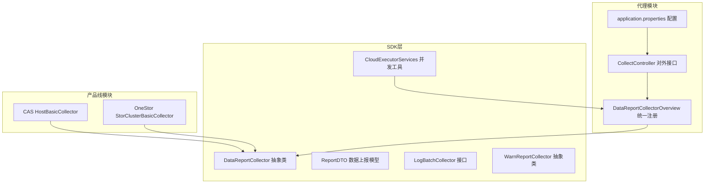
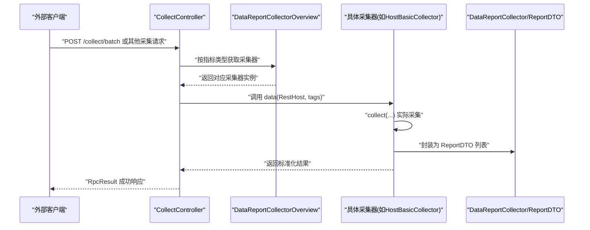
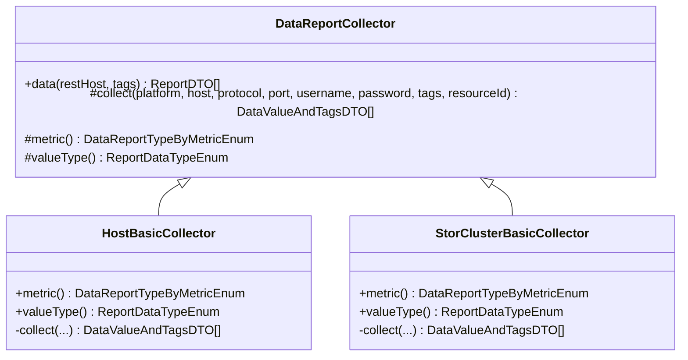
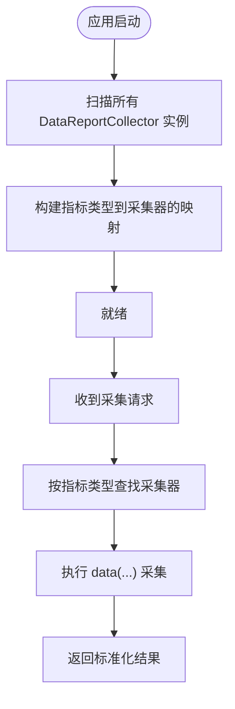
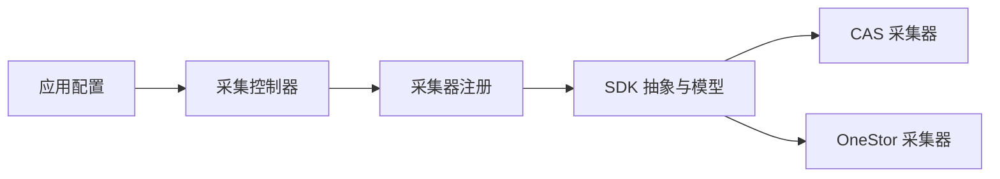

# 数据采集管道

<cite>
**本文引用的文件**
- [DataReportCollector.java](file://watcher-sdk/src/main/java/com/virtual/cloud/om/sdk/api/DataReportCollector.java)
- [LogBatchCollector.java](file://watcher-sdk/src/main/java/com/virtual/cloud/om/sdk/api/LogBatchCollector.java)
- [WarnReportCollector.java](file://watcher-sdk/src/main/java/com/virtual/cloud/om/sdk/api/WarnReportCollector.java)
- [ReportDTO.java](file://watcher-sdk/src/main/java/com/virtual/cloud/om/sdk/dto/dataReport/workspace/ReportDTO.java)
- [DataReportCollectorOverview.java](file://watcher-agent/src/main/java/com/virtual/cloud/om/agent/service/DataReportCollectorOverview.java)
- [CollectController.java](file://watcher-agent/src/main/java/com/virtual/cloud/om/agent/controller/CollectController.java)
- [application.properties](file://watcher-agent/src/main/resources/application.properties)
- [CloudExecutorServices.java](file://watcher-sdk/src/main/java/com/virtual/cloud/om/sdk/concurrent/CloudExecutorServices.java)
- [HostBasicCollector.java](file://watcher-cas/src/main/java/com/virtual/cloud/om/cas/service/report/HostBasicCollector.java)
- [StorClusterBasicCollector.java](file://watcher-onestor/src/main/java/com/virtual/cloud/om/onestor/service/clusterBasic/StorClusterBasicCollector.java)
</cite>

## 目录
1. [引言](#引言)
2. [项目结构](#项目结构)
3. [核心组件](#核心组件)
4. [架构总览](#架构总览)
5. [详细组件分析](#详细组件分析)
6. [依赖分析](#依赖分析)
7. [性能考虑](#性能考虑)
8. [故障排查指南](#故障排查指南)
9. [结论](#结论)
10. [附录](#附录)

## 引言
本文件面向ShowTime监控系统的数据采集管道，聚焦从各产品线（CAS、UIS、Workspace、OneStor）到监控代理的数据采集流程。文档系统性阐述DataReportCollector抽象类的设计理念与实现模式，解析不同产品线采集器的继承关系与差异化实现；说明采集器的生命周期管理、定时任务调度机制与批量采集策略；明确采集数据的格式标准化、异常处理与重试机制；并给出采集管道的配置选项与性能优化建议（含并发控制与资源限制）。

## 项目结构
- SDK层提供采集抽象、DTO模型、并发工具与常量枚举，支撑各产品线采集器实现与代理侧统一编排。
- 产品线模块按功能域拆分：CAS、OneStor等各自实现具体采集器。
- 代理模块负责对外提供采集接口、装配与编排采集器，并通过配置文件启用/关闭相关插件与中间件。

图表来源
- [DataReportCollector.java:1-118](file://watcher-sdk/src/main/java/com/virtual/cloud/om/sdk/api/DataReportCollector.java#L1-L118)
- [ReportDTO.java:1-25](file://watcher-sdk/src/main/java/com/virtual/cloud/om/sdk/dto/dataReport/workspace/ReportDTO.java#L1-L25)
- [LogBatchCollector.java:1-33](file://watcher-sdk/src/main/java/com/virtual/cloud/om/sdk/api/LogBatchCollector.java#L1-L33)
- [WarnReportCollector.java:1-80](file://watcher-sdk/src/main/java/com/virtual/cloud/om/sdk/api/WarnReportCollector.java#L1-L80)
- [HostBasicCollector.java:1-126](file://watcher-cas/src/main/java/com/virtual/cloud/om/cas/service/report/HostBasicCollector.java#L1-L126)
- [StorClusterBasicCollector.java:1-77](file://watcher-onestor/src/main/java/com/virtual/cloud/om/onestor/service/clusterBasic/StorClusterBasicCollector.java#L1-L77)
- [DataReportCollectorOverview.java:1-46](file://watcher-agent/src/main/java/com/virtual/cloud/om/agent/service/DataReportCollectorOverview.java#L1-L46)
- [CollectController.java:1-67](file://watcher-agent/src/main/java/com/virtual/cloud/om/agent/controller/CollectController.java#L1-L67)
- [application.properties:1-80](file://watcher-agent/src/main/resources/application.properties#L1-L80)

章节来源
- [application.properties:1-80](file://watcher-agent/src/main/resources/application.properties#L1-L80)

## 核心组件
- DataReportCollector：采集器抽象基类，定义统一的采集入口、数据标准化输出与时间戳处理逻辑，子类仅需实现具体采集细节与指标类型。
- ReportDTO：采集结果的标准数据载体，包含指标类型、值类型、标签、批次号、值对象与时间戳。
- DataReportCollectorOverview：在Spring应用启动时扫描并注册所有采集器，按指标类型映射到具体实现，供控制器或调度器按需调用。
- CloudExecutorServices：提供多种线程池（CPU密集、IO密集、通用、监控、Kafka消费等），支持自定义核心线程、最大线程与队列容量，便于在采集过程中进行并发控制与资源限制。
- LogBatchCollector：日志批量采集接口，定义下载结果枚举与日志类型标识，用于批量日志采集场景。
- WarnReportCollector：告警采集抽象类，提供统一的告警数据采集入口与指标类型定义。

章节来源
- [DataReportCollector.java:1-118](file://watcher-sdk/src/main/java/com/virtual/cloud/om/sdk/api/DataReportCollector.java#L1-L118)
- [ReportDTO.java:1-25](file://watcher-sdk/src/main/java/com/virtual/cloud/om/sdk/dto/dataReport/workspace/ReportDTO.java#L1-L25)
- [DataReportCollectorOverview.java:1-46](file://watcher-agent/src/main/java/com/virtual/cloud/om/agent/service/DataReportCollectorOverview.java#L1-L46)
- [CloudExecutorServices.java:1-195](file://watcher-sdk/src/main/java/com/virtual/cloud/om/sdk/concurrent/CloudExecutorServices.java#L1-L195)
- [LogBatchCollector.java:1-33](file://watcher-sdk/src/main/java/com/virtual/cloud/om/sdk/api/LogBatchCollector.java#L1-L33)
- [WarnReportCollector.java:1-80](file://watcher-sdk/src/main/java/com/virtual/cloud/om/sdk/api/WarnReportCollector.java#L1-L80)

## 架构总览
采集流程自上而下分为三层：
- 外部接口层：代理提供HTTP接口接收采集任务与资源同步请求，内部委派至采集器或服务。
- 编排与注册层：统一注册所有采集器，按指标类型快速定位实现，支持扩展新采集器。
- 采集实现层：各产品线采集器基于抽象基类实现具体采集逻辑，统一输出标准化数据结构。

图表来源
- [CollectController.java:1-67](file://watcher-agent/src/main/java/com/virtual/cloud/om/agent/controller/CollectController.java#L1-L67)
- [DataReportCollectorOverview.java:1-46](file://watcher-agent/src/main/java/com/virtual/cloud/om/agent/service/DataReportCollectorOverview.java#L1-L46)
- [DataReportCollector.java:1-118](file://watcher-sdk/src/main/java/com/virtual/cloud/om/sdk/api/DataReportCollector.java#L1-L118)
- [ReportDTO.java:1-25](file://watcher-sdk/src/main/java/com/virtual/cloud/om/sdk/dto/dataReport/workspace/ReportDTO.java#L1-L25)
- [HostBasicCollector.java:1-126](file://watcher-cas/src/main/java/com/virtual/cloud/om/cas/service/report/HostBasicCollector.java#L1-L126)

## 详细组件分析

### DataReportCollector 抽象类设计与实现模式
- 设计理念
  - 统一采集入口：data(...) 方法封装了采集前后的日志记录、超时统计与时间戳填充，屏蔽重复逻辑。
  - 标准化输出：将采集结果转换为 ReportDTO 列表，确保上层一致处理。
  - 可扩展性：子类仅需实现 collect(...) 与 metric()/valueType()，降低耦合度。
- 生命周期管理
  - 由 Spring 在启动阶段注入并注册，无需手动初始化。
  - 每次采集调用独立执行，避免状态污染。
- 批量采集策略
  - 通过 tags 与 resourceId 参数传递目标集合，子类在 collect 中按目标批量拉取并合并为单次上报。
- 差异化实现
  - 不同产品线通过 Rest 客户端或SSH等方式访问后端API，最终统一封装为 DataValueAndTagsDTO 再转为 ReportDTO。
- 异常处理与重试
  - 抽象层不直接处理异常，子类在 collect 中捕获并抛出业务异常；代理层可结合线程池与重试策略实现幂等与容错。

图表来源
- [DataReportCollector.java:1-118](file://watcher-sdk/src/main/java/com/virtual/cloud/om/sdk/api/DataReportCollector.java#L1-L118)
- [HostBasicCollector.java:1-126](file://watcher-cas/src/main/java/com/virtual/cloud/om/cas/service/report/HostBasicCollector.java#L1-L126)
- [StorClusterBasicCollector.java:1-77](file://watcher-onestor/src/main/java/com/virtual/cloud/om/onestor/service/clusterBasic/StorClusterBasicCollector.java#L1-L77)

章节来源
- [DataReportCollector.java:1-118](file://watcher-sdk/src/main/java/com/virtual/cloud/om/sdk/api/DataReportCollector.java#L1-L118)
- [HostBasicCollector.java:1-126](file://watcher-cas/src/main/java/com/virtual/cloud/om/cas/service/report/HostBasicCollector.java#L1-L126)
- [StorClusterBasicCollector.java:1-77](file://watcher-onestor/src/main/java/com/virtual/cloud/om/onestor/service/clusterBasic/StorClusterBasicCollector.java#L1-L77)

### 产品线采集器实现（CAS、OneStor）
- CAS HostBasicCollector
  - 功能：拉取主机基础信息、主机详情、摘要与磁盘利用率，组装为 JSON 类型的采集值。
  - 关键点：多接口组合查询、单位换算、异常包装为业务异常，保证上报稳定性。
- OneStor StorClusterBasicCollector
  - 功能：通过集群ID查询集群基本信息，封装为 JSON 类型的采集值。
  - 关键点：REST 调用、空结果保护、时间戳与标签注入。

章节来源
- [HostBasicCollector.java:1-126](file://watcher-cas/src/main/java/com/virtual/cloud/om/cas/service/report/HostBasicCollector.java#L1-L126)
- [StorClusterBasicCollector.java:1-77](file://watcher-onestor/src/main/java/com/virtual/cloud/om/onestor/service/clusterBasic/StorClusterBasicCollector.java#L1-L77)

### 采集器生命周期与注册
- 启动阶段装配：DataReportCollectorOverview 在 ApplicationRunner 中扫描所有 DataReportCollector 实例，建立“指标类型 → 采集器”的映射。
- 运行时调用：控制器或调度器通过指标类型查找采集器并执行 data(...)，实现按需加载与解耦。

图表来源
- [DataReportCollectorOverview.java:1-46](file://watcher-agent/src/main/java/com/virtual/cloud/om/agent/service/DataReportCollectorOverview.java#L1-L46)
- [DataReportCollector.java:1-118](file://watcher-sdk/src/main/java/com/virtual/cloud/om/sdk/api/DataReportCollector.java#L1-L118)

章节来源
- [DataReportCollectorOverview.java:1-46](file://watcher-agent/src/main/java/com/virtual/cloud/om/agent/service/DataReportCollectorOverview.java#L1-L46)

### 外部接口与资源同步
- CollectController 提供对外采集接口，包括实时日志策略下发、资源同步与批量部署等，内部委派至相应服务或采集器。
- 通过 application.properties 控制中间件与插件开关，以及服务地址配置，便于在不同环境灵活启用/禁用。

章节来源
- [CollectController.java:1-67](file://watcher-agent/src/main/java/com/virtual/cloud/om/agent/controller/CollectController.java#L1-L67)
- [application.properties:1-80](file://watcher-agent/src/main/resources/application.properties#L1-L80)

### 数据格式标准化与异常处理
- 格式标准化：统一使用 ReportDTO，包含 metric、type、tags、value、timestamp 等字段，确保上层一致处理。
- 异常处理：抽象层不吞异常，子类在 collect 中捕获并抛出业务异常；代理层可结合线程池与重试策略实现幂等与容错。

章节来源
- [ReportDTO.java:1-25](file://watcher-sdk/src/main/java/com/virtual/cloud/om/sdk/dto/dataReport/workspace/ReportDTO.java#L1-L25)
- [DataReportCollector.java:1-118](file://watcher-sdk/src/main/java/com/virtual/cloud/om/sdk/api/DataReportCollector.java#L1-L118)

## 依赖分析
- 组件内聚与耦合
  - DataReportCollector 与具体采集器之间为“模板方法”模式，低耦合高内聚。
  - DataReportCollectorOverview 与采集器之间通过注解与Spring容器装配，无硬编码依赖。
- 外部依赖
  - 产品线采集器依赖 SDK 的 REST 客户端与 DTO 模型。
  - 代理模块依赖 Spring Boot 与 Swagger 注解，提供对外接口。
- 循环依赖与隔离
  - application.properties 中允许循环依赖以满足装配需求，但通过接口与抽象类隔离具体实现。

图表来源
- [DataReportCollector.java:1-118](file://watcher-sdk/src/main/java/com/virtual/cloud/om/sdk/api/DataReportCollector.java#L1-L118)
- [HostBasicCollector.java:1-126](file://watcher-cas/src/main/java/com/virtual/cloud/om/cas/service/report/HostBasicCollector.java#L1-L126)
- [StorClusterBasicCollector.java:1-77](file://watcher-onestor/src/main/java/com/virtual/cloud/om/onestor/service/clusterBasic/StorClusterBasicCollector.java#L1-L77)
- [DataReportCollectorOverview.java:1-46](file://watcher-agent/src/main/java/com/virtual/cloud/om/agent/service/DataReportCollectorOverview.java#L1-L46)
- [CollectController.java:1-67](file://watcher-agent/src/main/java/com/virtual/cloud/om/agent/controller/CollectController.java#L1-L67)
- [application.properties:1-80](file://watcher-agent/src/main/resources/application.properties#L1-L80)

## 性能考虑
- 并发控制与资源限制
  - 使用 CloudExecutorServices 提供的线程池族：CPU密集、IO密集、通用、监控、Kafka消费等，按场景选择合适线程池。
  - 自定义线程池：getCustomizeService(...) 支持传入核心线程、最大线程与队列大小，满足不同采集负载的资源限制。
  - 线程池参数建议
    - CPU密集型：核心线程 ≈ CPU核数，最大线程 ≈ 2×核心，队列容量适中，避免过多上下文切换。
    - IO密集型：核心线程 ≈ 10×CPU核数，最大线程 ≈ 20×CPU核数，队列容量较大，提升吞吐。
    - 通用与监控：核心线程 ≈ CPU核数，最大线程 ≈ 2×CPU核数，队列容量较大，兼顾延迟与吞吐。
- 采集批量化
  - 通过 tags 与 resourceId 将多个目标聚合到一次采集中，减少网络往返与序列化开销。
- 超时与重试
  - 抽象层在 data(...) 中记录采集耗时，便于定位慢采集项；结合线程池拒绝策略与重试机制提升稳定性。
- 中间件与插件开关
  - application.properties 中通过开关控制中间件与插件启用，避免不必要的资源消耗。

章节来源
- [CloudExecutorServices.java:1-195](file://watcher-sdk/src/main/java/com/virtual/cloud/om/sdk/concurrent/CloudExecutorServices.java#L1-L195)
- [application.properties:1-80](file://watcher-agent/src/main/resources/application.properties#L1-L80)

## 故障排查指南
- 常见问题定位
  - 采集超时：查看 data(...) 日志中的耗时统计，确认网络与后端服务响应情况。
  - 结果为空：检查 collect 返回是否为空，确认目标ID与标签匹配、后端接口返回是否正常。
  - 指标类型未找到：确认 DataReportCollectorOverview 是否正确注册该指标类型。
- 异常与错误码
  - 采集器内部捕获异常并抛出业务异常，代理层可据此进行重试或降级。
- 配置检查
  - 确认 application.properties 中插件与中间件开关、服务地址与凭据配置正确。
- 并发与资源
  - 若出现线程池饱和或队列积压，调整线程池参数或增加队列容量，必要时拆分采集任务。

章节来源
- [DataReportCollector.java:1-118](file://watcher-sdk/src/main/java/com/virtual/cloud/om/sdk/api/DataReportCollector.java#L1-L118)
- [application.properties:1-80](file://watcher-agent/src/main/resources/application.properties#L1-L80)

## 结论
ShowTime数据采集管道以 DataReportCollector 为核心抽象，结合产品线采集器实现差异化采集，通过 DataReportCollectorOverview 完成统一注册与按需调用。ReportDTO 标准化输出与 CloudExecutorServices 并发工具为性能与稳定性提供了坚实基础。配合 application.properties 的灵活配置，系统可在不同环境中高效运行并易于扩展新的采集器与产品线。

## 附录
- 关键配置项参考
  - 中间件开关：elasticsearch.enable、kafka.enable、mongodb.enable、clickhouse.enable、quartz.enable
  - 插件开关：rest-client.cas.enable、rest-client.uis.enable、rest-client.ws.enable、rest-client.onestor.enable
  - 服务地址：cas.service.url、uis.service.url、ws.service.url、onestor.service.url
  - 批量采集日志目录：batch.collect.log.dir.name
- 建议实践
  - 为不同采集任务选择合适的线程池类型，避免IO与CPU任务互相抢占。
  - 对慢采集项进行分级与限流，保障整体吞吐。
  - 在采集器中实现幂等与重试策略，结合代理层的异常处理提升鲁棒性。

章节来源
- [application.properties:1-80](file://watcher-agent/src/main/resources/application.properties#L1-L80)