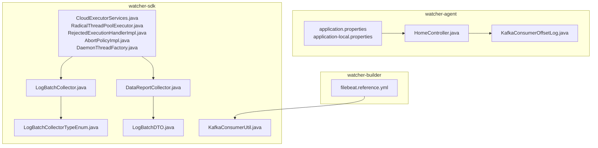
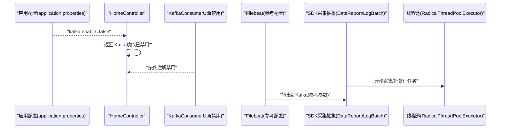
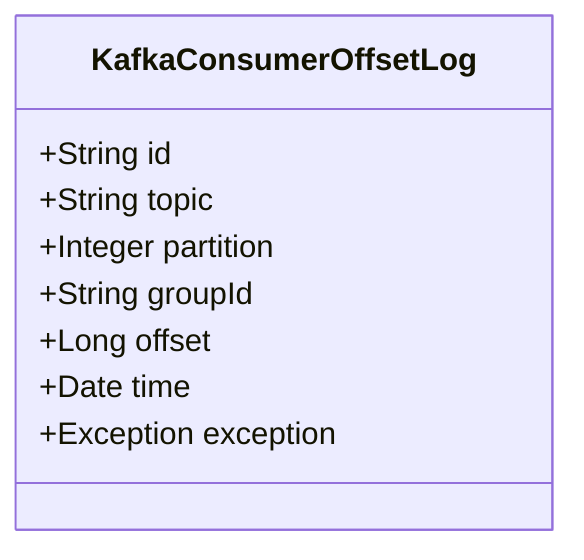
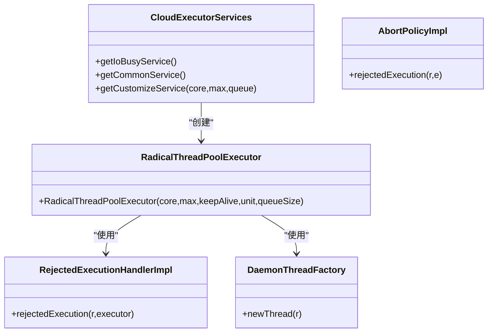
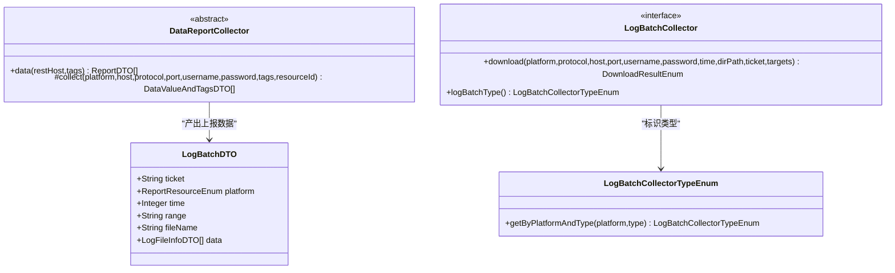
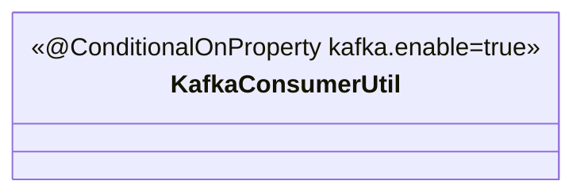
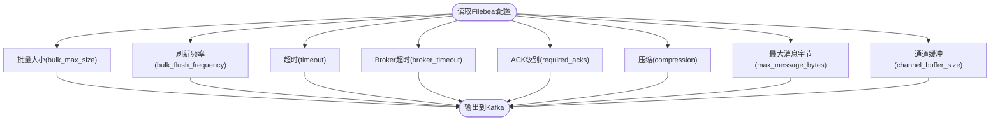
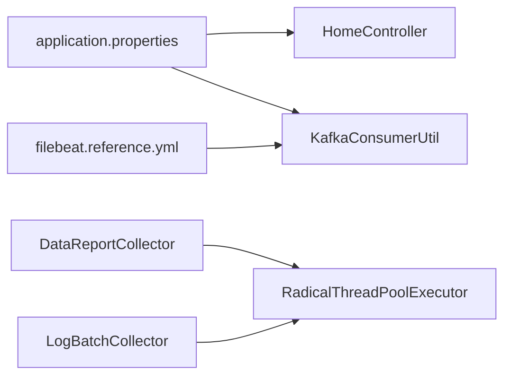

# 消息队列处理

<cite>
**本文引用的文件**
- [application.properties](file://watcher-agent/src/main/resources/application.properties)
- [application-local.properties](file://watcher-agent/src/main/resources/application-local.properties)
- [HomeController.java](file://watcher-agent/src/main/java/com/virtual/cloud/om/agent/controller/HomeController.java)
- [KafkaConsumerOffsetLog.java](file://watcher-agent/src/main/java/com/virtual/cloud/om/agent/entity/KafkaConsumerOffsetLog.java)
- [KafkaConsumerUtil.java](file://watcher-sdk/src/main/java/com/virtual/cloud/om/sdk/utils/KafkaConsumerUtil.java)
- [LogBatchCollectorTypeEnum.java](file://watcher-sdk/src/main/java/com/virtual/cloud/om/sdk/constant/LogBatchCollectorTypeEnum.java)
- [LogBatchDTO.java](file://watcher-sdk/src/main/java/com/virtual/cloud/om/sdk/dto/logBatch/LogBatchDTO.java)
- [DataReportCollector.java](file://watcher-sdk/src/main/java/com/virtual/cloud/om/sdk/api/DataReportCollector.java)
- [LogBatchCollector.java](file://watcher-sdk/src/main/java/com/virtual/cloud/om/sdk/api/LogBatchCollector.java)
- [CloudExecutorServices.java](file://watcher-sdk/src/main/java/com/virtual/cloud/om/sdk/concurrent/CloudExecutorServices.java)
- [RadicalThreadPoolExecutor.java](file://watcher-sdk/src/main/java/com/virtual/cloud/om/sdk/concurrent/RadicalThreadPoolExecutor.java)
- [RejectedExecutionHandlerImpl.java](file://watcher-sdk/src/main/java/com/virtual/cloud/om/sdk/concurrent/RejectedExecutionHandlerImpl.java)
- [AbortPolicyImpl.java](file://watcher-sdk/src/main/java/com/virtual/cloud/om/sdk/concurrent/AbortPolicyImpl.java)
- [DaemonThreadFactory.java](file://watcher-sdk/src/main/java/com/virtual/cloud/om/sdk/concurrent/DaemonThreadFactory.java)
- [filebeat.reference.yml](file://watcher-builder/assembly/components/filebeat/filebeat-8.0.1-linux-x86_64/filebeat.reference.yml)
</cite>

## 目录
1. [引言](#引言)
2. [项目结构](#项目结构)
3. [核心组件](#核心组件)
4. [架构总览](#架构总览)
5. [详细组件分析](#详细组件分析)
6. [依赖关系分析](#依赖关系分析)
7. [性能考量](#性能考量)
8. [故障排查指南](#故障排查指南)
9. [结论](#结论)
10. [附录](#附录)

## 引言
本文件面向ShowTime监控系统中的消息队列处理，聚焦Kafka在数据传输中的角色与实现要点。根据仓库现状，MySQL单机版配置中已明确关闭Kafka功能开关，且存在一个被条件禁用的Kafka消费者工具类。因此，本文在“实际实现”层面以现有代码为准；同时提供概念性与工程实践层面的通用指导，帮助读者理解消息队列在该系统中的潜在扩展点与最佳实践。

## 项目结构
围绕消息队列处理的相关文件主要分布在以下模块：
- watcher-agent：应用配置与控制器，包含Kafka消费者偏移量实体与控制器调试接口
- watcher-sdk：消息采集与上报抽象、线程池与拒绝策略、日志批处理类型枚举等
- watcher-builder：Filebeat配置参考，体现输出到Kafka的参数与行为

**图表来源**
- [application.properties:1-80](file://watcher-agent/src/main/resources/application.properties#L1-L80)
- [application-local.properties:1-61](file://watcher-agent/src/main/resources/application-local.properties#L1-L61)
- [HomeController.java:67-99](file://watcher-agent/src/main/java/com/virtual/cloud/om/agent/controller/HomeController.java#L67-L99)
- [KafkaConsumerOffsetLog.java:1-42](file://watcher-agent/src/main/java/com/virtual/cloud/om/agent/entity/KafkaConsumerOffsetLog.java#L1-L42)
- [DataReportCollector.java:1-118](file://watcher-sdk/src/main/java/com/virtual/cloud/om/sdk/api/DataReportCollector.java#L1-L118)
- [LogBatchCollector.java:1-33](file://watcher-sdk/src/main/java/com/virtual/cloud/om/sdk/api/LogBatchCollector.java#L1-L33)
- [LogBatchCollectorTypeEnum.java:1-34](file://watcher-sdk/src/main/java/com/virtual/cloud/om/sdk/constant/LogBatchCollectorTypeEnum.java#L1-L34)
- [LogBatchDTO.java:1-38](file://watcher-sdk/src/main/java/com/virtual/cloud/om/sdk/dto/logBatch/LogBatchDTO.java#L1-L38)
- [CloudExecutorServices.java:1-112](file://watcher-sdk/src/main/java/com/virtual/cloud/om/sdk/concurrent/CloudExecutorServices.java#L1-L112)
- [RadicalThreadPoolExecutor.java:1-31](file://watcher-sdk/src/main/java/com/virtual/cloud/om/sdk/concurrent/RadicalThreadPoolExecutor.java#L1-L31)
- [RejectedExecutionHandlerImpl.java:1-23](file://watcher-sdk/src/main/java/com/virtual/cloud/om/sdk/concurrent/RejectedExecutionHandlerImpl.java#L1-L23)
- [AbortPolicyImpl.java:1-22](file://watcher-sdk/src/main/java/com/virtual/cloud/om/sdk/concurrent/AbortPolicyImpl.java#L1-L22)
- [DaemonThreadFactory.java:1-30](file://watcher-sdk/src/main/java/com/virtual/cloud/om/sdk/concurrent/DaemonThreadFactory.java#L1-L30)
- [KafkaConsumerUtil.java:1-14](file://watcher-sdk/src/main/java/com/virtual/cloud/om/sdk/utils/KafkaConsumerUtil.java#L1-L14)
- [filebeat.reference.yml:3402-3462](file://watcher-builder/assembly/components/filebeat/filebeat-8.0.1-linux-x86_64/filebeat.reference.yml#L3402-L3462)

**章节来源**
- [application.properties:1-80](file://watcher-agent/src/main/resources/application.properties#L1-L80)
- [application-local.properties:1-61](file://watcher-agent/src/main/resources/application-local.properties#L1-L61)

## 核心组件
- 配置层
  - 应用配置明确声明kafka.enable=false，表明在当前部署形态下禁用了Kafka中间件。
  - 控制器提供启用Kafka调试的接口，但返回“Kafka功能已禁用”，体现当前状态。
- 实体层
  - KafkaConsumerOffsetLog用于记录消费者消费偏移量信息，便于后续监控与排障。
- 抽象与工具层
  - DataReportCollector与LogBatchCollector定义了数据采集与日志批处理的抽象接口。
  - LogBatchCollectorTypeEnum枚举标识不同平台与类型的日志批处理来源。
  - KafkaConsumerUtil通过条件注解被禁用，体现“按配置启用”的设计。
- 线程池与并发控制
  - CloudExecutorServices提供多种线程池实例，RadicalThreadPoolExecutor采用激进策略提升吞吐并控制线程波动。
  - RejectedExecutionHandlerImpl与AbortPolicyImpl分别提供“告警不抛出”和“抛出异常”的拒绝策略。
  - DaemonThreadFactory为守护线程命名，便于问题定位。
- 输出到Kafka的参考配置
  - filebeat.reference.yml展示了输出到Kafka的关键参数，如批量大小、超时、ACK级别、压缩等，可作为未来启用Kafka时的参考。

**章节来源**
- [application.properties:13-21](file://watcher-agent/src/main/resources/application.properties#L13-L21)
- [HomeController.java:93-97](file://watcher-agent/src/main/java/com/virtual/cloud/om/agent/controller/HomeController.java#L93-L97)
- [KafkaConsumerOffsetLog.java:1-42](file://watcher-agent/src/main/java/com/virtual/cloud/om/agent/entity/KafkaConsumerOffsetLog.java#L1-L42)
- [DataReportCollector.java:1-118](file://watcher-sdk/src/main/java/com/virtual/cloud/om/sdk/api/DataReportCollector.java#L1-L118)
- [LogBatchCollector.java:1-33](file://watcher-sdk/src/main/java/com/virtual/cloud/om/sdk/api/LogBatchCollector.java#L1-L33)
- [LogBatchCollectorTypeEnum.java:1-34](file://watcher-sdk/src/main/java/com/virtual/cloud/om/sdk/constant/LogBatchCollectorTypeEnum.java#L1-L34)
- [KafkaConsumerUtil.java:1-14](file://watcher-sdk/src/main/java/com/virtual/cloud/om/sdk/utils/KafkaConsumerUtil.java#L1-L14)
- [CloudExecutorServices.java:1-112](file://watcher-sdk/src/main/java/com/virtual/cloud/om/sdk/concurrent/CloudExecutorServices.java#L1-L112)
- [RadicalThreadPoolExecutor.java:1-31](file://watcher-sdk/src/main/java/com/virtual/cloud/om/sdk/concurrent/RadicalThreadPoolExecutor.java#L1-L31)
- [RejectedExecutionHandlerImpl.java:1-23](file://watcher-sdk/src/main/java/com/virtual/cloud/om/sdk/concurrent/RejectedExecutionHandlerImpl.java#L1-L23)
- [AbortPolicyImpl.java:1-22](file://watcher-sdk/src/main/java/com/virtual/cloud/om/sdk/concurrent/AbortPolicyImpl.java#L1-L22)
- [DaemonThreadFactory.java:1-30](file://watcher-sdk/src/main/java/com/virtual/cloud/om/sdk/concurrent/DaemonThreadFactory.java#L1-L30)
- [filebeat.reference.yml:4017-4068](file://watcher-builder/assembly/components/filebeat/filebeat-8.0.1-linux-x86_64/filebeat.reference.yml#L4017-L4068)

## 架构总览
基于现有代码，消息队列处理在当前形态下的交互如下：

**图表来源**
- [application.properties:13-21](file://watcher-agent/src/main/resources/application.properties#L13-L21)
- [HomeController.java:93-97](file://watcher-agent/src/main/java/com/virtual/cloud/om/agent/controller/HomeController.java#L93-L97)
- [KafkaConsumerUtil.java:1-14](file://watcher-sdk/src/main/java/com/virtual/cloud/om/sdk/utils/KafkaConsumerUtil.java#L1-L14)
- [DataReportCollector.java:1-118](file://watcher-sdk/src/main/java/com/virtual/cloud/om/sdk/api/DataReportCollector.java#L1-L118)
- [LogBatchCollector.java:1-33](file://watcher-sdk/src/main/java/com/virtual/cloud/om/sdk/api/LogBatchCollector.java#L1-L33)
- [RadicalThreadPoolExecutor.java:1-31](file://watcher-sdk/src/main/java/com/virtual/cloud/om/sdk/concurrent/RadicalThreadPoolExecutor.java#L1-L31)
- [filebeat.reference.yml:4017-4068](file://watcher-builder/assembly/components/filebeat/filebeat-8.0.1-linux-x86_64/filebeat.reference.yml#L4017-L4068)

## 详细组件分析

### 组件一：Kafka消费者偏移量实体
该实体用于记录消费者消费进度，是监控与排障的重要数据来源。

**图表来源**
- [KafkaConsumerOffsetLog.java:1-42](file://watcher-agent/src/main/java/com/virtual/cloud/om/agent/entity/KafkaConsumerOffsetLog.java#L1-L42)

**章节来源**
- [KafkaConsumerOffsetLog.java:1-42](file://watcher-agent/src/main/java/com/virtual/cloud/om/agent/entity/KafkaConsumerOffsetLog.java#L1-L42)

### 组件二：线程池与并发控制
SDK提供了多种线程池与拒绝策略，支撑高并发的数据采集与批处理任务。

**图表来源**
- [CloudExecutorServices.java:1-112](file://watcher-sdk/src/main/java/com/virtual/cloud/om/sdk/concurrent/CloudExecutorServices.java#L1-L112)
- [RadicalThreadPoolExecutor.java:1-31](file://watcher-sdk/src/main/java/com/virtual/cloud/om/sdk/concurrent/RadicalThreadPoolExecutor.java#L1-L31)
- [RejectedExecutionHandlerImpl.java:1-23](file://watcher-sdk/src/main/java/com/virtual/cloud/om/sdk/concurrent/RejectedExecutionHandlerImpl.java#L1-L23)
- [AbortPolicyImpl.java:1-22](file://watcher-sdk/src/main/java/com/virtual/cloud/om/sdk/concurrent/AbortPolicyImpl.java#L1-L22)
- [DaemonThreadFactory.java:1-30](file://watcher-sdk/src/main/java/com/virtual/cloud/om/sdk/concurrent/DaemonThreadFactory.java#L1-L30)

**章节来源**
- [CloudExecutorServices.java:1-112](file://watcher-sdk/src/main/java/com/virtual/cloud/om/sdk/concurrent/CloudExecutorServices.java#L1-L112)
- [RadicalThreadPoolExecutor.java:1-31](file://watcher-sdk/src/main/java/com/virtual/cloud/om/sdk/concurrent/RadicalThreadPoolExecutor.java#L1-L31)
- [RejectedExecutionHandlerImpl.java:1-23](file://watcher-sdk/src/main/java/com/virtual/cloud/om/sdk/concurrent/RejectedExecutionHandlerImpl.java#L1-L23)
- [AbortPolicyImpl.java:1-22](file://watcher-sdk/src/main/java/com/virtual/cloud/om/sdk/concurrent/AbortPolicyImpl.java#L1-L22)
- [DaemonThreadFactory.java:1-30](file://watcher-sdk/src/main/java/com/virtual/cloud/om/sdk/concurrent/DaemonThreadFactory.java#L1-L30)

### 组件三：采集抽象与日志批处理
- DataReportCollector定义了数据采集的统一入口与结果封装。
- LogBatchCollector定义了日志批处理的下载流程与类型枚举。
- LogBatchCollectorTypeEnum将平台、类型与具体采集来源进行映射。

**图表来源**
- [DataReportCollector.java:1-118](file://watcher-sdk/src/main/java/com/virtual/cloud/om/sdk/api/DataReportCollector.java#L1-L118)
- [LogBatchCollector.java:1-33](file://watcher-sdk/src/main/java/com/virtual/cloud/om/sdk/api/LogBatchCollector.java#L1-L33)
- [LogBatchCollectorTypeEnum.java:1-34](file://watcher-sdk/src/main/java/com/virtual/cloud/om/sdk/constant/LogBatchCollectorTypeEnum.java#L1-L34)
- [LogBatchDTO.java:1-38](file://watcher-sdk/src/main/java/com/virtual/cloud/om/sdk/dto/logBatch/LogBatchDTO.java#L1-L38)

**章节来源**
- [DataReportCollector.java:1-118](file://watcher-sdk/src/main/java/com/virtual/cloud/om/sdk/api/DataReportCollector.java#L1-L118)
- [LogBatchCollector.java:1-33](file://watcher-sdk/src/main/java/com/virtual/cloud/om/sdk/api/LogBatchCollector.java#L1-L33)
- [LogBatchCollectorTypeEnum.java:1-34](file://watcher-sdk/src/main/java/com/virtual/cloud/om/sdk/constant/LogBatchCollectorTypeEnum.java#L1-L34)
- [LogBatchDTO.java:1-38](file://watcher-sdk/src/main/java/com/virtual/cloud/om/sdk/dto/logBatch/LogBatchDTO.java#L1-L38)

### 组件四：Kafka消费者工具类（条件禁用）
KafkaConsumerUtil通过条件注解仅在kafka.enable=true时生效，当前配置下处于禁用状态。

**图表来源**
- [KafkaConsumerUtil.java:1-14](file://watcher-sdk/src/main/java/com/virtual/cloud/om/sdk/utils/KafkaConsumerUtil.java#L1-L14)
- [application.properties:13-21](file://watcher-agent/src/main/resources/application.properties#L13-L21)

**章节来源**
- [KafkaConsumerUtil.java:1-14](file://watcher-sdk/src/main/java/com/virtual/cloud/om/sdk/utils/KafkaConsumerUtil.java#L1-L14)
- [application.properties:13-21](file://watcher-agent/src/main/resources/application.properties#L13-L21)

### 组件五：Filebeat输出到Kafka的参考参数
filebeat.reference.yml提供了输出到Kafka的关键参数，可用于未来启用Kafka时的配置参考。

**图表来源**
- [filebeat.reference.yml:4017-4068](file://watcher-builder/assembly/components/filebeat/filebeat-8.0.1-linux-x86_64/filebeat.reference.yml#L4017-L4068)

**章节来源**
- [filebeat.reference.yml:4017-4068](file://watcher-builder/assembly/components/filebeat/filebeat-8.0.1-linux-x86_64/filebeat.reference.yml#L4017-L4068)

## 依赖关系分析
- 配置依赖：HomeController依赖于application.properties中的kafka.enable=false，从而返回“Kafka功能已禁用”。
- 条件依赖：KafkaConsumerUtil依赖kafka.enable=true才启用，当前被禁用。
- 并发依赖：DataReportCollector与LogBatchCollector的任务最终由线程池执行，RadicalThreadPoolExecutor提供激进的线程增长策略与拒绝策略。
- 输出依赖：Filebeat参考配置为将来启用Kafka提供参数依据。

**图表来源**
- [application.properties:13-21](file://watcher-agent/src/main/resources/application.properties#L13-L21)
- [HomeController.java:93-97](file://watcher-agent/src/main/java/com/virtual/cloud/om/agent/controller/HomeController.java#L93-L97)
- [KafkaConsumerUtil.java:1-14](file://watcher-sdk/src/main/java/com/virtual/cloud/om/sdk/utils/KafkaConsumerUtil.java#L1-L14)
- [DataReportCollector.java:1-118](file://watcher-sdk/src/main/java/com/virtual/cloud/om/sdk/api/DataReportCollector.java#L1-L118)
- [LogBatchCollector.java:1-33](file://watcher-sdk/src/main/java/com/virtual/cloud/om/sdk/api/LogBatchCollector.java#L1-L33)
- [RadicalThreadPoolExecutor.java:1-31](file://watcher-sdk/src/main/java/com/virtual/cloud/om/sdk/concurrent/RadicalThreadPoolExecutor.java#L1-L31)
- [filebeat.reference.yml:4017-4068](file://watcher-builder/assembly/components/filebeat/filebeat-8.0.1-linux-x86_64/filebeat.reference.yml#L4017-L4068)

**章节来源**
- [application.properties:13-21](file://watcher-agent/src/main/resources/application.properties#L13-L21)
- [HomeController.java:93-97](file://watcher-agent/src/main/java/com/virtual/cloud/om/agent/controller/HomeController.java#L93-L97)
- [KafkaConsumerUtil.java:1-14](file://watcher-sdk/src/main/java/com/virtual/cloud/om/sdk/utils/KafkaConsumerUtil.java#L1-L14)
- [DataReportCollector.java:1-118](file://watcher-sdk/src/main/java/com/virtual/cloud/om/sdk/api/DataReportCollector.java#L1-L118)
- [LogBatchCollector.java:1-33](file://watcher-sdk/src/main/java/com/virtual/cloud/om/sdk/api/LogBatchCollector.java#L1-L33)
- [RadicalThreadPoolExecutor.java:1-31](file://watcher-sdk/src/main/java/com/virtual/cloud/om/sdk/concurrent/RadicalThreadPoolExecutor.java#L1-L31)
- [filebeat.reference.yml:4017-4068](file://watcher-builder/assembly/components/filebeat/filebeat-8.0.1-linux-x86_64/filebeat.reference.yml#L4017-L4068)

## 性能考量
- 线程池策略
  - RadicalThreadPoolExecutor在核心线程满载后仍会创建新线程，直至最大线程数，随后进入队列，有助于应对突发IO密集任务。
  - DaemonThreadFactory为守护线程命名，便于在高并发场景下快速定位线程。
- 拒绝策略
  - RejectedExecutionHandlerImpl仅记录告警，避免任务直接失败。
  - AbortPolicyImpl在队列满时抛出异常，提示系统繁忙，适合需要显式失败反馈的场景。
- 批量与延迟
  - 参考Filebeat配置中的bulk_max_size与bulk_flush_frequency，可在启用Kafka时平衡吞吐与延迟。
- 背压与内存
  - 当任务堆积时，RadicalThreadPoolExecutor的队列容量与拒绝策略共同形成背压，避免系统过载。

**章节来源**
- [RadicalThreadPoolExecutor.java:1-31](file://watcher-sdk/src/main/java/com/virtual/cloud/om/sdk/concurrent/RadicalThreadPoolExecutor.java#L1-L31)
- [RejectedExecutionHandlerImpl.java:1-23](file://watcher-sdk/src/main/java/com/virtual/cloud/om/sdk/concurrent/RejectedExecutionHandlerImpl.java#L1-L23)
- [AbortPolicyImpl.java:1-22](file://watcher-sdk/src/main/java/com/virtual/cloud/om/sdk/concurrent/AbortPolicyImpl.java#L1-L22)
- [DaemonThreadFactory.java:1-30](file://watcher-sdk/src/main/java/com/virtual/cloud/om/sdk/concurrent/DaemonThreadFactory.java#L1-L30)
- [filebeat.reference.yml:4017-4068](file://watcher-builder/assembly/components/filebeat/filebeat-8.0.1-linux-x86_64/filebeat.reference.yml#L4017-L4068)

## 故障排查指南
- Kafka功能状态
  - 若发现Kafka相关接口返回“Kafka功能已禁用”，请检查kafka.enable配置项是否为true。
  - 当前配置中kafka.enable=false，KafkaConsumerUtil被条件禁用。
- 消费者滞后与积压
  - 使用KafkaConsumerOffsetLog记录的偏移量信息，结合消费者组状态监控，定位滞后的topic/partition。
  - 结合线程池队列长度与拒绝策略，判断是否存在任务堆积导致的延迟。
- 生产者可靠性
  - 参考Filebeat配置中的required_acks、broker_timeout、timeout等参数，评估ACK级别与超时设置对可靠性的影响。
- 日志批处理与上报
  - 若日志批处理下载失败，检查LogBatchCollector的返回结果与目标主机连通性。
  - 对比DataReportCollector的采集耗时与上报结果，定位慢点或异常。

**章节来源**
- [application.properties:13-21](file://watcher-agent/src/main/resources/application.properties#L13-L21)
- [HomeController.java:93-97](file://watcher-agent/src/main/java/com/virtual/cloud/om/agent/controller/HomeController.java#L93-L97)
- [KafkaConsumerOffsetLog.java:1-42](file://watcher-agent/src/main/java/com/virtual/cloud/om/agent/entity/KafkaConsumerOffsetLog.java#L1-L42)
- [LogBatchCollector.java:1-33](file://watcher-sdk/src/main/java/com/virtual/cloud/om/sdk/api/LogBatchCollector.java#L1-L33)
- [DataReportCollector.java:1-118](file://watcher-sdk/src/main/java/com/virtual/cloud/om/sdk/api/DataReportCollector.java#L1-L118)
- [filebeat.reference.yml:4017-4068](file://watcher-builder/assembly/components/filebeat/filebeat-8.0.1-linux-x86_64/filebeat.reference.yml#L4017-L4068)

## 结论
- 在当前MySQL单机版配置下，Kafka处于禁用状态，消息队列处理未在运行时启用。
- 系统通过线程池与拒绝策略实现了高并发下的稳定与可控背压。
- Kafka消费者偏移量实体为未来的监控与排障提供了基础数据。
- 启用Kafka时，可参考Filebeat配置参数，结合业务特性调整ACK级别、批量大小与超时策略。

## 附录
- 关键配置项
  - kafka.enable：控制Kafka中间件开关
  - required_acks/broker_timeout/timeout：生产者可靠性与超时
  - bulk_max_size/bulk_flush_frequency：批量与刷新策略
- 建议
  - 在启用Kafka前，先评估线程池与拒绝策略，确保与生产者参数匹配。
  - 建立基于KafkaConsumerOffsetLog的消费者滞后监控与报警。