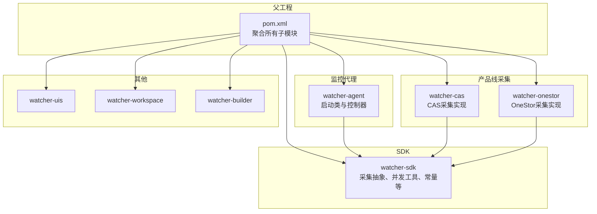
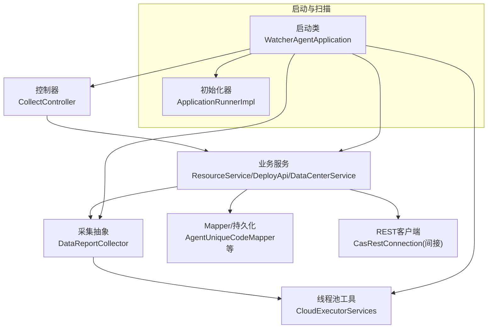
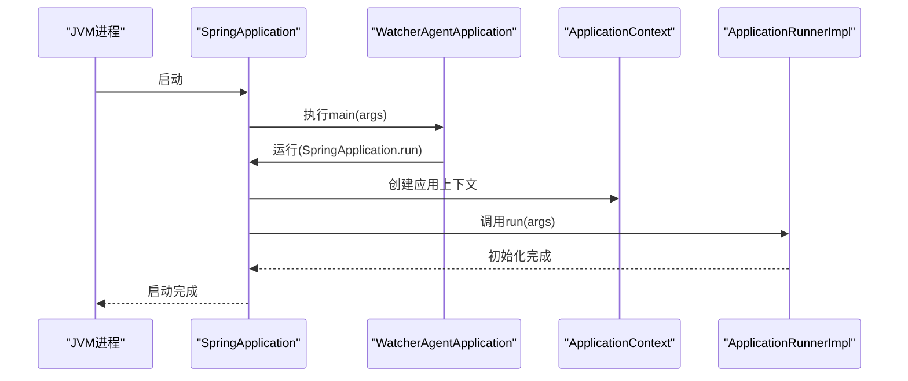
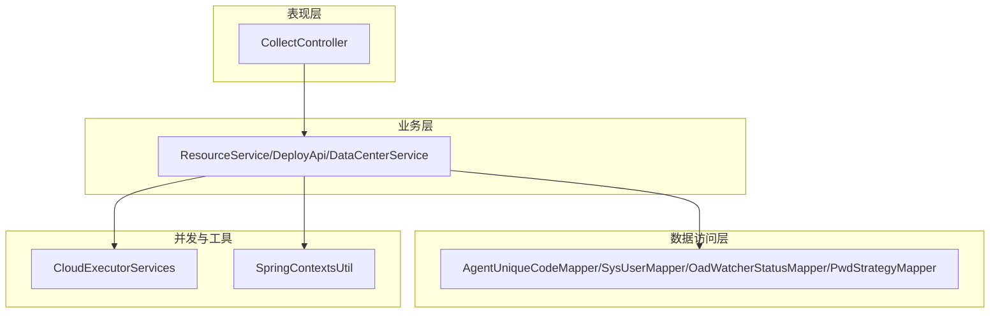
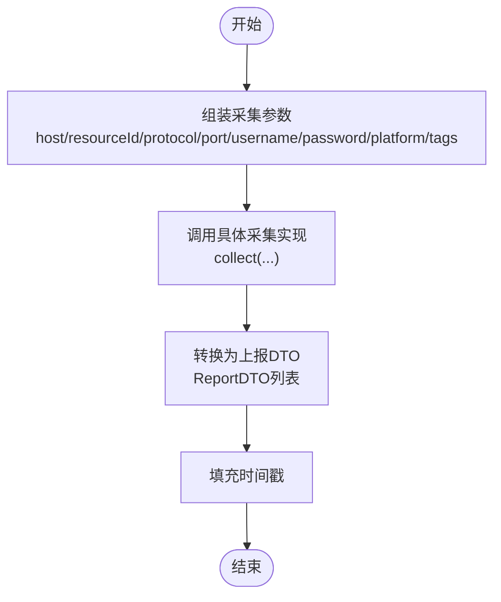
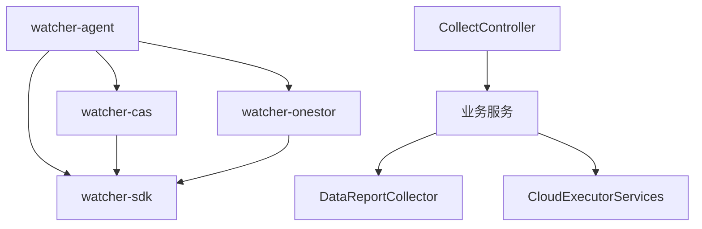
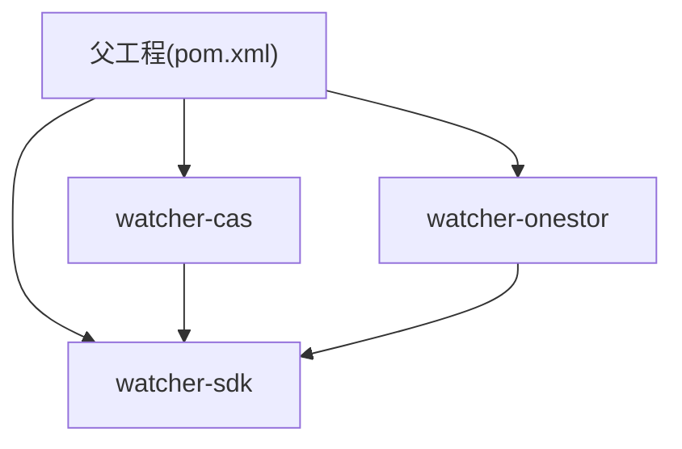

# 整体架构模式

<cite>
**本文引用的文件**
- [pom.xml](file://pom.xml)
- [WatcherAgentApplication.java](file://watcher-agent/src/main/java/com/virtual/cloud/om/agent/WatcherAgentApplication.java)
- [ApplicationRunnerImpl.java](file://watcher-agent/src/main/java/com/virtual/cloud/om/agent/config/ApplicationRunnerImpl.java)
- [CollectController.java](file://watcher-agent/src/main/java/com/virtual/cloud/om/agent/controller/CollectController.java)
- [DataReportCollector.java](file://watcher-sdk/src/main/java/com/virtual/cloud/om/sdk/api/DataReportCollector.java)
- [CloudExecutorServices.java](file://watcher-sdk/src/main/java/com/virtual/cloud/om/sdk/concurrent/CloudExecutorServices.java)
- [CasHostHandler.java](file://watcher-cas/src/main/java/com/virtual/cloud/om/cas/service/CasHostHandler.java)
- [SpringContextsUtil.java](file://watcher-sdk/src/main/java/com/virtual/cloud/om/sdk/utils/SpringContextsUtil.java)
- [ComponentEnum.java](file://watcher-sdk/src/main/java/com/virtual/cloud/om/sdk/constant/ComponentEnum.java)
- [watcher-sdk/pom.xml](file://watcher-sdk/pom.xml)
- [watcher-cas/pom.xml](file://watcher-cas/pom.xml)
- [watcher-onestor/pom.xml](file://watcher-onestor/pom.xml)
</cite>

## 目录
1. [引言](#引言)
2. [项目结构](#项目结构)
3. [核心组件](#核心组件)
4. [架构总览](#架构总览)
5. [详细组件分析](#详细组件分析)
6. [依赖分析](#依赖分析)
7. [性能考虑](#性能考虑)
8. [故障排查指南](#故障排查指南)
9. [结论](#结论)
10. [附录](#附录)

## 引言
本文件面向ShowTime监控系统，系统采用多模块聚合的微服务架构，围绕“监控代理服务”为核心，通过SDK抽象统一采集与上报能力，并按产品线拆分具体采集实现（如CAS、OneStor等）。系统通过Spring Boot启动，结合包扫描与组件装配实现模块化加载；控制器负责对外接口，业务服务负责编排与调度，采集器负责数据采集与上报格式转换，线程池工具提供并发执行支撑。

## 项目结构
- 父工程采用Maven聚合，声明统一版本与依赖管理，子模块包含监控代理、CAS采集、OneStor采集、SDK、UI、Workspace、打包构建等。
- 子模块间通过依赖传递与共享SDK进行解耦协作，避免直接耦合。

图表来源
- [pom.xml:11-20](file://pom.xml#L11-L20)
- [watcher-sdk/pom.xml:1-184](file://watcher-sdk/pom.xml#L1-L184)
- [watcher-cas/pom.xml:1-42](file://watcher-cas/pom.xml#L1-L42)
- [watcher-onestor/pom.xml:1-41](file://watcher-onestor/pom.xml#L1-L41)

章节来源
- [pom.xml:11-20](file://pom.xml#L11-L20)

## 核心组件
- 监控代理服务（watcher-agent）
  - 启动类：启用调度、Mapper扫描、指定包扫描范围，集中加载SDK与各产品线模块。
  - 初始化器：应用启动后初始化Agent唯一码、系统用户、步骤状态、密码策略等基础数据。
  - 控制器：对外提供采集与部署相关接口，委派到对应服务或API。
- SDK（watcher-sdk）
  - 采集抽象：统一数据采集入口与上报格式转换。
  - 并发工具：提供多种线程池，覆盖CPU密集、IO密集、Kafka消费、监控检测等场景。
  - 工具与常量：Spring上下文工具、组件枚举等。
- 产品线采集
  - CAS：基于REST连接获取主机信息并转换为SSH目标。
  - OneStor：提供存储集群与主机等监控采集实现（按包结构组织）。

章节来源
- [WatcherAgentApplication.java:14-27](file://watcher-agent/src/main/java/com/virtual/cloud/om/agent/WatcherAgentApplication.java#L14-L27)
- [ApplicationRunnerImpl.java:39-62](file://watcher-agent/src/main/java/com/virtual/cloud/om/agent/config/ApplicationRunnerImpl.java#L39-L62)
- [CollectController.java:32-65](file://watcher-agent/src/main/java/com/virtual/cloud/om/agent/controller/CollectController.java#L32-L65)
- [DataReportCollector.java:19-118](file://watcher-sdk/src/main/java/com/virtual/cloud/om/sdk/api/DataReportCollector.java#L19-L118)
- [CloudExecutorServices.java:19-195](file://watcher-sdk/src/main/java/com/virtual/cloud/om/sdk/concurrent/CloudExecutorServices.java#L19-L195)
- [CasHostHandler.java:26-60](file://watcher-cas/src/main/java/com/virtual/cloud/om/cas/service/CasHostHandler.java#L26-L60)
- [SpringContextsUtil.java:9-46](file://watcher-sdk/src/main/java/com/virtual/cloud/om/sdk/utils/SpringContextsUtil.java#L9-L46)
- [ComponentEnum.java:10-13](file://watcher-sdk/src/main/java/com/virtual/cloud/om/sdk/constant/ComponentEnum.java#L10-L13)

## 架构总览
系统采用“单体启动 + 模块化装配”的微服务架构：
- 表现层：控制器对外暴露HTTP接口。
- 业务层：服务编排与调度，调用SDK与产品线采集实现。
- 数据访问层：通过MyBatis Mapper与数据库交互；部分模块提供REST客户端封装。
- 并发层：统一线程池工具，隔离不同场景的执行负载。
- 组件扫描：启动类通过包扫描加载SDK与各产品线模块，形成模块化装配。

图表来源
- [WatcherAgentApplication.java:14-27](file://watcher-agent/src/main/java/com/virtual/cloud/om/agent/WatcherAgentApplication.java#L14-L27)
- [CollectController.java:32-65](file://watcher-agent/src/main/java/com/virtual/cloud/om/agent/controller/CollectController.java#L32-L65)
- [DataReportCollector.java:19-118](file://watcher-sdk/src/main/java/com/virtual/cloud/om/sdk/api/DataReportCollector.java#L19-L118)
- [CloudExecutorServices.java:19-195](file://watcher-sdk/src/main/java/com/virtual/cloud/om/sdk/concurrent/CloudExecutorServices.java#L19-L195)
- [ApplicationRunnerImpl.java:25-62](file://watcher-agent/src/main/java/com/virtual/cloud/om/agent/config/ApplicationRunnerImpl.java#L25-L62)

## 详细组件分析

### 启动流程与组件扫描机制
- 启动类通过@SpringBootApplication注解与@EnableScheduling启用调度，排除Quartz自动配置，指定scanBasePackages覆盖SDK与各产品线包，确保模块化装配生效。
- 应用启动后，实现ApplicationRunner接口的初始化器依次完成Agent唯一码、系统用户、步骤状态、密码策略等初始化。

图表来源
- [WatcherAgentApplication.java:24-27](file://watcher-agent/src/main/java/com/virtual/cloud/om/agent/WatcherAgentApplication.java#L24-L27)
- [ApplicationRunnerImpl.java:39-62](file://watcher-agent/src/main/java/com/virtual/cloud/om/agent/config/ApplicationRunnerImpl.java#L39-L62)

章节来源
- [WatcherAgentApplication.java:14-27](file://watcher-agent/src/main/java/com/virtual/cloud/om/agent/WatcherAgentApplication.java#L14-L27)
- [ApplicationRunnerImpl.java:25-121](file://watcher-agent/src/main/java/com/virtual/cloud/om/agent/config/ApplicationRunnerImpl.java#L25-L121)

### 分层架构设计
- 表现层（控制器）
  - 提供HTTP接口，接收外部请求，委派到业务服务或SDK API。
- 业务层（服务）
  - 资源同步、批量部署、实时日志策略下发等编排逻辑。
- 数据访问层（Mapper/实体）
  - 通过MyBatis Mapper访问数据库，维护Agent唯一码、系统用户、步骤状态、密码策略等。
- 并发与工具层
  - 线程池工具隔离不同场景负载，Spring上下文工具提供静态获取Bean的能力。

图表来源
- [CollectController.java:32-65](file://watcher-agent/src/main/java/com/virtual/cloud/om/agent/controller/CollectController.java#L32-L65)
- [ApplicationRunnerImpl.java:27-37](file://watcher-agent/src/main/java/com/virtual/cloud/om/agent/config/ApplicationRunnerImpl.java#L27-L37)
- [CloudExecutorServices.java:19-195](file://watcher-sdk/src/main/java/com/virtual/cloud/om/sdk/concurrent/CloudExecutorServices.java#L19-L195)
- [SpringContextsUtil.java:9-46](file://watcher-sdk/src/main/java/com/virtual/cloud/om/sdk/utils/SpringContextsUtil.java#L9-L46)

章节来源
- [CollectController.java:27-67](file://watcher-agent/src/main/java/com/virtual/cloud/om/agent/controller/CollectController.java#L27-L67)
- [ApplicationRunnerImpl.java:27-121](file://watcher-agent/src/main/java/com/virtual/cloud/om/agent/config/ApplicationRunnerImpl.java#L27-L121)
- [CloudExecutorServices.java:19-195](file://watcher-sdk/src/main/java/com/virtual/cloud/om/sdk/concurrent/CloudExecutorServices.java#L19-L195)
- [SpringContextsUtil.java:9-46](file://watcher-sdk/src/main/java/com/virtual/cloud/om/sdk/utils/SpringContextsUtil.java#L9-L46)

### 采集抽象与上报流程
- 采集抽象类提供统一的数据采集入口，负责组装采集参数、调用具体采集实现、转换为上报DTO并填充时间戳。
- 具体产品线采集实现（如CAS）通过REST连接获取主机信息并转换为SSH目标，供上层业务使用。

图表来源
- [DataReportCollector.java:48-86](file://watcher-sdk/src/main/java/com/virtual/cloud/om/sdk/api/DataReportCollector.java#L48-L86)

章节来源
- [DataReportCollector.java:19-118](file://watcher-sdk/src/main/java/com/virtual/cloud/om/sdk/api/DataReportCollector.java#L19-L118)
- [CasHostHandler.java:31-42](file://watcher-cas/src/main/java/com/virtual/cloud/om/cas/service/CasHostHandler.java#L31-L42)

### 组件间的依赖关系与交互模式
- 监控代理服务通过包扫描加载SDK与各产品线模块，控制器委派到业务服务，业务服务再调用SDK采集抽象与线程池工具。
- CAS采集实现通过REST连接获取主机信息，转换为SSH目标供上层使用。
- SDK提供线程池工具隔离不同场景负载，Spring上下文工具提供静态获取Bean的能力，便于在非Spring上下文中使用。

图表来源
- [pom.xml:11-20](file://pom.xml#L11-L20)
- [watcher-sdk/pom.xml:24-26](file://watcher-sdk/pom.xml#L24-L26)
- [watcher-cas/pom.xml:24-26](file://watcher-cas/pom.xml#L24-L26)
- [watcher-onestor/pom.xml:24-26](file://watcher-onestor/pom.xml#L24-L26)
- [CollectController.java:32-65](file://watcher-agent/src/main/java/com/virtual/cloud/om/agent/controller/CollectController.java#L32-L65)
- [DataReportCollector.java:19-118](file://watcher-sdk/src/main/java/com/virtual/cloud/om/sdk/api/DataReportCollector.java#L19-L118)
- [CloudExecutorServices.java:19-195](file://watcher-sdk/src/main/java/com/virtual/cloud/om/sdk/concurrent/CloudExecutorServices.java#L19-L195)

章节来源
- [pom.xml:11-20](file://pom.xml#L11-L20)
- [watcher-sdk/pom.xml:24-26](file://watcher-sdk/pom.xml#L24-L26)
- [watcher-cas/pom.xml:24-26](file://watcher-cas/pom.xml#L24-L26)
- [watcher-onestor/pom.xml:24-26](file://watcher-onestor/pom.xml#L24-L26)
- [CollectController.java:32-65](file://watcher-agent/src/main/java/com/virtual/cloud/om/agent/controller/CollectController.java#L32-L65)
- [DataReportCollector.java:19-118](file://watcher-sdk/src/main/java/com/virtual/cloud/om/sdk/api/DataReportCollector.java#L19-L118)
- [CloudExecutorServices.java:19-195](file://watcher-sdk/src/main/java/com/virtual/cloud/om/sdk/concurrent/CloudExecutorServices.java#L19-L195)

## 依赖分析
- 父工程统一管理Spring Boot版本与常用依赖，子模块通过artifactId引入SDK，实现跨模块共享。
- watcher-cas与watcher-onestor均依赖watcher-sdk，保证采集能力的一致性与可扩展性。

图表来源
- [pom.xml:49-108](file://pom.xml#L49-L108)
- [watcher-sdk/pom.xml:24-26](file://watcher-sdk/pom.xml#L24-L26)
- [watcher-cas/pom.xml:24-26](file://watcher-cas/pom.xml#L24-L26)
- [watcher-onestor/pom.xml:24-26](file://watcher-onestor/pom.xml#L24-L26)

章节来源
- [pom.xml:49-108](file://pom.xml#L49-L108)
- [watcher-sdk/pom.xml:17-160](file://watcher-sdk/pom.xml#L17-L160)
- [watcher-cas/pom.xml:15-27](file://watcher-cas/pom.xml#L15-L27)
- [watcher-onestor/pom.xml:15-27](file://watcher-onestor/pom.xml#L15-L27)

## 性能考虑
- 线程池隔离：针对不同场景（CPU密集、IO密集、Kafka消费、监控检测、通用任务、Filebeat检测）提供专用线程池，避免相互影响。
- 可伸缩性：线程池核心线程数与最大线程数依据CPU核数动态调整，队列容量适配高并发场景。
- 上下文获取：通过Spring上下文工具在非Spring上下文中快速获取Bean，减少反射成本。

章节来源
- [CloudExecutorServices.java:65-195](file://watcher-sdk/src/main/java/com/virtual/cloud/om/sdk/concurrent/CloudExecutorServices.java#L65-L195)
- [SpringContextsUtil.java:9-46](file://watcher-sdk/src/main/java/com/virtual/cloud/om/sdk/utils/SpringContextsUtil.java#L9-L46)

## 故障排查指南
- 启动失败
  - 检查启动类包扫描范围是否包含所需模块包路径。
  - 排查排除的自动配置（如Quartz）是否影响功能。
- 初始化异常
  - 关注初始化器对Agent唯一码、系统用户、步骤状态、密码策略的初始化逻辑，确认数据库表是否存在且可写。
- 接口调用异常
  - 检查控制器到业务服务的依赖注入是否正确，确认API调用链路。
- 采集异常
  - 校验采集抽象类的参数组装与具体实现是否匹配，关注上报DTO转换与时间戳填充逻辑。

章节来源
- [WatcherAgentApplication.java:14-27](file://watcher-agent/src/main/java/com/virtual/cloud/om/agent/WatcherAgentApplication.java#L14-L27)
- [ApplicationRunnerImpl.java:39-121](file://watcher-agent/src/main/java/com/virtual/cloud/om/agent/config/ApplicationRunnerImpl.java#L39-L121)
- [CollectController.java:32-65](file://watcher-agent/src/main/java/com/virtual/cloud/om/agent/controller/CollectController.java#L32-L65)
- [DataReportCollector.java:48-86](file://watcher-sdk/src/main/java/com/virtual/cloud/om/sdk/api/DataReportCollector.java#L48-L86)

## 结论
ShowTime监控系统通过“单体启动 + 模块化装配”的方式，实现了监控代理服务对多产品线采集能力的统一编排。SDK提供采集抽象与并发工具，控制器与业务服务负责对外接口与流程编排，产品线模块通过REST或SSH等方式对接具体平台。该架构具备良好的可扩展性与可维护性，便于新增产品线采集模块与优化采集性能。

## 附录
- 组件枚举：用于标识系统内组件类型，辅助运维与监控展示。
  
章节来源
- [ComponentEnum.java:10-13](file://watcher-sdk/src/main/java/com/virtual/cloud/om/sdk/constant/ComponentEnum.java#L10-L13)