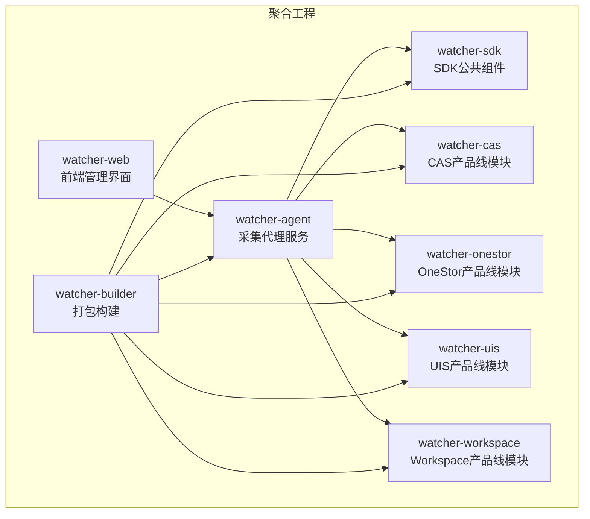
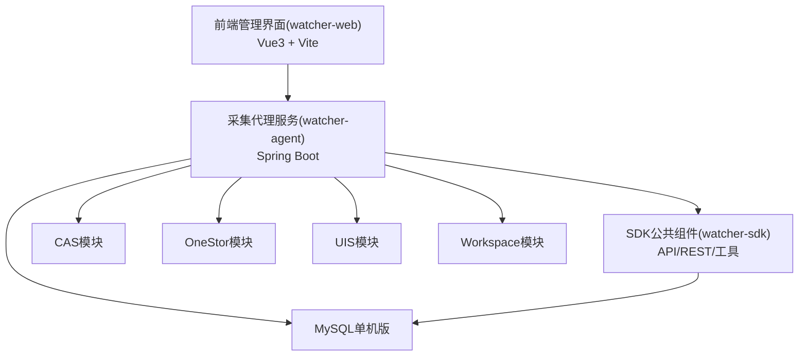
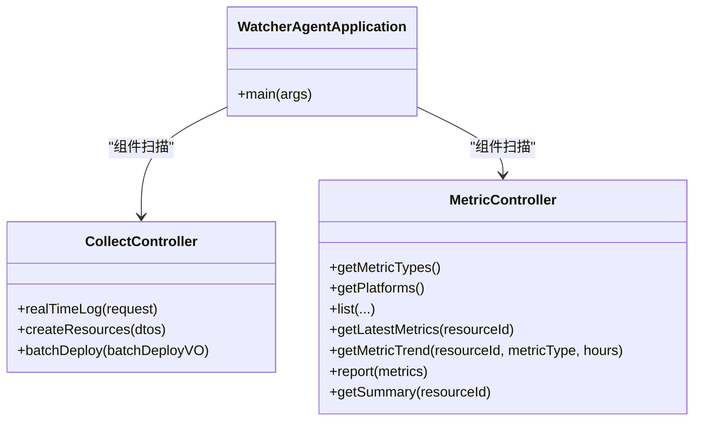
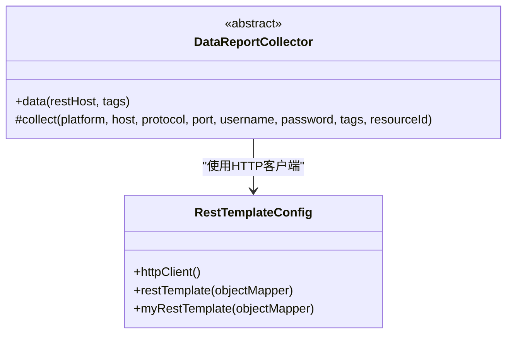
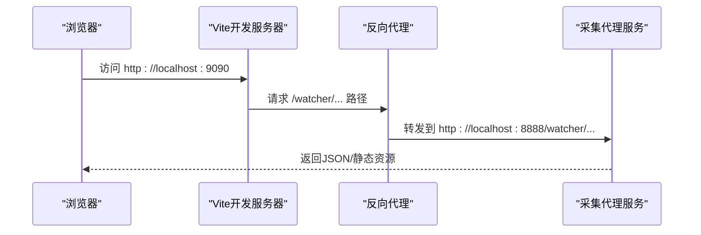
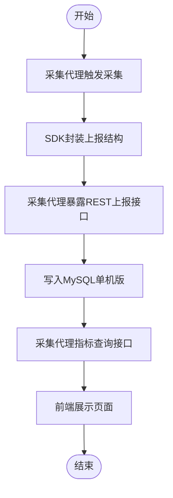
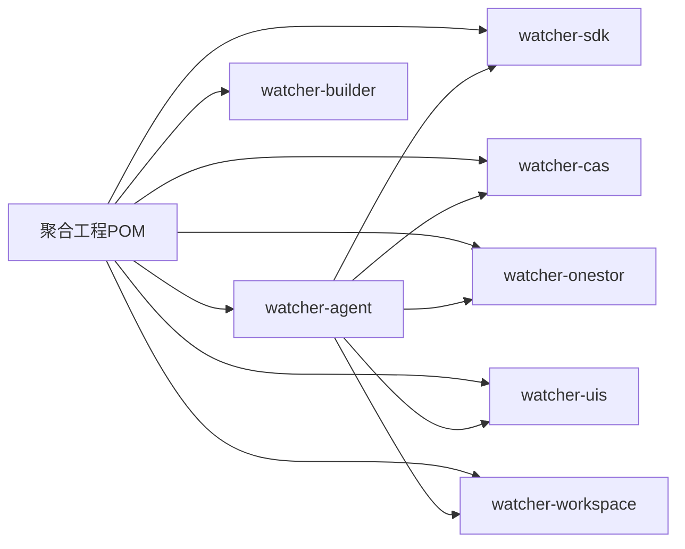

# 系统架构设计

<cite>
**本文引用的文件**
- [Readme.md](file://Readme.md)
- [pom.xml](file://pom.xml)
- [watcher-agent/src/main/java/com/virtual/cloud/om/agent/WatcherAgentApplication.java](file://watcher-agent/src/main/java/com/virtual/cloud/om/agent/WatcherAgentApplication.java)
- [watcher-agent/src/main/java/com/virtual/cloud/om/agent/controller/CollectController.java](file://watcher-agent/src/main/java/com/virtual/cloud/om/agent/controller/CollectController.java)
- [watcher-agent/src/main/java/com/virtual/cloud/om/agent/controller/MetricController.java](file://watcher-agent/src/main/java/com/virtual/cloud/om/agent/controller/MetricController.java)
- [watcher-agent/src/main/resources/application.properties](file://watcher-agent/src/main/resources/application.properties)
- [watcher-sdk/src/main/java/com/virtual/cloud/om/sdk/api/DataReportCollector.java](file://watcher-sdk/src/main/java/com/virtual/cloud/om/sdk/api/DataReportCollector.java)
- [watcher-sdk/src/main/java/com/virtual/cloud/om/sdk/aop/DataReportAspect.java](file://watcher-sdk/src/main/java/com/virtual/cloud/om/sdk/aop/DataReportAspect.java)
- [watcher-sdk/src/main/java/com/virtual/cloud/om/sdk/config/rest/RestTemplateConfig.java](file://watcher-sdk/src/main/java/com/virtual/cloud/om/sdk/config/rest/RestTemplateConfig.java)
- [watcher-sdk/pom.xml](file://watcher-sdk/pom.xml)
- [watcher-web/src/main.ts](file://watcher-web/src/main.ts)
- [watcher-web/vite.config.ts](file://watcher-web/vite.config.ts)
- [watcher-web/package.json](file://watcher-web/package.json)
</cite>

## 目录
1. [简介](#简介)
2. [项目结构](#项目结构)
3. [核心组件](#核心组件)
4. [架构总览](#架构总览)
5. [详细组件分析](#详细组件分析)
6. [依赖分析](#依赖分析)
7. [性能考量](#性能考量)
8. [故障排查指南](#故障排查指南)
9. [结论](#结论)
10. [附录](#附录)

## 简介
ShowTime监控系统面向新华三云基产品线，提供日志采集与全文检索、指标采集与监控报表、爬虫/知识库等功能。系统采用多模块聚合工程组织，核心由“采集代理服务”“产品线监控模块”“SDK公共组件”“前端管理界面”等组成，形成“采集-传输-存储-展示”的闭环数据流。

## 项目结构
- 聚合工程通过顶层POM管理各子模块，包含采集代理、产品线模块（CAS/OneStor/UIS/Workspace）、SDK、打包构建、Web前端等。
- 当前版本在“MySQL单机版”模式下禁用了MongoDB、Kafka、Elasticsearch、ClickHouse、Quartz等中间件，以简化部署与演示。
- 前端采用Vue3 + Vite，通过反向代理对接后端采集服务。

图表来源
- [pom.xml:11-20](file://pom.xml#L11-L20)
- [Readme.md:29-38](file://Readme.md#L29-L38)

章节来源
- [Readme.md:27-38](file://Readme.md#L27-L38)
- [pom.xml:11-20](file://pom.xml#L11-L20)

## 核心组件
- 采集代理服务（watcher-agent）：Spring Boot应用，负责资源管理、定时任务调度、日志/指标采集策略下发、与产品线模块及SDK交互。
- SDK公共组件（watcher-sdk）：提供通用API、REST客户端、实体映射、常量与工具类，支撑采集与上报。
- 产品线监控模块：按产品线拆分（CAS/OneStor/UIS/Workspace），实现特定指标采集与日志解析。
- 前端管理界面（watcher-web）：Vue3应用，提供登录、资源管理、指标查询、实时日志策略下发等界面。
- 打包构建（watcher-builder）：提供组件打包、安装脚本与服务注册模板，便于部署。

章节来源
- [watcher-agent/src/main/java/com/virtual/cloud/om/agent/WatcherAgentApplication.java:14-27](file://watcher-agent/src/main/java/com/virtual/cloud/om/agent/WatcherAgentApplication.java#L14-L27)
- [watcher-sdk/pom.xml:17-160](file://watcher-sdk/pom.xml#L17-L160)
- [watcher-web/src/main.ts:1-37](file://watcher-web/src/main.ts#L1-L37)

## 架构总览
系统采用“集中式采集 + 统一SDK + 多产品线插件化”的架构模式。采集代理作为控制中枢，通过SDK提供的API与REST客户端与各产品线模块通信；前端通过反向代理访问采集代理，实现策略下发与数据查询。

图表来源
- [watcher-web/vite.config.ts:27-33](file://watcher-web/vite.config.ts#L27-L33)
- [watcher-agent/src/main/resources/application.properties:48-58](file://watcher-agent/src/main/resources/application.properties#L48-L58)
- [watcher-sdk/src/main/java/com/virtual/cloud/om/sdk/config/rest/RestTemplateConfig.java:124-136](file://watcher-sdk/src/main/java/com/virtual/cloud/om/sdk/config/rest/RestTemplateConfig.java#L124-L136)

## 详细组件分析

### 采集代理服务（watcher-agent）
- 启动与扫描：排除Quartz自动配置，启用定时任务注解，扫描SDK、CAS、UIS、Workspace、OneStor与Agent自身包路径。
- 控制器职责：
  - 日志实时上报策略下发与资源同步。
  - 指标查询与上报接口，支持类型、平台、分页、最新值、趋势、汇总等。
- 数据源：默认使用MySQL单机版（MariaDB驱动），MyBatis-Plus映射SDK实体。

图表来源
- [watcher-agent/src/main/java/com/virtual/cloud/om/agent/WatcherAgentApplication.java:14-27](file://watcher-agent/src/main/java/com/virtual/cloud/om/agent/WatcherAgentApplication.java#L14-L27)
- [watcher-agent/src/main/java/com/virtual/cloud/om/agent/controller/CollectController.java:30-66](file://watcher-agent/src/main/java/com/virtual/cloud/om/agent/controller/CollectController.java#L30-L66)
- [watcher-agent/src/main/java/com/virtual/cloud/om/agent/controller/MetricController.java:24-102](file://watcher-agent/src/main/java/com/virtual/cloud/om/agent/controller/MetricController.java#L24-L102)

章节来源
- [watcher-agent/src/main/java/com/virtual/cloud/om/agent/WatcherAgentApplication.java:14-27](file://watcher-agent/src/main/java/com/virtual/cloud/om/agent/WatcherAgentApplication.java#L14-L27)
- [watcher-agent/src/main/java/com/virtual/cloud/om/agent/controller/CollectController.java:30-66](file://watcher-agent/src/main/java/com/virtual/cloud/om/agent/controller/CollectController.java#L30-L66)
- [watcher-agent/src/main/java/com/virtual/cloud/om/agent/controller/MetricController.java:24-102](file://watcher-agent/src/main/java/com/virtual/cloud/om/agent/controller/MetricController.java#L24-L102)
- [watcher-agent/src/main/resources/application.properties:48-58](file://watcher-agent/src/main/resources/application.properties#L48-L58)

### SDK公共组件（watcher-sdk）
- 数据采集抽象：定义统一的数据采集器基类，规范指标采集流程与上报结构。
- REST客户端：提供HTTP客户端与消息转换器配置，支持JAXB与JSON，具备重试与错误处理能力。
- 通用API与实体：提供DTO、枚举、常量、工具类，支撑各产品线模块与采集代理。

图表来源
- [watcher-sdk/src/main/java/com/virtual/cloud/om/sdk/api/DataReportCollector.java:19-117](file://watcher-sdk/src/main/java/com/virtual/cloud/om/sdk/api/DataReportCollector.java#L19-L117)
- [watcher-sdk/src/main/java/com/virtual/cloud/om/sdk/config/rest/RestTemplateConfig.java:52-136](file://watcher-sdk/src/main/java/com/virtual/cloud/om/sdk/config/rest/RestTemplateConfig.java#L52-L136)

章节来源
- [watcher-sdk/src/main/java/com/virtual/cloud/om/sdk/api/DataReportCollector.java:19-117](file://watcher-sdk/src/main/java/com/virtual/cloud/om/sdk/api/DataReportCollector.java#L19-L117)
- [watcher-sdk/src/main/java/com/virtual/cloud/om/sdk/config/rest/RestTemplateConfig.java:52-136](file://watcher-sdk/src/main/java/com/virtual/cloud/om/sdk/config/rest/RestTemplateConfig.java#L52-L136)
- [watcher-sdk/pom.xml:97-160](file://watcher-sdk/pom.xml#L97-L160)

### 前端管理界面（watcher-web）
- 应用入口：初始化Element Plus、国际化、路由、状态管理、事件总线与指令。
- 开发服务器：配置反向代理将 /watcher 前缀转发至后端采集服务，默认8888端口。
- 依赖生态：集成Vue3、Element Plus、ECharts、Axios、Mock等。

图表来源
- [watcher-web/vite.config.ts:27-33](file://watcher-web/vite.config.ts#L27-L33)
- [watcher-web/src/main.ts:24-36](file://watcher-web/src/main.ts#L24-L36)

章节来源
- [watcher-web/src/main.ts:1-37](file://watcher-web/src/main.ts#L1-L37)
- [watcher-web/vite.config.ts:13-49](file://watcher-web/vite.config.ts#L13-L49)
- [watcher-web/package.json:20-70](file://watcher-web/package.json#L20-L70)

### 数据流架构（采集-传输-存储-展示）
- 数据采集：采集代理通过SDK采集器从目标主机/平台拉取指标与日志，生成统一上报结构。
- 传输：采集代理提供REST接口接收策略与上报数据，SDK的REST客户端负责与产品线模块通信。
- 存储：当前版本使用MySQL单机版（MariaDB）持久化元数据与运行时信息；历史指标数据可接入列数据库或时序库（待实现）。
- 展示：前端通过反向代理访问采集代理接口，实现指标查询、趋势与汇总展示。

图表来源
- [watcher-sdk/src/main/java/com/virtual/cloud/om/sdk/api/DataReportCollector.java:48-86](file://watcher-sdk/src/main/java/com/virtual/cloud/om/sdk/api/DataReportCollector.java#L48-L86)
- [watcher-agent/src/main/java/com/virtual/cloud/om/agent/controller/MetricController.java:80-101](file://watcher-agent/src/main/java/com/virtual/cloud/om/agent/controller/MetricController.java#L80-L101)
- [watcher-agent/src/main/resources/application.properties:48-58](file://watcher-agent/src/main/resources/application.properties#L48-L58)
- [watcher-web/vite.config.ts:27-33](file://watcher-web/vite.config.ts#L27-L33)

章节来源
- [watcher-sdk/src/main/java/com/virtual/cloud/om/sdk/api/DataReportCollector.java:48-86](file://watcher-sdk/src/main/java/com/virtual/cloud/om/sdk/api/DataReportCollector.java#L48-L86)
- [watcher-agent/src/main/java/com/virtual/cloud/om/agent/controller/MetricController.java:24-102](file://watcher-agent/src/main/java/com/virtual/cloud/om/agent/controller/MetricController.java#L24-L102)
- [watcher-agent/src/main/resources/application.properties:48-58](file://watcher-agent/src/main/resources/application.properties#L48-L58)
- [watcher-web/vite.config.ts:27-33](file://watcher-web/vite.config.ts#L27-L33)

## 依赖分析
- 聚合工程模块：通过顶层POM统一管理版本与插件，子模块按功能域拆分，降低耦合度。
- 采集代理对SDK的依赖：通过组件扫描与Mapper扫描，直接使用SDK的API与实体。
- 前端对后端的依赖：通过Vite代理将请求路由到采集代理，避免跨域问题。
- 中间件策略：当前版本禁用MongoDB、Kafka、Elasticsearch、ClickHouse、Quartz，聚焦MySQL单机版，便于快速部署与演示。

图表来源
- [pom.xml:11-20](file://pom.xml#L11-L20)
- [watcher-agent/src/main/java/com/virtual/cloud/om/agent/WatcherAgentApplication.java:16-18](file://watcher-agent/src/main/java/com/virtual/cloud/om/agent/WatcherAgentApplication.java#L16-L18)

章节来源
- [pom.xml:11-20](file://pom.xml#L11-L20)
- [watcher-agent/src/main/java/com/virtual/cloud/om/agent/WatcherAgentApplication.java:16-18](file://watcher-agent/src/main/java/com/virtual/cloud/om/agent/WatcherAgentApplication.java#L16-L18)

## 性能考量
- HTTP客户端连接池：SDK的RestTemplate配置了高并发连接池、Socket参数与重试策略，提升与产品线模块通信的稳定性。
- 前端资源分包：Vite配置手动分包，将图表库独立打包，优化首屏加载。
- 数据库连接：MySQL单机版配置了连接超时与字符集，建议在生产环境评估连接池大小与慢查询优化。
- 可扩展性：当前禁用消息队列与搜索引擎，简化部署；若需高吞吐采集与全文检索，可在保留SDK的前提下引入Kafka与Elasticsearch。

章节来源
- [watcher-sdk/src/main/java/com/virtual/cloud/om/sdk/config/rest/RestTemplateConfig.java:77-105](file://watcher-sdk/src/main/java/com/virtual/cloud/om/sdk/config/rest/RestTemplateConfig.java#L77-L105)
- [watcher-web/vite.config.ts:35-43](file://watcher-web/vite.config.ts#L35-L43)
- [watcher-agent/src/main/resources/application.properties:48-58](file://watcher-agent/src/main/resources/application.properties#L48-L58)

## 故障排查指南
- 启动与端口
  - 采集代理默认端口与上下文路径：确认后端端口与代理路径一致。
  - 前端开发服务器端口与代理目标：确保Vite代理指向采集代理地址。
- 数据源
  - MySQL单机版连接参数：检查URL、用户名、密码与驱动类名。
  - MyBatis-Plus映射：确认实体包扫描与XML映射位置。
- 中间件开关
  - 当前版本禁用MongoDB、Kafka、Elasticsearch、ClickHouse、Quartz：若出现启动异常，优先检查相关开关与占位配置。
- REST通信
  - SDK的RestTemplate配置：关注连接超时、Socket配置与错误处理器。

章节来源
- [watcher-web/vite.config.ts:23-33](file://watcher-web/vite.config.ts#L23-L33)
- [watcher-agent/src/main/resources/application.properties:1-80](file://watcher-agent/src/main/resources/application.properties#L1-L80)
- [watcher-sdk/src/main/java/com/virtual/cloud/om/sdk/config/rest/RestTemplateConfig.java:52-136](file://watcher-sdk/src/main/java/com/virtual/cloud/om/sdk/config/rest/RestTemplateConfig.java#L52-L136)

## 结论
ShowTime监控系统通过“采集代理 + SDK + 多产品线模块 + 前端”的架构，在当前MySQL单机版模式下实现了低门槛部署与演示。未来可按需引入消息队列与搜索引擎，进一步提升采集吞吐与检索能力；同时保持SDK与模块化设计，确保扩展性与可维护性。

## 附录
- 技术栈与模块定位：参考顶层README与聚合工程POM。
- 前端依赖与脚本：参考package.json与Vite配置。
- SDK与采集器：参考SDK模块的采集抽象与REST配置。

章节来源
- [Readme.md:11-26](file://Readme.md#L11-L26)
- [pom.xml:11-20](file://pom.xml#L11-L20)
- [watcher-web/package.json:1-72](file://watcher-web/package.json#L1-L72)
- [watcher-sdk/src/main/java/com/virtual/cloud/om/sdk/api/DataReportCollector.java:19-117](file://watcher-sdk/src/main/java/com/virtual/cloud/om/sdk/api/DataReportCollector.java#L19-L117)