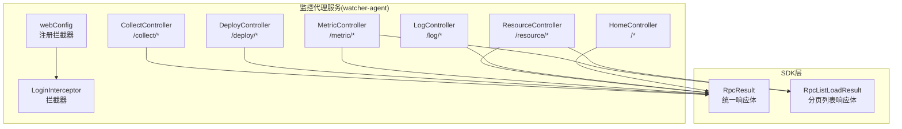
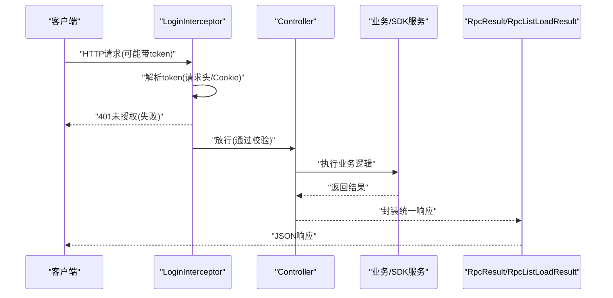
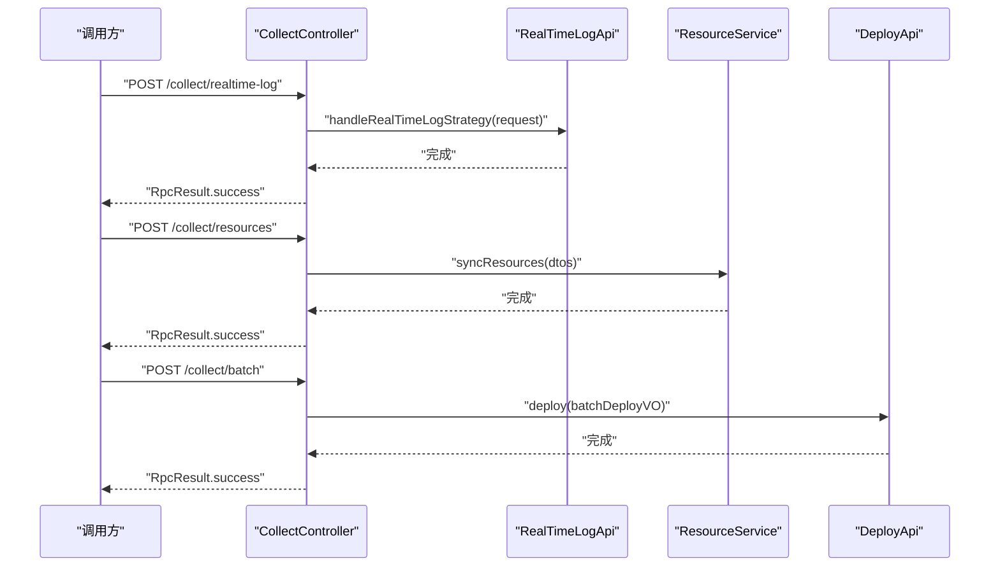
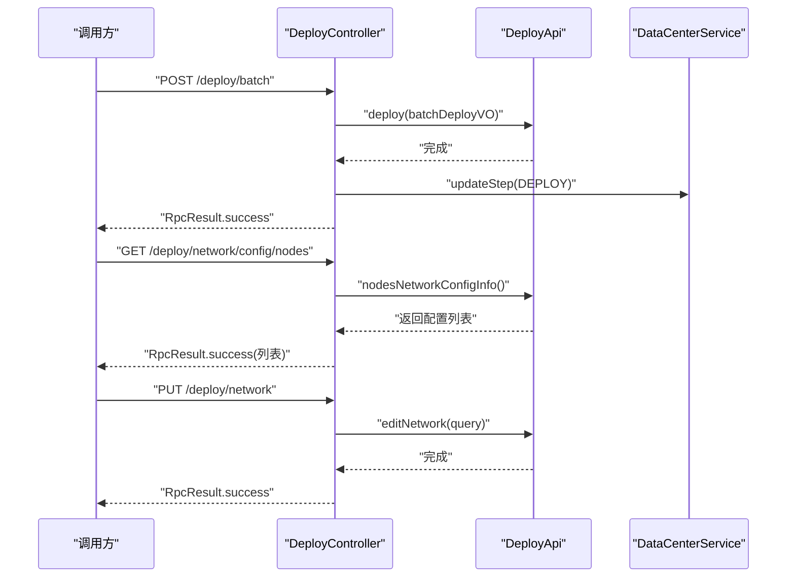
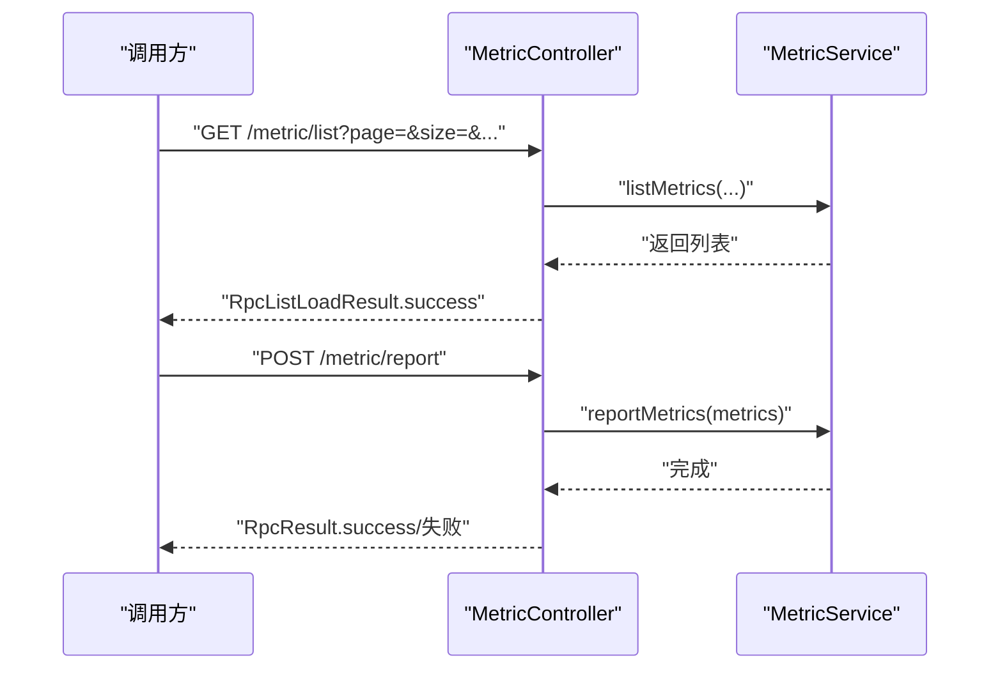
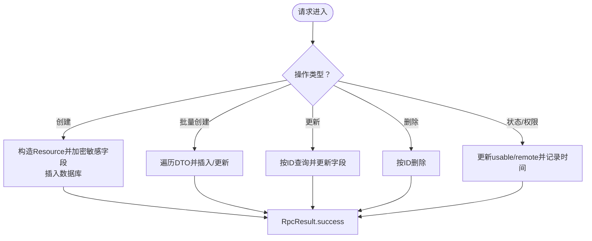
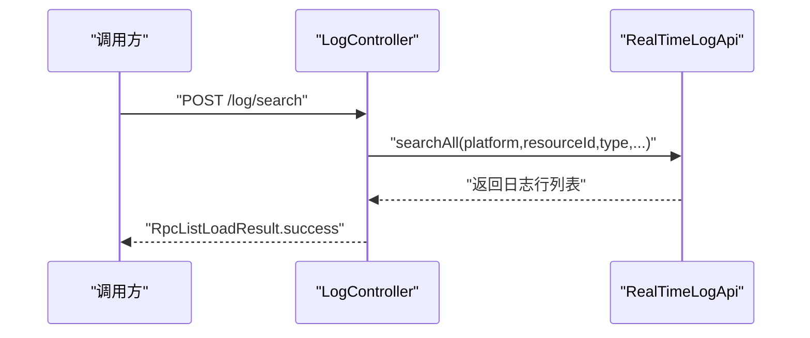
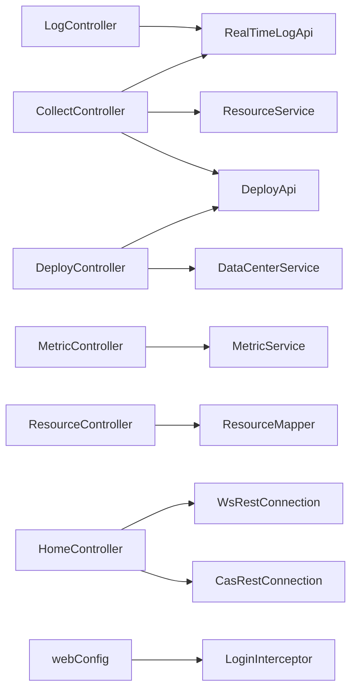

# API通信机制

<cite>
**本文引用的文件**
- [CollectController.java](file://watcher-agent/src/main/java/com/virtual/cloud/om/agent/controller/CollectController.java)
- [DeployController.java](file://watcher-agent/src/main/java/com/virtual/cloud/om/agent/controller/DeployController.java)
- [MetricController.java](file://watcher-agent/src/main/java/com/virtual/cloud/om/agent/controller/MetricController.java)
- [HomeController.java](file://watcher-agent/src/main/java/com/virtual/cloud/om/agent/controller/HomeController.java)
- [LoginController.java](file://watcher-agent/src/main/java/com/virtual/cloud/om/agent/controller/LoginController.java)
- [ResourceController.java](file://watcher-agent/src/main/java/com/virtual/cloud/om/agent/controller/ResourceController.java)
- [LogController.java](file://watcher-agent/src/main/java/com/virtual/cloud/om/agent/controller/LogController.java)
- [RpcResult.java](file://watcher-sdk/src/main/java/com/virtual/cloud/om/sdk/dto/RpcResult.java)
- [RpcListLoadResult.java](file://watcher-sdk/src/main/java/com/virtual/cloud/om/sdk/dto/RpcListLoadResult.java)
- [LoginInterceptor.java](file://watcher-agent/src/main/java/com/virtual/cloud/om/agent/config/LoginInterceptor.java)
- [webConfig.java](file://watcher-agent/src/main/java/com/virtual/cloud/om/agent/filter/webConfig.java)
- [application.properties](file://watcher-agent/src/main/resources/application.properties)
</cite>

## 目录
1. [引言](#引言)
2. [项目结构](#项目结构)
3. [核心组件](#核心组件)
4. [架构总览](#架构总览)
5. [详细组件分析](#详细组件分析)
6. [依赖分析](#依赖分析)
7. [性能考虑](#性能考虑)
8. [故障排查指南](#故障排查指南)
9. [结论](#结论)
10. [附录](#附录)

## 引言
本文件面向ShowTime监控系统的“监控代理服务”（watcher-agent）与其内部模块及外部产品线之间的REST API通信机制，系统性梳理数据采集API、部署管理API、指标查询API的接口设计、参数校验、错误处理、认证授权、安全防护、版本管理与性能优化策略，并提供可操作的调用示例与响应格式说明。

## 项目结构
watcher-agent作为Spring Boot应用，通过@RestController注解的控制器对外暴露REST接口；SDK层提供统一的RPC响应模型与常量定义，拦截器负责全局认证校验；配置文件集中管理端口、上下文路径与外部服务地址。

图表来源
- [CollectController.java:27-66](file://watcher-agent/src/main/java/com/virtual/cloud/om/agent/controller/CollectController.java#L27-L66)
- [DeployController.java:32-324](file://watcher-agent/src/main/java/com/virtual/cloud/om/agent/controller/DeployController.java#L32-L324)
- [MetricController.java:19-102](file://watcher-agent/src/main/java/com/virtual/cloud/om/agent/controller/MetricController.java#L19-L102)
- [ResourceController.java:24-234](file://watcher-agent/src/main/java/com/virtual/cloud/om/agent/controller/ResourceController.java#L24-L234)
- [LogController.java:20-35](file://watcher-agent/src/main/java/com/virtual/cloud/om/agent/controller/LogController.java#L20-L35)
- [RpcResult.java:3-87](file://watcher-sdk/src/main/java/com/virtual/cloud/om/sdk/dto/RpcResult.java#L3-L87)
- [RpcListLoadResult.java:10-56](file://watcher-sdk/src/main/java/com/virtual/cloud/om/sdk/dto/RpcListLoadResult.java#L10-L56)
- [LoginInterceptor.java:29-99](file://watcher-agent/src/main/java/com/virtual/cloud/om/agent/config/LoginInterceptor.java#L29-L99)
- [webConfig.java:12-37](file://watcher-agent/src/main/java/com/virtual/cloud/om/agent/filter/webConfig.java#L12-L37)

章节来源
- [application.properties:1-80](file://watcher-agent/src/main/resources/application.properties#L1-L80)

## 核心组件
- 统一响应模型
  - RpcResult：通用成功/失败/部分成功/错误状态封装，携带data或错误码与消息。
  - RpcListLoadResult：分页列表响应，包含data列表与状态字段。
- 认证拦截器
  - LoginInterceptor：优先从请求头读取token，否则从Cookie读取；校验失败返回401并JSON响应。
  - webConfig：注册拦截器，排除登录、Swagger、采集与日志等无需鉴权的路径。
- 应用配置
  - application.properties：端口、上下文路径、数据库、外部服务地址、中间件开关等。

章节来源
- [RpcResult.java:3-87](file://watcher-sdk/src/main/java/com/virtual/cloud/om/sdk/dto/RpcResult.java#L3-L87)
- [RpcListLoadResult.java:10-56](file://watcher-sdk/src/main/java/com/virtual/cloud/om/sdk/dto/RpcListLoadResult.java#L10-L56)
- [LoginInterceptor.java:29-99](file://watcher-agent/src/main/java/com/virtual/cloud/om/agent/config/LoginInterceptor.java#L29-L99)
- [webConfig.java:12-37](file://watcher-agent/src/main/java/com/virtual/cloud/om/agent/filter/webConfig.java#L12-L37)
- [application.properties:1-80](file://watcher-agent/src/main/resources/application.properties#L1-L80)

## 架构总览
监控代理服务通过控制器暴露REST接口，控制器内部调用SDK API或业务服务完成具体逻辑；统一使用RpcResult/RpcListLoadResult进行响应；拦截器在进入业务前进行认证校验。

图表来源
- [LoginInterceptor.java:36-73](file://watcher-agent/src/main/java/com/virtual/cloud/om/agent/config/LoginInterceptor.java#L36-L73)
- [RpcResult.java:15-45](file://watcher-sdk/src/main/java/com/virtual/cloud/om/sdk/dto/RpcResult.java#L15-L45)
- [RpcListLoadResult.java:40-46](file://watcher-sdk/src/main/java/com/virtual/cloud/om/sdk/dto/RpcListLoadResult.java#L40-L46)

## 详细组件分析

### 数据采集API
- 接口范围：/collect/*
- 主要能力
  - 实时日志策略下发与处理
  - 资源批量同步
  - 批量部署触发
- 关键点
  - 使用RpcResult统一返回
  - 资源同步委托至ResourceService
  - 批量部署默认掩码处理

图表来源
- [CollectController.java:45-65](file://watcher-agent/src/main/java/com/virtual/cloud/om/agent/controller/CollectController.java#L45-L65)

章节来源
- [CollectController.java:27-66](file://watcher-agent/src/main/java/com/virtual/cloud/om/agent/controller/CollectController.java#L27-L66)

### 部署管理API
- 接口范围：/deploy/*
- 主要能力
  - 多节点/单节点部署
  - 部署状态查询
  - 组件服务管理
  - 应用刷新
  - 主备通知
  - 步骤更新
  - 网络配置（新增/编辑/查询）、策略路由、DNS、重启网络服务
  - 路由增删改查与连通性检测
- 关键点
  - 成功/失败均更新数据中心步骤状态
  - 网络配置写入本地文件，便于部署流程控制
  - 多处使用RpcResult统一返回

图表来源
- [DeployController.java:46-180](file://watcher-agent/src/main/java/com/virtual/cloud/om/agent/controller/DeployController.java#L46-L180)

章节来源
- [DeployController.java:32-324](file://watcher-agent/src/main/java/com/virtual/cloud/om/agent/controller/DeployController.java#L32-L324)

### 指标查询API
- 接口范围：/metric/*
- 主要能力
  - 查询支持的指标类型与平台
  - 分页查询指标数据列表
  - 查询资源最新指标
  - 查询指标趋势
  - 上报指标数据
  - 获取资源指标汇总
- 关键点
  - 列表查询支持分页与多条件过滤
  - 上报接口对异常进行捕获并返回错误信息
  - 使用RpcResult/RpcListLoadResult统一响应

图表来源
- [MetricController.java:41-91](file://watcher-agent/src/main/java/com/virtual/cloud/om/agent/controller/MetricController.java#L41-L91)

章节来源
- [MetricController.java:19-102](file://watcher-agent/src/main/java/com/virtual/cloud/om/agent/controller/MetricController.java#L19-L102)

### 资源管理API
- 接口范围：/resource/*
- 主要能力
  - 资源列表查询（支持平台、名称、IP过滤）
  - 资源详情查询
  - 创建/批量创建资源（含敏感字段加密）
  - 更新资源
  - 删除资源
  - 更新资源可用状态与远程SSH权限
- 关键点
  - 批量创建存在存在即更新逻辑
  - 敏感字段采用SM4加密存储
  - 统一使用RpcResult返回

图表来源
- [ResourceController.java:67-233](file://watcher-agent/src/main/java/com/virtual/cloud/om/agent/controller/ResourceController.java#L67-L233)

章节来源
- [ResourceController.java:24-234](file://watcher-agent/src/main/java/com/virtual/cloud/om/agent/controller/ResourceController.java#L24-L234)

### 日志检索API
- 接口范围：/log/*
- 主要能力
  - 在线日志检索（平台、资源ID、类型、目标ID、路径、查询条件、时间范围、排序、数量、级别）
- 关键点
  - 使用RpcListLoadResult返回日志行集合
  - 委托RealTimeLogApi执行检索

图表来源
- [LogController.java:27-34](file://watcher-agent/src/main/java/com/virtual/cloud/om/agent/controller/LogController.java#L27-L34)

章节来源
- [LogController.java:20-35](file://watcher-agent/src/main/java/com/virtual/cloud/om/agent/controller/LogController.java#L20-L35)

### 登录与参数管理API
- 登录相关：/user/*
  - 登录、修改用户、登出、查询密码复杂度
  - 返回RpcResult，登录成功返回token
- 参数配置：/parameter
  - 编辑参数并返回当前值
- 日志管理：/log
  - 查询操作日志、删除指定时间前的日志

章节来源
- [LoginController.java:13-91](file://watcher-agent/src/main/java/com/virtual/cloud/om/agent/controller/LoginController.java#L13-L91)
- [HomeController.java:24-99](file://watcher-agent/src/main/java/com/virtual/cloud/om/agent/controller/HomeController.java#L24-L99)

## 依赖分析
- 控制器到SDK/服务的依赖
  - CollectController依赖RealTimeLogApi、ResourceService、DeployApi
  - DeployController依赖DeployApi、DataCenterService
  - MetricController依赖MetricService
  - ResourceController依赖ResourceMapper
  - LogController依赖RealTimeLogApi
  - HomeController依赖WsRestConnection、CasRestConnection
- 统一响应与拦截
  - 所有控制器返回RpcResult/RpcListLoadResult
  - LoginInterceptor在webConfig中注册，排除无需鉴权路径

图表来源
- [CollectController.java:32-42](file://watcher-agent/src/main/java/com/virtual/cloud/om/agent/controller/CollectController.java#L32-L42)
- [DeployController.java:38-42](file://watcher-agent/src/main/java/com/virtual/cloud/om/agent/controller/DeployController.java#L38-L42)
- [MetricController.java:26-27](file://watcher-agent/src/main/java/com/virtual/cloud/om/agent/controller/MetricController.java#L26-L27)
- [ResourceController.java:31-32](file://watcher-agent/src/main/java/com/virtual/cloud/om/agent/controller/ResourceController.java#L31-L32)
- [LogController.java:24-25](file://watcher-agent/src/main/java/com/virtual/cloud/om/agent/controller/LogController.java#L24-L25)
- [HomeController.java:47-50](file://watcher-agent/src/main/java/com/virtual/cloud/om/agent/controller/HomeController.java#L47-L50)
- [webConfig.java:19-36](file://watcher-agent/src/main/java/com/virtual/cloud/om/agent/filter/webConfig.java#L19-L36)

章节来源
- [webConfig.java:12-37](file://watcher-agent/src/main/java/com/virtual/cloud/om/agent/filter/webConfig.java#L12-L37)

## 性能考虑
- 缓存机制
  - 可在业务层引入本地缓存（如Guava/Caffeine）缓存热点资源与指标元数据，降低重复查询开销。
- 批量处理
  - 资源批量创建/更新已在控制器内实现，建议在服务层进一步合并事务，减少数据库往返。
- 异步调用
  - 对于耗时操作（如网络重启、路由变更），控制器已采用线程池异步刷新应用；可扩展到日志检索与指标上报等场景。
- 并发与限流
  - 建议在网关或控制器层增加基于IP/令牌的限流策略，避免突发流量冲击。
- 响应压缩与连接复用
  - 启用Gzip压缩与HTTP Keep-Alive，提升大列表/日志响应效率。

## 故障排查指南
- 认证失败
  - 现象：返回401未授权，响应体包含错误码与消息。
  - 排查：确认请求头是否携带token，或Cookie中是否存在有效token；检查拦截器排除规则。
- 参数校验失败
  - 现象：控制器抛出异常或返回失败响应。
  - 排查：核对请求体结构与必填字段；查看控制器日志与异常栈。
- 网络配置失败
  - 现象：网络重启失败或策略路由未生效。
  - 排查：检查命令执行输出、配置文件写入路径、防火墙与路由表状态。
- 指标上报失败
  - 现象：返回“上报失败+错误信息”。
  - 排查：检查指标数据格式、服务端入库逻辑与数据库连接状态。

章节来源
- [LoginInterceptor.java:36-73](file://watcher-agent/src/main/java/com/virtual/cloud/om/agent/config/LoginInterceptor.java#L36-L73)
- [DeployController.java:148-180](file://watcher-agent/src/main/java/com/virtual/cloud/om/agent/controller/DeployController.java#L148-L180)
- [MetricController.java:82-91](file://watcher-agent/src/main/java/com/virtual/cloud/om/agent/controller/MetricController.java#L82-L91)

## 结论
监控代理服务通过清晰的REST接口划分与统一的响应模型，实现了与各产品线模块的稳定通信。结合拦截器认证、明确的参数校验与错误处理策略，以及可扩展的性能优化手段，能够满足生产环境下的高可用与高并发需求。后续可在网关层完善版本管理与灰度发布策略，进一步增强API治理能力。

## 附录

### API设计规范与调用示例

- 通用响应格式
  - 成功：包含状态码与数据；失败：包含状态码、错误码与错误消息。
  - 列表分页：使用RpcListLoadResult，包含data列表与状态。
- 请求头设置
  - 鉴权：在请求头设置token；若未设置，将尝试从Cookie读取。
  - 内容类型：JSON请求需设置Content-Type为application/json。
- 参数传递
  - 路径参数：如/resource/detail/{id}，在URL中传入资源ID。
  - 查询参数：如/metric/list?page=0&size=100，支持多条件组合。
  - 请求体：如POST /metric/report，请求体为指标数组。
- 返回值解析
  - 成功：读取data字段；失败：读取错误码与错误消息字段。

- 示例清单（不含代码内容）
  - 实时日志策略下发
    - 方法与路径：POST /collect/realtime-log
    - 请求体：日志策略数组
    - 响应：RpcResult.success
  - 资源批量同步
    - 方法与路径：POST /collect/resources
    - 请求体：资源DTO数组
    - 响应：RpcResult.success
  - 批量部署
    - 方法与路径：POST /collect/batch
    - 请求体：部署批次对象
    - 响应：RpcResult.success
  - 多节点部署
    - 方法与路径：POST /deploy/batch
    - 请求体：批量部署对象（掩码为空则使用默认值）
    - 响应：RpcResult.success/失败
  - 获取节点状态
    - 方法与路径：GET /deploy
    - 响应：RpcListLoadResult<DeployQueryVO>
  - 组件服务管理
    - 方法与路径：PUT /deploy/manage
    - 请求体：组件管理对象
    - 响应：RpcResult.success
  - 应用刷新
    - 方法与路径：GET /deploy/refresh
    - 响应：RpcResult.success
  - 获取/配置网络
    - 方法与路径：GET /deploy/network 或 POST /deploy/network
    - 请求体：网络配置对象
    - 响应：RpcResult.success/失败
  - 路由管理
    - 方法与路径：GET /deploy/route 或 POST /deploy/route 或 PUT /deploy/route 或 DELETE /deploy/route
    - 响应：RpcResult.success/失败
  - 指标类型与平台查询
    - 方法与路径：GET /metric/types 或 GET /metric/platforms
    - 响应：RpcResult<List<Map<String,String>>>
  - 指标列表查询
    - 方法与路径：GET /metric/list
    - 查询参数：resourceId、platform、metricType、startTime、endTime、page、size
    - 响应：RpcListLoadResult<Map<String,Object>>
  - 最新指标
    - 方法与路径：GET /metric/latest/{resourceId}
    - 响应：RpcResult<List<MetricData>> 或失败
  - 指标趋势
    - 方法与路径：GET /metric/trend/{resourceId}/{metricType}
    - 查询参数：hours
    - 响应：RpcResult<List<MetricData>>
  - 指标上报
    - 方法与路径：POST /metric/report
    - 请求体：指标数组
    - 响应：RpcResult.success/失败
  - 资源列表
    - 方法与路径：GET /resource/list
    - 查询参数：platform、resourceName、ipAddress、page、size
    - 响应：RpcListLoadResult<Resource>
  - 资源详情
    - 方法与路径：GET /resource/detail/{id}
    - 响应：RpcResult<Resource> 或失败
  - 创建资源
    - 方法与路径：POST /resource/create
    - 请求体：ResourceDTO
    - 响应：RpcResult.success/失败
  - 批量创建资源
    - 方法与路径：POST /resource/batchCreate
    - 请求体：ResourceDTO数组
    - 响应：RpcResult.success/失败
  - 更新资源
    - 方法与路径：PUT /resource/update
    - 请求体：ResourceDTO
    - 响应：RpcResult.success/失败
  - 删除资源
    - 方法与路径：DELETE /resource/delete/{id}
    - 响应：RpcResult.success/失败
  - 更新资源可用状态
    - 方法与路径：PUT /resource/usable/{id}?usable=...
    - 响应：RpcResult.success/失败
  - 更新SSH权限
    - 方法与路径：PUT /resource/remote/{id}?remote=...
    - 响应：RpcResult.success/失败
  - 在线日志检索
    - 方法与路径：POST /log/search
    - 请求体：导出日志请求对象
    - 响应：RpcListLoadResult<LogLine>
  - 登录
    - 方法与路径：POST /user/login
    - 请求体：用户凭据
    - 响应：RpcResult<String>(token)
  - 修改用户
    - 方法与路径：PUT /user/modifyUser
    - 请求体：修改用户对象
    - 响应：RpcResult.success/失败
  - 登出
    - 方法与路径：POST /user/logout
    - 响应：RpcResult.success/失败
  - 查询密码复杂度
    - 方法与路径：GET /user/search/complexity
    - 响应：RpcResult<Integer>
  - 参数编辑
    - 方法与路径：POST /parameter
    - 请求体：参数对象
    - 响应：RpcResult<Parameter>
  - 日志查询
    - 方法与路径：GET /log
    - 查询参数：过滤条件
    - 响应：RpcListLoadResult<OperationLog>
  - 删除日志
    - 方法与路径：DELETE /log?time=...&persistent=...
    - 响应：RpcResult<Long>

章节来源
- [CollectController.java:45-65](file://watcher-agent/src/main/java/com/virtual/cloud/om/agent/controller/CollectController.java#L45-L65)
- [DeployController.java:46-324](file://watcher-agent/src/main/java/com/virtual/cloud/om/agent/controller/DeployController.java#L46-L324)
- [MetricController.java:29-101](file://watcher-agent/src/main/java/com/virtual/cloud/om/agent/controller/MetricController.java#L29-L101)
- [ResourceController.java:34-233](file://watcher-agent/src/main/java/com/virtual/cloud/om/agent/controller/ResourceController.java#L34-L233)
- [LogController.java:27-34](file://watcher-agent/src/main/java/com/virtual/cloud/om/agent/controller/LogController.java#L27-L34)
- [LoginController.java:25-90](file://watcher-agent/src/main/java/com/virtual/cloud/om/agent/controller/LoginController.java#L25-L90)
- [HomeController.java:76-91](file://watcher-agent/src/main/java/com/virtual/cloud/om/agent/controller/HomeController.java#L76-L91)

### 认证授权与安全防护
- 认证机制
  - 请求头优先携带token；若缺失则从Cookie读取；校验失败返回401。
- 授权范围
  - 拦截器对除登录、Swagger、采集、日志、应用刷新等路径外的所有请求进行拦截。
- 安全建议
  - 建议启用HTTPS、CORS白名单、请求速率限制与WAF。
  - 对敏感字段（密码、密钥）仅在传输与存储环节加密。

章节来源
- [LoginInterceptor.java:36-73](file://watcher-agent/src/main/java/com/virtual/cloud/om/agent/config/LoginInterceptor.java#L36-L73)
- [webConfig.java:19-36](file://watcher-agent/src/main/java/com/virtual/cloud/om/agent/filter/webConfig.java#L19-L36)

### 版本管理与兼容性
- 当前未发现显式的API版本号路径（如/v1/...），建议在路径或Header中引入版本标识，以便平滑演进。
- 响应模型RpcResult/RpcListLoadResult具备向后兼容性，新增字段不影响旧客户端解析。

章节来源
- [RpcResult.java:3-87](file://watcher-sdk/src/main/java/com/virtual/cloud/om/sdk/dto/RpcResult.java#L3-L87)
- [RpcListLoadResult.java:10-56](file://watcher-sdk/src/main/java/com/virtual/cloud/om/sdk/dto/RpcListLoadResult.java#L10-L56)