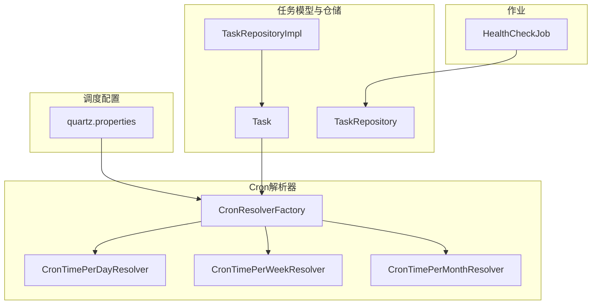
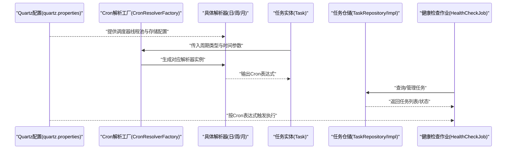
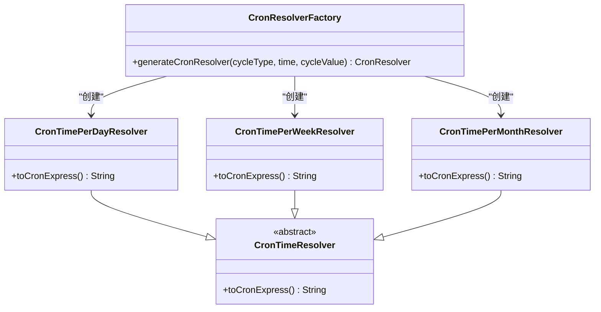
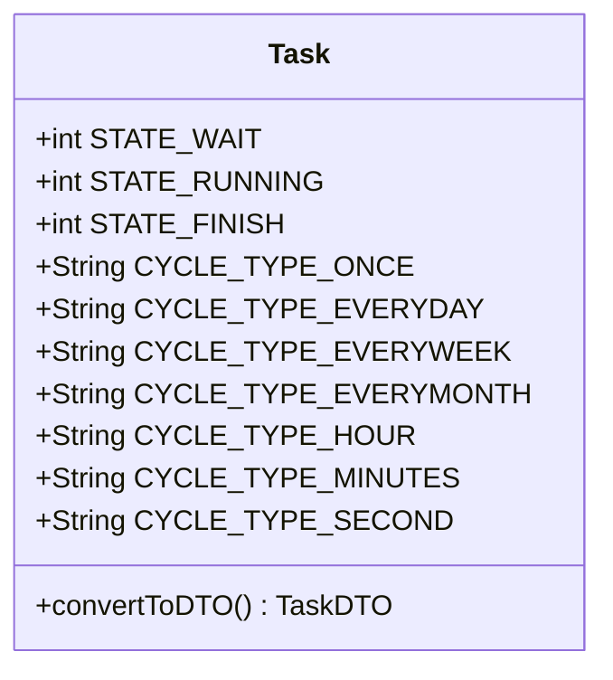
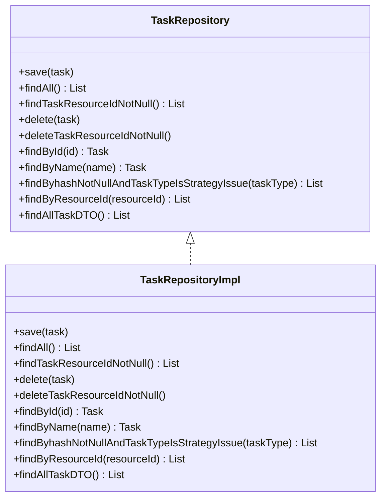
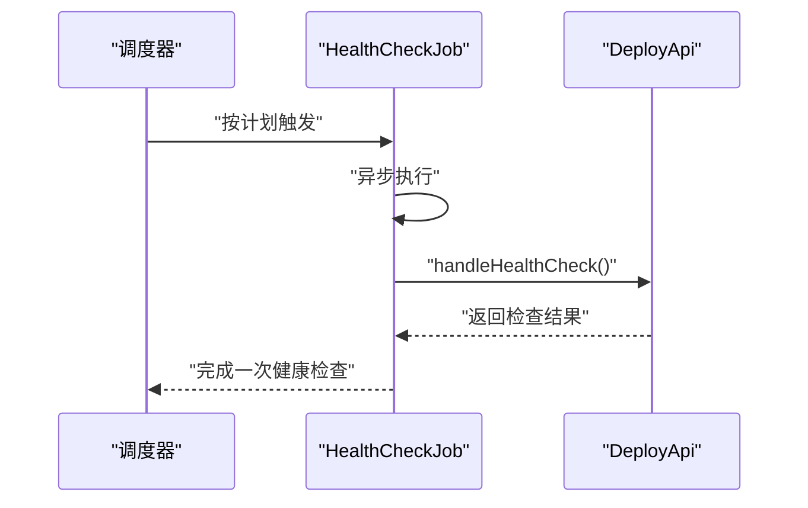
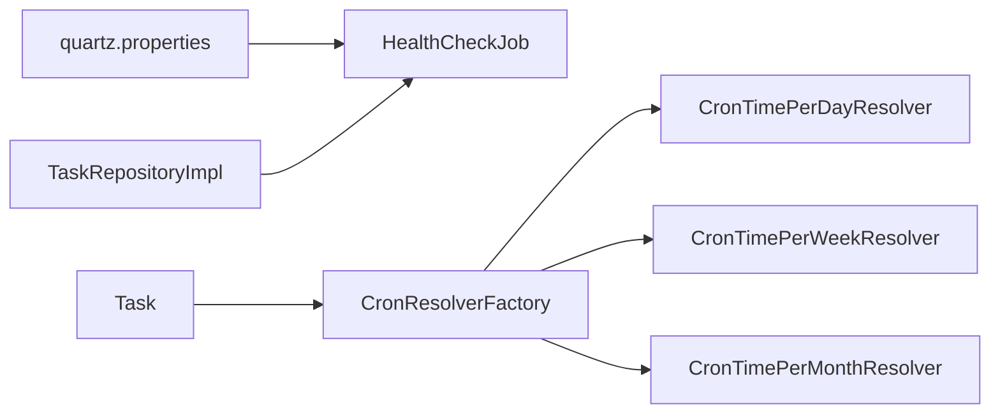
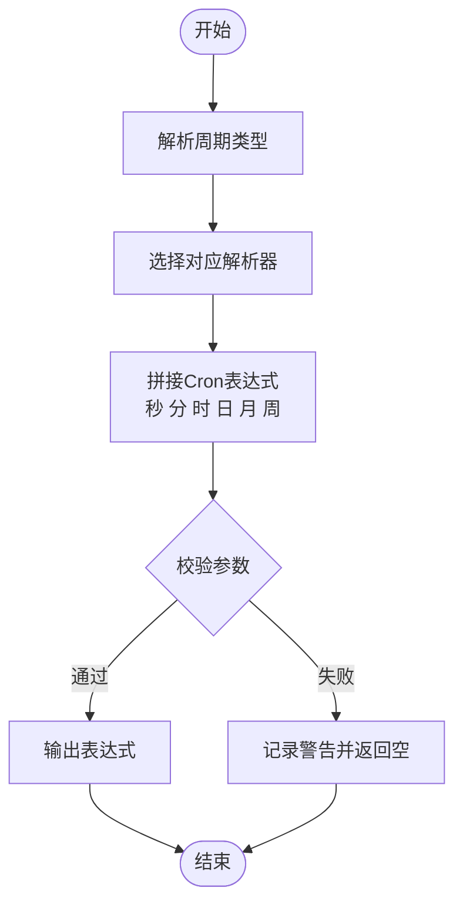

# 任务调度机制

<cite>
**本文引用的文件**
- [quartz.properties](file://watcher-agent/src/main/resources/quartz.properties)
- [HealthCheckJob.java](file://watcher-agent/src/main/java/com/virtual/cloud/om/agent/task/job/HealthCheckJob.java)
- [CronResolverFactory.java](file://watcher-agent/src/main/java/com/virtual/cloud/om/agent/task/cron/CronResolverFactory.java)
- [CronTimePerDayResolver.java](file://watcher-agent/src/main/java/com/virtual/cloud/om/agent/task/cron/CronTimePerDayResolver.java)
- [CronTimePerWeekResolver.java](file://watcher-agent/src/main/java/com/virtual/cloud/om/agent/task/cron/CronTimePerWeekResolver.java)
- [CronTimePerMonthResolver.java](file://watcher-agent/src/main/java/com/virtual/cloud/om/agent/task/cron/CronTimePerMonthResolver.java)
- [Task.java](file://watcher-agent/src/main/java/com/virtual/cloud/om/agent/entity/Task.java)
- [TaskRepository.java](file://watcher-agent/src/main/java/com/virtual/cloud/om/agent/repository/TaskRepository.java)
- [TaskRepositoryImpl.java](file://watcher-agent/src/main/java/com/virtual/cloud/om/agent/repository/TaskRepositoryImpl.java)
</cite>

## 目录
1. [引言](#引言)
2. [项目结构](#项目结构)
3. [核心组件](#核心组件)
4. [架构总览](#架构总览)
5. [详细组件分析](#详细组件分析)
6. [依赖关系分析](#依赖关系分析)
7. [性能考量](#性能考量)
8. [故障排查指南](#故障排查指南)
9. [结论](#结论)
10. [附录](#附录)

## 引言
本文件面向ShowTime监控系统的运维与开发人员，系统性阐述基于Quartz的定时任务调度机制，覆盖任务注册、执行计划与状态管理；解释Cron表达式解析与执行机制，支持的调度频率与时间计算规则；说明健康检查任务的实现原理与组件运行状态监控方式；并给出并发控制、优先级与资源分配策略建议，以及配置示例、最佳实践、失败处理与降级方案、监控与性能分析方法。

## 项目结构
围绕任务调度的关键模块主要位于watcher-agent子工程中，涉及Quartz配置、Cron解析器、任务实体与仓库、以及健康检查作业等。下图展示了与任务调度直接相关的文件与职责划分：

图表来源
- [quartz.properties:1-45](file://watcher-agent/src/main/resources/quartz.properties#L1-L45)
- [CronResolverFactory.java:1-45](file://watcher-agent/src/main/java/com/virtual/cloud/om/agent/task/cron/CronResolverFactory.java#L1-L45)
- [CronTimePerDayResolver.java:1-55](file://watcher-agent/src/main/java/com/virtual/cloud/om/agent/task/cron/CronTimePerDayResolver.java#L1-L55)
- [CronTimePerWeekResolver.java:1-64](file://watcher-agent/src/main/java/com/virtual/cloud/om/agent/task/cron/CronTimePerWeekResolver.java#L1-L64)
- [CronTimePerMonthResolver.java:1-55](file://watcher-agent/src/main/java/com/virtual/cloud/om/agent/task/cron/CronTimePerMonthResolver.java#L1-L55)
- [Task.java:1-148](file://watcher-agent/src/main/java/com/virtual/cloud/om/agent/entity/Task.java#L1-L148)
- [TaskRepository.java:1-34](file://watcher-agent/src/main/java/com/virtual/cloud/om/agent/repository/TaskRepository.java#L1-L34)
- [TaskRepositoryImpl.java:1-78](file://watcher-agent/src/main/java/com/virtual/cloud/om/agent/repository/TaskRepositoryImpl.java#L1-L78)
- [HealthCheckJob.java:1-35](file://watcher-agent/src/main/java/com/virtual/cloud/om/agent/task/job/HealthCheckJob.java#L1-L35)

章节来源
- [quartz.properties:1-45](file://watcher-agent/src/main/resources/quartz.properties#L1-L45)
- [CronResolverFactory.java:1-45](file://watcher-agent/src/main/java/com/virtual/cloud/om/agent/task/cron/CronResolverFactory.java#L1-L45)
- [Task.java:1-148](file://watcher-agent/src/main/java/com/virtual/cloud/om/agent/entity/Task.java#L1-L148)
- [TaskRepositoryImpl.java:1-78](file://watcher-agent/src/main/java/com/virtual/cloud/om/agent/repository/TaskRepositoryImpl.java#L1-L78)
- [HealthCheckJob.java:1-35](file://watcher-agent/src/main/java/com/virtual/cloud/om/agent/task/job/HealthCheckJob.java#L1-L35)

## 核心组件
- Quartz调度器配置：通过quartz.properties定义线程池大小、JobStore类型、集群开关等，决定调度器的并发能力与持久化策略。
- Cron解析器体系：根据任务周期类型与参数生成标准Cron表达式，支撑不同粒度的调度计划。
- 任务实体与仓储：Task定义任务元数据、状态与类型；TaskRepository接口及其实现承载任务的查询与管理能力。
- 健康检查作业：以Spring Scheduled+Async方式定期执行，调用部署API进行健康检查。

章节来源
- [quartz.properties:15-45](file://watcher-agent/src/main/resources/quartz.properties#L15-L45)
- [CronResolverFactory.java:23-43](file://watcher-agent/src/main/java/com/virtual/cloud/om/agent/task/cron/CronResolverFactory.java#L23-L43)
- [Task.java:24-144](file://watcher-agent/src/main/java/com/virtual/cloud/om/agent/entity/Task.java#L24-L144)
- [TaskRepository.java:12-33](file://watcher-agent/src/main/java/com/virtual/cloud/om/agent/repository/TaskRepository.java#L12-L33)
- [HealthCheckJob.java:29-33](file://watcher-agent/src/main/java/com/virtual/cloud/om/agent/task/job/HealthCheckJob.java#L29-L33)

## 架构总览
下图展示了从Quartz配置到Cron解析、任务实体、仓储与作业的整体交互流程：

图表来源
- [quartz.properties:15-45](file://watcher-agent/src/main/resources/quartz.properties#L15-L45)
- [CronResolverFactory.java:23-43](file://watcher-agent/src/main/java/com/virtual/cloud/om/agent/task/cron/CronResolverFactory.java#L23-L43)
- [CronTimePerDayResolver.java:22-47](file://watcher-agent/src/main/java/com/virtual/cloud/om/agent/task/cron/CronTimePerDayResolver.java#L22-L47)
- [CronTimePerWeekResolver.java:22-57](file://watcher-agent/src/main/java/com/virtual/cloud/om/agent/task/cron/CronTimePerWeekResolver.java#L22-L57)
- [CronTimePerMonthResolver.java:21-48](file://watcher-agent/src/main/java/com/virtual/cloud/om/agent/task/cron/CronTimePerMonthResolver.java#L21-L48)
- [Task.java:104-114](file://watcher-agent/src/main/java/com/virtual/cloud/om/agent/entity/Task.java#L104-L114)
- [TaskRepositoryImpl.java:27-76](file://watcher-agent/src/main/java/com/virtual/cloud/om/agent/repository/TaskRepositoryImpl.java#L27-L76)
- [HealthCheckJob.java:29-33](file://watcher-agent/src/main/java/com/virtual/cloud/om/agent/task/job/HealthCheckJob.java#L29-L33)

## 详细组件分析

### Quartz调度器与配置
- 线程池与并发：通过threadCount设置工作线程数量，决定可并行执行的任务上限。
- JobStore与持久化：当前配置未启用MongoDB或JDBC持久化，可能默认使用内存存储；如需跨节点一致性与持久化，应启用集群与数据库存储。
- 集群与高可用：isClustered选项用于开启集群模式，避免多实例重复触发同一任务。

章节来源
- [quartz.properties:15-45](file://watcher-agent/src/main/resources/quartz.properties#L15-L45)

### Cron解析器与表达式生成
- 工厂模式：CronResolverFactory依据任务周期类型选择具体解析器，支持一次性、每小时、每分钟、每秒、每日、每周、每月等。
- 表达式格式：解析器将输入的时间字符串转换为标准Cron表达式（秒 分 时 日 月 周），并针对不同周期类型设置相应字段占位符。
- 时间语义：
  - 每日：仅指定“时:分:秒”，日/月固定通配，周问号占位。
  - 每周：在周字段映射SUN-MON-TUE-WED-THU-FRI-SAT。
  - 每月：在日字段写入cycleDay（1-31），其他字段通配。

图表来源
- [CronResolverFactory.java:23-43](file://watcher-agent/src/main/java/com/virtual/cloud/om/agent/task/cron/CronResolverFactory.java#L23-L43)
- [CronTimePerDayResolver.java:11-54](file://watcher-agent/src/main/java/com/virtual/cloud/om/agent/task/cron/CronTimePerDayResolver.java#L11-L54)
- [CronTimePerWeekResolver.java:12-63](file://watcher-agent/src/main/java/com/virtual/cloud/om/agent/task/cron/CronTimePerWeekResolver.java#L12-L63)
- [CronTimePerMonthResolver.java:11-54](file://watcher-agent/src/main/java/com/virtual/cloud/om/agent/task/cron/CronTimePerMonthResolver.java#L11-L54)

章节来源
- [CronResolverFactory.java:23-43](file://watcher-agent/src/main/java/com/virtual/cloud/om/agent/task/cron/CronResolverFactory.java#L23-L43)
- [CronTimePerDayResolver.java:22-47](file://watcher-agent/src/main/java/com/virtual/cloud/om/agent/task/cron/CronTimePerDayResolver.java#L22-L47)
- [CronTimePerWeekResolver.java:22-57](file://watcher-agent/src/main/java/com/virtual/cloud/om/agent/task/cron/CronTimePerWeekResolver.java#L22-L57)
- [CronTimePerMonthResolver.java:21-48](file://watcher-agent/src/main/java/com/virtual/cloud/om/agent/task/cron/CronTimePerMonthResolver.java#L21-L48)

### 任务实体与状态管理
- 状态枚举：STATE_WAIT（等待）、STATE_RUNNING（执行中）、STATE_FINISH（完成），用于跟踪任务生命周期。
- 类型与目标：包含任务类型、周期类型、有效起止时间、数据载体等，便于策略下发与任务生成。
- DTO转换：提供convertToDTO方法，便于对外传输或与其他模块交互。

图表来源
- [Task.java:24-144](file://watcher-agent/src/main/java/com/virtual/cloud/om/agent/entity/Task.java#L24-L144)

章节来源
- [Task.java:24-144](file://watcher-agent/src/main/java/com/virtual/cloud/om/agent/entity/Task.java#L24-L144)

### 任务仓储与查询
- 接口职责：提供任务的保存、查询、删除与按条件筛选的能力。
- 实现现状：当前实现标记为“功能已禁用”，返回空集合或空对象，日志提示仓储处于不可用状态。

图表来源
- [TaskRepository.java:12-33](file://watcher-agent/src/main/java/com/virtual/cloud/om/agent/repository/TaskRepository.java#L12-L33)
- [TaskRepositoryImpl.java:19-77](file://watcher-agent/src/main/java/com/virtual/cloud/om/agent/repository/TaskRepositoryImpl.java#L19-L77)

章节来源
- [TaskRepository.java:12-33](file://watcher-agent/src/main/java/com/virtual/cloud/om/agent/repository/TaskRepository.java#L12-L33)
- [TaskRepositoryImpl.java:21-77](file://watcher-agent/src/main/java/com/virtual/cloud/om/agent/repository/TaskRepositoryImpl.java#L21-L77)

### 健康检查任务
- 触发机制：使用@Scheduled(initialDelay, fixedRate)配置初始延迟与固定周期，结合@Async异步执行，避免阻塞调度线程。
- 执行内容：调用DeployApi.handleHealthCheck()进行组件健康检查。
- 适用场景：适用于对系统组件可用性进行周期性巡检的场景。

图表来源
- [HealthCheckJob.java:29-33](file://watcher-agent/src/main/java/com/virtual/cloud/om/agent/task/job/HealthCheckJob.java#L29-L33)

章节来源
- [HealthCheckJob.java:26-33](file://watcher-agent/src/main/java/com/virtual/cloud/om/agent/task/job/HealthCheckJob.java#L26-L33)

## 依赖关系分析
- Quartz配置驱动任务执行：线程池大小与JobStore配置直接影响并发与持久化。
- 解析器依赖任务实体：周期类型与时间参数来自Task，解析器生成Cron表达式供调度器使用。
- 仓储与作业耦合：健康检查作业依赖仓储查询任务信息，当前实现返回空数据，需关注仓储可用性。
- 组件内聚与耦合：解析器与工厂低耦合，便于扩展新周期类型；作业与仓储通过接口解耦。

图表来源
- [quartz.properties:15-45](file://watcher-agent/src/main/resources/quartz.properties#L15-L45)
- [CronResolverFactory.java:23-43](file://watcher-agent/src/main/java/com/virtual/cloud/om/agent/task/cron/CronResolverFactory.java#L23-L43)
- [CronTimePerDayResolver.java:11-54](file://watcher-agent/src/main/java/com/virtual/cloud/om/agent/task/cron/CronTimePerDayResolver.java#L11-L54)
- [CronTimePerWeekResolver.java:12-63](file://watcher-agent/src/main/java/com/virtual/cloud/om/agent/task/cron/CronTimePerWeekResolver.java#L12-L63)
- [CronTimePerMonthResolver.java:11-54](file://watcher-agent/src/main/java/com/virtual/cloud/om/agent/task/cron/CronTimePerMonthResolver.java#L11-L54)
- [TaskRepositoryImpl.java:19-77](file://watcher-agent/src/main/java/com/virtual/cloud/om/agent/repository/TaskRepositoryImpl.java#L19-L77)
- [HealthCheckJob.java:29-33](file://watcher-agent/src/main/java/com/virtual/cloud/om/agent/task/job/HealthCheckJob.java#L29-L33)

章节来源
- [quartz.properties:15-45](file://watcher-agent/src/main/resources/quartz.properties#L15-L45)
- [CronResolverFactory.java:23-43](file://watcher-agent/src/main/java/com/virtual/cloud/om/agent/task/cron/CronResolverFactory.java#L23-L43)
- [TaskRepositoryImpl.java:19-77](file://watcher-agent/src/main/java/com/virtual/cloud/om/agent/repository/TaskRepositoryImpl.java#L19-L77)
- [HealthCheckJob.java:29-33](file://watcher-agent/src/main/java/com/virtual/cloud/om/agent/task/job/HealthCheckJob.java#L29-L33)

## 性能考量
- 并发与吞吐：合理设置线程池大小，避免过小导致任务堆积、过大导致上下文切换开销上升。
- 调度密度：高频任务（秒/分钟级）应谨慎设计，避免CPU与IO压力集中。
- 存储与持久化：若任务量大且需要跨节点一致性，建议启用集群与数据库JobStore，减少内存抖动。
- 异步化：对非关键路径的检查与上报采用异步执行，降低对主调度线程的影响。
- 资源隔离：将不同类型的作业拆分到独立的线程池或队列，避免相互干扰。

## 故障排查指南
- 任务未执行
  - 检查Quartz配置是否正确加载，线程池是否被创建。
  - 核对Cron表达式生成逻辑，确认周期类型与时间参数合法。
  - 若使用仓储查询，请确认实现类返回值与日志提示。
- 健康检查异常
  - 关注@Scheduled的initialDelay与fixedRate配置是否符合预期。
  - 检查DeployApi的可用性与网络连通性。
- 并发冲突
  - 若出现任务重复执行，检查集群配置与JobStore是否一致。
  - 对于短周期任务，评估线程池容量与任务执行时长，避免超时或饥饿。

章节来源
- [quartz.properties:15-45](file://watcher-agent/src/main/resources/quartz.properties#L15-L45)
- [CronResolverFactory.java:23-43](file://watcher-agent/src/main/java/com/virtual/cloud/om/agent/task/cron/CronResolverFactory.java#L23-L43)
- [TaskRepositoryImpl.java:21-77](file://watcher-agent/src/main/java/com/virtual/cloud/om/agent/repository/TaskRepositoryImpl.java#L21-L77)
- [HealthCheckJob.java:29-33](file://watcher-agent/src/main/java/com/virtual/cloud/om/agent/task/job/HealthCheckJob.java#L29-L33)

## 结论
本调度体系以Quartz为核心，结合自研Cron解析器与任务实体模型，形成从配置到执行的完整闭环。当前实现中，仓储处于不可用状态，健康检查作业依赖外部API进行状态上报。建议在生产环境中完善JobStore与集群配置，明确任务状态流转与失败重试策略，并通过异步化与资源隔离提升整体稳定性与性能。

## 附录

### Cron表达式解析流程（算法）

图表来源
- [CronResolverFactory.java:23-43](file://watcher-agent/src/main/java/com/virtual/cloud/om/agent/task/cron/CronResolverFactory.java#L23-L43)
- [CronTimePerDayResolver.java:22-47](file://watcher-agent/src/main/java/com/virtual/cloud/om/agent/task/cron/CronTimePerDayResolver.java#L22-L47)
- [CronTimePerWeekResolver.java:22-57](file://watcher-agent/src/main/java/com/virtual/cloud/om/agent/task/cron/CronTimePerWeekResolver.java#L22-L57)
- [CronTimePerMonthResolver.java:21-48](file://watcher-agent/src/main/java/com/virtual/cloud/om/agent/task/cron/CronTimePerMonthResolver.java#L21-L48)

### 配置示例与最佳实践
- 线程池与并发
  - 设置合理的threadCount，结合任务执行时长与峰值并发评估。
- JobStore与持久化
  - 在多实例部署时启用集群与数据库存储，确保任务唯一性与一致性。
- 调度频率与时间计算
  - 秒/分钟/小时级高频任务应尽量错峰，避免同时触发。
- 失败处理与重试
  - 对关键任务增加重试与退避策略，必要时降级至本地缓存或最小化执行。
- 监控与性能分析
  - 记录任务开始/结束时间、耗时与异常堆栈，结合指标系统进行趋势分析与告警。