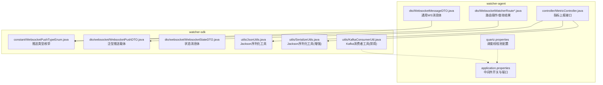
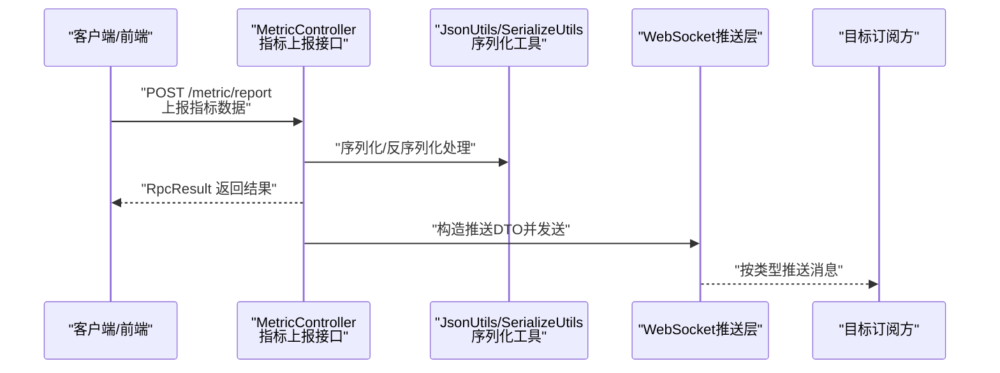
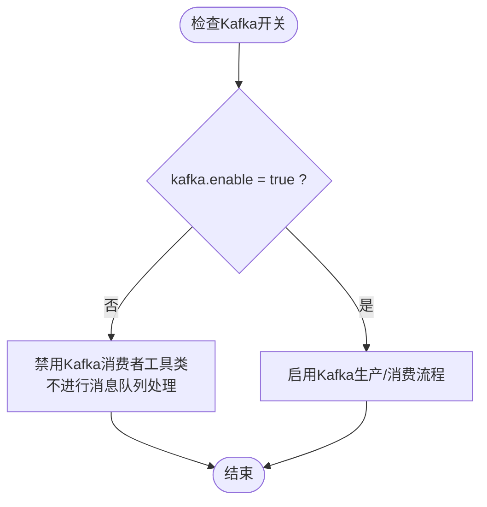
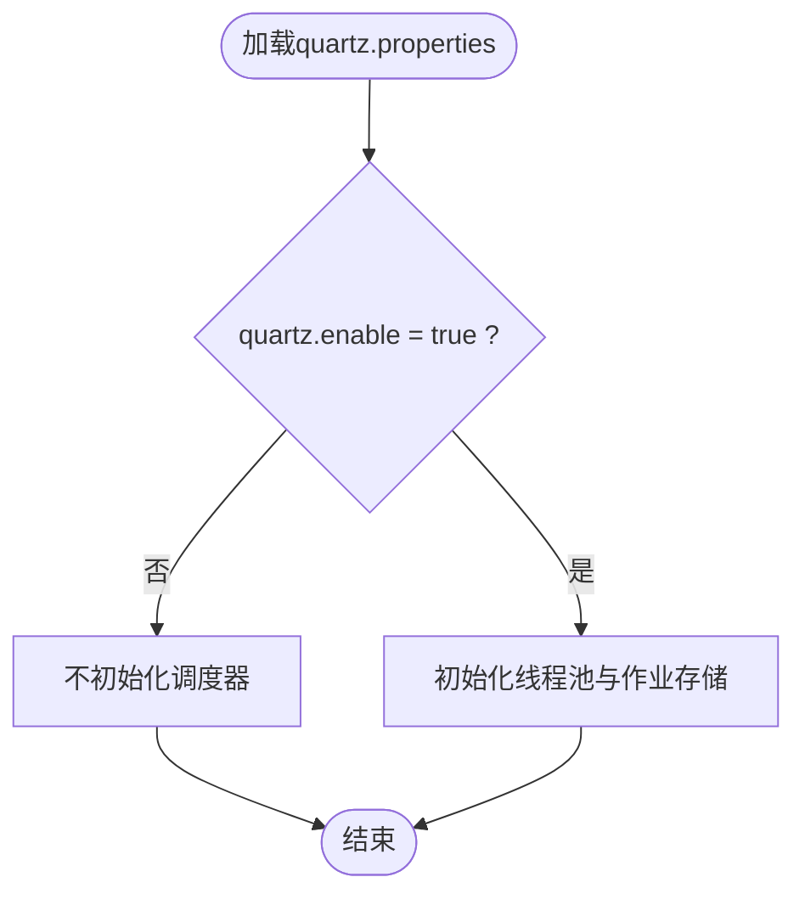
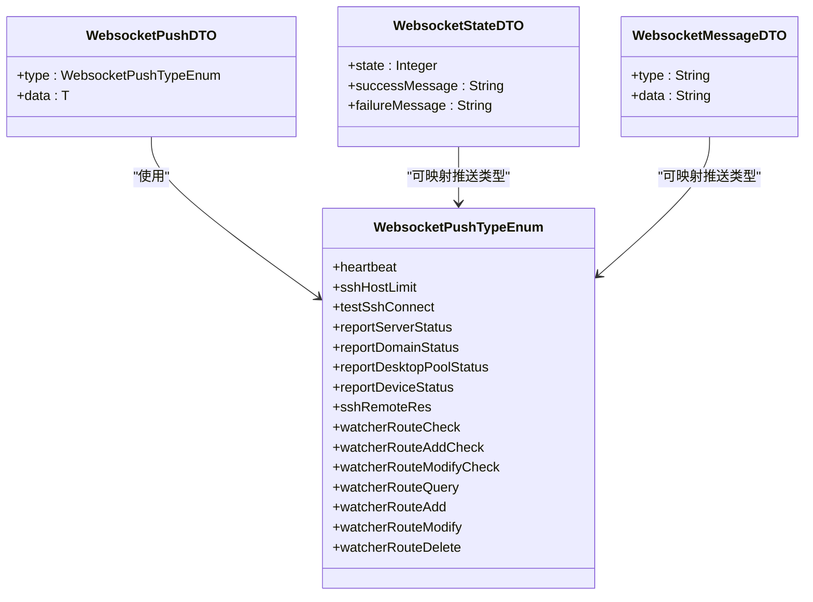
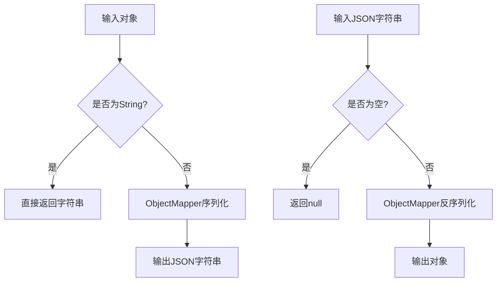
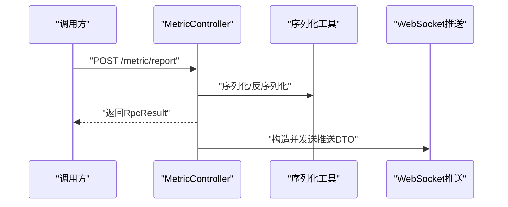
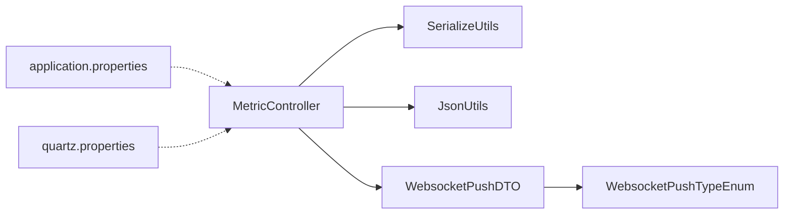

# 消息传递机制

<cite>
**本文引用的文件**
- [application.properties](file://watcher-agent/src/main/resources/application.properties)
- [quartz.properties](file://watcher-agent/src/main/resources/quartz.properties)
- [WebsocketMessageDTO.java](file://watcher-agent/src/main/java/com/virtual/cloud/om/agent/dto/WebsocketMessageDTO.java)
- [WebsocketWatcherRouteOperateResult.java](file://watcher-agent/src/main/java/com/virtual/cloud/om/agent/dto/WebsocketWatcherRouteOperateResult.java)
- [WebsocketWatcherRouteQueryResult.java](file://watcher-agent/src/main/java/com/virtual/cloud/om/agent/dto/WebsocketWatcherRouteQueryResult.java)
- [WebsocketPushTypeEnum.java](file://watcher-sdk/src/main/java/com/virtual/cloud/om/sdk/constant/WebsocketPushTypeEnum.java)
- [WebsocketPushDTO.java](file://watcher-sdk/src/main/java/com/virtual/cloud/om/sdk/dto/websocket/WebsocketPushDTO.java)
- [WebsocketStateDTO.java](file://watcher-sdk/src/main/java/com/virtual/cloud/om/sdk/dto/websocket/WebsocketStateDTO.java)
- [JsonUtils.java](file://watcher-sdk/src/main/java/com/virtual/cloud/om/sdk/utils/JsonUtils.java)
- [SerializeUtils.java](file://watcher-sdk/src/main/java/com/virtual/cloud/om/sdk/utils/SerializeUtils.java)
- [KafkaConsumerUtil.java](file://watcher-sdk/src/main/java/com/virtual/cloud/om/sdk/utils/KafkaConsumerUtil.java)
- [MetricController.java](file://watcher-agent/src/main/java/com/virtual/cloud/om/agent/controller/MetricController.java)
</cite>

## 目录
1. 引言
2. 项目结构
3. 核心组件
4. 架构总览
5. 组件详解
6. 依赖关系分析
7. 性能考量
8. 故障排查指南
9. 结论
10. 附录

## 引言
本文件面向ShowTime监控系统，聚焦于系统内部的消息传递机制，涵盖以下方面：
- 消息队列：基于Kafka的生产与消费现状与禁用策略
- 定时任务调度：Quartz的配置与启用状态
- WebSocket实时推送：连接、消息格式与断线策略
- 序列化与反序列化：统一的JSON工具保障跨组件一致性
- 可靠性与重试：当前实现与建议策略

## 项目结构
围绕消息传递相关的关键位置如下：
- 配置层：应用与调度配置位于watcher-agent的resources目录
- DTO与常量：SDK中定义了WebSocket推送类型与消息载体
- 工具层：SDK中的JSON序列化工具用于跨组件数据一致性
- 控制器层：Agent侧提供指标上报接口，作为消息来源之一

**图表来源**
- [application.properties:1-80](file://watcher-agent/src/main/resources/application.properties#L1-L80)
- [quartz.properties:1-45](file://watcher-agent/src/main/resources/quartz.properties#L1-L45)
- [MetricController.java:1-103](file://watcher-agent/src/main/java/com/virtual/cloud/om/agent/controller/MetricController.java#L1-L103)
- [WebsocketMessageDTO.java:1-23](file://watcher-agent/src/main/java/com/virtual/cloud/om/agent/dto/WebsocketMessageDTO.java#L1-L23)
- [WebsocketWatcherRouteOperateResult.java:1-14](file://watcher-agent/src/main/java/com/virtual/cloud/om/agent/dto/WebsocketWatcherRouteOperateResult.java#L1-L14)
- [WebsocketWatcherRouteQueryResult.java:1-17](file://watcher-agent/src/main/java/com/virtual/cloud/om/agent/dto/WebsocketWatcherRouteQueryResult.java#L1-L17)
- [WebsocketPushTypeEnum.java:1-21](file://watcher-sdk/src/main/java/com/virtual/cloud/om/sdk/constant/WebsocketPushTypeEnum.java#L1-L21)
- [WebsocketPushDTO.java:1-13](file://watcher-sdk/src/main/java/com/virtual/cloud/om/sdk/dto/websocket/WebsocketPushDTO.java#L1-L13)
- [WebsocketStateDTO.java:1-23](file://watcher-sdk/src/main/java/com/virtual/cloud/om/sdk/dto/websocket/WebsocketStateDTO.java#L1-L23)
- [JsonUtils.java:1-53](file://watcher-sdk/src/main/java/com/virtual/cloud/om/sdk/utils/JsonUtils.java#L1-L53)
- [SerializeUtils.java:1-74](file://watcher-sdk/src/main/java/com/virtual/cloud/om/sdk/utils/SerializeUtils.java#L1-L74)
- [KafkaConsumerUtil.java:1-15](file://watcher-sdk/src/main/java/com/virtual/cloud/om/sdk/utils/KafkaConsumerUtil.java#L1-L15)

**章节来源**
- [application.properties:1-80](file://watcher-agent/src/main/resources/application.properties#L1-L80)
- [quartz.properties:1-45](file://watcher-agent/src/main/resources/quartz.properties#L1-L45)

## 核心组件
- 消息队列与消费者
  - 当前配置显示Kafka处于禁用状态，消费者工具类被条件注解禁用，因此系统未启用基于Kafka的消息队列与消费者逻辑。
- 定时任务调度
  - Quartz线程池参数在配置文件中存在，但应用层面的启用开关为关闭；实际调度行为需结合业务实现与运行环境。
- WebSocket推送
  - SDK定义了推送类型枚举与通用推送载体，配合Agent侧的路由操作/查询结果DTO，形成统一的推送消息模型。
- 序列化与反序列化
  - SDK提供两套Jackson工具类，统一对象到JSON以及JSON到对象的转换，保障跨组件数据一致性。

**章节来源**
- [KafkaConsumerUtil.java:1-15](file://watcher-sdk/src/main/java/com/virtual/cloud/om/sdk/utils/KafkaConsumerUtil.java#L1-L15)
- [application.properties:14-20](file://watcher-agent/src/main/resources/application.properties#L14-L20)
- [quartz.properties:15-18](file://watcher-agent/src/main/resources/quartz.properties#L15-L18)
- [WebsocketPushTypeEnum.java:1-21](file://watcher-sdk/src/main/java/com/virtual/cloud/om/sdk/constant/WebsocketPushTypeEnum.java#L1-L21)
- [WebsocketPushDTO.java:1-13](file://watcher-sdk/src/main/java/com/virtual/cloud/om/sdk/dto/websocket/WebsocketPushDTO.java#L1-L13)
- [JsonUtils.java:1-53](file://watcher-sdk/src/main/java/com/virtual/cloud/om/sdk/utils/JsonUtils.java#L1-L53)
- [SerializeUtils.java:1-74](file://watcher-sdk/src/main/java/com/virtual/cloud/om/sdk/utils/SerializeUtils.java#L1-L74)

## 架构总览
下图展示了消息从产生到推送的典型路径，以及当前禁用的Kafka与可选的Quartz调度：

**图表来源**
- [MetricController.java:80-91](file://watcher-agent/src/main/java/com/virtual/cloud/om/agent/controller/MetricController.java#L80-L91)
- [JsonUtils.java:21-49](file://watcher-sdk/src/main/java/com/virtual/cloud/om/sdk/utils/JsonUtils.java#L21-L49)
- [SerializeUtils.java:34-58](file://watcher-sdk/src/main/java/com/virtual/cloud/om/sdk/utils/SerializeUtils.java#L34-L58)
- [WebsocketPushDTO.java:10-12](file://watcher-sdk/src/main/java/com/virtual/cloud/om/sdk/dto/websocket/WebsocketPushDTO.java#L10-L12)

## 组件详解

### 消息队列与消费者（Kafka）
- 现状
  - 应用配置中明确关闭Kafka开关，消费者工具类通过条件注解禁用，因此当前系统未启用Kafka消息队列与消费者。
- 影响
  - 消息直传或本地处理为主，不涉及Kafka生产/消费链路。
- 建议
  - 若未来启用Kafka，应补充生产者配置、消费者组、分区策略与异常处理，并配套死信队列与重试策略。

**图表来源**
- [application.properties:14-20](file://watcher-agent/src/main/resources/application.properties#L14-L20)
- [KafkaConsumerUtil.java:10-14](file://watcher-sdk/src/main/java/com/virtual/cloud/om/sdk/utils/KafkaConsumerUtil.java#L10-L14)

**章节来源**
- [application.properties:14-20](file://watcher-agent/src/main/resources/application.properties#L14-L20)
- [KafkaConsumerUtil.java:1-15](file://watcher-sdk/src/main/java/com/virtual/cloud/om/sdk/utils/KafkaConsumerUtil.java#L1-L15)

### 定时任务调度（Quartz）
- 现状
  - Quartz线程池参数存在于配置文件，但应用启用开关为关闭，调度器未被激活。
- 影响
  - 与消息传递直接相关的定时任务不会自动触发，除非显式启用并编写具体作业。
- 建议
  - 如需基于时间的消息生成或周期性任务，应在业务层实现作业类并启用调度器。

**图表来源**
- [quartz.properties:15-18](file://watcher-agent/src/main/resources/quartz.properties#L15-L18)
- [application.properties](file://watcher-agent/src/main/resources/application.properties#L20)

**章节来源**
- [quartz.properties:1-45](file://watcher-agent/src/main/resources/quartz.properties#L1-L45)
- [application.properties:14-20](file://watcher-agent/src/main/resources/application.properties#L14-L20)

### WebSocket实时推送
- 消息模型
  - 推送类型由枚举定义，推送载体为泛型封装，状态消息体用于反馈操作结果。
  - Agent侧提供通用消息体与路由操作/查询结果DTO，便于不同场景的消息格式化。
- 连接与推送
  - 具体连接建立与断线重连策略不在上述文件中体现，通常由前端或后端WebSocket容器实现；本节仅基于现有DTO与枚举说明消息格式。
- 消息格式
  - 推送载体包含类型与数据字段；状态消息体包含状态码与消息文本；通用消息体包含类型与数据字符串。

**图表来源**
- [WebsocketPushTypeEnum.java:1-21](file://watcher-sdk/src/main/java/com/virtual/cloud/om/sdk/constant/WebsocketPushTypeEnum.java#L1-L21)
- [WebsocketPushDTO.java:1-13](file://watcher-sdk/src/main/java/com/virtual/cloud/om/sdk/dto/websocket/WebsocketPushDTO.java#L1-L13)
- [WebsocketStateDTO.java:1-23](file://watcher-sdk/src/main/java/com/virtual/cloud/om/sdk/dto/websocket/WebsocketStateDTO.java#L1-L23)
- [WebsocketMessageDTO.java:1-23](file://watcher-agent/src/main/java/com/virtual/cloud/om/agent/dto/WebsocketMessageDTO.java#L1-L23)

**章节来源**
- [WebsocketPushTypeEnum.java:1-21](file://watcher-sdk/src/main/java/com/virtual/cloud/om/sdk/constant/WebsocketPushTypeEnum.java#L1-L21)
- [WebsocketPushDTO.java:1-13](file://watcher-sdk/src/main/java/com/virtual/cloud/om/sdk/dto/websocket/WebsocketPushDTO.java#L1-L13)
- [WebsocketStateDTO.java:1-23](file://watcher-sdk/src/main/java/com/virtual/cloud/om/sdk/dto/websocket/WebsocketStateDTO.java#L1-L23)
- [WebsocketMessageDTO.java:1-23](file://watcher-agent/src/main/java/com/virtual/cloud/om/agent/dto/WebsocketMessageDTO.java#L1-L23)
- [WebsocketWatcherRouteOperateResult.java:1-14](file://watcher-agent/src/main/java/com/virtual/cloud/om/agent/dto/WebsocketWatcherRouteOperateResult.java#L1-L14)
- [WebsocketWatcherRouteQueryResult.java:1-17](file://watcher-agent/src/main/java/com/virtual/cloud/om/agent/dto/WebsocketWatcherRouteQueryResult.java#L1-L17)

### 序列化与反序列化
- 工具类
  - 提供对象转JSON与JSON转对象的方法，统一日期格式与忽略未知属性等策略，确保跨组件一致的数据交换。
- 使用建议
  - 在消息发送前统一使用序列化工具，接收端使用对应的反序列化工具，避免字段不匹配导致的异常。

**图表来源**
- [JsonUtils.java:21-49](file://watcher-sdk/src/main/java/com/virtual/cloud/om/sdk/utils/JsonUtils.java#L21-L49)
- [SerializeUtils.java:34-58](file://watcher-sdk/src/main/java/com/virtual/cloud/om/sdk/utils/SerializeUtils.java#L34-L58)

**章节来源**
- [JsonUtils.java:1-53](file://watcher-sdk/src/main/java/com/virtual/cloud/om/sdk/utils/JsonUtils.java#L1-L53)
- [SerializeUtils.java:1-74](file://watcher-sdk/src/main/java/com/virtual/cloud/om/sdk/utils/SerializeUtils.java#L1-L74)

### 指标上报与消息流转
- 接口职责
  - 提供指标类型、平台、趋势、最新值与汇总查询，以及上报接口。
- 流程要点
  - 上报接口对输入进行校验与处理，返回统一的结果载体，随后可按需进行WebSocket推送。

**图表来源**
- [MetricController.java:80-91](file://watcher-agent/src/main/java/com/virtual/cloud/om/agent/controller/MetricController.java#L80-L91)
- [JsonUtils.java:21-49](file://watcher-sdk/src/main/java/com/virtual/cloud/om/sdk/utils/JsonUtils.java#L21-L49)
- [SerializeUtils.java:34-58](file://watcher-sdk/src/main/java/com/virtual/cloud/om/sdk/utils/SerializeUtils.java#L34-L58)
- [WebsocketPushDTO.java:10-12](file://watcher-sdk/src/main/java/com/virtual/cloud/om/sdk/dto/websocket/WebsocketPushDTO.java#L10-L12)

**章节来源**
- [MetricController.java:1-103](file://watcher-agent/src/main/java/com/virtual/cloud/om/agent/controller/MetricController.java#L1-L103)

## 依赖关系分析
- 组件耦合
  - Agent侧控制器依赖SDK的序列化工具与DTO；WebSocket推送依赖SDK的推送类型与载体。
- 外部依赖
  - Quartz与Kafka均受应用配置控制；当前版本禁用了Kafka与调度器，因此不引入外部中间件依赖。
- 循环依赖
  - 应用配置允许循环依赖，有助于模块间松耦合设计。

**图表来源**
- [MetricController.java:1-103](file://watcher-agent/src/main/java/com/virtual/cloud/om/agent/controller/MetricController.java#L1-L103)
- [SerializeUtils.java:1-74](file://watcher-sdk/src/main/java/com/virtual/cloud/om/sdk/utils/SerializeUtils.java#L1-L74)
- [JsonUtils.java:1-53](file://watcher-sdk/src/main/java/com/virtual/cloud/om/sdk/utils/JsonUtils.java#L1-L53)
- [WebsocketPushDTO.java:1-13](file://watcher-sdk/src/main/java/com/virtual/cloud/om/sdk/dto/websocket/WebsocketPushDTO.java#L1-L13)
- [WebsocketPushTypeEnum.java:1-21](file://watcher-sdk/src/main/java/com/virtual/cloud/om/sdk/constant/WebsocketPushTypeEnum.java#L1-L21)
- [application.properties:1-80](file://watcher-agent/src/main/resources/application.properties#L1-L80)
- [quartz.properties:1-45](file://watcher-agent/src/main/resources/quartz.properties#L1-L45)

**章节来源**
- [application.properties:1-80](file://watcher-agent/src/main/resources/application.properties#L1-L80)
- [quartz.properties:1-45](file://watcher-agent/src/main/resources/quartz.properties#L1-L45)

## 性能考量
- 序列化开销
  - 统一使用Jackson工具进行序列化与反序列化，减少重复实现带来的性能差异。
- 线程池与调度
  - Quartz线程池大小已在配置中设定，若启用调度，需评估任务数量与执行频率，避免阻塞。
- Kafka禁用影响
  - 当前禁用Kafka意味着无异步解耦与削峰填谷能力，所有消息处理同步完成，适合低并发场景。

## 故障排查指南
- Kafka相关
  - 现有消费者工具类被禁用，如需启用请检查配置开关与依赖注入。
- Quartz相关
  - 调度器未启用，如需启用请开启开关并确认作业实现。
- WebSocket相关
  - 若出现消息格式不匹配，检查推送类型与载体是否一致；状态消息体用于反馈操作结果。
- 序列化相关
  - 出现解析异常时，优先检查JSON字符串是否完整、字段类型是否正确，以及日期格式是否符合约定。

**章节来源**
- [KafkaConsumerUtil.java:1-15](file://watcher-sdk/src/main/java/com/virtual/cloud/om/sdk/utils/KafkaConsumerUtil.java#L1-L15)
- [application.properties:14-20](file://watcher-agent/src/main/resources/application.properties#L14-L20)
- [quartz.properties:15-18](file://watcher-agent/src/main/resources/quartz.properties#L15-L18)
- [WebsocketStateDTO.java:1-23](file://watcher-sdk/src/main/java/com/virtual/cloud/om/sdk/dto/websocket/WebsocketStateDTO.java#L1-L23)
- [JsonUtils.java:21-49](file://watcher-sdk/src/main/java/com/virtual/cloud/om/sdk/utils/JsonUtils.java#L21-L49)

## 结论
- 当前系统未启用Kafka消息队列与Quartz调度，消息传递以同步处理为主。
- WebSocket推送通过统一的类型与载体实现，配合序列化工具保障跨组件一致性。
- 如需扩展异步与定时能力，可在现有基础上启用相应组件并完善可靠性策略。

## 附录
- 关键配置项
  - Kafka开关：kafka.enable
  - Quartz开关：quartz.enable
  - 端口与上下文：server.port、server.servlet.context-path
- 建议的可靠性策略（概念性）
  - Kafka启用后：设置生产者acks、重试次数与幂等；消费者组与分区策略；死信队列处理异常消息。
  - Quartz启用后：为关键任务配置并发控制与超时保护；记录作业执行日志与失败告警。
  - WebSocket：心跳检测、指数退避重连、消息去重与有序消费。