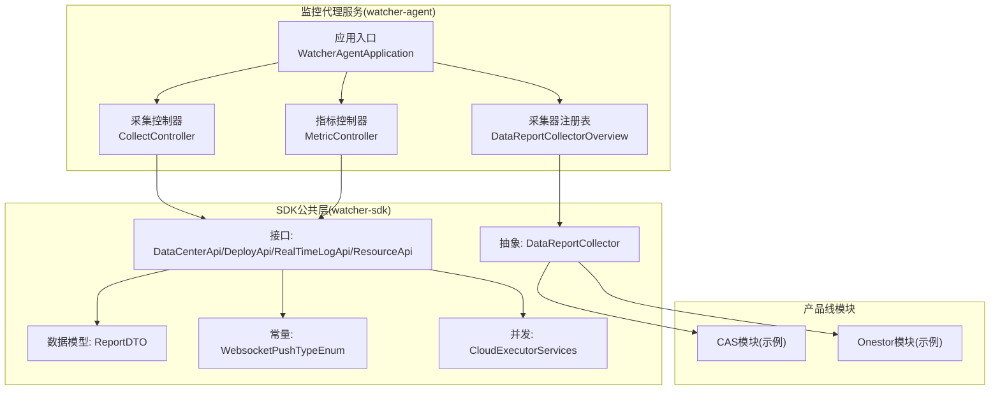
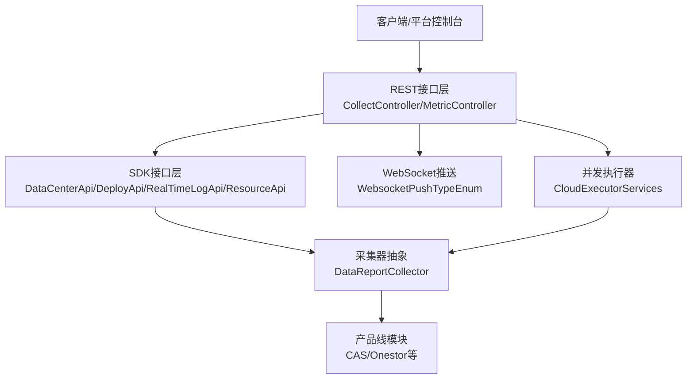
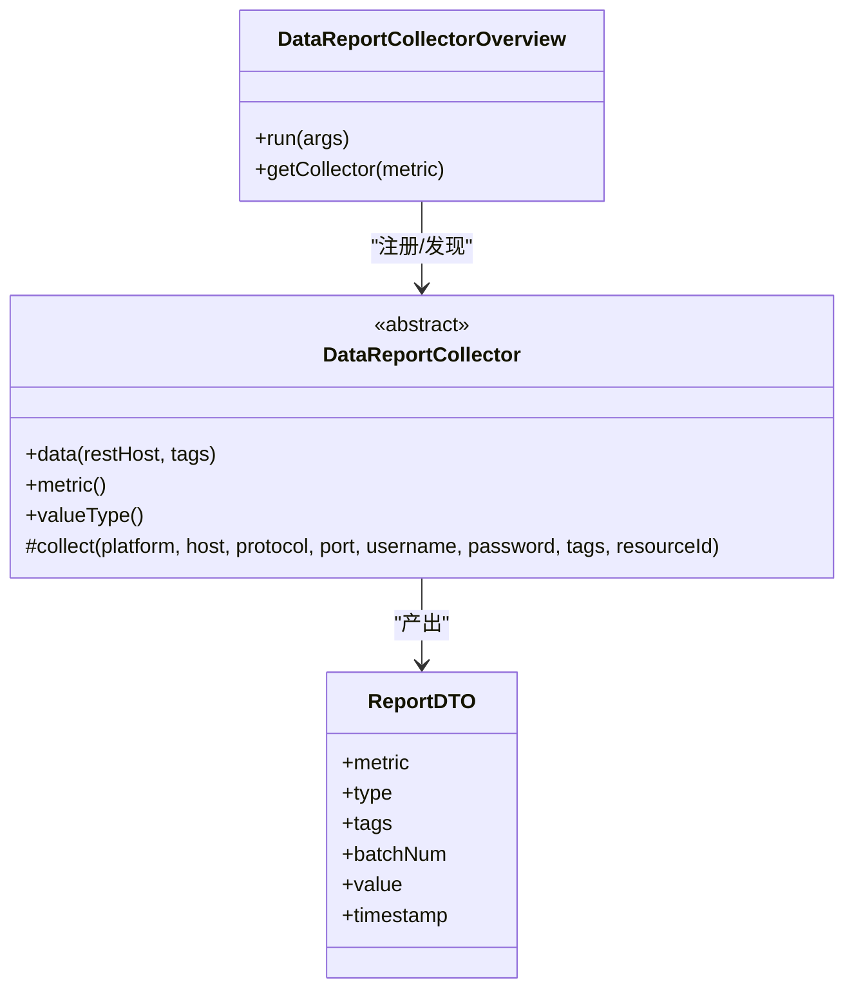
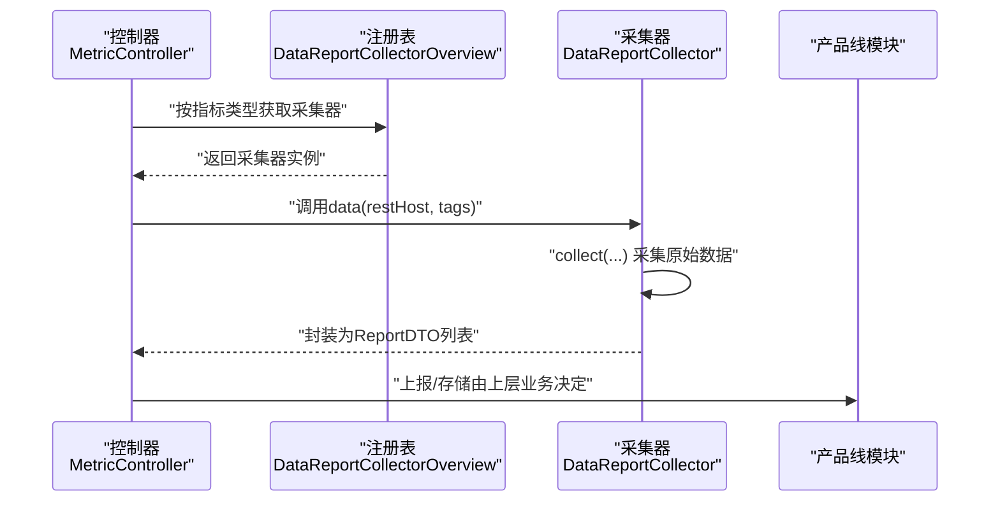
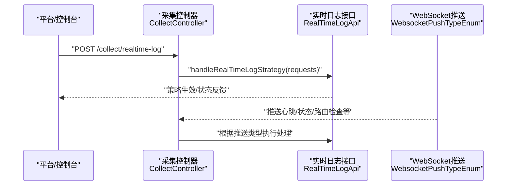
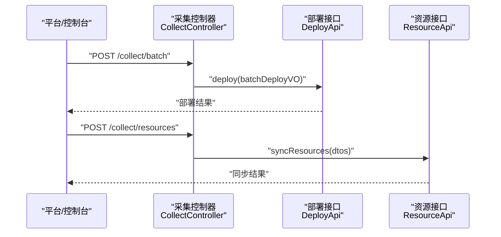
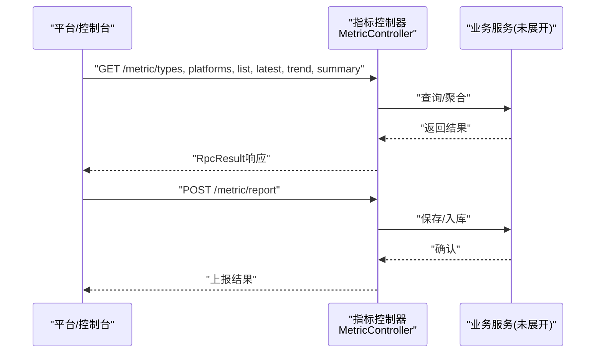
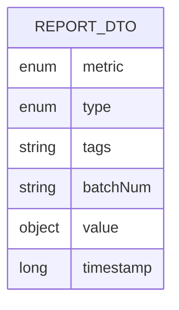
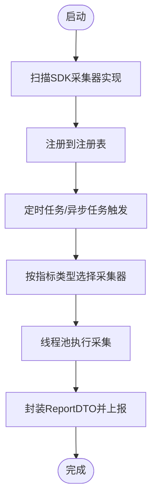
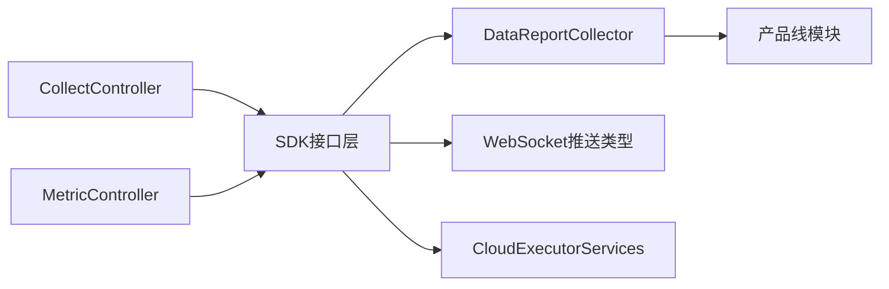

# 组件交互机制

<cite>
**本文引用的文件**
- [WatcherAgentApplication.java](file://watcher-agent/src/main/java/com/virtual/cloud/om/agent/WatcherAgentApplication.java)
- [CollectController.java](file://watcher-agent/src/main/java/com/virtual/cloud/om/agent/controller/CollectController.java)
- [MetricController.java](file://watcher-agent/src/main/java/com/virtual/cloud/om/agent/controller/MetricController.java)
- [DataReportCollectorOverview.java](file://watcher-agent/src/main/java/com/virtual/cloud/om/agent/service/DataReportCollectorOverview.java)
- [DataReportCollector.java](file://watcher-sdk/src/main/java/com/virtual/cloud/om/sdk/api/DataReportCollector.java)
- [DataCenterApi.java](file://watcher-sdk/src/main/java/com/virtual/cloud/om/sdk/api/DataCenterApi.java)
- [RealTimeLogApi.java](file://watcher-sdk/src/main/java/com/virtual/cloud/om/sdk/api/RealTimeLogApi.java)
- [DeployApi.java](file://watcher-sdk/src/main/java/com/virtual/cloud/om/sdk/api/DeployApi.java)
- [ResourceApi.java](file://watcher-sdk/src/main/java/com/virtual/cloud/om/sdk/api/ResourceApi.java)
- [ReportDTO.java](file://watcher-sdk/src/main/java/com/virtual/cloud/om/sdk/dto/dataReport/workspace/ReportDTO.java)
- [WebsocketPushTypeEnum.java](file://watcher-sdk/src/main/java/com/virtual/cloud/om/sdk/constant/WebsocketPushTypeEnum.java)
- [CloudExecutorServices.java](file://watcher-sdk/src/main/java/com/virtual/cloud/om/sdk/concurrent/CloudExecutorServices.java)
</cite>

## 目录
1. [引言](#引言)
2. [项目结构](#项目结构)
3. [核心组件](#核心组件)
4. [架构总览](#架构总览)
5. [详细组件分析](#详细组件分析)
6. [依赖分析](#依赖分析)
7. [性能考虑](#性能考虑)
8. [故障排查指南](#故障排查指南)
9. [结论](#结论)
10. [附录](#附录)

## 引言
本文件面向ShowTime监控系统，聚焦“监控代理服务”与“各产品线监控模块”的协作机制，系统性阐述以下主题：
- 数据采集器的注册、发现与调用机制
- SDK公共组件作为“统一接口规范”的桥梁作用
- 组件间通信协议与数据交换格式（REST API、WebSocket）
- 任务调度机制（定时任务与线程池并发模型）
- 组件交互时序图与消息流向图，帮助开发者快速理解复杂协作流程

## 项目结构
- 监控代理服务（watcher-agent）：对外提供REST接口，编排SDK能力，协调产品线采集器与上报流程。
- SDK公共层（watcher-sdk）：定义统一接口、数据模型、常量与并发工具，为多产品线提供一致的抽象。
- 产品线模块（watcher-cas、watcher-onestor等）：基于SDK接口实现具体采集器与业务逻辑。

图表来源
- [WatcherAgentApplication.java:14-27](file://watcher-agent/src/main/java/com/virtual/cloud/om/agent/WatcherAgentApplication.java#L14-L27)
- [CollectController.java:27-66](file://watcher-agent/src/main/java/com/virtual/cloud/om/agent/controller/CollectController.java#L27-L66)
- [MetricController.java:19-102](file://watcher-agent/src/main/java/com/virtual/cloud/om/agent/controller/MetricController.java#L19-L102)
- [DataReportCollectorOverview.java:22-45](file://watcher-agent/src/main/java/com/virtual/cloud/om/agent/service/DataReportCollectorOverview.java#L22-L45)
- [DataReportCollector.java:18-118](file://watcher-sdk/src/main/java/com/virtual/cloud/om/sdk/api/DataReportCollector.java#L18-L118)
- [ReportDTO.java:11-24](file://watcher-sdk/src/main/java/com/virtual/cloud/om/sdk/dto/dataReport/workspace/ReportDTO.java#L11-L24)
- [WebsocketPushTypeEnum.java:4-21](file://watcher-sdk/src/main/java/com/virtual/cloud/om/sdk/constant/WebsocketPushTypeEnum.java#L4-L21)
- [CloudExecutorServices.java:19-195](file://watcher-sdk/src/main/java/com/virtual/cloud/om/sdk/concurrent/CloudExecutorServices.java#L19-L195)

章节来源
- [WatcherAgentApplication.java:14-27](file://watcher-agent/src/main/java/com/virtual/cloud/om/agent/WatcherAgentApplication.java#L14-L27)
- [CollectController.java:27-66](file://watcher-agent/src/main/java/com/virtual/cloud/om/agent/controller/CollectController.java#L27-L66)
- [MetricController.java:19-102](file://watcher-agent/src/main/java/com/virtual/cloud/om/agent/controller/MetricController.java#L19-L102)
- [DataReportCollectorOverview.java:22-45](file://watcher-agent/src/main/java/com/virtual/cloud/om/agent/service/DataReportCollectorOverview.java#L22-L45)
- [DataReportCollector.java:18-118](file://watcher-sdk/src/main/java/com/virtual/cloud/om/sdk/api/DataReportCollector.java#L18-L118)
- [ReportDTO.java:11-24](file://watcher-sdk/src/main/java/com/virtual/cloud/om/sdk/dto/dataReport/workspace/ReportDTO.java#L11-L24)
- [WebsocketPushTypeEnum.java:4-21](file://watcher-sdk/src/main/java/com/virtual/cloud/om/sdk/constant/WebsocketPushTypeEnum.java#L4-L21)
- [CloudExecutorServices.java:19-195](file://watcher-sdk/src/main/java/com/virtual/cloud/om/sdk/concurrent/CloudExecutorServices.java#L19-L195)

## 核心组件
- 应用入口与扫描配置：负责启用调度、扫描多包路径，启动Spring上下文。
- 控制器层：
  - 采集控制器：承接外部下发的实时日志策略、资源同步、批量部署等请求。
  - 指标控制器：提供指标类型、平台、列表、最新值、趋势、上报等查询与上报接口。
- 采集器注册表：在应用启动时扫描SDK中所有DataReportCollector实现，按指标类型建立映射，供上层按需调用。
- SDK接口与抽象：
  - DataReportCollector：统一采集抽象，定义采集策略、值类型、数据封装等。
  - 实时日志接口、部署接口、资源接口等：为代理服务提供跨模块能力。
  - ReportDTO：统一的数据上报载体，包含指标、类型、标签、批次、值与时间戳。
  - WebSocket推送类型枚举：定义代理侧可识别的推送消息类型。
  - 并发工具：集中化线程池与执行器，支撑高并发采集与异步处理。

章节来源
- [WatcherAgentApplication.java:14-27](file://watcher-agent/src/main/java/com/virtual/cloud/om/agent/WatcherAgentApplication.java#L14-L27)
- [CollectController.java:27-66](file://watcher-agent/src/main/java/com/virtual/cloud/om/agent/controller/CollectController.java#L27-L66)
- [MetricController.java:19-102](file://watcher-agent/src/main/java/com/virtual/cloud/om/agent/controller/MetricController.java#L19-L102)
- [DataReportCollectorOverview.java:22-45](file://watcher-agent/src/main/java/com/virtual/cloud/om/agent/service/DataReportCollectorOverview.java#L22-L45)
- [DataReportCollector.java:18-118](file://watcher-sdk/src/main/java/com/virtual/cloud/om/sdk/api/DataReportCollector.java#L18-L118)
- [ReportDTO.java:11-24](file://watcher-sdk/src/main/java/com/virtual/cloud/om/sdk/dto/dataReport/workspace/ReportDTO.java#L11-L24)
- [WebsocketPushTypeEnum.java:4-21](file://watcher-sdk/src/main/java/com/virtual/cloud/om/sdk/constant/WebsocketPushTypeEnum.java#L4-L21)
- [CloudExecutorServices.java:19-195](file://watcher-sdk/src/main/java/com/virtual/cloud/om/sdk/concurrent/CloudExecutorServices.java#L19-L195)

## 架构总览
监控代理服务通过REST API接收外部指令，结合SDK提供的统一接口与抽象，驱动各产品线采集器完成数据采集与上报；同时利用WebSocket进行实时推送与状态通知；通过线程池与定时任务协调组件工作节奏。

图表来源
- [CollectController.java:27-66](file://watcher-agent/src/main/java/com/virtual/cloud/om/agent/controller/CollectController.java#L27-L66)
- [MetricController.java:19-102](file://watcher-agent/src/main/java/com/virtual/cloud/om/agent/controller/MetricController.java#L19-L102)
- [DataReportCollector.java:18-118](file://watcher-sdk/src/main/java/com/virtual/cloud/om/sdk/api/DataReportCollector.java#L18-L118)
- [WebsocketPushTypeEnum.java:4-21](file://watcher-sdk/src/main/java/com/virtual/cloud/om/sdk/constant/WebsocketPushTypeEnum.java#L4-L21)
- [CloudExecutorServices.java:19-195](file://watcher-sdk/src/main/java/com/virtual/cloud/om/sdk/concurrent/CloudExecutorServices.java#L19-L195)

## 详细组件分析

### 采集器注册与发现机制
- 注册阶段：应用启动时，注册表扫描容器内所有DataReportCollector实现，以指标枚举为键建立映射。
- 发现阶段：上层通过指标类型查询对应采集器实例。
- 调用阶段：采集器统一实现采集、封装与上报逻辑，屏蔽产品线差异。

图表来源
- [DataReportCollectorOverview.java:22-45](file://watcher-agent/src/main/java/com/virtual/cloud/om/agent/service/DataReportCollectorOverview.java#L22-L45)
- [DataReportCollector.java:18-118](file://watcher-sdk/src/main/java/com/virtual/cloud/om/sdk/api/DataReportCollector.java#L18-L118)
- [ReportDTO.java:11-24](file://watcher-sdk/src/main/java/com/virtual/cloud/om/sdk/dto/dataReport/workspace/ReportDTO.java#L11-L24)

章节来源
- [DataReportCollectorOverview.java:22-45](file://watcher-agent/src/main/java/com/virtual/cloud/om/agent/service/DataReportCollectorOverview.java#L22-L45)
- [DataReportCollector.java:18-118](file://watcher-sdk/src/main/java/com/virtual/cloud/om/sdk/api/DataReportCollector.java#L18-L118)
- [ReportDTO.java:11-24](file://watcher-sdk/src/main/java/com/virtual/cloud/om/sdk/dto/dataReport/workspace/ReportDTO.java#L11-L24)

### 采集器调用时序（指标数据采集）
该时序展示从控制器到采集器再到产品线模块的完整链路。

图表来源
- [MetricController.java:78-91](file://watcher-agent/src/main/java/com/virtual/cloud/om/agent/controller/MetricController.java#L78-L91)
- [DataReportCollectorOverview.java:42-44](file://watcher-agent/src/main/java/com/virtual/cloud/om/agent/service/DataReportCollectorOverview.java#L42-L44)
- [DataReportCollector.java:48-86](file://watcher-sdk/src/main/java/com/virtual/cloud/om/sdk/api/DataReportCollector.java#L48-L86)

章节来源
- [MetricController.java:78-91](file://watcher-agent/src/main/java/com/virtual/cloud/om/agent/controller/MetricController.java#L78-L91)
- [DataReportCollectorOverview.java:42-44](file://watcher-agent/src/main/java/com/virtual/cloud/om/agent/service/DataReportCollectorOverview.java#L42-L44)
- [DataReportCollector.java:48-86](file://watcher-sdk/src/main/java/com/virtual/cloud/om/sdk/api/DataReportCollector.java#L48-L86)

### 实时日志策略下发与处理
- 下发接口：采集控制器提供实时日志策略下发入口。
- 处理接口：SDK定义实时日志接口，支持策略解析、行解析、Filebeat主题管理、搜索等。
- WebSocket推送：代理侧识别WebSocket推送类型，触发相应动作或状态上报。

图表来源
- [CollectController.java:45-51](file://watcher-agent/src/main/java/com/virtual/cloud/om/agent/controller/CollectController.java#L45-L51)
- [RealTimeLogApi.java:15-58](file://watcher-sdk/src/main/java/com/virtual/cloud/om/sdk/api/RealTimeLogApi.java#L15-L58)
- [WebsocketPushTypeEnum.java:4-21](file://watcher-sdk/src/main/java/com/virtual/cloud/om/sdk/constant/WebsocketPushTypeEnum.java#L4-L21)

章节来源
- [CollectController.java:45-51](file://watcher-agent/src/main/java/com/virtual/cloud/om/agent/controller/CollectController.java#L45-L51)
- [RealTimeLogApi.java:15-58](file://watcher-sdk/src/main/java/com/virtual/cloud/om/sdk/api/RealTimeLogApi.java#L15-L58)
- [WebsocketPushTypeEnum.java:4-21](file://watcher-sdk/src/main/java/com/virtual/cloud/om/sdk/constant/WebsocketPushTypeEnum.java#L4-L21)

### 批量部署与资源同步
- 批量部署：控制器转发至SDK部署接口，执行批量部署与组件管理。
- 资源同步：控制器接收资源列表，委托资源服务进行同步。

图表来源
- [CollectController.java:53-66](file://watcher-agent/src/main/java/com/virtual/cloud/om/agent/controller/CollectController.java#L53-L66)
- [DeployApi.java:14-105](file://watcher-sdk/src/main/java/com/virtual/cloud/om/sdk/api/DeployApi.java#L14-L105)
- [ResourceApi.java:7-11](file://watcher-sdk/src/main/java/com/virtual/cloud/om/sdk/api/ResourceApi.java#L7-L11)

章节来源
- [CollectController.java:53-66](file://watcher-agent/src/main/java/com/virtual/cloud/om/agent/controller/CollectController.java#L53-L66)
- [DeployApi.java:14-105](file://watcher-sdk/src/main/java/com/virtual/cloud/om/sdk/api/DeployApi.java#L14-L105)
- [ResourceApi.java:7-11](file://watcher-sdk/src/main/java/com/virtual/cloud/om/sdk/api/ResourceApi.java#L7-L11)

### 指标查询与上报
- 查询接口：提供指标类型、平台、列表、最新值、趋势、汇总等查询能力。
- 上报接口：接收前端或平台上报的指标数据，交由后端处理。

图表来源
- [MetricController.java:29-101](file://watcher-agent/src/main/java/com/virtual/cloud/om/agent/controller/MetricController.java#L29-L101)

章节来源
- [MetricController.java:29-101](file://watcher-agent/src/main/java/com/virtual/cloud/om/agent/controller/MetricController.java#L29-L101)

### 数据交换格式
- 采集器输出统一为ReportDTO对象，包含指标类型、值类型、标签、批次、值与时间戳。
- 控制器通过RpcResult/RpcListLoadResult封装响应，便于前端与平台消费。

图表来源
- [ReportDTO.java:11-24](file://watcher-sdk/src/main/java/com/virtual/cloud/om/sdk/dto/dataReport/workspace/ReportDTO.java#L11-L24)

章节来源
- [ReportDTO.java:11-24](file://watcher-sdk/src/main/java/com/virtual/cloud/om/sdk/dto/dataReport/workspace/ReportDTO.java#L11-L24)

### 任务调度机制
- 定时任务：应用启用调度注解，可配合SDK线程池与执行器实现周期性采集与上报。
- 并发模型：SDK提供多种线程池（通用、IO密集、CPU密集、监控、Kafka、Filebeat等），代理服务可按场景选择执行器，提升吞吐与稳定性。

图表来源
- [WatcherAgentApplication.java:17-18](file://watcher-agent/src/main/java/com/virtual/cloud/om/agent/WatcherAgentApplication.java#L17-L18)
- [DataReportCollectorOverview.java:32-35](file://watcher-agent/src/main/java/com/virtual/cloud/om/agent/service/DataReportCollectorOverview.java#L32-L35)
- [CloudExecutorServices.java:117-193](file://watcher-sdk/src/main/java/com/virtual/cloud/om/sdk/concurrent/CloudExecutorServices.java#L117-L193)

章节来源
- [WatcherAgentApplication.java:17-18](file://watcher-agent/src/main/java/com/virtual/cloud/om/agent/WatcherAgentApplication.java#L17-L18)
- [DataReportCollectorOverview.java:32-35](file://watcher-agent/src/main/java/com/virtual/cloud/om/agent/service/DataReportCollectorOverview.java#L32-L35)
- [CloudExecutorServices.java:117-193](file://watcher-sdk/src/main/java/com/virtual/cloud/om/sdk/concurrent/CloudExecutorServices.java#L117-L193)

## 依赖分析
- 组件耦合：
  - 控制器依赖SDK接口，不直接依赖具体产品线实现，降低耦合度。
  - 采集器注册表依赖Spring容器扫描，实现“插拔式”扩展。
- 外部依赖：
  - REST接口依赖Spring MVC；WebSocket依赖平台推送；线程池依赖JUC。
- 潜在风险：
  - 若采集器未正确注册，可能导致按指标类型查询为空；应确保实现类被扫描并注入。

图表来源
- [CollectController.java:27-66](file://watcher-agent/src/main/java/com/virtual/cloud/om/agent/controller/CollectController.java#L27-L66)
- [MetricController.java:19-102](file://watcher-agent/src/main/java/com/virtual/cloud/om/agent/controller/MetricController.java#L19-L102)
- [DataReportCollector.java:18-118](file://watcher-sdk/src/main/java/com/virtual/cloud/om/sdk/api/DataReportCollector.java#L18-L118)
- [WebsocketPushTypeEnum.java:4-21](file://watcher-sdk/src/main/java/com/virtual/cloud/om/sdk/constant/WebsocketPushTypeEnum.java#L4-L21)
- [CloudExecutorServices.java:19-195](file://watcher-sdk/src/main/java/com/virtual/cloud/om/sdk/concurrent/CloudExecutorServices.java#L19-L195)

章节来源
- [CollectController.java:27-66](file://watcher-agent/src/main/java/com/virtual/cloud/om/agent/controller/CollectController.java#L27-L66)
- [MetricController.java:19-102](file://watcher-agent/src/main/java/com/virtual/cloud/om/agent/controller/MetricController.java#L19-L102)
- [DataReportCollector.java:18-118](file://watcher-sdk/src/main/java/com/virtual/cloud/om/sdk/api/DataReportCollector.java#L18-L118)
- [WebsocketPushTypeEnum.java:4-21](file://watcher-sdk/src/main/java/com/virtual/cloud/om/sdk/constant/WebsocketPushTypeEnum.java#L4-L21)
- [CloudExecutorServices.java:19-195](file://watcher-sdk/src/main/java/com/virtual/cloud/om/sdk/concurrent/CloudExecutorServices.java#L19-L195)

## 性能考虑
- 线程池选择：
  - IO密集型（如远程SSH、文件传输）优先使用IO线程池。
  - CPU密集型（如解析、压缩）优先使用CPU线程池。
  - 通用任务使用通用线程池，避免阻塞。
- 队列容量与拒绝策略：
  - 合理设置队列长度，防止内存压力过大；采用合理的拒绝策略保证系统稳定。
- 并发度与核数：
  - 核心线程数与最大线程数随CPU核数动态调整，避免过度竞争。
- 指标采集批量化：
  - 将多个采集器合并为批次上报，减少网络往返与数据库写入次数。

## 故障排查指南
- 采集器未注册：
  - 现象：按指标类型查询采集器为空。
  - 排查：确认实现类被SDK扫描路径覆盖，且被Spring容器管理。
- 上报数据为空：
  - 现象：采集器返回空值，最终上报为空集合。
  - 排查：检查目标主机连通性、凭证、标签匹配规则与时间戳填充逻辑。
- WebSocket推送异常：
  - 现象：推送消息无法识别或处理。
  - 排查：确认推送类型枚举与平台侧一致，检查代理侧处理分支。
- 线程池饱和：
  - 现象：任务积压、超时或拒绝。
  - 排查：评估任务类型与线程池配置，必要时扩容或拆分线程池。

章节来源
- [DataReportCollectorOverview.java:42-44](file://watcher-agent/src/main/java/com/virtual/cloud/om/agent/service/DataReportCollectorOverview.java#L42-L44)
- [DataReportCollector.java:62-84](file://watcher-sdk/src/main/java/com/virtual/cloud/om/sdk/api/DataReportCollector.java#L62-L84)
- [WebsocketPushTypeEnum.java:4-21](file://watcher-sdk/src/main/java/com/virtual/cloud/om/sdk/constant/WebsocketPushTypeEnum.java#L4-L21)
- [CloudExecutorServices.java:65-193](file://watcher-sdk/src/main/java/com/virtual/cloud/om/sdk/concurrent/CloudExecutorServices.java#L65-L193)

## 结论
ShowTime监控系统通过“监控代理服务 + SDK公共层 + 产品线模块”的分层设计，实现了采集器的统一注册与发现、跨产品线的接口一致性、以及灵活的任务调度与并发执行。REST与WebSocket双通道协同，保障了平台控制与实时推送的高效交互。建议在扩展新采集器时遵循SDK抽象与数据模型规范，确保系统整体稳定性与可维护性。

## 附录
- 关键接口一览
  - 采集器抽象：[DataReportCollector.java:18-118](file://watcher-sdk/src/main/java/com/virtual/cloud/om/sdk/api/DataReportCollector.java#L18-L118)
  - 实时日志接口：[RealTimeLogApi.java:15-58](file://watcher-sdk/src/main/java/com/virtual/cloud/om/sdk/api/RealTimeLogApi.java#L15-L58)
  - 部署接口：[DeployApi.java:14-105](file://watcher-sdk/src/main/java/com/virtual/cloud/om/sdk/api/DeployApi.java#L14-L105)
  - 资源接口：[ResourceApi.java:7-11](file://watcher-sdk/src/main/java/com/virtual/cloud/om/sdk/api/ResourceApi.java#L7-L11)
  - 数据模型：[ReportDTO.java:11-24](file://watcher-sdk/src/main/java/com/virtual/cloud/om/sdk/dto/dataReport/workspace/ReportDTO.java#L11-L24)
  - WebSocket类型：[WebsocketPushTypeEnum.java:4-21](file://watcher-sdk/src/main/java/com/virtual/cloud/om/sdk/constant/WebsocketPushTypeEnum.java#L4-L21)
  - 并发执行器：[CloudExecutorServices.java:19-195](file://watcher-sdk/src/main/java/com/virtual/cloud/om/sdk/concurrent/CloudExecutorServices.java#L19-L195)
- 控制器入口
  - 采集控制器：[CollectController.java:27-66](file://watcher-agent/src/main/java/com/virtual/cloud/om/agent/controller/CollectController.java#L27-L66)
  - 指标控制器：[MetricController.java:19-102](file://watcher-agent/src/main/java/com/virtual/cloud/om/agent/controller/MetricController.java#L19-L102)
- 应用入口
  - [WatcherAgentApplication.java:14-27](file://watcher-agent/src/main/java/com/virtual/cloud/om/agent/WatcherAgentApplication.java#L14-L27)