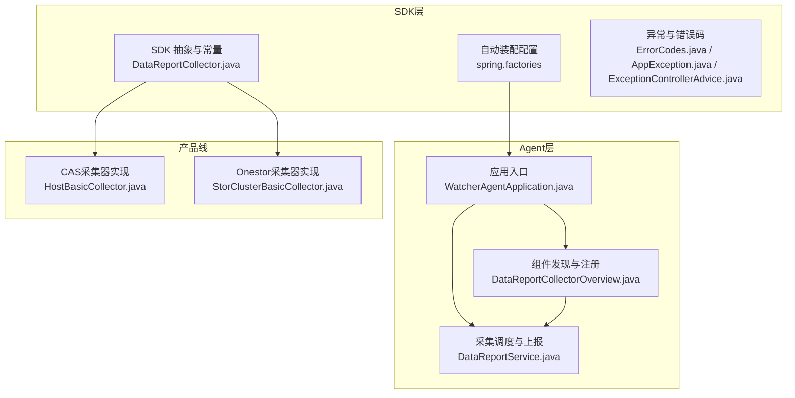
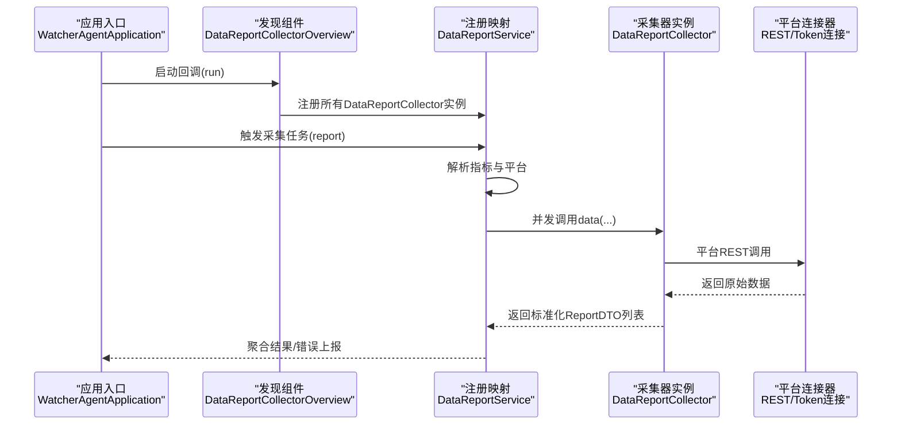
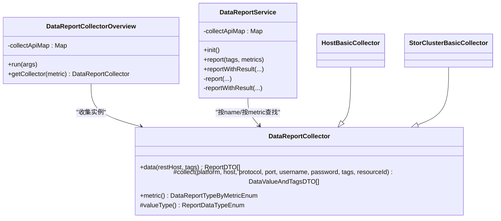
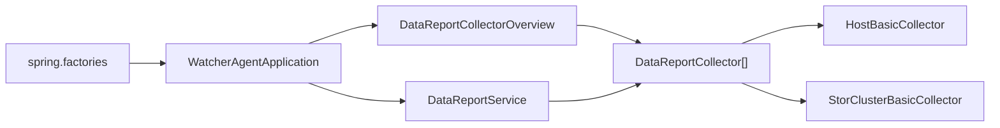
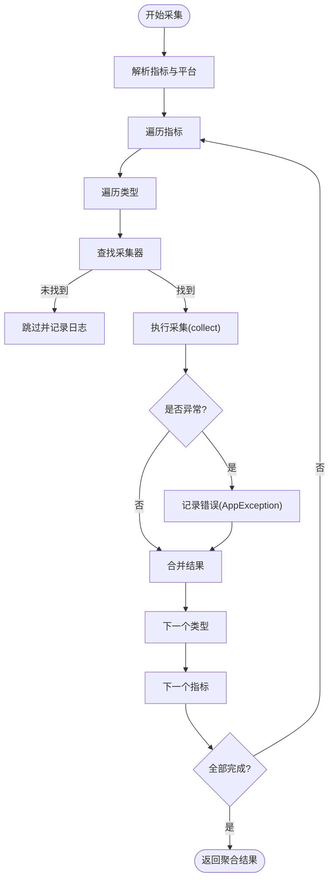

# 组件发现与注册

<cite>
**本文引用的文件**
- [DataReportCollector.java](file://watcher-sdk/src/main/java/com/virtual/cloud/om/sdk/api/DataReportCollector.java)
- [DataReportService.java](file://watcher-agent/src/main/java/com/virtual/cloud/om/agent/service/report/DataReportService.java)
- [DataReportCollectorOverview.java](file://watcher-agent/src/main/java/com/virtual/cloud/om/agent/service/DataReportCollectorOverview.java)
- [WatcherAgentApplication.java](file://watcher-agent/src/main/java/com/virtual/cloud/om/agent/WatcherAgentApplication.java)
- [spring.factories](file://watcher-sdk/src/main/resources/META-INF/spring.factories)
- [ErrorCodes.java](file://watcher-sdk/src/main/java/com/virtual/cloud/om/sdk/exception/ErrorCodes.java)
- [AppException.java](file://watcher-sdk/src/main/java/com/virtual/cloud/om/sdk/exception/AppException.java)
- [ExceptionControllerAdvice.java](file://watcher-sdk/src/main/java/com/virtual/cloud/om/sdk/exception/ExceptionControllerAdvice.java)
- [HostBasicCollector.java](file://watcher-cas/src/main/java/com/virtual/cloud/om/cas/service/report/HostBasicCollector.java)
- [StorClusterBasicCollector.java](file://watcher-onestor/src/main/java/com/virtual/cloud/om/onestor/service/clusterBasic/StorClusterBasicCollector.java)
- [RpcResult.java](file://watcher-sdk/src/main/java/com/virtual/cloud/om/sdk/dto/RpcResult.java)
- [StateResult.java](file://watcher-sdk/src/main/java/com/virtual/cloud/om/sdk/dto/StateResult.java)
</cite>

## 目录
1. [引言](#引言)
2. [项目结构](#项目结构)
3. [核心组件](#核心组件)
4. [架构总览](#架构总览)
5. [详细组件分析](#详细组件分析)
6. [依赖分析](#依赖分析)
7. [性能考量](#性能考量)
8. [故障检测与自动恢复](#故障检测与自动恢复)
9. [配置与扩展指南](#配置与扩展指南)
10. [结论](#结论)

## 引言
本文件聚焦ShowTime监控系统中“组件发现与注册”的机制，围绕监控采集器的动态发现与注册、SPI（Service Provider Interface）风格的使用方式、DataReportCollector接口的实现规范、组件生命周期管理、组件间依赖与加载顺序、配置示例与扩展指南，以及故障检测与自动恢复机制进行系统化说明。目标是帮助开发者在不深入源码的前提下，快速理解并正确扩展新的监控产品线。

## 项目结构
- SDK层提供通用抽象与基础设施（如DataReportCollector抽象类、异常体系、自动装配配置等），位于watcher-sdk模块。
- Agent层负责运行期的组件发现、注册与调度（如DataReportService、DataReportCollectorOverview），位于watcher-agent模块。
- 各产品线模块（如watcher-cas、watcher-onestor）实现具体采集器，继承SDK中的DataReportCollector抽象类。
- 应用入口通过Spring Boot扫描包路径加载各模块组件。

图表来源
- [WatcherAgentApplication.java:14-18](file://watcher-agent/src/main/java/com/virtual/cloud/om/agent/WatcherAgentApplication.java#L14-L18)
- [DataReportCollectorOverview.java:22-35](file://watcher-agent/src/main/java/com/virtual/cloud/om/agent/service/DataReportCollectorOverview.java#L22-L35)
- [DataReportService.java:58-79](file://watcher-agent/src/main/java/com/virtual/cloud/om/agent/service/report/DataReportService.java#L58-L79)
- [DataReportCollector.java:19-118](file://watcher-sdk/src/main/java/com/virtual/cloud/om/sdk/api/DataReportCollector.java#L19-L118)
- [HostBasicCollector.java:26-126](file://watcher-cas/src/main/java/com/virtual/cloud/om/cas/service/report/HostBasicCollector.java#L26-L126)
- [StorClusterBasicCollector.java:30-77](file://watcher-onestor/src/main/java/com/virtual/cloud/om/onestor/service/clusterBasic/StorClusterBasicCollector.java#L30-L77)
- [spring.factories:1-10](file://watcher-sdk/src/main/resources/META-INF/spring.factories#L1-L10)

章节来源
- [WatcherAgentApplication.java:14-18](file://watcher-agent/src/main/java/com/virtual/cloud/om/agent/WatcherAgentApplication.java#L14-L18)
- [spring.factories:1-10](file://watcher-sdk/src/main/resources/META-INF/spring.factories#L1-L10)

## 核心组件
- DataReportCollector（SDK抽象）
  - 提供统一的数据采集入口data(...)，封装采集耗时统计、空值兜底、时间戳填充等通用逻辑；子类仅需实现collect(...)、metric()、valueType()。
- DataReportService（Agent调度）
  - 在PostConstruct阶段完成组件注册映射；按指标维度并发调度采集器；聚合结果并上报。
- DataReportCollectorOverview（Agent发现）
  - 实现ApplicationRunner，在应用启动时将所有DataReportCollector实例按枚举键建立映射，便于后续按指标快速定位采集器。
- 产品线采集器（CAS/Onestor）
  - 继承DataReportCollector，实现具体平台的REST调用与数据转换，返回标准化的DataValueAndTagsDTO列表。

章节来源
- [DataReportCollector.java:48-118](file://watcher-sdk/src/main/java/com/virtual/cloud/om/sdk/api/DataReportCollector.java#L48-L118)
- [DataReportService.java:58-79](file://watcher-agent/src/main/java/com/virtual/cloud/om/agent/service/report/DataReportService.java#L58-L79)
- [DataReportCollectorOverview.java:22-44](file://watcher-agent/src/main/java/com/virtual/cloud/om/agent/service/DataReportCollectorOverview.java#L22-L44)
- [HostBasicCollector.java:26-126](file://watcher-cas/src/main/java/com/virtual/cloud/om/cas/service/report/HostBasicCollector.java#L26-L126)
- [StorClusterBasicCollector.java:30-77](file://watcher-onestor/src/main/java/com/virtual/cloud/om/onestor/service/clusterBasic/StorClusterBasicCollector.java#L30-L77)

## 架构总览
下图展示从应用启动到采集执行的关键交互：应用启动扫描组件 → 发现阶段构建映射 → 调度阶段并发执行 → 结果聚合与上报。

图表来源
- [WatcherAgentApplication.java:24-27](file://watcher-agent/src/main/java/com/virtual/cloud/om/agent/WatcherAgentApplication.java#L24-L27)
- [DataReportCollectorOverview.java:32-35](file://watcher-agent/src/main/java/com/virtual/cloud/om/agent/service/DataReportCollectorOverview.java#L32-L35)
- [DataReportService.java:115-296](file://watcher-agent/src/main/java/com/virtual/cloud/om/agent/service/report/DataReportService.java#L115-L296)
- [DataReportCollector.java:48-86](file://watcher-sdk/src/main/java/com/virtual/cloud/om/sdk/api/DataReportCollector.java#L48-L86)

## 详细组件分析

### 组件发现与注册（SPI风格）
- 发现阶段
  - 通过构造函数注入数组类型的DataReportCollector，框架会收集所有实现实例。
  - ApplicationRunner在启动完成后将实例按metric枚举键放入并发安全映射，便于后续按指标快速查找。
- 注册阶段
  - PostConstruct在Service中再次将实例按name注册，形成双索引（name与metric），提升容错能力。
- 加载顺序
  - 应用入口通过scanBasePackages指定多个模块包名，确保SDK、CAS、Onestor、Agent等均被扫描。
  - spring.factories声明自动装配配置，辅助Rest/Token连接器的装配。

图表来源
- [DataReportCollector.java:19-118](file://watcher-sdk/src/main/java/com/virtual/cloud/om/sdk/api/DataReportCollector.java#L19-L118)
- [DataReportCollectorOverview.java:22-44](file://watcher-agent/src/main/java/com/virtual/cloud/om/agent/service/DataReportCollectorOverview.java#L22-L44)
- [DataReportService.java:58-79](file://watcher-agent/src/main/java/com/virtual/cloud/om/agent/service/report/DataReportService.java#L58-L79)
- [HostBasicCollector.java:26-126](file://watcher-cas/src/main/java/com/virtual/cloud/om/cas/service/report/HostBasicCollector.java#L26-L126)
- [StorClusterBasicCollector.java:30-77](file://watcher-onestor/src/main/java/com/virtual/cloud/om/onestor/service/clusterBasic/StorClusterBasicCollector.java#L30-L77)

章节来源
- [DataReportCollectorOverview.java:32-35](file://watcher-agent/src/main/java/com/virtual/cloud/om/agent/service/DataReportCollectorOverview.java#L32-L35)
- [DataReportService.java:76-79](file://watcher-agent/src/main/java/com/virtual/cloud/om/agent/service/report/DataReportService.java#L76-L79)
- [WatcherAgentApplication.java:14-18](file://watcher-agent/src/main/java/com/virtual/cloud/om/agent/WatcherAgentApplication.java#L14-L18)
- [spring.factories:1-10](file://watcher-sdk/src/main/resources/META-INF/spring.factories#L1-L10)

### DataReportCollector接口实现规范
- 必须实现的方法
  - collect(...)：执行平台侧REST调用，返回DataValueAndTagsDTO列表；若无数据则返回空集合。
  - metric()：返回指标枚举，决定该采集器对应的数据类型与上报维度。
  - valueType()：返回数据类型枚举，决定data.value的序列化形式。
- data(...)的通用行为
  - 统一记录开始/结束时间与耗时。
  - 空值兜底：当collect返回空时，仍生成ReportDTO占位，避免上层分支复杂化。
  - 时间戳填充：若采集器未设置timestamp，则由data(...)统一设置为采集端时间。
- 典型实现参考
  - CAS：HostBasicCollector通过CasRestConnection访问平台接口，组装JSON结构返回。
  - Onestor：StorClusterBasicCollector通过OnestorRestConnection获取集群基础信息，组装JSON结构返回。

章节来源
- [DataReportCollector.java:48-118](file://watcher-sdk/src/main/java/com/virtual/cloud/om/sdk/api/DataReportCollector.java#L48-L118)
- [HostBasicCollector.java:32-114](file://watcher-cas/src/main/java/com/virtual/cloud/om/cas/service/report/HostBasicCollector.java#L32-L114)
- [StorClusterBasicCollector.java:38-64](file://watcher-onestor/src/main/java/com/virtual/cloud/om/onestor/service/clusterBasic/StorClusterBasicCollector.java#L38-L64)

### 组件生命周期管理
- 初始化
  - 发现阶段：ApplicationRunner在容器启动后执行，将所有DataReportCollector实例注册到映射表。
  - 注册阶段：Service在PostConstruct中再次注册，支持name与metric两种键。
- 运行期
  - 采集任务按指标并发执行，每个指标内部再按类型并发执行，最终聚合结果。
- 销毁
  - 当前代码未显式定义销毁钩子或@PreDestroy方法；如需资源释放，可在自定义采集器中补充。

章节来源
- [DataReportCollectorOverview.java:32-35](file://watcher-agent/src/main/java/com/virtual/cloud/om/agent/service/DataReportCollectorOverview.java#L32-L35)
- [DataReportService.java:76-79](file://watcher-agent/src/main/java/com/virtual/cloud/om/agent/service/report/DataReportService.java#L76-L79)

### 组件间依赖关系与加载顺序
- 依赖链
  - DataReportService依赖DataReportCollector数组与Resource/Task等外部API。
  - 采集器实现依赖对应的REST/Token连接器（如CasRestConnection、OnestorRestConnection）。
  - 应用入口通过@ComponentScan与spring.factories确保各模块被正确加载。
- 加载顺序
  - spring.factories先行加载自动配置，随后Spring扫描各模块包，最后执行ApplicationRunner与PostConstruct。

章节来源
- [DataReportService.java:51-84](file://watcher-agent/src/main/java/com/virtual/cloud/om/agent/service/report/DataReportService.java#L51-L84)
- [HostBasicCollector.java:30-31](file://watcher-cas/src/main/java/com/virtual/cloud/om/cas/service/report/HostBasicCollector.java#L30-L31)
- [StorClusterBasicCollector.java:35-37](file://watcher-onestor/src/main/java/com/virtual/cloud/om/onestor/service/clusterBasic/StorClusterBasicCollector.java#L35-L37)
- [spring.factories:1-10](file://watcher-sdk/src/main/resources/META-INF/spring.factories#L1-L10)
- [WatcherAgentApplication.java:14-18](file://watcher-agent/src/main/java/com/virtual/cloud/om/agent/WatcherAgentApplication.java#L14-L18)

## 依赖分析
- 内部依赖
  - DataReportService持有DataReportCollector数组，并在内存中维护name与metric双索引映射。
  - 采集器实现依赖各自平台的连接器，完成REST调用与数据转换。
- 外部依赖
  - spring.factories声明Rest/Token连接器自动装配，简化配置。
  - WatcherAgentApplication通过scanBasePackages扫描多模块包，确保组件被发现。

图表来源
- [WatcherAgentApplication.java:14-18](file://watcher-agent/src/main/java/com/virtual/cloud/om/agent/WatcherAgentApplication.java#L14-L18)
- [DataReportCollectorOverview.java:22-35](file://watcher-agent/src/main/java/com/virtual/cloud/om/agent/service/DataReportCollectorOverview.java#L22-L35)
- [DataReportService.java:58-79](file://watcher-agent/src/main/java/com/virtual/cloud/om/agent/service/report/DataReportService.java#L58-L79)
- [HostBasicCollector.java:26-126](file://watcher-cas/src/main/java/com/virtual/cloud/om/cas/service/report/HostBasicCollector.java#L26-L126)
- [StorClusterBasicCollector.java:30-77](file://watcher-onestor/src/main/java/com/virtual/cloud/om/onestor/service/clusterBasic/StorClusterBasicCollector.java#L30-L77)
- [spring.factories:1-10](file://watcher-sdk/src/main/resources/META-INF/spring.factories#L1-L10)

章节来源
- [spring.factories:1-10](file://watcher-sdk/src/main/resources/META-INF/spring.factories#L1-L10)
- [WatcherAgentApplication.java:14-18](file://watcher-agent/src/main/java/com/virtual/cloud/om/agent/WatcherAgentApplication.java#L14-L18)

## 性能考量
- 并发执行
  - 指标级与类型级双重并发，充分利用多核CPU与平台接口的高吞吐能力。
- 线程上下文类加载器
  - 在ForkJoinPool工作线程中显式设置TCCL，避免JAXB等类路径依赖失败。
- 资源隔离
  - 静态数据上报使用分布式锁，避免重复执行与资源竞争。

章节来源
- [DataReportService.java:186-228](file://watcher-agent/src/main/java/com/virtual/cloud/om/agent/service/report/DataReportService.java#L186-L228)
- [DataReportService.java:252-295](file://watcher-agent/src/main/java/com/virtual/cloud/om/agent/service/report/DataReportService.java#L252-L295)

## 故障检测与自动恢复
- 异常捕获与分类
  - 采集器执行异常被捕获，区分AppException与非AppException；对AppException在非watcher场景下记录错误。
- 错误上报
  - 提供reportError接口，记录错误码、错误消息、追踪ID、平台等信息，便于定位问题。
- 异常传播与降级
  - 单个采集器异常不影响整体流程，其他采集器继续执行；最终返回已成功采集的数据集合。
- 自动恢复建议
  - 建议在采集器内部增加重试与熔断策略（例如基于ErrorCodes的特定错误码触发指数退避重试），并在异常控制器中统一输出RPC/状态结果。

图表来源
- [DataReportService.java:186-230](file://watcher-agent/src/main/java/com/virtual/cloud/om/agent/service/report/DataReportService.java#L186-L230)
- [DataReportService.java:252-296](file://watcher-agent/src/main/java/com/virtual/cloud/om/agent/service/report/DataReportService.java#L252-L296)

章节来源
- [DataReportService.java:200-218](file://watcher-agent/src/main/java/com/virtual/cloud/om/agent/service/report/DataReportService.java#L200-L218)
- [DataReportService.java:260-279](file://watcher-agent/src/main/java/com/virtual/cloud/om/agent/service/report/DataReportService.java#L260-L279)
- [ExceptionControllerAdvice.java:25-95](file://watcher-sdk/src/main/java/com/virtual/cloud/om/sdk/exception/ExceptionControllerAdvice.java#L25-L95)
- [ErrorCodes.java:10-71](file://watcher-sdk/src/main/java/com/virtual/cloud/om/sdk/exception/ErrorCodes.java#L10-L71)
- [RpcResult.java:54-87](file://watcher-sdk/src/main/java/com/virtual/cloud/om/sdk/dto/RpcResult.java#L54-L87)
- [StateResult.java:54-73](file://watcher-sdk/src/main/java/com/virtual/cloud/om/sdk/dto/StateResult.java#L54-L73)

## 配置与扩展指南
- 添加新的监控产品线步骤
  1) 新建模块或在现有模块内新增采集器类，继承DataReportCollector并实现collect/metric/valueType。
     - 参考路径：[HostBasicCollector.java:26-126](file://watcher-cas/src/main/java/com/virtual/cloud/om/cas/service/report/HostBasicCollector.java#L26-L126)，[StorClusterBasicCollector.java:30-77](file://watcher-onestor/src/main/java/com/virtual/cloud/om/onestor/service/clusterBasic/StorClusterBasicCollector.java#L30-L77)
  2) 在spring.factories中声明必要的自动装配配置（如Rest/Token连接器），确保新模块被扫描与装配。
     - 参考路径：[spring.factories:1-10](file://watcher-sdk/src/main/resources/META-INF/spring.factories#L1-L10)
  3) 确保应用入口的@ComponentScan覆盖到新模块包，保证组件被发现与注册。
     - 参考路径：[WatcherAgentApplication.java:14-18](file://watcher-agent/src/main/java/com/virtual/cloud/om/agent/WatcherAgentApplication.java#L14-L18)
  4) 若涉及平台认证或连接参数，请在对应连接器中配置，采集器通过依赖注入使用。
- 配置示例（概念性说明）
  - 在spring.factories中追加自动配置项，使新模块的连接器生效。
  - 在应用启动参数或环境变量中设置扫描包范围，确保新模块被纳入组件扫描。
- 扩展最佳实践
  - 采集器应尽量幂等、可重试；对网络异常与平台限流进行优雅降级。
  - 使用统一的时间戳与标签传递，保证上报数据一致性。
  - 对空数据进行显式兜底，避免上层分支复杂化。

章节来源
- [spring.factories:1-10](file://watcher-sdk/src/main/resources/META-INF/spring.factories#L1-L10)
- [WatcherAgentApplication.java:14-18](file://watcher-agent/src/main/java/com/virtual/cloud/om/agent/WatcherAgentApplication.java#L14-L18)
- [HostBasicCollector.java:26-126](file://watcher-cas/src/main/java/com/virtual/cloud/om/cas/service/report/HostBasicCollector.java#L26-L126)
- [StorClusterBasicCollector.java:30-77](file://watcher-onestor/src/main/java/com/virtual/cloud/om/onestor/service/clusterBasic/StorClusterBasicCollector.java#L30-L77)

## 结论
ShowTime监控系统通过SDK抽象与Agent调度实现了清晰的组件发现与注册机制：SDK提供统一接口与工具，Agent在启动阶段完成组件发现与注册，产品线模块以SPI风格实现具体采集器。系统采用并发调度与错误隔离策略，具备良好的可扩展性与稳定性。遵循本文的扩展指南，开发者可以快速接入新的监控产品线，并结合异常控制与自动恢复策略进一步提升系统可用性。