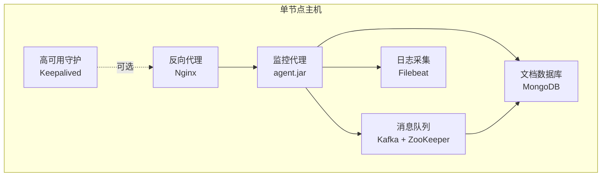
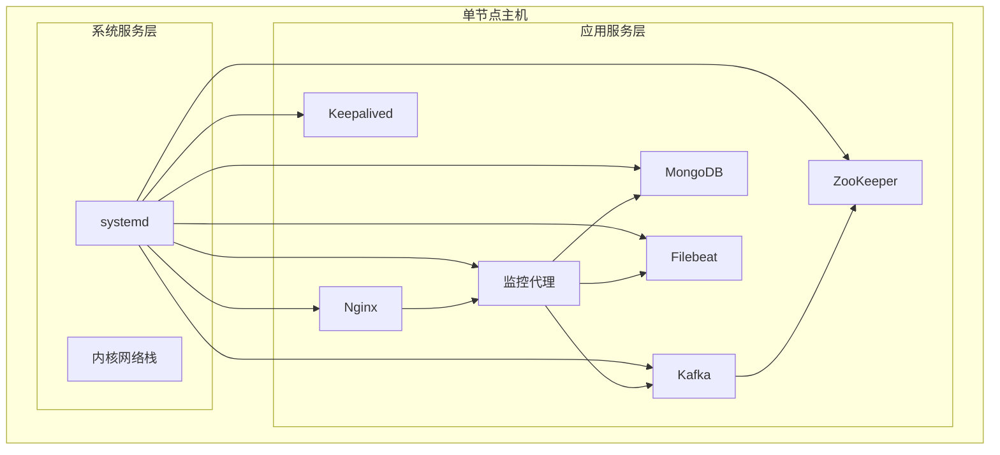
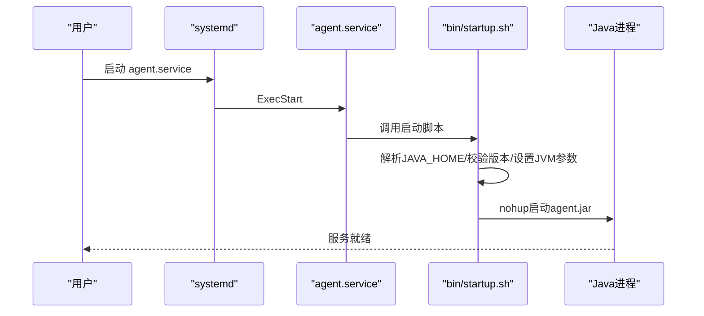
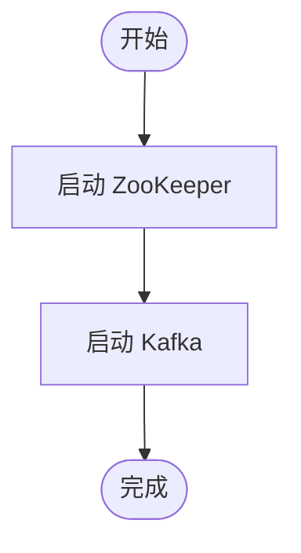
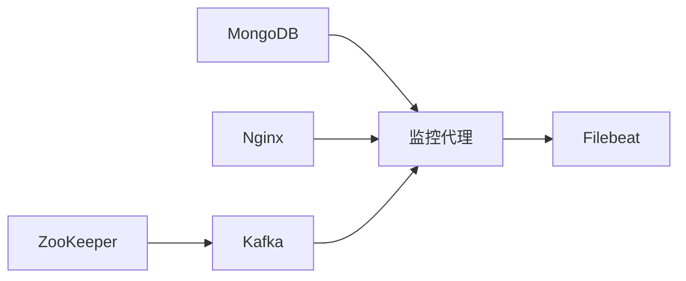

# 单节点部署架构

<cite>
**本文引用的文件**
- [agent.service](file://watcher-builder/assembly/conf/agent.service)
- [kafka.service](file://watcher-builder/assembly/conf/kafka.service)
- [zookeeper.service](file://watcher-builder/assembly/conf/zookeeper.service)
- [mongodb.service](file://watcher-builder/assembly/conf/mongodb.service)
- [nginx.service](file://watcher-builder/assembly/conf/nginx.service)
- [keepalived.service](file://watcher-builder/assembly/conf/keepalived.service)
- [startup.sh（监控代理）](file://watcher-builder/assembly/bin/startup.sh)
- [restart.sh（监控代理）](file://watcher-builder/assembly/bin/restart.sh)
- [shutdown.sh（监控代理）](file://watcher-builder/assembly/bin/shutdown.sh)
- [startup.sh（组件总启动）](file://watcher-builder/assembly/components/startup.sh)
- [application.properties](file://watcher-agent/src/main/resources/application.properties)
- [application-dev.properties](file://watcher-agent/src/main/resources/application-dev.properties)
- [application-local.properties](file://watcher-agent/src/main/resources/application-local.properties)
- [application-prod.properties](file://watcher-agent/src/main/resources/application-prod.properties)
- [application-test.properties](file://watcher-agent/src/main/resources/application-test.properties)
- [init.sql](file://watcher-agent/src/main/resources/database/init.sql)
- [schema-mysql.sql](file://watcher-agent/src/main/resources/schema-mysql.sql)
- [WatcherAgentApplication.java](file://watcher-agent/src/main/java/com/virtual/cloud/om/agent/WatcherAgentApplication.java)
</cite>

## 目录
1. [简介](#简介)
2. [项目结构](#项目结构)
3. [核心组件](#核心组件)
4. [架构总览](#架构总览)
5. [详细组件分析](#详细组件分析)
6. [依赖关系分析](#依赖关系分析)
7. [性能考虑](#性能考虑)
8. [故障排查指南](#故障排查指南)
9. [结论](#结论)
10. [附录](#附录)

## 简介
本文件面向在单台物理机或虚拟机上进行ShowTime监控系统的单节点部署，给出完整的拓扑结构、服务启动顺序与依赖关系、systemd服务配置、进程管理与端口占用、环境变量与配置文件要点、部署步骤与排障建议。该方案适用于开发测试、演示验证、小规模生产等场景；对于高并发、高可用需求，请参考多节点集群部署。

## 项目结构
单节点部署将以下组件集中于同一主机：
- 监控代理服务：负责采集、上报、任务调度与Web接口
- 消息中间件：Kafka（含ZooKeeper）
- 数据存储：MongoDB
- 反向代理：Nginx
- 高可用守护：Keepalived（可选）
- 文件收集：Filebeat（随打包分发，用于日志采集）

图示来源
- [agent.service:1-14](file://watcher-builder/assembly/conf/agent.service#L1-L14)
- [kafka.service:1-14](file://watcher-builder/assembly/conf/kafka.service#L1-L14)
- [zookeeper.service:1-14](file://watcher-builder/assembly/conf/zookeeper.service#L1-L14)
- [mongodb.service:1-14](file://watcher-builder/assembly/conf/mongodb.service#L1-L14)
- [nginx.service:1-14](file://watcher-builder/assembly/conf/nginx.service#L1-L14)
- [keepalived.service:1-14](file://watcher-builder/assembly/conf/keepalived.service#L1-L14)

章节来源
- [startup.sh（组件总启动）:24-29](file://watcher-builder/assembly/components/startup.sh#L24-L29)
- [agent.service:1-14](file://watcher-builder/assembly/conf/agent.service#L1-L14)
- [kafka.service:1-14](file://watcher-builder/assembly/conf/kafka.service#L1-L14)
- [zookeeper.service:1-14](file://watcher-builder/assembly/conf/zookeeper.service#L1-L14)
- [mongodb.service:1-14](file://watcher-builder/assembly/conf/mongodb.service#L1-L14)
- [nginx.service:1-14](file://watcher-builder/assembly/conf/nginx.service#L1-L14)
- [keepalived.service:1-14](file://watcher-builder/assembly/conf/keepalived.service#L1-L14)

## 核心组件
- 监控代理服务
  - 启动入口：通过systemd加载agent.service，调用bin/startup.sh
  - 运行参数：使用spring.profiles.active=prod，加载CONF_DIR下的配置
  - 内存与GC：默认堆大小与GC日志、dump路径均在启动脚本中设定
- 消息队列服务
  - ZooKeeper：Kafka依赖，独立systemd单元
  - Kafka：独立systemd单元，依赖ZooKeeper
- 文档数据库
  - MongoDB：独立systemd单元，提供数据持久化
- 反向代理
  - Nginx：独立systemd单元，对外提供统一入口
- 高可用守护
  - Keepalived：可选，用于VIP漂移与健康检查
- 日志采集
  - Filebeat：随组件包分发，配合Nginx/MongoDB/Kafka等输出日志

章节来源
- [startup.sh（监控代理）:62-78](file://watcher-builder/assembly/bin/startup.sh#L62-L78)
- [application-prod.properties](file://watcher-agent/src/main/resources/application-prod.properties)
- [application.properties](file://watcher-agent/src/main/resources/application.properties)
- [agent.service:5-10](file://watcher-builder/assembly/conf/agent.service#L5-L10)
- [kafka.service:5-10](file://watcher-builder/assembly/conf/kafka.service#L5-L10)
- [zookeeper.service:5-10](file://watcher-builder/assembly/conf/zookeeper.service#L5-L10)
- [mongodb.service:5-10](file://watcher-builder/assembly/conf/mongodb.service#L5-L10)
- [nginx.service:5-10](file://watcher-builder/assembly/conf/nginx.service#L5-L10)
- [keepalived.service:5-10](file://watcher-builder/assembly/conf/keepalived.service#L5-L10)

## 架构总览
单节点部署的完整拓扑如下：

图示来源
- [startup.sh（组件总启动）:26-29](file://watcher-builder/assembly/components/startup.sh#L26-L29)
- [agent.service:5-10](file://watcher-builder/assembly/conf/agent.service#L5-L10)
- [kafka.service:5-10](file://watcher-builder/assembly/conf/kafka.service#L5-L10)
- [zookeeper.service:5-10](file://watcher-builder/assembly/conf/zookeeper.service#L5-L10)
- [mongodb.service:5-10](file://watcher-builder/assembly/conf/mongodb.service#L5-L10)
- [nginx.service:5-10](file://watcher-builder/assembly/conf/nginx.service#L5-L10)
- [keepalived.service:5-10](file://watcher-builder/assembly/conf/keepalived.service#L5-L10)

## 详细组件分析

### 监控代理服务（Agent）
- systemd单元：agent.service
- 启动流程：ExecStart调用bin/startup.sh，内部解析JAVA_HOME、校验Java版本、设置JVM参数、以nohup方式启动agent.jar
- 配置加载：通过-Dspring.config.location与-Dspring.profiles.active加载对应环境配置
- 停止流程：通过进程标志匹配pkill停止

图示来源
- [agent.service:5-10](file://watcher-builder/assembly/conf/agent.service#L5-L10)
- [startup.sh（监控代理）:4-25](file://watcher-builder/assembly/bin/startup.sh#L4-L25)
- [startup.sh（监控代理）](file://watcher-builder/assembly/bin/startup.sh#L78)

章节来源
- [agent.service:1-14](file://watcher-builder/assembly/conf/agent.service#L1-L14)
- [startup.sh（监控代理）:1-81](file://watcher-builder/assembly/bin/startup.sh#L1-L81)
- [restart.sh（监控代理）:1-9](file://watcher-builder/assembly/bin/restart.sh#L1-L9)
- [shutdown.sh（监控代理）:1-26](file://watcher-builder/assembly/bin/shutdown.sh#L1-L26)
- [application-prod.properties](file://watcher-agent/src/main/resources/application-prod.properties)
- [application.properties](file://watcher-agent/src/main/resources/application.properties)

### 消息队列服务（Kafka + ZooKeeper）
- systemd单元：kafka.service、zookeeper.service
- 启动顺序：先ZooKeeper，后Kafka
- 组件总启动：components/startup.sh按顺序启动Nginx、MongoDB、ZooKeeper、Kafka

图示来源
- [startup.sh（组件总启动）:27-29](file://watcher-builder/assembly/components/startup.sh#L27-L29)
- [zookeeper.service:5-10](file://watcher-builder/assembly/conf/zookeeper.service#L5-L10)
- [kafka.service:5-10](file://watcher-builder/assembly/conf/kafka.service#L5-L10)

章节来源
- [startup.sh（组件总启动）:1-39](file://watcher-builder/assembly/components/startup.sh#L1-L39)
- [zookeeper.service:1-14](file://watcher-builder/assembly/conf/zookeeper.service#L1-L14)
- [kafka.service:1-14](file://watcher-builder/assembly/conf/kafka.service#L1-L14)

### 文档数据库（MongoDB）
- systemd单元：mongodb.service
- 组件总启动：components/startup.sh中调用其startup.sh

章节来源
- [startup.sh（组件总启动）](file://watcher-builder/assembly/components/startup.sh#L27)
- [mongodb.service:1-14](file://watcher-builder/assembly/conf/mongodb.service#L1-L14)

### 反向代理（Nginx）
- systemd单元：nginx.service
- 组件总启动：components/startup.sh中调用其startup.sh

章节来源
- [startup.sh（组件总启动）](file://watcher-builder/assembly/components/startup.sh#L26)
- [nginx.service:1-14](file://watcher-builder/assembly/conf/nginx.service#L1-L14)

### 高可用守护（Keepalived）
- systemd单元：keepalived.service
- 组件总启动：components/startup.sh中调用其startup.sh

章节来源
- [startup.sh（组件总启动）:28-30](file://watcher-builder/assembly/components/startup.sh#L28-L30)
- [keepalived.service:1-14](file://watcher-builder/assembly/conf/keepalived.service#L1-L14)

### 日志采集（Filebeat）
- 随组件包分发，用于采集Nginx、MongoDB、Kafka等日志并转发至集中式日志系统
- 本节为概念性说明，不直接映射到具体源码文件

## 依赖关系分析
- 启动顺序依赖
  - ZooKeeper → Kafka → MongoDB → Nginx → 监控代理
  - Keepalived可选，通常在需要VIP高可用时启用
- 端口占用（依据各组件默认配置与脚本行为推断）
  - 监控代理：由Spring Boot应用暴露HTTP端口（具体端口见配置文件）
  - Kafka：默认端口（如9092），需确保未被占用
  - ZooKeeper：默认端口（如2181），需确保未被占用
  - MongoDB：默认端口（如27017），需确保未被占用
  - Nginx：默认端口（如80/443），需确保未被占用
- 环境变量与配置
  - WATCHER_HOME：组件安装根目录，由/etc/watcher_home写入
  - JAVA_OPTS/JVM参数：在监控代理启动脚本中设置
  - Spring Profile：通过-Dspring.profiles.active指定（默认prod）

图示来源
- [startup.sh（组件总启动）:26-29](file://watcher-builder/assembly/components/startup.sh#L26-L29)
- [agent.service:5-10](file://watcher-builder/assembly/conf/agent.service#L5-L10)

章节来源
- [startup.sh（组件总启动）:1-39](file://watcher-builder/assembly/components/startup.sh#L1-L39)
- [startup.sh（监控代理）:44-78](file://watcher-builder/assembly/bin/startup.sh#L44-L78)
- [application-prod.properties](file://watcher-agent/src/main/resources/application-prod.properties)

## 性能考虑
- 单节点部署适合小规模数据与低并发场景。若业务增长，建议拆分为多节点集群，分离ZooKeeper、Kafka、MongoDB与Web/Agent服务。
- JVM内存与GC参数已在监控代理启动脚本中预设，可根据机器内存与负载调整。
- Kafka/ZooKeeper/MongoDB/Nginx均在同一主机运行，需预留足够CPU、内存、磁盘IO与网络带宽。
- 建议开启swap与合理的ulimit，避免OOM与句柄不足。

## 故障排查指南
- 启动失败（Java版本不满足）
  - 现象：启动脚本报错提示Java版本低于1.8或未找到Java
  - 处理：安装符合要求的JDK，并正确设置JAVA_HOME或PATH
  - 参考
    - [startup.sh（监控代理）:4-25](file://watcher-builder/assembly/bin/startup.sh#L4-L25)
- 进程无法停止
  - 现象：执行shutdown.sh后进程仍在运行
  - 处理：确认进程标志匹配，必要时手动查找并终止相关进程
  - 参考
    - [shutdown.sh（监控代理）:20-24](file://watcher-builder/assembly/bin/shutdown.sh#L20-L24)
- 端口冲突
  - 现象：Kafka/ZooKeeper/MongoDB/Nginx启动失败
  - 处理：检查对应端口占用情况并修改配置或释放端口
  - 参考
    - [startup.sh（组件总启动）:26-29](file://watcher-builder/assembly/components/startup.sh#L26-L29)
- 配置未生效
  - 现象：修改application-*.properties后未生效
  - 处理：确认-Dspring.profiles.active与-Dspring.config.location指向正确路径
  - 参考
    - [startup.sh（监控代理）](file://watcher-builder/assembly/bin/startup.sh#L78)
    - [application-prod.properties](file://watcher-agent/src/main/resources/application-prod.properties)
- 数据库初始化
  - 现象：首次启动无表结构或初始数据
  - 处理：确认init.sql与schema-mysql.sql已正确导入
  - 参考
    - [init.sql](file://watcher-agent/src/main/resources/database/init.sql)
    - [schema-mysql.sql](file://watcher-agent/src/main/resources/schema-mysql.sql)

## 结论
单节点部署为快速验证与小规模上线提供了高效路径。通过明确的systemd单元、严格的启动顺序与清晰的配置加载机制，可在一台主机上完成监控代理、消息队列、数据库与反向代理的集成部署。随着业务扩展，应逐步迁移到多节点架构以提升可靠性与性能。

## 附录

### 部署步骤（概要）
- 准备工作
  - 安装JDK并配置JAVA_HOME
  - 确保系统防火墙开放所需端口或临时关闭
- 安装与配置
  - 将组件包解压至目标路径，并写入/etc/watcher_home
  - 修改各组件配置文件（端口、连接串、日志路径等）
  - 加载systemd单元并启用开机自启
- 启动顺序
  - 先ZooKeeper，再Kafka，随后MongoDB与Nginx，最后启动监控代理
- 验证
  - 查看各服务状态与日志
  - 访问监控代理与Nginx页面确认连通性

章节来源
- [startup.sh（组件总启动）:1-39](file://watcher-builder/assembly/components/startup.sh#L1-L39)
- [agent.service:1-14](file://watcher-builder/assembly/conf/agent.service#L1-L14)
- [kafka.service:1-14](file://watcher-builder/assembly/conf/kafka.service#L1-L14)
- [zookeeper.service:1-14](file://watcher-builder/assembly/conf/zookeeper.service#L1-L14)
- [mongodb.service:1-14](file://watcher-builder/assembly/conf/mongodb.service#L1-L14)
- [nginx.service:1-14](file://watcher-builder/assembly/conf/nginx.service#L1-L14)
- [keepalived.service:1-14](file://watcher-builder/assembly/conf/keepalived.service#L1-L14)