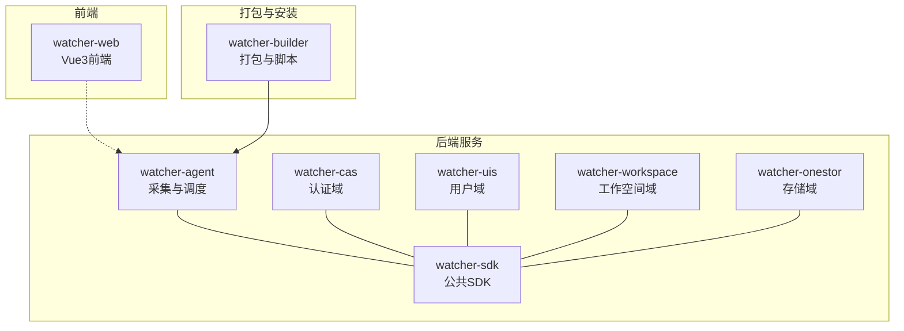
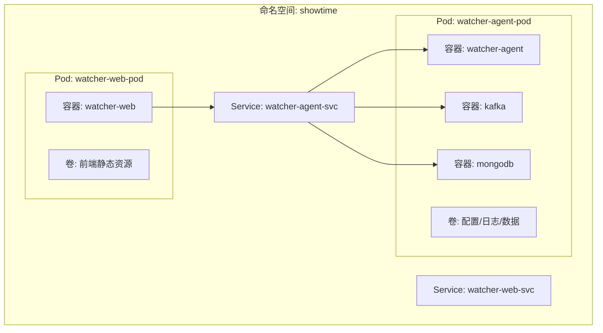
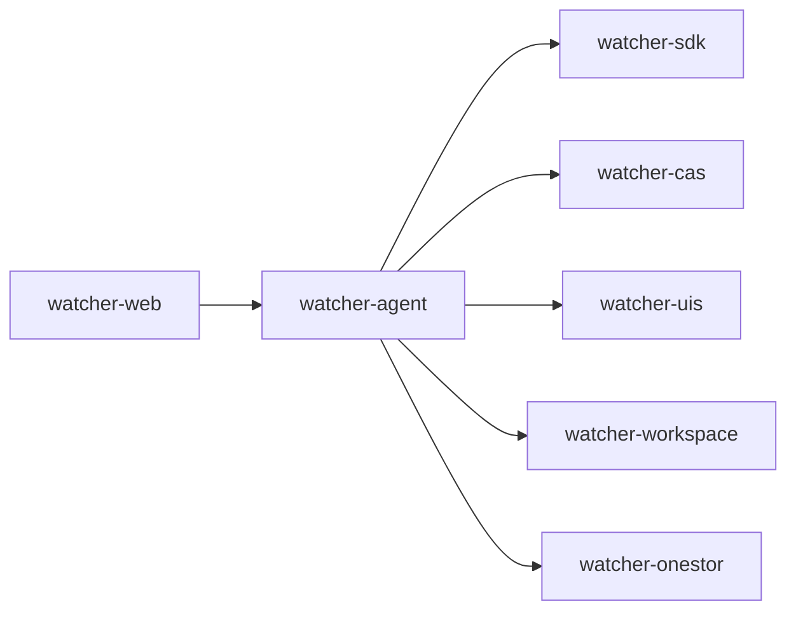

# 容器化部署方案

<cite>
**本文引用的文件**
- [Readme.md](file://Readme.md)
- [pom.xml](file://pom.xml)
- [startup.sh](file://watcher-builder/assembly/bin/startup.sh)
- [init.sh](file://watcher-builder/assembly/bin/init.sh)
- [agent.service](file://watcher-builder/assembly/conf/agent.service)
- [kafka.service](file://watcher-builder/assembly/conf/kafka.service)
- [mongodb.service](file://watcher-builder/assembly/conf/mongodb.service)
- [WatcherAgentApplication.java](file://watcher-agent/src/main/java/com/virtual/cloud/om/agent/WatcherAgentApplication.java)
- [application.properties](file://watcher-agent/src/main/resources/application.properties)
- [package.json](file://watcher-web/package.json)
</cite>

## 目录
1. [简介](#简介)
2. [项目结构](#项目结构)
3. [核心组件](#核心组件)
4. [架构总览](#架构总览)
5. [详细组件分析](#详细组件分析)
6. [依赖分析](#依赖分析)
7. [性能考虑](#性能考虑)
8. [故障排查指南](#故障排查指南)
9. [结论](#结论)
10. [附录](#附录)

## 简介
本方案面向ShowTime监控系统，提供基于Docker与Kubernetes的容器化部署蓝图，覆盖镜像构建、容器编排、服务发现、网络通信、数据持久化、资源限制、健康检查、滚动更新与回滚、监控与日志、性能优化及故障排查等关键主题。系统技术栈以Spring Boot为核心，结合Quartz、MongoDB、Elasticsearch、Kafka、ClickHouse、Filebeat、Kibana、Grafana等中间件与组件，形成“采集-传输-存储-检索-可视化”的完整链路。

## 项目结构
- 多模块Maven工程，核心模块包括：
  - watcher-agent：采集与调度主服务，负责指标采集、资源管理、定时任务、日志策略下发等。
  - watcher-cas、watcher-uis、watcher-workspace、watcher-onestor：各产品域的数据采集与处理模块。
  - watcher-sdk：公共配置、DTO、工具类。
  - watcher-builder：打包与安装脚本，包含Filebeat、Kafka、MongoDB等组件的封装与服务化脚本。
  - watcher-web：Vue3前端服务。
- 顶层README概述了功能集、技术栈与运行方式；pom.xml定义了模块聚合与版本管理。

图表来源
- [pom.xml:11-20](file://pom.xml#L11-L20)
- [Readme.md:29-38](file://Readme.md#L29-L38)

章节来源
- [Readme.md:1-45](file://Readme.md#L1-L45)
- [pom.xml:1-184](file://pom.xml#L1-L184)

## 核心组件
- watcher-agent：Spring Boot应用，启用调度并排除Quartz自动装配，扫描多个域包，作为采集与调度的核心。
- watcher-web：前端应用，使用Vite构建，支持开发、生产与预览模式。
- watcher-builder：提供初始化、启动、重启、关闭脚本以及systemd服务单元，便于在容器内以进程形式托管中间件与Agent。

章节来源
- [WatcherAgentApplication.java:14-18](file://watcher-agent/src/main/java/com/virtual/cloud/om/agent/WatcherAgentApplication.java#L14-L18)
- [application.properties:1-80](file://watcher-agent/src/main/resources/application.properties#L1-L80)
- [package.json:1-72](file://watcher-web/package.json#L1-L72)
- [startup.sh:1-81](file://watcher-builder/assembly/bin/startup.sh#L1-L81)
- [init.sh:1-35](file://watcher-builder/assembly/bin/init.sh#L1-L35)
- [agent.service:1-14](file://watcher-builder/assembly/conf/agent.service#L1-L14)
- [kafka.service:1-14](file://watcher-builder/assembly/conf/kafka.service#L1-L14)
- [mongodb.service:1-14](file://watcher-builder/assembly/conf/mongodb.service#L1-L14)

## 架构总览
容器化架构建议采用“一Pod多容器”模式，将watcher-agent与其依赖中间件（如Kafka、MongoDB）共同置于同一Pod内，通过共享卷实现日志与配置的持久化与互通；同时，将watcher-web独立部署为单独的Pod并通过Service暴露，实现前后端分离与可扩展性。

图表来源
- [startup.sh:78](file://watcher-builder/assembly/bin/startup.sh#L78)
- [agent.service:7](file://watcher-builder/assembly/conf/agent.service#L7)
- [kafka.service:7](file://watcher-builder/assembly/conf/kafka.service#L7)
- [mongodb.service:7](file://watcher-builder/assembly/conf/mongodb.service#L7)

## 详细组件分析

### Docker镜像构建策略
- 基础镜像选择：建议使用OpenJDK 8镜像作为Java运行时基础，确保与项目Java版本兼容；前端可基于Nginx或Node官方镜像进行构建与发布。
- 多阶段构建：
  - 后端：使用Maven构建产物，复制依赖与资源至镜像，减少镜像体积。
  - 前端：使用Vite构建生产包，将dist目录挂载至Nginx静态站点。
- 安全与最小化：仅包含必要运行时组件，避免安装不必要的系统包；对容器内用户进行权限最小化设置。

### 容器编排与服务发现
- Kubernetes资源对象：
  - Deployment：用于声明式部署watcher-agent与watcher-web，控制副本数与滚动更新策略。
  - Service：ClusterIP或NodePort暴露watcher-agent与watcher-web，配合DNS实现服务发现。
  - ConfigMap：存放application.properties等配置，支持热更新。
  - Secret：存放敏感信息（如数据库密码、中间件认证），通过环境变量或挂载密文文件注入。
  - PersistentVolumeClaim：为MongoDB、Kafka、日志与采集缓存提供持久化存储。
- Pod网络：同一Pod内的容器共享网络命名空间，便于本地通信；跨Pod通过Service与ClusterIP访问。
- 服务发现：通过Kubernetes DNS域名完成服务名到ClusterIP的解析，例如将中间件地址指向对应Service。

### 网络通信与端口规划
- watcher-agent：监听端口由配置决定，默认端口见应用配置；通过Service暴露给前端调用。
- watcher-web：前端静态资源通过Nginx对外提供，或直接由Service暴露。
- 中间件：
  - Kafka：对外暴露端口供Agent写入/消费。
  - MongoDB：内部暴露端口供Agent读写。
- 端口冲突规避：在同一Node上通过不同端口映射避免冲突；在K8s中通过Service端口与容器端口映射解耦。

### 数据持久化
- 卷类型：使用HostPath或PV/PVC对接本地磁盘或云盘，确保日志、采集缓存、中间件数据持久化。
- 生命周期：Pod重建不丢失数据；备份策略建议结合快照与定期导出。

### 资源限制与QoS
- Requests/Limits：为watcher-agent与中间件设置合理的CPU与内存请求与限制，保障集群调度与稳定性。
- QoS等级：优先保证生产环境使用Guaranteed或Burstable等级，避免因资源抢占导致延迟。

### 健康检查与就绪探针
- livenessProbe：检测Agent进程是否存活，失败时触发重启。
- readinessProbe：确认Agent已加载配置、连接中间件成功后再对外提供服务。
- 探针策略：HTTP GET或TCP Socket探测，结合超时、重试与延时参数优化。

### 滚动更新与回滚
- 更新策略：设置maxUnavailable与maxSurge，确保更新期间服务连续性。
- 回滚：通过Deployment历史版本快速回退，结合金丝雀或蓝绿策略降低风险。

### 监控与日志
- 容器监控：Prometheus/Grafana采集Pod指标，关注CPU、内存、磁盘IO与网络吞吐。
- 日志收集：Filebeat采集容器标准输出与日志文件，发送至Elasticsearch/Kibana；或使用Sidecar模式统一收集。
- 性能优化：调整JVM参数（堆大小、GC日志与转储路径）、中间件连接池与批处理参数。

章节来源
- [application.properties:1-80](file://watcher-agent/src/main/resources/application.properties#L1-L80)
- [startup.sh:62-78](file://watcher-builder/assembly/bin/startup.sh#L62-L78)
- [agent.service:7](file://watcher-builder/assembly/conf/agent.service#L7)
- [kafka.service:7](file://watcher-builder/assembly/conf/kafka.service#L7)
- [mongodb.service:7](file://watcher-builder/assembly/conf/mongodb.service#L7)

## 依赖分析
- 组件耦合：
  - watcher-agent依赖watcher-sdk提供的公共能力；各域模块（CAS/UIS/Workspace/OneStor）通过接口与Agent交互。
  - watcher-web通过HTTP调用watcher-agent提供的REST接口。
- 外部依赖：
  - 中间件：Kafka、MongoDB、Elasticsearch、ClickHouse等，需在K8s中以StatefulSet或独立Deployment管理。
- 可能的循环依赖：应用配置允许循环依赖，需谨慎设计模块边界与依赖方向。

图表来源
- [pom.xml:11-20](file://pom.xml#L11-L20)
- [WatcherAgentApplication.java:14-18](file://watcher-agent/src/main/java/com/virtual/cloud/om/agent/WatcherAgentApplication.java#L14-L18)

章节来源
- [pom.xml:1-184](file://pom.xml#L1-L184)
- [WatcherAgentApplication.java:14-18](file://watcher-agent/src/main/java/com/virtual/cloud/om/agent/WatcherAgentApplication.java#L14-L18)

## 性能考虑
- JVM调优：依据容器内存限制设置堆大小，开启GC日志与堆转储，便于定位内存问题。
- 中间件优化：合理设置Kafka分区与副本、MongoDB索引与连接池大小、ClickHouse压缩与分区策略。
- 前端性能：启用静态资源缓存与CDN，减少首屏加载时间。
- 调度与并发：Quartz任务与业务线程池参数需与CPU核数匹配，避免过载。

## 故障排查指南
- 启动失败
  - 检查Java版本与JDK路径，确认启动脚本中的JAVA_HOME与版本校验逻辑。
  - 查看Agent启动参数与配置文件路径，确保配置正确加载。
- 连接异常
  - 校验中间件Service与端口映射，确认DNS解析与防火墙策略。
  - 检查Secret与ConfigMap挂载是否生效，确认敏感信息未被错误覆盖。
- 性能问题
  - 关注GC日志与堆转储，定位内存泄漏或GC停顿。
  - 监控容器资源使用率，必要时提升Requests/Limits。
- 日志与审计
  - 使用Filebeat或Sidecar收集容器日志，确保日志轮转与保留策略合理。
  - 结合Kibana/Grafana进行可视化分析。

章节来源
- [startup.sh:4-25](file://watcher-builder/assembly/bin/startup.sh#L4-L25)
- [startup.sh:55-78](file://watcher-builder/assembly/bin/startup.sh#L55-L78)
- [application.properties:48-51](file://watcher-agent/src/main/resources/application.properties#L48-L51)

## 结论
通过Docker与Kubernetes的容器化方案，ShowTime监控系统可在云原生环境下实现高可用、可扩展与可观测的部署形态。建议以“一Pod多容器”整合Agent与中间件，配合完善的配置管理、持久化策略、健康检查与滚动更新机制，确保系统稳定运行与快速迭代。

## 附录
- 部署清单编写要点
  - Deployment：定义容器镜像、环境变量、资源请求与限制、探针、滚动更新策略。
  - Service：定义ClusterIP/NodePort与端口映射，确保前后端连通。
  - ConfigMap：集中管理配置文件，支持热更新。
  - Secret：保护敏感信息，避免硬编码。
  - PVC：为中间件与日志提供持久化存储。
- 最佳实践
  - 将watcher-web与watcher-agent分离部署，便于独立扩缩容。
  - 使用命名空间隔离不同环境（dev/stag/prod）。
  - 引入Helm Chart或Kustomize进行模板化管理，提升一致性与复用性。