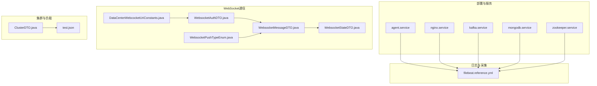
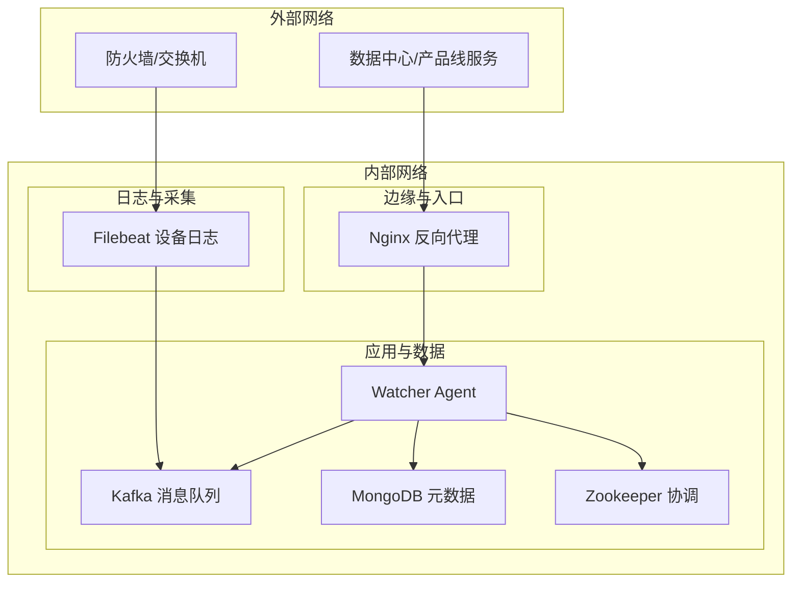
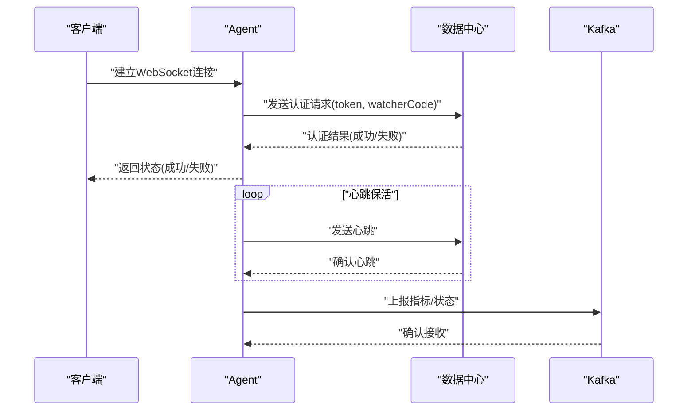
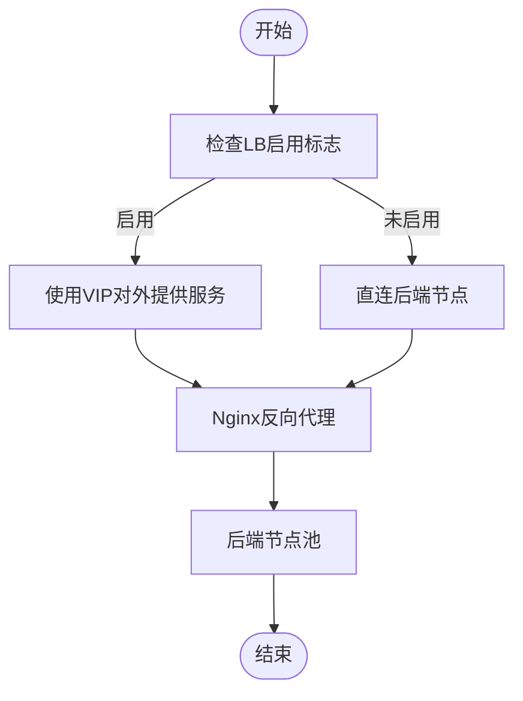
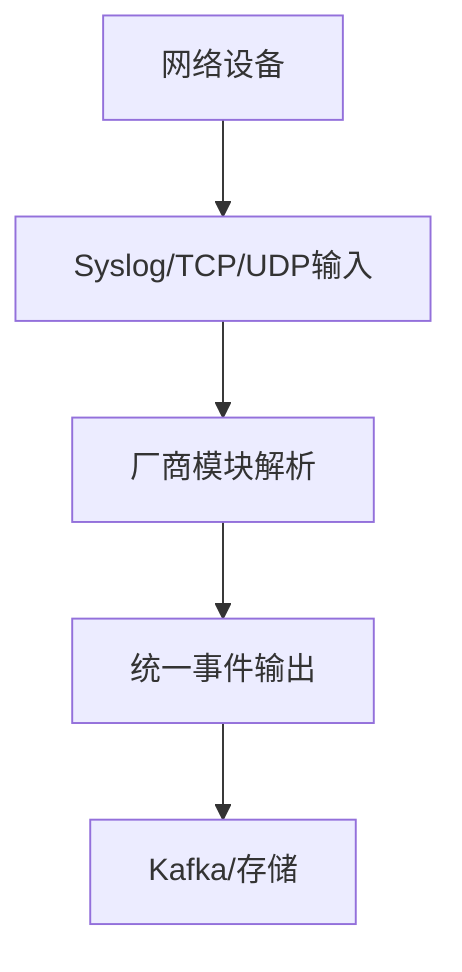
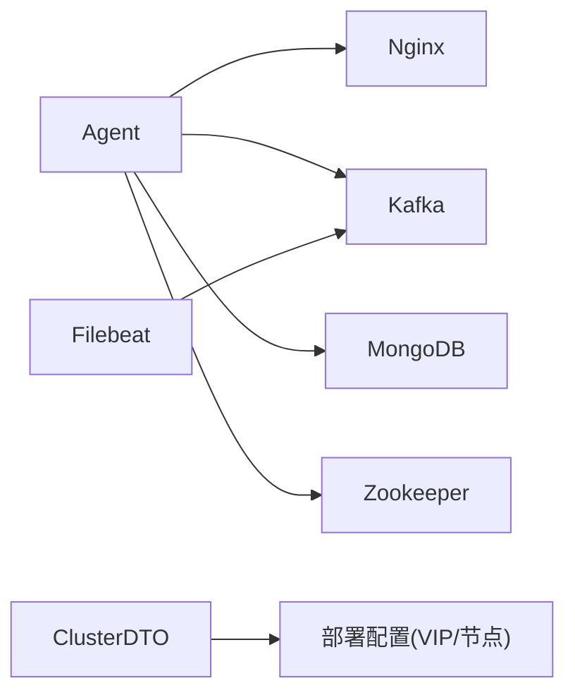

# 网络架构设计

<cite>
**本文引用的文件**
- [filebeat.reference.yml](file://watcher-builder/assembly/components/filebeat/filebeat-8.0.1-linux-x86_64/filebeat.reference.yml)
- [ClusterDTO.java](file://watcher-sdk/src/main/java/com/virtual/cloud/om/sdk/dto/dataReport/cas/ClusterDTO.java)
- [test.json](file://watcher-agent/src/main/java/com/virtual/cloud/om/agent/service/deploy/test.json)
- [WebsocketMessageDTO.java](file://watcher-agent/src/main/java/com/virtual/cloud/om/agent/dto/WebsocketMessageDTO.java)
- [WebsocketSate.java](file://watcher-agent/src/main/java/com/virtual/cloud/om/agent/entity/WebsocketSate.java)
- [DataCenterDTO.java](file://watcher-agent/src/main/java/com/virtual/cloud/om/agent/dto/DataCenterDTO.java)
- [WebsocketStateDTO.java](file://watcher-sdk/src/main/java/com/virtual/cloud/om/sdk/dto/websocket/WebsocketStateDTO.java)
- [DataCenterWebcocketUriConstants.java](file://watcher-sdk/src/main/java/com/virtual/cloud/om/sdk/constant/uri/DataCenterWebcocketUriConstants.java)
- [WebsocketPushTypeEnum.java](file://watcher-sdk/src/main/java/com/virtual/cloud/om/sdk/constant/WebsocketPushTypeEnum.java)
- [WebsocketAuthDTO.java](file://watcher-sdk/src/main/java/com/virtual/cloud/om/sdk/dto/websocket/WebsocketAuthDTO.java)
- [agent.service](file://watcher-builder/assembly/conf/agent.service)
- [nginx.service](file://watcher-builder/assembly/conf/nginx.service)
- [kafka.service](file://watcher-builder/assembly/conf/kafka.service)
- [mongodb.service](file://watcher-builder/assembly/conf/mongodb.service)
- [zookeeper.service](file://watcher-builder/assembly/conf/zookeeper.service)
</cite>

## 目录
1. [引言](#引言)
2. [项目结构](#项目结构)
3. [核心组件](#核心组件)
4. [架构总览](#架构总览)
5. [详细组件分析](#详细组件分析)
6. [依赖关系分析](#依赖关系分析)
7. [性能考虑](#性能考虑)
8. [故障排查指南](#故障排查指南)
9. [结论](#结论)
10. [附录](#附录)

## 引言
本设计文档面向ShowTime监控系统，聚焦网络架构与安全设计，覆盖内网/外网划分、防火墙与端口策略、监控代理与产品线服务的通信协议与数据传输、负载均衡（Nginx、HAProxy）配置思路、网络故障排查工具与方法，以及网络安全加固与访问控制、数据加密传输等实践指南。文档以仓库中实际存在的组件与配置为依据，避免臆造信息，并通过图示与来源标注帮助读者快速定位实现位置。

## 项目结构
围绕网络相关的关键目录与文件如下：
- 监控采集与日志：Filebeat模块配置（支持多种设备日志输入）
- 负载均衡与高可用：集群与VIP配置示例
- WebSocket通信：认证、心跳、推送类型与URI常量
- 服务编排与系统服务：agent、nginx、kafka、mongodb、zookeeper的服务单元配置

**图表来源**
- [agent.service:1-14](file://watcher-builder/assembly/conf/agent.service#L1-L14)
- [nginx.service:1-14](file://watcher-builder/assembly/conf/nginx.service#L1-L14)
- [kafka.service:1-14](file://watcher-builder/assembly/conf/kafka.service#L1-L14)
- [mongodb.service:1-14](file://watcher-builder/assembly/conf/mongodb.service#L1-L14)
- [zookeeper.service:1-14](file://watcher-builder/assembly/conf/zookeeper.service#L1-L14)
- [filebeat.reference.yml:665-741](file://watcher-builder/assembly/components/filebeat/filebeat-8.0.1-linux-x86_64/filebeat.reference.yml#L665-L741)
- [DataCenterWebcocketUriConstants.java:8-13](file://watcher-sdk/src/main/java/com/virtual/cloud/om/sdk/constant/uri/DataCenterWebcocketUriConstants.java#L8-L13)
- [WebsocketAuthDTO.java:15-22](file://watcher-sdk/src/main/java/com/virtual/cloud/om/sdk/dto/websocket/WebsocketAuthDTO.java#L15-L22)
- [WebsocketMessageDTO.java:15-22](file://watcher-agent/src/main/java/com/virtual/cloud/om/agent/dto/WebsocketMessageDTO.java#L15-L22)
- [WebsocketStateDTO.java:15-23](file://watcher-sdk/src/main/java/com/virtual/cloud/om/sdk/dto/websocket/WebsocketStateDTO.java#L15-L23)
- [WebsocketPushTypeEnum.java:4-21](file://watcher-sdk/src/main/java/com/virtual/cloud/om/sdk/constant/WebsocketPushTypeEnum.java#L4-L21)
- [ClusterDTO.java:47-115](file://watcher-sdk/src/main/java/com/virtual/cloud/om/sdk/dto/dataReport/cas/ClusterDTO.java#L47-L115)
- [test.json:1-24](file://watcher-agent/src/main/java/com/virtual/cloud/om/agent/service/deploy/test.json#L1-L24)

**章节来源**
- [filebeat.reference.yml:665-741](file://watcher-builder/assembly/components/filebeat/filebeat-8.0.1-linux-x86_64/filebeat.reference.yml#L665-L741)
- [agent.service:1-14](file://watcher-builder/assembly/conf/agent.service#L1-L14)
- [nginx.service:1-14](file://watcher-builder/assembly/conf/nginx.service#L1-L14)
- [kafka.service:1-14](file://watcher-builder/assembly/conf/kafka.service#L1-L14)
- [mongodb.service:1-14](file://watcher-builder/assembly/conf/mongodb.service#L1-L14)
- [zookeeper.service:1-14](file://watcher-builder/assembly/conf/zookeeper.service#L1-L14)

## 核心组件
- 日志采集与网络设备对接：Filebeat模块支持Syslog/TCP/UDP等多种输入，可对接防火墙、交换机、负载均衡等设备日志，便于统一采集与分析。
- WebSocket通信层：定义了WebSocket认证、心跳、消息体与状态推送类型，以及URI常量，支撑监控代理与数据中心之间的实时通信。
- 集群与负载均衡：ClusterDTO中包含LB启用字段，结合部署配置中的VIP与节点列表，体现集群与高可用的网络拓扑。
- 系统服务编排：agent、nginx、kafka、mongodb、zookeeper均以systemd服务单元形式管理，便于在网络层面统一启停与健康检查。

**章节来源**
- [filebeat.reference.yml:1201-1252](file://watcher-builder/assembly/components/filebeat/filebeat-8.0.1-linux-x86_64/filebeat.reference.yml#L1201-L1252)
- [WebsocketAuthDTO.java:15-22](file://watcher-sdk/src/main/java/com/virtual/cloud/om/sdk/dto/websocket/WebsocketAuthDTO.java#L15-L22)
- [DataCenterWebcocketUriConstants.java:8-13](file://watcher-sdk/src/main/java/com/virtual/cloud/om/sdk/constant/uri/DataCenterWebcocketUriConstants.java#L8-L13)
- [WebsocketMessageDTO.java:15-22](file://watcher-agent/src/main/java/com/virtual/cloud/om/agent/dto/WebsocketMessageDTO.java#L15-L22)
- [WebsocketStateDTO.java:15-23](file://watcher-sdk/src/main/java/com/virtual/cloud/om/sdk/dto/websocket/WebsocketStateDTO.java#L15-L23)
- [WebsocketPushTypeEnum.java:4-21](file://watcher-sdk/src/main/java/com/virtual/cloud/om/sdk/constant/WebsocketPushTypeEnum.java#L4-L21)
- [ClusterDTO.java:47-115](file://watcher-sdk/src/main/java/com/virtual/cloud/om/sdk/dto/dataReport/cas/ClusterDTO.java#L47-L115)
- [test.json:1-24](file://watcher-agent/src/main/java/com/virtual/cloud/om/agent/service/deploy/test.json#L1-L24)

## 架构总览
下图展示监控系统在部署层面的网络角色与交互关系：agent负责采集与上报，nginx作为入口与反向代理，kafka用于异步消息传递，mongodb存储元数据，zookeeper提供协调能力；同时通过Filebeat对接各类网络设备日志，形成统一的可观测性数据流。

**图表来源**
- [nginx.service:1-14](file://watcher-builder/assembly/conf/nginx.service#L1-L14)
- [agent.service:1-14](file://watcher-builder/assembly/conf/agent.service#L1-L14)
- [kafka.service:1-14](file://watcher-builder/assembly/conf/kafka.service#L1-L14)
- [mongodb.service:1-14](file://watcher-builder/assembly/conf/mongodb.service#L1-L14)
- [zookeeper.service:1-14](file://watcher-builder/assembly/conf/zookeeper.service#L1-L14)
- [filebeat.reference.yml:665-741](file://watcher-builder/assembly/components/filebeat/filebeat-8.0.1-linux-x86_64/filebeat.reference.yml#L665-L741)

## 详细组件分析

### 组件A：WebSocket通信协议与数据传输
- 认证与心跳：通过WebSocket认证DTO携带令牌与心跳参数，确保长连接稳定与鉴权。
- 消息模型：消息类型与数据体由消息DTO定义，配合状态DTO反馈连接状态。
- 推送类型：枚举定义了心跳、SSH限制、状态上报、路由变更等推送事件，便于客户端按类型处理。
- URI约定：统一前缀与WebSocket端点，便于前端与后端路由一致。

**图表来源**
- [WebsocketAuthDTO.java:15-22](file://watcher-sdk/src/main/java/com/virtual/cloud/om/sdk/dto/websocket/WebsocketAuthDTO.java#L15-L22)
- [WebsocketStateDTO.java:15-23](file://watcher-sdk/src/main/java/com/virtual/cloud/om/sdk/dto/websocket/WebsocketStateDTO.java#L15-L23)
- [WebsocketMessageDTO.java:15-22](file://watcher-agent/src/main/java/com/virtual/cloud/om/agent/dto/WebsocketMessageDTO.java#L15-L22)
- [WebsocketPushTypeEnum.java:4-21](file://watcher-sdk/src/main/java/com/virtual/cloud/om/sdk/constant/WebsocketPushTypeEnum.java#L4-L21)
- [DataCenterWebcocketUriConstants.java:8-13](file://watcher-sdk/src/main/java/com/virtual/cloud/om/sdk/constant/uri/DataCenterWebcocketUriConstants.java#L8-L13)

**章节来源**
- [WebsocketAuthDTO.java:15-22](file://watcher-sdk/src/main/java/com/virtual/cloud/om/sdk/dto/websocket/WebsocketAuthDTO.java#L15-L22)
- [WebsocketStateDTO.java:15-23](file://watcher-sdk/src/main/java/com/virtual/cloud/om/sdk/dto/websocket/WebsocketStateDTO.java#L15-L23)
- [WebsocketMessageDTO.java:15-22](file://watcher-agent/src/main/java/com/virtual/cloud/om/agent/dto/WebsocketMessageDTO.java#L15-L22)
- [WebsocketPushTypeEnum.java:4-21](file://watcher-sdk/src/main/java/com/virtual/cloud/om/sdk/constant/WebsocketPushTypeEnum.java#L4-L21)
- [DataCenterWebcocketUriConstants.java:8-13](file://watcher-sdk/src/main/java/com/virtual/cloud/om/sdk/constant/uri/DataCenterWebcocketUriConstants.java#L8-L13)

### 组件B：负载均衡与高可用（Nginx、HAProxy）
- Nginx：作为入口反向代理，承载静态资源与HTTP/HTTPS流量转发，结合systemd服务单元进行生命周期管理。
- HAProxy：Filebeat模块中提供HAProxy日志采集配置项，可用于采集负载均衡器运行日志，辅助运维分析。
- 集群与LB：ClusterDTO包含LB启用字段，结合部署配置中的VIP与节点列表，体现集群高可用网络拓扑。

**图表来源**
- [ClusterDTO.java:47-115](file://watcher-sdk/src/main/java/com/virtual/cloud/om/sdk/dto/dataReport/cas/ClusterDTO.java#L47-L115)
- [test.json:1-24](file://watcher-agent/src/main/java/com/virtual/cloud/om/agent/service/deploy/test.json#L1-L24)
- [nginx.service:1-14](file://watcher-builder/assembly/conf/nginx.service#L1-L14)
- [filebeat.reference.yml:1201-1252](file://watcher-builder/assembly/components/filebeat/filebeat-8.0.1-linux-x86_64/filebeat.reference.yml#L1201-L1252)

**章节来源**
- [ClusterDTO.java:47-115](file://watcher-sdk/src/main/java/com/virtual/cloud/om/sdk/dto/dataReport/cas/ClusterDTO.java#L47-L115)
- [test.json:1-24](file://watcher-agent/src/main/java/com/virtual/cloud/om/agent/service/deploy/test.json#L1-L24)
- [nginx.service:1-14](file://watcher-builder/assembly/conf/nginx.service#L1-L14)
- [filebeat.reference.yml:1201-1252](file://watcher-builder/assembly/components/filebeat/filebeat-8.0.1-linux-x86_64/filebeat.reference.yml#L1201-L1252)

### 组件C：网络设备日志采集（Filebeat）
- 输入模式：支持UDP/TCP/Syslog等多种输入，可绑定监听地址与端口，适配不同厂商设备。
- 模块化：针对不同厂商（如Cisco ASA/FTD、HAProxy等）提供专用模块，便于解析与归一化。
- 安全方向：可基于内部/外部区域配置推断网络方向，辅助安全分析。

**图表来源**
- [filebeat.reference.yml:665-741](file://watcher-builder/assembly/components/filebeat/filebeat-8.0.1-linux-x86_64/filebeat.reference.yml#L665-L741)
- [filebeat.reference.yml:1201-1252](file://watcher-builder/assembly/components/filebeat/filebeat-8.0.1-linux-x86_64/filebeat.reference.yml#L1201-L1252)

**章节来源**
- [filebeat.reference.yml:665-741](file://watcher-builder/assembly/components/filebeat/filebeat-8.0.1-linux-x86_64/filebeat.reference.yml#L665-L741)
- [filebeat.reference.yml:1201-1252](file://watcher-builder/assembly/components/filebeat/filebeat-8.0.1-linux-x86_64/filebeat.reference.yml#L1201-L1252)

## 依赖关系分析
- 服务编排：agent、nginx、kafka、mongodb、zookeeper均通过systemd服务单元启动，彼此间通过本地回环或内网地址通信。
- 通信链路：WebSocket链路由nginx暴露，Agent与数据中心之间通过认证、心跳与消息推送完成数据交换；日志链路由Filebeat采集并投递到Kafka。
- 配置耦合：ClusterDTO的LB启用与部署配置中的VIP/节点列表共同决定后端拓扑与流量走向。

**图表来源**
- [agent.service:1-14](file://watcher-builder/assembly/conf/agent.service#L1-L14)
- [nginx.service:1-14](file://watcher-builder/assembly/conf/nginx.service#L1-L14)
- [kafka.service:1-14](file://watcher-builder/assembly/conf/kafka.service#L1-L14)
- [mongodb.service:1-14](file://watcher-builder/assembly/conf/mongodb.service#L1-L14)
- [zookeeper.service:1-14](file://watcher-builder/assembly/conf/zookeeper.service#L1-L14)
- [ClusterDTO.java:47-115](file://watcher-sdk/src/main/java/com/virtual/cloud/om/sdk/dto/dataReport/cas/ClusterDTO.java#L47-L115)
- [test.json:1-24](file://watcher-agent/src/main/java/com/virtual/cloud/om/agent/service/deploy/test.json#L1-L24)

**章节来源**
- [agent.service:1-14](file://watcher-builder/assembly/conf/agent.service#L1-L14)
- [nginx.service:1-14](file://watcher-builder/assembly/conf/nginx.service#L1-L14)
- [kafka.service:1-14](file://watcher-builder/assembly/conf/kafka.service#L1-L14)
- [mongodb.service:1-14](file://watcher-builder/assembly/conf/mongodb.service#L1-L14)
- [zookeeper.service:1-14](file://watcher-builder/assembly/conf/zookeeper.service#L1-L14)
- [ClusterDTO.java:47-115](file://watcher-sdk/src/main/java/com/virtual/cloud/om/sdk/dto/dataReport/cas/ClusterDTO.java#L47-L115)
- [test.json:1-24](file://watcher-agent/src/main/java/com/virtual/cloud/om/agent/service/deploy/test.json#L1-L24)

## 性能考虑
- WebSocket长连接：采用心跳机制维持连接，建议根据网络RTT设置合理的心跳周期，避免频繁重连。
- 日志采集：Filebeat输入端口与解析模块应与设备日志量匹配，避免阻塞；必要时启用批量与压缩以降低带宽占用。
- 负载均衡：Nginx与HAProxy应结合后端节点数量与健康检查策略，启用连接复用与超时控制，减少空闲连接积压。
- 数据传输：对敏感字段（如密码）采用加密存储与传输，避免明文泄露。

[本节为通用指导，无需具体文件来源]

## 故障排查指南
- 连通性测试
  - 使用ping/traceroute验证主机可达性与路由路径。
  - 使用telnet或nc测试关键端口（如WebSocket端口、Kafka端口、数据库端口）连通性。
- 端口扫描
  - 使用nmap扫描目标主机开放端口，核对防火墙策略与服务监听范围。
- 流量分析
  - 结合Filebeat采集的设备日志与系统日志，定位异常事件与流量特征。
  - 关注WebSocket连接状态与心跳频率，判断链路质量。
- 服务状态
  - 通过systemd查看agent、nginx、kafka、mongodb、zookeeper的运行状态与重启次数，定位异常重启原因。

[本节为通用指导，无需具体文件来源]

## 结论
ShowTime监控系统的网络架构以“入口反向代理+Nginx、后端Agent/Kafka/MongoDB/Zookeeper”为核心，辅以Filebeat对网络设备日志的统一采集。WebSocket提供稳定的实时通信通道，ClusterDTO与部署配置体现LB与高可用设计。通过合理的端口策略、心跳保活与日志分析，可有效提升系统稳定性与可观测性。

[本节为总结性内容，无需具体文件来源]

## 附录
- 网络设备日志采集要点
  - 选择合适的输入模式（UDP/TCP/Syslog），绑定监听地址与端口。
  - 启用对应厂商模块，确保事件解析与归一化。
  - 基于内部/外部区域配置推断网络方向，增强安全分析能力。
- 负载均衡选型与配置
  - Nginx适合静态资源与HTTP/HTTPS代理；HAProxy适合四层/七层负载均衡场景。
  - 结合ClusterDTO的LB启用标志与VIP配置，确定后端节点池与故障切换策略。
- 安全加固与访问控制
  - 对WebSocket与API接口实施认证与授权，限制并发连接与速率。
  - 对敏感字段进行加密存储与传输，定期轮换密钥与证书。
  - 防火墙仅开放必要端口，结合IP白名单与入侵检测策略。

[本节为通用指导，无需具体文件来源]