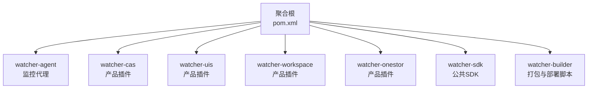
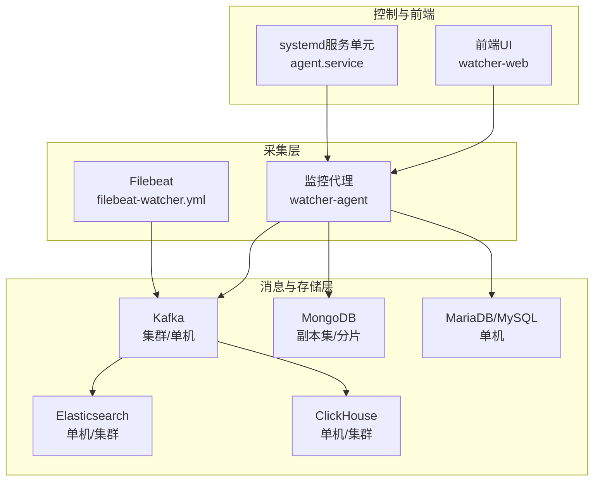
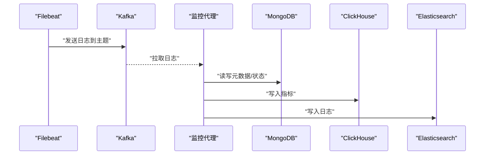
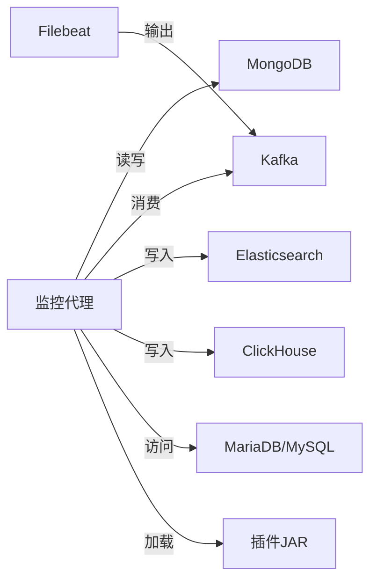
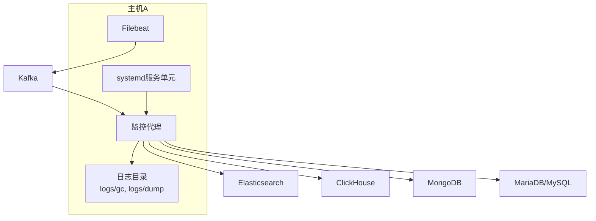
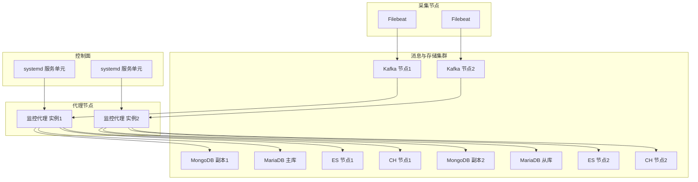

# 部署拓扑设计

<cite>
**本文引用的文件**
- [Readme.md](file://Readme.md)
- [pom.xml](file://pom.xml)
- [watcher-agent/src/main/resources/application.properties](file://watcher-agent/src/main/resources/application.properties)
- [watcher-agent/src/main/resources/application-prod.properties](file://watcher-agent/src/main/resources/application-prod.properties)
- [watcher-builder/pom.xml](file://watcher-builder/pom.xml)
- [watcher-builder/assembly/bin/startup.sh](file://watcher-builder/assembly/bin/startup.sh)
- [watcher-builder/assembly/bin/check.sh](file://watcher-builder/assembly/bin/check.sh)
- [watcher-builder/assembly/conf/agent.service](file://watcher-builder/assembly/conf/agent.service)
- [watcher-builder/assembly/components/filebeat/filebeat-8.0.1-linux-x86_64/filebeat-watcher.yml](file://watcher-builder/assembly/components/filebeat/filebeat-8.0.1-linux-x86_64/filebeat-watcher.yml)
</cite>

## 目录
1. [简介](#简介)
2. [项目结构](#项目结构)
3. [核心组件](#核心组件)
4. [架构总览](#架构总览)
5. [详细组件分析](#详细组件分析)
6. [依赖分析](#依赖分析)
7. [性能考虑](#性能考虑)
8. [故障排查指南](#故障排查指南)
9. [结论](#结论)
10. [附录](#附录)

## 简介
本设计文档面向ShowTime监控系统的运维与平台工程团队，提供从单节点到集群的完整部署拓扑方案，覆盖监控代理服务、数据库与消息队列等核心组件的部署位置与依赖关系，并给出高可用性设计（负载均衡、故障转移、容灾备份）、容器化部署（Docker镜像与Kubernetes编排）策略、部署拓扑图与网络架构图，以及性能优化与资源规划建议。

## 项目结构
ShowTime采用多模块聚合工程组织，核心模块包括监控代理（watcher-agent）、插件模块（watcher-cas、watcher-uis、watcher-workspace、watcher-onestor）、SDK与打包工具（watcher-sdk、watcher-builder）。下图展示模块间的聚合关系与职责边界：

图表来源
- [pom.xml:11-20](file://pom.xml#L11-L20)

章节来源
- [Readme.md:27-45](file://Readme.md#L27-L45)
- [pom.xml:11-20](file://pom.xml#L11-L20)

## 核心组件
- 监控代理（watcher-agent）
  - 职责：采集、资源管理、定时指标采集、日志收集策略下发、与MySQL/MariaDB交互。
  - 关键配置：开发环境默认关闭中间件与插件；生产环境启用MongoDB、Kafka、ES、ClickHouse等。
- 插件模块（watcher-cas、watcher-uis、watcher-workspace、watcher-onestor）
  - 职责：针对不同产品线的日志格式解析、指标采集与告警上报。
- 打包与部署（watcher-builder）
  - 职责：生成可部署归档（含bin/conf/lib/plugins），提供systemd服务单元与健康检查脚本。

章节来源
- [watcher-agent/src/main/resources/application.properties:14-29](file://watcher-agent/src/main/resources/application.properties#L14-L29)
- [watcher-agent/src/main/resources/application-prod.properties:3-70](file://watcher-agent/src/main/resources/application-prod.properties#L3-L70)
- [watcher-builder/pom.xml:15-212](file://watcher-builder/pom.xml#L15-L212)

## 架构总览
下图展示系统在单节点与集群两种模式下的部署拓扑与数据流：

图表来源
- [watcher-builder/assembly/components/filebeat/filebeat-watcher.yml:1-17](file://watcher-builder/assembly/components/filebeat/filebeat-watcher.yml#L1-L17)
- [watcher-agent/src/main/resources/application-prod.properties:3-70](file://watcher-agent/src/main/resources/application-prod.properties#L3-L70)
- [watcher-builder/assembly/conf/agent.service:1-14](file://watcher-builder/assembly/conf/agent.service#L1-L14)

## 详细组件分析

### 监控代理（watcher-agent）部署拓扑
- 单节点部署
  - 监控代理与Filebeat同机部署，Filebeat负责采集控制器日志并发送至Kafka；代理通过MongoDB存储元数据与状态，通过ClickHouse写入指标，通过Elasticsearch进行日志检索。
  - 启动参数与JVM调优：通过startup.sh设置堆大小与GC日志路径，支持外部传入配置文件与插件目录。
  - 健康检查：check.sh检测MongoDB与Agent进程，异常时自动重启。
- 集群部署
  - 监控代理以无状态方式横向扩展，结合Kafka分区与消费者组实现水平扩展；MongoDB使用副本集保障高可用；Elasticsearch与ClickHouse按需扩展分片与副本。
  - systemd服务单元用于统一管理生命周期与自启。

图表来源
- [watcher-builder/assembly/components/filebeat/filebeat-watcher.yml:14-17](file://watcher-builder/assembly/components/filebeat/filebeat-watcher.yml#L14-L17)
- [watcher-agent/src/main/resources/application-prod.properties:3-70](file://watcher-agent/src/main/resources/application-prod.properties#L3-L70)

章节来源
- [watcher-builder/assembly/bin/startup.sh:62-78](file://watcher-builder/assembly/bin/startup.sh#L62-L78)
- [watcher-builder/assembly/bin/check.sh:1-27](file://watcher-builder/assembly/bin/check.sh#L1-L27)
- [watcher-builder/assembly/conf/agent.service:1-14](file://watcher-builder/assembly/conf/agent.service#L1-L14)

### 数据库与消息队列部署策略
- MongoDB
  - 单机：适用于小规模场景；生产配置示例展示了副本集URI，便于后续升级。
  - 集群：副本集/分片，结合监控代理的自动索引创建能力提升可用性与性能。
- Kafka
  - 单机/集群：Filebeat输出主题指向Kafka集群；监控代理作为消费者消费日志事件。
- Elasticsearch
  - 单机/集群：生产配置包含集群名称、认证、超时与连接数限制，适配高并发场景。
- ClickHouse
  - 单机/集群：生产配置包含端点、用户、密码与数据库，适配大规模时序数据写入与查询。
- MariaDB/MySQL
  - 单机：监控代理使用MyBatis-Plus访问MariaDB，支持连接超时与驼峰映射。

章节来源
- [watcher-agent/src/main/resources/application-prod.properties:3-70](file://watcher-agent/src/main/resources/application-prod.properties#L3-L70)
- [watcher-agent/src/main/resources/application.properties:48-58](file://watcher-agent/src/main/resources/application.properties#L48-L58)

### 插件模块部署
- 插件以独立JAR形式随打包产物分发至plugins目录，监控代理通过-Dloader.path加载插件类路径。
- 插件模块包括CAS、UIS、Workspace、Onestor等，分别对接不同产品线的数据源与协议。

章节来源
- [watcher-builder/pom.xml:116-200](file://watcher-builder/pom.xml#L116-L200)

### 前端与控制面
- 前端（watcher-web）：Vue3应用，提供UI与后端API交互。
- 控制面（systemd服务单元）：通过agent.service定义服务生命周期，配合startup.sh与check.sh实现自启与健康检查。

章节来源
- [watcher-builder/assembly/conf/agent.service:1-14](file://watcher-builder/assembly/conf/agent.service#L1-L14)
- [watcher-builder/assembly/bin/startup.sh:78](file://watcher-builder/assembly/bin/startup.sh#L78)
- [watcher-builder/assembly/bin/check.sh:13-19](file://watcher-builder/assembly/bin/check.sh#L13-L19)

## 依赖分析
- 组件耦合
  - 监控代理对MongoDB、Kafka、Elasticsearch、ClickHouse存在直接依赖；对插件模块存在动态加载依赖。
  - 打包模块（watcher-builder）负责将各模块产物、配置与插件整合为可部署归档。
- 外部依赖
  - 中间件：MongoDB、Kafka、Elasticsearch、ClickHouse、MariaDB/MySQL。
  - 工具链：Filebeat、JDK 1.8+、systemd。

图表来源
- [watcher-agent/src/main/resources/application-prod.properties:3-70](file://watcher-agent/src/main/resources/application-prod.properties#L3-L70)
- [watcher-builder/pom.xml:116-200](file://watcher-builder/pom.xml#L116-L200)

章节来源
- [pom.xml:11-20](file://pom.xml#L11-L20)
- [watcher-builder/pom.xml:15-212](file://watcher-builder/pom.xml#L15-L212)

## 性能考虑
- JVM与GC
  - 建议在startup.sh中根据业务量调整-Xmx/-Xms与GC日志轮转参数，确保GC开销可控。
- 中间件
  - Kafka：合理设置分区数与消费者组，避免单点瓶颈；开启压缩与幂等以提升可靠性。
  - Elasticsearch：预热索引、合理设置分片与副本、禁用过度字段映射；控制并发连接数。
  - ClickHouse：使用列式存储与分区表，批量写入与合并策略优化。
  - MongoDB：副本集部署、读写分离、索引优化；启用自动索引创建但需定期审查。
  - MariaDB/MySQL：连接池配置、慢查询日志、只读副本与主从复制。
- 网络与IO
  - Filebeat与Kafka之间建议内网直连；磁盘IO优先SSD；日志落盘与GC日志分离目录。

## 故障排查指南
- 常见问题定位
  - Agent未启动：检查systemd服务状态与startup.sh输出日志；确认JDK版本与配置文件路径。
  - 中间件不可达：验证Kafka、ES、CH、MongoDB的连通性与认证配置。
  - 日志堆积：检查Filebeat输出目标与Kafka消费者拉取速率。
- 自愈机制
  - 使用check.sh检测MongoDB与Agent进程，异常时自动重启；建议结合systemd的Restart策略。
- 关键日志路径
  - GC日志与堆dump：startup.sh中定义的logs/gc与logs/dump目录。
  - 进程标志：startup.sh中通过进程标志位识别Agent进程。

章节来源
- [watcher-builder/assembly/bin/startup.sh:62-78](file://watcher-builder/assembly/bin/startup.sh#L62-L78)
- [watcher-builder/assembly/bin/check.sh:1-27](file://watcher-builder/assembly/bin/check.sh#L1-L27)

## 结论
本部署拓扑设计以“采集层—消息与存储层—控制与前端”三层架构为核心，兼顾单节点快速验证与集群高可用扩展。通过systemd服务单元、健康检查脚本与中间件副本/分片策略，实现稳定可靠的监控数据链路。建议在生产环境中优先采用副本集/分片与水平扩展方案，并结合性能优化与容量规划，持续迭代以满足业务增长需求。

## 附录

### 单节点部署拓扑图

图表来源
- [watcher-builder/assembly/bin/startup.sh:55-78](file://watcher-builder/assembly/bin/startup.sh#L55-L78)
- [watcher-builder/assembly/conf/agent.service:1-14](file://watcher-builder/assembly/conf/agent.service#L1-L14)
- [watcher-builder/assembly/components/filebeat/filebeat-watcher.yml:14-17](file://watcher-builder/assembly/components/filebeat/filebeat-watcher.yml#L14-L17)

### 集群部署拓扑图

图表来源
- [watcher-agent/src/main/resources/application-prod.properties:3-70](file://watcher-agent/src/main/resources/application-prod.properties#L3-L70)
- [watcher-builder/assembly/conf/agent.service:1-14](file://watcher-builder/assembly/conf/agent.service#L1-L14)

### 容器化部署方案（Docker/Kubernetes）
- Docker镜像构建
  - 基础镜像：基于OpenJDK 8镜像，安装必要系统工具。
  - 镜像内容：将watcher-builder产出的归档解压至/opt/watcher，挂载配置目录与日志目录。
  - 启动命令：执行startup.sh，设置spring.profiles.active与spring.config.location。
- Kubernetes编排
  - Deployment：无状态监控代理实例，副本数按流量扩展；使用ConfigMap挂载配置，使用PersistentVolume挂载日志目录。
  - Service：暴露Agent健康检查端点；为Kafka/ES/CH/MongoDB/DB提供ClusterIP或Headless服务。
  - Job/CronJob：Filebeat以DaemonSet部署，Kafka/ES/CH/MongoDB/DB使用StatefulSet。
  - HPA：基于CPU/内存或自定义指标对Agent进行水平扩容。
  - 健康检查：startup.sh与check.sh逻辑可迁移为liveness/readiness探针。
- 容灾与备份
  - 数据库：MariaDB/MySQL主从复制与定期快照；MongoDB副本集/分片。
  - 消息队列：Kafka多副本与ISR策略；Topic级别备份。
  - 存储：ES/CH分片与副本策略；定期快照与异地备份。

[本节为通用实践建议，不直接分析具体文件，故不附加章节来源]