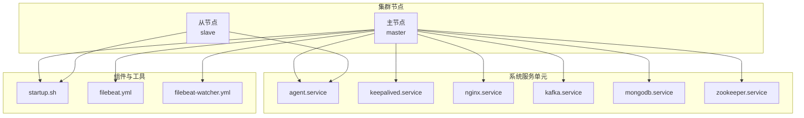
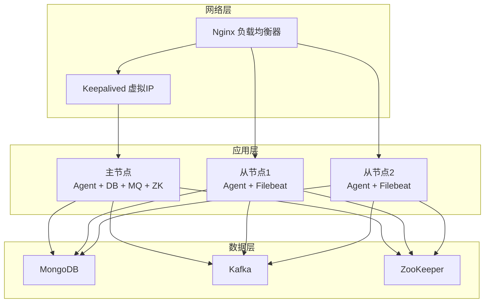
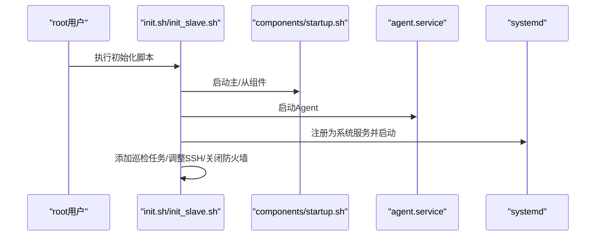
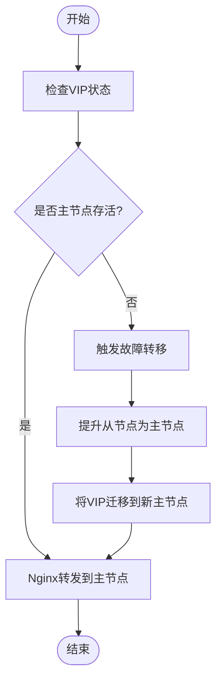
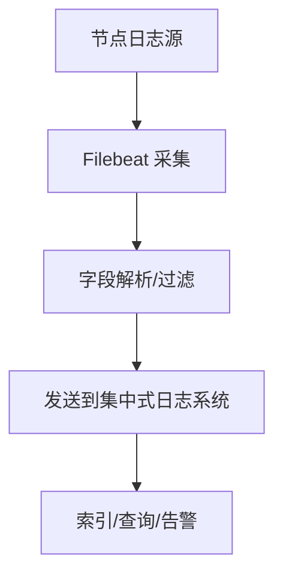
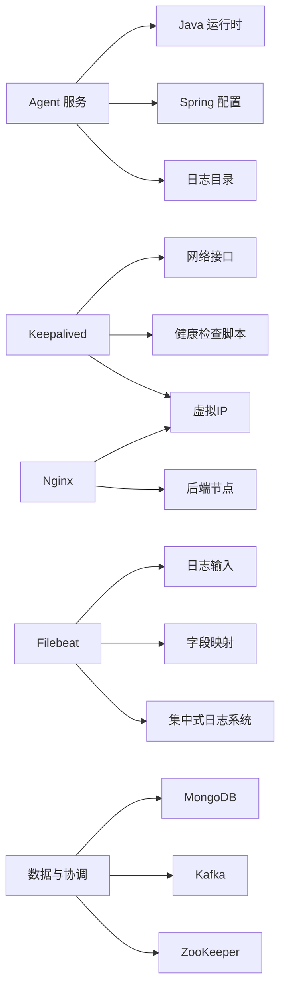

# 集群部署架构

<cite>
**本文引用的文件**
- [init.sh](file://watcher-builder/assembly/bin/init.sh)
- [init_slave.sh](file://watcher-builder/assembly/bin/init_slave.sh)
- [startup.sh](file://watcher-builder/assembly/bin/startup.sh)
- [shutdown.sh](file://watcher-builder/assembly/bin/shutdown.sh)
- [restart.sh](file://watcher-builder/assembly/bin/restart.sh)
- [agent.service](file://watcher-builder/assembly/conf/agent.service)
- [keepalived.service](file://watcher-builder/assembly/conf/keepalived.service)
- [nginx.service](file://watcher-builder/assembly/conf/nginx.service)
- [kafka.service](file://watcher-builder/assembly/conf/kafka.service)
- [mongodb.service](file://watcher-builder/assembly/conf/mongodb.service)
- [zookeeper.service](file://watcher-builder/assembly/conf/zookeeper.service)
- [filebeat.yml](file://watcher-builder/assembly/components/filebeat/filebeat-8.0.1-linux-x86_64/filebeat.yml)
- [filebeat-watcher.yml](file://watcher-builder/assembly/components/filebeat/filebeat-8.0.1-linux-x86_64/filebeat-watcher.yml)
</cite>

## 目录
1. [简介](#简介)
2. [项目结构](#项目结构)
3. [核心组件](#核心组件)
4. [架构总览](#架构总览)
5. [详细组件分析](#详细组件分析)
6. [依赖关系分析](#依赖关系分析)
7. [性能考量](#性能考量)
8. [故障排查指南](#故障排查指南)
9. [结论](#结论)
10. [附录](#附录)

## 简介
本文件面向ShowTime监控系统的集群部署与运维，聚焦于多节点集群的拓扑设计、主从节点角色分工、高可用与负载均衡、服务发现与故障转移、以及集群初始化、扩容与缩容操作指南。文档基于仓库中的部署装配与服务单元配置进行梳理，帮助读者快速理解并落地生产级集群。

## 项目结构
围绕集群部署的关键目录与文件如下：
- 初始化与启动脚本：bin/init.sh、bin/init_slave.sh、bin/startup.sh、bin/shutdown.sh、bin/restart.sh
- 系统服务单元：conf/*.service（agent、keepalived、nginx、kafka、mongodb、zookeeper）
- 日志采集组件：components/filebeat/filebeat-*.yml
- 组件启动入口：components/startup.sh（由初始化脚本调用）

**图表来源**
- [agent.service:1-14](file://watcher-builder/assembly/conf/agent.service#L1-L14)
- [keepalived.service:1-14](file://watcher-builder/assembly/conf/keepalived.service#L1-L14)
- [nginx.service:1-14](file://watcher-builder/assembly/conf/nginx.service#L1-L14)
- [kafka.service:1-14](file://watcher-builder/assembly/conf/kafka.service#L1-L14)
- [mongodb.service:1-14](file://watcher-builder/assembly/conf/mongodb.service#L1-L14)
- [zookeeper.service:1-14](file://watcher-builder/assembly/conf/zookeeper.service#L1-L14)
- [startup.sh:1-81](file://watcher-builder/assembly/bin/startup.sh#L1-L81)
- [filebeat.yml](file://watcher-builder/assembly/components/filebeat/filebeat-8.0.1-linux-x86_64/filebeat.yml)
- [filebeat-watcher.yml](file://watcher-builder/assembly/components/filebeat/filebeat-8.0.1-linux-x86_64/filebeat-watcher.yml)

**章节来源**
- [init.sh:1-35](file://watcher-builder/assembly/bin/init.sh#L1-L35)
- [init_slave.sh:1-30](file://watcher-builder/assembly/bin/init_slave.sh#L1-L30)
- [startup.sh:1-81](file://watcher-builder/assembly/bin/startup.sh#L1-L81)

## 核心组件
- 监控代理节点（Agent）：负责指标采集、任务调度与上报，通过 systemd 服务单元注册为系统服务，并在启动脚本中设置 JVM 参数与运行环境。
- 数据库节点（MongoDB）：提供持久化存储，支持主从或副本集模式，用于保存监控数据与状态。
- 消息队列节点（Kafka）：承载日志与事件流，实现解耦与削峰填谷。
- 服务发现与协调（ZooKeeper）：提供分布式协调能力，常用于 Kafka、Kafka Connect、Schema Registry 等组件的元数据管理。
- 负载均衡与高可用（Keepalived + Nginx）：通过虚拟IP与健康检查实现故障转移，Nginx作为反向代理分发请求。
- 日志采集（Filebeat）：采集节点侧日志并转发至集中式日志系统。

**章节来源**
- [agent.service:1-14](file://watcher-builder/assembly/conf/agent.service#L1-L14)
- [mongodb.service:1-14](file://watcher-builder/assembly/conf/mongodb.service#L1-L14)
- [kafka.service:1-14](file://watcher-builder/assembly/conf/kafka.service#L1-L14)
- [zookeeper.service:1-14](file://watcher-builder/assembly/conf/zookeeper.service#L1-L14)
- [keepalived.service:1-14](file://watcher-builder/assembly/conf/keepalived.service#L1-L14)
- [nginx.service:1-14](file://watcher-builder/assembly/conf/nginx.service#L1-L14)
- [filebeat.yml](file://watcher-builder/assembly/components/filebeat/filebeat-8.0.1-linux-x86_64/filebeat.yml)
- [filebeat-watcher.yml](file://watcher-builder/assembly/components/filebeat/filebeat-8.0.1-linux-x86_64/filebeat-watcher.yml)

## 架构总览
下图展示典型的三节点集群拓扑：一主两从，主节点同时承担代理、数据库、消息队列与协调服务；从节点仅运行代理与日志采集，通过 Keepalived 提供高可用入口，Nginx 实现流量分发与健康检查。

**图表来源**
- [keepalived.service:1-14](file://watcher-builder/assembly/conf/keepalived.service#L1-L14)
- [nginx.service:1-14](file://watcher-builder/assembly/conf/nginx.service#L1-L14)
- [agent.service:1-14](file://watcher-builder/assembly/conf/agent.service#L1-L14)
- [mongodb.service:1-14](file://watcher-builder/assembly/conf/mongodb.service#L1-L14)
- [kafka.service:1-14](file://watcher-builder/assembly/conf/kafka.service#L1-L14)
- [zookeeper.service:1-14](file://watcher-builder/assembly/conf/zookeeper.service#L1-L14)

## 详细组件分析

### 初始化与启动流程
- 主节点初始化：写入 watcher_home、复制安装目录、启动主节点组件、启动 Agent、注册为系统服务、添加定时巡检任务、调整 SSH 密钥算法、关闭防火墙。
- 从节点初始化：写入 watcher_home、启动从节点组件、启动 Agent、注册为系统服务、调整 SSH 密钥算法、关闭防火墙。
- Agent 启动：检测 Java 环境、解析运行根路径、准备日志目录、设置 JVM 内存与 GC 参数、以 prod 配置加载并启动。

**图表来源**
- [init.sh:1-35](file://watcher-builder/assembly/bin/init.sh#L1-L35)
- [init_slave.sh:1-30](file://watcher-builder/assembly/bin/init_slave.sh#L1-L30)
- [startup.sh:1-81](file://watcher-builder/assembly/bin/startup.sh#L1-L81)
- [agent.service:1-14](file://watcher-builder/assembly/conf/agent.service#L1-L14)

**章节来源**
- [init.sh:1-35](file://watcher-builder/assembly/bin/init.sh#L1-L35)
- [init_slave.sh:1-30](file://watcher-builder/assembly/bin/init_slave.sh#L1-L30)
- [startup.sh:1-81](file://watcher-builder/assembly/bin/startup.sh#L1-L81)
- [agent.service:1-14](file://watcher-builder/assembly/conf/agent.service#L1-L14)

### 高可用与故障转移（Keepalived + Nginx）
- Keepalived：通过 systemd 单元管理，启动/重启/停止由组件脚本驱动，实现虚拟IP漂移与健康检查。
- Nginx：作为反向代理与负载均衡器，结合后端节点健康状态进行流量分发；可与 Keepalived 的 VIP 结合，实现主备切换时的无感访问。

**图表来源**
- [keepalived.service:1-14](file://watcher-builder/assembly/conf/keepalived.service#L1-L14)
- [nginx.service:1-14](file://watcher-builder/assembly/conf/nginx.service#L1-L14)

**章节来源**
- [keepalived.service:1-14](file://watcher-builder/assembly/conf/keepalived.service#L1-L14)
- [nginx.service:1-14](file://watcher-builder/assembly/conf/nginx.service#L1-L14)

### 日志采集与转发（Filebeat）
- filebeat.yml：通用采集配置，定义输入、过滤与输出。
- filebeat-watcher.yml：针对监控系统的采集规则与字段映射，确保日志结构化与可检索。

**图表来源**
- [filebeat.yml](file://watcher-builder/assembly/components/filebeat/filebeat-8.0.1-linux-x86_64/filebeat.yml)
- [filebeat-watcher.yml](file://watcher-builder/assembly/components/filebeat/filebeat-8.0.1-linux-x86_64/filebeat-watcher.yml)

**章节来源**
- [filebeat.yml](file://watcher-builder/assembly/components/filebeat/filebeat-8.0.1-linux-x86_64/filebeat.yml)
- [filebeat-watcher.yml](file://watcher-builder/assembly/components/filebeat/filebeat-8.0.1-linux-x86_64/filebeat-watcher.yml)

### 服务发现与协调（ZooKeeper）
- ZooKeeper 作为分布式协调中心，为 Kafka 等组件提供元数据与领导者选举支持，保障集群一致性与可用性。

**章节来源**
- [zookeeper.service:1-14](file://watcher-builder/assembly/conf/zookeeper.service#L1-L14)

### 数据存储（MongoDB）
- MongoDB 提供监控数据的持久化存储，支持主从或副本集部署，满足高可用与读扩展需求。

**章节来源**
- [mongodb.service:1-14](file://watcher-builder/assembly/conf/mongodb.service#L1-L14)

### 消息队列（Kafka）
- Kafka 作为事件总线，承载日志与指标流，支持水平扩展与分区副本，配合 ZooKeeper 实现元数据管理。

**章节来源**
- [kafka.service:1-14](file://watcher-builder/assembly/conf/kafka.service#L1-L14)

## 依赖关系分析
- Agent 依赖：Java 运行时、Spring 配置、日志目录、JVM 参数；通过 systemd 管理生命周期。
- Keepalived 依赖：网络接口、健康检查脚本、VIP 管理；与 Nginx 协同实现高可用。
- Nginx 依赖：后端节点健康状态、上游服务配置；与 Keepalived 的 VIP 配合。
- Filebeat 依赖：日志输入路径、字段映射、目标输出；与集中式日志系统对接。
- 数据与协调：MongoDB、Kafka、ZooKeeper 形成数据与元数据协同，支撑监控数据链路。

**图表来源**
- [agent.service:1-14](file://watcher-builder/assembly/conf/agent.service#L1-L14)
- [keepalived.service:1-14](file://watcher-builder/assembly/conf/keepalived.service#L1-L14)
- [nginx.service:1-14](file://watcher-builder/assembly/conf/nginx.service#L1-L14)
- [filebeat.yml](file://watcher-builder/assembly/components/filebeat/filebeat-8.0.1-linux-x86_64/filebeat.yml)
- [filebeat-watcher.yml](file://watcher-builder/assembly/components/filebeat/filebeat-8.0.1-linux-x86_64/filebeat-watcher.yml)
- [mongodb.service:1-14](file://watcher-builder/assembly/conf/mongodb.service#L1-L14)
- [kafka.service:1-14](file://watcher-builder/assembly/conf/kafka.service#L1-L14)
- [zookeeper.service:1-14](file://watcher-builder/assembly/conf/zookeeper.service#L1-L14)

**章节来源**
- [agent.service:1-14](file://watcher-builder/assembly/conf/agent.service#L1-L14)
- [keepalived.service:1-14](file://watcher-builder/assembly/conf/keepalived.service#L1-L14)
- [nginx.service:1-14](file://watcher-builder/assembly/conf/nginx.service#L1-L14)
- [filebeat.yml](file://watcher-builder/assembly/components/filebeat/filebeat-8.0.1-linux-x86_64/filebeat.yml)
- [filebeat-watcher.yml](file://watcher-builder/assembly/components/filebeat/filebeat-8.0.1-linux-x86_64/filebeat-watcher.yml)
- [mongodb.service:1-14](file://watcher-builder/assembly/conf/mongodb.service#L1-L14)
- [kafka.service:1-14](file://watcher-builder/assembly/conf/kafka.service#L1-L14)
- [zookeeper.service:1-14](file://watcher-builder/assembly/conf/zookeeper.service#L1-L14)

## 性能考量
- JVM 参数：内存上限与 GC 日志轮转、堆转储路径需结合业务规模与硬件资源进行调优。
- 文件系统与磁盘：日志目录与堆转储路径所在磁盘应具备充足容量与吞吐能力。
- 网络与带宽：Nginx 与 Filebeat 的并发与缓冲需与网络带宽匹配，避免成为瓶颈。
- 数据库与消息队列：合理设置副本数与分区数，平衡写入延迟与查询性能。
- 定时巡检：初始化脚本中添加的巡检任务应避免对生产造成额外压力。

[本节为通用指导，无需列出具体文件来源]

## 故障排查指南
- Agent 启动失败
  - 检查 Java 版本与 JAVA_HOME 设置。
  - 查看错误输出与 GC 日志目录。
  - 确认 Spring 配置与 watcher.home 路径。
- 服务未注册为系统服务
  - 检查 agent.service 的 ExecStart/ExecReload/ExecStop 路径是否正确。
  - 使用 systemctl 状态查看与日志追踪。
- 高可用切换异常
  - 检查 Keepalived 健康检查脚本与 VIP 状态。
  - 核对 Nginx upstream 配置与后端节点可达性。
- 日志采集异常
  - 检查 filebeat 输入路径与字段映射。
  - 确认输出目标连通性与权限。
- 数据与协调问题
  - 检查 MongoDB、Kafka、ZooKeeper 的服务状态与日志。
  - 关注副本同步与分区 Leader 选举状态。

**章节来源**
- [startup.sh:1-81](file://watcher-builder/assembly/bin/startup.sh#L1-L81)
- [agent.service:1-14](file://watcher-builder/assembly/conf/agent.service#L1-L14)
- [keepalived.service:1-14](file://watcher-builder/assembly/conf/keepalived.service#L1-L14)
- [nginx.service:1-14](file://watcher-builder/assembly/conf/nginx.service#L1-L14)
- [filebeat.yml](file://watcher-builder/assembly/components/filebeat/filebeat-8.0.1-linux-x86_64/filebeat.yml)
- [filebeat-watcher.yml](file://watcher-builder/assembly/components/filebeat/filebeat-8.0.1-linux-x86_64/filebeat-watcher.yml)
- [mongodb.service:1-14](file://watcher-builder/assembly/conf/mongodb.service#L1-L14)
- [kafka.service:1-14](file://watcher-builder/assembly/conf/kafka.service#L1-L14)
- [zookeeper.service:1-14](file://watcher-builder/assembly/conf/zookeeper.service#L1-L14)

## 结论
通过将 Agent、数据库、消息队列、协调与日志采集组件以 systemd 服务单元统一管理，并结合 Keepalived 与 Nginx 实现高可用与负载均衡，ShowTime 监控系统可在多节点环境下实现稳定、可扩展与易运维的集群架构。建议在生产部署前完成资源评估、网络规划与安全加固，并制定标准化的初始化、巡检与故障处置流程。

[本节为总结性内容，无需列出具体文件来源]

## 附录

### 集群初始化脚本使用说明
- 主节点初始化
  - 执行初始化脚本，自动完成安装目录写入、组件启动、Agent 启动、系统服务注册、定时巡检任务添加、SSH 算法更新与防火墙关闭。
- 从节点初始化
  - 执行从节点初始化脚本，行为与主节点类似，但组件启动类型为从节点。

**章节来源**
- [init.sh:1-35](file://watcher-builder/assembly/bin/init.sh#L1-L35)
- [init_slave.sh:1-30](file://watcher-builder/assembly/bin/init_slave.sh#L1-L30)

### 配置参数说明（Agent 启动）
- Java 环境要求：版本校验与 JAVA_HOME。
- 运行根路径：解析软链接、定位 WATCHER_ROOT、WATCHER_LIBDIR、PLUGIN_DIR、CONF_DIR。
- 日志目录：自动创建 GC 与 Dump 目录。
- JVM 参数：内存上限、GC 日志轮转、堆转储路径、错误文件路径。
- 启动命令：以 prod 配置加载并启动 Agent。

**章节来源**
- [startup.sh:1-81](file://watcher-builder/assembly/bin/startup.sh#L1-L81)

### 扩容与缩容操作指南
- 扩容
  - 新增从节点：执行从节点初始化脚本，确保网络互通与服务注册成功。
  - 调整 Nginx 上游：将新节点加入后端池并启用健康检查。
  - 扩展数据库与消息队列：根据容量与性能评估增加副本或分区。
- 缩容
  - 下线从节点：先停止 Agent 与 Filebeat，再从 Nginx 上游移除。
  - 数据迁移：如涉及数据库或消息队列，按官方工具与流程迁移数据。
  - 清理：卸载服务单元与残留配置。

[本节为通用指导，无需列出具体文件来源]

### 集群监控与运维管理
- 定时巡检：初始化脚本已添加每分钟巡检任务，建议结合实际需求调整频率与检查项。
- 日志管理：统一使用 Filebeat 采集并集中化存储，建立索引与告警策略。
- 高可用监控：定期验证 Keepalived VIP 切换与 Nginx 健康检查。
- 数据备份：对 MongoDB、Kafka、ZooKeeper 建立定期备份与恢复演练。

**章节来源**
- [init.sh:22-23](file://watcher-builder/assembly/bin/init.sh#L22-L23)