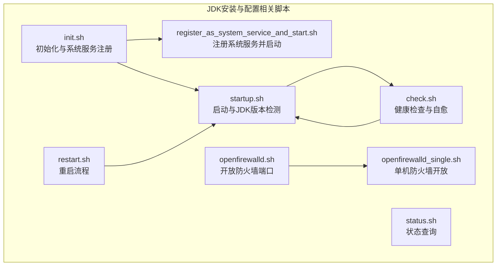
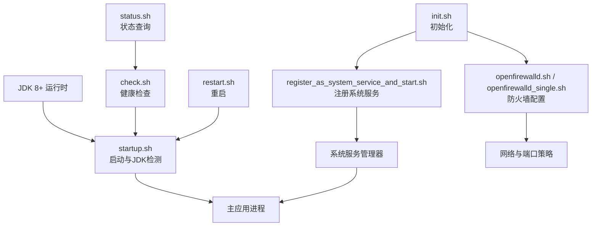
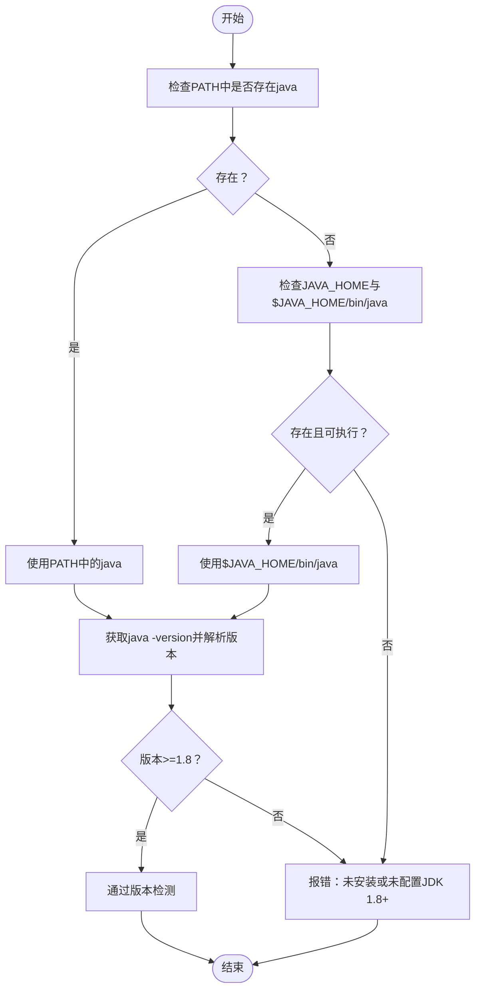
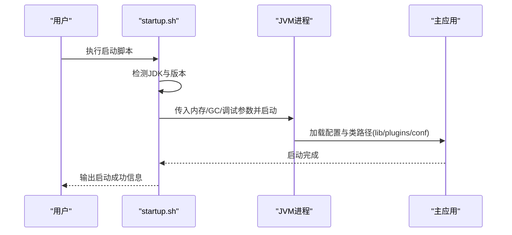
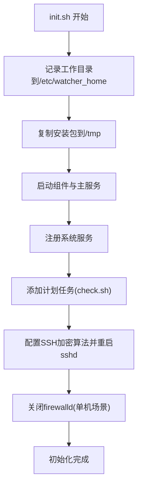
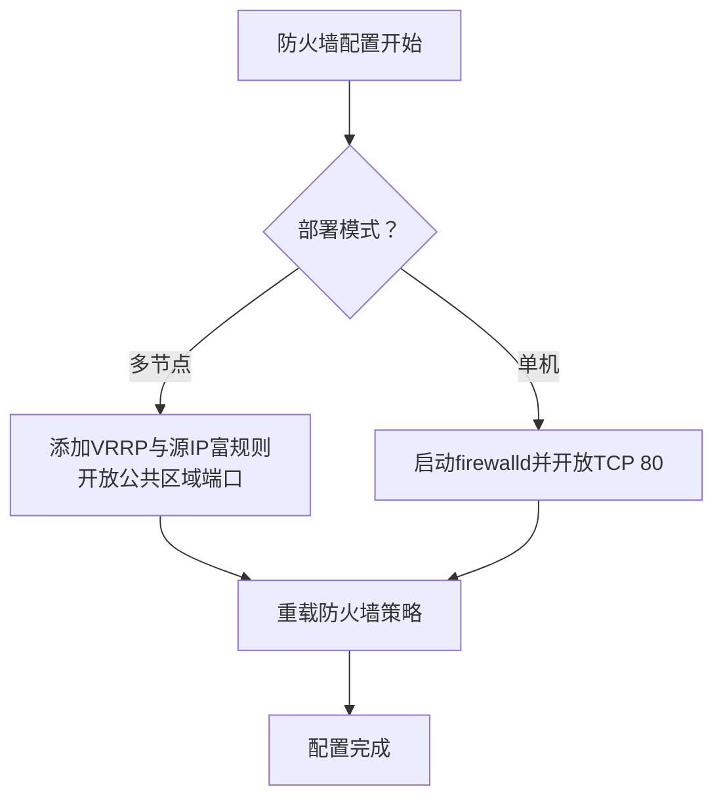
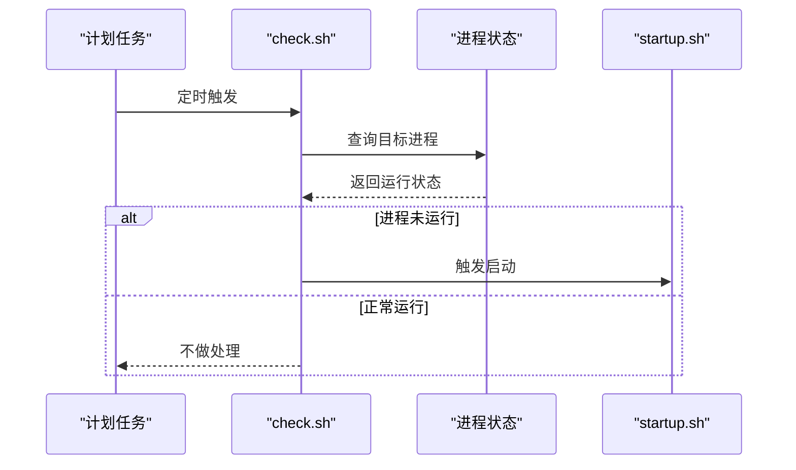
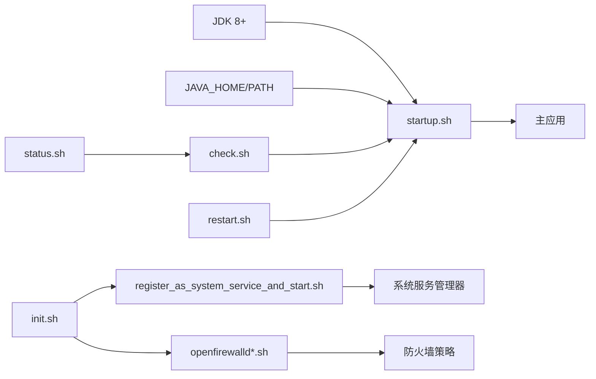

# JDK安装配置

<cite>
**本文引用的文件**
- [startup.sh](file://watcher-builder/assembly/bin/startup.sh)
- [init.sh](file://watcher-builder/assembly/bin/init.sh)
- [openfirewalld.sh](file://watcher-builder/assembly/bin/openfirewalld.sh)
- [openfirewalld_single.sh](file://watcher-builder/assembly/bin/openfirewalld_single.sh)
- [register_as_system_service_and_start.sh](file://watcher-builder/assembly/bin/register_as_system_service_and_start.sh)
- [check.sh](file://watcher-builder/assembly/bin/check.sh)
- [status.sh](file://watcher-builder/assembly/bin/status.sh)
- [restart.sh](file://watcher-builder/assembly/bin/restart.sh)
</cite>

## 目录
1. [简介](#简介)
2. [项目结构](#项目结构)
3. [核心组件](#核心组件)
4. [架构总览](#架构总览)
5. [详细组件分析](#详细组件分析)
6. [依赖关系分析](#依赖关系分析)
7. [性能考虑](#性能考虑)
8. [故障排查指南](#故障排查指南)
9. [结论](#结论)
10. [附录](#附录)

## 简介
本指南面向需要在Linux系统上安装与配置JDK 8及以上版本的用户，结合仓库中的启动与运维脚本，给出从下载安装到环境变量配置、版本兼容性校验、网络与防火墙策略、以及安装脚本使用与常见问题处理的完整流程。文中所有操作均以仓库内实际脚本为依据，并通过图示展示关键流程。

## 项目结构
本项目中与JDK安装配置直接相关的内容集中在构建装配模块的二进制脚本目录下，主要涉及以下脚本：
- 启动与检测：startup.sh、check.sh、status.sh、restart.sh
- 初始化与系统服务注册：init.sh、register_as_system_service_and_start.sh
- 防火墙与网络：openfirewalld.sh、openfirewalld_single.sh

**图表来源**
- [startup.sh:1-81](file://watcher-builder/assembly/bin/startup.sh#L1-L81)
- [init.sh:1-35](file://watcher-builder/assembly/bin/init.sh#L1-L35)
- [register_as_system_service_and_start.sh:1-45](file://watcher-builder/assembly/bin/register_as_system_service_and_start.sh#L1-L45)
- [openfirewalld.sh:1-21](file://watcher-builder/assembly/bin/openfirewalld.sh#L1-L21)
- [openfirewalld_single.sh:1-9](file://watcher-builder/assembly/bin/openfirewalwalld_single.sh#L1-L9)
- [check.sh:1-27](file://watcher-builder/assembly/bin/check.sh#L1-L27)
- [status.sh:1-10](file://watcher-builder/assembly/bin/status.sh#L1-L10)
- [restart.sh:1-9](file://watcher-builder/assembly/bin/restart.sh#L1-L9)

**章节来源**
- [startup.sh:1-81](file://watcher-builder/assembly/bin/startup.sh#L1-L81)
- [init.sh:1-35](file://watcher-builder/assembly/bin/init.sh#L1-L35)
- [register_as_system_service_and_start.sh:1-45](file://watcher-builder/assembly/bin/register_as_system_service_and_start.sh#L1-L45)
- [openfirewalld.sh:1-21](file://watcher-builder/assembly/bin/openfirewalld.sh#L1-L21)
- [openfirewalld_single.sh:1-9](file://watcher-builder/assembly/bin/openfirewalld_single.sh#L1-L9)
- [check.sh:1-27](file://watcher-builder/assembly/bin/check.sh#L1-L27)
- [status.sh:1-10](file://watcher-builder/assembly/bin/status.sh#L1-L10)
- [restart.sh:1-9](file://watcher-builder/assembly/bin/restart.sh#L1-L9)

## 核心组件
- 启动与JDK检测脚本：负责查找Java可执行文件、检测版本是否满足最低要求（1.8及以上），并启动主程序。
- 初始化脚本：完成工作目录初始化、复制、启动各组件与注册为系统服务，并进行基础网络与防火墙配置。
- 系统服务注册脚本：将多个组件的服务单元文件写入系统服务管理器并启动。
- 防火墙脚本：根据部署模式开放必要端口与协议，确保组件间通信。
- 健康检查与状态脚本：用于监控运行状态与自动修复。

**章节来源**
- [startup.sh:1-81](file://watcher-builder/assembly/bin/startup.sh#L1-L81)
- [init.sh:1-35](file://watcher-builder/assembly/bin/init.sh#L1-L35)
- [register_as_system_service_and_start.sh:1-45](file://watcher-builder/assembly/bin/register_as_system_service_and_start.sh#L1-L45)
- [openfirewalld.sh:1-21](file://watcher-builder/assembly/bin/openfirewalld.sh#L1-L21)
- [openfirewalld_single.sh:1-9](file://watcher-builder/assembly/bin/openfirewalld_single.sh#L1-L9)
- [check.sh:1-27](file://watcher-builder/assembly/bin/check.sh#L1-L27)
- [status.sh:1-10](file://watcher-builder/assembly/bin/status.sh#L1-L10)
- [restart.sh:1-9](file://watcher-builder/assembly/bin/restart.sh#L1-L9)

## 架构总览
下图展示了JDK安装配置与系统集成的关键交互：JDK作为运行时基础，被启动脚本检测并用于启动主应用；初始化脚本负责将组件注册为系统服务并通过防火墙脚本开放网络；健康检查脚本保障运行稳定性。

**图表来源**
- [startup.sh:1-81](file://watcher-builder/assembly/bin/startup.sh#L1-L81)
- [init.sh:1-35](file://watcher-builder/assembly/bin/init.sh#L1-L35)
- [register_as_system_service_and_start.sh:1-45](file://watcher-builder/assembly/bin/register_as_system_service_and_start.sh#L1-L45)
- [openfirewalld.sh:1-21](file://watcher-builder/assembly/bin/openfirewalld.sh#L1-L21)
- [openfirewalld_single.sh:1-9](file://watcher-builder/assembly/bin/openfirewalld_single.sh#L1-L9)
- [check.sh:1-27](file://watcher-builder/assembly/bin/check.sh#L1-L27)
- [status.sh:1-10](file://watcher-builder/assembly/bin/status.sh#L1-L10)
- [restart.sh:1-9](file://watcher-builder/assembly/bin/restart.sh#L1-L9)

## 详细组件分析

### 组件一：JDK安装与环境变量配置
- 下载与安装
  - 在Linux环境中安装JDK 8或更高版本，确保系统具备包管理器（如yum或apt）或可手动解压安装。
  - 安装完成后，建议将JDK目录加入系统PATH，以便全局调用java命令。
- 环境变量设置
  - JAVA_HOME：指向JDK安装根目录。
  - PATH：在PATH中追加$JAVA_HOME/bin，使java命令可在任意位置执行。
- 版本兼容性检查
  - 启动脚本会优先从PATH查找java，若未找到则尝试使用JAVA_HOME/bin/java。
  - 使用java -version输出解析版本号，要求不低于1.8（内部以数值比较实现）。
- 验证方法
  - 执行java -version确认版本。
  - 在启动脚本所在目录执行startup.sh，观察是否通过版本检测并成功启动。

**图表来源**
- [startup.sh:3-25](file://watcher-builder/assembly/bin/startup.sh#L3-L25)

**章节来源**
- [startup.sh:3-25](file://watcher-builder/assembly/bin/startup.sh#L3-L25)

### 组件二：启动与运行参数
- 启动流程
  - 启动脚本在完成JDK检测后，设置内存与GC相关参数，并通过nohup方式以后台模式启动主应用。
  - 启动时会读取多个配置目录（lib、plugins、conf），并将运行时参数传递给JVM。
- 关键点
  - 内存参数：默认堆大小为960MB。
  - GC日志与堆转储：开启GC日志轮转与OOM堆转储，便于问题定位。
  - 调试端口：启用JDWP调试端口，便于远程调试。

**图表来源**
- [startup.sh:60-78](file://watcher-builder/assembly/bin/startup.sh#L60-L78)

**章节来源**
- [startup.sh:60-78](file://watcher-builder/assembly/bin/startup.sh#L60-L78)

### 组件三：初始化与系统服务注册
- 初始化流程
  - 记录工作目录至系统配置文件，复制安装包，启动各组件与注册为系统服务。
  - 将健康检查脚本加入系统计划任务，周期性检查组件状态。
  - 配置SSH加密算法与重启sshd服务。
  - 关闭firewalld服务（单机场景或临时环境）。
- 系统服务注册
  - 将多个服务单元文件写入系统服务管理器并启动对应服务。

**图表来源**
- [init.sh:1-35](file://watcher-builder/assembly/bin/init.sh#L1-L35)
- [register_as_system_service_and_start.sh:1-45](file://watcher-builder/assembly/bin/register_as_system_service_and_start.sh#L1-L45)

**章节来源**
- [init.sh:1-35](file://watcher-builder/assembly/bin/init.sh#L1-L35)
- [register_as_system_service_and_start.sh:1-45](file://watcher-builder/assembly/bin/register_as_system_service_and_start.sh#L1-L45)

### 组件四：防火墙与网络访问权限
- 多节点部署
  - 启动VRRP组播规则与指定源IP的富规则，开放公共区域端口，重载防火墙策略。
- 单机部署
  - 启动firewalld并开放公共区域TCP 80端口，重载策略。
- 注意事项
  - 若需保留防火墙，请根据实际端口需求调整开放策略。
  - 如需启用SSH加固，可参考初始化脚本对SSH加密算法的配置。

**图表来源**
- [openfirewalld.sh:1-21](file://watcher-builder/assembly/bin/openfirewalld.sh#L1-L21)
- [openfirewalld_single.sh:1-9](file://watcher-builder/assembly/bin/openfirewalld_single.sh#L1-L9)

**章节来源**
- [openfirewalld.sh:1-21](file://watcher-builder/assembly/bin/openfirewalld.sh#L1-L21)
- [openfirewalld_single.sh:1-9](file://watcher-builder/assembly/bin/openfirewalld_single.sh#L1-L9)

### 组件五：健康检查与状态查询
- 健康检查
  - 检查目标进程是否在运行，若发现异常则尝试自动修复（例如重启主服务）。
- 状态查询
  - 提供简单状态输出，便于运维快速判断服务运行情况。
- 重启流程
  - 先停止再启动，保证变更生效。

**图表来源**
- [check.sh:1-27](file://watcher-builder/assembly/bin/check.sh#L1-L27)
- [status.sh:1-10](file://watcher-builder/assembly/bin/status.sh#L1-L10)
- [restart.sh:1-9](file://watcher-builder/assembly/bin/restart.sh#L1-L9)

**章节来源**
- [check.sh:1-27](file://watcher-builder/assembly/bin/check.sh#L1-L27)
- [status.sh:1-10](file://watcher-builder/assembly/bin/status.sh#L1-L10)
- [restart.sh:1-9](file://watcher-builder/assembly/bin/restart.sh#L1-L9)

## 依赖关系分析
- 启动脚本依赖JDK环境变量（JAVA_HOME或PATH中的java）与版本满足度。
- 初始化脚本依赖系统服务管理器与防火墙工具，用于注册服务与开放端口。
- 健康检查脚本依赖进程查询能力与启动脚本的自愈逻辑。
- 防火墙脚本依赖firewalld命令与系统策略配置。

**图表来源**
- [startup.sh:1-81](file://watcher-builder/assembly/bin/startup.sh#L1-L81)
- [init.sh:1-35](file://watcher-builder/assembly/bin/init.sh#L1-L35)
- [register_as_system_service_and_start.sh:1-45](file://watcher-builder/assembly/bin/register_as_system_service_and_start.sh#L1-L45)
- [openfirewalld.sh:1-21](file://watcher-builder/assembly/bin/openfirewalld.sh#L1-L21)
- [openfirewalld_single.sh:1-9](file://watcher-builder/assembly/bin/openfirewalld_single.sh#L1-L9)
- [check.sh:1-27](file://watcher-builder/assembly/bin/check.sh#L1-L27)
- [status.sh:1-10](file://watcher-builder/assembly/bin/status.sh#L1-L10)
- [restart.sh:1-9](file://watcher-builder/assembly/bin/restart.sh#L1-L9)

**章节来源**
- [startup.sh:1-81](file://watcher-builder/assembly/bin/startup.sh#L1-L81)
- [init.sh:1-35](file://watcher-builder/assembly/bin/init.sh#L1-L35)
- [register_as_system_service_and_start.sh:1-45](file://watcher-builder/assembly/bin/register_as_system_service_and_start.sh#L1-L45)
- [openfirewalld.sh:1-21](file://watcher-builder/assembly/bin/openfirewalld.sh#L1-L21)
- [openfirewalld_single.sh:1-9](file://watcher-builder/assembly/bin/openfirewalld_single.sh#L1-L9)
- [check.sh:1-27](file://watcher-builder/assembly/bin/check.sh#L1-L27)
- [status.sh:1-10](file://watcher-builder/assembly/bin/status.sh#L1-L10)
- [restart.sh:1-9](file://watcher-builder/assembly/bin/restart.sh#L1-L9)

## 性能考虑
- 内存与GC
  - 默认堆大小为960MB，适用于轻量级运行场景；如需承载更高负载，建议在启动脚本中调整内存参数。
  - 已开启GC日志轮转与OOM堆转储，便于问题定位与性能优化。
- 端口与网络
  - 防火墙仅开放必要端口，避免不必要的网络暴露；多节点部署时应按需放通VRRP与源IP规则。
- 自愈机制
  - 健康检查脚本定期探测进程状态，异常时自动重启，降低人工干预成本。

[本节为通用指导，无需列出具体文件来源]

## 故障排查指南
- JDK未安装或版本过低
  - 现象：启动脚本报错提示未安装或版本低于1.8。
  - 处理：安装JDK 8+，正确设置JAVA_HOME与PATH，并重新执行启动脚本。
- 启动失败但无明确错误
  - 现象：启动脚本返回成功但进程未运行。
  - 处理：查看错误输出文件位置，结合健康检查脚本与状态查询脚本定位问题。
- 防火墙导致通信异常
  - 现象：组件间无法通信或端口不可达。
  - 处理：根据部署模式执行对应的防火墙脚本，确保端口与协议已开放。
- SSH连接问题
  - 现象：远程连接不稳定或握手失败。
  - 处理：参考初始化脚本对SSH加密算法的配置，确保客户端与服务器一致。

**章节来源**
- [startup.sh:1-81](file://watcher-builder/assembly/bin/startup.sh#L1-L81)
- [check.sh:1-27](file://watcher-builder/assembly/bin/check.sh#L1-L27)
- [openfirewalld.sh:1-21](file://watcher-builder/assembly/bin/openfirewalld.sh#L1-L21)
- [openfirewalld_single.sh:1-9](file://watcher-builder/assembly/bin/openfirewalld_single.sh#L1-L9)
- [init.sh:1-35](file://watcher-builder/assembly/bin/init.sh#L1-L35)

## 结论
通过本指南，您可以在Linux环境下完成JDK 8+的安装与配置，并结合仓库中的启动、初始化、系统服务注册、防火墙与健康检查脚本，建立一套完整的运行时环境与运维体系。请根据实际部署模式选择合适的脚本与参数，并持续关注日志与健康检查结果以保障系统稳定运行。

[本节为总结性内容，无需列出具体文件来源]

## 附录
- 快速验证清单
  - 安装JDK 8+并设置JAVA_HOME与PATH。
  - 执行java -version确认版本满足要求。
  - 执行startup.sh验证启动流程。
  - 使用status.sh与check.sh确认运行状态。
  - 根据部署模式执行openfirewalld*.sh开放网络。
  - 使用restart.sh验证重启流程。

**章节来源**
- [startup.sh:1-81](file://watcher-builder/assembly/bin/startup.sh#L1-L81)
- [status.sh:1-10](file://watcher-builder/assembly/bin/status.sh#L1-L10)
- [check.sh:1-27](file://watcher-builder/assembly/bin/check.sh#L1-L27)
- [openfirewalld.sh:1-21](file://watcher-builder/assembly/bin/openfirewalld.sh#L1-L21)
- [openfirewalld_single.sh:1-9](file://watcher-builder/assembly/bin/openfirewalld_single.sh#L1-L9)
- [restart.sh:1-9](file://watcher-builder/assembly/bin/restart.sh#L1-L9)