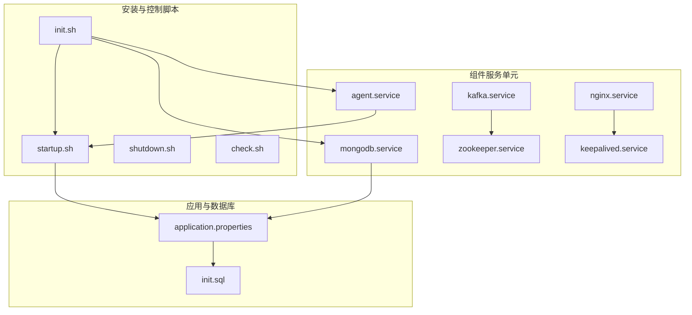
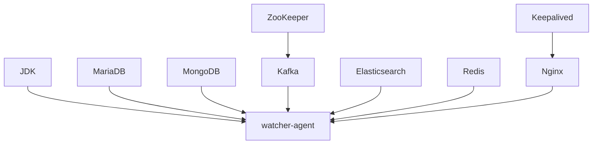
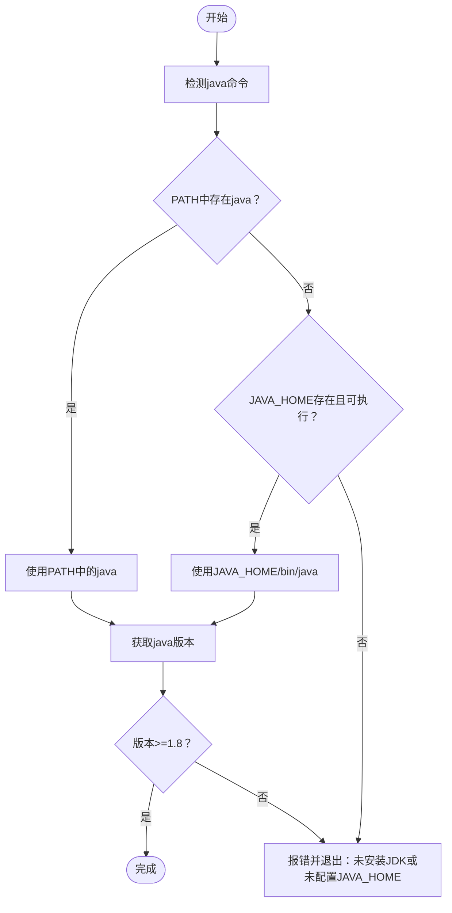
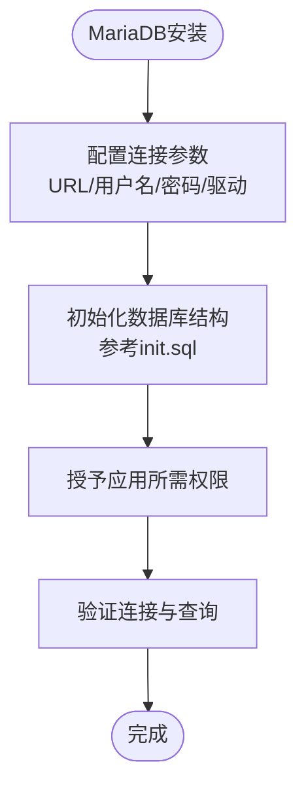
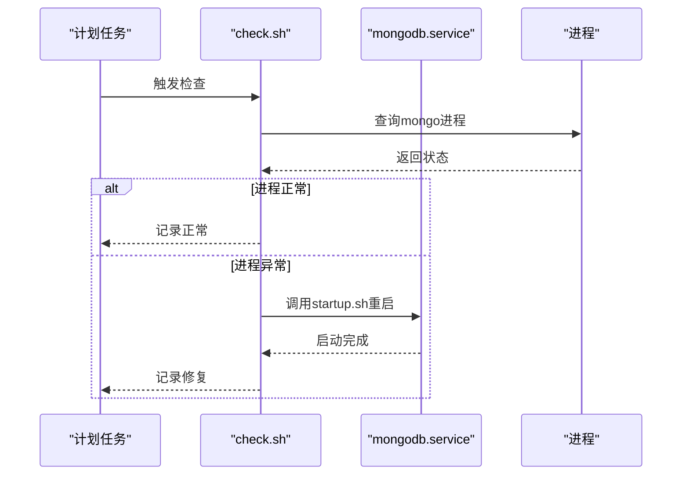
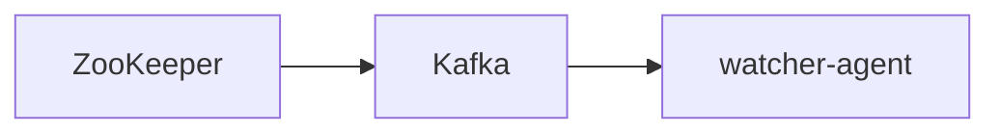
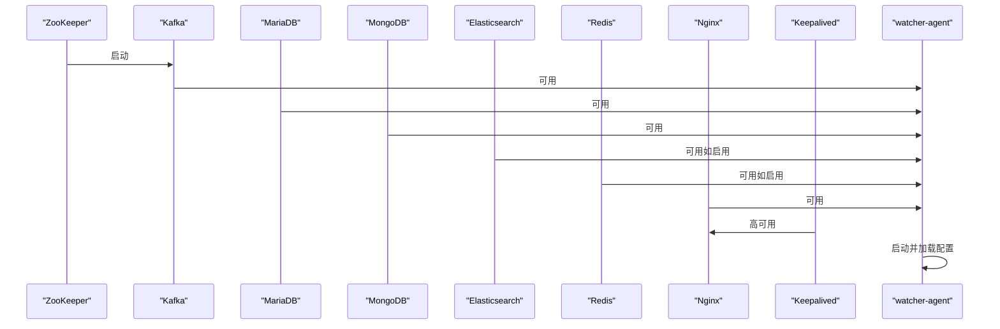

# 依赖安装

<cite>
**本文引用的文件**
- [startup.sh](file://watcher-builder/assembly/bin/startup.sh)
- [shutdown.sh](file://watcher-builder/assembly/bin/shutdown.sh)
- [init.sh](file://watcher-builder/assembly/bin/init.sh)
- [check.sh](file://watcher-builder/assembly/bin/check.sh)
- [application.properties](file://watcher-agent/src/main/resources/application.properties)
- [init.sql](file://watcher-agent/src/main/resources/database/init.sql)
- [agent.service](file://watcher-builder/assembly/conf/agent.service)
- [kafka.service](file://watcher-builder/assembly/conf/kafka.service)
- [mongodb.service](file://watcher-builder/assembly/conf/mongodb.service)
- [zookeeper.service](file://watcher-builder/assembly/conf/zookeeper.service)
- [nginx.service](file://watcher-builder/assembly/conf/nginx.service)
- [keepalived.service](file://watcher-builder/assembly/conf/keepalived.service)
</cite>

## 目录
1. [简介](#简介)
2. [项目结构](#项目结构)
3. [核心组件](#核心组件)
4. [架构总览](#架构总览)
5. [详细组件分析](#详细组件分析)
6. [依赖关系分析](#依赖关系分析)
7. [性能考虑](#性能考虑)
8. [故障排除指南](#故障排除指南)
9. [结论](#结论)
10. [附录](#附录)

## 简介
本指南面向ShowTime监控系统的运维与开发人员，提供依赖组件安装与配置的完整流程，涵盖以下内容：
- JDK安装与配置：版本要求、环境变量设置与验证方法
- 数据库：MySQL/MariaDB安装、初始化与权限配置
- 消息队列：Kafka安装与集群配置（含ZooKeeper依赖与网络配置）
- 搜索引擎：Elasticsearch安装与优化配置
- 缓存系统：Redis安装与持久化配置
- 启动顺序、健康检查与故障排除
- 一键安装脚本使用与自定义配置选项

本指南严格基于仓库中的安装脚本、服务单元与应用配置进行说明，确保可操作性与准确性。

## 项目结构
围绕依赖安装与运行，仓库中与之直接相关的关键位置如下：
- 安装与控制脚本位于 watcher-builder/assembly/bin
- 组件服务单元位于 watcher-builder/assembly/conf
- 应用配置位于 watcher-agent/src/main/resources
- 数据库初始化脚本位于 watcher-agent/src/main/resources/database

**图表来源**
- [init.sh:1-35](file://watcher-builder/assembly/bin/init.sh#L1-L35)
- [startup.sh:1-81](file://watcher-builder/assembly/bin/startup.sh#L1-L81)
- [shutdown.sh:1-26](file://watcher-builder/assembly/bin/shutdown.sh#L1-L26)
- [check.sh:1-27](file://watcher-builder/assembly/bin/check.sh#L1-L27)
- [agent.service:1-14](file://watcher-builder/assembly/conf/agent.service#L1-L14)
- [kafka.service:1-14](file://watcher-builder/assembly/conf/kafka.service#L1-L14)
- [mongodb.service:1-14](file://watcher-builder/assembly/conf/mongodb.service#L1-L14)
- [zookeeper.service:1-14](file://watcher-builder/assembly/conf/zookeeper.service#L1-L14)
- [nginx.service:1-14](file://watcher-builder/assembly/conf/nginx.service#L1-L14)
- [keepalived.service:1-14](file://watcher-builder/assembly/conf/keepalived.service#L1-L14)
- [application.properties:1-80](file://watcher-agent/src/main/resources/application.properties#L1-L80)
- [init.sql:1-12](file://watcher-agent/src/main/resources/database/init.sql#L1-L12)

**章节来源**
- [init.sh:1-35](file://watcher-builder/assembly/bin/init.sh#L1-L35)
- [startup.sh:1-81](file://watcher-builder/assembly/bin/startup.sh#L1-L81)
- [application.properties:1-80](file://watcher-agent/src/main/resources/application.properties#L1-L80)

## 核心组件
- JDK：用于运行watcher-agent；脚本会检测Java版本并要求不低于1.8
- MariaDB：作为主数据存储，应用配置中已给出连接参数
- MongoDB：通过服务单元管理，配合定时检查脚本实现自愈
- Kafka：消息队列组件，依赖ZooKeeper
- Elasticsearch：搜索引擎组件（在当前配置中默认关闭）
- Redis：缓存组件（在当前配置中未启用）
- Nginx + Keepalived：高可用前置与故障切换

**章节来源**
- [startup.sh:3-25](file://watcher-builder/assembly/bin/startup.sh#L3-L25)
- [application.properties:48-51](file://watcher-agent/src/main/resources/application.properties#L48-L51)
- [mongodb.service:1-14](file://watcher-builder/assembly/conf/mongodb.service#L1-L14)
- [kafka.service:1-14](file://watcher-builder/assembly/conf/kafka.service#L1-L14)
- [zookeeper.service:1-14](file://watcher-builder/assembly/conf/zookeeper.service#L1-L14)
- [nginx.service:1-14](file://watcher-builder/assembly/conf/nginx.service#L1-L14)
- [keepalived.service:1-14](file://watcher-builder/assembly/conf/keepalived.service#L1-L14)

## 架构总览
下图展示了依赖组件之间的关系与启动顺序建议：

**图表来源**
- [startup.sh:1-81](file://watcher-builder/assembly/bin/startup.sh#L1-L81)
- [application.properties:48-51](file://watcher-agent/src/main/resources/application.properties#L48-L51)
- [kafka.service:1-14](file://watcher-builder/assembly/conf/kafka.service#L1-L14)
- [zookeeper.service:1-14](file://watcher-builder/assembly/conf/zookeeper.service#L1-L14)
- [nginx.service:1-14](file://watcher-builder/assembly/conf/nginx.service#L1-L14)
- [keepalived.service:1-14](file://watcher-builder/assembly/conf/keepalived.service#L1-L14)

## 详细组件分析

### JDK安装与配置
- 版本要求：脚本检测到的最低版本为1.8
- 环境变量：优先使用PATH中的java，其次使用JAVA_HOME/bin/java
- 验证方法：通过startup.sh中的版本判断逻辑进行验证
- 建议：在生产环境中统一使用OpenJDK 8或11以获得长期支持

**图表来源**
- [startup.sh:3-25](file://watcher-builder/assembly/bin/startup.sh#L3-L25)

**章节来源**
- [startup.sh:3-25](file://watcher-builder/assembly/bin/startup.sh#L3-L25)

### 数据库（MariaDB）安装与初始化
- 连接参数：已在应用配置中给出MariaDB连接URL、用户名与驱动类
- 初始化：提供ClickHouse风格的建表语句，可用于初始化指标表
- 权限配置：需确保应用使用的用户具备对目标库的读写权限

**图表来源**
- [application.properties:48-51](file://watcher-agent/src/main/resources/application.properties#L48-L51)
- [init.sql:1-12](file://watcher-agent/src/main/resources/database/init.sql#L1-L12)

**章节来源**
- [application.properties:48-51](file://watcher-agent/src/main/resources/application.properties#L48-L51)
- [init.sql:1-12](file://watcher-agent/src/main/resources/database/init.sql#L1-L12)

### MongoDB安装与自愈
- 服务单元：通过mongodb.service管理
- 自愈机制：check.sh会定期检查进程状态，若异常则自动重启
- 建议：在生产中开启防火墙策略，仅开放必要端口

**图表来源**
- [check.sh:1-27](file://watcher-builder/assembly/bin/check.sh#L1-L27)
- [mongodb.service:1-14](file://watcher-builder/assembly/conf/mongodb.service#L1-L14)

**章节来源**
- [check.sh:1-27](file://watcher-builder/assembly/bin/check.sh#L1-L27)
- [mongodb.service:1-14](file://watcher-builder/assembly/conf/mongodb.service#L1-L14)

### Kafka安装与集群配置
- 依赖：Kafka依赖ZooKeeper，需先部署ZooKeeper
- 服务单元：通过kafka.service管理
- 网络配置：需确保Kafka与ZooKeeper之间网络连通，以及Kafka对外端口可访问

**图表来源**
- [kafka.service:1-14](file://watcher-builder/assembly/conf/kafka.service#L1-L14)
- [zookeeper.service:1-14](file://watcher-builder/assembly/conf/zookeeper.service#L1-L14)

**章节来源**
- [kafka.service:1-14](file://watcher-builder/assembly/conf/kafka.service#L1-L14)
- [zookeeper.service:1-14](file://watcher-builder/assembly/conf/zookeeper.service#L1-L14)

### Elasticsearch安装与优化配置
- 当前配置：在应用配置中默认关闭（elasticsearch.enable=false）
- 若启用：需准备节点与索引模板，调优JVM堆大小与线程池参数，确保磁盘IO与网络带宽满足需求

**章节来源**
- [application.properties](file://watcher-agent/src/main/resources/application.properties#L16)

### Redis安装与持久化配置
- 当前配置：在应用配置中未启用（redis未出现）
- 若启用：建议开启RDB/AOF持久化，设置合理的淘汰策略与内存上限，并开启备份与监控

**章节来源**
- [application.properties:1-80](file://watcher-agent/src/main/resources/application.properties#L1-L80)

### Nginx与Keepalived
- Nginx：通过nginx.service管理
- Keepalived：通过keepalived.service管理，与Nginx配合实现高可用

**图表来源**
- [nginx.service:1-14](file://watcher-builder/assembly/conf/nginx.service#L1-L14)
- [keepalived.service:1-14](file://watcher-builder/assembly/conf/keepalived.service#L1-L14)

**章节来源**
- [nginx.service:1-14](file://watcher-builder/assembly/conf/nginx.service#L1-L14)
- [keepalived.service:1-14](file://watcher-builder/assembly/conf/keepalived.service#L1-L14)

## 依赖关系分析
- 组件耦合
  - watcher-agent依赖JDK、MariaDB、MongoDB（当前配置中启用）
  - Kafka依赖ZooKeeper
  - Nginx与Keepalived共同保障前端高可用
- 启动顺序建议
  1) ZooKeeper
  2) Kafka
  3) MariaDB
  4) MongoDB
  5) Elasticsearch（如启用）
  6) Redis（如启用）
  7) Nginx + Keepalived
  8) watcher-agent

**图表来源**
- [startup.sh:1-81](file://watcher-builder/assembly/bin/startup.sh#L1-L81)
- [application.properties:48-51](file://watcher-agent/src/main/resources/application.properties#L48-L51)
- [kafka.service:1-14](file://watcher-builder/assembly/conf/kafka.service#L1-L14)
- [zookeeper.service:1-14](file://watcher-builder/assembly/conf/zookeeper.service#L1-L14)
- [nginx.service:1-14](file://watcher-builder/assembly/conf/nginx.service#L1-L14)
- [keepalived.service:1-14](file://watcher-builder/assembly/conf/keepalived.service#L1-L14)

**章节来源**
- [startup.sh:1-81](file://watcher-builder/assembly/bin/startup.sh#L1-L81)
- [application.properties:48-51](file://watcher-agent/src/main/resources/application.properties#L48-L51)

## 性能考虑
- JVM参数：startup.sh中设置了固定堆大小与GC日志轮转，建议根据实际负载调整-Xmx与GC策略
- 数据库：MariaDB应启用慢查询日志与连接池参数优化；MongoDB建议分片与副本集提升可用性
- 消息队列：Kafka需合理设置分区数与副本因子，ZooKeeper需独立部署并监控磁盘与网络
- 搜索引擎：Elasticsearch需平衡分片与副本，预热索引映射，限制批量写入速率
- 缓存：Redis建议开启持久化与备份，设置最大内存与淘汰策略

[本节为通用指导，无需特定文件来源]

## 故障排除指南
- JDK问题
  - 症状：启动时报未找到Java或版本过低
  - 处理：确认PATH或JAVA_HOME指向正确版本，重新执行startup.sh
- watcher-agent无法启动
  - 症状：服务单元未运行
  - 处理：查看agent.service日志，确认JDK与配置路径正确；使用register_as_system_service_and_start.sh注册并启动
- MongoDB异常
  - 症状：check.sh记录“MongoDB已关闭”
  - 处理：执行components/mongodb/startup.sh重启；检查端口与权限
- Kafka无法连接
  - 症状：Kafka启动失败或无法消费/生产
  - 处理：确认ZooKeeper可用；检查网络连通与端口；核对Kafka配置
- 健康检查与自愈
  - 使用check.sh进行周期性检查；必要时手动触发components/*/startup.sh

**章节来源**
- [startup.sh:1-81](file://watcher-builder/assembly/bin/startup.sh#L1-L81)
- [agent.service:1-14](file://watcher-builder/assembly/conf/agent.service#L1-L14)
- [check.sh:1-27](file://watcher-builder/assembly/bin/check.sh#L1-L27)

## 结论
本指南基于仓库中的安装脚本与服务单元，给出了ShowTime监控系统依赖组件的安装、配置与运维要点。建议按“ZooKeeper → Kafka → MariaDB → MongoDB → Elasticsearch/Redis → Nginx/Keepalived → watcher-agent”的顺序部署，并结合健康检查脚本实现自愈。生产环境请进一步完善安全策略、资源规划与监控告警。

[本节为总结，无需特定文件来源]

## 附录

### 一键安装脚本使用说明
- init.sh
  - 功能：初始化watcher_home、复制目录、依次启动MongoDB、agent与注册为系统服务；添加crontab健康检查；临时关闭防火墙并重启sshd
  - 使用：在目标主机上执行init.sh，随后可通过systemctl管理各服务单元
  - 注意：该脚本会向root的crontab追加任务，请评估安全与合规风险

**章节来源**
- [init.sh:1-35](file://watcher-builder/assembly/bin/init.sh#L1-L35)

### 自定义配置选项
- JDK
  - 修改JAVA_HOME或PATH指向期望版本
  - 如需调整JVM参数，可在startup.sh中修改JAVA_OPTS
- watcher-agent
  - 在application.properties中调整数据库连接、中间件开关与插件服务地址
- 组件服务单元
  - 在对应.service文件中修改ExecStart/ExecReload/ExecStop路径，确保与实际安装路径一致

**章节来源**
- [startup.sh:60-78](file://watcher-builder/assembly/bin/startup.sh#L60-L78)
- [application.properties:1-80](file://watcher-agent/src/main/resources/application.properties#L1-L80)
- [agent.service:1-14](file://watcher-builder/assembly/conf/agent.service#L1-L14)
- [kafka.service:1-14](file://watcher-builder/assembly/conf/kafka.service#L1-L14)
- [mongodb.service:1-14](file://watcher-builder/assembly/conf/mongodb.service#L1-L14)
- [zookeeper.service:1-14](file://watcher-builder/assembly/conf/zookeeper.service#L1-L14)
- [nginx.service:1-14](file://watcher-builder/assembly/conf/nginx.service#L1-L14)
- [keepalived.service:1-14](file://watcher-builder/assembly/conf/keepalived.service#L1-L14)