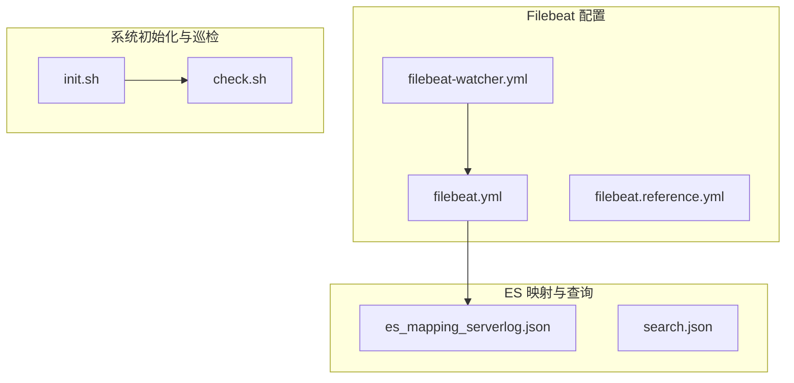
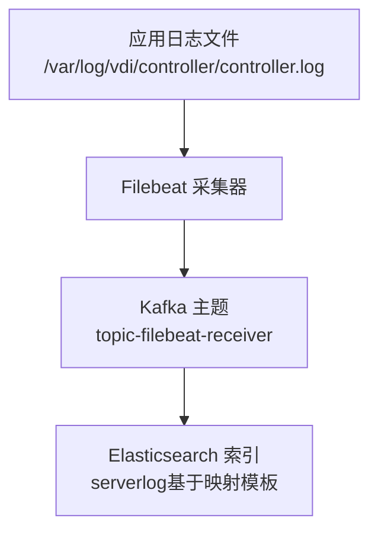

# 搜索引擎安装

<cite>
**本文引用的文件**
- [filebeat.yml](file://watcher-builder/assembly/components/filebeat/filebeat-8.0.1-linux-x86_64/filebeat.yml)
- [filebeat-watcher.yml](file://watcher-builder/assembly/components/filebeat/filebeat-8.0.1-linux-x86_64/filebeat-watcher.yml)
- [es_mapping_serverlog.json](file://watcher-agent/src/main/resources/es_mapping_serverlog.json)
- [search.json](file://watcher-agent/src/main/resources/search.json)
- [init.sh](file://watcher-builder/assembly/bin/init.sh)
- [check.sh](file://watcher-builder/assembly/bin/check.sh)
- [filebeat.reference.yml](file://watcher-builder/assembly/components/filebeat/filebeat-8.0.1-linux-x86_64/filebeat.reference.yml)
</cite>

## 目录
1. [简介](#简介)
2. [项目结构](#项目结构)
3. [核心组件](#核心组件)
4. [架构总览](#架构总览)
5. [详细组件分析](#详细组件分析)
6. [依赖关系分析](#依赖关系分析)
7. [性能考虑](#性能考虑)
8. [故障排查指南](#故障排查指南)
9. [结论](#结论)
10. [附录](#附录)

## 简介
本指南面向在该仓库中集成与部署搜索引擎（Elasticsearch）与日志采集（Filebeat）的工程实践，重点覆盖以下方面：
- Elasticsearch 的安装与基础配置要点
- 集群配置与索引模板、映射设置
- Filebeat 日志采集器的安装与配置（日志路径、过滤规则、输出）
- ES 索引模板与映射文件的使用方法
- 搜索引擎的性能调优与监控配置建议

说明：本仓库提供了 Filebeat 配置样例与 ES 映射模板，但未包含 Elasticsearch 的安装脚本或服务配置文件。因此，Elasticsearch 的安装与集群配置以通用实践与本仓库提供的配置为依据进行说明。

## 项目结构
围绕搜索引擎安装与配置的相关文件主要分布在以下位置：
- Filebeat 配置与参考文档：watcher-builder/assembly/components/filebeat/filebeat-8.0.1-linux-x86_64/
- ES 映射模板与搜索示例：watcher-agent/src/main/resources/

图表来源
- [filebeat.yml:1-231](file://watcher-builder/assembly/components/filebeat/filebeat-8.0.1-linux-x86_64/filebeat.yml#L1-L231)
- [filebeat-watcher.yml:1-17](file://watcher-builder/assembly/components/filebeat/filebeat-8.0.1-linux-x86_64/filebeat-watcher.yml#L1-L17)
- [filebeat.reference.yml:1-800](file://watcher-builder/assembly/components/filebeat/filebeat-8.0.1-linux-x86_64/filebeat.reference.yml#L1-L800)
- [es_mapping_serverlog.json:1-155](file://watcher-agent/src/main/resources/es_mapping_serverlog.json#L1-L155)
- [search.json:1-7](file://watcher-agent/src/main/resources/search.json#L1-L7)
- [init.sh:1-35](file://watcher-builder/assembly/bin/init.sh#L1-L35)
- [check.sh:1-27](file://watcher-builder/assembly/bin/check.sh#L1-L27)

章节来源
- [filebeat.yml:1-231](file://watcher-builder/assembly/components/filebeat/filebeat-8.0.1-linux-x86_64/filebeat.yml#L1-L231)
- [filebeat-watcher.yml:1-17](file://watcher-builder/assembly/components/filebeat/filebeat-8.0.1-linux-x86_64/filebeat-watcher.yml#L1-L17)
- [es_mapping_serverlog.json:1-155](file://watcher-agent/src/main/resources/es_mapping_serverlog.json#L1-L155)
- [search.json:1-7](file://watcher-agent/src/main/resources/search.json#L1-L7)
- [init.sh:1-35](file://watcher-builder/assembly/bin/init.sh#L1-L35)
- [check.sh:1-27](file://watcher-builder/assembly/bin/check.sh#L1-L27)

## 核心组件
- Filebeat：负责从指定日志路径采集数据，并通过 Kafka 输出到下游接收端。
- ES 映射模板：定义索引字段类型、分词器、别名与副本数等元数据，确保写入与查询一致性。
- 初始化与巡检脚本：用于系统初始化、注册为系统服务以及定时巡检组件运行状态。

章节来源
- [filebeat.yml:15-60](file://watcher-builder/assembly/components/filebeat/filebeat-8.0.1-linux-x86_64/filebeat.yml#L15-L60)
- [filebeat-watcher.yml:1-17](file://watcher-builder/assembly/components/filebeat/filebeat-8.0.1-linux-x86_64/filebeat-watcher.yml#L1-L17)
- [es_mapping_serverlog.json:1-155](file://watcher-agent/src/main/resources/es_mapping_serverlog.json#L1-L155)
- [init.sh:1-35](file://watcher-builder/assembly/bin/init.sh#L1-L35)
- [check.sh:1-27](file://watcher-builder/assembly/bin/check.sh#L1-L27)

## 架构总览
下图展示了从日志采集到搜索引擎的数据流路径，以及与映射模板的关系：

图表来源
- [filebeat-watcher.yml:5-6](file://watcher-builder/assembly/components/filebeat/filebeat-8.0.1-linux-x86_64/filebeat-watcher.yml#L5-L6)
- [filebeat-watcher.yml:14-16](file://watcher-builder/assembly/components/filebeat/filebeat-8.0.1-linux-x86_64/filebeat-watcher.yml#L14-L16)
- [es_mapping_serverlog.json:1-155](file://watcher-agent/src/main/resources/es_mapping_serverlog.json#L1-L155)

## 详细组件分析

### Filebeat 安装与配置
- 安装方式
  - 使用仓库提供的 Filebeat 发行包目录，包含配置样例与参考文档。
  - 参考路径：watcher-builder/assembly/components/filebeat/filebeat-8.0.1-linux-x86_64/
- 关键配置项
  - 输入源：启用日志输入，指定日志路径（如控制器日志路径），可按需扩展更多路径。
  - 模块：通过 modules.d 目录加载模块配置，支持动态重载开关。
  - 输出：默认提供 Kafka 输出配置，指向指定主机与主题；也可切换为直接输出至 Elasticsearch。
- 过滤规则
  - 支持 include_lines/exclude_lines 正则过滤（示例注释可见于参考配置）。
  - processors 中可添加主机元数据、云环境元数据等增强字段。
- 监控与日志
  - 可开启内部指标上报至监控集群，或调整日志级别与选择器定位问题。

章节来源
- [filebeat.yml:22-50](file://watcher-builder/assembly/components/filebeat/filebeat-8.0.1-linux-x86_64/filebeat.yml#L22-L50)
- [filebeat.yml:52-60](file://watcher-builder/assembly/components/filebeat/filebeat-8.0.1-linux-x86_64/filebeat.yml#L52-L60)
- [filebeat.yml:130-152](file://watcher-builder/assembly/components/filebeat/filebeat-8.0.1-linux-x86_64/filebeat.yml#L130-L152)
- [filebeat.reference.yml:1-800](file://watcher-builder/assembly/components/filebeat/filebeat-8.0.1-linux-x86_64/filebeat.reference.yml#L1-L800)

### Elasticsearch 安装与集群配置
- 安装方式
  - 本仓库未提供 Elasticsearch 的安装脚本或服务配置文件，请根据官方发行版进行安装。
- 基础配置要点
  - 节点角色与网络绑定：确保 discovery.seed_hosts 与 cluster.initial_master_nodes 正确配置，避免脑裂。
  - 内存与线程池：合理分配 heap size，避免超过物理内存 50%；禁用 mlockall 时注意 swappiness。
  - 索引生命周期：结合业务设定 ILM 策略，控制热温冷阶段与删除策略。
  - 安全与认证：启用 xpack.security 并配置用户密码或 API Key。
- 集群健康
  - 使用 _cluster/health 接口观察 yellow/red 状态，优先解决分片分配问题。
  - 监控磁盘水位、节点负载与线程池饱和度。

说明：本节为通用实践指导，具体参数请结合实际硬件与数据规模调整。

### ES 索引模板与映射设置
- 模板用途
  - 在写入前定义字段类型、分词器、别名与副本数，保证后续查询与聚合稳定性。
- 字段设计
  - 多字段类型：对需要精确匹配与全文检索的字段同时提供 text 与 keyword 子字段。
  - 分词器：中文文本采用 ik_max_word 提升中文分词效果。
  - 元数据：hostId/hostIp/hostName/level/time 等关键维度便于检索与聚合。
- 设置项
  - 副本与分片：根据数据量与查询并发设置合理的副本数与分片数。
  - 别名：通过 aliases 字段为索引建立稳定访问入口。

章节来源
- [es_mapping_serverlog.json:1-155](file://watcher-agent/src/main/resources/es_mapping_serverlog.json#L1-L155)

### 搜索请求示例
- 查询字段
  - 包含时间范围、关键词、排序方向与返回条数等典型字段。
- 使用场景
  - 结合前端或后端接口，将查询参数映射到 DSL 查询语句，实现高效检索。

章节来源
- [search.json:1-7](file://watcher-agent/src/main/resources/search.json#L1-L7)

### 性能调优与监控
- Filebeat 调优
  - 批大小与刷新间隔：平衡吞吐与延迟，避免过小批次导致网络放大。
  - 缓冲队列：使用 memory 或 publish 级别的队列模型，结合磁盘持久化降低断电丢失风险。
  - processors：仅保留必要处理器，减少解析开销。
- Elasticsearch 调优
  - 索引层：合并段、关闭不需要的字段、禁用_source（如适用）以节省空间。
  - 查询层：缓存频繁查询、限制深度聚合、使用字段数据缓存与查询缓存。
  - 节点层：合理分配主分片与副本，避免热点分片；启用延迟删除与批量操作优化。
- 监控
  - 使用内置监控输出或外部 APM/指标系统收集 Filebeat 与 ES 指标。
  - 关注 Filebeat 的队列长度、事件速率与错误计数；关注 ES 的文档数量、磁盘使用率、GC 时间与线程池拒绝数。

章节来源
- [filebeat.yml:163-231](file://watcher-builder/assembly/components/filebeat/filebeat-8.0.1-linux-x86_64/filebeat.yml#L163-L231)
- [filebeat.reference.yml:1-800](file://watcher-builder/assembly/components/filebeat/filebeat-8.0.1-linux-x86_64/filebeat.reference.yml#L1-L800)

## 依赖关系分析
- 组件耦合
  - Filebeat 依赖日志路径存在性与权限；输出目标（Kafka/ES）需可达且认证正确。
  - ES 映射模板影响写入与查询行为，变更需谨慎评估兼容性。
- 外部依赖
  - Kafka：作为中间缓冲与解耦输出通道。
  - Elasticsearch：作为最终存储与检索引擎。

图表来源
- [filebeat-watcher.yml:14-16](file://watcher-builder/assembly/components/filebeat/filebeat-8.0.1-linux-x86_64/filebeat-watcher.yml#L14-L16)
- [es_mapping_serverlog.json:1-155](file://watcher-agent/src/main/resources/es_mapping_serverlog.json#L1-L155)

## 性能考虑
- 合理规划分片与副本：避免过多小分片导致管理开销过大；副本数与节点数匹配，提升查询并发。
- 控制写入压力：批量写入、禁用自动刷新、合理设置 refresh_interval。
- 查询优化：避免深度聚合与高基数字段的组合；使用合适的字段类型与分词器。
- 监控告警：建立 CPU、内存、磁盘、网络与队列长度的阈值告警。

## 故障排查指南
- Filebeat 无法采集日志
  - 检查输入路径是否存在与权限是否足够。
  - 查看日志级别与选择器，定位具体模块或输入问题。
- 输出失败
  - 若使用 Kafka：确认主机与主题可用、网络连通与认证配置。
  - 若使用 ES：确认 hosts、认证与网络连通。
- 系统初始化与巡检
  - 初始化脚本会注册系统服务并添加定时巡检任务，若异常可查看日志文件定位问题。

章节来源
- [filebeat.yml:171-231](file://watcher-builder/assembly/components/filebeat/filebeat-8.0.1-linux-x86_64/filebeat.yml#L171-L231)
- [init.sh:1-35](file://watcher-builder/assembly/bin/init.sh#L1-L35)
- [check.sh:1-27](file://watcher-builder/assembly/bin/check.sh#L1-L27)

## 结论
本指南基于仓库中的 Filebeat 配置与 ES 映射模板，给出了搜索引擎安装与配置的实操步骤与最佳实践。建议在生产环境中结合业务规模与硬件资源，进一步细化集群拓扑、索引策略与监控体系，确保系统的稳定性与可维护性。

## 附录
- 快速对照清单
  - Filebeat：确认输入路径、过滤规则、输出目标与认证。
  - ES：准备映射模板、索引别名与副本分片策略。
  - 监控：启用 Filebeat 与 ES 指标上报，建立告警阈值。
  - 初始化：执行初始化脚本并验证巡检任务。