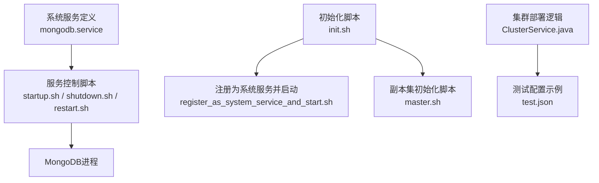
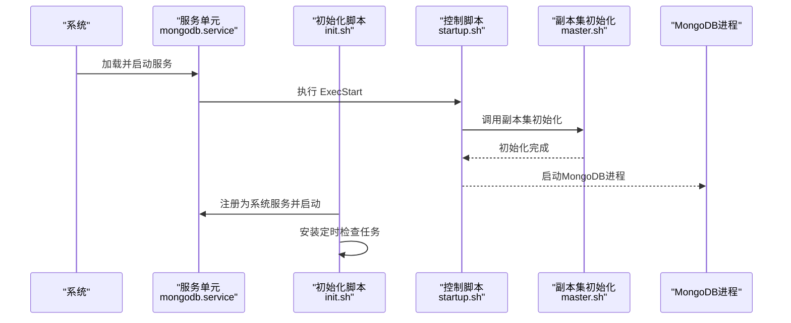
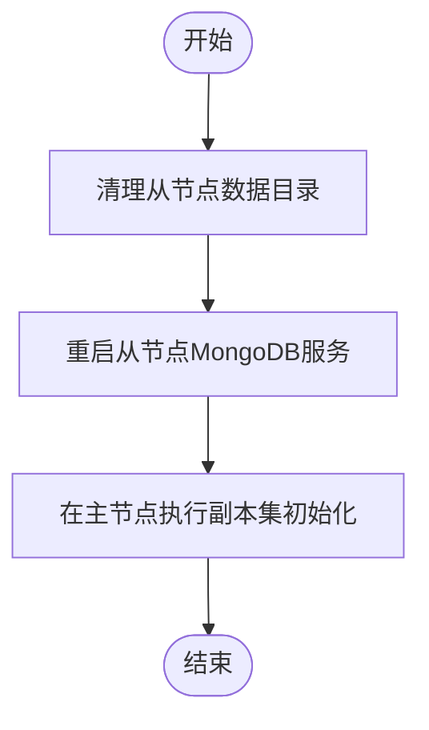
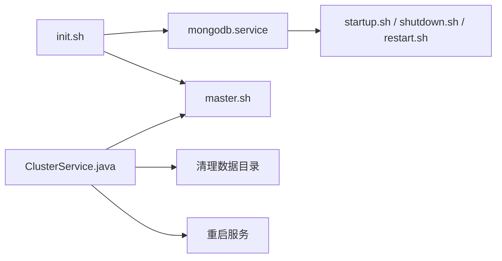

# MongoDB数据库安装

<cite>
**本文引用的文件**
- [mongodb.service](file://watcher-builder/assembly/conf/mongodb.service)
- [init.sh](file://watcher-builder/assembly/bin/init.sh)
- [startup.sh](file://watcher-builder/assembly/bin/startup.sh)
- [shutdown.sh](file://watcher-builder/assembly/bin/shutdown.sh)
- [restart.sh](file://watcher-builder/assembly/bin/restart.sh)
- [check.sh](file://watcher-builder/assembly/bin/check.sh)
- [master.sh](file://watcher-builder/assembly/components/mongodb/master.sh)
- [ClusterService.java](file://watcher-agent/src/main/java/com/virtual/cloud/om/agent/service/deploy/ClusterService.java)
- [test.json](file://watcher-agent/src/main/java/com/virtual/cloud/om/agent/service/deploy/test.json)
</cite>

## 目录
1. [简介](#简介)
2. [项目结构](#项目结构)
3. [核心组件](#核心组件)
4. [架构总览](#架构总览)
5. [详细组件分析](#详细组件分析)
6. [依赖关系分析](#依赖关系分析)
7. [性能考虑](#性能考虑)
8. [故障排除指南](#故障排除指南)
9. [结论](#结论)
10. [附录](#附录)

## 简介
本指南面向运维与开发人员，基于仓库中的MongoDB相关配置与脚本，提供一套可操作的MongoDB安装与配置流程，涵盖服务文件配置、启动选项、数据目录与权限、副本集初始化与成员配置、认证与安全、性能优化与监控，以及常见问题排查。文档严格依据仓库中已存在的文件进行说明，避免臆造信息。

## 项目结构
仓库中与MongoDB安装和配置直接相关的文件主要位于以下位置：
- systemd服务定义：conf/mongodb.service
- 初始化与注册脚本：bin/init.sh、bin/register_as_system_service_and_start.sh（由init.sh调用）
- 服务控制脚本：bin/startup.sh、shutdown.sh、restart.sh、check.sh
- 副本集初始化脚本：components/mongodb/master.sh
- 集群部署逻辑：watcher-agent模块中的ClusterService.java与测试配置test.json

**图表来源**
- [mongodb.service:1-14](file://watcher-builder/assembly/conf/mongodb.service#L1-L14)
- [init.sh:17-20](file://watcher-builder/assembly/bin/init.sh#L17-L20)
- [startup.sh](file://watcher-builder/assembly/bin/startup.sh)
- [shutdown.sh](file://watcher-builder/assembly/bin/shutdown.sh)
- [restart.sh](file://watcher-builder/assembly/bin/restart.sh)
- [master.sh](file://watcher-builder/assembly/components/mongodb/master.sh)
- [ClusterService.java:310-317](file://watcher-agent/src/main/java/com/virtual/cloud/om/agent/service/deploy/ClusterService.java#L310-L317)
- [test.json:1-24](file://watcher-agent/src/main/java/com/virtual/cloud/om/agent/service/deploy/test.json#L1-L24)

**章节来源**
- [mongodb.service:1-14](file://watcher-builder/assembly/conf/mongodb.service#L1-L14)
- [init.sh:1-35](file://watcher-builder/assembly/bin/init.sh#L1-L35)

## 核心组件
- systemd服务单元：定义MongoDB服务的描述、依赖、执行命令与生命周期管理。
- 初始化脚本：完成环境初始化、复制组件、注册系统服务并开启自检任务。
- 服务控制脚本：封装启动、停止、重启与状态检查的统一入口。
- 副本集初始化脚本：负责副本集的初始化与成员配置。
- 集群部署逻辑：通过SSH在多节点上清理数据、重启服务并触发副本集初始化。

**章节来源**
- [mongodb.service:1-14](file://watcher-builder/assembly/conf/mongodb.service#L1-L14)
- [init.sh:17-20](file://watcher-builder/assembly/bin/init.sh#L17-L20)
- [ClusterService.java:310-317](file://watcher-agent/src/main/java/com/virtual/cloud/om/agent/service/deploy/ClusterService.java#L310-L317)

## 架构总览
下图展示了MongoDB服务在系统中的运行时关系：systemd加载服务单元，调用启动脚本；启动脚本进一步执行副本集初始化脚本；初始化完成后，MongoDB进程运行；同时，系统会注册定时检查任务以保障服务可用性。

**图表来源**
- [mongodb.service:5-10](file://watcher-builder/assembly/conf/mongodb.service#L5-L10)
- [init.sh:17-23](file://watcher-builder/assembly/bin/init.sh#L17-L23)
- [startup.sh](file://watcher-builder/assembly/bin/startup.sh)
- [master.sh](file://watcher-builder/assembly/components/mongodb/master.sh)

## 详细组件分析

### systemd服务单元（mongodb.service）
- 单元描述：服务名称与依赖目标。
- 执行命令：
  - 启动：调用组件目录下的startup.sh。
  - 重载：调用组件目录下的restart.sh。
  - 停止：调用组件目录下的shutdown.sh。
- 生命周期：保持退出后仍视为活跃，便于外部控制。

建议关注点
- ExecStart/ExecReload/ExecStop路径需与实际组件目录一致。
- WATCHER_HOME变量在脚本中应正确解析，否则会导致命令找不到。

**章节来源**
- [mongodb.service:1-14](file://watcher-builder/assembly/conf/mongodb.service#L1-L14)

### 初始化脚本（init.sh）
- 主要职责
  - 写入watcher_home到系统配置文件。
  - 复制组件目录至目标位置。
  - 调用组件启动脚本与MongoDB主节点初始化脚本。
  - 注册系统服务并启动。
  - 安装定时检查任务（每分钟执行）。
  - 调整SSH算法与防火墙策略（用于部署场景）。

注意
- 该脚本在首次初始化时执行，后续重复执行会被跳过。
- 定时任务写入了root用户的crontab，需确保权限与环境变量可用。

**章节来源**
- [init.sh:1-35](file://watcher-builder/assembly/bin/init.sh#L1-L35)

### 服务控制脚本（startup.sh / shutdown.sh / restart.sh / check.sh）
- startup.sh：统一的启动入口，供服务单元与手动运维使用。
- shutdown.sh：统一的停止入口。
- restart.sh：统一的重启入口。
- check.sh：健康检查脚本，用于crontab定期执行，保障服务可用性。

最佳实践
- 在生产环境中，建议将这些脚本的输出重定向到日志文件，便于排障。
- 检查脚本应包含对MongoDB进程状态、端口监听、副本集健康等关键指标的验证。

**章节来源**
- [startup.sh](file://watcher-builder/assembly/bin/startup.sh)
- [shutdown.sh](file://watcher-builder/assembly/bin/shutdown.sh)
- [restart.sh](file://watcher-builder/assembly/bin/restart.sh)
- [check.sh](file://watcher-builder/assembly/bin/check.sh)

### 副本集初始化脚本（master.sh）
- 作用：在主节点上执行副本集初始化与成员配置。
- 使用场景：配合init.sh与ClusterService.java，在部署阶段自动完成副本集搭建。

注意事项
- 该脚本需要在主节点上具备可执行权限且能访问MongoDB可执行程序。
- 初始化前应确保网络连通性与防火墙策略允许内部通信。

**章节来源**
- [master.sh](file://watcher-builder/assembly/components/mongodb/master.sh)

### 集群部署逻辑（ClusterService.java）
- 清理从节点数据：删除从节点上的MongoDB数据目录内容。
- 重启从节点服务：确保从节点处于干净状态并重新启动。
- 触发副本集初始化：在主节点上执行初始化脚本。

**图表来源**
- [ClusterService.java:310-317](file://watcher-agent/src/main/java/com/virtual/cloud/om/agent/service/deploy/ClusterService.java#L310-L317)

**章节来源**
- [ClusterService.java:310-317](file://watcher-agent/src/main/java/com/virtual/cloud/om/agent/service/deploy/ClusterService.java#L310-L317)

### 测试配置示例（test.json）
- 描述：包含主从节点IP、用户名、密码及VIP等信息的示例配置。
- 用途：用于演示集群部署时的节点列表与网络参数。

**章节来源**
- [test.json:1-24](file://watcher-agent/src/main/java/com/virtual/cloud/om/agent/service/deploy/test.json#L1-L24)

## 依赖关系分析
- 服务单元依赖于控制脚本与副本集初始化脚本。
- 初始化脚本依赖于组件目录的完整复制与系统服务注册。
- 集群部署逻辑依赖于SSH工具与组件目录结构的一致性。

**图表来源**
- [mongodb.service:5-10](file://watcher-builder/assembly/conf/mongodb.service#L5-L10)
- [init.sh:17-20](file://watcher-builder/assembly/bin/init.sh#L17-L20)
- [startup.sh](file://watcher-builder/assembly/bin/startup.sh)
- [shutdown.sh](file://watcher-builder/assembly/bin/shutdown.sh)
- [restart.sh](file://watcher-builder/assembly/bin/restart.sh)
- [master.sh](file://watcher-builder/assembly/components/mongodb/master.sh)
- [ClusterService.java:310-317](file://watcher-agent/src/main/java/com/virtual/cloud/om/agent/service/deploy/ClusterService.java#L310-L317)

**章节来源**
- [mongodb.service:1-14](file://watcher-builder/assembly/conf/mongodb.service#L1-L14)
- [init.sh:1-35](file://watcher-builder/assembly/bin/init.sh#L1-L35)
- [ClusterService.java:310-317](file://watcher-agent/src/main/java/com/virtual/cloud/om/agent/service/deploy/ClusterService.java#L310-L317)

## 性能考虑
- 进程与资源：通过systemd管理进程生命周期，结合check.sh实现健康检查，有助于及时发现异常并恢复。
- 网络与通信：副本集初始化与成员配置依赖稳定的网络连接，建议在部署前验证节点间连通性与防火墙策略。
- 日志与监控：建议将控制脚本输出重定向到日志文件，并结合系统监控工具观察MongoDB进程状态与资源占用。

[本节为通用指导，不直接分析具体文件]

## 故障排除指南
- 服务无法启动
  - 检查服务单元中的ExecStart/ExecReload/ExecStop路径是否正确解析。
  - 查看控制脚本是否存在执行权限与正确的环境变量。
  - 参考：[mongodb.service:7-9](file://watcher-builder/assembly/conf/mongodb.service#L7-L9)
- 副本集初始化失败
  - 确认主节点初始化脚本可执行且MongoDB可执行程序可用。
  - 检查节点间网络连通性与防火墙策略。
  - 参考：[master.sh](file://watcher-builder/assembly/components/mongodb/master.sh)
- 从节点未同步
  - 使用集群部署逻辑清理从节点数据并重启服务，再触发主节点初始化。
  - 参考：[ClusterService.java:310-317](file://watcher-agent/src/main/java/com/virtual/cloud/om/agent/service/deploy/ClusterService.java#L310-L317)
- 定时检查未生效
  - 确认init.sh已成功向root用户crontab写入任务。
  - 参考：[init.sh:22-23](file://watcher-builder/assembly/bin/init.sh#L22-L23)
- 环境变量问题
  - 确保WATCHER_HOME在脚本中被正确解析，否则ExecStart等命令会找不到路径。
  - 参考：[mongodb.service:7-9](file://watcher-builder/assembly/conf/mongodb.service#L7-L9)

**章节来源**
- [mongodb.service:7-9](file://watcher-builder/assembly/conf/mongodb.service#L7-L9)
- [init.sh:22-23](file://watcher-builder/assembly/bin/init.sh#L22-L23)
- [ClusterService.java:310-317](file://watcher-agent/src/main/java/com/virtual/cloud/om/agent/service/deploy/ClusterService.java#L310-L317)

## 结论
本指南基于仓库中的服务单元与脚本，给出了MongoDB安装与配置的可执行路径：通过systemd服务单元加载控制脚本，借助初始化脚本完成组件复制与服务注册，再由副本集初始化脚本完成主从配置。结合集群部署逻辑与健康检查机制，可在自动化部署场景中稳定运行MongoDB副本集。建议在生产环境中补充日志与监控，并完善网络与权限策略以满足安全与性能要求。

[本节为总结性内容，不直接分析具体文件]

## 附录
- 关键文件清单
  - 服务单元：[mongodb.service](file://watcher-builder/assembly/conf/mongodb.service)
  - 初始化脚本：[init.sh](file://watcher-builder/assembly/bin/init.sh)
  - 控制脚本：[startup.sh](file://watcher-builder/assembly/bin/startup.sh)、[shutdown.sh](file://watcher-builder/assembly/bin/shutdown.sh)、[restart.sh](file://watcher-builder/assembly/bin/restart.sh)、[check.sh](file://watcher-builder/assembly/bin/check.sh)
  - 副本集初始化：[master.sh](file://watcher-builder/assembly/components/mongodb/master.sh)
  - 集群部署逻辑：[ClusterService.java](file://watcher-agent/src/main/java/com/virtual/cloud/om/agent/service/deploy/ClusterService.java)
  - 测试配置示例：[test.json](file://watcher-agent/src/main/java/com/virtual/cloud/om/agent/service/deploy/test.json)

[本节为参考清单，不直接分析具体文件]