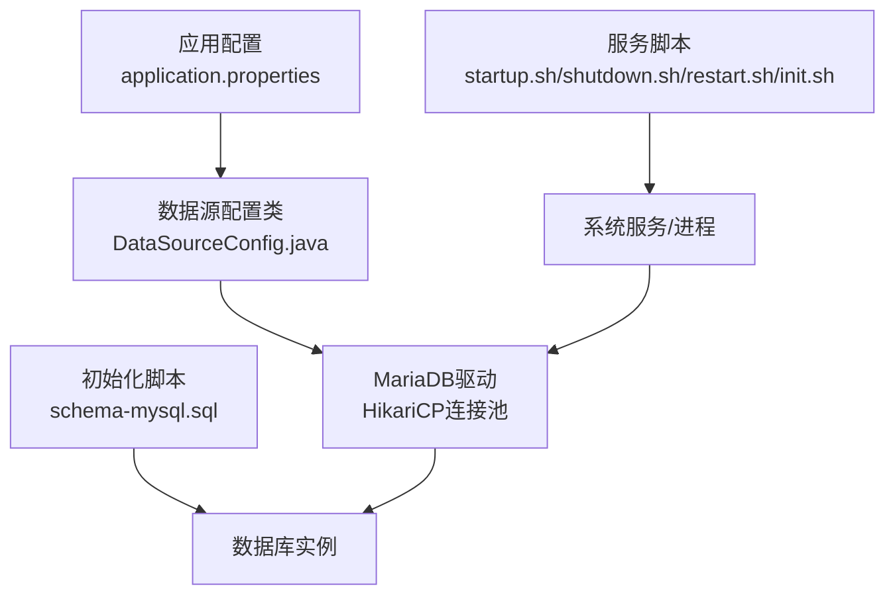
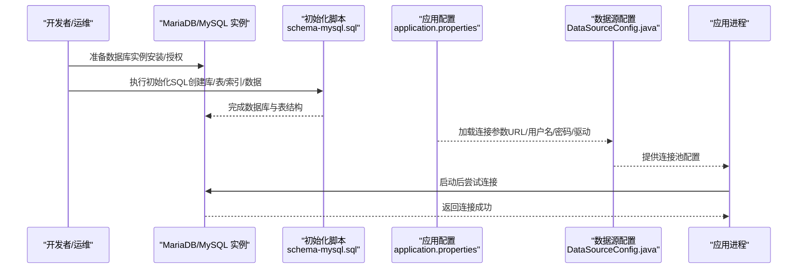
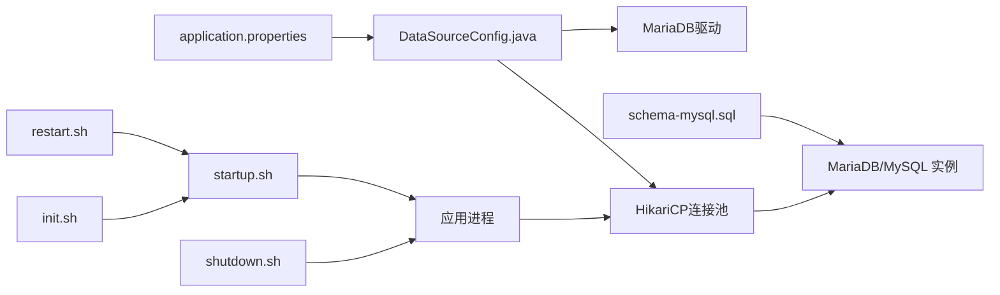

# MySQL数据库安装

<cite>
**本文引用的文件**
- [init.sql](file://watcher-agent/src/main/resources/database/init.sql)
- [schema-mysql.sql](file://watcher-agent/src/main/resources/schema-mysql.sql)
- [application.properties](file://watcher-agent/src/main/resources/application.properties)
- [DataSourceConfig.java](file://watcher-agent/src/main/java/com/virtual/cloud/om/agent/config/DataSourceConfig.java)
- [startup.sh](file://watcher-builder/assembly/bin/startup.sh)
- [shutdown.sh](file://watcher-builder/assembly/bin/shutdown.sh)
- [restart.sh](file://watcher-builder/assembly/bin/restart.sh)
- [init.sh](file://watcher-builder/assembly/bin/init.sh)
</cite>

## 目录
1. [简介](#简介)
2. [项目结构](#项目结构)
3. [核心组件](#核心组件)
4. [架构总览](#架构总览)
5. [详细组件分析](#详细组件分析)
6. [依赖关系分析](#依赖关系分析)
7. [性能考虑](#性能考虑)
8. [故障排除指南](#故障排除指南)
9. [结论](#结论)
10. [附录](#附录)

## 简介
本指南面向在本仓库环境下安装与配置MySQL（或兼容MariaDB）数据库的工程实践，重点覆盖以下方面：
- 安装与初始化：如何准备数据库实例、执行初始化脚本以创建数据库与表结构，并完成基础数据插入。
- 表结构与索引：基于提供的初始化SQL，解析各表的字段、约束与索引设计意图。
- 权限与用户：说明应用连接所需的数据库账号与权限要求。
- 服务生命周期：提供启动、停止、重启与初始化脚本的使用方法。
- 配置与调优：结合应用配置文件与连接池参数，给出可操作的优化建议。
- 故障排除：针对常见问题提供定位思路与解决路径。

注意：本仓库中应用层使用的是MariaDB驱动与连接字符串，但该指南同时适用于MySQL环境，因为两者在本项目场景下具备高度兼容性。

## 项目结构
与MySQL安装和初始化相关的关键位置如下：
- 数据库初始化脚本：schema-mysql.sql（创建数据库、表与索引）、init.sql（ClickHouse风格的指标表，非MySQL）。
- 应用配置：application.properties（定义数据库连接URL、用户名、密码与MyBatis-Plus配置）。
- 连接池配置：DataSourceConfig.java（HikariCP连接池参数与MariaDB连接属性）。
- 服务生命周期脚本：startup.sh、shutdown.sh、restart.sh、init.sh（用于系统服务注册与运行控制）。

图表来源
- [application.properties:48-51](file://watcher-agent/src/main/resources/application.properties#L48-L51)
- [DataSourceConfig.java:27-44](file://watcher-agent/src/main/java/com/virtual/cloud/om/agent/config/DataSourceConfig.java#L27-L44)
- [schema-mysql.sql:5](file://watcher-agent/src/main/resources/schema-mysql.sql#L5)

章节来源
- [application.properties:1-80](file://watcher-agent/src/main/resources/application.properties#L1-L80)
- [schema-mysql.sql:1-204](file://watcher-agent/src/main/resources/schema-mysql.sql#L1-L204)
- [DataSourceConfig.java:1-46](file://watcher-agent/src/main/java/com/virtual/cloud/om/agent/config/DataSourceConfig.java#L1-L46)
- [startup.sh:1-81](file://watcher-builder/assembly/bin/startup.sh#L1-L81)
- [shutdown.sh:1-26](file://watcher-builder/assembly/bin/shutdown.sh#L1-L26)
- [restart.sh:1-9](file://watcher-builder/assembly/bin/restart.sh#L1-L9)
- [init.sh:1-35](file://watcher-builder/assembly/bin/init.sh#L1-L35)

## 核心组件
- 数据库初始化脚本：负责创建数据库、所有业务表、索引以及初始数据（如默认管理员用户）。
- 应用数据源配置：通过application.properties与DataSourceConfig.java定义数据库连接参数与连接池行为。
- 服务生命周期脚本：封装了启动、停止、重启与初始化流程，便于系统集成。

章节来源
- [schema-mysql.sql:1-204](file://watcher-agent/src/main/resources/schema-mysql.sql#L1-L204)
- [application.properties:48-51](file://watcher-agent/src/main/resources/application.properties#L48-L51)
- [DataSourceConfig.java:27-44](file://watcher-agent/src/main/java/com/virtual/cloud/om/agent/config/DataSourceConfig.java#L27-L44)
- [startup.sh:78](file://watcher-builder/assembly/bin/startup.sh#L78)
- [shutdown.sh:22](file://watcher-builder/assembly/bin/shutdown.sh#L22)
- [restart.sh:6-8](file://watcher-builder/assembly/bin/restart.sh#L6-L8)
- [init.sh:17-20](file://watcher-builder/assembly/bin/init.sh#L17-L20)

## 架构总览
应用通过HikariCP连接池连接到MariaDB（兼容MySQL），使用MyBatis-Plus进行ORM访问。初始化阶段由schema-mysql.sql完成数据库与表结构的创建，随后应用启动并建立连接。

图表来源
- [schema-mysql.sql:5](file://watcher-agent/src/main/resources/schema-mysql.sql#L5)
- [application.properties:48-51](file://watcher-agent/src/main/resources/application.properties#L48-L51)
- [DataSourceConfig.java:27-44](file://watcher-agent/src/main/java/com/virtual/cloud/om/agent/config/DataSourceConfig.java#L27-L44)

## 详细组件分析

### 初始化脚本与表结构（schema-mysql.sql）
- 数据库创建：显式指定字符集与排序规则，确保后续建表继承一致的编码策略。
- 表与字段：
  - 系统用户表：主键、用户名唯一、密码字段、登录时间与时间戳字段。
  - 密码策略表：最小长度、复杂度等级、有效期等策略字段。
  - Agent唯一码表：唯一标识与创建时间。
  - 部署记录表：部署名称、类型、状态、主机、配置等。
  - 参数配置表：类型+名称唯一组合，支持描述与JSON配置。
  - 任务表：任务名称、类型、状态、CRON表达式、处理器类与参数。
  - 操作日志表：模块、操作描述、操作人、结果、时间与软删除标记。
  - 数据中心配置表：键值对配置与描述。
  - 告警记录表：级别、标题、内容、来源、状态、时间与时间戳。
  - 资源表：平台类型、IP、端口、协议、认证信息、激活/可用状态、SSH权限与有效期等；含复合唯一索引。
  - 指标数据表：资源ID、指标类型/名称/值/单位、标签、上报时间与创建时间。
- 索引设计：
  - 日志表：deleted、time列索引，便于查询与归档。
  - 参数表：type+name联合唯一索引，保证键的唯一性。
  - 部署/任务/告警/资源/指标表：按常用过滤条件建立单列索引，提升查询效率。
- 初始数据：
  - 默认管理员用户插入，便于首次登录与系统初始化。

章节来源
- [schema-mysql.sql:5](file://watcher-agent/src/main/resources/schema-mysql.sql#L5)
- [schema-mysql.sql:11-19](file://watcher-agent/src/main/resources/schema-mysql.sql#L11-L19)
- [schema-mysql.sql:28-36](file://watcher-agent/src/main/resources/schema-mysql.sql#L28-L36)
- [schema-mysql.sql:44-49](file://watcher-agent/src/main/resources/schema-mysql.sql#L44-L49)
- [schema-mysql.sql:54-64](file://watcher-agent/src/main/resources/schema-mysql.sql#L54-L64)
- [schema-mysql.sql:69-79](file://watcher-agent/src/main/resources/schema-mysql.sql#L69-L79)
- [schema-mysql.sql:84-95](file://watcher-agent/src/main/resources/schema-mysql.sql#L84-L95)
- [schema-mysql.sql:100-110](file://watcher-agent/src/main/resources/schema-mysql.sql#L100-L110)
- [schema-mysql.sql:122-130](file://watcher-agent/src/main/resources/schema-mysql.sql#L122-L130)
- [schema-mysql.sql:135-147](file://watcher-agent/src/main/resources/schema-mysql.sql#L135-L147)
- [schema-mysql.sql:155-176](file://watcher-agent/src/main/resources/schema-mysql.sql#L155-L176)
- [schema-mysql.sql:185-203](file://watcher-agent/src/main/resources/schema-mysql.sql#L185-L203)
- [schema-mysql.sql:21-23](file://watcher-agent/src/main/resources/schema-mysql.sql#L21-L23)
- [schema-mysql.sql:38-39](file://watcher-agent/src/main/resources/schema-mysql.sql#L38-L39)

### init.sql（ClickHouse风格指标表）
- 表结构：包含平台、追踪ID、指标名、批次号、标签、数值与创建时间等字段。
- 引擎与排序：采用MergeTree引擎并按创建时间排序，适合时序数据写入与查询。
- 注意：该脚本为ClickHouse语法示例，不适用于MySQL环境；MySQL应使用schema-mysql.sql创建的表结构。

章节来源
- [init.sql:1-12](file://watcher-agent/src/main/resources/database/init.sql#L1-L12)

### 应用数据源配置（application.properties + DataSourceConfig.java）
- 连接参数：
  - JDBC URL：指向本地MariaDB实例的watcher_db数据库，启用Unicode与字符集编码，设置连接超时。
  - 用户名/密码：root用户及空密码（生产环境请务必修改）。
  - 驱动类：org.mariadb.jdbc.Driver。
- 连接池参数（HikariCP）：
  - 最大池大小、最小空闲、连接超时、空闲超时、最大生存时间。
  - MariaDB连接属性：禁用SSL、允许公钥检索、设置服务器时区为Asia/Shanghai。
- MyBatis-Plus配置：
  - Mapper XML扫描路径、实体包名映射、下划线转驼峰、日志实现。

章节来源
- [application.properties:48-51](file://watcher-agent/src/main/resources/application.properties#L48-L51)
- [DataSourceConfig.java:27-44](file://watcher-agent/src/main/java/com/virtual/cloud/om/agent/config/DataSourceConfig.java#L27-L44)
- [application.properties:54-58](file://watcher-agent/src/main/resources/application.properties#L54-L58)

### 服务生命周期脚本
- 启动脚本（startup.sh）：
  - 校验Java版本，准备日志目录，设置JVM参数与GC日志，以nohup方式启动agent.jar。
- 关闭脚本（shutdown.sh）：
  - 通过进程标志匹配并终止进程，等待安全退出。
- 重启脚本（restart.sh）：
  - 先停止再启动，中间有短暂延迟。
- 初始化脚本（init.sh）：
  - 写入watcher_home路径，复制组件，依次启动master组件、MongoDB与agent，并注册为系统服务。

章节来源
- [startup.sh:1-81](file://watcher-builder/assembly/bin/startup.sh#L1-L81)
- [shutdown.sh:1-26](file://watcher-builder/assembly/bin/shutdown.sh#L1-L26)
- [restart.sh:1-9](file://watcher-builder/assembly/bin/restart.sh#L1-L9)
- [init.sh:1-35](file://watcher-builder/assembly/bin/init.sh#L1-L35)

## 依赖关系分析
- 应用依赖MariaDB驱动与HikariCP连接池，连接参数来自application.properties并通过DataSourceConfig.java注入。
- 初始化脚本独立于应用运行，先于应用启动执行，确保数据库结构就绪。
- 服务脚本负责应用进程的生命周期管理，间接影响数据库连接的可用性。

图表来源
- [application.properties:48-51](file://watcher-agent/src/main/resources/application.properties#L48-L51)
- [DataSourceConfig.java:27-44](file://watcher-agent/src/main/java/com/virtual/cloud/om/agent/config/DataSourceConfig.java#L27-L44)
- [schema-mysql.sql:5](file://watcher-agent/src/main/resources/schema-mysql.sql#L5)
- [startup.sh:78](file://watcher-builder/assembly/bin/startup.sh#L78)
- [shutdown.sh:22](file://watcher-builder/assembly/bin/shutdown.sh#L22)
- [restart.sh:6-8](file://watcher-builder/assembly/bin/restart.sh#L6-L8)
- [init.sh:17-20](file://watcher-builder/assembly/bin/init.sh#L17-L20)

## 性能考虑
- 连接池参数建议：
  - 根据并发请求量调整最大池大小与最小空闲数，避免频繁创建销毁连接。
  - 合理设置连接超时与空闲超时，减少僵尸连接占用。
  - 控制最大生存时间，平衡连接复用与新鲜度。
- 数据库层面：
  - 为高频查询字段建立合适索引，避免全表扫描。
  - 对大字段（如TEXT/JSON）谨慎使用，必要时拆分或归档。
- 字符集与排序规则：
  - 统一使用utf8mb4与对应排序规则，避免存储与比较异常。
- 时区与时间字段：
  - 明确服务器与客户端时区，避免时间错位导致的统计偏差。

章节来源
- [DataSourceConfig.java:30-44](file://watcher-agent/src/main/java/com/virtual/cloud/om/agent/config/DataSourceConfig.java#L30-L44)
- [schema-mysql.sql:112-117](file://watcher-agent/src/main/resources/schema-mysql.sql#L112-L117)
- [schema-mysql.sql:175](file://watcher-agent/src/main/resources/schema-mysql.sql#L175)

## 故障排除指南
- 无法连接数据库：
  - 检查JDBC URL、用户名与密码是否正确，确认MariaDB服务已启动且监听端口可达。
  - 查看连接池日志与GC日志，定位超时或认证错误。
- 权限不足：
  - 确认root用户具备对watcher_db的完整权限，或为应用创建专用账号并授予相应权限。
- 字符集乱码：
  - 确保数据库、表与连接参数均使用utf8mb4，避免历史数据出现乱码。
- 进程无法停止：
  - 使用shutdown.sh的进程匹配逻辑确认是否正确识别目标进程，必要时手动清理残留进程。
- 初始化失败：
  - 先执行schema-mysql.sql创建数据库与表，再启动应用；检查是否存在重复执行导致的约束冲突。

章节来源
- [application.properties:48-51](file://watcher-agent/src/main/resources/application.properties#L48-L51)
- [DataSourceConfig.java:30-44](file://watcher-agent/src/main/java/com/virtual/cloud/om/agent/config/DataSourceConfig.java#L30-L44)
- [startup.sh:78](file://watcher-builder/assembly/bin/startup.sh#L78)
- [shutdown.sh:22](file://watcher-builder/assembly/bin/shutdown.sh#L22)
- [schema-mysql.sql:5](file://watcher-agent/src/main/resources/schema-mysql.sql#L5)

## 结论
本指南基于仓库中的初始化脚本与应用配置，给出了在MySQL/MariaDB环境下安装与配置的完整路径：先创建数据库与表结构，再配置应用连接参数与连接池，最后通过服务脚本管理应用进程。遵循本文的权限、索引与字符集建议，可有效提升系统稳定性与性能。

## 附录

### 安装与初始化步骤
- 准备数据库实例：安装MariaDB/MySQL，确保网络连通与端口开放。
- 执行初始化脚本：在数据库中执行schema-mysql.sql，完成数据库、表、索引与初始数据的创建。
- 修改应用配置：在application.properties中设置正确的JDBC URL、用户名与密码。
- 启动应用：通过init.sh或startup.sh启动服务，观察日志确认连接成功。

章节来源
- [schema-mysql.sql:5](file://watcher-agent/src/main/resources/schema-mysql.sql#L5)
- [application.properties:48-51](file://watcher-agent/src/main/resources/application.properties#L48-L51)
- [init.sh:17-20](file://watcher-builder/assembly/bin/init.sh#L17-L20)
- [startup.sh:78](file://watcher-builder/assembly/bin/startup.sh#L78)

### 服务启动/停止/重启/初始化命令
- 启动：bash bin/startup.sh
- 停止：bash bin/shutdown.sh
- 重启：bash bin/restart.sh
- 初始化：bash bin/init.sh（写入home路径、启动组件与注册系统服务）

章节来源
- [startup.sh:78](file://watcher-builder/assembly/bin/startup.sh#L78)
- [shutdown.sh:22](file://watcher-builder/assembly/bin/shutdown.sh#L22)
- [restart.sh:6-8](file://watcher-builder/assembly/bin/restart.sh#L6-L8)
- [init.sh:17-20](file://watcher-builder/assembly/bin/init.sh#L17-L20)

### 数据库权限与用户管理
- 建议为应用创建专用数据库账号，仅授予watcher_db所需权限。
- 生产环境必须修改默认root密码，并限制来源IP。
- 如需多实例或多租户隔离，可按业务划分数据库或使用Schema隔离。

章节来源
- [application.properties:48-51](file://watcher-agent/src/main/resources/application.properties#L48-L51)