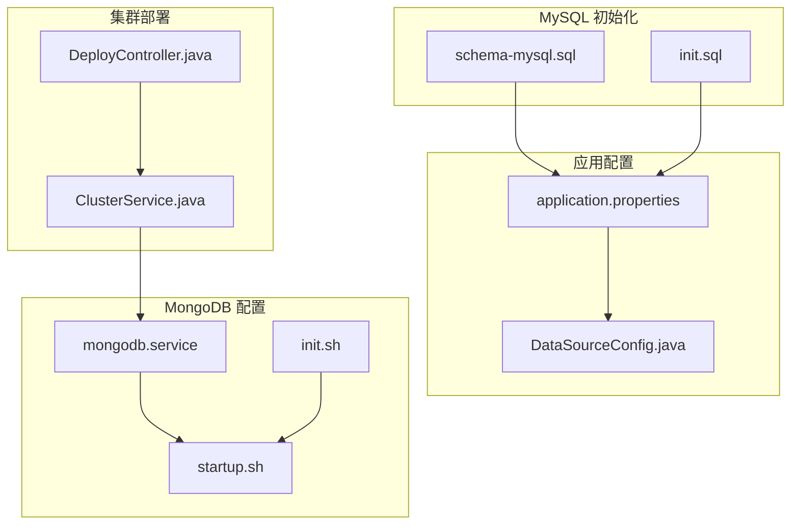
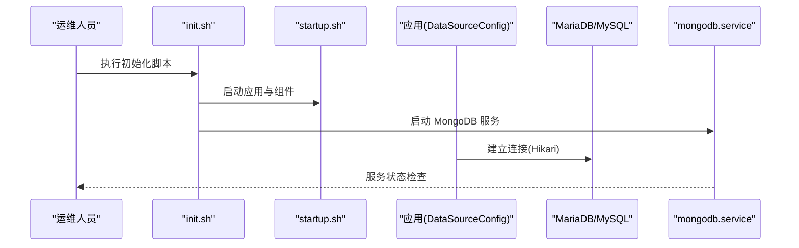
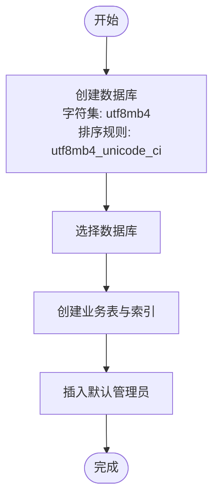
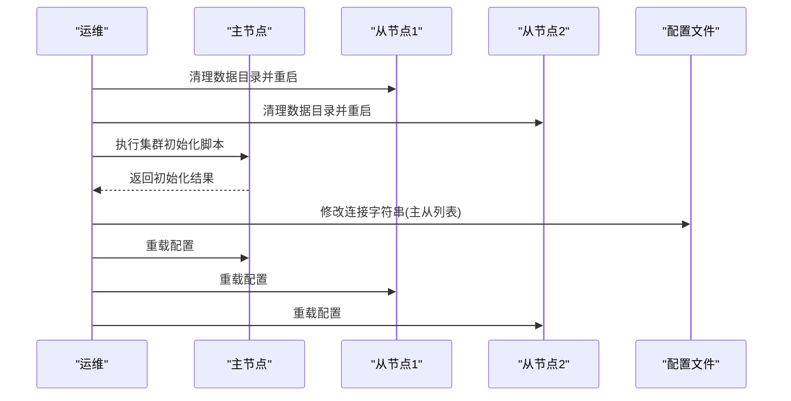
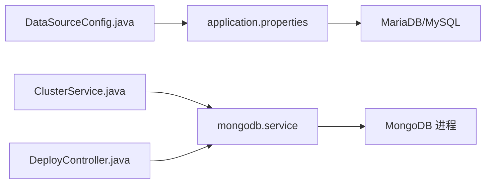

# 数据库安装

<cite>
**本文引用的文件**
- [schema-mysql.sql](file://watcher-agent/src/main/resources/schema-mysql.sql)
- [init.sql](file://watcher-agent/src/main/resources/database/init.sql)
- [application.properties](file://watcher-agent/src/main/resources/application.properties)
- [DataSourceConfig.java](file://watcher-agent/src/main/java/com/virtual/cloud/om/agent/config/DataSourceConfig.java)
- [mongodb.service](file://watcher-builder/assembly/conf/mongodb.service)
- [startup.sh](file://watcher-builder/assembly/bin/startup.sh)
- [init.sh](file://watcher-builder/assembly/bin/init.sh)
- [ClusterService.java](file://watcher-agent/src/main/java/com/virtual/cloud/om/agent/service/deploy/ClusterService.java)
- [DeployController.java](file://watcher-agent/src/main/java/com/virtual/cloud/om/agent/controller/DeployController.java)
</cite>

## 目录
1. [简介](#简介)
2. [项目结构](#项目结构)
3. [核心组件](#核心组件)
4. [架构总览](#架构总览)
5. [详细组件分析](#详细组件分析)
6. [依赖关系分析](#依赖关系分析)
7. [性能考虑](#性能考虑)
8. [故障排除指南](#故障排除指南)
9. [结论](#结论)
10. [附录](#附录)

## 简介
本指南面向数据库系统的安装与配置，重点覆盖以下内容：
- MySQL/MariaDB 安装、初始化与配置：字符集、权限、连接池与基础性能要点
- MongoDB 安装、副本集配置与数据目录设置
- 启动脚本使用与健康检查
- 数据库连接配置与常见问题排查

本指南严格基于仓库中的实际配置与脚本进行说明，帮助读者在生产或测试环境中快速完成数据库安装与验证。

## 项目结构
与数据库安装直接相关的文件主要分布在以下位置：
- MySQL 初始化脚本与应用配置
- MongoDB systemd 服务定义与启动脚本
- 集群部署与网络配置逻辑（用于MongoDB副本集）

**图表来源**
- [application.properties:1-80](file://watcher-agent/src/main/resources/application.properties#L1-L80)
- [DataSourceConfig.java:1-46](file://watcher-agent/src/main/java/com/virtual/cloud/om/agent/config/DataSourceConfig.java#L1-L46)
- [schema-mysql.sql:1-204](file://watcher-agent/src/main/resources/schema-mysql.sql#L1-L204)
- [init.sql:1-12](file://watcher-agent/src/main/resources/database/init.sql#L1-L12)
- [mongodb.service:1-14](file://watcher-builder/assembly/conf/mongodb.service#L1-L14)
- [startup.sh:1-81](file://watcher-builder/assembly/bin/startup.sh#L1-L81)
- [init.sh:1-35](file://watcher-builder/assembly/bin/init.sh#L1-L35)
- [ClusterService.java:310-328](file://watcher-agent/src/main/java/com/virtual/cloud/om/agent/service/deploy/ClusterService.java#L310-L328)
- [DeployController.java:145-200](file://watcher-agent/src/main/java/com/virtual/cloud/om/agent/controller/DeployController.java#L145-L200)

**章节来源**
- [application.properties:1-80](file://watcher-agent/src/main/resources/application.properties#L1-L80)
- [schema-mysql.sql:1-204](file://watcher-agent/src/main/resources/schema-mysql.sql#L1-L204)
- [init.sql:1-12](file://watcher-agent/src/main/resources/database/init.sql#L1-L12)
- [mongodb.service:1-14](file://watcher-builder/assembly/conf/mongodb.service#L1-L14)
- [startup.sh:1-81](file://watcher-builder/assembly/bin/startup.sh#L1-L81)
- [init.sh:1-35](file://watcher-builder/assembly/bin/init.sh#L1-L35)
- [ClusterService.java:310-328](file://watcher-agent/src/main/java/com/virtual/cloud/om/agent/service/deploy/ClusterService.java#L310-L328)
- [DeployController.java:145-200](file://watcher-agent/src/main/java/com/virtual/cloud/om/agent/controller/DeployController.java#L145-L200)

## 核心组件
- MySQL/MariaDB 连接与初始化
  - 应用通过 JDBC 连接 MariaDB，使用 Hikari 连接池，字符集为 utf8mb4，时区设置为 Asia/Shanghai
  - 提供单机版初始化脚本，创建数据库、表与索引，并初始化默认管理员账户
- MongoDB 服务与副本集
  - systemd 服务定义了 MongoDB 的启动/重启/停止命令
  - 集群部署流程包含清理从节点数据、重启从节点服务、执行集群脚本、修改配置并重启
  - 网络配置在部署 MongoDB 前写入文件，确保 VIP 与网卡信息正确

**章节来源**
- [application.properties:46-58](file://watcher-agent/src/main/resources/application.properties#L46-L58)
- [DataSourceConfig.java:18-44](file://watcher-agent/src/main/java/com/virtual/cloud/om/agent/config/DataSourceConfig.java#L18-L44)
- [schema-mysql.sql:5-23](file://watcher-agent/src/main/resources/schema-mysql.sql#L5-L23)
- [mongodb.service:5-10](file://watcher-builder/assembly/conf/mongodb.service#L5-L10)
- [ClusterService.java:310-328](file://watcher-agent/src/main/java/com/virtual/cloud/om/agent/service/deploy/ClusterService.java#L310-L328)
- [DeployController.java:169-173](file://watcher-agent/src/main/java/com/virtual/cloud/om/agent/controller/DeployController.java#L169-L173)

## 架构总览
下图展示了数据库安装与启动的关键交互：

**图表来源**
- [init.sh:17-20](file://watcher-builder/assembly/bin/init.sh#L17-L20)
- [startup.sh:78-81](file://watcher-builder/assembly/bin/startup.sh#L78-L81)
- [DataSourceConfig.java:27-45](file://watcher-agent/src/main/java/com/virtual/cloud/om/agent/config/DataSourceConfig.java#L27-L45)
- [mongodb.service:5-10](file://watcher-builder/assembly/conf/mongodb.service#L5-L10)

## 详细组件分析

### MySQL/MariaDB 安装、初始化与配置
- 字符集与排序规则
  - 初始化脚本显式指定数据库字符集为 utf8mb4，并使用 utf8mb4_unicode_ci 排序规则
- 权限与连接
  - 应用配置使用 MariaDB JDBC 驱动，连接串包含字符集与超时设置
  - Hikari 连接池配置了最大连接数、空闲与生命周期参数，并开启 SSL 公钥检索与时区设置
- 表结构与索引
  - 初始化脚本包含多个业务表（如用户、参数、任务、资源、指标等），并建立常用索引以提升查询性能
- 默认管理员
  - 初始化脚本插入默认管理员账号，便于首次登录与后续权限配置

**图表来源**
- [schema-mysql.sql:5-23](file://watcher-agent/src/main/resources/schema-mysql.sql#L5-L23)
- [schema-mysql.sql:112-118](file://watcher-agent/src/main/resources/schema-mysql.sql#L112-L118)
- [schema-mysql.sql:21-23](file://watcher-agent/src/main/resources/schema-mysql.sql#L21-L23)

**章节来源**
- [schema-mysql.sql:5-23](file://watcher-agent/src/main/resources/schema-mysql.sql#L5-L23)
- [schema-mysql.sql:112-118](file://watcher-agent/src/main/resources/schema-mysql.sql#L112-L118)
- [schema-mysql.sql:21-23](file://watcher-agent/src/main/resources/schema-mysql.sql#L21-L23)
- [application.properties:48-51](file://watcher-agent/src/main/resources/application.properties#L48-L51)
- [DataSourceConfig.java:30-44](file://watcher-agent/src/main/java/com/virtual/cloud/om/agent/config/DataSourceConfig.java#L30-L44)

### ClickHouse 表初始化（补充说明）
- 仓库中存在 ClickHouse 的建表语句，用于存储指标数据，与 MySQL 初始化脚本共同构成监控数据存储方案
- 该表采用 MergeTree 引擎并按时间列排序，适合高吞吐写入与高效查询

**章节来源**
- [init.sql:1-12](file://watcher-agent/src/main/resources/database/init.sql#L1-L12)

### MongoDB 安装、副本集与数据目录
- systemd 服务定义
  - 服务单元通过 ExecStart/ExecReload/ExecStop 指向组件内的启动/重启/停止脚本
- 副本集搭建流程
  - 清理从节点数据目录后重启从节点 MongoDB
  - 在主节点执行集群脚本完成副本集初始化
  - 修改各节点配置，使应用侧连接字符串指向主从节点列表
- 网络与 VIP
  - 在部署 MongoDB 前，将网络配置写入文件，确保 VIP 与网卡信息生效

**图表来源**
- [ClusterService.java:310-328](file://watcher-agent/src/main/java/com/virtual/cloud/om/agent/service/deploy/ClusterService.java#L310-L328)
- [mongodb.service:7-9](file://watcher-builder/assembly/conf/mongodb.service#L7-L9)
- [DeployController.java:169-173](file://watcher-agent/src/main/java/com/virtual/cloud/om/agent/controller/DeployController.java#L169-L173)

**章节来源**
- [mongodb.service:5-10](file://watcher-builder/assembly/conf/mongodb.service#L5-L10)
- [ClusterService.java:310-328](file://watcher-agent/src/main/java/com/virtual/cloud/om/agent/service/deploy/ClusterService.java#L310-L328)
- [DeployController.java:169-173](file://watcher-agent/src/main/java/com/virtual/cloud/om/agent/controller/DeployController.java#L169-L173)

### 启动脚本与健康检查
- 应用启动脚本
  - 自动检测 Java 可执行文件与版本，准备日志目录，设置 JVM 内存与 GC 日志参数，以 prod 配置启动应用
- 初始化脚本
  - 记录 watcher home，复制组件，依次启动组件与应用，并注册为系统服务
  - 配置定时巡检脚本与防火墙策略
- 健康检查
  - 应用层面通过 Actuator 暴露健康端点，可结合 systemd 与外部监控进行健康检查

**章节来源**
- [startup.sh:1-81](file://watcher-builder/assembly/bin/startup.sh#L1-L81)
- [init.sh:1-35](file://watcher-builder/assembly/bin/init.sh#L1-L35)
- [application.properties:10-11](file://watcher-agent/src/main/resources/application.properties#L10-L11)

## 依赖关系分析
- 应用对数据库的依赖
  - MySQL：通过 Hikari 连接池与 MariaDB 驱动连接，使用 utf8mb4 字符集与 Asia/Shanghai 时区
  - MongoDB：通过 systemd 服务管理，副本集配置由部署脚本完成
- 组件耦合
  - 集群部署服务依赖 SSH 工具在远端执行清理与重启命令
  - 网络配置在部署 MongoDB 前写入文件，避免副本集初始化失败

**图表来源**
- [DataSourceConfig.java:18-44](file://watcher-agent/src/main/java/com/virtual/cloud/om/agent/config/DataSourceConfig.java#L18-L44)
- [application.properties:48-51](file://watcher-agent/src/main/resources/application.properties#L48-L51)
- [mongodb.service:5-10](file://watcher-builder/assembly/conf/mongodb.service#L5-L10)
- [ClusterService.java:310-328](file://watcher-agent/src/main/java/com/virtual/cloud/om/agent/service/deploy/ClusterService.java#L310-L328)
- [DeployController.java:169-173](file://watcher-agent/src/main/java/com/virtual/cloud/om/agent/controller/DeployController.java#L169-L173)

**章节来源**
- [DataSourceConfig.java:18-44](file://watcher-agent/src/main/java/com/virtual/cloud/om/agent/config/DataSourceConfig.java#L18-L44)
- [application.properties:48-51](file://watcher-agent/src/main/resources/application.properties#L48-L51)
- [mongodb.service:5-10](file://watcher-builder/assembly/conf/mongodb.service#L5-L10)
- [ClusterService.java:310-328](file://watcher-agent/src/main/java/com/virtual/cloud/om/agent/service/deploy/ClusterService.java#L310-L328)
- [DeployController.java:169-173](file://watcher-agent/src/main/java/com/virtual/cloud/om/agent/controller/DeployController.java#L169-L173)

## 性能考虑
- 连接池与驱动
  - 使用 Hikari 连接池，合理设置最大连接数、空闲与生命周期，有助于降低连接开销与提升并发能力
  - MariaDB 驱动与 UTF-8 字符集配合，减少字符转换成本
- 索引设计
  - 初始化脚本为高频查询字段建立索引，建议结合实际查询模式持续评估与优化
- GC 与内存
  - 启动脚本设置了 JVM 内存与 GC 日志参数，便于运行期性能观测与调优

**章节来源**
- [DataSourceConfig.java:30-44](file://watcher-agent/src/main/java/com/virtual/cloud/om/agent/config/DataSourceConfig.java#L30-L44)
- [schema-mysql.sql:112-118](file://watcher-agent/src/main/resources/schema-mysql.sql#L112-L118)
- [startup.sh:62-72](file://watcher-builder/assembly/bin/startup.sh#L62-L72)

## 故障排除指南
- MySQL/MariaDB 连接失败
  - 检查 JDBC URL、用户名与密码是否与配置一致
  - 确认字符集与时区设置匹配，避免乱码或时差问题
  - 查看连接池参数与数据库最大连接限制
- MongoDB 副本集初始化失败
  - 确认从节点数据目录已清理且服务已重启
  - 检查主节点集群脚本执行结果与日志
  - 校验配置文件中连接字符串是否包含所有节点
- 网络与 VIP 不生效
  - 确认网络配置已在部署 MongoDB 前写入文件并重启网络服务
- 健康检查
  - 通过 Actuator 健康端点查看应用与依赖服务状态
  - 结合 systemd 与定时巡检脚本进行自动化监控

**章节来源**
- [application.properties:48-51](file://watcher-agent/src/main/resources/application.properties#L48-L51)
- [DataSourceConfig.java:30-44](file://watcher-agent/src/main/java/com/virtual/cloud/om/agent/config/DataSourceConfig.java#L30-L44)
- [ClusterService.java:310-328](file://watcher-agent/src/main/java/com/virtual/cloud/om/agent/service/deploy/ClusterService.java#L310-L328)
- [DeployController.java:169-173](file://watcher-agent/src/main/java/com/virtual/cloud/om/agent/controller/DeployController.java#L169-L173)
- [application.properties:10-11](file://watcher-agent/src/main/resources/application.properties#L10-L11)

## 结论
本指南基于仓库中的配置与脚本，提供了 MySQL/MariaDB 与 MongoDB 的安装、初始化、配置与启动流程说明。建议在生产环境实施前，结合业务负载对连接池、索引与 GC 策略进行针对性优化，并完善自动化巡检与告警机制。

## 附录
- 关键配置项速览
  - MySQL 连接串、用户名、密码与驱动类名
  - Hikari 连接池大小与超时参数
  - MongoDB systemd 服务路径与 ExecStart/Reload/Stop
  - 初始化脚本与启动脚本路径

**章节来源**
- [application.properties:48-51](file://watcher-agent/src/main/resources/application.properties#L48-L51)
- [DataSourceConfig.java:30-44](file://watcher-agent/src/main/java/com/virtual/cloud/om/agent/config/DataSourceConfig.java#L30-L44)
- [mongodb.service:5-10](file://watcher-builder/assembly/conf/mongodb.service#L5-L10)
- [init.sh:17-20](file://watcher-builder/assembly/bin/init.sh#L17-L20)
- [startup.sh:78-81](file://watcher-builder/assembly/bin/startup.sh#L78-L81)