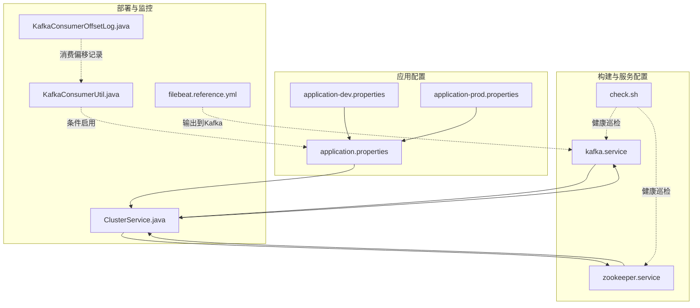
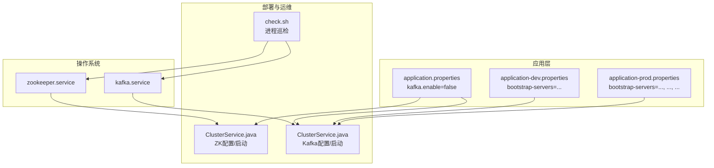
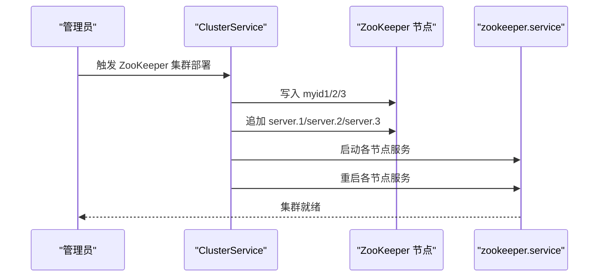
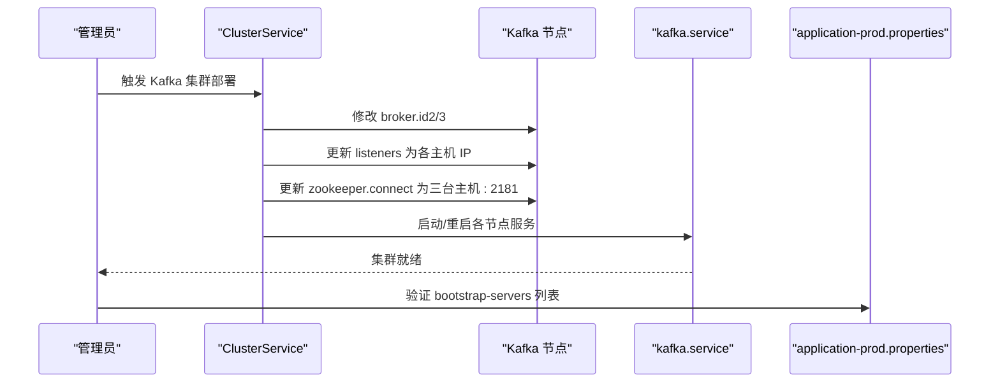
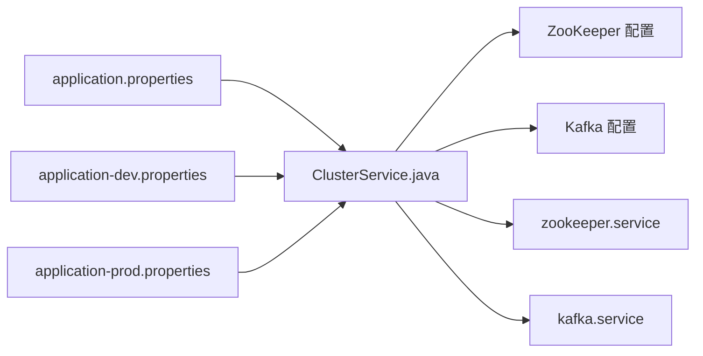

# 消息队列安装

<cite>
**本文引用的文件**
- [kafka.service](file://watcher-builder/assembly/conf/kafka.service)
- [zookeeper.service](file://watcher-builder/assembly/conf/zookeeper.service)
- [application.properties](file://watcher-agent/src/main/resources/application.properties)
- [application-dev.properties](file://watcher-agent/src/main/resources/application-dev.properties)
- [application-prod.properties](file://watcher-agent/src/main/resources/application-prod.properties)
- [ClusterService.java](file://watcher-agent/src/main/java/com/virtual/cloud/om/agent/service/deploy/ClusterService.java)
- [KafkaConsumerUtil.java](file://watcher-sdk/src/main/java/com/virtual/cloud/om/sdk/utils/KafkaConsumerUtil.java)
- [KafkaConsumerOffsetLog.java](file://watcher-agent/src/main/java/com/virtual/cloud/om/agent/entity/KafkaConsumerOffsetLog.java)
- [filebeat.reference.yml](file://watcher-builder/assembly/components/filebeat/filebeat-8.0.1-linux-x86_64/filebeat.reference.yml)
- [check.sh](file://watcher-builder/assembly/bin/check.sh)
</cite>

## 目录
1. [简介](#简介)
2. [项目结构](#项目结构)
3. [核心组件](#核心组件)
4. [架构总览](#架构总览)
5. [详细组件分析](#详细组件分析)
6. [依赖关系分析](#依赖关系分析)
7. [性能考虑](#性能考虑)
8. [故障排查指南](#故障排查指南)
9. [结论](#结论)
10. [附录](#附录)

## 简介
本指南面向在生产环境中部署消息队列系统（ZooKeeper + Kafka）的工程团队，基于仓库中的自动化部署与配置样例，提供从安装到配置、从集群角色分配到健康检查的完整实践路径。内容涵盖：
- ZooKeeper 集群安装与配置：节点角色分配、myid 与 server 列表、集群同步要点
- Kafka 集群安装与配置：Broker ID、监听器、ZooKeeper 连接、主题与分区策略建议
- 服务配置文件模板：systemd 服务单元与应用层配置
- 网络端口与防火墙：ZooKeeper 与 Kafka 的默认端口及开放策略
- 集群健康检查：基于 systemd 与进程状态的巡检脚本

## 项目结构
与消息队列安装直接相关的关键位置如下：
- watcher-builder/assembly/conf：包含 ZooKeeper 与 Kafka 的 systemd 服务单元模板
- watcher-agent/src/main/resources：应用配置文件，包含 Kafka 启用开关与生产环境 Broker 列表
- watcher-agent/src/main/java/com/virtual/cloud/om/agent/service/deploy：自动部署 ZooKeeper 与 Kafka 的实现逻辑
- watcher-builder/assembly/bin：系统巡检脚本示例（可扩展用于消息队列健康检查）

**图表来源**
- [kafka.service:1-14](file://watcher-builder/assembly/conf/kafka.service#L1-L14)
- [zookeeper.service:1-14](file://watcher-builder/assembly/conf/zookeeper.service#L1-L14)
- [application.properties:1-80](file://watcher-agent/src/main/resources/application.properties#L1-L80)
- [application-dev.properties:1-72](file://watcher-agent/src/main/resources/application-dev.properties#L1-L72)
- [application-prod.properties:1-70](file://watcher-agent/src/main/resources/application-prod.properties#L1-L70)
- [ClusterService.java:101-132](file://watcher-agent/src/main/java/com/virtual/cloud/om/agent/service/deploy/ClusterService.java#L101-L132)
- [KafkaConsumerUtil.java:1-14](file://watcher-sdk/src/main/java/com/virtual/cloud/om/sdk/utils/KafkaConsumerUtil.java#L1-L14)
- [KafkaConsumerOffsetLog.java:1-42](file://watcher-agent/src/main/java/com/virtual/cloud/om/agent/entity/KafkaConsumerOffsetLog.java#L1-L42)
- [filebeat.reference.yml:3948-4068](file://watcher-builder/assembly/components/filebeat/filebeat-8.0.1-linux-x86_64/filebeat.reference.yml#L3948-L4068)
- [check.sh:1-27](file://watcher-builder/assembly/bin/check.sh#L1-L27)

**章节来源**
- [kafka.service:1-14](file://watcher-builder/assembly/conf/kafka.service#L1-L14)
- [zookeeper.service:1-14](file://watcher-builder/assembly/conf/zookeeper.service#L1-L14)
- [application.properties:1-80](file://watcher-agent/src/main/resources/application.properties#L1-L80)
- [application-dev.properties:1-72](file://watcher-agent/src/main/resources/application-dev.properties#L1-L72)
- [application-prod.properties:1-70](file://watcher-agent/src/main/resources/application-prod.properties#L1-L70)
- [ClusterService.java:101-132](file://watcher-agent/src/main/java/com/virtual/cloud/om/agent/service/deploy/ClusterService.java#L101-L132)

## 核心组件
- ZooKeeper 服务单元：定义 ZooKeeper 的启动、重启、停止命令以及随系统启动行为
- Kafka 服务单元：定义 Kafka 的启动、重启、停止命令以及随系统启动行为
- 应用配置：
  - application.properties：全局开关与中间件开关（含 Kafka 开关）
  - application-dev.properties：开发环境 Kafka Bootstrap 地址
  - application-prod.properties：生产环境 Kafka 多 Broker 列表
- 自动化部署：
  - ClusterService：负责 ZooKeeper 与 Kafka 的集群初始化、配置变更与重启
- 监控与工具：
  - KafkaConsumerUtil：条件启用的 Kafka 消费工具（受配置开关控制）
  - KafkaConsumerOffsetLog：消费者偏移量记录实体
  - filebeat.reference.yml：输出到 Kafka 的配置项参考（如分区策略、ACK、压缩等）

**章节来源**
- [application.properties:15-21](file://watcher-agent/src/main/resources/application.properties#L15-L21)
- [application-dev.properties:8-10](file://watcher-agent/src/main/resources/application-dev.properties#L8-L10)
- [application-prod.properties:7-8](file://watcher-agent/src/main/resources/application-prod.properties#L7-L8)
- [ClusterService.java:341-400](file://watcher-agent/src/main/java/com/virtual/cloud/om/agent/service/deploy/ClusterService.java#L341-L400)
- [KafkaConsumerUtil.java:1-14](file://watcher-sdk/src/main/java/com/virtual/cloud/om/sdk/utils/KafkaConsumerUtil.java#L1-L14)
- [KafkaConsumerOffsetLog.java:1-42](file://watcher-agent/src/main/java/com/virtual/cloud/om/agent/entity/KafkaConsumerOffsetLog.java#L1-L42)
- [filebeat.reference.yml:3948-4068](file://watcher-builder/assembly/components/filebeat/filebeat-8.0.1-linux-x86_64/filebeat.reference.yml#L3948-L4068)

## 架构总览
下图展示了 ZooKeeper 与 Kafka 在系统中的角色与交互关系，以及 systemd 服务如何驱动组件生命周期。

**图表来源**
- [zookeeper.service:1-14](file://watcher-builder/assembly/conf/zookeeper.service#L1-L14)
- [kafka.service:1-14](file://watcher-builder/assembly/conf/kafka.service#L1-L14)
- [application.properties:15-21](file://watcher-agent/src/main/resources/application.properties#L15-L21)
- [application-dev.properties:8-10](file://watcher-agent/src/main/resources/application-dev.properties#L8-L10)
- [application-prod.properties:7-8](file://watcher-agent/src/main/resources/application-prod.properties#L7-L8)
- [ClusterService.java:341-400](file://watcher-agent/src/main/java/com/virtual/cloud/om/agent/service/deploy/ClusterService.java#L341-L400)
- [check.sh:1-27](file://watcher-builder/assembly/bin/check.sh#L1-L27)

## 详细组件分析

### ZooKeeper 集群安装与配置
- 节点角色与 myid 分配
  - 使用 myid 文件标识每个节点的唯一 ID，并在 ZooKeeper 配置中为每个节点添加 server.{id}=host:peerPort:leaderPort 条目
  - 示例路径与操作由部署逻辑提供，确保三台主机均正确写入 myid 并同步 server 列表
- 集群同步
  - 同步完成后逐台启动 ZooKeeper 服务并执行重启以应用配置
- systemd 服务
  - 通过 zookeeper.service 指定 ExecStart/ExecReload/ExecStop，随系统启动级别生效

**图表来源**
- [ClusterService.java:341-370](file://watcher-agent/src/main/java/com/virtual/cloud/om/agent/service/deploy/ClusterService.java#L341-L370)
- [zookeeper.service:1-14](file://watcher-builder/assembly/conf/zookeeper.service#L1-L14)

**章节来源**
- [ClusterService.java:341-370](file://watcher-agent/src/main/java/com/virtual/cloud/om/agent/service/deploy/ClusterService.java#L341-L370)
- [zookeeper.service:1-14](file://watcher-builder/assembly/conf/zookeeper.service#L1-L14)

### Kafka 集群安装与配置
- Broker ID 与监听器
  - 为每台主机分别修改 broker.id，并将 listeners 配置为对应主机 IP
- ZooKeeper 连接
  - 将 zookeeper.connect 设置为所有三台主机的 2181 端口列表
- systemd 服务
  - 通过 kafka.service 指定启动、重启、停止命令，随系统启动级别生效
- 应用配置
  - 生产环境 application-prod.properties 提供多 Broker 列表，便于客户端连接
  - application-dev.properties 提供单节点示例，便于本地联调

**图表来源**
- [ClusterService.java:373-400](file://watcher-agent/src/main/java/com/virtual/cloud/om/agent/service/deploy/ClusterService.java#L373-L400)
- [kafka.service:1-14](file://watcher-builder/assembly/conf/kafka.service#L1-L14)
- [application-prod.properties:7-8](file://watcher-agent/src/main/resources/application-prod.properties#L7-L8)

**章节来源**
- [ClusterService.java:373-400](file://watcher-agent/src/main/java/com/virtual/cloud/om/agent/service/deploy/ClusterService.java#L373-L400)
- [kafka.service:1-14](file://watcher-builder/assembly/conf/kafka.service#L1-L14)
- [application-prod.properties:7-8](file://watcher-agent/src/main/resources/application-prod.properties#L7-L8)

### 主题配置与分区设置（建议）
- 分区数：根据并发消费者数量与吞吐需求设定；建议至少与消费者组数量匹配
- 副本因子：生产环境建议为 3，确保容灾能力
- 清理策略：按时间或大小清理过期数据，避免磁盘膨胀
- 压缩：对日志类数据可启用压缩以节省带宽与存储
- 参考配置项（来自 Filebeat 对 Kafka 的输出配置）：
  - 分区策略、ACK 级别、压缩、最大消息尺寸等参数可作为调优依据

**章节来源**
- [filebeat.reference.yml:3948-4068](file://watcher-builder/assembly/components/filebeat/filebeat-8.0.1-linux-x86_64/filebeat.reference.yml#L3948-L4068)

### 服务配置文件模板
- ZooKeeper systemd 服务模板
  - [zookeeper.service:1-14](file://watcher-builder/assembly/conf/zookeeper.service#L1-L14)
- Kafka systemd 服务模板
  - [kafka.service:1-14](file://watcher-builder/assembly/conf/kafka.service#L1-L14)
- 应用配置模板（Kafka 启用与 Broker 列表）
  - [application.properties:15-21](file://watcher-agent/src/main/resources/application.properties#L15-L21)
  - [application-dev.properties:8-10](file://watcher-agent/src/main/resources/application-dev.properties#L8-L10)
  - [application-prod.properties:7-8](file://watcher-agent/src/main/resources/application-prod.properties#L7-L8)

**章节来源**
- [zookeeper.service:1-14](file://watcher-builder/assembly/conf/zookeeper.service#L1-L14)
- [kafka.service:1-14](file://watcher-builder/assembly/conf/kafka.service#L1-L14)
- [application.properties:15-21](file://watcher-agent/src/main/resources/application.properties#L15-L21)
- [application-dev.properties:8-10](file://watcher-agent/src/main/resources/application-dev.properties#L8-L10)
- [application-prod.properties:7-8](file://watcher-agent/src/main/resources/application-prod.properties#L7-L8)

## 依赖关系分析
- 组件耦合
  - ClusterService 依赖 ZooKeeper 与 Kafka 的配置文件路径与 systemd 服务单元
  - 应用配置决定 Kafka 是否启用，以及客户端连接的 Broker 列表
- 外部依赖
  - ZooKeeper 为 Kafka 提供协调服务
  - systemd 管理服务生命周期
- 潜在风险
  - 若 myid 或 server 列表不一致，ZooKeeper 集群无法形成法定人数
  - 若 Kafka 的 zookeeper.connect 未包含全部节点，可能导致分区领导者不可用

**图表来源**
- [ClusterService.java:341-400](file://watcher-agent/src/main/java/com/virtual/cloud/om/agent/service/deploy/ClusterService.java#L341-L400)
- [zookeeper.service:1-14](file://watcher-builder/assembly/conf/zookeeper.service#L1-L14)
- [kafka.service:1-14](file://watcher-builder/assembly/conf/kafka.service#L1-L14)
- [application.properties:15-21](file://watcher-agent/src/main/resources/application.properties#L15-L21)
- [application-dev.properties:8-10](file://watcher-agent/src/main/resources/application-dev.properties#L8-L10)
- [application-prod.properties:7-8](file://watcher-agent/src/main/resources/application-prod.properties#L7-L8)

**章节来源**
- [ClusterService.java:341-400](file://watcher-agent/src/main/java/com/virtual/cloud/om/agent/service/deploy/ClusterService.java#L341-L400)
- [application.properties:15-21](file://watcher-agent/src/main/resources/application.properties#L15-L21)

## 性能考虑
- 分区与副本
  - 合理设置分区数以提升并行度，副本数提升可用性但会增加复制开销
- 压缩与批处理
  - 启用压缩可降低网络与磁盘占用；合理设置批量大小与刷新频率
- 客户端 ACK
  - 根据一致性要求选择合适的 ACK 策略，平衡可靠性与延迟
- 参考项
  - 分区策略、ACK、压缩、最大消息尺寸等配置项可作为调优入口

**章节来源**
- [filebeat.reference.yml:3948-4068](file://watcher-builder/assembly/components/filebeat/filebeat-8.0.1-linux-x86_64/filebeat.reference.yml#L3948-L4068)

## 故障排查指南
- 进程状态巡检
  - 使用系统巡检脚本检查 ZooKeeper 与 Kafka 服务是否运行，必要时自动尝试启动
  - 参考：[check.sh:1-27](file://watcher-builder/assembly/bin/check.sh#L1-L27)
- Kafka 启用状态
  - 若 Kafka 不启用，相关工具类将被条件禁用
  - 参考：[application.properties:15-21](file://watcher-agent/src/main/resources/application.properties#L15-L21)、[KafkaConsumerUtil.java:1-14](file://watcher-sdk/src/main/java/com/virtual/cloud/om/sdk/utils/KafkaConsumerUtil.java#L1-L14)
- 消费偏移记录
  - 如需追踪消费进度，可关注消费者偏移量记录实体
  - 参考：[KafkaConsumerOffsetLog.java:1-42](file://watcher-agent/src/main/java/com/virtual/cloud/om/agent/entity/KafkaConsumerOffsetLog.java#L1-L42)

**章节来源**
- [check.sh:1-27](file://watcher-builder/assembly/bin/check.sh#L1-L27)
- [application.properties:15-21](file://watcher-agent/src/main/resources/application.properties#L15-L21)
- [KafkaConsumerUtil.java:1-14](file://watcher-sdk/src/main/java/com/virtual/cloud/om/sdk/utils/KafkaConsumerUtil.java#L1-L14)
- [KafkaConsumerOffsetLog.java:1-42](file://watcher-agent/src/main/java/com/virtual/cloud/om/agent/entity/KafkaConsumerOffsetLog.java#L1-L42)

## 结论
本指南基于仓库中的服务单元与部署逻辑，给出了 ZooKeeper 与 Kafka 的安装、配置与健康检查的实操路径。建议在生产环境中：
- 明确节点角色与 myid，确保 server 列表完整且一致
- 正确设置 Kafka 的 broker.id、listeners 与 zookeeper.connect
- 使用 systemd 管理服务生命周期，并结合巡检脚本进行健康监控
- 根据业务特性调整分区、副本、压缩与 ACK 等参数

## 附录

### 网络端口与防火墙建议
- ZooKeeper
  - 客户端端口：2181
  - 节点间通信端口：2888、3888
- Kafka
  - 监听端口：9092（与配置中的 listeners 保持一致）
- 防火墙
  - 开放上述端口，确保跨主机连通性

**章节来源**
- [ClusterService.java:395-400](file://watcher-agent/src/main/java/com/virtual/cloud/om/agent/service/deploy/ClusterService.java#L395-L400)

### 集群健康检查方法
- systemd 状态检查
  - 使用 systemctl 查看 zookeeper.service 与 kafka.service 的状态
- 进程巡检
  - 参考巡检脚本对关键进程进行周期性检查与自动修复
  - 参考：[check.sh:1-27](file://watcher-builder/assembly/bin/check.sh#L1-L27)

**章节来源**
- [check.sh:1-27](file://watcher-builder/assembly/bin/check.sh#L1-L27)