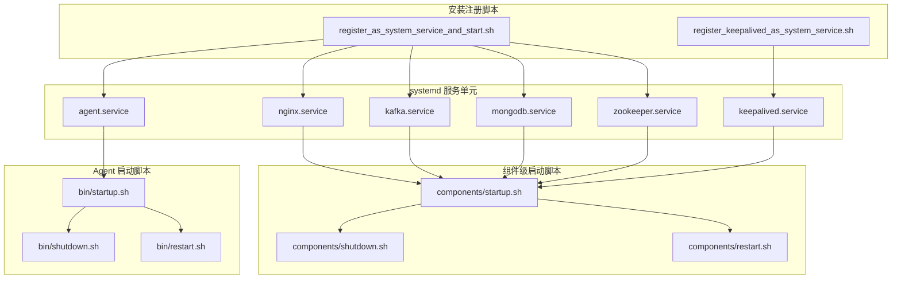
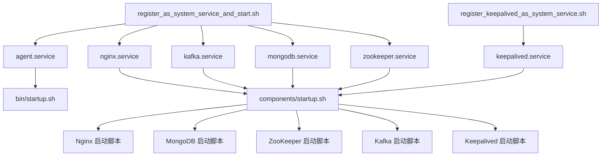
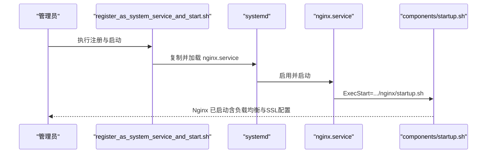
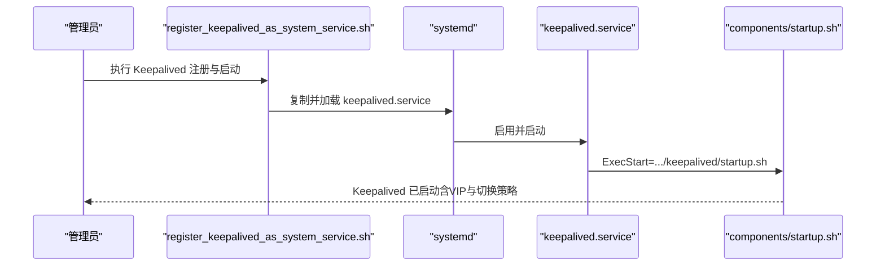
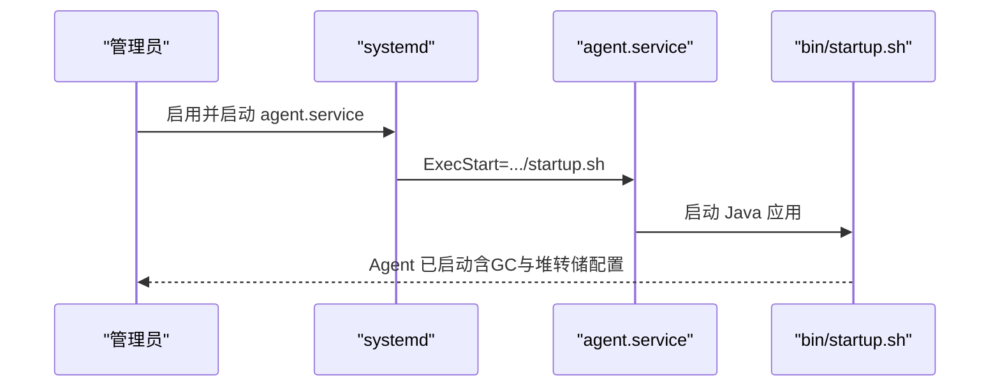
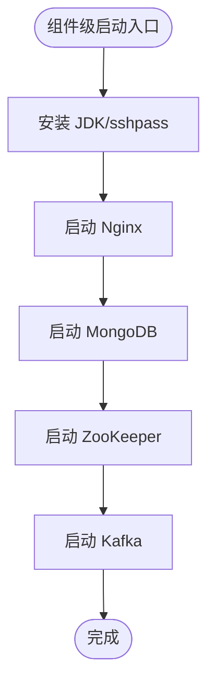
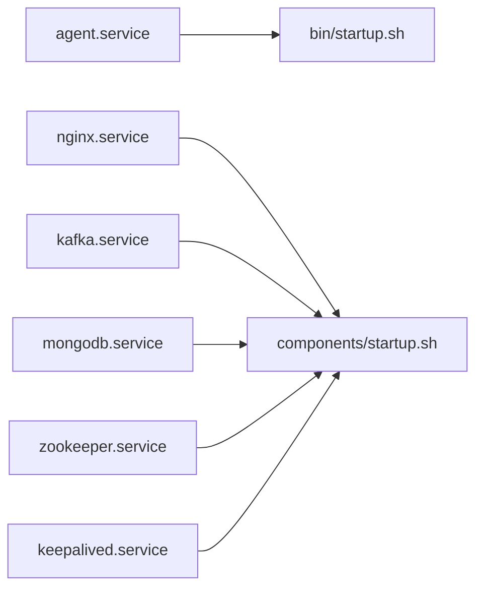

# 系统服务安装

<cite>
**本文引用的文件**
- [register_as_system_service_and_start.sh](file://watcher-builder/assembly/bin/register_as_system_service_and_start.sh)
- [register_keepalived_as_system_service.sh](file://watcher-builder/assembly/bin/register_keepalived_as_system_service.sh)
- [keepalived.service](file://watcher-builder/assembly/conf/keepalived.service)
- [nginx.service](file://watcher-builder/assembly/conf/nginx.service)
- [agent.service](file://watcher-builder/assembly/conf/agent.service)
- [kafka.service](file://watcher-builder/assembly/conf/kafka.service)
- [mongodb.service](file://watcher-builder/assembly/conf/mongodb.service)
- [zookeeper.service](file://watcher-builder/assembly/conf/zookeeper.service)
- [startup.sh（Agent 启动）](file://watcher-builder/assembly/bin/startup.sh)
- [shutdown.sh（Agent 停止）](file://watcher-builder/assembly/bin/shutdown.sh)
- [restart.sh（Agent 重启）](file://watcher-builder/assembly/bin/restart.sh)
- [startup.sh（组件级启动）](file://watcher-builder/assembly/components/startup.sh)
- [shutdown.sh（组件级停止）](file://watcher-builder/assembly/components/shutdown.sh)
- [restart.sh（组件级重启）](file://watcher-builder/assembly/components/restart.sh)
</cite>

## 目录
1. [简介](#简介)
2. [项目结构](#项目结构)
3. [核心组件](#核心组件)
4. [架构总览](#架构总览)
5. [详细组件分析](#详细组件分析)
6. [依赖关系分析](#依赖关系分析)
7. [性能考虑](#性能考虑)
8. [故障排除指南](#故障排除指南)
9. [结论](#结论)
10. [附录](#附录)

## 简介
本指南面向系统运维与平台工程团队，提供基于 systemd 的系统服务安装与配置流程，覆盖以下关键能力：
- Nginx 反向代理服务的安装与系统服务化配置
- 负载均衡与 SSL 证书设置的实践要点
- Keepalived 高可用服务的安装与虚拟 IP（VIP）配置
- 服务启动脚本与 systemd 服务单元文件的使用
- 服务监控、日志管理与常见故障排除方法

本指南严格依据仓库中的安装打包与服务配置脚本进行说明，并提供可操作的步骤与可视化图示。

## 项目结构
围绕系统服务安装与配置，本仓库在构建装配目录中提供了：
- 安装注册脚本：用于将各组件的服务单元复制到 systemd 并启用/启动
- systemd 服务单元模板：定义服务类型、启动/重启/停止命令以及依赖
- 组件级启动脚本：负责环境准备、依赖安装与子服务编排
- Agent 启动脚本：Java 应用的启动、参数与日志配置

图表来源
- [register_as_system_service_and_start.sh:1-45](file://watcher-builder/assembly/bin/register_as_system_service_and_start.sh#L1-L45)
- [register_keepalived_as_system_service.sh:1-25](file://watcher-builder/assembly/bin/register_keepalived_as_system_service.sh#L1-L25)
- [agent.service:1-14](file://watcher-builder/assembly/conf/agent.service#L1-L14)
- [nginx.service:1-14](file://watcher-builder/assembly/conf/nginx.service#L1-L14)
- [kafka.service:1-14](file://watcher-builder/assembly/conf/kafka.service#L1-L14)
- [mongodb.service:1-14](file://watcher-builder/assembly/conf/mongodb.service#L1-L14)
- [zookeeper.service:1-14](file://watcher-builder/assembly/conf/zookeeper.service#L1-L14)
- [keepalived.service:1-14](file://watcher-builder/assembly/conf/keepalived.service#L1-L14)
- [startup.sh（Agent 启动）:1-81](file://watcher-builder/assembly/bin/startup.sh#L1-L81)
- [startup.sh（组件级启动）:1-39](file://watcher-builder/assembly/components/startup.sh#L1-L39)
- [shutdown.sh（Agent 停止）:1-26](file://watcher-builder/assembly/bin/shutdown.sh#L1-L26)
- [restart.sh（Agent 重启）:1-9](file://watcher-builder/assembly/bin/restart.sh#L1-L9)

章节来源
- [register_as_system_service_and_start.sh:1-45](file://watcher-builder/assembly/bin/register_as_system_service_and_start.sh#L1-L45)
- [register_keepalived_as_system_service.sh:1-25](file://watcher-builder/assembly/bin/register_keepalived_as_system_service.sh#L1-L25)

## 核心组件
- systemd 服务单元：定义服务生命周期（启动/重启/停止）、执行路径与依赖
- 组件级启动脚本：统一编排 Nginx、MongoDB、ZooKeeper、Kafka 与 Keepalived 的安装与启动
- Agent 启动脚本：负责 Java 进程启动、JVM 参数、GC 日志与堆转储路径
- 注册脚本：将服务单元复制到 systemd 目录并启用/启动对应服务

章节来源
- [agent.service:1-14](file://watcher-builder/assembly/conf/agent.service#L1-L14)
- [nginx.service:1-14](file://watcher-builder/assembly/conf/nginx.service#L1-L14)
- [kafka.service:1-14](file://watcher-builder/assembly/conf/kafka.service#L1-L14)
- [mongodb.service:1-14](file://watcher-builder/assembly/conf/mongodb.service#L1-L14)
- [zookeeper.service:1-14](file://watcher-builder/assembly/conf/zookeeper.service#L1-L14)
- [keepalived.service:1-14](file://watcher-builder/assembly/conf/keepalived.service#L1-L14)
- [startup.sh（Agent 启动）:1-81](file://watcher-builder/assembly/bin/startup.sh#L1-L81)
- [startup.sh（组件级启动）:1-39](file://watcher-builder/assembly/components/startup.sh#L1-L39)
- [shutdown.sh（Agent 停止）:1-26](file://watcher-builder/assembly/bin/shutdown.sh#L1-L26)
- [restart.sh（Agent 重启）:1-9](file://watcher-builder/assembly/bin/restart.sh#L1-L9)

## 架构总览
下图展示了从注册脚本到各服务单元，再到组件与应用启动脚本的整体关系：

图表来源
- [register_as_system_service_and_start.sh:1-45](file://watcher-builder/assembly/bin/register_as_system_service_and_start.sh#L1-L45)
- [register_keepalived_as_system_service.sh:1-25](file://watcher-builder/assembly/bin/register_keepalived_as_system_service.sh#L1-L25)
- [agent.service:1-14](file://watcher-builder/assembly/conf/agent.service#L1-L14)
- [nginx.service:1-14](file://watcher-builder/assembly/conf/nginx.service#L1-L14)
- [kafka.service:1-14](file://watcher-builder/assembly/conf/kafka.service#L1-L14)
- [mongodb.service:1-14](file://watcher-builder/assembly/conf/mongodb.service#L1-L14)
- [zookeeper.service:1-14](file://watcher-builder/assembly/conf/zookeeper.service#L1-L14)
- [keepalived.service:1-14](file://watcher-builder/assembly/conf/keepalived.service#L1-L14)
- [startup.sh（Agent 启动）:1-81](file://watcher-builder/assembly/bin/startup.sh#L1-L81)
- [startup.sh（组件级启动）:1-39](file://watcher-builder/assembly/components/startup.sh#L1-L39)

## 详细组件分析

### Nginx 反向代理安装与配置
- 系统服务化
  - 使用 systemd 单元文件定义 Nginx 服务的启动/重启/停止命令，指向组件级启动脚本
  - 通过注册脚本将单元复制到 systemd 并启用/启动
- 负载均衡
  - 在 Nginx 配置中定义 upstream 池与后端节点，结合健康检查策略实现流量分发
  - 将上游节点地址与端口配置为实际业务服务地址
- SSL 证书
  - 在 Nginx 中配置 HTTPS server，指定证书与私钥路径
  - 建议使用受信 CA 证书并开启 TLS 最低版本与加密套件优化

图表来源
- [register_as_system_service_and_start.sh:17-35](file://watcher-builder/assembly/bin/register_as_system_service_and_start.sh#L17-L35)
- [nginx.service:1-14](file://watcher-builder/assembly/conf/nginx.service#L1-L14)
- [startup.sh（组件级启动）](file://watcher-builder/assembly/components/startup.sh#L26)

章节来源
- [nginx.service:1-14](file://watcher-builder/assembly/conf/nginx.service#L1-L14)
- [register_as_system_service_and_start.sh:17-35](file://watcher-builder/assembly/bin/register_as_system_service_and_start.sh#L17-L35)
- [startup.sh（组件级启动）](file://watcher-builder/assembly/components/startup.sh#L26)

### Keepalived 高可用与虚拟 IP
- 安装与注册
  - 使用专用注册脚本将 Keepalived 服务单元复制到 systemd 并启用/启动
- 虚拟 IP（VIP）配置
  - 在 Keepalived 配置中定义 vrrp 实例与接口，设置优先级、状态切换条件与 VIP 地址
  - 通过健康检查脚本或 TCP 连接探测后端服务可用性，触发主备切换
- 与 Nginx 协同
  - 将 VIP 作为前端入口，Nginx 作为后端负载均衡器，实现高可用访问

图表来源
- [register_keepalived_as_system_service.sh:1-25](file://watcher-builder/assembly/bin/register_keepalived_as_system_service.sh#L1-L25)
- [keepalived.service:1-14](file://watcher-builder/assembly/conf/keepalived.service#L1-L14)
- [startup.sh（组件级启动）](file://watcher-builder/assembly/components/startup.sh#L26)

章节来源
- [keepalived.service:1-14](file://watcher-builder/assembly/conf/keepalived.service#L1-L14)
- [register_keepalived_as_system_service.sh:1-25](file://watcher-builder/assembly/bin/register_keepalived_as_system_service.sh#L1-L25)

### Agent 服务与 JVM 参数
- 启动流程
  - systemd 单元通过 ExecStart 指向 Agent 启动脚本
  - Agent 启动脚本负责 Java 版本检测、日志目录创建、JVM GC 与堆转储参数设置
- 日志与诊断
  - GC 日志轮转与大小限制、堆转储路径、错误日志输出路径均在脚本中配置
  - 支持通过进程标志位识别与停止进程

图表来源
- [agent.service:1-14](file://watcher-builder/assembly/conf/agent.service#L1-L14)
- [startup.sh（Agent 启动）:1-81](file://watcher-builder/assembly/bin/startup.sh#L1-L81)

章节来源
- [agent.service:1-14](file://watcher-builder/assembly/conf/agent.service#L1-L14)
- [startup.sh（Agent 启动）:1-81](file://watcher-builder/assembly/bin/startup.sh#L1-L81)
- [shutdown.sh（Agent 停止）:1-26](file://watcher-builder/assembly/bin/shutdown.sh#L1-L26)
- [restart.sh（Agent 重启）:1-9](file://watcher-builder/assembly/bin/restart.sh#L1-L9)

### 组件级编排（Nginx/MongoDB/ZooKeeper/Kafka）
- 统一入口
  - 组件级启动脚本负责环境准备、依赖安装与子服务编排
- 顺序与依赖
  - 先安装 JDK 与必要工具，再依次启动 Nginx、MongoDB、ZooKeeper、Kafka
- 健康检查与日志
  - 通过返回码判断启动结果，并记录统一日志文件

图表来源
- [startup.sh（组件级启动）:1-39](file://watcher-builder/assembly/components/startup.sh#L1-L39)
- [shutdown.sh（组件级停止）:1-20](file://watcher-builder/assembly/components/shutdown.sh#L1-L20)
- [restart.sh（组件级重启）:1-20](file://watcher-builder/assembly/components/restart.sh#L1-L20)

章节来源
- [startup.sh（组件级启动）:1-39](file://watcher-builder/assembly/components/startup.sh#L1-L39)
- [shutdown.sh（组件级停止）:1-20](file://watcher-builder/assembly/components/shutdown.sh#L1-L20)
- [restart.sh（组件级重启）:1-20](file://watcher-builder/assembly/components/restart.sh#L1-L20)

## 依赖关系分析
- systemd 服务单元与执行脚本的映射关系清晰：每个服务单元的 ExecStart/Reload/Stop 明确指向相应组件或 Agent 的启动脚本
- 注册脚本集中处理服务单元复制、daemon-reload 与启用/启动，降低手工配置风险
- 组件级脚本承担环境准备与多组件编排职责，简化部署复杂度

图表来源
- [agent.service:1-14](file://watcher-builder/assembly/conf/agent.service#L1-L14)
- [nginx.service:1-14](file://watcher-builder/assembly/conf/nginx.service#L1-L14)
- [kafka.service:1-14](file://watcher-builder/assembly/conf/kafka.service#L1-L14)
- [mongodb.service:1-14](file://watcher-builder/assembly/conf/mongodb.service#L1-L14)
- [zookeeper.service:1-14](file://watcher-builder/assembly/conf/zookeeper.service#L1-L14)
- [keepalived.service:1-14](file://watcher-builder/assembly/conf/keepalived.service#L1-L14)
- [startup.sh（Agent 启动）:1-81](file://watcher-builder/assembly/bin/startup.sh#L1-L81)
- [startup.sh（组件级启动）:1-39](file://watcher-builder/assembly/components/startup.sh#L1-L39)

章节来源
- [register_as_system_service_and_start.sh:1-45](file://watcher-builder/assembly/bin/register_as_system_service_and_start.sh#L1-L45)
- [register_keepalived_as_system_service.sh:1-25](file://watcher-builder/assembly/bin/register_keepalived_as_system_service.sh#L1-L25)

## 性能考虑
- JVM 内存与 GC
  - Agent 启动脚本设置了固定堆大小与 GC 日志轮转策略，建议根据业务规模调整内存参数并定期轮转日志
- Nginx 并发与连接
  - 合理设置 worker 进程数、连接数上限与超时时间；对静态资源与后端代理分别优化缓冲区与压缩策略
- 数据库与消息队列
  - MongoDB/ZooKeeper/Kafka 的启动顺序与资源预留需与系统整体容量匹配，避免启动阶段争抢 CPU/IO

## 故障排除指南
- 服务未启动
  - 检查 systemd 单元是否正确复制与启用，确认 ExecStart/Reload/Stop 路径
  - 查看对应组件或 Agent 的启动脚本输出与日志文件
- Java 版本问题
  - Agent 启动脚本会检测 Java 版本，若低于要求则直接退出；请安装符合要求的 JDK 并确保 PATH 或 JAVA_HOME 正确
- 端口冲突或网络不可达
  - 确认 Nginx、后端服务监听端口未被占用；检查防火墙与 SELinux 设置
- Keepalived 切换异常
  - 检查 VRRP 配置、优先级与健康检查脚本；确认 VIP 接口与网段配置一致
- 日志定位
  - Agent GC 与堆转储路径已在启动脚本中配置；组件级统一写入安装日志文件，便于排查

章节来源
- [startup.sh（Agent 启动）:1-81](file://watcher-builder/assembly/bin/startup.sh#L1-L81)
- [startup.sh（组件级启动）:1-39](file://watcher-builder/assembly/components/startup.sh#L1-L39)
- [shutdown.sh（Agent 停止）:1-26](file://watcher-builder/assembly/bin/shutdown.sh#L1-L26)
- [restart.sh（Agent 重启）:1-9](file://watcher-builder/assembly/bin/restart.sh#L1-L9)

## 结论
本指南基于仓库内的安装脚本与 systemd 服务单元，给出了 Nginx、Keepalived、Agent 以及数据库/消息中间件的系统服务化安装与配置要点。通过统一的注册脚本与组件级启动脚本，可快速完成高可用与负载均衡环境的部署，并配合完善的日志与诊断机制提升运维效率。

## 附录
- 快速操作清单
  - 安装并注册所有服务：执行注册脚本
  - 仅注册 Keepalived：执行 Keepalived 注册脚本
  - 启动/停止/重启 Agent：使用 systemd 控制或调用对应脚本
  - 查看服务状态：systemctl status 对应服务单元
  - 查看日志：关注 Agent GC/堆转储与组件级安装日志