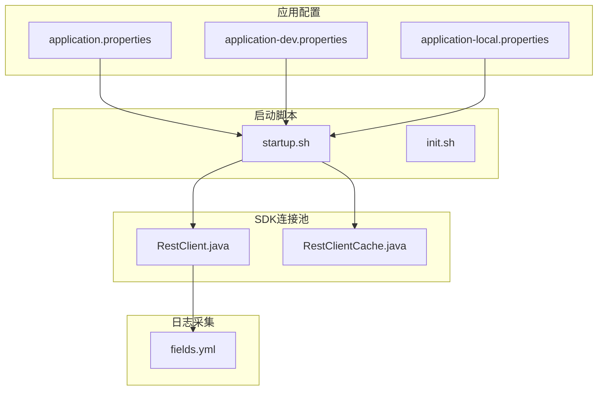
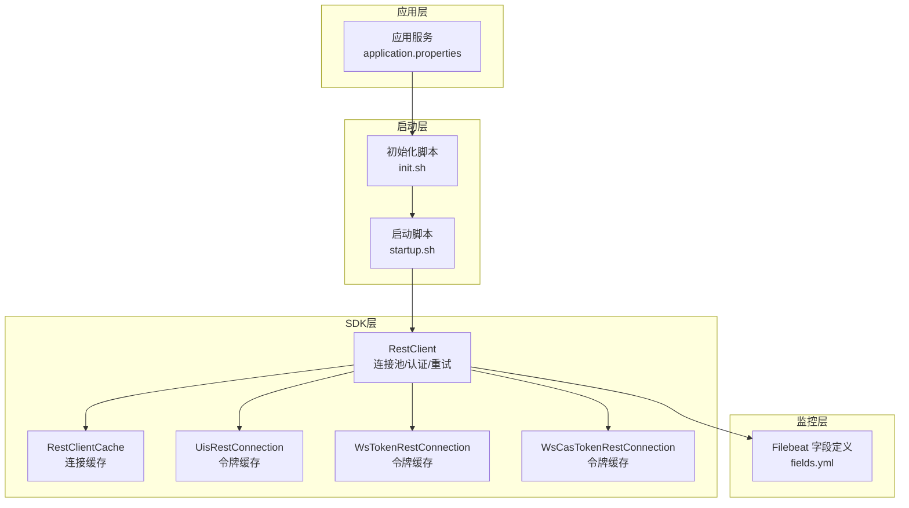
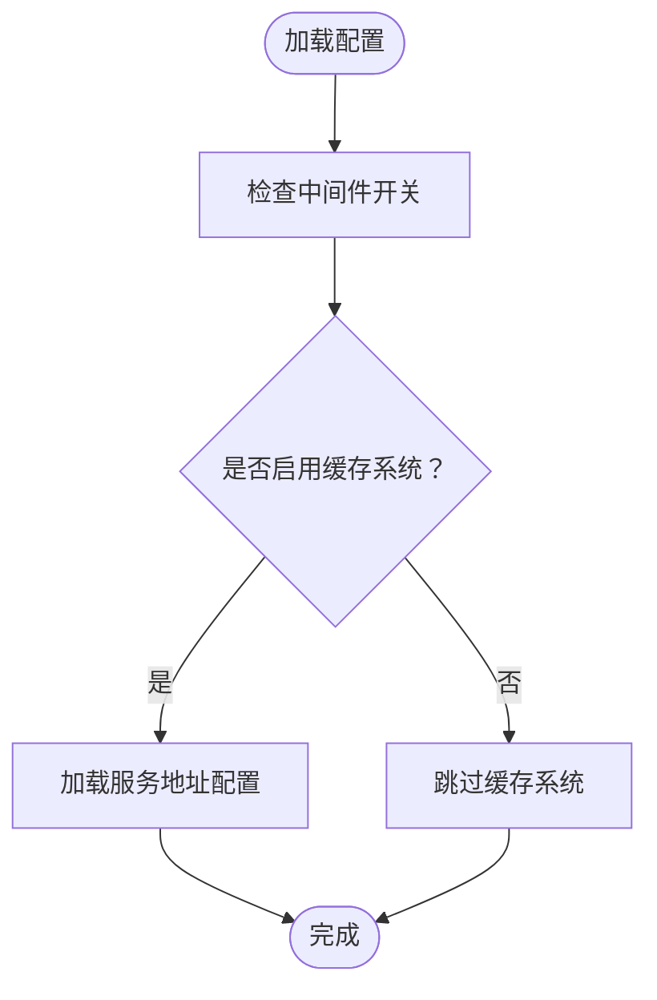
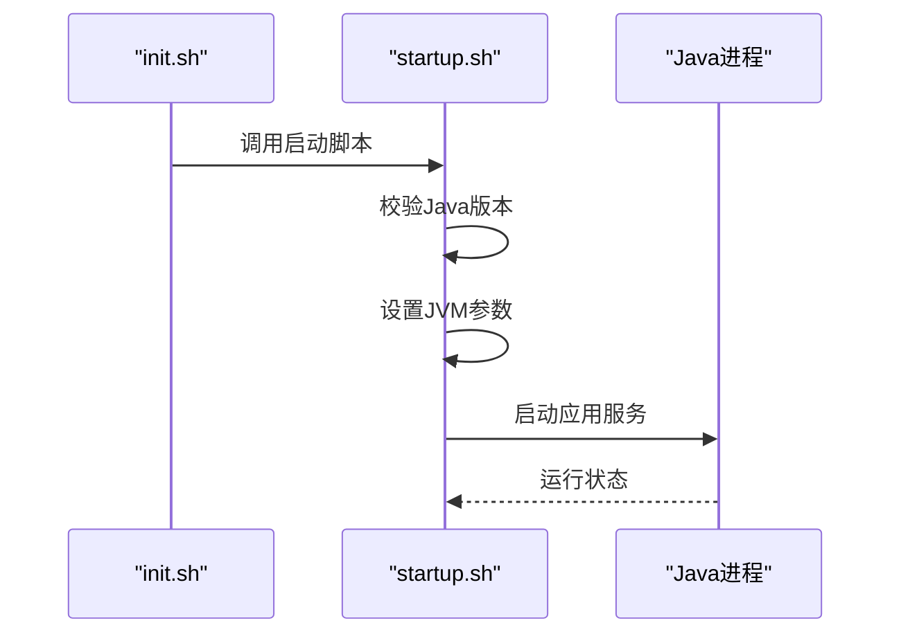
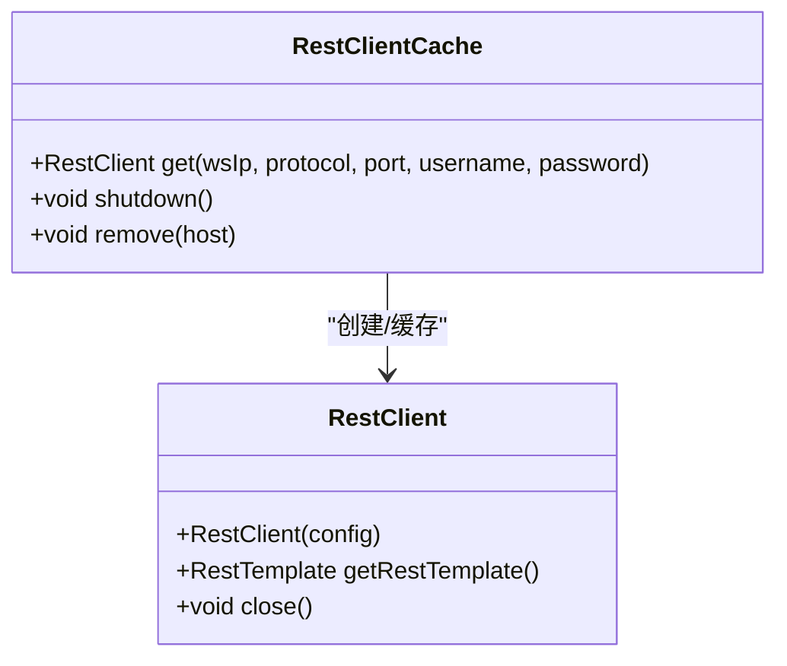
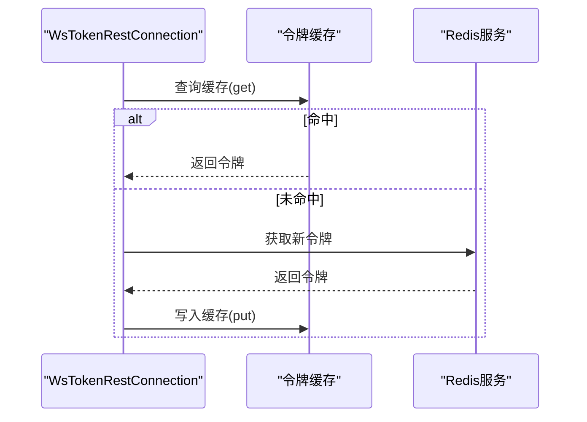

# 缓存系统安装

<cite>
**本文引用的文件**
- [application.properties](file://watcher-agent/src/main/resources/application.properties)
- [application-dev.properties](file://watcher-agent/src/main/resources/application-dev.properties)
- [application-local.properties](file://watcher-agent/src/main/resources/application-local.properties)
- [startup.sh](file://watcher-builder/assembly/bin/startup.sh)
- [init.sh](file://watcher-builder/assembly/bin/init.sh)
- [RestClient.java](file://watcher-sdk/src/main/java/com/virtual/cloud/om/sdk/config/rest/workspace/cache/RestClient.java)
- [RestClientCache.java](file://watcher-sdk/src/main/java/com/virtual/cloud/om/sdk/config/rest/workspace/cache/RestClientCache.java)
- [UisRestConnection.java](file://watcher-sdk/src/main/java/com/virtual/cloud/om/sdk/config/rest/uis/UisRestConnection.java)
- [WsTokenRestConnection.java](file://watcher-sdk/src/main/java/com/virtual/cloud/om/sdk/config/token/workspace/WsTokenRestConnection.java)
- [WsCasTokenRestConnection.java](file://watcher-sdk/src/main/java/com/virtual/cloud/om/sdk/config/token/workspace/WsCasTokenRestConnection.java)
- [fields.yml](file://watcher-builder/assembly/components/filebeat/filebeat-8.0.1-linux-x86_64/fields.yml)
</cite>

## 目录
1. [简介](#简介)
2. [项目结构](#项目结构)
3. [核心组件](#核心组件)
4. [架构总览](#架构总览)
5. [详细组件分析](#详细组件分析)
6. [依赖关系分析](#依赖关系分析)
7. [性能考量](#性能考量)
8. [故障排查指南](#故障排查指南)
9. [结论](#结论)
10. [附录](#附录)

## 简介
本指南面向在该代码库基础上部署与运维缓存系统的工程实践，重点覆盖以下方面：
- Redis安装、配置与持久化策略
- Redis集群部署与高可用配置
- 连接池配置与性能优化参数
- 缓存系统监控、备份与故障恢复策略

需要特别说明：仓库中未发现直接的Redis安装或配置脚本；但存在与“缓存”相关的字段定义与REST客户端连接池实现，可作为缓存系统集成与优化的参考。

## 项目结构
围绕缓存系统安装与配置，涉及以下关键目录与文件：
- 应用配置：用于控制中间件开关与服务地址，便于缓存系统接入
- 启动脚本：负责Java进程启动与JVM参数设置
- SDK连接池：封装HTTP连接池与REST调用，可作为缓存系统客户端的参考实现
- 日志采集：包含Redis相关字段定义，可用于监控与告警

**图表来源**
- [application.properties:1-80](file://watcher-agent/src/main/resources/application.properties#L1-L80)
- [application-dev.properties:1-72](file://watcher-agent/src/main/resources/application-dev.properties#L1-L72)
- [application-local.properties:1-61](file://watcher-agent/src/main/resources/application-local.properties#L1-L61)
- [startup.sh:1-81](file://watcher-builder/assembly/bin/startup.sh#L1-L81)
- [init.sh:1-35](file://watcher-builder/assembly/bin/init.sh#L1-L35)
- [RestClient.java:1-218](file://watcher-sdk/src/main/java/com/virtual/cloud/om/sdk/config/rest/workspace/cache/RestClient.java#L1-L218)
- [RestClientCache.java:1-62](file://watcher-sdk/src/main/java/com/virtual/cloud/om/sdk/config/rest/workspace/cache/RestClientCache.java#L1-L62)
- [fields.yml:13492-13527](file://watcher-builder/assembly/components/filebeat/filebeat-8.0.1-linux-x86_64/fields.yml#L13492-L13527)

**章节来源**
- [application.properties:1-80](file://watcher-agent/src/main/resources/application.properties#L1-L80)
- [application-dev.properties:1-72](file://watcher-agent/src/main/resources/application-dev.properties#L1-L72)
- [application-local.properties:1-61](file://watcher-agent/src/main/resources/application-local.properties#L1-L61)
- [startup.sh:1-81](file://watcher-builder/assembly/bin/startup.sh#L1-L81)
- [init.sh:1-35](file://watcher-builder/assembly/bin/init.sh#L1-L35)

## 核心组件
- 应用配置文件：通过属性开关控制中间件启用状态，便于在不同环境启用/禁用缓存系统
- 启动脚本：统一管理JVM内存、GC日志与进程启动方式
- REST连接池：基于Apache HttpClient实现连接池、认证、重试与消息转换器配置
- 日志采集字段：包含Redis相关字段，可用于监控与可视化

**章节来源**
- [application.properties:14-28](file://watcher-agent/src/main/resources/application.properties#L14-L28)
- [application-dev.properties:1-72](file://watcher-agent/src/main/resources/application-dev.properties#L1-L72)
- [application-local.properties:1-61](file://watcher-agent/src/main/resources/application-local.properties#L1-L61)
- [startup.sh:60-78](file://watcher-builder/assembly/bin/startup.sh#L60-L78)
- [RestClient.java:66-135](file://watcher-sdk/src/main/java/com/virtual/cloud/om/sdk/config/rest/workspace/cache/RestClient.java#L66-L135)
- [fields.yml:13492-13527](file://watcher-builder/assembly/components/filebeat/filebeat-8.0.1-linux-x86_64/fields.yml#L13492-L13527)

## 架构总览
下图展示缓存系统在本项目中的集成位置与交互关系：

**图表来源**
- [application.properties:1-80](file://watcher-agent/src/main/resources/application.properties#L1-L80)
- [init.sh:1-35](file://watcher-builder/assembly/bin/init.sh#L1-L35)
- [startup.sh:1-81](file://watcher-builder/assembly/bin/startup.sh#L1-L81)
- [RestClient.java:1-218](file://watcher-sdk/src/main/java/com/virtual/cloud/om/sdk/config/rest/workspace/cache/RestClient.java#L1-L218)
- [RestClientCache.java:1-62](file://watcher-sdk/src/main/java/com/virtual/cloud/om/sdk/config/rest/workspace/cache/RestClientCache.java#L1-L62)
- [UisRestConnection.java:36-52](file://watcher-sdk/src/main/java/com/virtual/cloud/om/sdk/config/rest/uis/UisRestConnection.java#L36-L52)
- [WsTokenRestConnection.java:36-52](file://watcher-sdk/src/main/java/com/virtual/cloud/om/sdk/config/token/workspace/WsTokenRestConnection.java#L36-L52)
- [WsCasTokenRestConnection.java:34-47](file://watcher-sdk/src/main/java/com/virtual/cloud/om/sdk/config/token/workspace/WsCasTokenRestConnection.java#L34-L47)
- [fields.yml:13492-13527](file://watcher-builder/assembly/components/filebeat/filebeat-8.0.1-linux-x86_64/fields.yml#L13492-L13527)

## 详细组件分析

### 组件A：应用配置与中间件开关
- 作用：集中管理中间件启用状态与服务地址，便于在不同环境启用缓存系统
- 关键点：
  - 中间件开关：如Elasticsearch、Kafka、MongoDB、ClickHouse、Quartz等默认禁用
  - 插件模块开关：CAS、UIS、Workspace、OneStor等按需启用
  - 数据源与MyBatis配置：MySQL单机版示例，便于缓存系统数据落盘

**图表来源**
- [application.properties:14-28](file://watcher-agent/src/main/resources/application.properties#L14-L28)
- [application-dev.properties:1-72](file://watcher-agent/src/main/resources/application-dev.properties#L1-L72)
- [application-local.properties:1-61](file://watcher-agent/src/main/resources/application-local.properties#L1-L61)

**章节来源**
- [application.properties:14-28](file://watcher-agent/src/main/resources/application.properties#L14-L28)
- [application-dev.properties:1-72](file://watcher-agent/src/main/resources/application-dev.properties#L1-L72)
- [application-local.properties:1-61](file://watcher-agent/src/main/resources/application-local.properties#L1-L61)

### 组件B：启动脚本与JVM参数
- 作用：统一Java版本校验、JVM内存与GC日志配置，确保缓存系统运行稳定
- 关键点：
  - Java版本要求与路径检测
  - JVM内存与GC日志参数
  - 进程启动与错误输出重定向

**图表来源**
- [init.sh:1-35](file://watcher-builder/assembly/bin/init.sh#L1-L35)
- [startup.sh:1-81](file://watcher-builder/assembly/bin/startup.sh#L1-L81)

**章节来源**
- [init.sh:1-35](file://watcher-builder/assembly/bin/init.sh#L1-L35)
- [startup.sh:1-81](file://watcher-builder/assembly/bin/startup.sh#L1-L81)

### 组件C：REST连接池与缓存
- 作用：封装HTTP连接池、认证、重试与消息转换器，适合作为缓存系统客户端的参考实现
- 关键点：
  - 连接池参数：最大连接数、每路由最大连接数
  - 认证与请求配置：Digest认证、Socket/连接超时
  - 重试策略：对无响应异常进行有限次数重试
  - 缓存策略：按主机与凭据组合缓存连接实例

**图表来源**
- [RestClient.java:55-135](file://watcher-sdk/src/main/java/com/virtual/cloud/om/sdk/config/rest/workspace/cache/RestClient.java#L55-L135)
- [RestClientCache.java:14-40](file://watcher-sdk/src/main/java/com/virtual/cloud/om/sdk/config/rest/workspace/cache/RestClientCache.java#L14-L40)

**章节来源**
- [RestClient.java:66-135](file://watcher-sdk/src/main/java/com/virtual/cloud/om/sdk/config/rest/workspace/cache/RestClient.java#L66-L135)
- [RestClientCache.java:22-40](file://watcher-sdk/src/main/java/com/virtual/cloud/om/sdk/config/rest/workspace/cache/RestClientCache.java#L22-L40)

### 组件D：令牌缓存与监控字段
- 作用：在内存中缓存令牌，减少重复获取；fields.yml中包含Redis相关字段，便于监控
- 关键点：
  - 令牌缓存：以资源与主机为键，避免频繁鉴权
  - Redis字段：角色、慢查询、缓存命中率等指标

**图表来源**
- [WsTokenRestConnection.java:36-52](file://watcher-sdk/src/main/java/com/virtual/cloud/om/sdk/config/token/workspace/WsTokenRestConnection.java#L36-L52)
- [UisRestConnection.java:65-92](file://watcher-sdk/src/main/java/com/virtual/cloud/om/sdk/config/rest/uis/UisRestConnection.java#L65-L92)
- [fields.yml:13492-13527](file://watcher-builder/assembly/components/filebeat/filebeat-8.0.1-linux-x86_64/fields.yml#L13492-L13527)

**章节来源**
- [WsTokenRestConnection.java:36-52](file://watcher-sdk/src/main/java/com/virtual/cloud/om/sdk/config/token/workspace/WsTokenRestConnection.java#L36-L52)
- [UisRestConnection.java:65-92](file://watcher-sdk/src/main/java/com/virtual/cloud/om/sdk/config/rest/uis/UisRestConnection.java#L65-L92)
- [fields.yml:13492-13527](file://watcher-builder/assembly/components/filebeat/filebeat-8.0.1-linux-x86_64/fields.yml#L13492-L13527)

## 依赖关系分析
- 配置文件驱动中间件与服务启用状态
- 启动脚本提供JVM运行环境
- SDK连接池为缓存系统客户端提供统一HTTP能力
- 日志字段定义支撑监控与可视化

**图表来源**
- [application.properties:1-80](file://watcher-agent/src/main/resources/application.properties#L1-L80)
- [startup.sh:60-78](file://watcher-builder/assembly/bin/startup.sh#L60-L78)
- [RestClient.java:147-168](file://watcher-sdk/src/main/java/com/virtual/cloud/om/sdk/config/rest/workspace/cache/RestClient.java#L147-L168)
- [fields.yml:13492-13527](file://watcher-builder/assembly/components/filebeat/filebeat-8.0.1-linux-x86_64/fields.yml#L13492-L13527)

**章节来源**
- [application.properties:1-80](file://watcher-agent/src/main/resources/application.properties#L1-L80)
- [startup.sh:60-78](file://watcher-builder/assembly/bin/startup.sh#L60-L78)
- [RestClient.java:147-168](file://watcher-sdk/src/main/java/com/virtual/cloud/om/sdk/config/rest/workspace/cache/RestClient.java#L147-L168)
- [fields.yml:13492-13527](file://watcher-builder/assembly/components/filebeat/filebeat-8.0.1-linux-x86_64/fields.yml#L13492-L13527)

## 性能考量
- 连接池参数
  - 最大连接数与每路由最大连接数：建议与业务并发匹配，避免阻塞
  - Socket配置：TCP快速确认、缓冲区大小等
  - 超时设置：Socket超时、连接超时、连接请求超时
- 重试策略
  - 对网络瞬断进行有限次数重试，避免雪崩
- JVM参数
  - 合理设置堆大小与GC日志轮转，保障长稳运行

**章节来源**
- [RestClient.java:66-135](file://watcher-sdk/src/main/java/com/virtual/cloud/om/sdk/config/rest/workspace/cache/RestClient.java#L66-L135)
- [startup.sh:60-78](file://watcher-builder/assembly/bin/startup.sh#L60-L78)

## 故障排查指南
- 中间件开关
  - 确认缓存系统相关中间件开关与服务地址已正确配置
- 启动问题
  - 检查Java版本与JVM参数，查看错误输出日志
- 连接问题
  - 核对连接池参数、超时设置与重试策略
  - 关注令牌缓存命中情况，避免频繁鉴权
- 监控告警
  - 利用Redis相关字段进行指标采集与可视化

**章节来源**
- [application.properties:14-28](file://watcher-agent/src/main/resources/application.properties#L14-L28)
- [init.sh:1-35](file://watcher-builder/assembly/bin/init.sh#L1-L35)
- [startup.sh:1-81](file://watcher-builder/assembly/bin/startup.sh#L1-L81)
- [RestClient.java:108-121](file://watcher-sdk/src/main/java/com/virtual/cloud/om/sdk/config/rest/workspace/cache/RestClient.java#L108-L121)
- [WsTokenRestConnection.java:36-52](file://watcher-sdk/src/main/java/com/virtual/cloud/om/sdk/config/token/workspace/WsTokenRestConnection.java#L36-L52)
- [fields.yml:13492-13527](file://watcher-builder/assembly/components/filebeat/filebeat-8.0.1-linux-x86_64/fields.yml#L13492-L13527)

## 结论
本指南基于现有配置与SDK实现，给出了缓存系统安装与配置的实施要点。对于Redis的具体安装与集群部署，建议结合实际运维环境另行准备官方文档与自动化脚本，并在此基础上利用本项目的配置与SDK能力进行集成与优化。

## 附录
- Redis安装与配置建议
  - 下载与编译：使用官方发行版，按生产环境最小权限原则部署
  - 基础配置：端口、绑定地址、密码认证、日志与PID文件
  - 持久化策略：RDB快照与AOF追加优先级选择，同步策略与fsync频率
  - 集群部署：节点规划、槽位分配、主从复制与哨兵/集群模式选择
  - 连接池与性能：最大连接数、空闲超时、命令超时、管道化与批处理
  - 监控与备份：关键指标采集（内存、连接、延迟、命中率）、周期性备份与恢复演练
  - 故障恢复：主从切换、分片迁移、数据修复与回滚预案