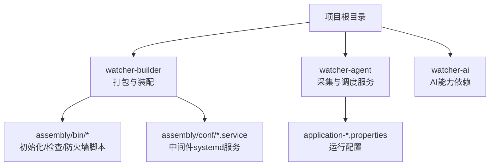
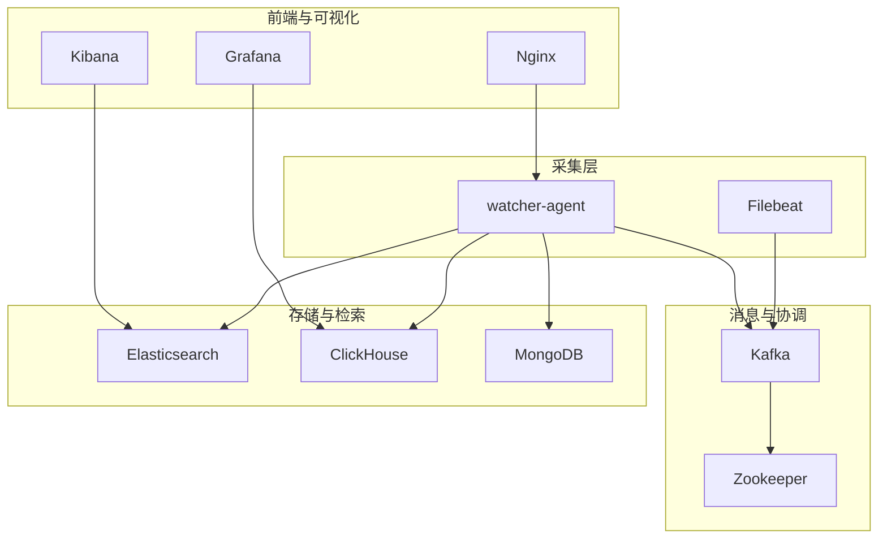
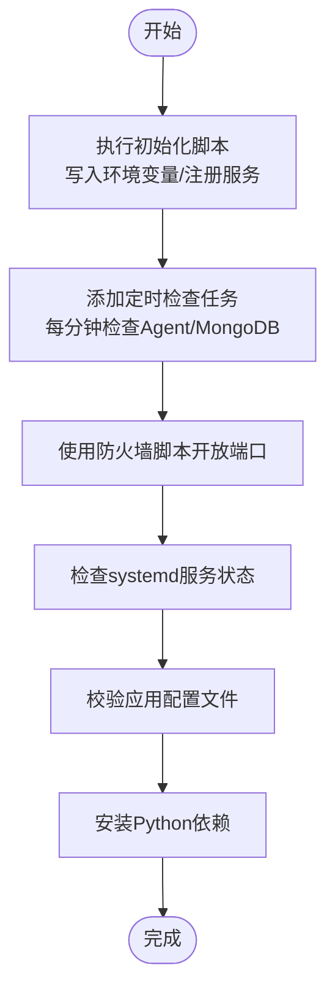
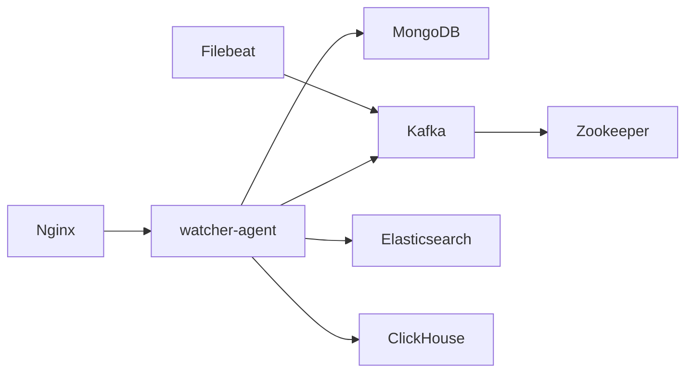

# 环境准备

<cite>
**本文引用的文件**
- [Readme.md](file://Readme.md)
- [watcher-builder/pom.xml](file://watcher-builder/pom.xml)
- [watcher-builder/assembly/bin/check.sh](file://watcher-builder/assembly/bin/check.sh)
- [watcher-builder/assembly/bin/init.sh](file://watcher-builder/assembly/bin/init.sh)
- [watcher-builder/assembly/bin/openfirewalld.sh](file://watcher-builder/assembly/bin/openfirewalld.sh)
- [watcher-builder/assembly/conf/kafka.service](file://watcher-builder/assembly/conf/kafka.service)
- [watcher-builder/assembly/conf/mongodb.service](file://watcher-builder/assembly/conf/mongodb.service)
- [watcher-builder/assembly/conf/nginx.service](file://watcher-builder/assembly/conf/nginx.service)
- [watcher-builder/assembly/conf/zookeeper.service](file://watcher-builder/assembly/conf/zookeeper.service)
- [watcher-agent/src/main/resources/application-prod.properties](file://watcher-agent/src/main/resources/application-prod.properties)
- [watcher-agent/src/main/resources/application-dev.properties](file://watcher-agent/src/main/resources/application-dev.properties)
- [watcher-agent/src/main/resources/application-local.properties](file://watcher-agent/src/main/resources/application-local.properties)
- [watcher-ai/requirements.txt](file://watcher-ai/requirements.txt)
</cite>

## 目录
1. [简介](#简介)
2. [项目结构](#项目结构)
3. [核心组件](#核心组件)
4. [架构总览](#架构总览)
5. [详细组件分析](#详细组件分析)
6. [依赖分析](#依赖分析)
7. [性能考虑](#性能考虑)
8. [故障排查指南](#故障排查指南)
9. [结论](#结论)
10. [附录](#附录)

## 简介
本文件面向ShowTime监控系统的部署与运维团队，提供从硬件配置、操作系统兼容性、网络规划、软件依赖到环境验证与故障排查的完整准备指南。依据仓库中的技术栈声明、打包与启动脚本、系统服务配置以及各模块的配置文件，整理出可执行的环境准备清单与验证步骤，帮助在生产环境中稳定部署与运行。

## 项目结构
围绕环境准备的关键工程与脚本分布如下：
- 核心技术栈与模块说明来自项目自述文件
- 打包与装配逻辑集中在watcher-builder模块
- 各中间件以systemd服务形式管理，位于assembly/conf目录
- Agent运行时配置分别提供开发、本地与生产三套示例
- AI相关依赖位于watcher-ai/requirements.txt

图表来源
- [Readme.md:11-26](file://Readme.md#L11-L26)
- [watcher-builder/pom.xml:15-210](file://watcher-builder/pom.xml#L15-L210)
- [watcher-builder/assembly/bin/init.sh:1-35](file://watcher-builder/assembly/bin/init.sh#L1-L35)
- [watcher-builder/assembly/conf/kafka.service:1-14](file://watcher-builder/assembly/conf/kafka.service#L1-L14)
- [watcher-agent/src/main/resources/application-prod.properties:1-70](file://watcher-agent/src/main/resources/application-prod.properties#L1-L70)

章节来源
- [Readme.md:11-26](file://Readme.md#L11-L26)
- [watcher-builder/pom.xml:15-210](file://watcher-builder/pom.xml#L15-L210)

## 核心组件
- 中间件与服务
  - MongoDB：用于数据持久化
  - Kafka：消息引擎
  - Zookeeper：Kafka协调
  - Nginx：前端或反向代理
  - Elasticsearch：全文检索
  - ClickHouse：列式数据库
- 应用服务
  - watcher-agent：采集、资源管理、定时任务、日志策略下发
  - performer-service：监控数据查询与展示（对接ClickHouse）
- 辅助组件
  - Filebeat：日志采集
  - Kibana：ES可视化
  - Grafana：报表
  - Prometheus SDK/elastic-apm-agent（待实现）

章节来源
- [Readme.md:11-26](file://Readme.md#L11-L26)
- [watcher-agent/src/main/resources/application-prod.properties:3-30](file://watcher-agent/src/main/resources/application-prod.properties#L3-L30)

## 架构总览
下图展示了系统在生产环境中的典型部署形态：Agent作为采集与调度节点，依赖MongoDB、Kafka/Zookeeper、Elasticsearch、ClickHouse；Nginx提供访问入口；Filebeat负责日志采集；Kibana/Grafana提供可视化。

图表来源
- [Readme.md:11-26](file://Readme.md#L11-L26)
- [watcher-builder/assembly/conf/kafka.service:1-14](file://watcher-builder/assembly/conf/kafka.service#L1-L14)
- [watcher-builder/assembly/conf/mongodb.service:1-14](file://watcher-builder/assembly/conf/mongodb.service#L1-L14)
- [watcher-builder/assembly/conf/nginx.service:1-14](file://watcher-builder/assembly/conf/nginx.service#L1-L14)
- [watcher-builder/assembly/conf/zookeeper.service:1-14](file://watcher-builder/assembly/conf/zookeeper.service#L1-L14)

## 详细组件分析

### 硬件配置要求
- CPU
  - 建议：至少4核CPU，以满足采集、消息处理与数据库并发需求
  - 最低：2核CPU，仅适用于轻量采集与单机部署场景
- 内存
  - 建议：8 GB及以上，用于Agent、中间件与数据库缓存
  - 最低：4 GB，适用于最小化部署与测试环境
- 存储空间
  - 建议：100 GB以上可用空间，考虑日志与索引增长
  - 最低：50 GB，满足基础运行与短期留存

说明
- 上述建议基于项目README中“分配4核8G内存”的运行示例与中间件（MongoDB、Kafka、Elasticsearch、ClickHouse）对资源的一般性需求综合得出。

章节来源
- [Readme.md:40-45](file://Readme.md#L40-L45)

### 操作系统兼容性
- Linux发行版
  - 推荐：CentOS 7+/Rocky 8+/Ubuntu 20.04+ 或兼容的商业发行版
  - 要求：支持systemd、firewalld、sshd配置
- 内核版本
  - 建议：内核版本较新，以获得稳定的systemd与网络子系统支持
- 系统依赖
  - systemd：用于管理中间件服务
  - firewalld：用于开放必要端口
  - openssh-server：用于远程维护与自动化

章节来源
- [watcher-builder/assembly/bin/init.sh:27-28](file://watcher-builder/assembly/bin/init.sh#L27-L28)
- [watcher-builder/assembly/bin/openfirewalld.sh:1-21](file://watcher-builder/assembly/bin/openfirewalld.sh#L1-L21)

### 网络规划指南
- 端口开放
  - Nginx：TCP 80（示例）
  - MongoDB：TCP 27017（示例）
  - Kafka：TCP 9092（示例）
  - Zookeeper：TCP 2181（示例）
  - Elasticsearch：TCP 9200（示例）
  - ClickHouse：TCP 8123（示例）
  - 其他：UIS/CAS/OneStor等插件端口按配置文件暴露
- 防火墙配置
  - 使用openfirewalld脚本进行端口放行与规则持久化
  - 示例脚本已包含对VRRP组播与特定源IP的放行规则
- 网络安全策略
  - 建议：仅对受信任网段放行插件端口
  - 建议：启用SSH密钥认证，限制root直连
  - 建议：对ES/Kafka等中间件启用认证与TLS（如需）

章节来源
- [watcher-builder/assembly/bin/openfirewalld.sh:12-20](file://watcher-builder/assembly/bin/openfirewalld.sh#L12-L20)
- [watcher-agent/src/main/resources/application-prod.properties:33-70](file://watcher-agent/src/main/resources/application-prod.properties#L33-L70)
- [watcher-agent/src/main/resources/application-dev.properties:33-70](file://watcher-agent/src/main/resources/application-dev.properties#L33-L70)

### 软件依赖环境
- JDK
  - 说明：打包与运行基于Spring Boot，需JDK支持
  - 建议：JDK 17+（与Spring Boot版本匹配）
  - 备注：watcher-builder未自动安装JDK，请手动安装并配置JAVA_HOME
- 数据库
  - MongoDB：副本集配置已在应用配置中声明
  - ClickHouse：通过配置项指定端点、用户与数据库
- 消息队列
  - Kafka + Zookeeper：服务单元文件已提供
- 搜索与可视化
  - Elasticsearch：配置用户名、密码、主机与端口
  - Kibana：用于ES可视化（仓库包含技术栈说明）
  - Grafana：用于报表（仓库包含技术栈说明）
- 文件采集
  - Filebeat：用于日志采集（仓库包含技术栈说明）

章节来源
- [Readme.md:14-26](file://Readme.md#L14-L26)
- [watcher-builder/assembly/conf/kafka.service:1-14](file://watcher-builder/assembly/conf/kafka.service#L1-L14)
- [watcher-builder/assembly/conf/zookeeper.service:1-14](file://watcher-builder/assembly/conf/zookeeper.service#L1-L14)
- [watcher-agent/src/main/resources/application-prod.properties:3-30](file://watcher-agent/src/main/resources/application-prod.properties#L3-L30)
- [watcher-agent/src/main/resources/application-prod.properties:65-70](file://watcher-agent/src/main/resources/application-prod.properties#L65-L70)

### 环境验证清单与预检脚本
- 初始化与服务注册
  - 执行初始化脚本，设置环境变量并注册为系统服务
  - 自动添加定时检查任务，每分钟检测Agent与MongoDB状态
- 端口连通性
  - 使用防火墙脚本开放所需端口，并验证连通性
- 中间件健康检查
  - 检查systemd服务状态（Kafka、Zookeeper、MongoDB、Nginx）
- 应用配置校验
  - 校验应用配置文件中的中间件地址、端口与凭据
- AI能力依赖
  - 安装Python依赖（fastmcp、httpx、pydantic、python-dotenv）

图表来源
- [watcher-builder/assembly/bin/init.sh:17-28](file://watcher-builder/assembly/bin/init.sh#L17-L28)
- [watcher-builder/assembly/bin/check.sh:1-27](file://watcher-builder/assembly/bin/check.sh#L1-L27)
- [watcher-builder/assembly/bin/openfirewalld.sh:8-20](file://watcher-builder/assembly/bin/openfirewalld.sh#L8-L20)
- [watcher-ai/requirements.txt:1-5](file://watcher-ai/requirements.txt#L1-L5)

章节来源
- [watcher-builder/assembly/bin/init.sh:17-28](file://watcher-builder/assembly/bin/init.sh#L17-L28)
- [watcher-builder/assembly/bin/check.sh:1-27](file://watcher-builder/assembly/bin/check.sh#L1-L27)
- [watcher-builder/assembly/bin/openfirewalld.sh:8-20](file://watcher-builder/assembly/bin/openfirewalld.sh#L8-L20)
- [watcher-ai/requirements.txt:1-5](file://watcher-ai/requirements.txt#L1-L5)

## 依赖分析
- 组件耦合关系
  - watcher-agent依赖MongoDB、Kafka/Zookeeper、Elasticsearch、ClickHouse
  - Nginx作为入口，转发至Agent或其他后端
  - Filebeat将日志发送至Kafka
- 外部依赖
  - JDK、systemd、firewalld、openssh-server
  - Python（AI模块）

图表来源
- [watcher-builder/assembly/conf/kafka.service:1-14](file://watcher-builder/assembly/conf/kafka.service#L1-L14)
- [watcher-builder/assembly/conf/zookeeper.service:1-14](file://watcher-builder/assembly/conf/zookeeper.service#L1-L14)
- [watcher-builder/assembly/conf/mongodb.service:1-14](file://watcher-builder/assembly/conf/mongodb.service#L1-L14)
- [watcher-builder/assembly/conf/nginx.service:1-14](file://watcher-builder/assembly/conf/nginx.service#L1-L14)
- [watcher-agent/src/main/resources/application-prod.properties:3-30](file://watcher-agent/src/main/resources/application-prod.properties#L3-L30)

章节来源
- [watcher-builder/pom.xml:15-210](file://watcher-builder/pom.xml#L15-L210)
- [watcher-agent/src/main/resources/application-prod.properties:3-30](file://watcher-agent/src/main/resources/application-prod.properties#L3-L30)

## 性能考虑
- 中间件资源分配
  - MongoDB：建议独立磁盘与足够内存，开启副本集提升可用性
  - Kafka：合理设置分区与副本，避免单点瓶颈
  - Elasticsearch：为索引与查询预留充足堆内存与磁盘IO
  - ClickHouse：针对列式查询优化磁盘与压缩策略
- 系统级调优
  - 关闭不必要的服务与防火墙策略，减少系统开销
  - 合理设置Agent采集频率与批量上传参数，平衡实时性与资源占用
- 可视化与报表
  - Grafana与Kibana的查询负载应与ClickHouse/Elasticsearch的扩展能力相匹配

## 故障排查指南
- Agent与MongoDB状态异常
  - 现象：定时检查脚本发现进程不在
  - 处理：根据检查脚本自动尝试重启Agent或MongoDB
- 端口不可达
  - 现象：外部无法访问Nginx/插件端口
  - 处理：执行防火墙脚本开放端口并重载规则
- 系统服务未启动
  - 现象：systemd服务状态异常
  - 处理：检查服务单元文件路径与执行脚本，确认环境变量与依赖
- 配置错误
  - 现象：连接超时或认证失败
  - 处理：核对应用配置文件中的地址、端口、用户名与密码
- SSH算法兼容性
  - 现象：连接被拒绝或算法不被接受
  - 处理：根据初始化脚本追加KexAlgorithms并重启sshd

章节来源
- [watcher-builder/assembly/bin/check.sh:1-27](file://watcher-builder/assembly/bin/check.sh#L1-L27)
- [watcher-builder/assembly/bin/openfirewalld.sh:12-20](file://watcher-builder/assembly/bin/openfirewalld.sh#L12-L20)
- [watcher-builder/assembly/bin/init.sh:24-25](file://watcher-builder/assembly/bin/init.sh#L24-L25)
- [watcher-agent/src/main/resources/application-prod.properties:3-30](file://watcher-agent/src/main/resources/application-prod.properties#L3-L30)

## 结论
通过本指南，可在Linux环境下完成ShowTime监控系统的软硬件准备与部署验证。建议优先满足CPU/内存/存储的最低配置，按需提升至推荐规格；严格遵循网络与安全策略；在生产前完成初始化脚本与配置校验；并建立定期巡检机制以保障系统稳定运行。

## 附录
- 端口对照表（示例）
  - Nginx：80
  - MongoDB：27017
  - Kafka：9092
  - Zookeeper：2181
  - Elasticsearch：9200
  - ClickHouse：8123
  - UIS：7070（示例）
  - CAS：8080/8443（示例）
  - OneStor：80/443（示例）

章节来源
- [watcher-builder/assembly/bin/openfirewalld.sh:18-19](file://watcher-builder/assembly/bin/openfirewalld.sh#L18-L19)
- [watcher-agent/src/main/resources/application-prod.properties:33-70](file://watcher-agent/src/main/resources/application-prod.properties#L33-L70)
- [watcher-agent/src/main/resources/application-dev.properties:33-70](file://watcher-agent/src/main/resources/application-dev.properties#L33-L70)