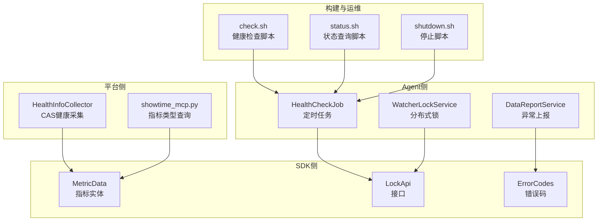
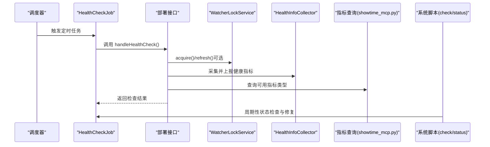
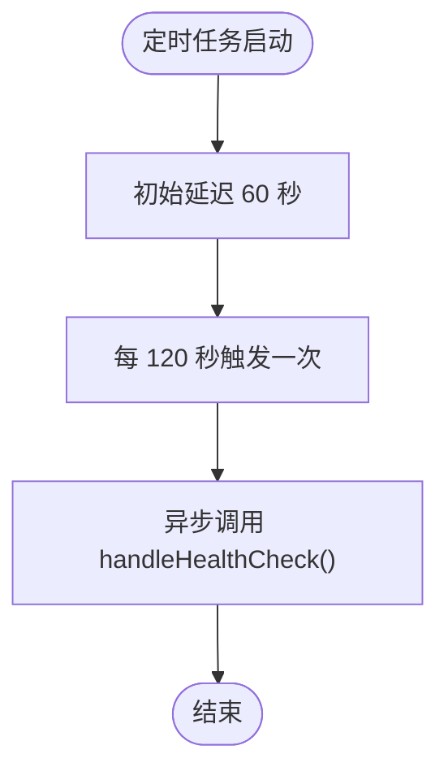
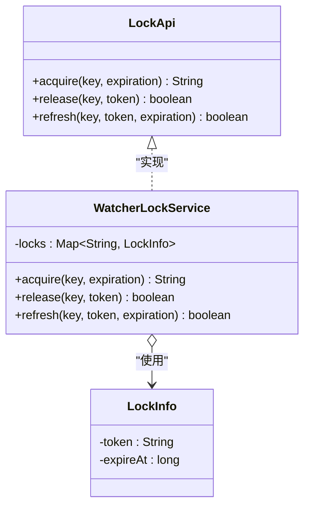
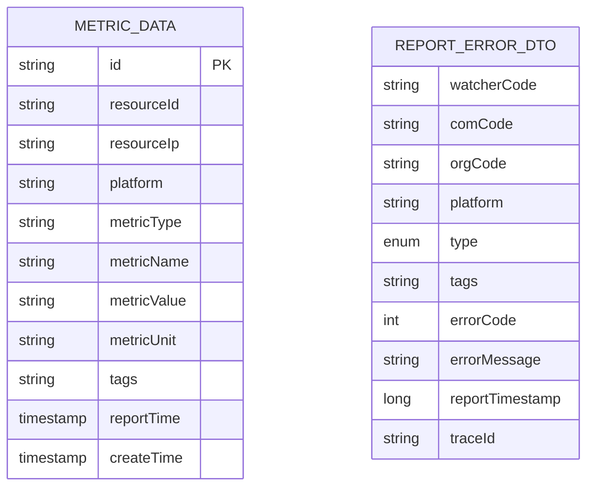
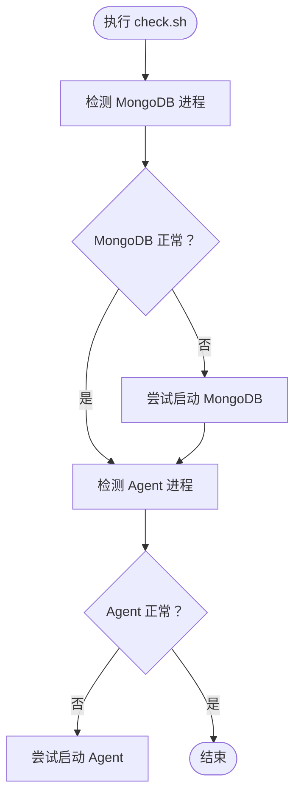
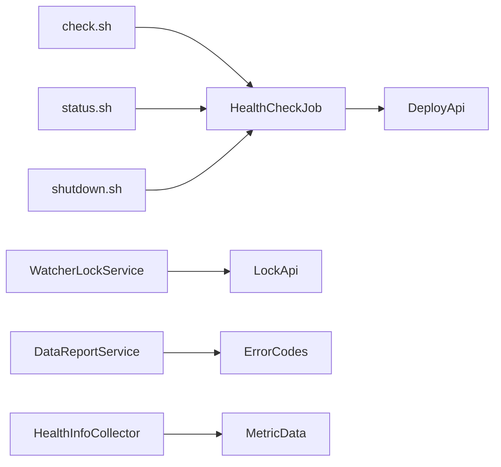

# 健康检查与状态监控

<cite>
**本文引用的文件**
- [HealthCheckJob.java](file://watcher-agent/src/main/java/com/virtual/cloud/om/agent/task/job/HealthCheckJob.java)
- [WatcherLockService.java](file://watcher-agent/src/main/java/com/virtual/cloud/om/agent/service/lock/WatcherLockService.java)
- [LockApi.java](file://watcher-sdk/src/main/java/com/virtual/cloud/om/sdk/api/LockApi.java)
- [WatcherBasicInfoDTO.java](file://watcher-sdk/src/main/java/com/virtual/cloud/om/sdk/dto/dataReport/watcher/WatcherBasicInfoDTO.java)
- [MetricData.java](file://watcher-sdk/src/main/java/com/virtual/cloud/om/sdk/entity/mysql/MetricData.java)
- [check.sh](file://watcher-builder/assembly/bin/check.sh)
- [status.sh](file://watcher-builder/assembly/bin/status.sh)
- [shutdown.sh](file://watcher-builder/assembly/bin/shutdown.sh)
- [quartz.properties](file://watcher-agent/src/main/resources/quartz.properties)
- [DataReportService.java](file://watcher-agent/src/main/java/com/virtual/cloud/om/agent/service/report/DataReportService.java)
- [ErrorCodes.java](file://watcher-sdk/src/main/java/com/virtual/cloud/om/sdk/exception/ErrorCodes.java)
- [HealthInfoCollector.java](file://watcher-cas/src/main/java/com/virtual/cloud/om/cas/service/report/HealthInfoCollector.java)
- [showtime_mcp.py](file://watcher-ai/src/showtime_mcp.py)
</cite>

## 目录
1. [简介](#简介)
2. [项目结构](#项目结构)
3. [核心组件](#核心组件)
4. [架构总览](#架构总览)
5. [详细组件分析](#详细组件分析)
6. [依赖关系分析](#依赖关系分析)
7. [性能考量](#性能考量)
8. [故障排查指南](#故障排查指南)
9. [结论](#结论)
10. [附录](#附录)

## 简介
本文件聚焦于系统的健康检查与状态监控机制，围绕以下目标展开：
- 解释 HealthCheckJob 定时任务的工作流程与检查逻辑
- 说明服务状态监控的关键指标（CPU 使用率、内存占用、磁盘空间、网络连接状态）的采集与上报方式
- 阐述 WatcherLockService 锁机制在系统健康中的作用及如何通过状态检查防止系统异常
- 提供健康检查配置参数（检查间隔、超时、重试策略）的说明
- 给出常见健康问题的识别方法与自动恢复机制
- 提供实际监控示例与故障排除步骤

## 项目结构
本仓库包含多个模块，与健康检查与状态监控直接相关的核心位置如下：
- watcher-agent：运行期健康检查任务、分布式锁服务、状态上报等
- watcher-sdk：统一接口与实体定义（如 LockApi、MetricData、错误码）
- watcher-cas：CAS 平台健康信息采集器
- watcher-ai：指标类型查询工具
- watcher-builder：系统级健康脚本（进程状态检查与自动修复）

图表来源
- [HealthCheckJob.java:1-35](file://watcher-agent/src/main/java/com/virtual/cloud/om/agent/task/job/HealthCheckJob.java#L1-L35)
- [WatcherLockService.java:1-70](file://watcher-agent/src/main/java/com/virtual/cloud/om/agent/service/lock/WatcherLockService.java#L1-L70)
- [LockApi.java:1-30](file://watcher-sdk/src/main/java/com/virtual/cloud/om/sdk/api/LockApi.java#L1-L30)
- [MetricData.java:1-42](file://watcher-sdk/src/main/java/com/virtual/cloud/om/sdk/entity/mysql/MetricData.java#L1-L42)
- [DataReportService.java:306-333](file://watcher-agent/src/main/java/com/virtual/cloud/om/agent/service/report/DataReportService.java#L306-L333)
- [HealthInfoCollector.java:1-74](file://watcher-cas/src/main/java/com/virtual/cloud/om/cas/service/report/HealthInfoCollector.java#L1-L74)
- [showtime_mcp.py:327-556](file://watcher-ai/src/showtime_mcp.py#L327-L556)
- [check.sh:1-20](file://watcher-builder/assembly/bin/check.sh#L1-L20)
- [status.sh:1-9](file://watcher-builder/assembly/bin/status.sh#L1-L9)
- [shutdown.sh:1-24](file://watcher-builder/assembly/bin/shutdown.sh#L1-L24)

章节来源
- [HealthCheckJob.java:1-35](file://watcher-agent/src/main/java/com/virtual/cloud/om/agent/task/job/HealthCheckJob.java#L1-L35)
- [WatcherLockService.java:1-70](file://watcher-agent/src/main/java/com/virtual/cloud/om/agent/service/lock/WatcherLockService.java#L1-L70)
- [LockApi.java:1-30](file://watcher-sdk/src/main/java/com/virtual/cloud/om/sdk/api/LockApi.java#L1-L30)
- [MetricData.java:1-42](file://watcher-sdk/src/main/java/com/virtual/cloud/om/sdk/entity/mysql/MetricData.java#L1-L42)
- [DataReportService.java:306-333](file://watcher-agent/src/main/java/com/virtual/cloud/om/agent/service/report/DataReportService.java#L306-L333)
- [HealthInfoCollector.java:1-74](file://watcher-cas/src/main/java/com/virtual/cloud/om/cas/service/report/HealthInfoCollector.java#L1-L74)
- [showtime_mcp.py:327-556](file://watcher-ai/src/showtime_mcp.py#L327-L556)
- [check.sh:1-20](file://watcher-builder/assembly/bin/check.sh#L1-L20)
- [status.sh:1-9](file://watcher-builder/assembly/bin/status.sh#L1-L9)
- [shutdown.sh:1-24](file://watcher-builder/assembly/bin/shutdown.sh#L1-L24)

## 核心组件
- HealthCheckJob：基于 Spring 的定时任务，周期性触发健康检查，调用部署接口执行检查逻辑
- WatcherLockService：在单机 MySQL 场景下提供的内存级分布式锁实现，支持获取、释放与刷新
- LockApi：锁接口定义，抽象了 acquire/release/refresh 三类操作
- MetricData：指标数据实体，承载资源指标的存储结构
- DataReportService：异常上报能力，用于记录与追踪监控或采集过程中的错误
- HealthInfoCollector：CAS 平台健康信息采集器，负责上报健康类指标
- showtime_mcp.py：提供指标类型查询能力，便于了解可用指标类别（CPU、内存、磁盘、网络等）
- 构建脚本：check.sh/status.sh/shutdown.sh 提供系统级健康检查与自动修复能力

章节来源
- [HealthCheckJob.java:1-35](file://watcher-agent/src/main/java/com/virtual/cloud/om/agent/task/job/HealthCheckJob.java#L1-L35)
- [WatcherLockService.java:1-70](file://watcher-agent/src/main/java/com/virtual/cloud/om/agent/service/lock/WatcherLockService.java#L1-L70)
- [LockApi.java:1-30](file://watcher-sdk/src/main/java/com/virtual/cloud/om/sdk/api/LockApi.java#L1-L30)
- [MetricData.java:1-42](file://watcher-sdk/src/main/java/com/virtual/cloud/om/sdk/entity/mysql/MetricData.java#L1-L42)
- [DataReportService.java:306-333](file://watcher-agent/src/main/java/com/virtual/cloud/om/agent/service/report/DataReportService.java#L306-L333)
- [HealthInfoCollector.java:1-74](file://watcher-cas/src/main/java/com/virtual/cloud/om/cas/service/report/HealthInfoCollector.java#L1-L74)
- [showtime_mcp.py:327-556](file://watcher-ai/src/showtime_mcp.py#L327-L556)
- [check.sh:1-20](file://watcher-builder/assembly/bin/check.sh#L1-L20)
- [status.sh:1-9](file://watcher-builder/assembly/bin/status.sh#L1-L9)
- [shutdown.sh:1-24](file://watcher-builder/assembly/bin/shutdown.sh#L1-L24)

## 架构总览
系统健康检查与状态监控由“定时任务 + 分布式锁 + 指标采集/上报 + 系统脚本”构成的闭环体系：
- 定时任务周期触发健康检查，调用部署接口执行检查
- 分布式锁保障关键检查动作的互斥与幂等
- 指标采集器与 AI 工具提供指标类型与趋势查询
- 异常上报组件记录错误，便于追踪与恢复
- 系统脚本负责进程级健康检查与自动修复

图表来源
- [HealthCheckJob.java:26-34](file://watcher-agent/src/main/java/com/virtual/cloud/om/agent/task/job/HealthCheckJob.java#L26-L34)
- [WatcherLockService.java:33-68](file://watcher-agent/src/main/java/com/virtual/cloud/om/agent/service/lock/WatcherLockService.java#L33-L68)
- [HealthInfoCollector.java:29-74](file://watcher-cas/src/main/java/com/virtual/cloud/om/cas/service/report/HealthInfoCollector.java#L29-L74)
- [showtime_mcp.py:327-556](file://watcher-ai/src/showtime_mcp.py#L327-L556)
- [check.sh:1-20](file://watcher-builder/assembly/bin/check.sh#L1-L20)

## 详细组件分析

### HealthCheckJob 定时任务
- 触发机制：使用 @Scheduled 注解，初始延迟 60 秒，固定周期 120 秒（每 2 分钟）
- 执行内容：异步调用部署接口的 handleHealthCheck()，用于执行系统健康检查
- 影响范围：影响整体系统健康状态的采集与上报节奏

图表来源
- [HealthCheckJob.java:26-34](file://watcher-agent/src/main/java/com/virtual/cloud/om/agent/task/job/HealthCheckJob.java#L26-L34)

章节来源
- [HealthCheckJob.java:1-35](file://watcher-agent/src/main/java/com/virtual/cloud/om/agent/task/job/HealthCheckJob.java#L1-L35)

### WatcherLockService 分布式锁
- 设计目的：在单机 MySQL 场景下提供内存级分布式锁，避免并发冲突
- 关键能力：
  - acquire(key, expiration)：获取锁；若存在未过期锁则返回空
  - release(key, token)：释放锁；需匹配 token
  - refresh(key, token, expiration)：刷新锁的有效期
- 日志与调试：每次获取/释放/刷新都会输出日志，便于定位问题

图表来源
- [LockApi.java:1-30](file://watcher-sdk/src/main/java/com/virtual/cloud/om/sdk/api/LockApi.java#L1-L30)
- [WatcherLockService.java:1-70](file://watcher-agent/src/main/java/com/virtual/cloud/om/agent/service/lock/WatcherLockService.java#L1-L70)

章节来源
- [WatcherLockService.java:1-70](file://watcher-agent/src/main/java/com/virtual/cloud/om/agent/service/lock/WatcherLockService.java#L1-L70)
- [LockApi.java:1-30](file://watcher-sdk/src/main/java/com/virtual/cloud/om/sdk/api/LockApi.java#L1-L30)

### 指标数据模型与异常上报
- 指标实体：MetricData 描述指标的资源标识、平台、类型、名称、值、单位、标签与上报时间等字段
- 异常上报：DataReportService 提供 reportError(...) 方法，封装错误码、错误消息、标签、追踪 ID 等，便于统一记录与后续处理
- 错误码：ErrorCodes 中定义了与 CPU、内存、存储使用率相关的错误码，便于快速识别问题类型

图表来源
- [MetricData.java:1-42](file://watcher-sdk/src/main/java/com/virtual/cloud/om/sdk/entity/mysql/MetricData.java#L1-L42)
- [DataReportService.java:306-333](file://watcher-agent/src/main/java/com/virtual/cloud/om/agent/service/report/DataReportService.java#L306-L333)
- [ErrorCodes.java:166-189](file://watcher-sdk/src/main/java/com/virtual/cloud/om/sdk/exception/ErrorCodes.java#L166-L189)

章节来源
- [MetricData.java:1-42](file://watcher-sdk/src/main/java/com/virtual/cloud/om/sdk/entity/mysql/MetricData.java#L1-L42)
- [DataReportService.java:306-333](file://watcher-agent/src/main/java/com/virtual/cloud/om/agent/service/report/DataReportService.java#L306-L333)
- [ErrorCodes.java:166-189](file://watcher-sdk/src/main/java/com/virtual/cloud/om/sdk/exception/ErrorCodes.java#L166-L189)

### 系统健康脚本与自动修复
- check.sh：检查 MongoDB 与 Agent 进程状态，若发现异常则尝试自动修复（启动对应组件）
- status.sh：查询 Agent 是否在运行
- shutdown.sh：根据进程标志停止 Agent 进程

图表来源
- [check.sh:1-20](file://watcher-builder/assembly/bin/check.sh#L1-L20)
- [status.sh:1-9](file://watcher-builder/assembly/bin/status.sh#L1-L9)
- [shutdown.sh:1-24](file://watcher-builder/assembly/bin/shutdown.sh#L1-L24)

章节来源
- [check.sh:1-20](file://watcher-builder/assembly/bin/check.sh#L1-L20)
- [status.sh:1-9](file://watcher-builder/assembly/bin/status.sh#L1-L9)
- [shutdown.sh:1-24](file://watcher-builder/assembly/bin/shutdown.sh#L1-L24)

### 指标类型与健康信息采集
- 指标类型查询：showtime_mcp.py 提供指标类型查询能力，按类别（CPU、内存、磁盘、网络等）组织输出
- 健康信息采集：HealthInfoCollector 将健康信息以 JSON 形式上报，指标类型为 health_info

章节来源
- [showtime_mcp.py:327-556](file://watcher-ai/src/showtime_mcp.py#L327-L556)
- [HealthInfoCollector.java:29-74](file://watcher-cas/src/main/java/com/virtual/cloud/om/cas/service/report/HealthInfoCollector.java#L29-L74)

## 依赖关系分析
- HealthCheckJob 依赖部署接口（DeployApi），通过 handleHealthCheck() 触发检查
- WatcherLockService 实现 LockApi 接口，提供锁能力
- DataReportService 依赖错误码枚举与资源实体，用于异常上报
- HealthInfoCollector 依赖指标实体与上报通道，负责健康指标采集
- 系统脚本与定时任务相互配合，形成“进程级健康检查 + 应用级健康检查”的双层保障

图表来源
- [HealthCheckJob.java:1-35](file://watcher-agent/src/main/java/com/virtual/cloud/om/agent/task/job/HealthCheckJob.java#L1-L35)
- [WatcherLockService.java:1-70](file://watcher-agent/src/main/java/com/virtual/cloud/om/agent/service/lock/WatcherLockService.java#L1-L70)
- [LockApi.java:1-30](file://watcher-sdk/src/main/java/com/virtual/cloud/om/sdk/api/LockApi.java#L1-L30)
- [DataReportService.java:306-333](file://watcher-agent/src/main/java/com/virtual/cloud/om/agent/service/report/DataReportService.java#L306-L333)
- [ErrorCodes.java:166-189](file://watcher-sdk/src/main/java/com/virtual/cloud/om/sdk/exception/ErrorCodes.java#L166-L189)
- [HealthInfoCollector.java:1-74](file://watcher-cas/src/main/java/com/virtual/cloud/om/cas/service/report/HealthInfoCollector.java#L1-L74)
- [MetricData.java:1-42](file://watcher-sdk/src/main/java/com/virtual/cloud/om/sdk/entity/mysql/MetricData.java#L1-L42)
- [check.sh:1-20](file://watcher-builder/assembly/bin/check.sh#L1-L20)
- [status.sh:1-9](file://watcher-builder/assembly/bin/status.sh#L1-L9)
- [shutdown.sh:1-24](file://watcher-builder/assembly/bin/shutdown.sh#L1-L24)

## 性能考量
- 定时任务频率：每 2 分钟一次，建议结合业务峰值与资源消耗评估是否需要调整
- 异步执行：HealthCheckJob 使用 @Async，避免阻塞主线程
- 锁粒度：WatcherLockService 采用内存 Map，适合单实例场景；多实例需考虑分布式锁方案
- 指标上报：异常上报与健康采集应避免高频重复，建议合并批次与去重

## 故障排查指南
- 健康检查未触发
  - 检查定时任务配置与线程池参数（quartz.properties）
  - 确认 HealthCheckJob 是否被正确扫描与装配
- 锁冲突或死锁
  - 检查 acquire/refresh 的有效期设置是否合理
  - 查看 WatcherLockService 日志，确认 token 匹配与过期情况
- 指标上报异常
  - 使用 DataReportService 的异常上报能力，核对错误码与追踪 ID
  - 检查 MetricData 字段完整性与平台一致性
- 进程异常
  - 使用 status.sh 检查 Agent 状态
  - 使用 check.sh 自动修复（若 MongoDB 或 Agent 异常）
  - 必要时使用 shutdown.sh 停止 Agent 并重新启动

章节来源
- [quartz.properties:1-28](file://watcher-agent/src/main/resources/quartz.properties#L1-L28)
- [HealthCheckJob.java:26-34](file://watcher-agent/src/main/java/com/virtual/cloud/om/agent/task/job/HealthCheckJob.java#L26-L34)
- [WatcherLockService.java:33-68](file://watcher-agent/src/main/java/com/virtual/cloud/om/agent/service/lock/WatcherLockService.java#L33-L68)
- [DataReportService.java:306-333](file://watcher-agent/src/main/java/com/virtual/cloud/om/agent/service/report/DataReportService.java#L306-L333)
- [ErrorCodes.java:166-189](file://watcher-sdk/src/main/java/com/virtual/cloud/om/sdk/exception/ErrorCodes.java#L166-L189)
- [check.sh:1-20](file://watcher-builder/assembly/bin/check.sh#L1-L20)
- [status.sh:1-9](file://watcher-builder/assembly/bin/status.sh#L1-L9)
- [shutdown.sh:1-24](file://watcher-builder/assembly/bin/shutdown.sh#L1-L24)

## 结论
本系统通过“定时任务 + 分布式锁 + 指标采集/上报 + 系统脚本”的组合，实现了从应用到进程的全链路健康检查与状态监控。HealthCheckJob 保证周期性检查，WatcherLockService 提供互斥与幂等保障，MetricData 与 DataReportService 支撑指标存储与异常追踪，CAS 采集器与 AI 工具提供指标维度与趋势分析，check.sh/status.sh/shutdown.sh 则提供了进程级的自动修复能力。建议在生产环境中结合业务负载与资源消耗，动态调整定时任务频率与锁有效期，并完善告警与自愈策略。

## 附录

### 健康检查配置参数说明
- 检查间隔：HealthCheckJob 固定周期为 120 秒（每 2 分钟）
- 初始延迟：60 秒
- 线程池：Quartz 默认线程池大小为 10（可通过 quartz.properties 调整）
- 锁有效期：由 WatcherLockService.acquire(...) 的 expiration 参数决定（毫秒）

章节来源
- [HealthCheckJob.java:26-34](file://watcher-agent/src/main/java/com/virtual/cloud/om/agent/task/job/HealthCheckJob.java#L26-L34)
- [quartz.properties:15-16](file://watcher-agent/src/main/resources/quartz.properties#L15-L16)
- [WatcherLockService.java:33-46](file://watcher-agent/src/main/java/com/virtual/cloud/om/agent/service/lock/WatcherLockService.java#L33-L46)

### 常见健康问题与自动恢复
- MongoDB 异常：check.sh 会检测并尝试启动 MongoDB
- Agent 异常：check.sh 会检测并尝试启动 Agent
- 进程停止：shutdown.sh 可按进程标志停止 Agent

章节来源
- [check.sh:1-20](file://watcher-builder/assembly/bin/check.sh#L1-L20)
- [shutdown.sh:1-24](file://watcher-builder/assembly/bin/shutdown.sh#L1-L24)

### 监控示例与指标类型
- 指标类型查询：通过 showtime_mcp.py 获取可用指标类别（CPU、内存、磁盘、网络等）
- 健康信息采集：HealthInfoCollector 以 JSON 形式上报健康信息

章节来源
- [showtime_mcp.py:327-556](file://watcher-ai/src/showtime_mcp.py#L327-L556)
- [HealthInfoCollector.java:29-74](file://watcher-cas/src/main/java/com/virtual/cloud/om/cas/service/report/HealthInfoCollector.java#L29-L74)