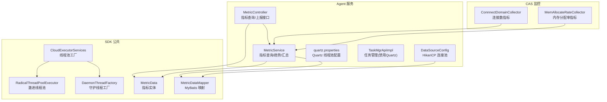
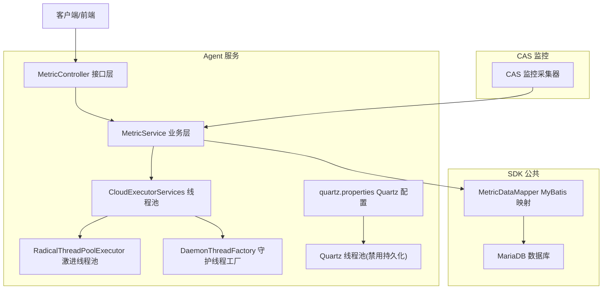
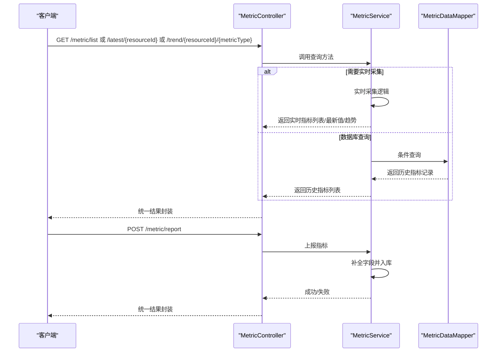
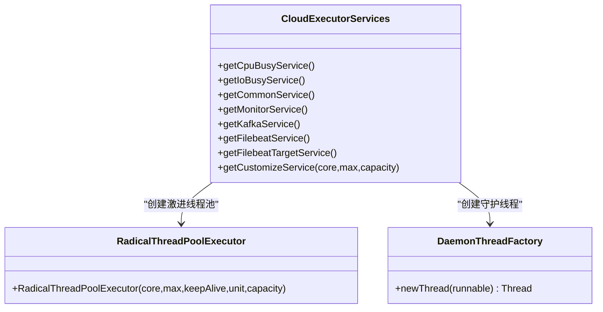
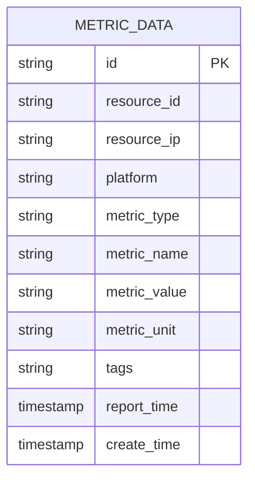
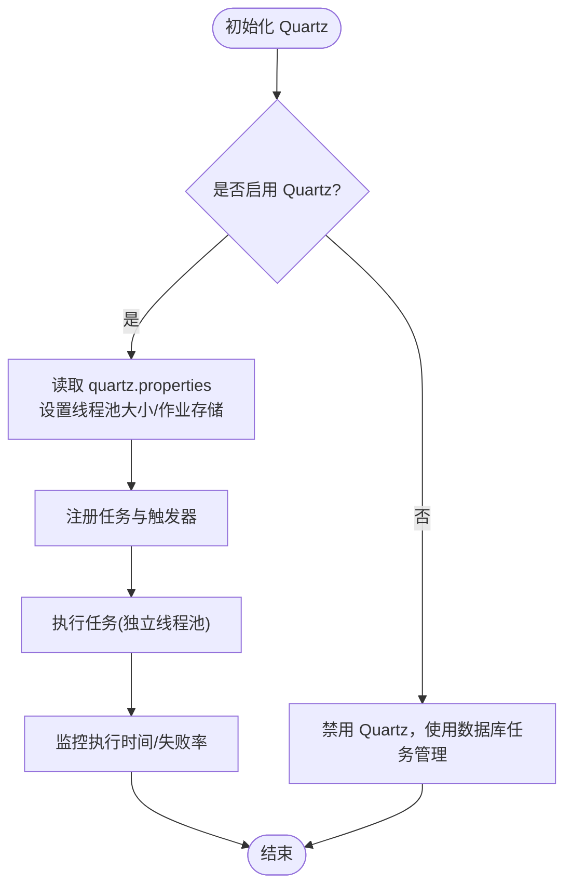
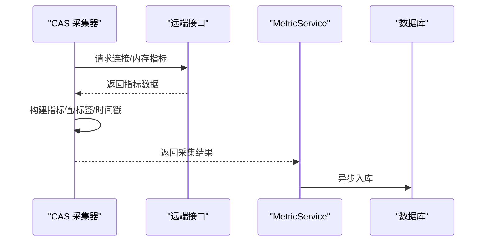
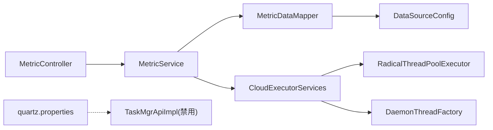

# 性能监控与调优

<cite>
**本文引用的文件**
- [application.properties](file://watcher-agent/src/main/resources/application.properties)
- [quartz.properties](file://watcher-agent/src/main/resources/quartz.properties)
- [MetricController.java](file://watcher-agent/src/main/java/com/virtual/cloud/om/agent/controller/MetricController.java)
- [MetricService.java](file://watcher-agent/src/main/java/com/virtual/cloud/om/agent/service/report/MetricService.java)
- [CloudExecutorServices.java](file://watcher-sdk/src/main/java/com/virtual/cloud/om/sdk/concurrent/CloudExecutorServices.java)
- [RadicalThreadPoolExecutor.java](file://watcher-sdk/src/main/java/com/virtual/cloud/om/sdk/concurrent/RadicalThreadPoolExecutor.java)
- [DaemonThreadFactory.java](file://watcher-sdk/src/main/java/com/virtual/cloud/om/sdk/concurrent/DaemonThreadFactory.java)
- [DataSourceConfig.java](file://watcher-agent/src/main/java/com/virtual/cloud/om/agent/config/DataSourceConfig.java)
- [MetricData.java](file://watcher-sdk/src/main/java/com/virtual/cloud/om/sdk/entity/mysql/MetricData.java)
- [MetricDataMapper.java](file://watcher-sdk/src/main/java/com/virtual/cloud/om/sdk/mapper/MetricDataMapper.java)
- [TaskMgrApiImpl.java](file://watcher-agent/src/main/java/com/virtual/cloud/om/agent/service/task/TaskMgrApiImpl.java)
- [schema-mysql.sql](file://watcher-agent/src/main/resources/schema-mysql.sql)
- [init.sql](file://watcher-agent/src/main/resources/database/init.sql)
- [ConnnectDomainCollector.java](file://watcher-cas/src/main/java/com/virtual/cloud/om/cas/service/severPerformanceMonitor/ConnnectDomainCollector.java)
- [MemAllocateRateCollector.java](file://watcher-cas/src/main/java/com/virtual/cloud/om/cas/service/severPerformanceMonitor/MemAllocateRateCollector.java)
</cite>

## 目录
1. [简介](#简介)
2. [项目结构](#项目结构)
3. [核心组件](#核心组件)
4. [架构总览](#架构总览)
5. [详细组件分析](#详细组件分析)
6. [依赖分析](#依赖分析)
7. [性能考量](#性能考量)
8. [故障排查指南](#故障排查指南)
9. [结论](#结论)
10. [附录](#附录)

## 简介
本指南面向系统运维与开发工程师，围绕性能监控与调优展开，覆盖以下主题：
- 系统性能监控关键指标：响应时间、吞吐量、并发数、资源利用率的测量方法
- JVM 性能调优策略：堆内存配置、GC 优化、线程池调优
- 数据库性能监控与优化：慢查询分析、索引优化、连接池配置
- Quartz 定时任务性能优化：任务调度策略与资源分配
- 瓶颈识别与性能分析工具使用
- 性能基准测试与压力测试实施指南
- 性能问题诊断与解决步骤

## 项目结构
本仓库为多模块工程，与性能相关的关键模块与文件如下：
- watcher-agent：Agent 服务，提供指标采集、上报、查询与定时任务管理能力；内置 HikariCP 连接池与 Quartz 配置
- watcher-sdk：SDK 公共组件，包含线程池、指标实体与映射、工具类等
- watcher-cas：CAS 服务器性能监控采集器，提供 CPU、内存、连接等指标采集
- watcher-builder、watcher-uis、watcher-workspace：其他业务模块，本文聚焦于与性能监控直接相关的组件

**图表来源**
- [MetricController.java:1-103](file://watcher-agent/src/main/java/com/virtual/cloud/om/agent/controller/MetricController.java#L1-L103)
- [MetricService.java:1-266](file://watcher-agent/src/main/java/com/virtual/cloud/om/agent/service/report/MetricService.java#L1-L266)
- [DataSourceConfig.java:1-47](file://watcher-agent/src/main/java/com/virtual/cloud/om/agent/config/DataSourceConfig.java#L1-L47)
- [quartz.properties:1-45](file://watcher-agent/src/main/resources/quartz.properties#L1-L45)
- [CloudExecutorServices.java:1-195](file://watcher-sdk/src/main/java/com/virtual/cloud/om/sdk/concurrent/CloudExecutorServices.java#L1-L195)
- [RadicalThreadPoolExecutor.java:1-74](file://watcher-sdk/src/main/java/com/virtual/cloud/om/sdk/concurrent/RadicalThreadPoolExecutor.java#L1-L74)
- [DaemonThreadFactory.java:1-31](file://watcher-sdk/src/main/java/com/virtual/cloud/om/sdk/concurrent/DaemonThreadFactory.java#L1-L31)
- [MetricData.java:1-43](file://watcher-sdk/src/main/java/com/virtual/cloud/om/sdk/entity/mysql/MetricData.java#L1-L43)
- [MetricDataMapper.java:1-14](file://watcher-sdk/src/main/java/com/virtual/cloud/om/sdk/mapper/MetricDataMapper.java#L1-L14)
- [ConnnectDomainCollector.java:1-85](file://watcher-cas/src/main/java/com/virtual/cloud/om/cas/service/severPerformanceMonitor/ConnnectDomainCollector.java#L1-L85)
- [MemAllocateRateCollector.java:1-90](file://watcher-cas/src/main/java/com/virtual/cloud/om/cas/service/severPerformanceMonitor/MemAllocateRateCollector.java#L1-L90)

**章节来源**
- [application.properties:1-80](file://watcher-agent/src/main/resources/application.properties#L1-L80)
- [quartz.properties:1-45](file://watcher-agent/src/main/resources/quartz.properties#L1-L45)
- [MetricController.java:1-103](file://watcher-agent/src/main/java/com/virtual/cloud/om/agent/controller/MetricController.java#L1-L103)
- [MetricService.java:1-266](file://watcher-agent/src/main/java/com/virtual/cloud/om/agent/service/report/MetricService.java#L1-L266)
- [CloudExecutorServices.java:1-195](file://watcher-sdk/src/main/java/com/virtual/cloud/om/sdk/concurrent/CloudExecutorServices.java#L1-L195)
- [RadicalThreadPoolExecutor.java:1-74](file://watcher-sdk/src/main/java/com/virtual/cloud/om/sdk/concurrent/RadicalThreadPoolExecutor.java#L1-L74)
- [DaemonThreadFactory.java:1-31](file://watcher-sdk/src/main/java/com/virtual/cloud/om/sdk/concurrent/DaemonThreadFactory.java#L1-L31)
- [DataSourceConfig.java:1-47](file://watcher-agent/src/main/java/com/virtual/cloud/om/agent/config/DataSourceConfig.java#L1-L47)
- [MetricData.java:1-43](file://watcher-sdk/src/main/java/com/virtual/cloud/om/sdk/entity/mysql/MetricData.java#L1-L43)
- [MetricDataMapper.java:1-14](file://watcher-sdk/src/main/java/com/virtual/cloud/om/sdk/mapper/MetricDataMapper.java#L1-L14)
- [TaskMgrApiImpl.java:1-44](file://watcher-agent/src/main/java/com/virtual/cloud/om/agent/service/task/TaskMgrApiImpl.java#L1-L44)
- [schema-mysql.sql](file://watcher-agent/src/main/resources/schema-mysql.sql)
- [init.sql](file://watcher-agent/src/main/resources/database/init.sql)

## 核心组件
- 指标查询与上报接口：提供指标类型、平台类型查询，指标列表、最新值、趋势、汇总查询，以及指标上报接口
- 指标服务：负责实时采集与数据库查询、趋势统计、汇总统计
- 线程池体系：提供 CPU 密集型、IO 密集型、通用、监控、Kafka、Filebeat 等专用线程池，并支持自定义线程池
- 数据源与连接池：基于 HikariCP 的数据源配置，含最大连接数、空闲超时、生命周期等参数
- Quartz 定时任务：线程池线程数配置，当前模式下禁用集群与持久化存储
- 指标实体与映射：指标数据实体与 MyBatis 映射接口
- CAS 监控采集器：连接数、内存分配率等指标采集器

**章节来源**
- [MetricController.java:1-103](file://watcher-agent/src/main/java/com/virtual/cloud/om/agent/controller/MetricController.java#L1-L103)
- [MetricService.java:1-266](file://watcher-agent/src/main/java/com/virtual/cloud/om/agent/service/report/MetricService.java#L1-L266)
- [CloudExecutorServices.java:1-195](file://watcher-sdk/src/main/java/com/virtual/cloud/om/sdk/concurrent/CloudExecutorServices.java#L1-L195)
- [RadicalThreadPoolExecutor.java:1-74](file://watcher-sdk/src/main/java/com/virtual/cloud/om/sdk/concurrent/RadicalThreadPoolExecutor.java#L1-L74)
- [DaemonThreadFactory.java:1-31](file://watcher-sdk/src/main/java/com/virtual/cloud/om/sdk/concurrent/DaemonThreadFactory.java#L1-L31)
- [DataSourceConfig.java:1-47](file://watcher-agent/src/main/java/com/virtual/cloud/om/agent/config/DataSourceConfig.java#L1-L47)
- [quartz.properties:1-45](file://watcher-agent/src/main/resources/quartz.properties#L1-L45)
- [MetricData.java:1-43](file://watcher-sdk/src/main/java/com/virtual/cloud/om/sdk/entity/mysql/MetricData.java#L1-L43)
- [MetricDataMapper.java:1-14](file://watcher-sdk/src/main/java/com/virtual/cloud/om/sdk/mapper/MetricDataMapper.java#L1-L14)
- [TaskMgrApiImpl.java:1-44](file://watcher-agent/src/main/java/com/virtual/cloud/om/agent/service/task/TaskMgrApiImpl.java#L1-L44)

## 架构总览
下图展示 Agent 服务与 SDK、数据库、Quartz、CAS 采集器之间的交互关系。

**图表来源**
- [MetricController.java:1-103](file://watcher-agent/src/main/java/com/virtual/cloud/om/agent/controller/MetricController.java#L1-L103)
- [MetricService.java:1-266](file://watcher-agent/src/main/java/com/virtual/cloud/om/agent/service/report/MetricService.java#L1-L266)
- [CloudExecutorServices.java:1-195](file://watcher-sdk/src/main/java/com/virtual/cloud/om/sdk/concurrent/CloudExecutorServices.java#L1-L195)
- [RadicalThreadPoolExecutor.java:1-74](file://watcher-sdk/src/main/java/com/virtual/cloud/om/sdk/concurrent/RadicalThreadPoolExecutor.java#L1-L74)
- [DaemonThreadFactory.java:1-31](file://watcher-sdk/src/main/java/com/virtual/cloud/om/sdk/concurrent/DaemonThreadFactory.java#L1-L31)
- [quartz.properties:1-45](file://watcher-agent/src/main/resources/quartz.properties#L1-L45)
- [MetricDataMapper.java:1-14](file://watcher-sdk/src/main/java/com/virtual/cloud/om/sdk/mapper/MetricDataMapper.java#L1-L14)
- [schema-mysql.sql](file://watcher-agent/src/main/resources/schema-mysql.sql)

## 详细组件分析

### 指标查询与上报流程
- 控制器层提供指标类型、平台类型查询，指标列表、最新值、趋势、汇总查询，以及指标上报接口
- 业务层根据请求参数决定是实时采集还是数据库查询，并返回统一结果封装
- 上报时对指标记录进行补全（如 ID、创建时间、上报时间）并入库

**图表来源**
- [MetricController.java:1-103](file://watcher-agent/src/main/java/com/virtual/cloud/om/agent/controller/MetricController.java#L1-L103)
- [MetricService.java:1-266](file://watcher-agent/src/main/java/com/virtual/cloud/om/agent/service/report/MetricService.java#L1-L266)
- [MetricDataMapper.java:1-14](file://watcher-sdk/src/main/java/com/virtual/cloud/om/sdk/mapper/MetricDataMapper.java#L1-L14)

**章节来源**
- [MetricController.java:1-103](file://watcher-agent/src/main/java/com/virtual/cloud/om/agent/controller/MetricController.java#L1-L103)
- [MetricService.java:1-266](file://watcher-agent/src/main/java/com/virtual/cloud/om/agent/service/report/MetricService.java#L1-L266)

### 线程池调优策略
- 线程池工厂提供多种线程池：
  - CPU 密集型：核心线程数与最大线程数按 CPU 核数动态调整
  - IO 密集型：核心线程数与最大线程数为 CPU 核数的若干倍
  - 通用线程池：适配常规异步入库与异步任务
  - 监控线程池：用于监控采集与上报
  - Kafka 线程池：固定较小规模，避免过度竞争
  - Filebeat 线程池：针对日志采集场景
  - 自定义线程池：RadicalThreadPoolExecutor，激进策略优先扩容线程，必要时入队
- 线程工厂采用守护线程，避免主线程无法退出
- 建议：
  - 根据任务类型选择对应线程池
  - IO 密集型任务适当提高核心线程数与队列容量
  - CPU 密集型任务避免过度扩容导致上下文切换开销增大
  - 监控与上报任务独立线程池，避免与业务线程池互相影响

**图表来源**
- [CloudExecutorServices.java:1-195](file://watcher-sdk/src/main/java/com/virtual/cloud/om/sdk/concurrent/CloudExecutorServices.java#L1-L195)
- [RadicalThreadPoolExecutor.java:1-74](file://watcher-sdk/src/main/java/com/virtual/cloud/om/sdk/concurrent/RadicalThreadPoolExecutor.java#L1-L74)
- [DaemonThreadFactory.java:1-31](file://watcher-sdk/src/main/java/com/virtual/cloud/om/sdk/concurrent/DaemonThreadFactory.java#L1-L31)

**章节来源**
- [CloudExecutorServices.java:1-195](file://watcher-sdk/src/main/java/com/virtual/cloud/om/sdk/concurrent/CloudExecutorServices.java#L1-L195)
- [RadicalThreadPoolExecutor.java:1-74](file://watcher-sdk/src/main/java/com/virtual/cloud/om/sdk/concurrent/RadicalThreadPoolExecutor.java#L1-L74)
- [DaemonThreadFactory.java:1-31](file://watcher-sdk/src/main/java/com/virtual/cloud/om/sdk/concurrent/DaemonThreadFactory.java#L1-L31)

### 数据库性能监控与优化
- 连接池配置：HikariCP 最大连接数、最小空闲、连接超时、空闲超时、最大生存时间等参数
- 指标表结构：metric_data 表包含资源标识、平台、指标类型、值、标签、上报时间等字段
- 建议：
  - 根据并发写入量设置最大连接数与队列容量
  - 对高频查询建立合适索引（如按资源 ID、指标类型、上报时间排序）
  - 定期清理历史数据，控制表规模
  - 使用慢查询日志与 EXPLAIN 分析热点 SQL

**图表来源**
- [MetricData.java:1-43](file://watcher-sdk/src/main/java/com/virtual/cloud/om/sdk/entity/mysql/MetricData.java#L1-L43)
- [schema-mysql.sql](file://watcher-agent/src/main/resources/schema-mysql.sql)

**章节来源**
- [DataSourceConfig.java:1-47](file://watcher-agent/src/main/java/com/virtual/cloud/om/agent/config/DataSourceConfig.java#L1-L47)
- [MetricData.java:1-43](file://watcher-sdk/src/main/java/com/virtual/cloud/om/sdk/entity/mysql/MetricData.java#L1-L43)
- [MetricDataMapper.java:1-14](file://watcher-sdk/src/main/java/com/virtual/cloud/om/sdk/mapper/MetricDataMapper.java#L1-L14)
- [schema-mysql.sql](file://watcher-agent/src/main/resources/schema-mysql.sql)
- [init.sql](file://watcher-agent/src/main/resources/database/init.sql)

### Quartz 定时任务性能优化
- 当前配置：线程池线程数为 10；未启用集群与持久化存储（禁用 Quartz）
- 优化建议：
  - 若启用 Quartz，合理设置线程池大小与作业存储策略
  - 将耗时任务放入独立线程池，避免阻塞调度线程
  - 对重复性任务进行去重与合并，减少抖动
  - 监控任务执行时间与失败率，及时告警

**图表来源**
- [quartz.properties:1-45](file://watcher-agent/src/main/resources/quartz.properties#L1-L45)
- [TaskMgrApiImpl.java:1-44](file://watcher-agent/src/main/java/com/virtual/cloud/om/agent/service/task/TaskMgrApiImpl.java#L1-L44)

**章节来源**
- [quartz.properties:1-45](file://watcher-agent/src/main/resources/quartz.properties#L1-L45)
- [TaskMgrApiImpl.java:1-44](file://watcher-agent/src/main/java/com/virtual/cloud/om/agent/service/task/TaskMgrApiImpl.java#L1-L44)

### CAS 监控采集器
- 连接数采集器：从远端接口获取连接速率，构建指标值与标签，返回采集结果
- 内存分配率采集器：解析主机内存超分配比例与系统时间，生成指标值与时间戳
- 建议：
  - 对采集频率与并发度进行限制，避免对被监控系统造成压力
  - 对异常值进行过滤与告警
  - 将采集结果统一到指标上报流程中

**图表来源**
- [ConnnectDomainCollector.java:1-85](file://watcher-cas/src/main/java/com/virtual/cloud/om/cas/service/severPerformanceMonitor/ConnnectDomainCollector.java#L1-L85)
- [MemAllocateRateCollector.java:1-90](file://watcher-cas/src/main/java/com/virtual/cloud/om/cas/service/severPerformanceMonitor/MemAllocateRateCollector.java#L1-L90)
- [MetricService.java:1-266](file://watcher-agent/src/main/java/com/virtual/cloud/om/agent/service/report/MetricService.java#L1-L266)

**章节来源**
- [ConnnectDomainCollector.java:1-85](file://watcher-cas/src/main/java/com/virtual/cloud/om/cas/service/severPerformanceMonitor/ConnnectDomainCollector.java#L1-L85)
- [MemAllocateRateCollector.java:1-90](file://watcher-cas/src/main/java/com/virtual/cloud/om/cas/service/severPerformanceMonitor/MemAllocateRateCollector.java#L1-L90)

## 依赖分析
- 控制器依赖业务服务，业务服务依赖 Mapper 与数据源配置
- 线程池工厂为各模块提供统一的线程池实例
- Quartz 配置与任务管理实现相互独立，当前模式下禁用 Quartz

**图表来源**
- [MetricController.java:1-103](file://watcher-agent/src/main/java/com/virtual/cloud/om/agent/controller/MetricController.java#L1-L103)
- [MetricService.java:1-266](file://watcher-agent/src/main/java/com/virtual/cloud/om/agent/service/report/MetricService.java#L1-L266)
- [MetricDataMapper.java:1-14](file://watcher-sdk/src/main/java/com/virtual/cloud/om/sdk/mapper/MetricDataMapper.java#L1-L14)
- [DataSourceConfig.java:1-47](file://watcher-agent/src/main/java/com/virtual/cloud/om/agent/config/DataSourceConfig.java#L1-L47)
- [CloudExecutorServices.java:1-195](file://watcher-sdk/src/main/java/com/virtual/cloud/om/sdk/concurrent/CloudExecutorServices.java#L1-L195)
- [RadicalThreadPoolExecutor.java:1-74](file://watcher-sdk/src/main/java/com/virtual/cloud/om/sdk/concurrent/RadicalThreadPoolExecutor.java#L1-L74)
- [DaemonThreadFactory.java:1-31](file://watcher-sdk/src/main/java/com/virtual/cloud/om/sdk/concurrent/DaemonThreadFactory.java#L1-L31)
- [quartz.properties:1-45](file://watcher-agent/src/main/resources/quartz.properties#L1-L45)
- [TaskMgrApiImpl.java:1-44](file://watcher-agent/src/main/java/com/virtual/cloud/om/agent/service/task/TaskMgrApiImpl.java#L1-L44)

**章节来源**
- [MetricController.java:1-103](file://watcher-agent/src/main/java/com/virtual/cloud/om/agent/controller/MetricController.java#L1-L103)
- [MetricService.java:1-266](file://watcher-agent/src/main/java/com/virtual/cloud/om/agent/service/report/MetricService.java#L1-L266)
- [CloudExecutorServices.java:1-195](file://watcher-sdk/src/main/java/com/virtual/cloud/om/sdk/concurrent/CloudExecutorServices.java#L1-L195)

## 性能考量
- 指标查询与上报
  - 列表查询支持分页与时间范围过滤，建议结合索引与分页参数控制单次查询量
  - 实时采集与数据库查询路径分离，避免阻塞
- 线程池
  - IO 密集型任务建议扩大线程数与队列容量
  - CPU 密集型任务避免过度扩容，关注上下文切换
  - 监控与上报独立线程池，降低相互干扰
- 数据库
  - HikariCP 参数需与业务并发匹配，避免连接不足或过度占用
  - 指标表应建立常用查询字段索引，定期归档历史数据
- Quartz
  - 禁用模式下使用数据库任务管理，注意任务幂等与去重
  - 如启用 Quartz，合理配置线程池与作业存储，避免阻塞调度线程
- CAS 采集
  - 控制采集频率与并发，避免对被监控系统造成压力
  - 对异常值与错误进行过滤与告警

[本节为通用指导，无需列出具体文件来源]

## 故障排查指南
- 指标查询异常
  - 检查控制器参数与业务层条件构造，确认资源是否存在
  - 关注实时采集与数据库查询分支的异常日志
- 线程池相关问题
  - 观察线程池饱和与拒绝策略触发情况，评估队列容量与最大线程数
  - 检查守护线程工厂是否正确创建守护线程
- 数据库连接问题
  - 检查 HikariCP 连接池参数与数据库负载
  - 关注慢查询与锁等待，必要时调整索引与 SQL
- Quartz 任务异常
  - 当前禁用模式下，检查任务管理实现与数据库一致性
  - 如启用 Quartz，检查线程池与作业存储配置
- CAS 采集异常
  - 检查远端接口可达性与返回格式，关注异常值与时间戳解析

**章节来源**
- [MetricController.java:1-103](file://watcher-agent/src/main/java/com/virtual/cloud/om/agent/controller/MetricController.java#L1-L103)
- [MetricService.java:1-266](file://watcher-agent/src/main/java/com/virtual/cloud/om/agent/service/report/MetricService.java#L1-L266)
- [CloudExecutorServices.java:1-195](file://watcher-sdk/src/main/java/com/virtual/cloud/om/sdk/concurrent/CloudExecutorServices.java#L1-L195)
- [RadicalThreadPoolExecutor.java:1-74](file://watcher-sdk/src/main/java/com/virtual/cloud/om/sdk/concurrent/RadicalThreadPoolExecutor.java#L1-L74)
- [DaemonThreadFactory.java:1-31](file://watcher-sdk/src/main/java/com/virtual/cloud/om/sdk/concurrent/DaemonThreadFactory.java#L1-L31)
- [DataSourceConfig.java:1-47](file://watcher-agent/src/main/java/com/virtual/cloud/om/agent/config/DataSourceConfig.java#L1-L47)
- [quartz.properties:1-45](file://watcher-agent/src/main/resources/quartz.properties#L1-L45)
- [TaskMgrApiImpl.java:1-44](file://watcher-agent/src/main/java/com/virtual/cloud/om/agent/service/task/TaskMgrApiImpl.java#L1-L44)
- [ConnnectDomainCollector.java:1-85](file://watcher-cas/src/main/java/com/virtual/cloud/om/cas/service/severPerformanceMonitor/ConnnectDomainCollector.java#L1-L85)
- [MemAllocateRateCollector.java:1-90](file://watcher-cas/src/main/java/com/virtual/cloud/om/cas/service/severPerformanceMonitor/MemAllocateRateCollector.java#L1-L90)

## 结论
通过明确的指标采集与上报流程、合理的线程池设计、稳健的数据库连接池配置、以及禁用/启用 Quartz 的灵活策略，本项目具备了完善的性能监控与调优基础。建议在生产环境中持续关注线程池饱和、数据库慢查询、采集频率与并发控制，并结合实际业务负载进行参数微调与压测验证。

[本节为总结性内容，无需列出具体文件来源]

## 附录
- 性能基准测试与压力测试实施指南
  - 指标查询：构造不同时间范围与分页参数，观察响应时间与吞吐量
  - 指标上报：模拟高并发上报，评估入库延迟与数据库负载
  - 线程池：分别测试 CPU 密集型与 IO 密集型任务，观察线程数与队列变化
  - 数据库：执行 EXPLAIN 分析热点 SQL，评估索引效果
  - Quartz：在启用模式下评估任务调度延迟与失败率
- 性能问题诊断步骤
  - 快速定位：查看控制器与业务层日志，区分实时采集与数据库查询路径
  - 深入分析：检查线程池状态、数据库连接池与慢查询日志
  - 修复验证：调整参数后进行回归测试与压测

[本节为通用指导，无需列出具体文件来源]