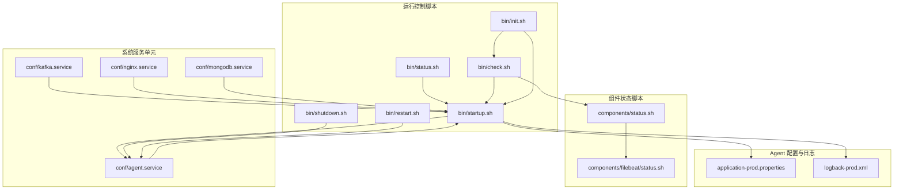
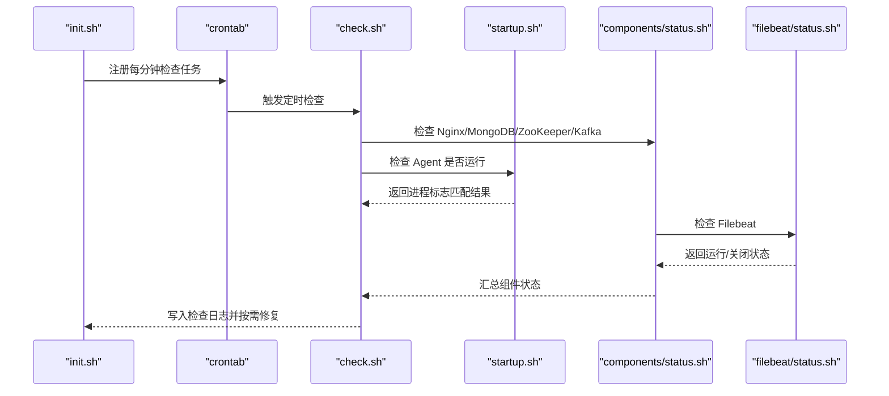
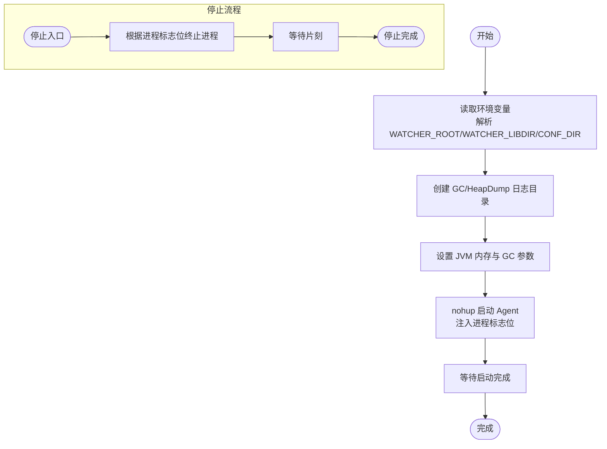
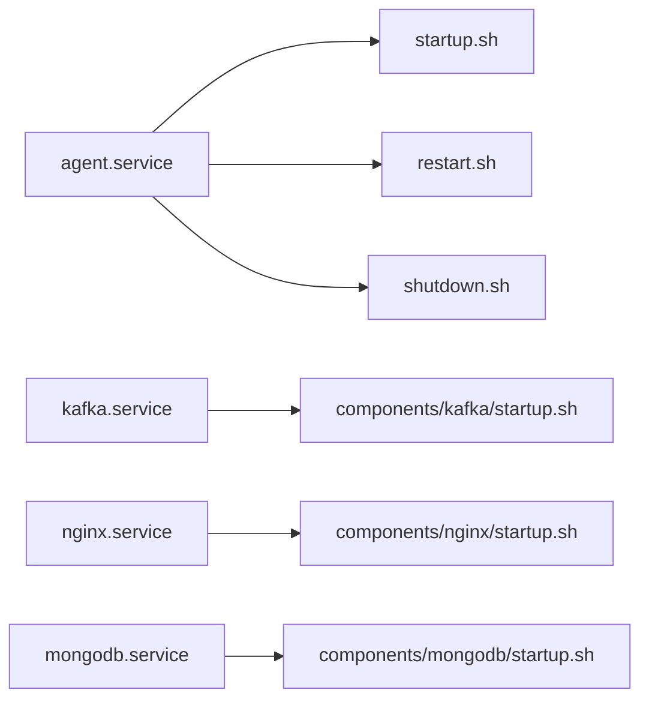
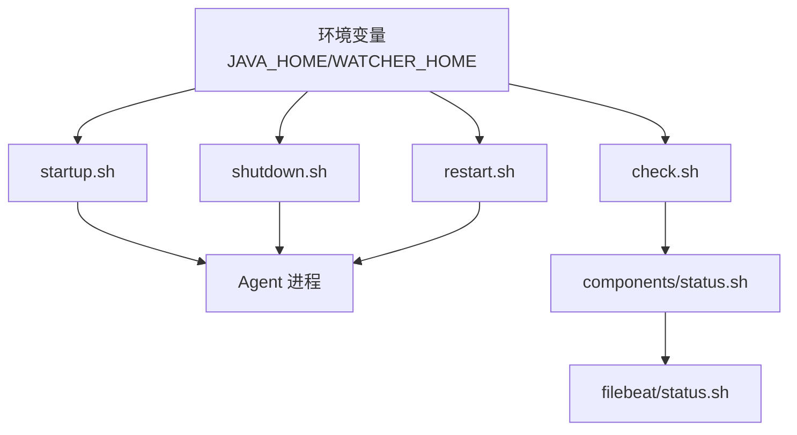

# 故障诊断与问题排查

<cite>
**本文引用的文件**
- [status.sh](file://watcher-builder/assembly/bin/status.sh)
- [components/status.sh](file://watcher-builder/assembly/components/status.sh)
- [filebeat/status.sh](file://watcher-builder/assembly/components/filebeat/status.sh)
- [startup.sh](file://watcher-builder/assembly/bin/startup.sh)
- [shutdown.sh](file://watcher-builder/assembly/bin/shutdown.sh)
- [restart.sh](file://watcher-builder/assembly/bin/restart.sh)
- [check.sh](file://watcher-builder/assembly/bin/check.sh)
- [init.sh](file://watcher-builder/assembly/bin/init.sh)
- [agent.service](file://watcher-builder/assembly/conf/agent.service)
- [kafka.service](file://watcher-builder/assembly/conf/kafka.service)
- [nginx.service](file://watcher-builder/assembly/conf/nginx.service)
- [mongodb.service](file://watcher-builder/assembly/conf/mongodb.service)
- [application-prod.properties](file://watcher-agent/src/main/resources/application-prod.properties)
- [logback-prod.xml](file://watcher-agent/src/main/resources/logback-prod.xml)
</cite>

## 目录
1. [简介](#简介)
2. [项目结构](#项目结构)
3. [核心组件](#核心组件)
4. [架构总览](#架构总览)
5. [详细组件分析](#详细组件分析)
6. [依赖关系分析](#依赖关系分析)
7. [性能考量](#性能考量)
8. [故障排查指南](#故障排查指南)
9. [结论](#结论)
10. [附录](#附录)

## 简介
本手册面向运维与开发人员，聚焦于系统故障的快速识别与定位，涵盖服务不可用、性能下降、数据异常等场景；系统化讲解日志分析方法（错误日志解读、异常堆栈分析、关键信息提取）；详解状态检查工具（status.sh 脚本及其参数与返回语义）；提供网络、数据库与第三方服务集成问题的排查步骤；给出紧急故障处理流程与应急预案模板；规范故障记录与报告格式，并提出可落地的故障预防措施。

## 项目结构
本仓库包含多个子模块，其中与故障诊断直接相关的是 watcher-builder 的安装包构建与运行控制脚本，以及 watcher-agent 的配置与日志输出。下图展示与“状态检查”“启动/停止/重启”“健康检查”“系统服务注册”等能力相关的文件与交互关系。

图表来源
- [startup.sh:1-81](file://watcher-builder/assembly/bin/startup.sh#L1-L81)
- [shutdown.sh:1-26](file://watcher-builder/assembly/bin/shutdown.sh#L1-L26)
- [restart.sh:1-9](file://watcher-builder/assembly/bin/restart.sh#L1-L9)
- [status.sh:1-10](file://watcher-builder/assembly/bin/status.sh#L1-L10)
- [check.sh:1-27](file://watcher-builder/assembly/bin/check.sh#L1-L27)
- [init.sh:1-35](file://watcher-builder/assembly/bin/init.sh#L1-L35)
- [components/status.sh:1-9](file://watcher-builder/assembly/components/status.sh#L1-L9)
- [filebeat/status.sh:1-10](file://watcher-builder/assembly/components/filebeat/status.sh#L1-L10)
- [agent.service:1-14](file://watcher-builder/assembly/conf/agent.service#L1-L14)
- [kafka.service:1-14](file://watcher-builder/assembly/conf/kafka.service#L1-L14)
- [nginx.service:1-14](file://watcher-builder/assembly/conf/nginx.service#L1-L14)
- [mongodb.service:1-14](file://watcher-builder/assembly/conf/mongodb.service#L1-L14)
- [application-prod.properties](file://watcher-agent/src/main/resources/application-prod.properties)
- [logback-prod.xml](file://watcher-agent/src/main/resources/logback-prod.xml)

章节来源
- [startup.sh:1-81](file://watcher-builder/assembly/bin/startup.sh#L1-L81)
- [status.sh:1-10](file://watcher-builder/assembly/bin/status.sh#L1-L10)
- [components/status.sh:1-9](file://watcher-builder/assembly/components/status.sh#L1-L9)

## 核心组件
- 运行控制脚本：负责 Java Agent 的启动、停止、重启、状态查询与健康检查。
- 组件状态脚本：对 Nginx、MongoDB、ZooKeeper、Kafka、Filebeat 等组件进行状态检查。
- 系统服务单元：通过 systemd 单元文件实现开机自启、重载与停止。
- 日志与配置：生产环境配置与日志输出策略，便于故障时快速定位。

章节来源
- [startup.sh:1-81](file://watcher-builder/assembly/bin/startup.sh#L1-L81)
- [shutdown.sh:1-26](file://watcher-builder/assembly/bin/shutdown.sh#L1-L26)
- [restart.sh:1-9](file://watcher-builder/assembly/bin/restart.sh#L1-L9)
- [status.sh:1-10](file://watcher-builder/assembly/bin/status.sh#L1-L10)
- [components/status.sh:1-9](file://watcher-builder/assembly/components/status.sh#L1-L9)
- [filebeat/status.sh:1-10](file://watcher-builder/assembly/components/filebeat/status.sh#L1-L10)
- [agent.service:1-14](file://watcher-builder/assembly/conf/agent.service#L1-L14)

## 架构总览
下图展示从“初始化”到“运行态”的关键路径，以及“健康检查”如何联动各组件与 Agent。

图表来源
- [init.sh:22-23](file://watcher-builder/assembly/bin/init.sh#L22-L23)
- [check.sh:1-27](file://watcher-builder/assembly/bin/check.sh#L1-L27)
- [components/status.sh:1-9](file://watcher-builder/assembly/components/status.sh#L1-L9)
- [filebeat/status.sh:1-10](file://watcher-builder/assembly/components/filebeat/status.sh#L1-L10)
- [startup.sh:78-78](file://watcher-builder/assembly/bin/startup.sh#L78-L78)

## 详细组件分析

### 运行控制与状态检查
- 启动脚本（startup.sh）
  - 功能要点：检测 Java 可执行性与版本、解析运行根目录与配置目录、准备 GC/HeapDump 日志目录、设置 JVM 参数、以 nohup 方式启动 Agent 并注入进程标志位。
  - 关键行为：通过进程标志位字符串与进程名组合，确保唯一识别 Agent 进程。
  - 输出：标准输出静默，错误输出重定向至日志文件，便于后续排查。
- 停止脚本（shutdown.sh）
  - 功能要点：根据进程标志位精准终止 Agent 进程，等待片刻后提示已停止。
- 重启脚本（restart.sh）
  - 功能要点：先停止再启动，保证状态切换平滑。
- 状态脚本（status.sh）
  - 功能要点：通过进程匹配判断 Agent 是否运行，返回“运行中/已关闭”两类状态。
- 组件状态聚合（components/status.sh）
  - 功能要点：依次调用各组件的状态脚本，汇总输出。
- Filebeat 状态脚本（filebeat/status.sh）
  - 功能要点：通过进程名匹配判断 Filebeat 是否运行。
- 健康检查脚本（check.sh）
  - 功能要点：每分钟检查 MongoDB 与 Agent，若发现异常则尝试自动修复（如启动 MongoDB 或启动 Agent），并将检查结果写入日志文件。

图表来源
- [startup.sh:44-78](file://watcher-builder/assembly/bin/startup.sh#L44-L78)
- [shutdown.sh:20-24](file://watcher-builder/assembly/bin/shutdown.sh#L20-L24)

章节来源
- [startup.sh:1-81](file://watcher-builder/assembly/bin/startup.sh#L1-L81)
- [shutdown.sh:1-26](file://watcher-builder/assembly/bin/shutdown.sh#L1-L26)
- [restart.sh:1-9](file://watcher-builder/assembly/bin/restart.sh#L1-L9)
- [status.sh:1-10](file://watcher-builder/assembly/bin/status.sh#L1-L10)
- [components/status.sh:1-9](file://watcher-builder/assembly/components/status.sh#L1-L9)
- [filebeat/status.sh:1-10](file://watcher-builder/assembly/components/filebeat/status.sh#L1-L10)
- [check.sh:1-27](file://watcher-builder/assembly/bin/check.sh#L1-L27)

### 系统服务集成
- systemd 单元文件
  - agent.service：定义 ExecStart/Reload/Stop 指向对应脚本，实现服务化管理。
  - kafka.service/nginx.service/mongodb.service：分别管理各自组件的启动/停止/重启。
- 初始化脚本（init.sh）
  - 将安装根目录写入 /etc/watcher_home，注册 crontab 定时检查任务，开启必要网络与防火墙策略变更。

图表来源
- [agent.service:1-14](file://watcher-builder/assembly/conf/agent.service#L1-L14)
- [kafka.service:1-14](file://watcher-builder/assembly/conf/kafka.service#L1-L14)
- [nginx.service:1-14](file://watcher-builder/assembly/conf/nginx.service#L1-L14)
- [mongodb.service:1-14](file://watcher-builder/assembly/conf/mongodb.service#L1-L14)
- [init.sh:22-28](file://watcher-builder/assembly/bin/init.sh#L22-L28)

章节来源
- [agent.service:1-14](file://watcher-builder/assembly/conf/agent.service#L1-L14)
- [kafka.service:1-14](file://watcher-builder/assembly/conf/kafka.service#L1-L14)
- [nginx.service:1-14](file://watcher-builder/assembly/conf/nginx.service#L1-L14)
- [mongodb.service:1-14](file://watcher-builder/assembly/conf/mongodb.service#L1-L14)
- [init.sh:1-35](file://watcher-builder/assembly/bin/init.sh#L1-L35)

### 日志与配置
- 生产配置（application-prod.properties）
  - 提供运行环境的配置项，用于定位配置层面的问题。
- 日志配置（logback-prod.xml）
  - 控制日志级别、输出位置与滚动策略，是故障排查的重要依据。

章节来源
- [application-prod.properties](file://watcher-agent/src/main/resources/application-prod.properties)
- [logback-prod.xml](file://watcher-agent/src/main/resources/logback-prod.xml)

## 依赖关系分析
- 启停脚本依赖 systemd 单元文件与环境变量（如 WATCHER_HOME、JAVA_HOME）。
- 健康检查脚本依赖进程标志位与组件状态脚本。
- 日志与配置文件影响 Agent 的运行行为与可观测性。

图表来源
- [startup.sh:44-78](file://watcher-builder/assembly/bin/startup.sh#L44-L78)
- [shutdown.sh:20-24](file://watcher-builder/assembly/bin/shutdown.sh#L20-L24)
- [restart.sh:1-9](file://watcher-builder/assembly/bin/restart.sh#L1-L9)
- [check.sh:1-27](file://watcher-builder/assembly/bin/check.sh#L1-L27)
- [components/status.sh:1-9](file://watcher-builder/assembly/components/status.sh#L1-L9)
- [filebeat/status.sh:1-10](file://watcher-builder/assembly/components/filebeat/status.sh#L1-L10)

## 性能考量
- 启动阶段 JVM 参数（内存与 GC）直接影响冷启动时间与启动稳定性，应结合业务峰值合理调整。
- GC 日志与 HeapDump 文件可用于定位内存泄漏与 GC 抖动问题。
- Filebeat 与组件状态脚本的频繁调用会带来系统开销，建议在高负载场景下评估检查频率。

章节来源
- [startup.sh:62-72](file://watcher-builder/assembly/bin/startup.sh#L62-L72)
- [filebeat/status.sh:1-10](file://watcher-builder/assembly/components/filebeat/status.sh#L1-L10)

## 故障排查指南

### 一、服务不可用
- 快速确认
  - 使用状态脚本查看 Agent 是否运行。
  - 使用组件状态脚本查看 Nginx/MongoDB/ZooKeeper/Kafka/Filebeat 是否运行。
- 定位步骤
  - 若 Agent 不在运行：检查启动脚本是否成功注入进程标志位；查看错误输出日志；核对 JVM 参数与依赖环境。
  - 若组件不在运行：由健康检查脚本自动尝试启动，若失败，检查组件自身日志与端口占用。
- 处理建议
  - 对于 Agent：优先查看错误输出与 GC/HeapDump 日志；必要时临时降低 GC 日志量以减少 IO 压力。
  - 对于组件：核对配置文件与权限，确认端口未被占用。

章节来源
- [status.sh:1-10](file://watcher-builder/assembly/bin/status.sh#L1-L10)
- [components/status.sh:1-9](file://watcher-builder/assembly/components/status.sh#L1-L9)
- [filebeat/status.sh:1-10](file://watcher-builder/assembly/components/filebeat/status.sh#L1-L10)
- [check.sh:1-27](file://watcher-builder/assembly/bin/check.sh#L1-L27)
- [startup.sh:55-72](file://watcher-builder/assembly/bin/startup.sh#L55-L72)

### 二、性能下降
- 现象识别
  - 响应延迟升高、吞吐下降、CPU/内存/IO 异常。
- 排查路径
  - 查看 GC 日志与 HeapDump，定位是否存在 Full GC、长时间停顿或内存泄漏。
  - 检查 Filebeat 与组件日志，排除外部写入瓶颈。
  - 结合系统监控（CPU/IO/网络）定位热点资源。
- 优化建议
  - 调整 JVM 堆大小与 GC 策略；优化日志滚动策略；减少不必要的日志级别。

章节来源
- [startup.sh:62-72](file://watcher-builder/assembly/bin/startup.sh#L62-L72)
- [logback-prod.xml](file://watcher-agent/src/main/resources/logback-prod.xml)

### 三、数据异常
- 现象识别
  - 数据缺失、重复、不一致。
- 排查路径
  - 核对组件状态与日志，确认采集/传输链路是否中断。
  - 检查 Filebeat 与目标存储的连通性与认证配置。
  - 对比历史日志与指标，定位异常窗口。
- 处理建议
  - 在确认链路正常后，进行数据回放或补偿；必要时临时降级非关键链路。

章节来源
- [filebeat/status.sh:1-10](file://watcher-builder/assembly/components/filebeat/status.sh#L1-L10)
- [components/status.sh:1-9](file://watcher-builder/assembly/components/status.sh#L1-L9)

### 四、日志分析实战
- 错误日志解读
  - 关注时间戳、线程名、异常类型与关键参数。
  - 结合进程标志位与启动参数定位具体实例。
- 异常堆栈分析
  - 从顶向下阅读调用链，关注业务入口与第三方接口调用点。
  - 区分“预期异常”与“致命异常”，前者可恢复，后者需立即干预。
- 关键信息提取
  - 提取请求 ID、用户标识、资源路径、错误码与重试次数。
  - 记录首次出现时间、复现条件与影响范围。

章节来源
- [startup.sh:55-72](file://watcher-builder/assembly/bin/startup.sh#L55-L72)
- [application-prod.properties](file://watcher-agent/src/main/resources/application-prod.properties)

### 五、系统状态检查工具使用
- status.sh（单体 Agent）
  - 用途：判断 Agent 是否在运行。
  - 返回：运行中/已关闭。
- components/status.sh（聚合组件）
  - 用途：一次性检查 Nginx/MongoDB/ZooKeeper/Kafka 状态。
  - 返回：各组件运行/关闭状态。
- filebeat/status.sh
  - 用途：检查日志采集器是否运行。
  - 返回：运行中/已关闭。

章节来源
- [status.sh:1-10](file://watcher-builder/assembly/bin/status.sh#L1-L10)
- [components/status.sh:1-9](file://watcher-builder/assembly/components/status.sh#L1-L9)
- [filebeat/status.sh:1-10](file://watcher-builder/assembly/components/filebeat/status.sh#L1-L10)

### 六、网络连接问题排查
- 步骤
  - 检查本地端口监听与防火墙策略。
  - 使用组件状态脚本确认 Nginx/Kafka/ZooKeeper 是否运行。
  - 核对 /etc/watcher_home 中的安装路径与配置文件。
  - 如涉及 SSH，参考初始化脚本中的 SSH 算法配置变更。
- 工具
  - netstat/ss/ufw/firewalld 等系统工具辅助定位。

章节来源
- [init.sh:24-28](file://watcher-builder/assembly/bin/init.sh#L24-L28)
- [components/status.sh:1-9](file://watcher-builder/assembly/components/status.sh#L1-L9)

### 七、数据库连接问题排查
- 步骤
  - 使用健康检查脚本确认 MongoDB 是否运行。
  - 检查 application-prod.properties 中的连接参数与凭据。
  - 查看 Agent 日志中数据库访问异常堆栈与重试记录。
- 处理
  - 若自动修复失败，手动启动组件并检查端口/权限/网络策略。

章节来源
- [check.sh:1-27](file://watcher-builder/assembly/bin/check.sh#L1-L27)
- [application-prod.properties](file://watcher-agent/src/main/resources/application-prod.properties)

### 八、第三方服务集成问题排查
- 步骤
  - 确认第三方服务可达性与认证配置。
  - 检查 Filebeat 与目标平台的连通性。
  - 对照异常堆栈定位调用点与超时/鉴权错误。
- 处理
  - 临时降级非关键链路；补充重试与熔断策略。

章节来源
- [filebeat/status.sh:1-10](file://watcher-builder/assembly/components/filebeat/status.sh#L1-L10)

### 九、紧急故障处理流程与应急预案
- 流程
  - 发现告警 → 快速确认（status.sh/组件状态）→ 评估影响范围 → 切换降级/回滚 → 分析日志与堆栈 → 修复并验证 → 复盘与改进。
- 应急预案
  - 明确角色与职责、联系方式、恢复优先级与 SLA。
  - 准备一键启动/停止脚本、备份与回滚方案、替代方案与降级开关。

章节来源
- [status.sh:1-10](file://watcher-builder/assembly/bin/status.sh#L1-L10)
- [components/status.sh:1-9](file://watcher-builder/assembly/components/status.sh#L1-L9)
- [startup.sh:55-72](file://watcher-builder/assembly/bin/startup.sh#L55-L72)

### 十、故障记录与报告
- 标准格式
  - 时间、地点、事件、影响范围、根因、处置过程、恢复时间、经验教训。
- 建议
  - 保留日志片段与截图；记录修复前后指标对比；形成知识库沉淀。

[本节为通用实践总结，无需特定文件来源]

### 十一、故障预防措施
- 预防
  - 启用健康检查与自动修复；限制日志量与滚动策略；定期演练应急流程；完善监控与告警阈值。
- 持续改进
  - 周期性回顾故障案例，优化配置与代码健壮性。

[本节为通用实践总结，无需特定文件来源]

## 结论
通过统一的运行控制脚本、系统化的状态检查与日志配置，本项目提供了可操作的故障诊断与问题排查基础。建议在实际运维中结合本文流程与工具，建立标准化的巡检、应急与复盘机制，持续提升系统的稳定性与可维护性。

## 附录

### A. 常用命令与脚本清单
- 启动/停止/重启/状态/健康检查
  - 启动：bin/startup.sh
  - 停止：bin/shutdown.sh
  - 重启：bin/restart.sh
  - 状态：bin/status.sh
  - 健康检查：bin/check.sh
- 组件状态
  - 统一检查：components/status.sh
  - Filebeat：components/filebeat/status.sh
- 系统服务
  - agent.service、kafka.service、nginx.service、mongodb.service

章节来源
- [startup.sh:1-81](file://watcher-builder/assembly/bin/startup.sh#L1-L81)
- [shutdown.sh:1-26](file://watcher-builder/assembly/bin/shutdown.sh#L1-L26)
- [restart.sh:1-9](file://watcher-builder/assembly/bin/restart.sh#L1-L9)
- [status.sh:1-10](file://watcher-builder/assembly/bin/status.sh#L1-L10)
- [check.sh:1-27](file://watcher-builder/assembly/bin/check.sh#L1-L27)
- [components/status.sh:1-9](file://watcher-builder/assembly/components/status.sh#L1-L9)
- [filebeat/status.sh:1-10](file://watcher-builder/assembly/components/filebeat/status.sh#L1-L10)
- [agent.service:1-14](file://watcher-builder/assembly/conf/agent.service#L1-L14)
- [kafka.service:1-14](file://watcher-builder/assembly/conf/kafka.service#L1-L14)
- [nginx.service:1-14](file://watcher-builder/assembly/conf/nginx.service#L1-L14)
- [mongodb.service:1-14](file://watcher-builder/assembly/conf/mongodb.service#L1-L14)