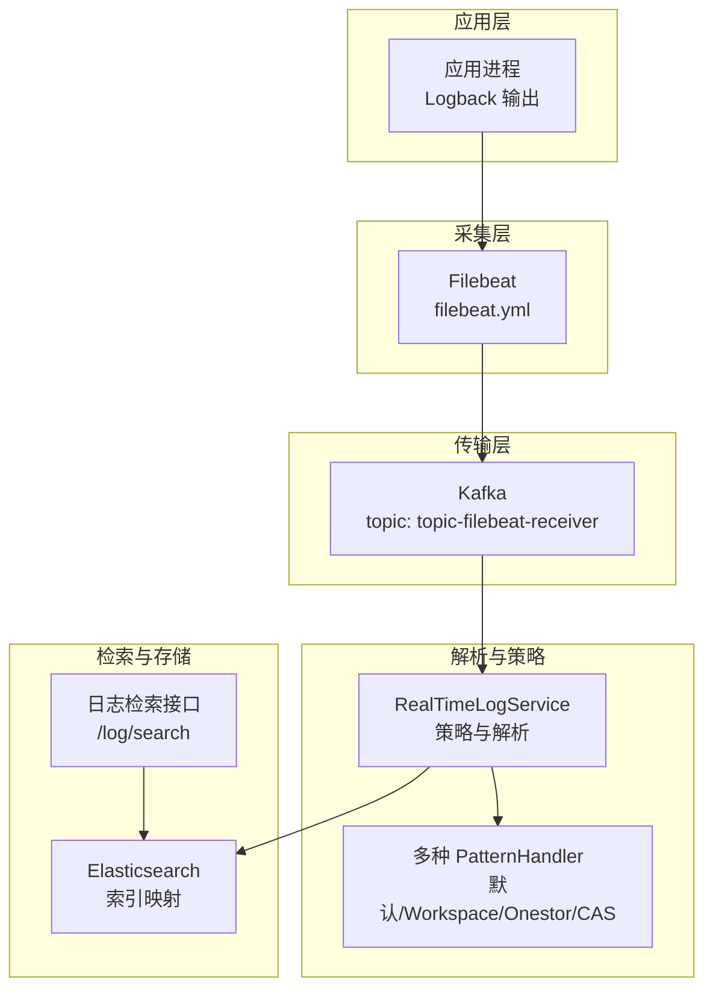
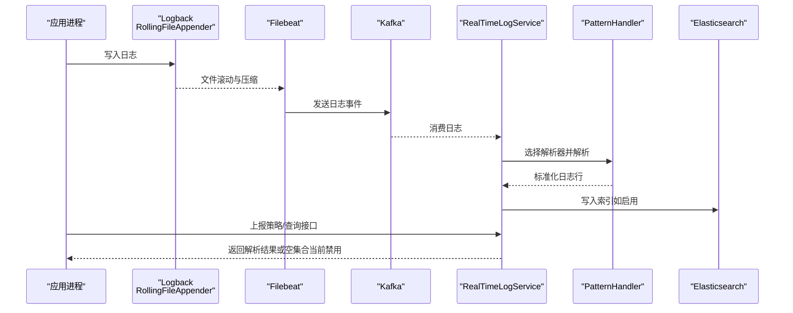
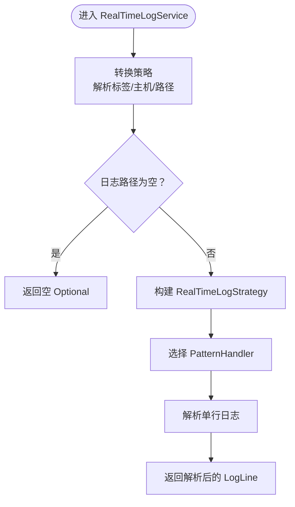
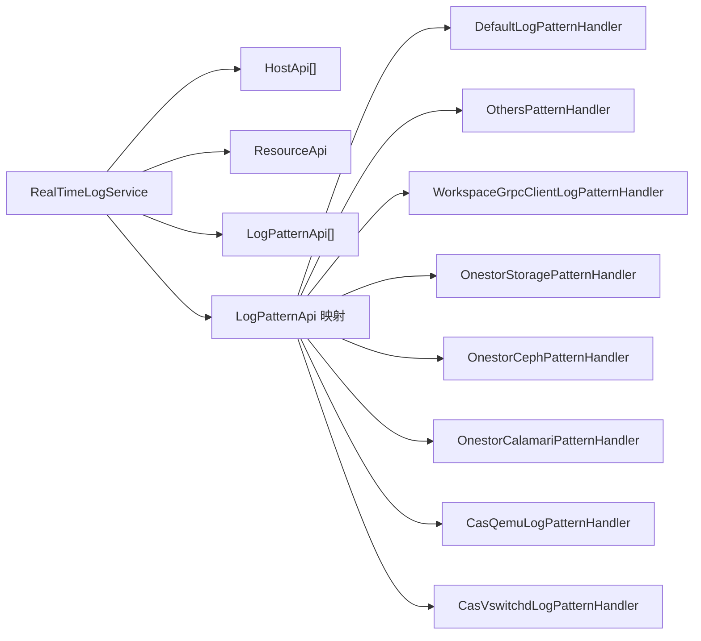

# 日志管理与分析

<cite>
**本文引用的文件**
- [logback-dev.xml](file://watcher-agent/src/main/resources/logback-dev.xml)
- [logback-prod.xml](file://watcher-agent/src/main/resources/logback-prod.xml)
- [logback-test.xml](file://watcher-agent/src/main/resources/logback-test.xml)
- [application.properties](file://watcher-agent/src/main/resources/application.properties)
- [filebeat.yml](file://watcher-builder/assembly/components/filebeat/filebeat-8.0.1-linux-x86_64/filebeat.yml)
- [filebeat-watcher.yml](file://watcher-builder/assembly/components/filebeat/filebeat-8.0.1-linux-x86_64/filebeat-watcher.yml)
- [filebeat.reference.yml](file://watcher-builder/assembly/components/filebeat/filebeat-8.0.1-linux-x86_64/filebeat.reference.yml)
- [RealTimeLogService.java](file://watcher-agent/src/main/java/com/virtual/cloud/om/agent/service/logs/RealTimeLogService.java)
- [RealTimeLogApi.java](file://watcher-sdk/src/main/java/com/virtual/cloud/om/sdk/api/RealTimeLogApi.java)
- [RealTimeLogStrategyRequest.java](file://watcher-sdk/src/main/java/com/virtual/cloud/om/sdk/dto/RealTimeLogStrategyRequest.java)
- [RealTimeLogStrategyLogs.java](file://watcher-sdk/src/main/java/com/virtual/cloud/om/sdk/dto/RealTimeLogStrategyLogs.java)
- [LogLine.java](file://watcher-sdk/src/main/java/com/virtual/cloud/om/sdk/dto/LogLine.java)
- [LogController.java](file://watcher-agent/src/main/java/com/virtual/cloud/om/agent/controller/LogController.java)
- [DefaultLogPatternHandler.java](file://watcher-sdk/src/main/java/com/virtual/cloud/om/sdk/api/DefaultLogPatternHandler.java)
- [LogPatternApi.java](file://watcher-sdk/src/main/java/com/virtual/cloud/om/sdk/api/LogPatternApi.java)
- [OthersPatternHandler.java](file://watcher-workspace/src/main/java/com/virtual/cloud/om/workspace/service/realtimelog/OthersPatternHandler.java)
- [WorkspaceGrpcClientLogPatternHandler.java](file://watcher-workspace/src/main/java/com/virtual/cloud/om/workspace/service/realtimelog/WorkspaceGrpcClientLogPatternHandler.java)
- [OnestorStoragePatternHandler.java](file://watcher-onestor/src/main/java/com/virtual/cloud/om/onestor/service/OnestorStoragePatternHandler.java)
- [OnestorCephPatternHandler.java](file://watcher-onestor/src/main/java/com/virtual/cloud/om/onestor/service/OnestorCephPatternHandler.java)
- [OnestorCalamariPatternHandler.java](file://watcher-onestor/src/main/java/com/virtual/cloud/om/onestor/service/OnestorCalamariPatternHandler.java)
- [CasQemuLogPatternHandler.java](file://watcher-cas/src/main/java/com/virtual/cloud/om/cas/service/CasQemuLogPatternHandler.java)
- [CasVswitchdLogPatternHandler.java](file://watcher-cas/src/main/java/com/virtual/cloud/om/cas/service/CasVswitchdLogPatternHandler.java)
- [es_mapping_serverlog.json](file://watcher-agent/src/main/resources/es_mapping_serverlog.json)
- [LogService.java](file://watcher-agent/src/main/java/com/virtual/cloud/om/agent/service/logs/LogService.java)
- [test.json](file://watcher-agent/src/main/resources/test.json)
</cite>

## 目录
1. [简介](#简介)
2. [项目结构](#项目结构)
3. [核心组件](#核心组件)
4. [架构总览](#架构总览)
5. [详细组件分析](#详细组件分析)
6. [依赖关系分析](#依赖关系分析)
7. [性能考量](#性能考量)
8. [故障排查指南](#故障排查指南)
9. [结论](#结论)
10. [附录](#附录)

## 简介
本指南围绕仓库中的日志管理与分析体系，系统讲解以下内容：
- Logback 配置文件的结构与参数设置：日志级别、输出格式、滚动策略与压缩。
- 日志采集与处理流程：Filebeat 采集器配置与 RealTimeLogService 的实时日志处理机制。
- 日志分析工具与方法：日志搜索、过滤与聚合分析思路。
- 日志存储优化策略：压缩配置、保留策略与存储空间管理。
- 日志监控告警机制：异常日志检测与自动告警触发建议。
- 最佳实践与常见问题解决方案。

## 项目结构
本项目在不同模块中分别承担日志生成、采集、解析与存储职责：
- 应用侧日志生成：基于 Logback 的多环境配置文件，统一输出到文件并按大小与时间滚动压缩。
- 日志采集：通过 Filebeat 将本地日志流式发送至 Kafka 或其他下游。
- 日志解析与策略：RealTimeLogService 负责策略下发与解析，结合多种 PatternHandler 完成日志字段提取。
- 日志检索：提供在线检索接口，支持按平台、资源、时间范围、关键字等条件查询。
- 存储映射：Elasticsearch 映射定义，便于后续检索与可视化。

图表来源
- [filebeat.yml:132-135](file://watcher-builder/assembly/components/filebeat/filebeat-8.0.1-linux-x86_64/filebeat.yml#L132-L135)
- [RealTimeLogService.java:38-40](file://watcher-agent/src/main/java/com/virtual/cloud/om/agent/service/logs/RealTimeLogService.java#L38-L40)
- [LogController.java:27-34](file://watcher-agent/src/main/java/com/virtual/cloud/om/agent/controller/LogController.java#L27-L34)
- [es_mapping_serverlog.json:1-62](file://watcher-agent/src/main/resources/es_mapping_serverlog.json#L1-L62)

章节来源
- [logback-dev.xml:1-44](file://watcher-agent/src/main/resources/logback-dev.xml#L1-L44)
- [logback-prod.xml:1-35](file://watcher-agent/src/main/resources/logback-prod.xml#L1-L35)
- [logback-test.xml:1-45](file://watcher-agent/src/main/resources/logback-test.xml#L1-L45)
- [filebeat.yml:1-231](file://watcher-builder/assembly/components/filebeat/filebeat-8.0.1-linux-x86_64/filebeat.yml#L1-L231)
- [application.properties:1-80](file://watcher-agent/src/main/resources/application.properties#L1-L80)

## 核心组件
- Logback 配置：统一定义日志根级别、输出目标（文件/控制台）、编码与滚动策略（按大小与时间），并启用 gzip 压缩。
- Filebeat：定义输入路径、模块、输出目标（Kafka），支持日志级别与行过滤。
- RealTimeLogService：负责策略转换、解析器选择与日志解析；当前版本禁用了 Kafka、Elasticsearch、MongoDB 等中间件依赖。
- 多种 PatternHandler：针对不同平台与日志格式进行字段提取与标准化。
- 日志检索接口：提供在线检索能力，支持关键字、时间范围、级别等过滤。

章节来源
- [RealTimeLogService.java:38-40](file://watcher-agent/src/main/java/com/virtual/cloud/om/agent/service/logs/RealTimeLogService.java#L38-L40)
- [RealTimeLogApi.java:15-58](file://watcher-sdk/src/main/java/com/virtual/cloud/om/sdk/api/RealTimeLogApi.java#L15-L58)
- [DefaultLogPatternHandler.java:16-56](file://watcher-sdk/src/main/java/com/virtual/cloud/om/sdk/api/DefaultLogPatternHandler.java#L16-L56)
- [LogController.java:27-34](file://watcher-agent/src/main/java/com/virtual/cloud/om/agent/controller/LogController.java#L27-L34)

## 架构总览
下图展示从应用日志生成到采集、传输、解析与检索的整体流程。

图表来源
- [logback-dev.xml:8-26](file://watcher-agent/src/main/resources/logback-dev.xml#L8-L26)
- [filebeat.yml:132-135](file://watcher-builder/assembly/components/filebeat/filebeat-8.0.1-linux-x86_64/filebeat.yml#L132-L135)
- [RealTimeLogService.java:115-123](file://watcher-agent/src/main/java/com/virtual/cloud/om/agent/service/logs/RealTimeLogService.java#L115-L123)
- [LogController.java:27-34](file://watcher-agent/src/main/java/com/virtual/cloud/om/agent/controller/LogController.java#L27-L34)

## 详细组件分析

### Logback 配置详解
- 日志目录与应用名：通过属性统一管理日志输出路径与文件名。
- 输出目标：
  - 文件输出：RollingFileAppender，支持按大小与时间滚动，并启用 gzip 压缩。
  - 控制台输出：ConsoleAppender，便于开发与测试环境调试。
- 滚动策略：
  - 按大小滚动：单文件最大容量限制。
  - 按时间滚动：按日期生成新文件。
  - 总体容量上限：避免磁盘占用无限增长。
- 日志级别：根级别统一为 INFO，第三方框架可单独降级以减少噪音。

章节来源
- [logback-dev.xml:2-44](file://watcher-agent/src/main/resources/logback-dev.xml#L2-L44)
- [logback-prod.xml:2-35](file://watcher-agent/src/main/resources/logback-prod.xml#L2-L35)
- [logback-test.xml:2-45](file://watcher-agent/src/main/resources/logback-test.xml#L2-L45)
- [application.properties:16-20](file://watcher-agent/src/main/resources/application.properties#L16-L20)

### Filebeat 配置详解
- 输入配置：
  - 类型为 log，启用路径匹配，支持通配符。
  - 可配置行过滤（包含/排除正则）。
- 模块配置：
  - 模块目录与重载开关，便于扩展不同场景的日志采集。
- 输出配置：
  - Kafka 输出：指定 broker 地址与 topic 名称。
  - 支持其他输出（Elasticsearch、Logstash）作为参考。
- 日志级别与监控：
  - 可设置日志级别与选择性输出到 stderr/syslog。
  - 支持内部指标周期性输出与命名空间控制。

章节来源
- [filebeat.yml:15-170](file://watcher-builder/assembly/components/filebeat/filebeat-8.0.1-linux-x86_64/filebeat.yml#L15-L170)
- [filebeat-watcher.yml:1-17](file://watcher-builder/assembly/components/filebeat/filebeat-8.0.1-linux-x86_64/filebeat-watcher.yml#L1-L17)
- [filebeat.reference.yml:4592-4627](file://watcher-builder/assembly/components/filebeat/filebeat-8.0.1-linux-x86_64/filebeat.reference.yml#L4592-L4627)

### RealTimeLogService 实时日志处理机制
- 策略转换：将请求参数转换为内部策略对象，解析标签与目标主机集合。
- 实时处理：当前版本已禁用 Kafka、Elasticsearch、MongoDB 等中间件，相关方法返回空或记录警告。
- 解析器选择：根据日志类型选择对应 PatternHandler，若未指定则回退到 others/default。
- 搜索接口：当前版本已禁用 Elasticsearch，搜索返回空列表并记录警告。

图表来源
- [RealTimeLogService.java:77-113](file://watcher-agent/src/main/java/com/virtual/cloud/om/agent/service/logs/RealTimeLogService.java#L77-L113)
- [RealTimeLogService.java:208-229](file://watcher-agent/src/main/java/com/virtual/cloud/om/agent/service/logs/RealTimeLogService.java#L208-L229)

章节来源
- [RealTimeLogService.java:38-279](file://watcher-agent/src/main/java/com/virtual/cloud/om/agent/service/logs/RealTimeLogService.java#L38-L279)
- [RealTimeLogApi.java:15-58](file://watcher-sdk/src/main/java/com/virtual/cloud/om/sdk/api/RealTimeLogApi.java#L15-L58)
- [RealTimeLogStrategyRequest.java:11-19](file://watcher-sdk/src/main/java/com/virtual/cloud/om/sdk/dto/RealTimeLogStrategyRequest.java#L11-L19)
- [RealTimeLogStrategyLogs.java:9-18](file://watcher-sdk/src/main/java/com/virtual/cloud/om/sdk/dto/RealTimeLogStrategyLogs.java#L9-L18)

### 日志解析器（PatternHandler）
- 默认解析器：匹配通用格式，提取时间、级别、线程、请求上下文、方法、行号与消息。
- 平台特定解析器：
  - Workspace：针对 gRPC 客户端日志格式。
  - Onestor：针对存储类日志的时间与消息拆分。
  - CAS：针对 QEMU、VSwitchd 等组件日志格式。
- Others：兜底解析器，当未识别类型时使用。

```mermaid
classDiagram
class LogPatternApi {
+parseLine(message) Optional~LogLine~
+logType() RealTimeLogTypeEnum
}
class DefaultLogPatternHandler {
+parseLine(message) Optional~LogLine~
+logType() RealTimeLogTypeEnum
}
class OthersPatternHandler {
+parseLine(message) Optional~LogLine~
+logType() RealTimeLogTypeEnum
}
class WorkspaceGrpcClientLogPatternHandler {
+parseLine(message) Optional~LogLine~
+logType() RealTimeLogTypeEnum
}
class OnestorStoragePatternHandler {
+parseLine(message) Optional~LogLine~
+logType() RealTimeLogTypeEnum
}
class OnestorCephPatternHandler {
+parseLine(message) Optional~LogLine~
+logType() RealTimeLogTypeEnum
}
class OnestorCalamariPatternHandler {
+parseLine(message) Optional~LogLine~
+logType() RealTimeLogTypeEnum
}
class CasQemuLogPatternHandler {
+parseLine(message) Optional~LogLine~
+logType() RealTimeLogTypeEnum
}
class CasVswitchdLogPatternHandler {
+parseLine(message) Optional~LogLine~
+logType() RealTimeLogTypeEnum
}
LogPatternApi <|.. DefaultLogPatternHandler
LogPatternApi <|.. OthersPatternHandler
LogPatternApi <|.. WorkspaceGrpcClientLogPatternHandler
LogPatternApi <|.. OnestorStoragePatternHandler
LogPatternApi <|.. OnestorCephPatternHandler
LogPatternApi <|.. OnestorCalamariPatternHandler
LogPatternApi <|.. CasQemuLogPatternHandler
LogPatternApi <|.. CasVswitchdLogPatternHandler
```

图表来源
- [LogPatternApi.java:12-17](file://watcher-sdk/src/main/java/com/virtual/cloud/om/sdk/api/LogPatternApi.java#L12-L17)
- [DefaultLogPatternHandler.java:16-56](file://watcher-sdk/src/main/java/com/virtual/cloud/om/sdk/api/DefaultLogPatternHandler.java#L16-L56)
- [OthersPatternHandler.java:16-28](file://watcher-workspace/src/main/java/com/virtual/cloud/om/workspace/service/realtimelog/OthersPatternHandler.java#L16-L28)
- [WorkspaceGrpcClientLogPatternHandler.java:18-37](file://watcher-workspace/src/main/java/com/virtual/cloud/om/workspace/service/realtimelog/WorkspaceGrpcClientLogPatternHandler.java#L18-L37)
- [OnestorStoragePatternHandler.java:15-51](file://watcher-onestor/src/main/java/com/virtual/cloud/om/onestor/service/OnestorStoragePatternHandler.java#L15-L51)
- [OnestorCephPatternHandler.java:15-51](file://watcher-onestor/src/main/java/com/virtual/cloud/om/onestor/service/OnestorCephPatternHandler.java#L15-L51)
- [OnestorCalamariPatternHandler.java:15-57](file://watcher-onestor/src/main/java/com/virtual/cloud/om/onestor/service/OnestorCalamariPatternHandler.java#L15-L57)
- [CasQemuLogPatternHandler.java:15-49](file://watcher-cas/src/main/java/com/virtual/cloud/om/cas/service/CasQemuLogPatternHandler.java#L15-L49)
- [CasVswitchdLogPatternHandler.java:15-52](file://watcher-cas/src/main/java/com/virtual/cloud/om/cas/service/CasVswitchdLogPatternHandler.java#L15-L52)

章节来源
- [DefaultLogPatternHandler.java:16-56](file://watcher-sdk/src/main/java/com/virtual/cloud/om/sdk/api/DefaultLogPatternHandler.java#L16-L56)
- [OthersPatternHandler.java:16-28](file://watcher-workspace/src/main/java/com/virtual/cloud/om/workspace/service/realtimelog/OthersPatternHandler.java#L16-L28)
- [WorkspaceGrpcClientLogPatternHandler.java:18-37](file://watcher-workspace/src/main/java/com/virtual/cloud/om/workspace/service/realtimelog/WorkspaceGrpcClientLogPatternHandler.java#L18-L37)
- [OnestorStoragePatternHandler.java:15-51](file://watcher-onestor/src/main/java/com/virtual/cloud/om/onestor/service/OnestorStoragePatternHandler.java#L15-L51)
- [OnestorCephPatternHandler.java:15-51](file://watcher-onestor/src/main/java/com/virtual/cloud/om/onestor/service/OnestorCephPatternHandler.java#L15-L51)
- [OnestorCalamariPatternHandler.java:15-57](file://watcher-onestor/src/main/java/com/virtual/cloud/om/onestor/service/OnestorCalamariPatternHandler.java#L15-L57)
- [CasQemuLogPatternHandler.java:15-49](file://watcher-cas/src/main/java/com/virtual/cloud/om/cas/service/CasQemuLogPatternHandler.java#L15-L49)
- [CasVswitchdLogPatternHandler.java:15-52](file://watcher-cas/src/main/java/com/virtual/cloud/om/cas/service/CasVswitchdLogPatternHandler.java#L15-L52)

### 日志检索与过滤
- 接口定义：提供 searchAll 方法，支持平台、资源、类型、目标、路径、关键字、时间范围、排序与级别过滤。
- 当前实现：由于 Elasticsearch 已禁用，返回空列表并记录警告。
- 建议：若启用 Elasticsearch，结合索引映射与查询 DSL 实现高效检索与聚合。

章节来源
- [RealTimeLogApi.java:57-58](file://watcher-sdk/src/main/java/com/virtual/cloud/om/sdk/api/RealTimeLogApi.java#L57-L58)
- [RealTimeLogService.java:266-272](file://watcher-agent/src/main/java/com/virtual/cloud/om/agent/service/logs/RealTimeLogService.java#L266-L272)
- [LogController.java:27-34](file://watcher-agent/src/main/java/com/virtual/cloud/om/agent/controller/LogController.java#L27-L34)

### 日志存储映射与优化
- 索引映射：定义字段类型与分词器（如 ik_max_word），便于全文检索与聚合分析。
- 压缩与保留：Logback 滚动策略已启用 gzip 压缩与总量上限；可通过调整 MaxFileSize、maxHistory、totalSizeCap 控制磁盘占用。
- 建议：结合 Filebeat 输出端的压缩与 Kafka 分区副本策略，确保高吞吐下的可靠性与性能。

章节来源
- [es_mapping_serverlog.json:1-62](file://watcher-agent/src/main/resources/es_mapping_serverlog.json#L1-L62)
- [logback-dev.xml:17-26](file://watcher-agent/src/main/resources/logback-dev.xml#L17-L26)
- [logback-prod.xml:18-26](file://watcher-agent/src/main/resources/logback-prod.xml#L18-L26)
- [logback-test.xml:17-26](file://watcher-agent/src/main/resources/logback-test.xml#L17-L26)

## 依赖关系分析
- 组件耦合：
  - RealTimeLogService 依赖 HostApi、ResourceApi、LogPatternApi 等接口，通过运行时装配与映射表选择具体实现。
  - PatternHandler 之间无直接依赖，遵循接口隔离与多态。
- 外部依赖：
  - Kafka：用于日志传输（当前被禁用）。
  - Elasticsearch：用于日志检索（当前被禁用）。
  - MongoDB：用于元数据与操作日志（当前被禁用）。

图表来源
- [RealTimeLogService.java:42-67](file://watcher-agent/src/main/java/com/virtual/cloud/om/agent/service/logs/RealTimeLogService.java#L42-L67)
- [DefaultLogPatternHandler.java:16-56](file://watcher-sdk/src/main/java/com/virtual/cloud/om/sdk/api/DefaultLogPatternHandler.java#L16-L56)
- [OthersPatternHandler.java:16-28](file://watcher-workspace/src/main/java/com/virtual/cloud/om/workspace/service/realtimelog/OthersPatternHandler.java#L16-L28)
- [WorkspaceGrpcClientLogPatternHandler.java:18-37](file://watcher-workspace/src/main/java/com/virtual/cloud/om/workspace/service/realtimelog/WorkspaceGrpcClientLogPatternHandler.java#L18-L37)
- [OnestorStoragePatternHandler.java:15-51](file://watcher-onestor/src/main/java/com/virtual/cloud/om/onestor/service/OnestorStoragePatternHandler.java#L15-L51)
- [OnestorCephPatternHandler.java:15-51](file://watcher-onestor/src/main/java/com/virtual/cloud/om/onestor/service/OnestorCephPatternHandler.java#L15-L51)
- [OnestorCalamariPatternHandler.java:15-57](file://watcher-onestor/src/main/java/com/virtual/cloud/om/onestor/service/OnestorCalamariPatternHandler.java#L15-L57)
- [CasQemuLogPatternHandler.java:15-49](file://watcher-cas/src/main/java/com/virtual/cloud/om/cas/service/CasQemuLogPatternHandler.java#L15-L49)
- [CasVswitchdLogPatternHandler.java:15-52](file://watcher-cas/src/main/java/com/virtual/cloud/om/cas/service/CasVswitchdLogPatternHandler.java#L15-L52)

章节来源
- [RealTimeLogService.java:42-67](file://watcher-agent/src/main/java/com/virtual/cloud/om/agent/service/logs/RealTimeLogService.java#L42-L67)

## 性能考量
- Logback 滚动策略：
  - 合理设置单文件大小与历史保留数量，避免频繁滚动与磁盘 IO 抖动。
  - 使用 gzip 压缩降低磁盘占用，但需权衡 CPU 压力。
- Filebeat：
  - 适当增大读取缓冲与批处理大小，减少网络往返开销。
  - 在 Kafka 输出端合理设置分区数与副本因子，提升吞吐与容错。
- 解析性能：
  - 正则表达式应尽量简洁，避免回溯。
  - 对高频日志采用异步解析与缓存热点解析器。

## 故障排查指南
- 日志未落盘或滚动异常：
  - 检查 Logback 配置中的文件路径与权限，确认目录存在且可写。
  - 校验滚动策略参数，确保 MaxFileSize、maxHistory、totalSizeCap 设置合理。
- Filebeat 无法连接 Kafka：
  - 核对 hosts 与 topic 配置，确认网络连通与认证信息正确。
  - 查看 Filebeat 日志级别与选择性输出，定位具体错误。
- 实时日志处理为空：
  - 当前版本已禁用 Kafka/Elasticsearch/MongoDB，相关方法返回空或记录警告。
  - 若需恢复，请启用相应中间件并在 RealTimeLogService 中解除禁用逻辑。
- 搜索接口无结果：
  - Elasticsearch 已禁用，返回空列表为预期行为。
  - 如启用，请检查索引映射与查询条件。

章节来源
- [logback-dev.xml:17-26](file://watcher-agent/src/main/resources/logback-dev.xml#L17-L26)
- [filebeat.yml:132-135](file://watcher-builder/assembly/components/filebeat/filebeat-8.0.1-linux-x86_64/filebeat.yml#L132-L135)
- [RealTimeLogService.java:115-123](file://watcher-agent/src/main/java/com/virtual/cloud/om/agent/service/logs/RealTimeLogService.java#L115-L123)
- [RealTimeLogService.java:266-272](file://watcher-agent/src/main/java/com/virtual/cloud/om/agent/service/logs/RealTimeLogService.java#L266-L272)

## 结论
本项目采用“应用侧日志生成 + Filebeat 采集 + 中间件传输”的架构，配合多平台 PatternHandler 实现日志解析与标准化。当前版本出于简化考虑禁用了 Kafka、Elasticsearch、MongoDB 等中间件，相关功能以空实现或警告形式存在。若需完整日志分析能力，可在保持现有配置的基础上逐步启用中间件并完善 RealTimeLogService 的实现。

## 附录
- 关键配置与参数速查：
  - Logback：文件路径、编码、滚动策略、压缩与总量上限。
  - Filebeat：输入路径、模块、输出目标、日志级别与处理器。
  - RealTimeLogService：策略转换、解析器选择、搜索接口（当前禁用）。
- 测试与示例：
  - 示例请求 JSON：包含日志路径、类型与标签，便于验证策略下发与解析。

章节来源
- [test.json:48-68](file://watcher-agent/src/main/resources/test.json#L48-L68)
- [LogService.java:17-50](file://watcher-agent/src/main/java/com/virtual/cloud/om/agent/service/logs/LogService.java#L17-L50)