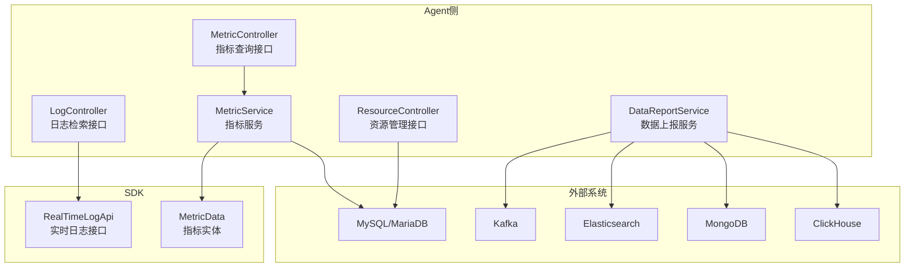
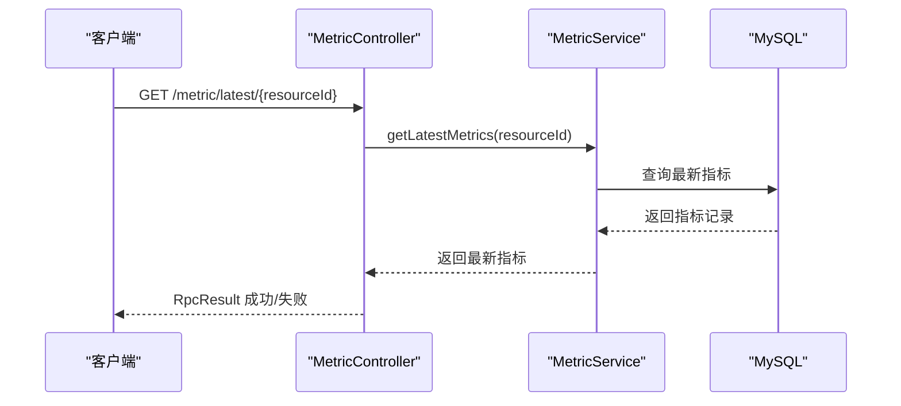
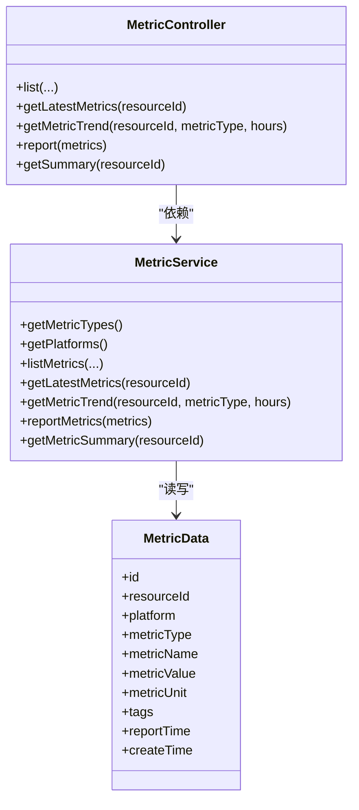
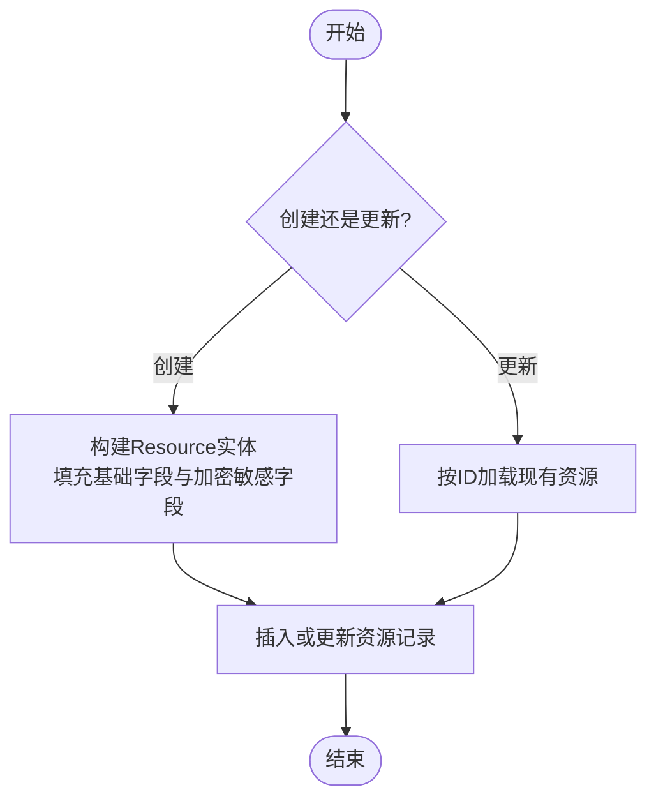
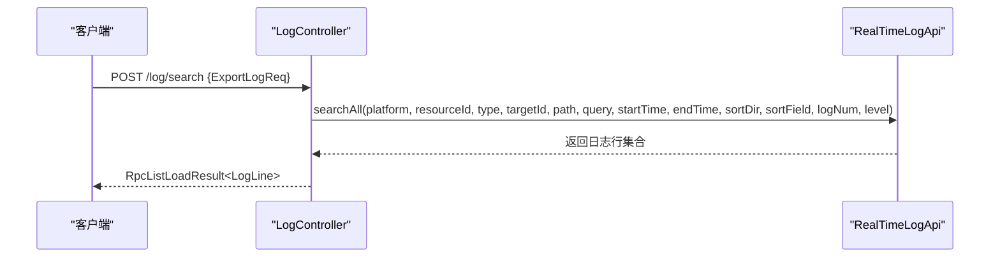
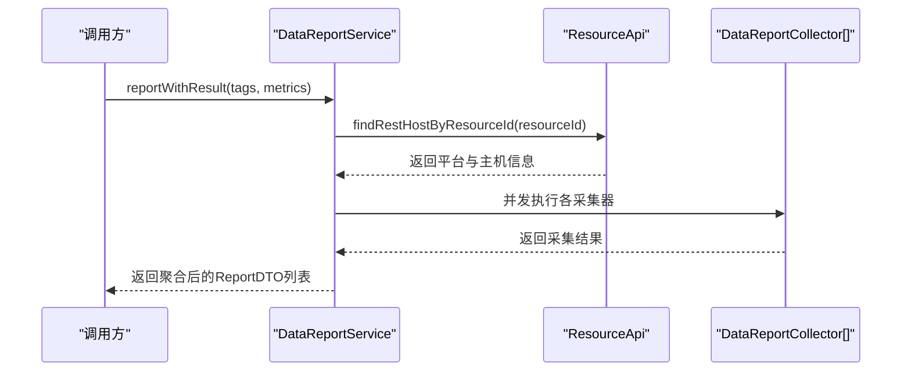
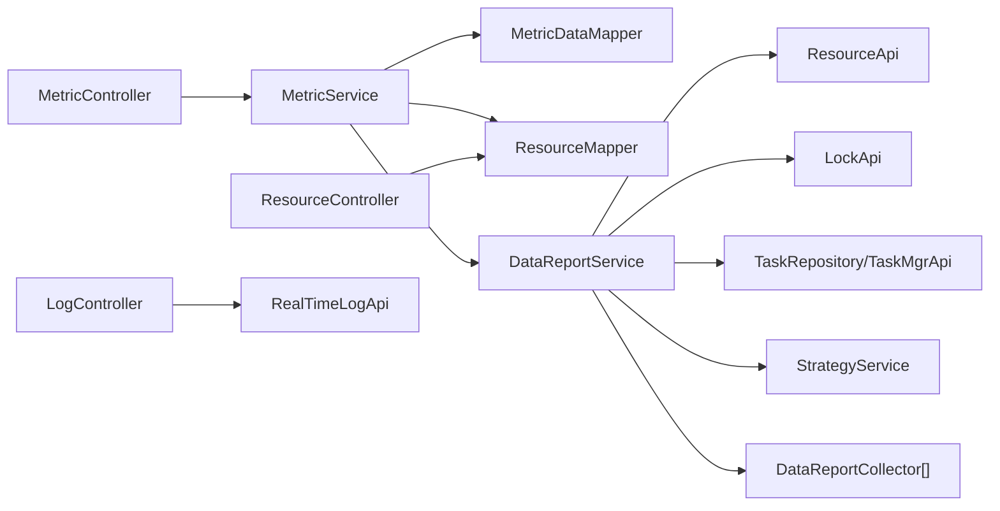

# 监控与维护

<cite>
**本文引用的文件**   
- [watcher-agent/src/main/java/com/virtual/cloud/om/agent/controller/MetricController.java](file://watcher-agent/src/main/java/com/virtual/cloud/om/agent/controller/MetricController.java)
- [watcher-agent/src/main/java/com/virtual/cloud/om/agent/controller/ResourceController.java](file://watcher-agent/src/main/java/com/virtual/cloud/om/agent/controller/ResourceController.java)
- [watcher-agent/src/main/java/com/virtual/cloud/om/agent/controller/LogController.java](file://watcher-agent/src/main/java/com/virtual/cloud/om/agent/controller/LogController.java)
- [watcher-agent/src/main/java/com/virtual/cloud/om/agent/service/report/MetricService.java](file://watcher-agent/src/main/java/com/virtual/cloud/om/agent/service/report/MetricService.java)
- [watcher-agent/src/main/java/com/virtual/cloud/om/agent/service/report/DataReportService.java](file://watcher-agent/src/main/java/com/virtual/cloud/om/agent/service/report/DataReportService.java)
- [watcher-agent/src/main/resources/logback-prod.xml](file://watcher-agent/src/main/resources/logback-prod.xml)
- [watcher-agent/src/main/resources/application-prod.properties](file://watcher-agent/src/main/resources/application-prod.properties)
- [watcher-agent/src/main/resources/application.properties](file://watcher-agent/src/main/resources/application.properties)
- [watcher-sdk/src/main/java/com/virtual/cloud/om/sdk/api/RealTimeLogApi.java](file://watcher-sdk/src/main/java/com/virtual/cloud/om/sdk/api/RealTimeLogApi.java)
- [watcher-sdk/src/main/java/com/virtual/cloud/om/sdk/entity/mysql/MetricData.java](file://watcher-sdk/src/main/java/com/virtual/cloud/om/sdk/entity/mysql/MetricData.java)
</cite>

## 目录
1. [简介](#简介)
2. [项目结构](#项目结构)
3. [核心组件](#核心组件)
4. [架构总览](#架构总览)
5. [详细组件分析](#详细组件分析)
6. [依赖分析](#依赖分析)
7. [性能考虑](#性能考虑)
8. [故障排查指南](#故障排查指南)
9. [结论](#结论)
10. [附录](#附录)

## 简介
本指南面向ShowTime监控系统的运维与维护团队，围绕系统健康检查、资源与性能监控、日志管理、容量规划与预警、故障诊断、定期维护任务以及运维自动化与智能化监控等方面，提供可操作的实施建议与最佳实践。文档以watcher-agent为核心，结合SDK中的指标与日志能力，给出端到端的监控与维护方案。

## 项目结构
- 核心模块
  - watcher-agent：Agent侧控制器与服务，负责指标上报、资源管理、日志检索等。
  - watcher-sdk：跨模块共享API、实体与常量定义，支撑指标与日志采集。
  - watcher-builder：打包与部署脚本及组件（如Filebeat），用于日志采集与分发。
  - watcher-cas、watcher-uis、watcher-onestor、watcher-workspace：插件或子系统，提供平台对接与数据采集能力。
- 关键配置
  - application.properties：本地开发默认配置，含MySQL、Actuator健康检查、中间件开关等。
  - application-prod.properties：生产环境配置，含MongoDB、Kafka、ES、ClickHouse、UIS/CAS/OneStor对接参数。
  - logback-prod.xml：生产日志滚动策略与格式。

图表来源
- [watcher-agent/src/main/java/com/virtual/cloud/om/agent/controller/MetricController.java:1-103](file://watcher-agent/src/main/java/com/virtual/cloud/om/agent/controller/MetricController.java#L1-L103)
- [watcher-agent/src/main/java/com/virtual/cloud/om/agent/controller/ResourceController.java:1-235](file://watcher-agent/src/main/java/com/virtual/cloud/om/agent/controller/ResourceController.java#L1-L235)
- [watcher-agent/src/main/java/com/virtual/cloud/om/agent/controller/LogController.java:1-36](file://watcher-agent/src/main/java/com/virtual/cloud/om/agent/controller/LogController.java#L1-L36)
- [watcher-agent/src/main/java/com/virtual/cloud/om/agent/service/report/MetricService.java:1-266](file://watcher-agent/src/main/java/com/virtual/cloud/om/agent/service/report/MetricService.java#L1-L266)
- [watcher-agent/src/main/java/com/virtual/cloud/om/agent/service/report/DataReportService.java:1-334](file://watcher-agent/src/main/java/com/virtual/cloud/om/agent/service/report/DataReportService.java#L1-L334)
- [watcher-sdk/src/main/java/com/virtual/cloud/om/sdk/api/RealTimeLogApi.java:1-59](file://watcher-sdk/src/main/java/com/virtual/cloud/om/sdk/api/RealTimeLogApi.java#L1-L59)
- [watcher-sdk/src/main/java/com/virtual/cloud/om/sdk/entity/mysql/MetricData.java:1-43](file://watcher-sdk/src/main/java/com/virtual/cloud/om/sdk/entity/mysql/MetricData.java#L1-L43)

章节来源
- [watcher-agent/src/main/resources/application.properties:1-80](file://watcher-agent/src/main/resources/application.properties#L1-L80)
- [watcher-agent/src/main/resources/application-prod.properties:1-70](file://watcher-agent/src/main/resources/application-prod.properties#L1-L70)
- [watcher-agent/src/main/resources/logback-prod.xml:1-35](file://watcher-agent/src/main/resources/logback-prod.xml#L1-L35)

## 核心组件
- 指标查询与上报
  - 控制器提供指标类型、平台类型查询，指标列表、最新值、趋势、汇总查询，以及指标上报接口。
  - 服务层实现指标聚合、趋势查询、最新指标查询、数据库落盘与实时采集。
- 资源管理
  - 提供资源增删改查、可用性与远程权限控制，涉及敏感信息加密存储。
- 日志检索
  - 提供日志在线检索接口，委托SDK的实时日志API执行搜索。
- 数据上报
  - 基于多采集器并发执行，按指标与平台选择采集器，支持静态/动态指标上报，并记录错误信息。

章节来源
- [watcher-agent/src/main/java/com/virtual/cloud/om/agent/controller/MetricController.java:1-103](file://watcher-agent/src/main/java/com/virtual/cloud/om/agent/controller/MetricController.java#L1-L103)
- [watcher-agent/src/main/java/com/virtual/cloud/om/agent/service/report/MetricService.java:1-266](file://watcher-agent/src/main/java/com/virtual/cloud/om/agent/service/report/MetricService.java#L1-L266)
- [watcher-agent/src/main/java/com/virtual/cloud/om/agent/controller/ResourceController.java:1-235](file://watcher-agent/src/main/java/com/virtual/cloud/om/agent/controller/ResourceController.java#L1-L235)
- [watcher-agent/src/main/java/com/virtual/cloud/om/agent/controller/LogController.java:1-36](file://watcher-agent/src/main/java/com/virtual/cloud/om/agent/controller/LogController.java#L1-L36)
- [watcher-agent/src/main/java/com/virtual/cloud/om/agent/service/report/DataReportService.java:1-334](file://watcher-agent/src/main/java/com/virtual/cloud/om/agent/service/report/DataReportService.java#L1-L334)
- [watcher-sdk/src/main/java/com/virtual/cloud/om/sdk/api/RealTimeLogApi.java:1-59](file://watcher-sdk/src/main/java/com/virtual/cloud/om/sdk/api/RealTimeLogApi.java#L1-L59)
- [watcher-sdk/src/main/java/com/virtual/cloud/om/sdk/entity/mysql/MetricData.java:1-43](file://watcher-sdk/src/main/java/com/virtual/cloud/om/sdk/entity/mysql/MetricData.java#L1-L43)

## 架构总览
- 运行时健康检查
  - Actuator暴露健康检查端点，生产环境默认开启所有端点，便于统一健康检查。
- 指标采集与存储
  - DataReportService并发调度采集器，按平台与指标类型选择采集器；采集结果写入MySQL表metric_data。
- 日志采集与检索
  - 生产环境通过Filebeat与Kafka/ES等链路采集日志；LogController通过RealTimeLogApi进行日志检索。
- 外部系统集成
  - 生产配置启用MongoDB、Kafka、Elasticsearch、ClickHouse等中间件，用于数据存储与检索。

图表来源
- [watcher-agent/src/main/java/com/virtual/cloud/om/agent/controller/MetricController.java:59-78](file://watcher-agent/src/main/java/com/virtual/cloud/om/agent/controller/MetricController.java#L59-L78)
- [watcher-agent/src/main/java/com/virtual/cloud/om/agent/service/report/MetricService.java:160-192](file://watcher-agent/src/main/java/com/virtual/cloud/om/agent/service/report/MetricService.java#L160-L192)

章节来源
- [watcher-agent/src/main/resources/application.properties:9-11](file://watcher-agent/src/main/resources/application.properties#L9-L11)
- [watcher-agent/src/main/resources/application-prod.properties:1-70](file://watcher-agent/src/main/resources/application-prod.properties#L1-L70)

## 详细组件分析

### 指标查询与上报组件
- 功能要点
  - 支持查询指标类型、平台类型；支持按资源、平台、指标类型、时间范围查询指标列表。
  - 支持查询资源最新指标、指标趋势与汇总统计。
  - 支持指标数据上报，入库前补全时间戳与主键。
- 并发与容错
  - 实时采集采用异步并发执行，按指标与平台选择采集器，异常时记录错误并继续执行。
- 性能影响
  - 大批量上报时建议分批提交，避免单次请求过大导致超时或内存压力。

图表来源
- [watcher-agent/src/main/java/com/virtual/cloud/om/agent/controller/MetricController.java:1-103](file://watcher-agent/src/main/java/com/virtual/cloud/om/agent/controller/MetricController.java#L1-L103)
- [watcher-agent/src/main/java/com/virtual/cloud/om/agent/service/report/MetricService.java:1-266](file://watcher-agent/src/main/java/com/virtual/cloud/om/agent/service/report/MetricService.java#L1-L266)
- [watcher-sdk/src/main/java/com/virtual/cloud/om/sdk/entity/mysql/MetricData.java:1-43](file://watcher-sdk/src/main/java/com/virtual/cloud/om/sdk/entity/mysql/MetricData.java#L1-L43)

章节来源
- [watcher-agent/src/main/java/com/virtual/cloud/om/agent/controller/MetricController.java:29-101](file://watcher-agent/src/main/java/com/virtual/cloud/om/agent/controller/MetricController.java#L29-L101)
- [watcher-agent/src/main/java/com/virtual/cloud/om/agent/service/report/MetricService.java:32-264](file://watcher-agent/src/main/java/com/virtual/cloud/om/agent/service/report/MetricService.java#L32-L264)

### 资源管理组件
- 功能要点
  - 支持资源列表、详情、创建、批量创建、更新、删除、设置可用状态与远程权限。
  - 创建/更新时对敏感字段进行加密存储，确保安全。
- 安全与合规
  - 使用SM4加密存储CI、ServerPassword等敏感信息，减少明文泄露风险。

图表来源
- [watcher-agent/src/main/java/com/virtual/cloud/om/agent/controller/ResourceController.java:67-135](file://watcher-agent/src/main/java/com/virtual/cloud/om/agent/controller/ResourceController.java#L67-L135)
- [watcher-agent/src/main/java/com/virtual/cloud/om/agent/controller/ResourceController.java:137-183](file://watcher-agent/src/main/java/com/virtual/cloud/om/agent/controller/ResourceController.java#L137-L183)

章节来源
- [watcher-agent/src/main/java/com/virtual/cloud/om/agent/controller/ResourceController.java:34-233](file://watcher-agent/src/main/java/com/virtual/cloud/om/agent/controller/ResourceController.java#L34-L233)

### 日志检索组件
- 功能要点
  - 提供POST /log/search接口，基于RealTimeLogApi执行日志检索，支持平台、资源、类型、目标、路径、时间范围、排序与级别过滤。
- 与实时日志生态的衔接
  - 通过RealTimeLogApi对接Filebeat/Kafka/ES等链路，实现日志的实时采集与检索。

图表来源
- [watcher-agent/src/main/java/com/virtual/cloud/om/agent/controller/LogController.java:27-34](file://watcher-agent/src/main/java/com/virtual/cloud/om/agent/controller/LogController.java#L27-L34)
- [watcher-sdk/src/main/java/com/virtual/cloud/om/sdk/api/RealTimeLogApi.java:57-57](file://watcher-sdk/src/main/java/com/virtual/cloud/om/sdk/api/RealTimeLogApi.java#L57-L57)

章节来源
- [watcher-agent/src/main/java/com/virtual/cloud/om/agent/controller/LogController.java:1-36](file://watcher-agent/src/main/java/com/virtual/cloud/om/agent/controller/LogController.java#L1-L36)
- [watcher-sdk/src/main/java/com/virtual/cloud/om/sdk/api/RealTimeLogApi.java:1-59](file://watcher-sdk/src/main/java/com/virtual/cloud/om/sdk/api/RealTimeLogApi.java#L1-L59)

### 数据上报组件
- 功能要点
  - 按指标与平台选择采集器，支持静态/动态指标上报；并发执行多个采集器，聚合结果后返回或入库。
  - 对异常进行分类记录，便于后续追踪与告警。
- 并发与上下文
  - 为避免类加载器问题，设置线程上下文类加载器，保证采集器在ForkJoinPool中正常工作。

图表来源
- [watcher-agent/src/main/java/com/virtual/cloud/om/agent/service/report/DataReportService.java:145-230](file://watcher-agent/src/main/java/com/virtual/cloud/om/agent/service/report/DataReportService.java#L145-L230)
- [watcher-agent/src/main/java/com/virtual/cloud/om/agent/service/report/DataReportService.java:235-296](file://watcher-agent/src/main/java/com/virtual/cloud/om/agent/service/report/DataReportService.java#L235-L296)

章节来源
- [watcher-agent/src/main/java/com/virtual/cloud/om/agent/service/report/DataReportService.java:86-154](file://watcher-agent/src/main/java/com/virtual/cloud/om/agent/service/report/DataReportService.java#L86-L154)

## 依赖分析
- 组件耦合
  - MetricController依赖MetricService；MetricService依赖MetricDataMapper、ResourceMapper与DataReportService。
  - DataReportService依赖ResourceApi、LockApi、TaskRepository、TaskMgrApi、StrategyService与多个DataReportCollector。
  - LogController依赖RealTimeLogApi。
- 外部依赖
  - 生产环境启用MongoDB、Kafka、Elasticsearch、ClickHouse；本地开发默认禁用中间件以便快速启动。
- 配置开关
  - 通过application.properties与application-prod.properties切换不同环境配置，生产环境启用更多中间件与外部服务。

图表来源
- [watcher-agent/src/main/java/com/virtual/cloud/om/agent/controller/MetricController.java:1-103](file://watcher-agent/src/main/java/com/virtual/cloud/om/agent/controller/MetricController.java#L1-L103)
- [watcher-agent/src/main/java/com/virtual/cloud/om/agent/service/report/MetricService.java:1-266](file://watcher-agent/src/main/java/com/virtual/cloud/om/agent/service/report/MetricService.java#L1-L266)
- [watcher-agent/src/main/java/com/virtual/cloud/om/agent/controller/ResourceController.java:1-235](file://watcher-agent/src/main/java/com/virtual/cloud/om/agent/controller/ResourceController.java#L1-L235)
- [watcher-agent/src/main/java/com/virtual/cloud/om/agent/controller/LogController.java:1-36](file://watcher-agent/src/main/java/com/virtual/cloud/om/agent/controller/LogController.java#L1-L36)
- [watcher-agent/src/main/java/com/virtual/cloud/om/agent/service/report/DataReportService.java:1-334](file://watcher-agent/src/main/java/com/virtual/cloud/om/agent/service/report/DataReportService.java#L1-L334)
- [watcher-sdk/src/main/java/com/virtual/cloud/om/sdk/api/RealTimeLogApi.java:1-59](file://watcher-sdk/src/main/java/com/virtual/cloud/om/sdk/api/RealTimeLogApi.java#L1-L59)

章节来源
- [watcher-agent/src/main/resources/application.properties:14-29](file://watcher-agent/src/main/resources/application.properties#L14-L29)
- [watcher-agent/src/main/resources/application-prod.properties:3-69](file://watcher-agent/src/main/resources/application-prod.properties#L3-L69)

## 性能考虑
- 指标采集
  - 使用并发采集器并行执行，缩短采集耗时；建议按资源维度分批上报，避免单次请求过大。
  - 对静态指标加锁避免重复采集，提升稳定性。
- 数据库
  - 指标入库前补全时间戳与主键，避免空值引发的查询异常；合理设计索引以优化趋势与最新指标查询。
- 日志
  - 生产日志采用按大小与时间滚动压缩，限制单文件大小与总大小，避免磁盘占用过高。
- 中间件
  - 生产环境启用Kafka/ES/MongoDB/ClickHouse时，需关注连接池、超时与序列化开销；建议对高吞吐场景进行压测与参数调优。

章节来源
- [watcher-agent/src/main/java/com/virtual/cloud/om/agent/service/report/DataReportService.java:188-230](file://watcher-agent/src/main/java/com/virtual/cloud/om/agent/service/report/DataReportService.java#L188-L230)
- [watcher-agent/src/main/resources/logback-prod.xml:18-26](file://watcher-agent/src/main/resources/logback-prod.xml#L18-L26)
- [watcher-agent/src/main/resources/application-prod.properties:7-29](file://watcher-agent/src/main/resources/application-prod.properties#L7-L29)

## 故障排查指南
- 健康检查
  - 通过Actuator健康端点查看应用与依赖中间件状态；生产环境默认开启所有端点，便于集中监控。
- 指标相关
  - 若“最新指标为空”，检查资源是否存在与采集器是否正确匹配平台；查看采集器异常日志定位具体指标。
- 日志检索
  - 若检索无结果，确认RealTimeLogApi下游（Kafka/ES/Filebeat）是否正常；核对查询条件与时间范围。
- 资源管理
  - 创建/更新失败时，检查敏感字段加密流程与数据库连接；核对必填字段与IP/端口连通性。
- 配置问题
  - 切换环境配置后，确认中间件开关与连接参数是否匹配当前环境。

章节来源
- [watcher-agent/src/main/resources/application.properties:9-11](file://watcher-agent/src/main/resources/application.properties#L9-L11)
- [watcher-agent/src/main/java/com/virtual/cloud/om/agent/service/report/MetricService.java:163-192](file://watcher-agent/src/main/java/com/virtual/cloud/om/agent/service/report/MetricService.java#L163-L192)
- [watcher-agent/src/main/java/com/virtual/cloud/om/agent/controller/LogController.java:27-34](file://watcher-agent/src/main/java/com/virtual/cloud/om/agent/controller/LogController.java#L27-L34)
- [watcher-agent/src/main/java/com/virtual/cloud/om/agent/controller/ResourceController.java:67-96](file://watcher-agent/src/main/java/com/virtual/cloud/om/agent/controller/ResourceController.java#L67-L96)

## 结论
ShowTime监控系统通过Agent侧的指标与日志能力，结合SDK的统一接口与实体模型，形成覆盖服务状态、资源使用与性能指标的完整监控闭环。配合生产环境的中间件配置与日志滚动策略，可在保障性能的同时满足可观测性需求。建议在实际运维中持续完善容量规划、预警策略与自动化运维流程，以提升系统的稳定性与可维护性。

## 附录
- 运维清单（示例）
  - 健康检查：每日巡检Actuator健康端点与关键中间件状态。
  - 日志管理：核对日志滚动策略与磁盘配额，定期清理过期日志。
  - 指标维护：定期校验指标入库完整性与查询性能，必要时重建索引。
  - 资源维护：核对资源可用性与远程权限，清理无效资源。
  - 自动化：将健康检查、日志轮转、指标巡检纳入自动化任务，降低人工干预成本。