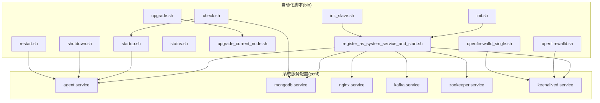
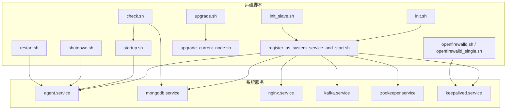
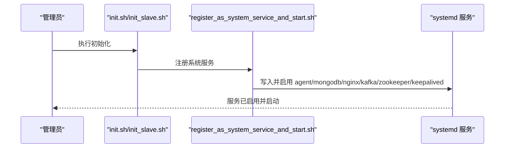
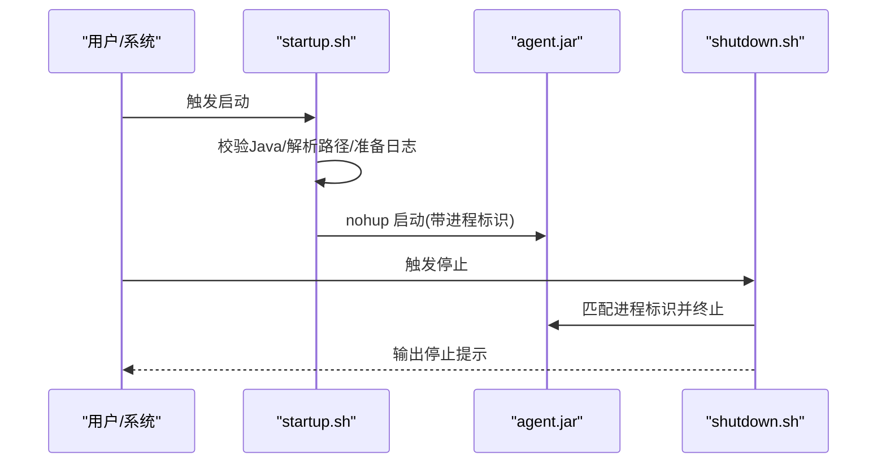
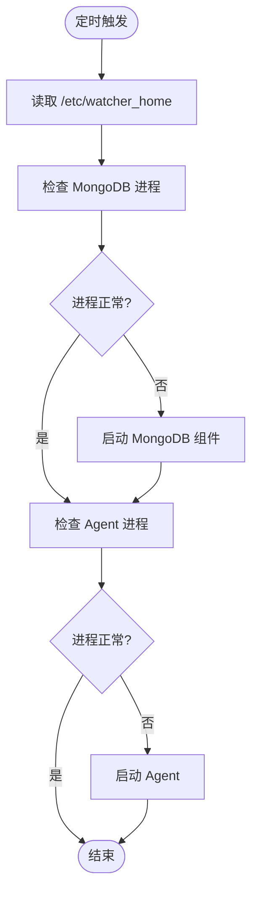
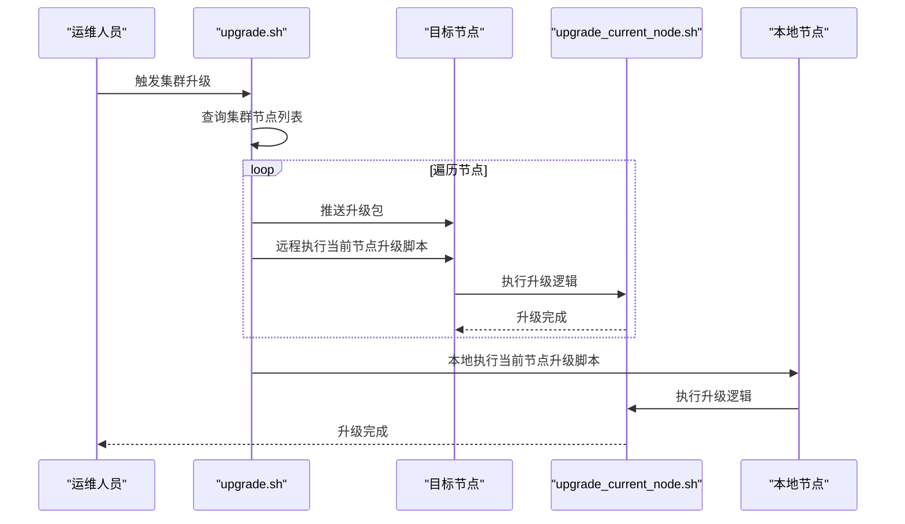
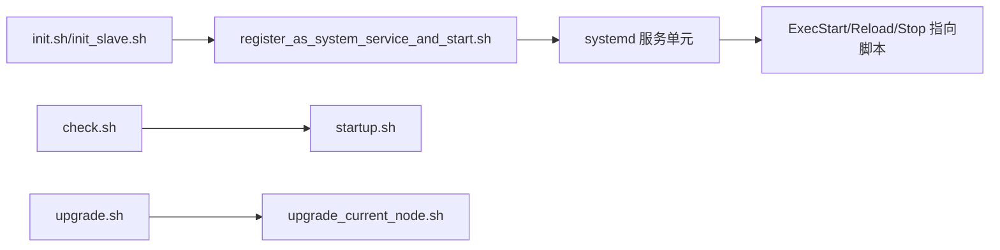

# 维护任务与自动化

<cite>
**本文引用的文件**
- [init.sh](file://watcher-builder/assembly/bin/init.sh)
- [init_slave.sh](file://watcher-builder/assembly/bin/init_slave.sh)
- [startup.sh](file://watcher-builder/assembly/bin/startup.sh)
- [shutdown.sh](file://watcher-builder/assembly/bin/shutdown.sh)
- [restart.sh](file://watcher-builder/assembly/bin/restart.sh)
- [status.sh](file://watcher-builder/assembly/bin/status.sh)
- [check.sh](file://watcher-builder/assembly/bin/check.sh)
- [upgrade.sh](file://watcher-builder/assembly/bin/upgrade.sh)
- [upgrade_current_node.sh](file://watcher-builder/assembly/bin/upgrade_current_node.sh)
- [openfirewalld.sh](file://watcher-builder/assembly/bin/openfirewalld.sh)
- [openfirewalld_single.sh](file://watcher-builder/assembly/bin/openfirewalld_single.sh)
- [register_as_system_service_and_start.sh](file://watcher-builder/assembly/bin/register_as_system_service_and_start.sh)
- [agent.service](file://watcher-builder/assembly/conf/agent.service)
- [mongodb.service](file://watcher-builder/assembly/conf/mongodb.service)
- [nginx.service](file://watcher-builder/assembly/conf/nginx.service)
- [kafka.service](file://watcher-builder/assembly/conf/kafka.service)
- [zookeeper.service](file://watcher-builder/assembly/conf/zookeeper.service)
- [keepalived.service](file://watcher-builder/assembly/conf/keepalived.service)
</cite>

## 目录
1. 引言
2. 项目结构
3. 核心组件
4. 架构总览
5. 详细组件分析
6. 依赖关系分析
7. 性能考量
8. 故障排查指南
9. 结论
10. 附录

## 引言
本指南围绕“维护任务与自动化”主题，系统梳理并说明以下内容：
- 定期维护任务的计划与执行：数据清理、索引重建、配置更新、系统优化等自动化脚本的设计思路与最佳实践。
- 部署与升级自动化：init.sh 初始化脚本、startup.sh 启动脚本、shutdown.sh 停止脚本、upgrade.sh 升级脚本及当前节点升级脚本的职责、调用关系与使用方法。
- 备份与恢复自动化：数据备份、配置备份与灾难恢复的自动化流程设计建议。
- 监控告警自动化：自动重启、自动扩容与自动修复的配置方法与落地路径。
- 调度策略与执行监控：如何通过定时任务、健康检查与日志审计保障自动化稳定运行。

本指南在不直接展示具体代码的前提下，基于仓库中现有脚本与服务配置进行深入解读，并提供可视化图示帮助理解。

## 项目结构
本项目的自动化能力主要集中在 watcher-builder/assembly/bin 与 watcher-builder/assembly/conf 两个目录：
- bin 目录：包含运维生命周期脚本（初始化、启动、停止、重启、状态查询、健康检查、升级、防火墙开放、注册为系统服务等）。
- conf 目录：包含 systemd 服务单元模板，用于将各组件纳入系统服务管理。

图表来源
- [init.sh:1-35](file://watcher-builder/assembly/bin/init.sh#L1-L35)
- [init_slave.sh:1-30](file://watcher-builder/assembly/bin/init_slave.sh#L1-L30)
- [register_as_system_service_and_start.sh:1-45](file://watcher-builder/assembly/bin/register_as_system_service_and_start.sh#L1-L45)
- [agent.service:1-14](file://watcher-builder/assembly/conf/agent.service#L1-L14)
- [mongodb.service:1-14](file://watcher-builder/assembly/conf/mongodb.service#L1-L14)
- [nginx.service:1-14](file://watcher-builder/assembly/conf/nginx.service#L1-L14)
- [kafka.service:1-14](file://watcher-builder/assembly/conf/kafka.service#L1-L14)
- [zookeeper.service:1-14](file://watcher-builder/assembly/conf/zookeeper.service#L1-L14)
- [keepalived.service:1-14](file://watcher-builder/assembly/conf/keepalived.service#L1-L14)

章节来源
- [init.sh:1-35](file://watcher-builder/assembly/bin/init.sh#L1-L35)
- [init_slave.sh:1-30](file://watcher-builder/assembly/bin/init_slave.sh#L1-L30)
- [register_as_system_service_and_start.sh:1-45](file://watcher-builder/assembly/bin/register_as_system_service_and_start.sh#L1-L45)

## 核心组件
- 初始化脚本
  - init.sh：完成环境变量写入、复制安装包、启动主节点组件、注册为系统服务，并添加每分钟健康检查的 crontab；同时调整 SSH 算法与关闭防火墙。
  - init_slave.sh：与 init.sh 类似，但面向从节点，避免重复 MongoDB 主节点操作。
- 生命周期脚本
  - startup.sh：检测 Java 版本、解析工作目录、准备日志与 GC 参数、以 nohup 方式启动 agent.jar，并设置进程标识。
  - shutdown.sh：通过进程标识匹配并终止进程，确保优雅停机。
  - restart.sh：先停止再启动，作为服务重载入口。
  - status.sh：通过进程标识判断服务运行状态。
- 健康检查与自愈
  - check.sh：每分钟检查 MongoDB 与 agent 进程，若异常则自动启动对应组件。
- 升级自动化
  - upgrade.sh：拉取集群节点信息，逐节点推送升级包并通过 ssh 执行当前节点升级脚本，最后本地执行升级。
  - upgrade_current_node.sh：在当前节点复制新版本的 bin/lib/plugins/conf/html/inspect 等目录，保留部分配置以避免覆盖集群参数，然后触发 restart.sh。
- 网络与系统服务
  - openfirewalld.sh / openfirewalld_single.sh：开启 firewalld 并放通必要端口与 VRRP 组播。
  - register_as_system_service_and_start.sh：将 agent、mongodb、nginx、kafka、zookeeper、keepalived 的 systemd 模板注入实际路径并启用/启动。

章节来源
- [init.sh:1-35](file://watcher-builder/assembly/bin/init.sh#L1-L35)
- [init_slave.sh:1-30](file://watcher-builder/assembly/bin/init_slave.sh#L1-L30)
- [startup.sh:1-81](file://watcher-builder/assembly/bin/startup.sh#L1-L81)
- [shutdown.sh:1-26](file://watcher-builder/assembly/bin/shutdown.sh#L1-L26)
- [restart.sh:1-9](file://watcher-builder/assembly/bin/restart.sh#L1-L9)
- [status.sh:1-10](file://watcher-builder/assembly/bin/status.sh#L1-L10)
- [check.sh:1-27](file://watcher-builder/assembly/bin/check.sh#L1-L27)
- [upgrade.sh:1-53](file://watcher-builder/assembly/bin/upgrade.sh#L1-L53)
- [upgrade_current_node.sh:1-44](file://watcher-builder/assembly/bin/upgrade_current_node.sh#L1-L44)
- [openfirewalld.sh:1-21](file://watcher-builder/assembly/bin/openfirewalld.sh#L1-L21)
- [openfirewalld_single.sh:1-9](file://watcher-builder/assembly/bin/openfirewalld_single.sh#L1-L9)
- [register_as_system_service_and_start.sh:1-45](file://watcher-builder/assembly/bin/register_as_system_service_and_start.sh#L1-L45)

## 架构总览
下图展示了系统服务与脚本之间的交互关系，以及升级与健康检查的关键流程。

图表来源
- [register_as_system_service_and_start.sh:1-45](file://watcher-builder/assembly/bin/register_as_system_service_and_start.sh#L1-L45)
- [agent.service:1-14](file://watcher-builder/assembly/conf/agent.service#L1-L14)
- [mongodb.service:1-14](file://watcher-builder/assembly/conf/mongodb.service#L1-L14)
- [nginx.service:1-14](file://watcher-builder/assembly/conf/nginx.service#L1-L14)
- [kafka.service:1-14](file://watcher-builder/assembly/conf/kafka.service#L1-L14)
- [zookeeper.service:1-14](file://watcher-builder/assembly/conf/zookeeper.service#L1-L14)
- [keepalived.service:1-14](file://watcher-builder/assembly/conf/keepalived.service#L1-L14)
- [init.sh:1-35](file://watcher-builder/assembly/bin/init.sh#L1-L35)
- [init_slave.sh:1-30](file://watcher-builder/assembly/bin/init_slave.sh#L1-L30)
- [startup.sh:1-81](file://watcher-builder/assembly/bin/startup.sh#L1-L81)
- [shutdown.sh:1-26](file://watcher-builder/assembly/bin/shutdown.sh#L1-L26)
- [restart.sh:1-9](file://watcher-builder/assembly/bin/restart.sh#L1-L9)
- [check.sh:1-27](file://watcher-builder/assembly/bin/check.sh#L1-L27)
- [upgrade.sh:1-53](file://watcher-builder/assembly/bin/upgrade.sh#L1-L53)
- [upgrade_current_node.sh:1-44](file://watcher-builder/assembly/bin/upgrade_current_node.sh#L1-L44)
- [openfirewalld.sh:1-21](file://watcher-builder/assembly/bin/openfirewalld.sh#L1-L21)
- [openfirewalld_single.sh:1-9](file://watcher-builder/assembly/bin/openfirewalld_single.sh#L1-L9)

## 详细组件分析

### 初始化与系统服务注册
- init.sh 与 init_slave.sh 的共同点与差异：
  - 共同点：均写入 /etc/watcher_home，注册为系统服务，调整 SSH 算法，关闭防火墙。
  - 差异：init.sh 在主节点场景下还会启动 MongoDB 主脚本与通用启动脚本，而 init_slave.sh 面向从节点，避免重复主节点操作。
- 系统服务注册：
  - register_as_system_service_and_start.sh 将 agent、mongodb、nginx、kafka、zookeeper、keepalived 的 systemd 模板中的占位符替换为实际路径并启用/启动，确保开机自启与统一管理。

图表来源
- [init.sh:1-35](file://watcher-builder/assembly/bin/init.sh#L1-L35)
- [init_slave.sh:1-30](file://watcher-builder/assembly/bin/init_slave.sh#L1-L30)
- [register_as_system_service_and_start.sh:1-45](file://watcher-builder/assembly/bin/register_as_system_service_and_start.sh#L1-L45)

章节来源
- [init.sh:1-35](file://watcher-builder/assembly/bin/init.sh#L1-L35)
- [init_slave.sh:1-30](file://watcher-builder/assembly/bin/init_slave.sh#L1-L30)
- [register_as_system_service_and_start.sh:1-45](file://watcher-builder/assembly/bin/register_as_system_service_and_start.sh#L1-L45)

### 启动与停止流程
- startup.sh：
  - 检测 Java 可用性与版本（≥1.8），解析工作目录与配置目录，准备日志与 GC 参数，nohup 启动 agent.jar，并设置进程标识。
- shutdown.sh：
  - 通过进程标识匹配并终止进程，等待一段时间后输出停止提示。
- restart.sh：
  - 串联 shutdown.sh 与 startup.sh，作为服务重载入口。

图表来源
- [startup.sh:1-81](file://watcher-builder/assembly/bin/startup.sh#L1-L81)
- [shutdown.sh:1-26](file://watcher-builder/assembly/bin/shutdown.sh#L1-L26)

章节来源
- [startup.sh:1-81](file://watcher-builder/assembly/bin/startup.sh#L1-L81)
- [shutdown.sh:1-26](file://watcher-builder/assembly/bin/shutdown.sh#L1-L26)
- [restart.sh:1-9](file://watcher-builder/assembly/bin/restart.sh#L1-L9)
- [status.sh:1-10](file://watcher-builder/assembly/bin/status.sh#L1-L10)

### 健康检查与自愈
- check.sh：
  - 每分钟检查 MongoDB 与 agent 进程，若发现异常则自动启动对应组件。
  - 该脚本通过 crontab（由 init.sh 添加）周期性执行，形成基础的自愈机制。

图表来源
- [check.sh:1-27](file://watcher-builder/assembly/bin/check.sh#L1-L27)
- [init.sh:22-25](file://watcher-builder/assembly/bin/init.sh#L22-L25)

章节来源
- [check.sh:1-27](file://watcher-builder/assembly/bin/check.sh#L1-L27)

### 升级自动化与安全策略
- upgrade.sh：
  - 从本地接口查询集群节点列表，遍历每个节点，使用 sshpass 推送升级包并远程执行当前节点升级脚本，最后在本地执行当前节点升级。
- upgrade_current_node.sh：
  - 复制新版 bin/lib/plugins/conf/html/inspect 等目录到目标路径；保留部分配置以避免覆盖集群参数；随后触发 restart.sh 完成升级。
- 安全升级策略建议：
  - 使用只读账户或专用升级账号，限制推送与执行权限。
  - 升级前生成快照或备份，升级后验证功能与日志。
  - 分批滚动升级，避免全量同时升级导致业务中断。
  - 在升级脚本中增加校验步骤（如版本号比对、完整性校验）。

图表来源
- [upgrade.sh:1-53](file://watcher-builder/assembly/bin/upgrade.sh#L1-L53)
- [upgrade_current_node.sh:1-44](file://watcher-builder/assembly/bin/upgrade_current_node.sh#L1-L44)

章节来源
- [upgrade.sh:1-53](file://watcher-builder/assembly/bin/upgrade.sh#L1-L53)
- [upgrade_current_node.sh:1-44](file://watcher-builder/assembly/bin/upgrade_current_node.sh#L1-L44)

### 网络与防火墙配置
- openfirewalld.sh / openfirewalld_single.sh：
  - 开启 firewalld 并放通必要端口（如 80/tcp），以及 VRRP 组播规则，适用于高可用场景。
- 结合 keepalived 服务，可实现故障切换与流量接管。

章节来源
- [openfirewalld.sh:1-21](file://watcher-builder/assembly/bin/openfirewalld.sh#L1-L21)
- [openfirewalld_single.sh:1-9](file://watcher-builder/assembly/bin/openfirewalld_single.sh#L1-L9)
- [keepalived.service:1-14](file://watcher-builder/assembly/conf/keepalived.service#L1-L14)

## 依赖关系分析
- systemd 服务与脚本的耦合：
  - agent.service、mongodb.service、nginx.service、kafka.service、zookeeper.service、keepalived.service 的 ExecStart/ExecReload/ExecStop 均指向对应的脚本，形成强耦合。
- 脚本间的依赖：
  - init.sh/init_slave.sh 依赖 register_as_system_service_and_start.sh 完成服务注册。
  - check.sh 依赖 startup.sh 与组件启动脚本进行自愈。
  - upgrade.sh 依赖 upgrade_current_node.sh 实现节点升级。
- 外部依赖：
  - Java 运行时（startup.sh 中版本校验）。
  - sshpass（upgrade.sh 中用于免交互推送与执行）。
  - curl（upgrade.sh 中查询集群节点）。

图表来源
- [agent.service:1-14](file://watcher-builder/assembly/conf/agent.service#L1-L14)
- [mongodb.service:1-14](file://watcher-builder/assembly/conf/mongodb.service#L1-L14)
- [nginx.service:1-14](file://watcher-builder/assembly/conf/nginx.service#L1-L14)
- [kafka.service:1-14](file://watcher-builder/assembly/conf/kafka.service#L1-L14)
- [zookeeper.service:1-14](file://watcher-builder/assembly/conf/zookeeper.service#L1-L14)
- [keepalived.service:1-14](file://watcher-builder/assembly/conf/keepalived.service#L1-L14)
- [init.sh:1-35](file://watcher-builder/assembly/bin/init.sh#L1-L35)
- [register_as_system_service_and_start.sh:1-45](file://watcher-builder/assembly/bin/register_as_system_service_and_start.sh#L1-L45)
- [check.sh:1-27](file://watcher-builder/assembly/bin/check.sh#L1-L27)
- [startup.sh:1-81](file://watcher-builder/assembly/bin/startup.sh#L1-L81)
- [upgrade.sh:1-53](file://watcher-builder/assembly/bin/upgrade.sh#L1-L53)
- [upgrade_current_node.sh:1-44](file://watcher-builder/assembly/bin/upgrade_current_node.sh#L1-L44)

章节来源
- [agent.service:1-14](file://watcher-builder/assembly/conf/agent.service#L1-L14)
- [register_as_system_service_and_start.sh:1-45](file://watcher-builder/assembly/bin/register_as_system_service_and_start.sh#L1-L45)
- [check.sh:1-27](file://watcher-builder/assembly/bin/check.sh#L1-L27)
- [upgrade.sh:1-53](file://watcher-builder/assembly/bin/upgrade.sh#L1-L53)

## 性能考量
- JVM 与 GC：
  - startup.sh 设置了固定的堆大小与 GC 日志轮转策略，有助于定位内存问题与性能瓶颈。
- 启动与停止延迟：
  - 通过 nohup 与后台启动减少阻塞；shutdown.sh 提供短暂休眠以确保资源释放。
- 升级窗口：
  - 建议在低峰时段执行升级，结合分批滚动策略降低对业务的影响。
- 网络与安全：
  - openfirewalld.sh 放通必要端口，避免不必要的网络开销；init.sh 调整 SSH 算法提升安全性。

章节来源
- [startup.sh:60-78](file://watcher-builder/assembly/bin/startup.sh#L60-L78)
- [openfirewalld.sh:1-21](file://watcher-builder/assembly/bin/openfirewalld.sh#L1-L21)
- [init.sh:24-25](file://watcher-builder/assembly/bin/init.sh#L24-L25)

## 故障排查指南
- 无法启动或进程异常
  - 使用 status.sh 检查服务状态；查看 logs 下的 gc 与 dump 目录，结合错误输出定位问题。
  - 若进程未启动，执行 check.sh 或手动触发 startup.sh。
- 升级失败
  - 查看 upgrade.log，确认节点列表是否正确、sshpass 密码是否匹配、目标节点磁盘空间是否充足。
  - 回滚策略：保留上一版本目录或使用快照恢复。
- 系统服务未生效
  - 检查 register_as_system_service_and_start.sh 是否成功替换占位符并启用服务；确认 systemd 重载与启动结果。
- 端口与防火墙
  - 使用 openfirewalld.sh 或 openfirewalld_single.sh 放通端口；核对 VRRP 组播规则是否生效。

章节来源
- [status.sh:1-10](file://watcher-builder/assembly/bin/status.sh#L1-L10)
- [check.sh:1-27](file://watcher-builder/assembly/bin/check.sh#L1-L27)
- [startup.sh:55-78](file://watcher-builder/assembly/bin/startup.sh#L55-L78)
- [upgrade.sh:1-53](file://watcher-builder/assembly/bin/upgrade.sh#L1-L53)
- [register_as_system_service_and_start.sh:1-45](file://watcher-builder/assembly/bin/register_as_system_service_and_start.sh#L1-L45)
- [openfirewalld.sh:1-21](file://watcher-builder/assembly/bin/openfirewalld.sh#L1-L21)

## 结论
本项目通过一组完善的自动化脚本与 systemd 服务配置，实现了从初始化、启动/停止、健康检查、升级到网络与系统服务管理的全生命周期自动化。结合本文提供的调度策略与监控最佳实践，可在保证稳定性的同时显著降低运维成本。建议在生产环境中进一步完善备份与回滚机制、引入更细粒度的监控与告警，并对升级流程进行演练与演练记录，以持续提升自动化水平与可靠性。

## 附录
- 定期维护任务建议（概念性）
  - 数据清理：按日/周清理过期日志与临时文件，避免磁盘膨胀。
  - 索引重建：在业务低峰期重建或优化索引，结合慢查询日志评估效果。
  - 配置更新：集中化配置管理，变更前生成 diff 并做灰度验证。
  - 系统优化：定期检查 JVM 参数、GC 行为与线程池配置，结合性能指标动态调整。
- 备份与恢复（概念性）
  - 数据备份：数据库与配置文件定期快照，异地存储。
  - 配置备份：版本化管理，变更审计与审批。
  - 灾难恢复：制定 RTO/RPO 指标，定期演练恢复流程。
- 监控告警自动化（概念性）
  - 自动重启：进程异常时自动触发 restart.sh。
  - 自动扩容：结合资源使用率阈值与弹性伸缩策略。
  - 自动修复：针对常见问题（如磁盘空间不足、网络不可达）预置修复脚本。
- 调度策略与执行监控（概念性）
  - 使用 crontab 或调度平台统一管理定时任务，集中记录日志与告警。
  - 对关键脚本增加幂等性与重试机制，避免重复执行造成副作用。