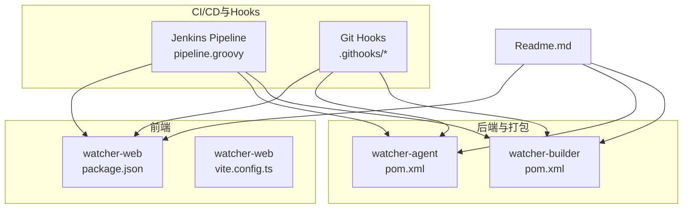
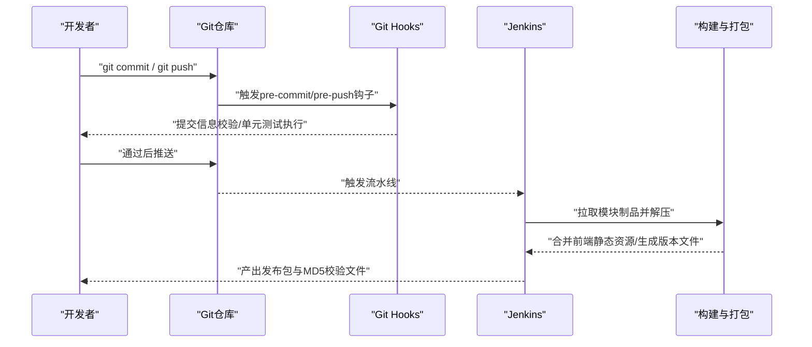
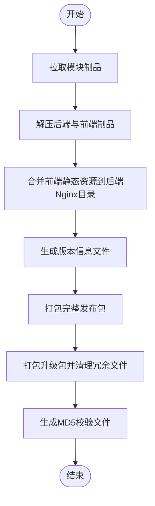
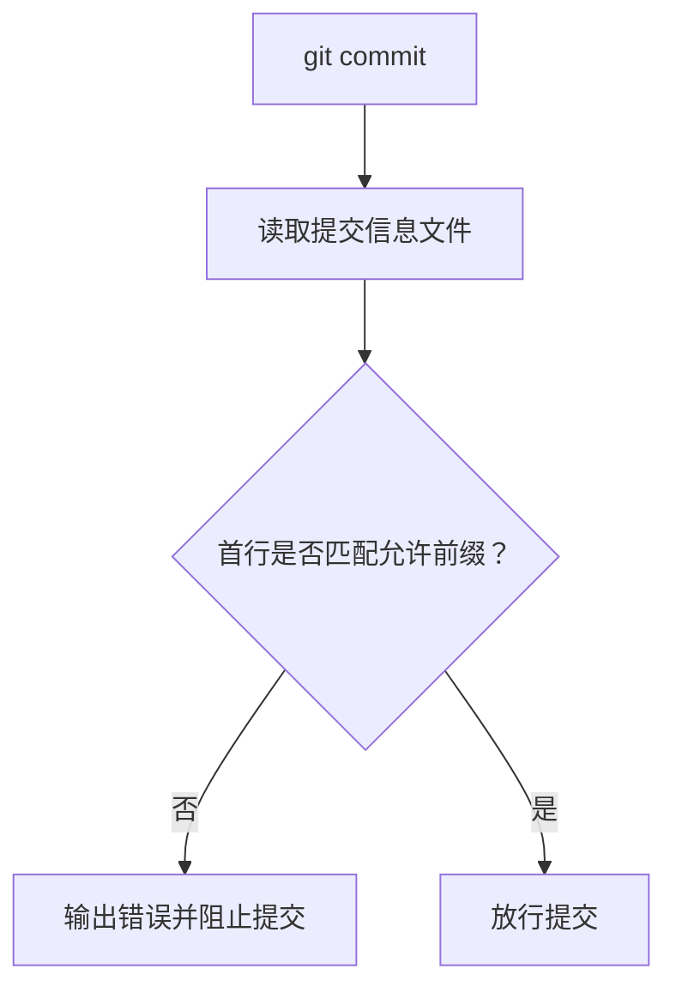
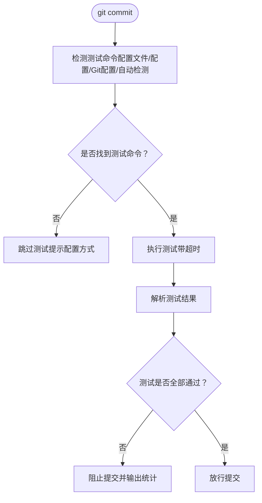
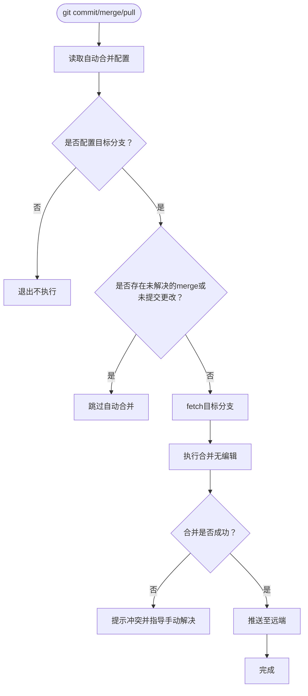
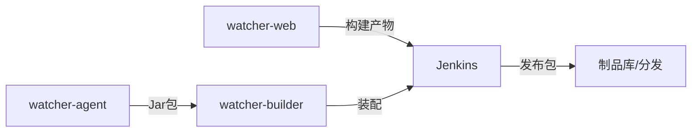

# CI/CD集成

<cite>
**本文引用的文件**
- [pipeline.groovy](file://pipeline.groovy)
- [setup-hooks.py](file://.githooks/setup-hooks.py)
- [check_commit_msg.py](file://.githooks/check_commit_msg.py)
- [run_unit_tests.py](file://.githooks/run_unit_tests.py)
- [auto_merge_branch.py](file://.githooks/auto_merge_branch.py)
- [package.json](file://watcher-web/package.json)
- [vite.config.ts](file://watcher-web/vite.config.ts)
- [watcher-builder/pom.xml](file://watcher-builder/pom.xml)
- [watcher-agent/pom.xml](file://watcher-agent/pom.xml)
- [Readme.md](file://Readme.md)
</cite>

## 目录
1. [简介](#简介)
2. [项目结构](#项目结构)
3. [核心组件](#核心组件)
4. [架构总览](#架构总览)
5. [详细组件分析](#详细组件分析)
6. [依赖分析](#依赖分析)
7. [性能考量](#性能考量)
8. [故障排查指南](#故障排查指南)
9. [结论](#结论)
10. [附录](#附录)

## 简介
本指南面向CI/CD流水线与Git Hooks的集成落地，结合仓库中的Jenkins Pipeline脚本与Git Hooks工具，系统性说明构建触发、参数传递、阶段划分；Git Hooks在提交前后的质量门禁与自动化合并策略；自动化测试流程的准备与执行；版本与发布流程（版本号、变更日志、产物打包）；以及容器化与持续部署的最佳实践与安全建议。内容兼顾工程可操作性与可维护性，帮助团队建立稳定高效的交付体系。

## 项目结构
本仓库采用多模块聚合结构，包含前端、后端、打包构建与辅助工具。与CI/CD直接相关的关键位置如下：
- Jenkins Pipeline定义：根目录的Groovy脚本负责拉取制品、解压与二次打包。
- Git Hooks：.githooks目录提供提交信息校验、单元测试自动执行、自动合并等能力。
- 前端工程：watcher-web使用Vite构建，提供生产构建脚本与代理配置。
- 后端与打包：watcher-agent为Spring Boot应用；watcher-builder通过Maven插件组装最终发布包。
- 顶层说明：Readme.md概述技术栈与模块职责。

图表来源
- [pipeline.groovy](file://pipeline.groovy)
- [.githooks/setup-hooks.py](file://.githooks/setup-hooks.py)
- [.githooks/check_commit_msg.py](file://.githooks/check_commit_msg.py)
- [.githooks/run_unit_tests.py](file://.githooks/run_unit_tests.py)
- [.githooks/auto_merge_branch.py](file://.githooks/auto_merge_branch.py)
- [watcher-web/package.json](file://watcher-web/package.json)
- [watcher-web/vite.config.ts](file://watcher-web/vite.config.ts)
- [watcher-agent/pom.xml](file://watcher-agent/pom.xml)
- [watcher-builder/pom.xml](file://watcher-builder/pom.xml)
- [Readme.md](file://Readme.md)

章节来源
- [Readme.md](file://Readme.md)
- [pipeline.groovy](file://pipeline.groovy)

## 核心组件
- Jenkins Pipeline：负责从制品库批量拉取模块产物、解压、合并前端静态资源、生成版本信息文件、打包发布包与校验文件，并输出MD5。
- Git Hooks：提供提交前/后的质量门禁与自动化动作，包括提交信息格式校验、单元测试自动执行、自动合并分支并推送。
- 前端构建：基于Vite的生产构建脚本，配合别名与代理配置，支撑本地开发与生产打包。
- 后端与打包：Spring Boot应用与Maven插件组合，完成Jar包、配置、插件与依赖的装配，形成可部署的发布包。

章节来源
- [pipeline.groovy](file://pipeline.groovy)
- [.githooks/setup-hooks.py](file://.githooks/setup-hooks.py)
- [.githooks/check_commit_msg.py](file://.githooks/check_commit_msg.py)
- [.githooks/run_unit_tests.py](file://.githooks/run_unit_tests.py)
- [.githooks/auto_merge_branch.py](file://.githooks/auto_merge_branch.py)
- [watcher-web/package.json](file://watcher-web/package.json)
- [watcher-web/vite.config.ts](file://watcher-web/vite.config.ts)
- [watcher-agent/pom.xml](file://watcher-agent/pom.xml)
- [watcher-builder/pom.xml](file://watcher-builder/pom.xml)

## 架构总览
下图展示了从代码提交到制品产出的整体流程，涵盖Jenkins Pipeline与Git Hooks的协同：

图表来源
- [pipeline.groovy](file://pipeline.groovy)
- [.githooks/check_commit_msg.py](file://.githooks/check_commit_msg.py)
- [.githooks/run_unit_tests.py](file://.githooks/run_unit_tests.py)
- [.githooks/auto_merge_branch.py](file://.githooks/auto_merge_branch.py)

## 详细组件分析

### Jenkins Pipeline配置与阶段划分
- 触发与参数
  - 通过JSON数组描述模块清单，包含模块名称、本地路径、制品名、参数（版本号、分支）、远程路径、流水线ID与触发仓库地址。
  - 使用批量化拉取制品的步骤，支持超时控制。
- 阶段一：制品拉取与解压
  - 将后端与前端制品解压至工作区。
  - 将前端dist目录内容复制到后端Nginx静态目录，确保产物一致。
- 阶段二：版本信息与打包
  - 写入版本号、构建时间、分支等信息到版本文件。
  - 生成完整发布包与升级包，并分别计算MD5校验值。
- 关键要点
  - 版本号与分支通过上游参数传入，确保发布一致性。
  - 打包过程清理冗余目录与脚本，仅保留必要组件，降低包体并提升安全性。

图表来源
- [pipeline.groovy](file://pipeline.groovy)

章节来源
- [pipeline.groovy](file://pipeline.groovy)

### Git Hooks：提交信息校验（commit-msg）
- 功能概述
  - 强制提交信息首行必须以特定前缀开头（如story、bugfix），并给出示例与提示。
  - 未找到提交信息文件时优雅退出，避免误阻塞。
- 集成方式
  - 通过安装脚本统一配置core.hooksPath，使Git使用仓库内hooks目录。
  - 可选择启用提交信息格式检查。
- 效果
  - 统一提交风格，便于后续自动化处理与变更追踪。

图表来源
- [.githooks/check_commit_msg.py](file://.githooks/check_commit_msg.py)

章节来源
- [.githooks/check_commit_msg.py](file://.githooks/check_commit_msg.py)
- [.githooks/setup-hooks.py](file://.githooks/setup-hooks.py)

### Git Hooks：单元测试自动执行（unit-tests）
- 功能概述
  - 在提交前自动执行单元测试，支持多种项目类型的自动检测（Maven、Gradle、npm、Cargo、Go、pytest等）。
  - 支持通过配置文件或Git配置指定测试命令。
  - 超时控制与测试结果解析，失败时阻止提交。
- 集成方式
  - 通过安装脚本启用autoTest.enabled或显式配置测试命令。
  - 可在项目根目录创建配置文件覆盖默认行为。
- 效果
  - 将质量门禁前置到本地提交阶段，减少CI失败率。

图表来源
- [.githooks/run_unit_tests.py](file://.githooks/run_unit_tests.py)

章节来源
- [.githooks/run_unit_tests.py](file://.githooks/run_unit_tests.py)
- [.githooks/setup-hooks.py](file://.githooks/setup-hooks.py)

### Git Hooks：自动合并策略（auto-merge）
- 功能概述
  - 在提交后自动将指定分支合并到当前分支，支持多分支配置与冲突处理。
  - 合并成功后自动推送至远端，避免重复劳动。
- 集成方式
  - 通过安装脚本启用autoMerge.branch或在项目根目录创建配置文件逐行列出分支。
  - 支持在merge/commit/pull后触发。
- 效果
  - 保持主干与特性分支同步，降低冲突概率，提升协作效率。

图表来源
- [.githooks/auto_merge_branch.py](file://.githooks/auto_merge_branch.py)

章节来源
- [.githooks/auto_merge_branch.py](file://.githooks/auto_merge_branch.py)
- [.githooks/setup-hooks.py](file://.githooks/setup-hooks.py)

### 自动化测试流程集成（前端）
- 测试环境准备
  - 使用前端工程的构建脚本与依赖管理，确保测试环境与生产一致。
- 测试用例执行
  - 建议在提交前通过Git Hooks执行单元测试；在CI中补充端到端与集成测试。
- 测试结果报告
  - 建议在CI中生成并归档测试报告，便于回溯与质量度量。

章节来源
- [watcher-web/package.json](file://watcher-web/package.json)
- [watcher-web/vite.config.ts](file://watcher-web/vite.config.ts)
- [.githooks/run_unit_tests.py](file://.githooks/run_unit_tests.py)

### 版本管理与发布流程
- 版本号生成
  - Jenkins流水线通过参数注入版本号与分支信息，确保发布一致性。
- 变更日志记录
  - 建议在提交信息中遵循约定（由commit-msg钩子约束），并在发布前汇总生成变更日志。
- 发布包构建
  - 流水线生成完整发布包与升级包，并输出MD5校验文件，便于分发与校验。

章节来源
- [pipeline.groovy](file://pipeline.groovy)
- [.githooks/check_commit_msg.py](file://.githooks/check_commit_msg.py)

### Docker容器化集成方案
- 镜像构建
  - 建议基于后端Jar包与前端静态资源构建单一镜像，或拆分为Nginx+后端双镜像方案，明确入口与健康检查。
- 容器部署
  - 使用Kubernetes部署时，建议采用Deployment+Service+ConfigMap/Secret管理配置与密钥，开启滚动更新与就绪探针。
- 服务编排
  - 通过Helm Chart或Kustomize管理多环境配置，确保一致性与可审计性。

（本节为通用实践建议，不直接对应具体源码文件）

### 持续部署最佳实践与安全考虑
- 最佳实践
  - 将质量门禁前置至本地（Git Hooks），CI仅做回归与集成验证。
  - 使用参数化流水线，分离构建与发布阶段，确保可追溯与可回滚。
  - 对关键环境采用蓝绿/金丝雀发布策略，降低风险。
- 安全考虑
  - 限制Jenkins与Git权限，启用凭据管理与最小权限原则。
  - 对制品与日志进行脱敏与加密传输，定期轮换密钥。
  - 在容器镜像中避免硬编码敏感信息，使用Secret与只读文件系统。

（本节为通用实践建议，不直接对应具体源码文件）

## 依赖分析
- 模块间依赖
  - watcher-builder聚合多个模块产物，负责最终打包与装配。
  - watcher-agent为Spring Boot应用，依赖SDK与各业务模块。
- 构建工具链
  - 前端使用Vite；后端使用Maven；Jenkins通过Groovy脚本驱动构建与打包。
- Hook与构建的耦合
  - Git Hooks在本地拦截质量风险，Jenkins在流水线上统一产出与校验，两者互补。

图表来源
- [watcher-web/package.json](file://watcher-web/package.json)
- [watcher-agent/pom.xml](file://watcher-agent/pom.xml)
- [watcher-builder/pom.xml](file://watcher-builder/pom.xml)
- [pipeline.groovy](file://pipeline.groovy)

章节来源
- [watcher-builder/pom.xml](file://watcher-builder/pom.xml)
- [watcher-agent/pom.xml](file://watcher-agent/pom.xml)
- [watcher-web/package.json](file://watcher-web/package.json)
- [pipeline.groovy](file://pipeline.groovy)

## 性能考量
- 构建阶段优化
  - 前端构建时利用Vite的增量编译与缓存；后端构建使用并行与增量打包。
  - 在流水线中复用缓存与制品库，减少重复下载与编译。
- 测试阶段优化
  - 本地Git Hooks仅执行核心单元测试，CI补充全量测试，缩短反馈周期。
- 存储与网络
  - 将制品与校验文件集中存储，启用CDN加速分发；对大文件采用压缩与分片策略。

（本节提供通用指导，不直接对应具体源码文件）

## 故障排查指南
- 提交被阻止
  - 检查提交信息是否符合格式要求；确认Git Hooks安装脚本已正确配置core.hooksPath。
- 单元测试失败
  - 确认测试命令是否正确识别；检查超时设置与测试输出解析逻辑；在本地先执行相同命令定位问题。
- 自动合并冲突
  - 查看冲突文件列表并逐一解决；完成后执行提示的命令继续合并与提交。
- 发布包异常
  - 检查流水线参数是否正确传入；确认前端静态资源是否正确合并；核对MD5校验文件与发布包是否匹配。

章节来源
- [.githooks/check_commit_msg.py](file://.githooks/check_commit_msg.py)
- [.githooks/run_unit_tests.py](file://.githooks/run_unit_tests.py)
- [.githooks/auto_merge_branch.py](file://.githooks/auto_merge_branch.py)
- [pipeline.groovy](file://pipeline.groovy)

## 结论
通过将Git Hooks的质量门禁与Jenkins流水线的标准化构建相结合，本项目实现了从本地到CI再到发布的全链路质量保障。配合版本管理、变更日志与制品校验，能够稳定支撑持续交付。建议在此基础上进一步完善容器化与多环境编排，强化安全与可观测性，持续提升交付效率与可靠性。

## 附录
- 快速上手
  - 安装Git Hooks：使用安装脚本启用所需功能并查看当前配置。
  - 前端构建：使用提供的构建脚本生成生产包。
  - 后端打包：通过Maven插件完成装配与Jar包生成。
  - 触发流水线：在Jenkins中配置参数并启动构建。

章节来源
- [.githooks/setup-hooks.py](file://.githooks/setup-hooks.py)
- [watcher-web/package.json](file://watcher-web/package.json)
- [watcher-builder/pom.xml](file://watcher-builder/pom.xml)
- [pipeline.groovy](file://pipeline.groovy)