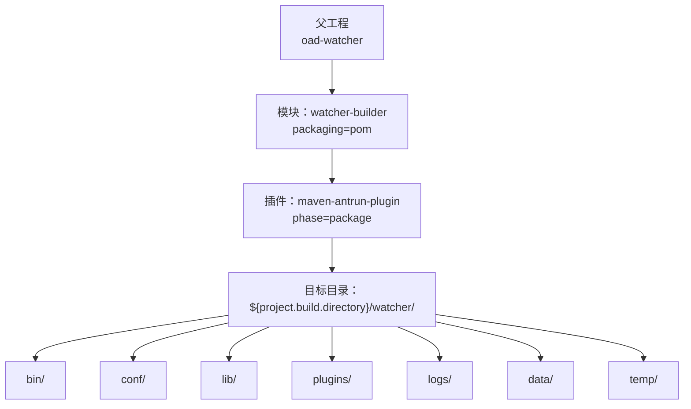
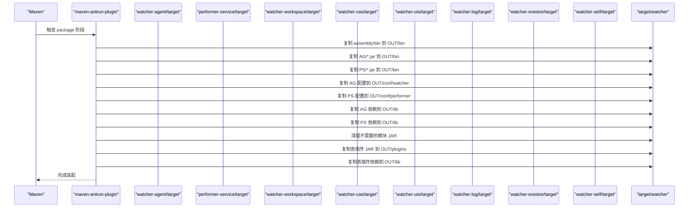
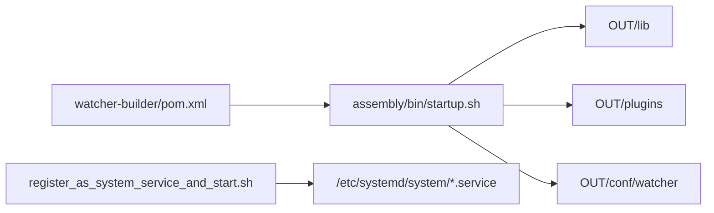

# 打包工具

<cite>
**本文引用的文件**
- [watcher-builder/pom.xml](file://watcher-builder/pom.xml)
- [assembly/bin/startup.sh](file://watcher-builder/assembly/bin/startup.sh)
- [assembly/bin/shutdown.sh](file://watcher-builder/assembly/bin/shutdown.sh)
- [assembly/bin/restart.sh](file://watcher-builder/assembly/bin/restart.sh)
- [assembly/bin/register_as_system_service_and_start.sh](file://watcher-builder/assembly/bin/register_as_system_service_and_start.sh)
- [assembly/conf/agent.service](file://watcher-builder/assembly/conf/agent.service)
- [assembly/conf/kafka.service](file://watcher-builder/assembly/conf/kafka.service)
- [watcher-agent/src/main/resources/application.properties](file://watcher-agent/src/main/resources/application.properties)
- [watcher-agent/src/main/resources/application-prod.properties](file://watcher-agent/src/main/resources/application-prod.properties)
- [watcher-agent/src/main/resources/logback-prod.xml](file://watcher-agent/src/main/resources/logback-prod.xml)
</cite>

## 目录
1. [简介](#简介)
2. [项目结构](#项目结构)
3. [核心组件](#核心组件)
4. [架构总览](#架构总览)
5. [详细组件分析](#详细组件分析)
6. [依赖关系分析](#依赖关系分析)
7. [性能与可维护性](#性能与可维护性)
8. [故障排查指南](#故障排查指南)
9. [结论](#结论)
10. [附录](#附录)

## 简介
本指南面向使用 watcher-builder 打包工具的工程人员，系统讲解 Maven Antrun 插件在 package 阶段的执行流程与装配逻辑，涵盖以下主题：
- Maven Antrun 插件配置与执行阶段
- 文件复制与目录结构组织（bin、conf、lib、plugins 等）
- 依赖包管理与插件包动态加载机制
- assembly 目录设计原理与各子目录职责
- 打包命令与参数说明
- 常见问题排查与自定义打包配置建议

## 项目结构
watcher-builder 是一个聚合工程下的打包模块，其核心职责是通过 Maven Antrun 插件在 package 阶段完成“装配”工作：从各子模块产物中复制 JAR、配置与插件到统一的输出目录，并生成可直接部署的目录结构。

图表来源
- [watcher-builder/pom.xml:15-211](file://watcher-builder/pom.xml#L15-L211)

章节来源
- [watcher-builder/pom.xml:1-212](file://watcher-builder/pom.xml#L1-L212)

## 核心组件
- Maven Antrun 插件：在 package 阶段执行自定义 Ant 目标，负责复制与组织文件。
- 装配目录（assembly）：包含 bin、conf、lib、plugins 等子目录，作为最终打包产物的模板与骨架。
- Agent/Performer 服务：分别对应独立运行的服务 JAR 与配置文件。
- 插件模块：如 workspace、cas、uis、log、onestor、self 等，作为可扩展的插件包。
- 启动与系统服务脚本：用于启动、停止、重启以及注册 systemd 服务。

章节来源
- [watcher-builder/pom.xml:15-211](file://watcher-builder/pom.xml#L15-L211)
- [assembly/bin/startup.sh:1-81](file://watcher-builder/assembly/bin/startup.sh#L1-L81)
- [assembly/bin/shutdown.sh:1-26](file://watcher-builder/assembly/bin/shutdown.sh#L1-L26)
- [assembly/bin/restart.sh:1-9](file://watcher-builder/assembly/bin/restart.sh#L1-L9)
- [assembly/bin/register_as_system_service_and_start.sh:1-45](file://watcher-builder/assembly/bin/register_as_system_service_and_start.sh#L1-L45)
- [assembly/conf/agent.service:1-14](file://watcher-builder/assembly/conf/agent.service#L1-L14)
- [assembly/conf/kafka.service:1-14](file://watcher-builder/assembly/conf/kafka.service#L1-L14)

## 架构总览
下图展示打包阶段的总体流程：Antrun 插件在 package 阶段触发，按顺序复制 Agent/Performer 的 JAR、配置与依赖，再复制各插件的 JAR 与其依赖，最后清理不需要的模块 JAR。

图表来源
- [watcher-builder/pom.xml:21-205](file://watcher-builder/pom.xml#L21-L205)

章节来源
- [watcher-builder/pom.xml:15-211](file://watcher-builder/pom.xml#L15-L211)

## 详细组件分析

### Maven Antrun 插件配置与执行流程
- 插件绑定到 package 阶段，执行名为 package 的 Ant 目标。
- 目标内包含一系列 copy、delete 操作，将不同模块的产物复制到统一输出目录，并进行必要的清理。
- 输出根目录为 ${project.build.directory}/watcher，后续可被进一步打包为 tar/zip。

章节来源
- [watcher-builder/pom.xml:17-207](file://watcher-builder/pom.xml#L17-L207)

### 目录结构与装配规则
- bin：包含启动、停止、重启、注册系统服务等脚本；打包后会包含 Agent/Performer 的 JAR 文件。
- conf：按服务类型分目录存放配置文件，如 watcher、performer。
- lib：存放 Agent/Performer 及各插件的依赖 JAR。
- plugins：存放各功能插件的 JAR 包。
- logs、data、temp：预留的日志、数据与临时目录。

章节来源
- [watcher-builder/pom.xml:29-32](file://watcher-builder/pom.xml#L29-L32)
- [watcher-builder/pom.xml:34-48](file://watcher-builder/pom.xml#L34-L48)
- [watcher-builder/pom.xml:42-98](file://watcher-builder/pom.xml#L42-L98)
- [watcher-builder/pom.xml:116-162](file://watcher-builder/pom.xml#L116-L162)
- [watcher-builder/pom.xml:164-198](file://watcher-builder/pom.xml#L164-L198)

### Agent 与 Performer 的装配细节
- JAR 复制：分别从各自 target 目录复制主 JAR 到 OUT/bin。
- 配置复制：
  - 默认配置文件 application.properties
  - 生产配置 application-prod.properties
  - 日志配置 logback-prod.xml
  - 复制到 OUT/conf/watcher 与 OUT/conf/performer 对应目录。
- 依赖复制：将各自 target/lib 下的依赖 JAR 复制到 OUT/lib。
- 清理：移除若干不需要的模块 JAR，避免污染 lib/plugins。

章节来源
- [watcher-builder/pom.xml:34-48](file://watcher-builder/pom.xml#L34-L48)
- [watcher-builder/pom.xml:50-63](file://watcher-builder/pom.xml#L50-L63)
- [watcher-builder/pom.xml:71-84](file://watcher-builder/pom.xml#L71-L84)
- [watcher-builder/pom.xml:92-98](file://watcher-builder/pom.xml#L92-L98)
- [watcher-builder/pom.xml:65-69](file://watcher-builder/pom.xml#L65-L69)
- [watcher-builder/pom.xml:86-90](file://watcher-builder/pom.xml#L86-L90)

### 插件包的装配与动态加载
- 插件 JAR 复制：将 workspace、cas、uis、log、onestor、self 等模块的 JAR 复制到 OUT/plugins。
- 插件依赖复制：将各插件 target/lib 的依赖复制到 OUT/lib。
- 动态加载机制：启动脚本通过 -Dloader.path 将 lib、plugins、conf 三类路径注入到 Spring Boot 打包的可执行 JAR 中，实现运行时动态加载插件与配置。

章节来源
- [watcher-builder/pom.xml:116-162](file://watcher-builder/pom.xml#L116-L162)
- [watcher-builder/pom.xml:164-198](file://watcher-builder/pom.xml#L164-L198)
- [assembly/bin/startup.sh:78-78](file://watcher-builder/assembly/bin/startup.sh#L78-L78)

### 启动与系统服务脚本
- startup.sh：检测 Java 版本、解析 WATCHER_ROOT/LIBDIR/PLUGIN_DIR/CONF_DIR，准备 GC 与内存参数，使用 loader.path 加载 lib/plugins/conf，启动 agent.jar。
- shutdown.sh：通过进程标志停止服务。
- restart.sh：先停止再启动。
- register_as_system_service_and_start.sh：将服务模板中的占位符替换为实际路径，复制到 /etc/systemd/system 并启用/启动多个服务单元。

章节来源
- [assembly/bin/startup.sh:1-81](file://watcher-builder/assembly/bin/startup.sh#L1-L81)
- [assembly/bin/shutdown.sh:1-26](file://watcher-builder/assembly/bin/shutdown.sh#L1-L26)
- [assembly/bin/restart.sh:1-9](file://watcher-builder/assembly/bin/restart.sh#L1-L9)
- [assembly/bin/register_as_system_service_and_start.sh:1-45](file://watcher-builder/assembly/bin/register_as_system_service_and_start.sh#L1-L45)
- [assembly/conf/agent.service:1-14](file://watcher-builder/assembly/conf/agent.service#L1-L14)
- [assembly/conf/kafka.service:1-14](file://watcher-builder/assembly/conf/kafka.service#L1-L14)

### 配置文件与日志策略
- application.properties：默认开发配置，包含端口、中间件开关、插件开关、数据源等基础项。
- application-prod.properties：生产环境配置，包含 MongoDB、Kafka、ES、插件服务地址、端口变量等。
- logback-prod.xml：生产日志策略，滚动策略与大小限制，根日志级别与特定包日志级别控制。

章节来源
- [watcher-agent/src/main/resources/application.properties:1-80](file://watcher-agent/src/main/resources/application.properties#L1-L80)
- [watcher-agent/src/main/resources/application-prod.properties:1-70](file://watcher-agent/src/main/resources/application-prod.properties#L1-L70)
- [watcher-agent/src/main/resources/logback-prod.xml:1-35](file://watcher-agent/src/main/resources/logback-prod.xml#L1-L35)

## 依赖关系分析
- watcher-builder 依赖于各子模块的构建产物（JAR、lib、conf），因此必须确保这些模块已成功构建。
- 启动脚本依赖 loader.path 将 lib/plugins/conf 注入，形成“可执行 JAR + 外部插件与配置”的运行模式。
- systemd 服务单元依赖 register_as_system_service_and_start.sh 替换占位符并安装到系统路径。

图表来源
- [watcher-builder/pom.xml:15-211](file://watcher-builder/pom.xml#L15-L211)
- [assembly/bin/startup.sh:46-78](file://watcher-builder/assembly/bin/startup.sh#L46-L78)
- [assembly/bin/register_as_system_service_and_start.sh:11-21](file://watcher-builder/assembly/bin/register_as_system_service_and_start.sh#L11-L21)

章节来源
- [watcher-builder/pom.xml:15-211](file://watcher-builder/pom.xml#L15-L211)
- [assembly/bin/startup.sh:46-78](file://watcher-builder/assembly/bin/startup.sh#L46-L78)
- [assembly/bin/register_as_system_service_and_start.sh:1-45](file://watcher-builder/assembly/bin/register_as_system_service_and_start.sh#L1-L45)

## 性能与可维护性
- 复制策略：使用 Ant 的 fileset 与 include 规则，避免不必要的文件进入输出目录，减少打包体积。
- 清理策略：显式删除不需要的模块 JAR，降低运行时类路径冲突风险。
- 运行时加载：通过 loader.path 分离 lib/plugins/conf，便于按需扩展与热插拔。
- 日志策略：生产日志采用滚动与压缩，控制磁盘占用与保留周期。

章节来源
- [watcher-builder/pom.xml:92-98](file://watcher-builder/pom.xml#L92-L98)
- [watcher-agent/src/main/resources/logback-prod.xml:18-26](file://watcher-agent/src/main/resources/logback-prod.xml#L18-L26)

## 故障排查指南
- Java 版本不满足要求
  - 现象：启动脚本报错提示 Java 版本低于 1.8 或未找到 Java。
  - 排查：确认 PATH 或 JAVA_HOME 指向正确版本，版本号需满足条件。
  - 参考
    - [assembly/bin/startup.sh:3-25](file://watcher-builder/assembly/bin/startup.sh#L3-L25)
- 启动失败找不到配置或插件
  - 现象：启动时报找不到配置或插件。
  - 排查：确认 OUT/conf 与 OUT/plugins 是否存在对应文件；检查 loader.path 参数是否正确拼接。
  - 参考
    - [assembly/bin/startup.sh:46-53](file://watcher-builder/assembly/bin/startup.sh#L46-L53)
    - [assembly/bin/startup.sh:78-78](file://watcher-builder/assembly/bin/startup.sh#L78-L78)
- systemd 服务无法启动
  - 现象：systemctl 启动失败。
  - 排查：确认 register_as_system_service_and_start.sh 已执行且占位符已替换；检查 /etc/systemd/system 下的服务文件是否存在；执行 systemctl daemon-reload。
  - 参考
    - [assembly/bin/register_as_system_service_and_start.sh:11-23](file://watcher-builder/assembly/bin/register_as_system_service_and_start.sh#L11-L23)
    - [assembly/conf/agent.service:1-14](file://watcher-builder/assembly/conf/agent.service#L1-L14)
    - [assembly/conf/kafka.service:1-14](file://watcher-builder/assembly/conf/kafka.service#L1-L14)
- 配置未生效
  - 现象：应用未使用 prod 配置或日志级别不符合预期。
  - 排查：确认 spring.profiles.active 与 spring.config.location 设置；核对 OUT/conf 下的配置文件是否完整。
  - 参考
    - [assembly/bin/startup.sh:78-78](file://watcher-builder/assembly/bin/startup.sh#L78-L78)
    - [watcher-agent/src/main/resources/application-prod.properties:1-70](file://watcher-agent/src/main/resources/application-prod.properties#L1-L70)
    - [watcher-agent/src/main/resources/logback-prod.xml:1-35](file://watcher-agent/src/main/resources/logback-prod.xml#L1-L35)

## 结论
watcher-builder 通过 Antrun 插件在 package 阶段完成标准化装配，形成可直接部署的目录结构。其核心优势在于：
- 统一的目录规范（bin、conf、lib、plugins）
- 明确的复制与清理策略
- 基于 loader.path 的插件动态加载机制
- 完备的启动与系统服务脚本

## 附录

### 打包命令与参数说明
- 基本命令
  - mvn clean package
  - 作用：清理旧产物，执行 watcher-builder 的 Antrun 插件，生成 OUT 目录（默认位于 target/watcher）。
- 关键参数
  - -DskipTests：跳过测试阶段，加速打包。
  - -P<profile>：指定激活的 Maven Profile（如 prod）以影响各模块构建行为。
  - -Dmaven.antrun.skip=false：确保 Antrun 插件执行（默认通常为 false）。
- 输出位置
  - 默认输出目录：target/watcher（由插件配置决定）

章节来源
- [watcher-builder/pom.xml:15-211](file://watcher-builder/pom.xml#L15-L211)

### 自定义打包配置建议
- 调整复制范围
  - 在 watcher-builder/pom.xml 的 copy 目标中增删 fileset/include，仅保留所需插件与依赖。
- 修改输出目录
  - 通过 Maven 属性或自定义属性调整 OUT 根目录，适配不同部署路径。
- 控制清理清单
  - 根据业务需要增减 delete 条目，避免误删必要模块。
- 启动参数定制
  - 在 startup.sh 中调整 JAVA_OPTS、GC 参数与调试端口，满足不同环境性能与可观测性需求。
- 配置文件定制
  - 在 OUT/conf 下放置自定义配置，或通过环境变量覆盖 application-prod.properties 中的占位符。

章节来源
- [watcher-builder/pom.xml:21-205](file://watcher-builder/pom.xml#L21-L205)
- [assembly/bin/startup.sh:62-72](file://watcher-builder/assembly/bin/startup.sh#L62-L72)
- [watcher-agent/src/main/resources/application-prod.properties:32-70](file://watcher-agent/src/main/resources/application-prod.properties#L32-L70)