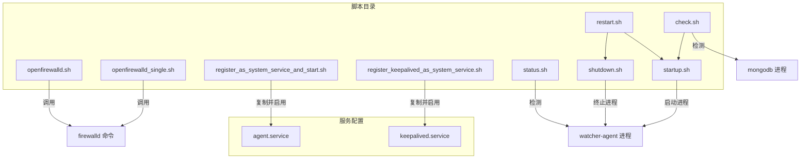
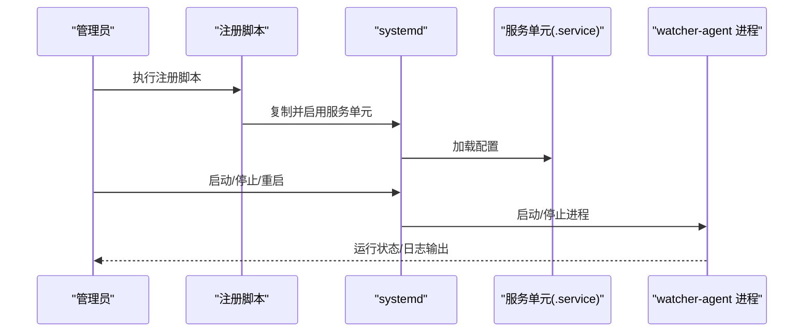
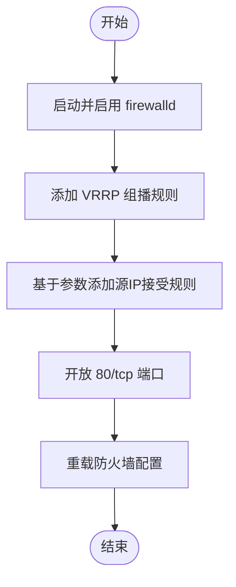
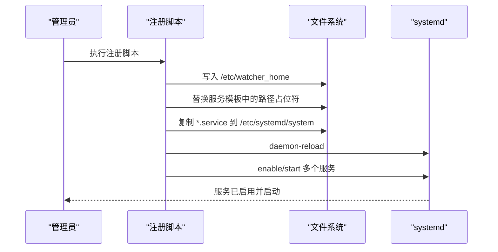
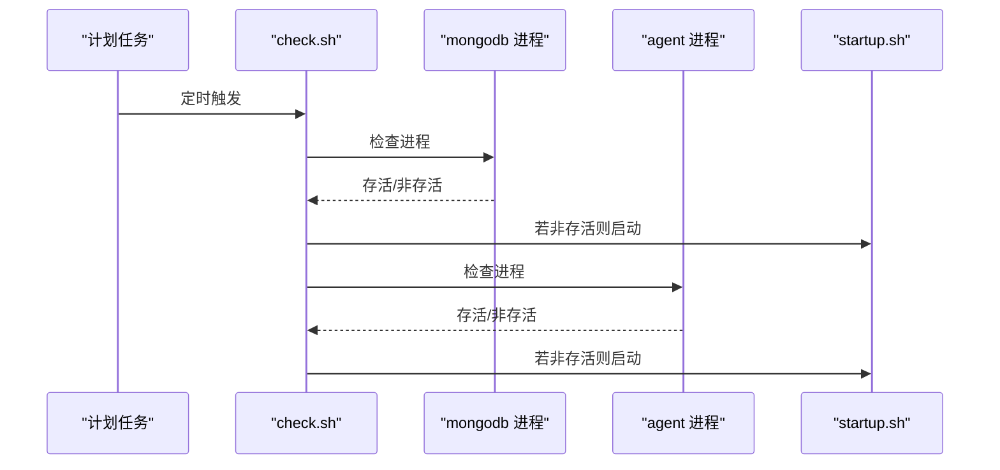
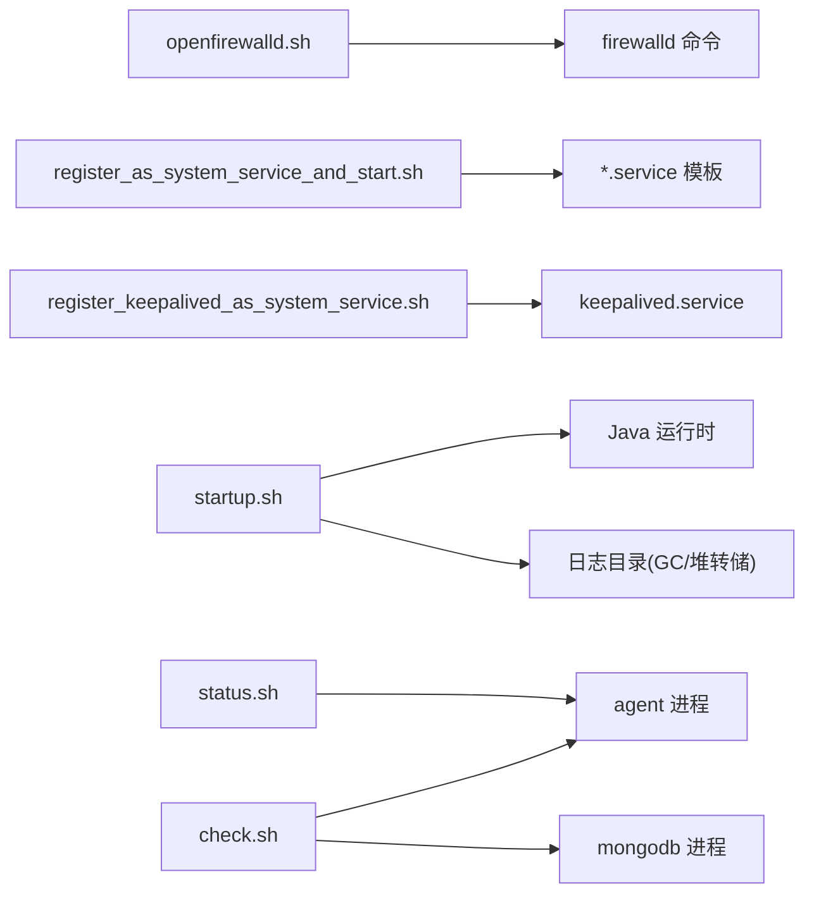

# 监控脚本

<cite>
**本文引用的文件**
- [openfirewalld.sh](file://watcher-builder/assembly/bin/openfirewalld.sh)
- [openfirewalld_single.sh](file://watcher-builder/assembly/bin/openfirewalld_single.sh)
- [register_as_system_service_and_start.sh](file://watcher-builder/assembly/bin/register_as_system_service_and_start.sh)
- [register_keepalived_as_system_service.sh](file://watcher-builder/assembly/bin/register_keepalived_as_system_service.sh)
- [status.sh](file://watcher-builder/assembly/bin/status.sh)
- [startup.sh](file://watcher-builder/assembly/bin/startup.sh)
- [shutdown.sh](file://watcher-builder/assembly/bin/shutdown.sh)
- [restart.sh](file://watcher-builder/assembly/bin/restart.sh)
- [check.sh](file://watcher-builder/assembly/bin/check.sh)
- [agent.service](file://watcher-builder/assembly/conf/agent.service)
- [keepalived.service](file://watcher-builder/assembly/conf/keepalived.service)
</cite>

## 目录
1. [简介](#简介)
2. [项目结构](#项目结构)
3. [核心组件](#核心组件)
4. [架构总览](#架构总览)
5. [详细组件分析](#详细组件分析)
6. [依赖关系分析](#依赖关系分析)
7. [性能与资源监控](#性能与资源监控)
8. [故障排除指南](#故障排除指南)
9. [结论](#结论)
10. [附录](#附录)

## 简介
本指南面向系统运维与平台维护人员，围绕“系统监控与维护脚本”提供可操作的使用说明。重点覆盖以下方面：
- 防火墙配置脚本：批量端口开放与安全策略设置（openfirewalld.sh）、单端口配置（openfirewalld_single.sh）
- 系统服务注册与启动：通用服务注册（register_as_system_service_and_start.sh）、高可用服务注册（register_keepalived_as_system_service.sh）
- 系统维护脚本：状态检查（status.sh）、启动/停止/重启（startup.sh/shutdown.sh/restart.sh）、健康巡检（check.sh）
- 监控与日志：进程状态识别、日志路径与GC/堆转储配置
- 安全注意事项与权限要求
- 故障排除与问题诊断

## 项目结构
与监控和维护相关的核心文件位于构建产物目录中，主要由二进制脚本与systemd服务配置组成：
- 脚本目录：watcher-builder/assembly/bin
- systemd服务模板：watcher-builder/assembly/conf

图表来源
- [openfirewalld.sh:1-21](file://watcher-builder/assembly/bin/openfirewalld.sh#L1-L21)
- [openfirewalld_single.sh:1-9](file://watcher-builder/assembly/bin/openfirewalld_single.sh#L1-L9)
- [register_as_system_service_and_start.sh:1-45](file://watcher-builder/assembly/bin/register_as_system_service_and_start.sh#L1-L45)
- [register_keepalived_as_system_service.sh:1-25](file://watcher-builder/assembly/bin/register_keepalived_as_system_service.sh#L1-L25)
- [startup.sh:1-81](file://watcher-builder/assembly/bin/startup.sh#L1-L81)
- [shutdown.sh:1-26](file://watcher-builder/assembly/bin/shutdown.sh#L1-L26)
- [restart.sh:1-9](file://watcher-builder/assembly/bin/restart.sh#L1-L9)
- [check.sh:1-27](file://watcher-builder/assembly/bin/check.sh#L1-L27)
- [agent.service:1-14](file://watcher-builder/assembly/conf/agent.service#L1-L14)
- [keepalived.service:1-14](file://watcher-builder/assembly/conf/keepalived.service#L1-L14)

章节来源
- [openfirewalld.sh:1-21](file://watcher-builder/assembly/bin/openfirewalld.sh#L1-L21)
- [openfirewalld_single.sh:1-9](file://watcher-builder/assembly/bin/openfirewalld_single.sh#L1-L9)
- [register_as_system_service_and_start.sh:1-45](file://watcher-builder/assembly/bin/register_as_system_service_and_start.sh#L1-L45)
- [register_keepalived_as_system_service.sh:1-25](file://watcher-builder/assembly/bin/register_keepalived_as_system_service.sh#L1-L25)
- [status.sh:1-10](file://watcher-builder/assembly/bin/status.sh#L1-L10)
- [startup.sh:1-81](file://watcher-builder/assembly/bin/startup.sh#L1-L81)
- [shutdown.sh:1-26](file://watcher-builder/assembly/bin/shutdown.sh#L1-L26)
- [restart.sh:1-9](file://watcher-builder/assembly/bin/restart.sh#L1-L9)
- [check.sh:1-27](file://watcher-builder/assembly/bin/check.sh#L1-L27)
- [agent.service:1-14](file://watcher-builder/assembly/conf/agent.service#L1-L14)
- [keepalived.service:1-14](file://watcher-builder/assembly/conf/keepalived.service#L1-L14)

## 核心组件
- 防火墙配置脚本
  - openfirewalld.sh：批量开放端口、添加VRRP组播规则、允许指定源IP访问、重载防火墙
  - openfirewalld_single.sh：最小化配置，仅开放80/tcp端口
- 系统服务注册脚本
  - register_as_system_service_and_start.sh：写入/et c/watcher_home，替换服务模板中的路径变量，复制并启用多套系统服务（zookeeper/kafka/mongodb/nginx/agent），随后启动
  - register_keepalived_as_system_service.sh：写入/et c/watcher_home，替换keepalived服务模板，复制并启用keepalived服务
- 维护与状态脚本
  - status.sh：通过进程名特征判断agent是否运行
  - startup.sh：校验Java版本、准备日志目录、设置JVM GC/堆转储参数、以nohup方式启动agent
  - shutdown.sh：按进程特征标记终止agent进程
  - restart.sh：先停止再启动
  - check.sh：定时巡检，若mongodb或agent未运行则尝试修复（启动对应组件）

章节来源
- [openfirewalld.sh:1-21](file://watcher-builder/assembly/bin/openfirewalld.sh#L1-L21)
- [openfirewalld_single.sh:1-9](file://watcher-builder/assembly/bin/openfirewalld_single.sh#L1-L9)
- [register_as_system_service_and_start.sh:1-45](file://watcher-builder/assembly/bin/register_as_system_service_and_start.sh#L1-L45)
- [register_keepalived_as_system_service.sh:1-25](file://watcher-builder/assembly/bin/register_keepalived_as_system_service.sh#L1-L25)
- [status.sh:1-10](file://watcher-builder/assembly/bin/status.sh#L1-L10)
- [startup.sh:1-81](file://watcher-builder/assembly/bin/startup.sh#L1-L81)
- [shutdown.sh:1-26](file://watcher-builder/assembly/bin/shutdown.sh#L1-L26)
- [restart.sh:1-9](file://watcher-builder/assembly/bin/restart.sh#L1-L9)
- [check.sh:1-27](file://watcher-builder/assembly/bin/check.sh#L1-L27)

## 架构总览
下图展示脚本与系统服务之间的交互关系，以及启动/停止/重启的流程。

图表来源
- [register_as_system_service_and_start.sh:17-38](file://watcher-builder/assembly/bin/register_as_system_service_and_start.sh#L17-L38)
- [agent.service:1-14](file://watcher-builder/assembly/conf/agent.service#L1-L14)
- [startup.sh:78-81](file://watcher-builder/assembly/bin/startup.sh#L78-L81)
- [shutdown.sh:20-24](file://watcher-builder/assembly/bin/shutdown.sh#L20-L24)

## 详细组件分析

### 防火墙配置脚本
- openfirewalld.sh
  - 功能要点
    - 启动并启用firewalld服务
    - 添加VRRP组播规则（用于高可用场景）
    - 基于输入参数为两个本地IP地址添加接受规则
    - 开放80/tcp端口
    - 重载防火墙配置
  - 使用建议
    - 在部署高可用组件前执行，确保组播与业务端口可达
    - 参数顺序为“主节点IP、备节点IP”，需与实际网络规划一致
- openfirewalld_single.sh
  - 功能要点
    - 最小化配置，仅开放80/tcp端口
  - 使用建议
    - 适用于仅需HTTP服务的简单场景

图表来源
- [openfirewalld.sh:9-20](file://watcher-builder/assembly/bin/openfirewalld.sh#L9-L20)

章节来源
- [openfirewalld.sh:1-21](file://watcher-builder/assembly/bin/openfirewalld.sh#L1-L21)
- [openfirewalld_single.sh:1-9](file://watcher-builder/assembly/bin/openfirewalld_single.sh#L1-L9)

### 系统服务注册与启动
- register_as_system_service_and_start.sh
  - 功能要点
    - 写入/et c/watcher_home，供其他脚本定位根目录
    - 替换多个服务模板中的路径占位符
    - 复制至/etc/systemd/system并重载
    - 依次启用并启动：zookeeper、kafka、mongodb、nginx、agent
  - 使用建议
    - 首次部署时在目标主机上执行，确保所有前置服务可用
    - 若需扩展其他服务，可参考该脚本的复制/启用模式
- register_keepalived_as_system_service.sh
  - 功能要点
    - 写入/et c/watcher_home
    - 替换keepalived服务模板路径
    - 复制至/etc/systemd/system并启用/启动
  - 使用建议
    - 与openfirewalld.sh配合，优先完成防火墙与keepalived服务注册

图表来源
- [register_as_system_service_and_start.sh:7-38](file://watcher-builder/assembly/bin/register_as_system_service_and_start.sh#L7-L38)
- [agent.service:7-9](file://watcher-builder/assembly/conf/agent.service#L7-L9)

章节来源
- [register_as_system_service_and_start.sh:1-45](file://watcher-builder/assembly/bin/register_as_system_service_and_start.sh#L1-L45)
- [register_keepalived_as_system_service.sh:1-25](file://watcher-builder/assembly/bin/register_keepalived_as_system_service.sh#L1-L25)
- [agent.service:1-14](file://watcher-builder/assembly/conf/agent.service#L1-L14)
- [keepalived.service:1-14](file://watcher-builder/assembly/conf/keepalived.service#L1-L14)

### 系统维护脚本
- status.sh
  - 功能要点
    - 通过进程名匹配特征字符串判断agent是否运行
  - 使用建议
    - 作为巡检脚本的一部分，定期调用以确认agent存活
- startup.sh
  - 功能要点
    - 检测Java环境与版本（≥1.8）
    - 准备日志目录（GC日志、堆转储）
    - 设置JVM内存与GC参数（含堆转储路径）
    - nohup方式启动agent，并写入错误输出
  - 使用建议
    - 首次启动或升级后执行；如需调整JVM参数，请在脚本内相应位置修改
- shutdown.sh
  - 功能要点
    - 通过进程特征标记终止agent进程
- restart.sh
  - 功能要点
    - 先停止再启动，保证平滑切换
- check.sh
  - 功能要点
    - 记录巡检时间到日志
    - 检测mongodb与agent进程，若缺失则尝试修复（启动对应组件）
  - 使用建议
    - 建议加入系统计划任务定期执行，实现自动化巡检

图表来源
- [check.sh:3-19](file://watcher-builder/assembly/bin/check.sh#L3-L19)
- [startup.sh:78-81](file://watcher-builder/assembly/bin/startup.sh#L78-L81)

章节来源
- [status.sh:1-10](file://watcher-builder/assembly/bin/status.sh#L1-L10)
- [startup.sh:1-81](file://watcher-builder/assembly/bin/startup.sh#L1-L81)
- [shutdown.sh:1-26](file://watcher-builder/assembly/bin/shutdown.sh#L1-L26)
- [restart.sh:1-9](file://watcher-builder/assembly/bin/restart.sh#L1-L9)
- [check.sh:1-27](file://watcher-builder/assembly/bin/check.sh#L1-L27)

## 依赖关系分析
- 脚本与系统服务
  - 注册脚本依赖于服务模板（.service）文件，通过替换路径占位符实现跨环境适配
  - agent.service与keepalived.service分别定义了各自的启动/停止命令
- 脚本与系统工具
  - 防火墙脚本依赖firewalld命令行工具
  - systemd脚本依赖systemd与systemctl
  - Java脚本依赖Java运行时与版本检测
- 日志与进程
  - startup.sh生成GC与堆转储日志；status.sh与check.sh通过进程名特征进行状态判断

图表来源
- [openfirewalld.sh:9-20](file://watcher-builder/assembly/bin/openfirewalld.sh#L9-L20)
- [register_as_system_service_and_start.sh:11-21](file://watcher-builder/assembly/bin/register_as_system_service_and_start.sh#L11-L21)
- [register_keepalived_as_system_service.sh:11-13](file://watcher-builder/assembly/bin/register_keepalived_as_system_service.sh#L11-L13)
- [startup.sh:55-72](file://watcher-builder/assembly/bin/startup.sh#L55-L72)
- [status.sh:3-8](file://watcher-builder/assembly/bin/status.sh#L3-L8)
- [check.sh:5-19](file://watcher-builder/assembly/bin/check.sh#L5-L19)

章节来源
- [agent.service:1-14](file://watcher-builder/assembly/conf/agent.service#L1-L14)
- [keepalived.service:1-14](file://watcher-builder/assembly/conf/keepalived.service#L1-L14)

## 性能与资源监控
- 启动脚本中的JVM参数
  - 内存与GC参数已在启动脚本中集中配置，便于统一管理与调优
  - 建议结合实际负载与硬件资源调整内存上限与GC策略
- 日志与诊断
  - GC日志与堆转储路径在启动脚本中定义，便于问题复盘
  - 巡检脚本会记录关键组件状态变化，可用于趋势分析

章节来源
- [startup.sh:62-72](file://watcher-builder/assembly/bin/startup.sh#L62-L72)
- [check.sh:3-19](file://watcher-builder/assembly/bin/check.sh#L3-L19)

## 故障排除指南
- 权限与环境
  - 防火墙脚本需要root权限以启动/启用firewalld与执行firewall-cmd
  - 注册脚本需要root权限以写入/etc/systemd/system与daemon-reload
  - 启动脚本需要root权限以写入日志目录与nohup启动
- Java版本不满足
  - 启动脚本会检测Java版本，低于1.8将直接退出；请安装符合要求的JDK
- 进程状态异常
  - 使用status.sh确认agent是否运行
  - 使用check.sh进行自动修复（若mongodb或agent未运行则尝试启动）
- 端口不可达
  - 使用openfirewalld.sh或openfirewalld_single.sh开放所需端口
  - 如涉及高可用场景，确保VRRP组播规则已生效

章节来源
- [openfirewalld.sh:9-20](file://watcher-builder/assembly/bin/openfirewalld.sh#L9-L20)
- [openfirewalld_single.sh:5-8](file://watcher-builder/assembly/bin/openfirewalld_single.sh#L5-L8)
- [register_as_system_service_and_start.sh:23-38](file://watcher-builder/assembly/bin/register_as_system_service_and_start.sh#L23-L38)
- [startup.sh:15-25](file://watcher-builder/assembly/bin/startup.sh#L15-L25)
- [status.sh:3-8](file://watcher-builder/assembly/bin/status.sh#L3-L8)
- [check.sh:5-19](file://watcher-builder/assembly/bin/check.sh#L5-L19)

## 结论
上述脚本提供了从网络策略、系统服务注册到运行维护的完整闭环。通过合理使用这些脚本，可以快速完成平台部署、保障高可用与稳定性，并建立自动化的巡检与恢复机制。建议在生产环境中结合计划任务与日志分析，持续优化JVM参数与网络策略，确保系统长期稳定运行。

## 附录
- 关键文件与职责
  - openfirewalld.sh：批量端口开放与VRRP策略
  - openfirewalld_single.sh：最小化端口开放
  - register_as_system_service_and_start.sh：多服务注册与启动
  - register_keepalived_as_system_service.sh：高可用服务注册
  - status.sh：进程状态查询
  - startup.sh：启动与JVM参数配置
  - shutdown.sh：停止进程
  - restart.sh：重启流程
  - check.sh：定时巡检与自动修复