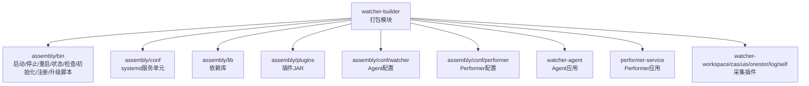
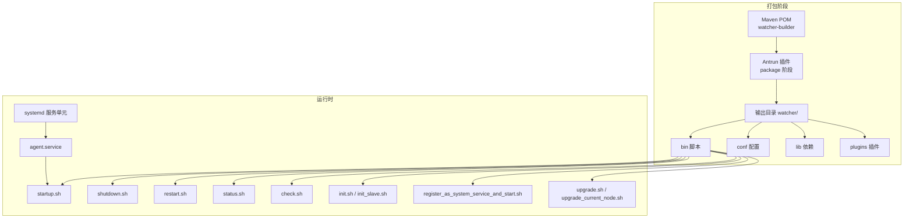
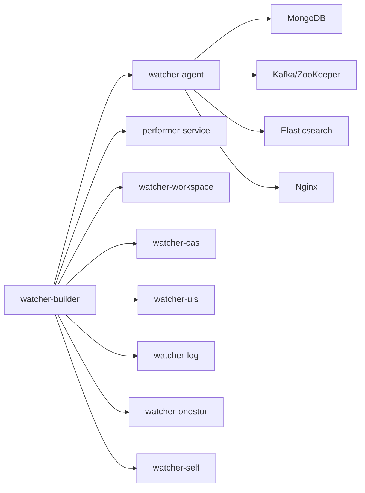
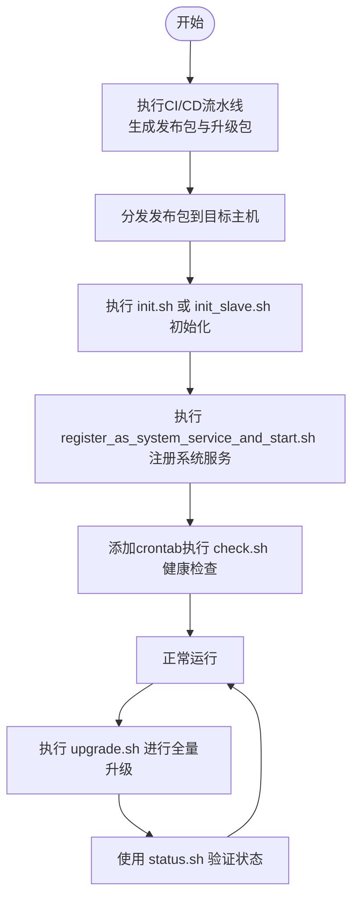

# 自动化工具

<cite>
**本文引用的文件**
- [pom.xml](file://watcher-builder/pom.xml)
- [startup.sh](file://watcher-builder/assembly/bin/startup.sh)
- [shutdown.sh](file://watcher-builder/assembly/bin/shutdown.sh)
- [restart.sh](file://watcher-builder/assembly/bin/restart.sh)
- [check.sh](file://watcher-builder/assembly/bin/check.sh)
- [status.sh](file://watcher-builder/assembly/bin/status.sh)
- [init.sh](file://watcher-builder/assembly/bin/init.sh)
- [init_slave.sh](file://watcher-builder/assembly/bin/init_slave.sh)
- [register_as_system_service_and_start.sh](file://watcher-builder/assembly/bin/register_as_system_service_and_start.sh)
- [upgrade.sh](file://watcher-builder/assembly/bin/upgrade.sh)
- [upgrade_current_node.sh](file://watcher-builder/assembly/bin/upgrade_current_node.sh)
- [agent.service](file://watcher-builder/assembly/conf/agent.service)
- [application-prod.properties](file://watcher-agent/src/main/resources/application-prod.properties)
- [pipeline.groovy](file://pipeline.groovy)
- [Readme.md](file://Readme.md)
</cite>

## 目录
1. [简介](#简介)
2. [项目结构](#项目结构)
3. [核心组件](#核心组件)
4. [架构总览](#架构总览)
5. [详细组件分析](#详细组件分析)
6. [依赖关系分析](#依赖关系分析)
7. [性能与稳定性考量](#性能与稳定性考量)
8. [故障排查指南](#故障排查指南)
9. [结论](#结论)
10. [附录](#附录)

## 简介
本指南面向ShowTime监控系统的自动化部署与运维团队，聚焦“watcher-builder”打包工具与部署脚本体系，涵盖以下主题：
- watcher-builder Maven插件配置与打包流程
- 部署脚本（startup.sh、shutdown.sh、restart.sh、status.sh、check.sh、init.sh、init_slave.sh、register_as_system_service_and_start.sh、upgrade.sh、upgrade_current_node.sh）的功能与参数说明
- CI/CD集成与版本管理
- 监控脚本（check.sh、status.sh）的使用
- 批量部署与远程部署方法
- 回滚与版本切换操作
- 部署日志分析与故障诊断
- 自动化运维最佳实践与安全建议

## 项目结构
watcher-builder作为打包模块，负责将各子模块产物（Agent、Performer、插件等）整合为可分发的部署包，并提供启动、停止、重启、状态查询、健康检查、初始化、注册系统服务、升级等脚本。

图表来源
- [pom.xml:15-211](file://watcher-builder/pom.xml#L15-L211)

章节来源
- [pom.xml:15-211](file://watcher-builder/pom.xml#L15-L211)
- [Readme.md:27-39](file://Readme.md#L27-L39)

## 核心组件
- watcher-builder打包模块：通过Maven Antrun插件在package阶段执行复制与清理逻辑，将Agent、Performer及其插件、配置、依赖复制到输出目录，并移除不需要的模块JAR。
- 部署脚本集合：提供启动、停止、重启、状态查询、健康检查、初始化、注册系统服务、升级等能力。
- systemd服务单元：将Agent与周边组件以系统服务形式托管，便于开机自启与统一管理。
- CI/CD流水线：定义构建前端与后端制品、合并静态页面、生成版本信息与MD5、打包发布包与升级包。

章节来源
- [pom.xml:15-211](file://watcher-builder/pom.xml#L15-L211)
- [agent.service:1-14](file://watcher-builder/assembly/conf/agent.service#L1-L14)
- [pipeline.groovy:1-72](file://pipeline.groovy#L1-L72)

## 架构总览
下图展示了watcher-builder如何在打包阶段整合各模块产物，并通过脚本与systemd服务实现自动化部署与运维。

图表来源
- [pom.xml:15-211](file://watcher-builder/pom.xml#L15-L211)
- [agent.service:1-14](file://watcher-builder/assembly/conf/agent.service#L1-L14)

## 详细组件分析

### watcher-builder 打包工具与Maven插件配置
- 插件与阶段：使用maven-antrun-plugin，在package阶段执行目标任务，完成目录复制、文件拷贝与冗余JAR删除。
- 关键复制动作：
  - 复制assembly目录至输出根目录
  - 复制Agent与Performer的JAR与lib
  - 复制默认与生产配置文件（application.properties、application-prod.properties、logback-prod.xml）
  - 复制各插件（workspace、cas、uis、log、onestor、self）的JAR与其lib
- 清理动作：删除若干不需要的模块JAR，避免污染运行时类路径。
- 输出结构：最终生成可直接部署的watcher/目录，包含bin、conf、lib、plugins、logs等。

章节来源
- [pom.xml:15-211](file://watcher-builder/pom.xml#L15-L211)

### 启动脚本 startup.sh
- 功能要点：
  - 检测Java可用性与版本（要求不低于1.8）
  - 解析软链接定位脚本目录，计算WATCHER_ROOT、WATCHER_LIBDIR、PLUGIN_DIR、CONF_DIR
  - 创建GC与堆转储日志目录
  - 设置JVM内存与GC参数，启用GC日志轮转与OOM堆转储
  - 使用-Dloader.path加载lib、plugins、conf，指定spring.profiles.active为prod，设置spring.config.location
  - 以nohup方式启动agent.jar，进程标记含“watcher-agent-process-flag”
- 参数与环境变量：
  - 通过环境变量控制根目录、库目录、插件目录、配置目录
  - 可通过JAVA_OPTS追加JVM参数
- 常见问题：
  - Java未安装或版本过低
  - 配置文件缺失或路径错误
  - 端口占用导致启动失败

章节来源
- [startup.sh:1-81](file://watcher-builder/assembly/bin/startup.sh#L1-L81)

### 停止脚本 shutdown.sh
- 功能要点：
  - 解析脚本位置，定位WATCHER_ROOT
  - 通过进程名匹配“watcher-agent-process-flag”进行精准终止
  - 给出停止提示
- 注意事项：
  - 若存在多个同名进程，需确保匹配字符串唯一
  - 建议配合status.sh确认停止结果

章节来源
- [shutdown.sh:1-26](file://watcher-builder/assembly/bin/shutdown.sh#L1-L26)

### 重启脚本 restart.sh
- 功能要点：
  - 先调用shutdown.sh停止，等待5秒，再调用startup.sh启动
- 使用场景：
  - 配置变更后的平滑重启
  - 异常退出后的快速恢复

章节来源
- [restart.sh:1-9](file://watcher-builder/assembly/bin/restart.sh#L1-L9)

### 状态查询脚本 status.sh
- 功能要点：
  - 通过ps匹配agent进程，判断是否正在运行
- 输出：
  - “watcher is running” 或 “watcher is shutdown”

章节来源
- [status.sh:1-10](file://watcher-builder/assembly/bin/status.sh#L1-L10)

### 健康检查脚本 check.sh
- 功能要点：
  - 从/etc/watcher_home读取安装根目录
  - 检查MongoDB进程是否存在（基于配置文件路径关键词）
  - 若异常则尝试启动mongodb组件脚本
  - 检查Agent进程是否存在（基于进程标记）
  - 若异常则尝试启动Agent
  - 写入检查日志
- 使用建议：
  - 建议通过crontab每分钟执行一次
  - 结合status.sh与日志定位问题

章节来源
- [check.sh:1-27](file://watcher-builder/assembly/bin/check.sh#L1-L27)

### 初始化脚本 init.sh
- 功能要点：
  - 将安装根目录写入/etc/watcher_home
  - 复制安装目录到/tmp备份
  - 启动组件（如mongodb、nginx等）
  - 启动Agent
  - 注册为系统服务并启动
  - 添加crontab健康检查
  - 更新SSH配置并重启sshd
  - 关闭防火墙服务
- 使用场景：
  - 首次安装或全新环境初始化

章节来源
- [init.sh:1-35](file://watcher-builder/assembly/bin/init.sh#L1-L35)

### 从节点初始化脚本 init_slave.sh
- 功能要点：
  - 与init.sh类似，但启动组件类型为slave
  - 注册系统服务并启动
  - 更新SSH配置并重启sshd
  - 关闭防火墙服务
- 使用场景：
  - 集群从节点初始化

章节来源
- [init_slave.sh:1-30](file://watcher-builder/assembly/bin/init_slave.sh#L1-L30)

### 注册系统服务并启动脚本 register_as_system_service_and_start.sh
- 功能要点：
  - 将安装根目录写入/etc/watcher_home
  - 替换各服务单元中的路径占位符为实际路径
  - 复制服务单元到系统目录
  - 重载systemd并启用/启动ZooKeeper、Kafka、MongoDB、Nginx、Agent等服务
- 使用场景：
  - 安装完成后将Agent与周边组件纳入systemd统一管理

章节来源
- [register_as_system_service_and_start.sh:1-45](file://watcher-builder/assembly/bin/register_as_system_service_and_start.sh#L1-L45)
- [agent.service:1-14](file://watcher-builder/assembly/conf/agent.service#L1-L14)

### 升级脚本 upgrade.sh 与当前节点升级脚本 upgrade_current_node.sh
- upgrade.sh：
  - 读取安装根目录
  - 从本地接口查询集群节点列表
  - 逐个节点通过sshpass远程推送升级包并执行升级脚本
  - 最终在本机执行升级脚本
- upgrade_current_node.sh：
  - 复制bin、lib、plugins、conf、html、inspect等目录
  - 保留部分配置文件以避免覆盖集群参数
  - 调用restart.sh完成重启
- 使用建议：
  - 升级前做好备份
  - 在维护窗口执行
  - 升级后验证status.sh与check.sh

章节来源
- [upgrade.sh:1-53](file://watcher-builder/assembly/bin/upgrade.sh#L1-L53)
- [upgrade_current_node.sh:1-44](file://watcher-builder/assembly/bin/upgrade_current_node.sh#L1-L44)

### systemd 服务单元 agent.service
- 功能要点：
  - 定义Agent服务的启动、重启、停止命令
  - 依赖网络服务
  - 保持退出后仍处于活动状态
- 使用场景：
  - 通过systemctl管理Agent生命周期

章节来源
- [agent.service:1-14](file://watcher-builder/assembly/conf/agent.service#L1-L14)

### 生产环境配置 application-prod.properties
- 关键配置项：
  - MongoDB连接串与索引创建
  - Kafka集群地址
  - Elasticsearch集群名称、认证与连接参数
  - 各子系统端口与认证（UIS、CAS、Onestor等）
  - ClickHouse连接参数
- 使用建议：
  - 部署前根据实际环境修改IP、端口与凭据
  - 与startup.sh的-Dspring.profiles.active=prod配合生效

章节来源
- [application-prod.properties:1-70](file://watcher-agent/src/main/resources/application-prod.properties#L1-L70)

### CI/CD 流水线 pipeline.groovy
- 构建阶段：
  - 并行拉取前端与后端制品
- Shell阶段：
  - 解压制品，合并前端静态资源到Nginx目录
  - 生成版本信息文件（包含版本号、分支、构建时间等）
  - 重命名目录并打包发布包与升级包
  - 计算MD5校验值
- 使用建议：
  - 在制品库中保存发布包与升级包
  - 将MD5用于部署前校验

章节来源
- [pipeline.groovy:1-72](file://pipeline.groovy#L1-L72)

## 依赖关系分析
- watcher-builder对各子模块的依赖：
  - watcher-agent：提供Agent应用与配置
  - performer-service：提供Performer应用与配置
  - watcher-workspace/cas/uis/onestor/log/self：提供各类采集插件
- 运行时依赖：
  - Java 1.8+
  - MongoDB、Kafka、ZooKeeper、Elasticsearch、Nginx等中间件
  - systemd（用于服务托管）

图表来源
- [pom.xml:34-198](file://watcher-builder/pom.xml#L34-L198)

章节来源
- [pom.xml:34-198](file://watcher-builder/pom.xml#L34-L198)

## 性能与稳定性考量
- JVM参数建议：
  - 根据机器内存调整-Xmx/-Xms
  - 启用GC日志轮转与OOM堆转储，便于问题定位
- GC与日志：
  - 使用GC日志轮转与详细GC信息，结合堆转储文件分析内存泄漏
- 系统服务：
  - 通过systemd管理服务，确保开机自启与异常重启
- 健康检查：
  - 使用check.sh与crontab实现分钟级健康巡检，异常自动修复

[本节为通用指导，无需特定文件引用]

## 故障排查指南
- 启动失败（Java版本问题）
  - 现象：startup.sh报错提示Java版本过低或未找到
  - 排查：确认JAVA_HOME与PATH，检查Java版本
- Agent未运行
  - 使用status.sh确认状态
  - 查看进程标记“watcher-agent-process-flag”是否存在
  - 检查GC与dump日志目录权限
- 中间件异常
  - 使用check.sh查看MongoDB与Agent状态
  - 若MongoDB未运行，按check.sh逻辑尝试启动
- 升级失败
  - 检查upgrade.sh的节点列表与凭据
  - 确认sshpass、ssh连通性与免密配置
  - 查看upgrade.log与各节点日志
- 配置问题
  - 确认application-prod.properties中的连接串、端口与凭据
  - 确保-Dspring.profiles.active=prod与-Dspring.config.location正确

章节来源
- [startup.sh:1-81](file://watcher-builder/assembly/bin/startup.sh#L1-L81)
- [status.sh:1-10](file://watcher-builder/assembly/bin/status.sh#L1-L10)
- [check.sh:1-27](file://watcher-builder/assembly/bin/check.sh#L1-L27)
- [upgrade.sh:1-53](file://watcher-builder/assembly/bin/upgrade.sh#L1-L53)
- [application-prod.properties:1-70](file://watcher-agent/src/main/resources/application-prod.properties#L1-L70)

## 结论
watcher-builder提供了完整的自动化打包与部署脚本体系，结合systemd服务与健康检查机制，能够实现稳定、可重复的部署与运维。通过CI/CD流水线生成发布包与升级包，配合check.sh与status.sh，可有效提升系统可用性与可维护性。

[本节为总结性内容，无需特定文件引用]

## 附录

### 使用流程图：自动化部署与运维

图表来源
- [pipeline.groovy:35-71](file://pipeline.groovy#L35-L71)
- [init.sh:1-35](file://watcher-builder/assembly/bin/init.sh#L1-L35)
- [register_as_system_service_and_start.sh:1-45](file://watcher-builder/assembly/bin/register_as_system_service_and_start.sh#L1-L45)
- [check.sh:1-27](file://watcher-builder/assembly/bin/check.sh#L1-L27)
- [upgrade.sh:1-53](file://watcher-builder/assembly/bin/upgrade.sh#L1-L53)
- [status.sh:1-10](file://watcher-builder/assembly/bin/status.sh#L1-L10)

### 版本管理与回滚建议
- 版本标识：
  - 在发布包中嵌入版本号、分支、构建时间等信息
- 回滚策略：
  - 保留上一版本的升级包
  - 使用upgrade.sh回滚到上一版本
  - 回滚前后对比配置文件差异，必要时手动修正
- 安全加固：
  - 限制对/etc/watcher_home的写权限
  - 使用非root用户执行Agent（如可行）
  - 定期更新SSH算法与密钥交换算法

章节来源
- [pipeline.groovy:42-46](file://pipeline.groovy#L42-L46)
- [upgrade.sh:1-53](file://watcher-builder/assembly/bin/upgrade.sh#L1-L53)
- [init.sh:22-28](file://watcher-builder/assembly/bin/init.sh#L22-L28)