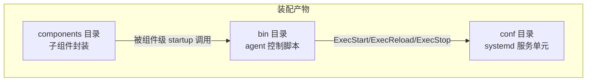
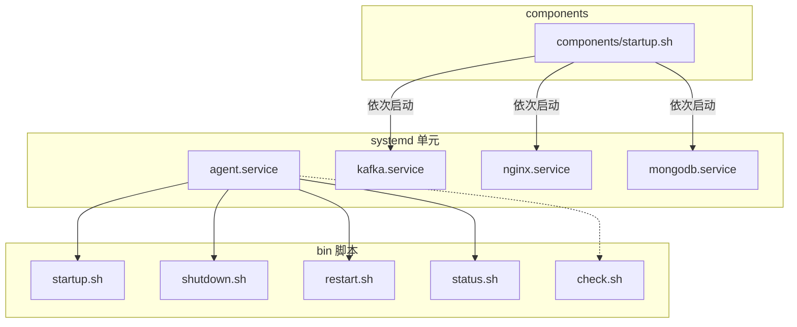
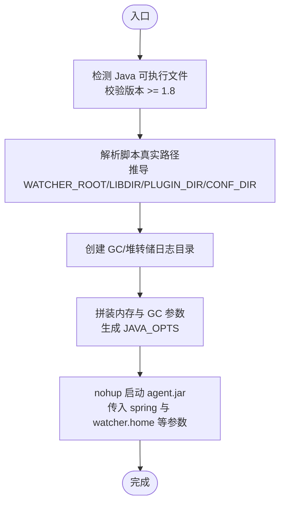
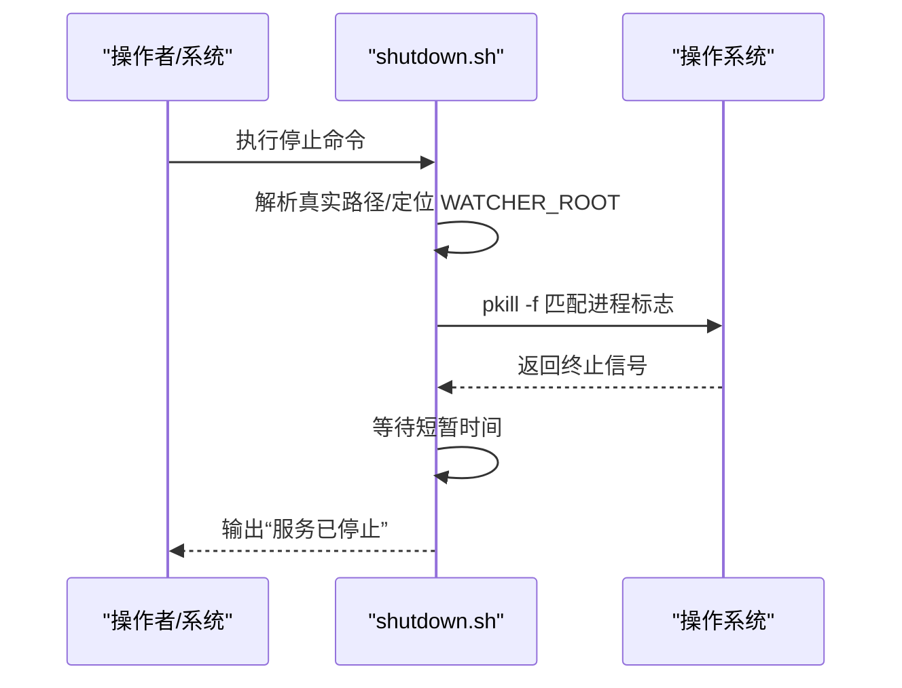
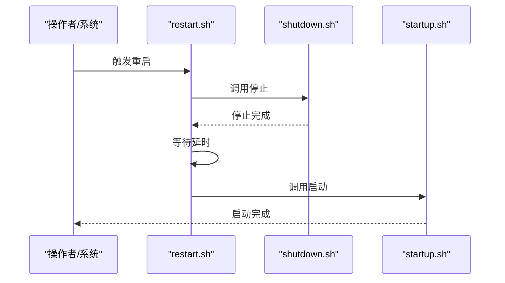
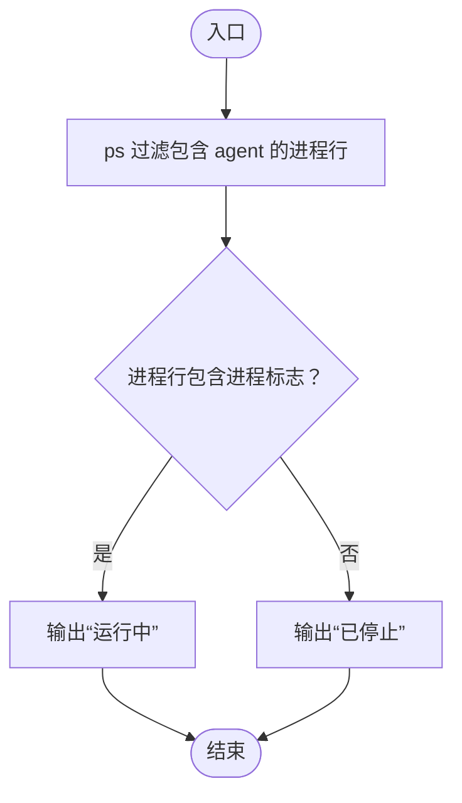
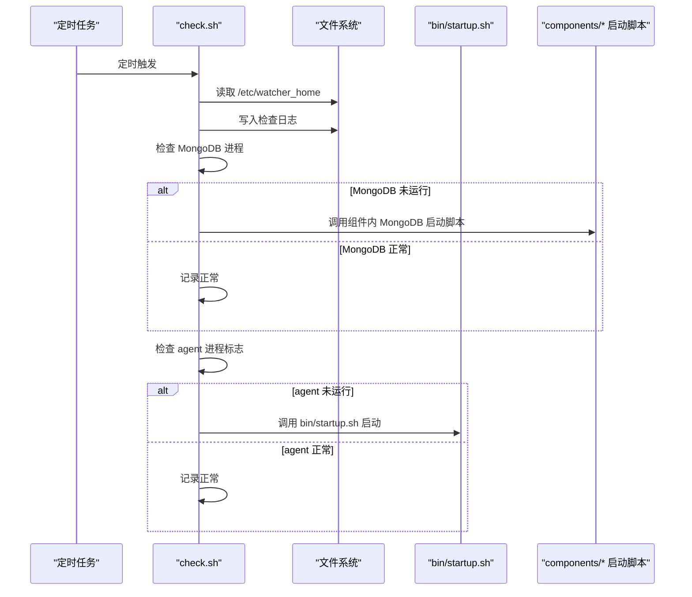
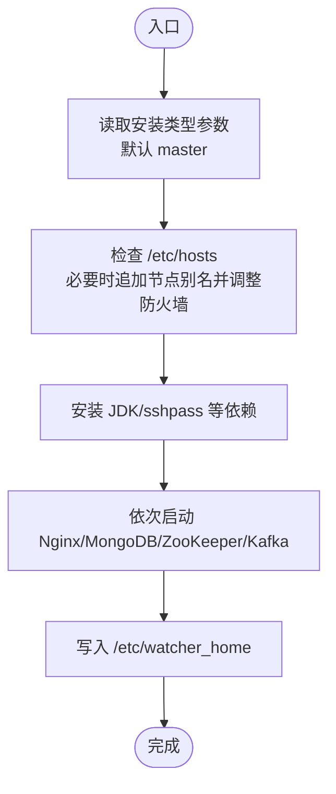
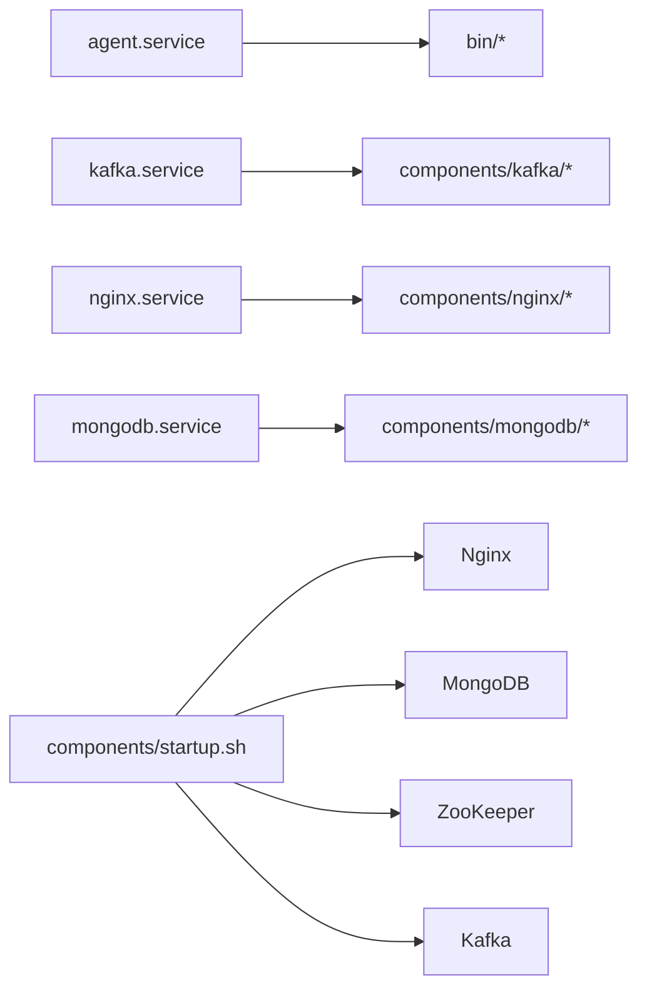

# 部署脚本

<cite>
**本文引用的文件**
- [startup.sh](file://watcher-builder/assembly/bin/startup.sh)
- [shutdown.sh](file://watcher-builder/assembly/bin/shutdown.sh)
- [restart.sh](file://watcher-builder/assembly/bin/restart.sh)
- [status.sh](file://watcher-builder/assembly/bin/status.sh)
- [check.sh](file://watcher-builder/assembly/bin/check.sh)
- [agent.service](file://watcher-builder/assembly/conf/agent.service)
- [kafka.service](file://watcher-builder/assembly/conf/kafka.service)
- [nginx.service](file://watcher-builder/assembly/conf/nginx.service)
- [mongodb.service](file://watcher-builder/assembly/conf/mongodb.service)
- [startup.sh（组件）](file://watcher-builder/assembly/components/startup.sh)
</cite>

## 目录
1. [简介](#简介)
2. [项目结构](#项目结构)
3. [核心组件](#核心组件)
4. [架构总览](#架构总览)
5. [详细组件分析](#详细组件分析)
6. [依赖关系分析](#依赖关系分析)
7. [性能与稳定性考量](#性能与稳定性考量)
8. [故障排查指南](#故障排查指南)
9. [结论](#结论)
10. [附录：参数与权限配置](#附录参数与权限配置)

## 简介
本手册面向运维与开发人员，系统化讲解部署脚本集的使用方法与内部机制，覆盖以下脚本：
- 启动：startup.sh
- 关闭：shutdown.sh
- 重启：restart.sh
- 状态：status.sh
- 健康检查：check.sh
并结合 systemd 服务单元与组件级启动流程，帮助读者理解服务启动顺序、环境变量设置、日志输出配置、优雅停机机制、平滑重启策略、状态监控与自检修复能力。

## 项目结构
部署脚本位于构建产物的装配目录中，主要分为两类：
- bin 目录：面向 watcher-agent 的控制脚本
- conf 目录：systemd 服务单元模板
- components 目录：子组件（如 MongoDB、Kafka、Nginx、ZooKeeper、Filebeat 等）的安装与启动封装

图示来源
- [agent.service:1-14](file://watcher-builder/assembly/conf/agent.service#L1-L14)
- [startup.sh（组件）:1-39](file://watcher-builder/assembly/components/startup.sh#L1-L39)

章节来源
- [agent.service:1-14](file://watcher-builder/assembly/conf/agent.service#L1-L14)
- [kafka.service:1-14](file://watcher-builder/assembly/conf/kafka.service#L1-L14)
- [nginx.service:1-14](file://watcher-builder/assembly/conf/nginx.service#L1-L14)
- [mongodb.service:1-14](file://watcher-builder/assembly/conf/mongodb.service#L1-L14)
- [startup.sh（组件）:1-39](file://watcher-builder/assembly/components/startup.sh#L1-L39)

## 核心组件
本节对每个脚本进行功能与行为解析，并标注关键实现位置以便溯源。

- startup.sh
  - 功能要点
    - 检测并定位 Java 可执行文件，校验版本不低于 1.8
    - 解析软链接获取脚本真实路径，推导 WATCHER_ROOT、WATCHER_LIBDIR、PLUGIN_DIR、CONF_DIR
    - 创建 GC 与堆转储日志目录
    - 设置 JVM 内存与 GC 日志参数，拼接为 JAVA_OPTS
    - 使用 nohup 启动 agent.jar，传入 spring 配置与 watcher.home 等参数
    - 输出“服务已启动”提示
  - 关键实现位置
    - [Java 检测与版本校验:3-25](file://watcher-builder/assembly/bin/startup.sh#L3-L25)
    - [路径解析与环境变量设置:27-54](file://watcher-builder/assembly/bin/startup.sh#L27-L54)
    - [日志目录创建与 JVM 参数拼装:55-72](file://watcher-builder/assembly/bin/startup.sh#L55-L72)
    - [nohup 启动命令与参数传递:77-78](file://watcher-builder/assembly/bin/startup.sh#L77-L78)

- shutdown.sh
  - 功能要点
    - 解析脚本真实路径，定位 WATCHER_ROOT
    - 构造进程标识字符串，使用 pkill 按进程名模式匹配并终止
    - 短暂等待后输出“服务已停止”
  - 关键实现位置
    - [进程标识构造与 pkill 终止:20-22](file://watcher-builder/assembly/bin/shutdown.sh#L20-L22)
    - [输出提示](file://watcher-builder/assembly/bin/shutdown.sh#L24)

- restart.sh
  - 功能要点
    - 先调用 shutdown.sh 停止，再延时后调用 startup.sh 启动
  - 关键实现位置
    - [顺序调用与延时:6-8](file://watcher-builder/assembly/bin/restart.sh#L6-L8)

- status.sh
  - 功能要点
    - 通过 ps 过滤包含 agent 的进程行
    - 若进程行中包含特定进程标志，则判定为运行中；否则为已停止
  - 关键实现位置
    - [进程过滤与标志匹配:3-4](file://watcher-builder/assembly/bin/status.sh#L3-L4)
    - [状态输出:5-7](file://watcher-builder/assembly/bin/status.sh#L5-L7)

- check.sh
  - 功能要点
    - 从 /etc/watcher_home 读取 HOME 路径，写入检查日志
    - 检查 MongoDB 是否在运行（依据进程名与配置文件片段）
    - 若未运行则尝试自动启动组件内 MongoDB 的启动脚本
    - 检查 agent 是否在运行（依据进程标志），若未运行则调用 bin 目录下 startup.sh 启动
  - 关键实现位置
    - [读取 HOME 并记录检查日志:3-4](file://watcher-builder/assembly/bin/check.sh#L3-L4)
    - [MongoDB 运行态检测与修复:5-11](file://watcher-builder/assembly/bin/check.sh#L5-L11)
    - [agent 运行态检测与修复:13-19](file://watcher-builder/assembly/bin/check.sh#L13-L19)

章节来源
- [startup.sh:1-81](file://watcher-builder/assembly/bin/startup.sh#L1-L81)
- [shutdown.sh:1-26](file://watcher-builder/assembly/bin/shutdown.sh#L1-L26)
- [restart.sh:1-9](file://watcher-builder/assembly/bin/restart.sh#L1-L9)
- [status.sh:1-10](file://watcher-builder/assembly/bin/status.sh#L1-L10)
- [check.sh:1-27](file://watcher-builder/assembly/bin/check.sh#L1-L27)

## 架构总览
下图展示 systemd 服务单元如何调用部署脚本，以及组件级 startup 如何串联各子系统。

图示来源
- [agent.service:1-14](file://watcher-builder/assembly/conf/agent.service#L1-L14)
- [kafka.service:1-14](file://watcher-builder/assembly/conf/kafka.service#L1-L14)
- [nginx.service:1-14](file://watcher-builder/assembly/conf/nginx.service#L1-L14)
- [mongodb.service:1-14](file://watcher-builder/assembly/conf/mongodb.service#L1-L14)
- [startup.sh（组件）:24-29](file://watcher-builder/assembly/components/startup.sh#L24-L29)

## 详细组件分析

### 启动流程（startup.sh）
- 流程图（映射到实际实现）

图示来源
- [startup.sh:3-25](file://watcher-builder/assembly/bin/startup.sh#L3-L25)
- [startup.sh:27-54](file://watcher-builder/assembly/bin/startup.sh#L27-L54)
- [startup.sh:55-72](file://watcher-builder/assembly/bin/startup.sh#L55-L72)
- [startup.sh:77-78](file://watcher-builder/assembly/bin/startup.sh#L77-L78)

章节来源
- [startup.sh:1-81](file://watcher-builder/assembly/bin/startup.sh#L1-L81)

### 优雅停机（shutdown.sh）
- 序列图（映射到实际实现）

图示来源
- [shutdown.sh:20-24](file://watcher-builder/assembly/bin/shutdown.sh#L20-L24)

章节来源
- [shutdown.sh:1-26](file://watcher-builder/assembly/bin/shutdown.sh#L1-L26)

### 平滑重启（restart.sh）
- 序列图（映射到实际实现）

图示来源
- [restart.sh:6-8](file://watcher-builder/assembly/bin/restart.sh#L6-L8)

章节来源
- [restart.sh:1-9](file://watcher-builder/assembly/bin/restart.sh#L1-L9)

### 状态查询（status.sh）
- 流程图（映射到实际实现）

图示来源
- [status.sh:3-7](file://watcher-builder/assembly/bin/status.sh#L3-L7)

章节来源
- [status.sh:1-10](file://watcher-builder/assembly/bin/status.sh#L1-L10)

### 健康检查（check.sh）
- 序列图（映射到实际实现）

图示来源
- [check.sh:3-11](file://watcher-builder/assembly/bin/check.sh#L3-L11)
- [check.sh:13-19](file://watcher-builder/assembly/bin/check.sh#L13-L19)

章节来源
- [check.sh:1-27](file://watcher-builder/assembly/bin/check.sh#L1-L27)

### 组件级启动（components/startup.sh）
- 流程图（映射到实际实现）

图示来源
- [startup.sh（组件）:6-10](file://watcher-builder/assembly/components/startup.sh#L6-L10)
- [startup.sh（组件）:15-22](file://watcher-builder/assembly/components/startup.sh#L15-L22)
- [startup.sh（组件）:24-29](file://watcher-builder/assembly/components/startup.sh#L24-L29)
- [startup.sh（组件）](file://watcher-builder/assembly/components/startup.sh#L36)

章节来源
- [startup.sh（组件）:1-39](file://watcher-builder/assembly/components/startup.sh#L1-L39)

## 依赖关系分析
- systemd 服务单元与脚本的绑定
  - agent.service 将 ExecStart/ExecReload/ExecStop 绑定到 bin 目录下的脚本
  - 其他服务单元（kafka.service、nginx.service、mongodb.service）分别绑定到对应组件的启动脚本
- 组件级 startup 对子系统的依赖顺序
  - components/startup.sh 明确列出 Nginx → MongoDB → ZooKeeper → Kafka 的启动顺序

图示来源
- [agent.service:7-9](file://watcher-builder/assembly/conf/agent.service#L7-L9)
- [kafka.service:7-9](file://watcher-builder/assembly/conf/kafka.service#L7-L9)
- [nginx.service:7-9](file://watcher-builder/assembly/conf/nginx.service#L7-L9)
- [mongodb.service:7-9](file://watcher-builder/assembly/conf/mongodb.service#L7-L9)
- [startup.sh（组件）:26-29](file://watcher-builder/assembly/components/startup.sh#L26-L29)

章节来源
- [agent.service:1-14](file://watcher-builder/assembly/conf/agent.service#L1-L14)
- [kafka.service:1-14](file://watcher-builder/assembly/conf/kafka.service#L1-L14)
- [nginx.service:1-14](file://watcher-builder/assembly/conf/nginx.service#L1-L14)
- [mongodb.service:1-14](file://watcher-builder/assembly/conf/mongodb.service#L1-L14)
- [startup.sh（组件）:1-39](file://watcher-builder/assembly/components/startup.sh#L1-L39)

## 性能与稳定性考量
- JVM 参数
  - startup.sh 中设置了固定堆大小与 GC 日志轮转、堆转储路径等，有助于问题定位与资源稳定
  - 关键位置：[JVM 参数拼装与日志路径:62-72](file://watcher-builder/assembly/bin/startup.sh#L62-L72)
- 启动顺序
  - 组件级 startup 严格按 Nginx → MongoDB → ZooKeeper → Kafka 的顺序启动，避免上游依赖缺失导致失败
  - 关键位置：[组件启动顺序:26-29](file://watcher-builder/assembly/components/startup.sh#L26-L29)
- 健康检查
  - check.sh 对 MongoDB 与 agent 的运行态进行周期性检查，异常时自动尝试修复，提升系统可用性
  - 关键位置：[MongoDB 自检与修复:5-11](file://watcher-builder/assembly/bin/check.sh#L5-L11)、[agent 自检与修复:13-19](file://watcher-builder/assembly/bin/check.sh#L13-L19)

[本节为通用建议，不直接分析具体文件]

## 故障排查指南
- 启动失败（Java 版本或路径问题）
  - 现象：启动脚本报错提示 Java 未安装或版本过低
  - 排查：确认 PATH 或 JAVA_HOME 指向有效 Java，且版本满足要求
  - 参考位置：[Java 检测与版本校验:3-25](file://watcher-builder/assembly/bin/startup.sh#L3-L25)
- 启动后立即退出
  - 现象：无进程或进程很快退出
  - 排查：查看错误输出文件（由 startup.sh 设置），检查 JVM 参数与配置路径
  - 参考位置：[错误输出与启动命令:60-78](file://watcher-builder/assembly/bin/startup.sh#L60-L78)
- 停止无效
  - 现象：执行停止后进程仍在运行
  - 排查：确认进程标志是否正确、是否存在多实例；可手动使用 pkill -f 匹配进程标志
  - 参考位置：[进程标志与 pkill:20-22](file://watcher-builder/assembly/bin/shutdown.sh#L20-L22)
- 状态误判
  - 现象：status.sh 报告运行但实际不可用
  - 排查：确认进程标志是否唯一、ps 过滤条件是否准确
  - 参考位置：[进程过滤与标志匹配:3-4](file://watcher-builder/assembly/bin/status.sh#L3-L4)
- 健康检查未修复
  - 现象：check.sh 报告异常但未自动修复
  - 排查：确认 /etc/watcher_home 内容、组件内启动脚本可用性、权限与网络连通性
  - 参考位置：[HOME 读取与日志:3-4](file://watcher-builder/assembly/bin/check.sh#L3-L4)、[MongoDB 修复调用](file://watcher-builder/assembly/bin/check.sh#L10)、[agent 修复调用](file://watcher-builder/assembly/bin/check.sh#L18)

章节来源
- [startup.sh:3-25](file://watcher-builder/assembly/bin/startup.sh#L3-L25)
- [startup.sh:60-78](file://watcher-builder/assembly/bin/startup.sh#L60-L78)
- [shutdown.sh:20-22](file://watcher-builder/assembly/bin/shutdown.sh#L20-L22)
- [status.sh:3-4](file://watcher-builder/assembly/bin/status.sh#L3-L4)
- [check.sh:3-4](file://watcher-builder/assembly/bin/check.sh#L3-L4)
- [check.sh](file://watcher-builder/assembly/bin/check.sh#L10)
- [check.sh](file://watcher-builder/assembly/bin/check.sh#L18)

## 结论
本部署脚本集通过明确的启动顺序、严格的环境校验、完善的日志与 GC 配置、优雅的停机与自检修复机制，提供了稳定可靠的运维基础。结合 systemd 服务单元，可实现开机自启与平滑重启；配合组件级 startup，可确保上游依赖的正确加载。建议在生产环境中统一管理 /etc/watcher_home、权限与防火墙策略，并定期审查日志与 GC 文件以评估性能与容量。

[本节为总结性内容，不直接分析具体文件]

## 附录：参数与权限配置
- 环境变量
  - WATCHER_ROOT：服务根目录（由脚本解析或外部设置）
  - WATCHER_LIBDIR：库文件目录
  - PLUGIN_DIR：插件目录
  - CONF_DIR：配置目录
  - 参考位置：[环境变量解析与设置:43-53](file://watcher-builder/assembly/bin/startup.sh#L43-L53)
- 启动参数与 JVM 选项
  - 内存与 GC：固定堆大小、GC 日志轮转、堆转储路径
  - Spring 配置：spring.profiles.active、spring.config.location、watcher.home
  - 参考位置：[JVM 与 Spring 参数拼装:62-72](file://watcher-builder/assembly/bin/startup.sh#L62-L72)、[启动命令:77-78](file://watcher-builder/assembly/bin/startup.sh#L77-L78)
- 执行权限
  - 启动脚本会为当前目录下所有 .sh 脚本添加执行权限
  - 参考位置：[赋予执行权限](file://watcher-builder/assembly/bin/startup.sh#L75)
- 系统服务集成
  - systemd 单元通过 ExecStart/ExecReload/ExecStop 绑定到相应脚本
  - 参考位置：[agent.service:7-9](file://watcher-builder/assembly/conf/agent.service#L7-L9)、[kafka.service:7-9](file://watcher-builder/assembly/conf/kafka.service#L7-L9)、[nginx.service:7-9](file://watcher-builder/assembly/conf/nginx.service#L7-L9)、[mongodb.service:7-9](file://watcher-builder/assembly/conf/mongodb.service#L7-L9)
- 环境兼容性
  - 要求 Java 1.8 或以上版本
  - 组件级 startup 会处理 /etc/hosts 与防火墙策略
  - 参考位置：[Java 版本校验:17-22](file://watcher-builder/assembly/bin/startup.sh#L17-L22)、[hosts 与防火墙处理:15-22](file://watcher-builder/assembly/components/startup.sh#L15-L22)

章节来源
- [startup.sh:43-53](file://watcher-builder/assembly/bin/startup.sh#L43-L53)
- [startup.sh:62-78](file://watcher-builder/assembly/bin/startup.sh#L62-L78)
- [startup.sh](file://watcher-builder/assembly/bin/startup.sh#L75)
- [agent.service:7-9](file://watcher-builder/assembly/conf/agent.service#L7-L9)
- [kafka.service:7-9](file://watcher-builder/assembly/conf/kafka.service#L7-L9)
- [nginx.service:7-9](file://watcher-builder/assembly/conf/nginx.service#L7-L9)
- [mongodb.service:7-9](file://watcher-builder/assembly/conf/mongodb.service#L7-L9)
- [startup.sh（组件）:15-22](file://watcher-builder/assembly/components/startup.sh#L15-L22)