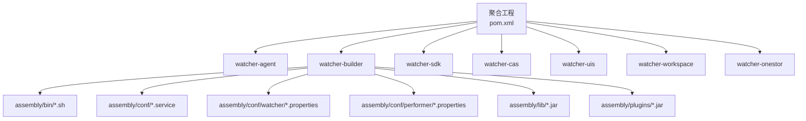
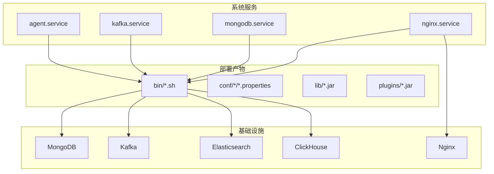
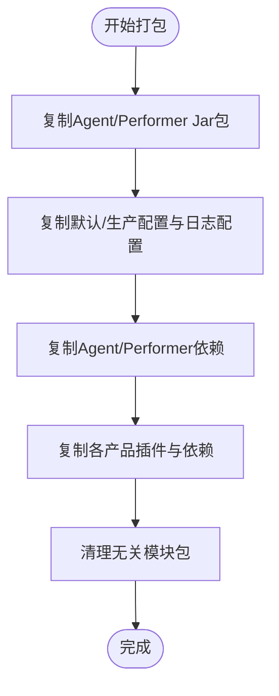
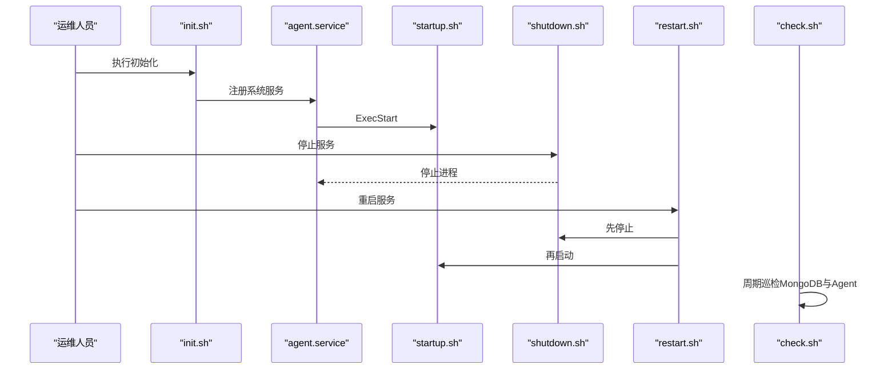
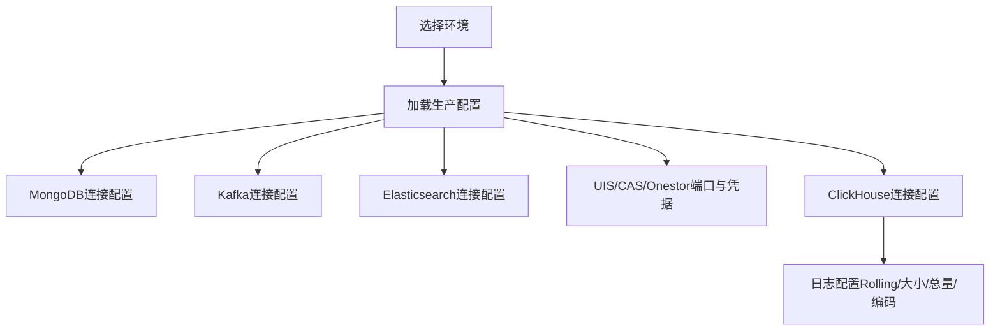
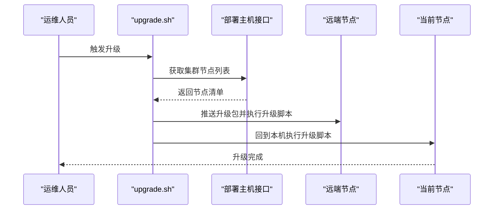
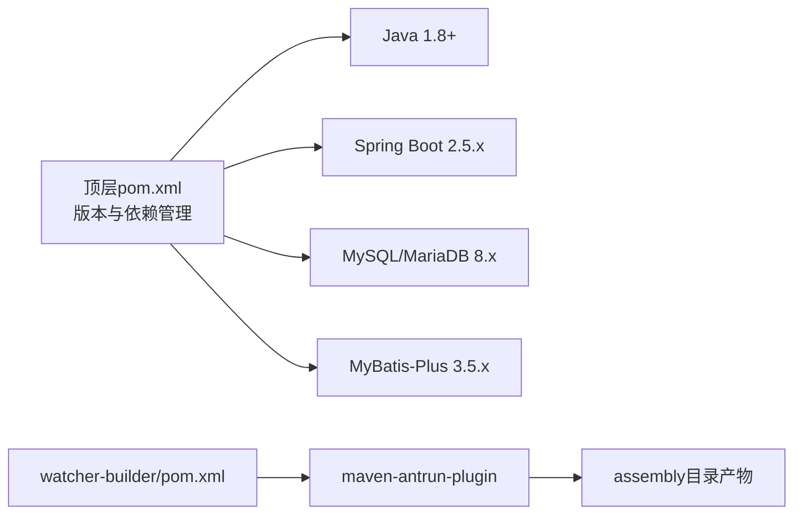

# 部署与运维

<cite>
**本文引用的文件**
- [Readme.md](file://Readme.md)
- [pom.xml](file://pom.xml)
- [watcher-builder/pom.xml](file://watcher-builder/pom.xml)
- [watcher-builder/assembly/bin/startup.sh](file://watcher-builder/assembly/bin/startup.sh)
- [watcher-builder/assembly/bin/shutdown.sh](file://watcher-builder/assembly/bin/shutdown.sh)
- [watcher-builder/assembly/bin/restart.sh](file://watcher-builder/assembly/bin/restart.sh)
- [watcher-builder/assembly/bin/check.sh](file://watcher-builder/assembly/bin/check.sh)
- [watcher-builder/assembly/bin/init.sh](file://watcher-builder/assembly/bin/init.sh)
- [watcher-builder/assembly/bin/upgrade.sh](file://watcher-builder/assembly/bin/upgrade.sh)
- [watcher-builder/assembly/conf/agent.service](file://watcher-builder/assembly/conf/agent.service)
- [watcher-builder/assembly/conf/kafka.service](file://watcher-builder/assembly/conf/kafka.service)
- [watcher-builder/assembly/conf/mongodb.service](file://watcher-builder/assembly/conf/mongodb.service)
- [watcher-builder/assembly/conf/nginx.service](file://watcher-builder/assembly/conf/nginx.service)
- [watcher-agent/src/main/resources/application-prod.properties](file://watcher-agent/src/main/resources/application-prod.properties)
- [watcher-agent/src/main/resources/logback-prod.xml](file://watcher-agent/src/main/resources/logback-prod.xml)
</cite>

## 目录
1. [简介](#简介)
2. [项目结构](#项目结构)
3. [核心组件](#核心组件)
4. [架构总览](#架构总览)
5. [详细组件分析](#详细组件分析)
6. [依赖分析](#依赖分析)
7. [性能考虑](#性能考虑)
8. [故障排查指南](#故障排查指南)
9. [结论](#结论)
10. [附录](#附录)

## 简介
本文件面向ShowTime监控系统的部署与运维团队，提供从环境准备、依赖安装、配置管理、集群部署、自动化工具到监控维护与常见运维场景的全流程指导。系统采用Spring Boot微服务化架构，结合MongoDB、Elasticsearch、Kafka、ClickHouse等组件，形成日志采集、全文检索、指标采集与报表展示的完整链路。

章节来源
- [Readme.md:1-45](file://Readme.md#L1-L45)

## 项目结构
- 顶层聚合工程通过Maven模块化组织，包含watcher-agent（采集与调度）、watcher-builder（打包与系统服务脚本）、watcher-sdk（公共配置与工具）、watcher-cas/uis/workspace/onestor（各产品插件）等。
- watcher-builder负责将各模块产物与依赖打包，并生成可直接部署的目录结构，同时提供系统服务单元与启动/停止/重启/巡检/升级脚本。
- watcher-agent在生产环境使用独立配置文件与日志配置，连接MongoDB、Kafka、ES、ClickHouse等后端组件。

图表来源
- [pom.xml:11-18](file://pom.xml#L11-L18)
- [watcher-builder/pom.xml:15-209](file://watcher-builder/pom.xml#L15-L209)

章节来源
- [pom.xml:11-18](file://pom.xml#L11-L18)
- [watcher-builder/pom.xml:15-209](file://watcher-builder/pom.xml#L15-L209)

## 核心组件
- watcher-agent：采集与调度主程序，负责资源管理、定时任务、日志采集策略下发，连接MongoDB、Kafka、ES、ClickHouse等。
- watcher-builder：打包与系统集成，输出部署目录、系统服务单元、启动/停止/重启/巡检/升级脚本。
- watcher-sdk：公共配置、DTO、工具类，被各模块复用。
- 各产品插件（watcher-cas/uis/workspace/onestor）提供特定指标采集、日志解析与告警上报能力。

章节来源
- [Readme.md:29-38](file://Readme.md#L29-L38)
- [watcher-builder/pom.xml:15-209](file://watcher-builder/pom.xml#L15-L209)

## 架构总览
下图展示了部署层面的系统组成与交互关系：watcher-agent作为核心进程，通过系统服务单元托管；watcher-builder提供统一的打包与运维脚本；MongoDB/Kafka/ES/ClickHouse构成数据与消息基础设施；Nginx用于前端或代理场景（视具体部署形态）。

图表来源
- [watcher-builder/assembly/conf/agent.service:1-14](file://watcher-builder/assembly/conf/agent.service#L1-L14)
- [watcher-builder/assembly/conf/kafka.service:1-14](file://watcher-builder/assembly/conf/kafka.service#L1-L14)
- [watcher-builder/assembly/conf/mongodb.service:1-14](file://watcher-builder/assembly/conf/mongodb.service#L1-L14)
- [watcher-builder/assembly/conf/nginx.service:1-14](file://watcher-builder/assembly/conf/nginx.service#L1-L14)
- [watcher-builder/assembly/bin/startup.sh:78-78](file://watcher-builder/assembly/bin/startup.sh#L78-L78)

## 详细组件分析

### watcher-builder 打包与部署
- 打包目标：将watcher-agent、performer-service及其插件与依赖复制到assembly目录，生成可直接部署的结构。
- 关键行为：
  - 复制Agent与Performer的Jar包与配置文件。
  - 将各模块插件与依赖复制至plugins与lib目录。
  - 清理无关模块包，避免冗余。
- 部署产物位置：assembly目录（包含bin、conf、lib、plugins、logs、data等子目录）。

图表来源
- [watcher-builder/pom.xml:25-200](file://watcher-builder/pom.xml#L25-L200)

章节来源
- [watcher-builder/pom.xml:15-209](file://watcher-builder/pom.xml#L15-L209)

### watcher-agent 启动与系统服务
- 启动脚本：校验Java版本、设置JVM参数、加载配置与插件、以nohup方式后台启动。
- 系统服务单元：定义ExecStart/ExecReload/ExecStop，随系统启动自动运行。
- 停止与重启：通过shutdown.sh与restart.sh实现平滑控制。
- 巡检脚本：check.sh周期性检测MongoDB与Agent状态并自动拉起。
- 初始化脚本：init.sh写入watcher_home、初始化部署、注册系统服务、开启自检任务与防火墙调整。

图表来源
- [watcher-builder/assembly/bin/init.sh:17-28](file://watcher-builder/assembly/bin/init.sh#L17-L28)
- [watcher-builder/assembly/conf/agent.service:7-10](file://watcher-builder/assembly/conf/agent.service#L7-L10)
- [watcher-builder/assembly/bin/startup.sh:78-78](file://watcher-builder/assembly/bin/startup.sh#L78-L78)
- [watcher-builder/assembly/bin/shutdown.sh:20-25](file://watcher-builder/assembly/bin/shutdown.sh#L20-L25)
- [watcher-builder/assembly/bin/restart.sh:6-8](file://watcher-builder/assembly/bin/restart.sh#L6-L8)
- [watcher-builder/assembly/bin/check.sh:5-19](file://watcher-builder/assembly/bin/check.sh#L5-L19)

章节来源
- [watcher-builder/assembly/bin/startup.sh:1-81](file://watcher-builder/assembly/bin/startup.sh#L1-L81)
- [watcher-builder/assembly/bin/shutdown.sh:1-26](file://watcher-builder/assembly/bin/shutdown.sh#L1-L26)
- [watcher-builder/assembly/bin/restart.sh:1-9](file://watcher-builder/assembly/bin/restart.sh#L1-L9)
- [watcher-builder/assembly/bin/check.sh:1-27](file://watcher-builder/assembly/bin/check.sh#L1-L27)
- [watcher-builder/assembly/bin/init.sh:1-35](file://watcher-builder/assembly/bin/init.sh#L1-L35)
- [watcher-builder/assembly/conf/agent.service:1-14](file://watcher-builder/assembly/conf/agent.service#L1-L14)

### 配置管理策略
- 环境区分：通过spring.profiles.active切换开发/测试/生产环境；生产配置文件提供默认值与覆盖项。
- 关键配置项：
  - MongoDB连接：副本集配置与索引创建开关。
  - Kafka连接：集群地址列表。
  - Elasticsearch：集群名、用户名、密码、节点地址、超时与并发限制。
  - UIS/CAS/Onestor：REST端口与内部账号配置。
  - ClickHouse：端点、用户、密码、数据库。
- 日志配置：生产环境下滚动策略、大小与总量上限、编码与模式。

图表来源
- [watcher-agent/src/main/resources/application-prod.properties:3-69](file://watcher-agent/src/main/resources/application-prod.properties#L3-L69)
- [watcher-agent/src/main/resources/logback-prod.xml:9-31](file://watcher-agent/src/main/resources/logback-prod.xml#L9-L31)

章节来源
- [watcher-agent/src/main/resources/application-prod.properties:1-70](file://watcher-agent/src/main/resources/application-prod.properties#L1-L70)
- [watcher-agent/src/main/resources/logback-prod.xml:1-35](file://watcher-agent/src/main/resources/logback-prod.xml#L1-L35)

### 集群部署方案
- 高可用架构要点：
  - MongoDB：副本集部署，确保读写容灾。
  - Kafka：多Broker集群，Topic分区与副本合理规划。
  - Elasticsearch：多节点集群，合理设置分片与副本，启用安全认证。
  - ClickHouse：单机版已内置，若需高可用可扩展为分布式表引擎与多副本。
- 负载均衡与故障转移：
  - 通过各组件的集群配置实现自动故障转移。
  - Nginx作为反向代理（如需要）时，建议配合健康检查与会话保持策略。
- watcher-agent：通过系统服务单元托管，结合巡检脚本实现自愈。

章节来源
- [watcher-agent/src/main/resources/application-prod.properties:3-29](file://watcher-agent/src/main/resources/application-prod.properties#L3-L29)
- [watcher-builder/assembly/conf/nginx.service:1-14](file://watcher-builder/assembly/conf/nginx.service#L1-L14)

### 自动化部署工具与升级流程
- watcher-builder打包：统一产出部署包，包含bin、conf、lib、plugins等。
- 升级脚本：upgrade.sh通过远程节点发现与SSH推送，逐节点执行当前节点升级脚本，最后回滚到本机执行，确保全量升级成功。
- 升级前准备：确保各节点可达、凭据正确、磁盘空间充足。

图表来源
- [watcher-builder/assembly/bin/upgrade.sh:18-43](file://watcher-builder/assembly/bin/upgrade.sh#L18-L43)

章节来源
- [watcher-builder/assembly/bin/upgrade.sh:1-53](file://watcher-builder/assembly/bin/upgrade.sh#L1-L53)

## 依赖分析
- Java版本：启动脚本要求Java 1.8及以上。
- Maven属性：顶层pom定义了Spring Boot、MySQL/MariaDB、MyBatis-Plus等版本，确保依赖一致性。
- 组件依赖：watcher-builder通过maven-antrun-plugin复制各模块产物与依赖，形成独立部署包。

图表来源
- [pom.xml:22-47](file://pom.xml#L22-L47)
- [watcher-builder/pom.xml:17-207](file://watcher-builder/pom.xml#L17-L207)

章节来源
- [pom.xml:22-47](file://pom.xml#L22-L47)
- [watcher-builder/pom.xml:17-207](file://watcher-builder/pom.xml#L17-L207)

## 性能考虑
- JVM参数：启动脚本设置堆大小与GC日志轮转、堆转储路径，便于问题定位与容量评估。
- 日志滚动：按大小与时间滚动，限制总量，避免磁盘打满。
- 连接池与超时：ES连接超时、最大连接数与每路由连接数，建议根据并发与延迟调优。
- 数据库与消息：MongoDB/Kafka/ES/ClickHouse的分区与副本策略直接影响吞吐与延迟。

章节来源
- [watcher-builder/assembly/bin/startup.sh:62-72](file://watcher-builder/assembly/bin/startup.sh#L62-L72)
- [watcher-agent/src/main/resources/logback-prod.xml:18-26](file://watcher-agent/src/main/resources/logback-prod.xml#L18-L26)
- [watcher-agent/src/main/resources/application-prod.properties:21-29](file://watcher-agent/src/main/resources/application-prod.properties#L21-L29)

## 故障排查指南
- 启动失败
  - 检查Java版本与JAVA_HOME是否正确。
  - 查看错误输出与GC/Dump日志路径。
- 进程状态异常
  - 使用check.sh确认MongoDB与Agent进程是否存在，必要时触发自动拉起。
  - 通过系统服务单元状态查看与重载。
- 升级失败
  - 核对节点发现接口返回与SSH凭据。
  - 检查磁盘空间与网络连通性。
- 配置不生效
  - 确认spring.profiles.active与配置文件路径。
  - 校验敏感信息是否正确注入（如环境变量覆盖）。

章节来源
- [watcher-builder/assembly/bin/startup.sh:3-25](file://watcher-builder/assembly/bin/startup.sh#L3-L25)
- [watcher-builder/assembly/bin/check.sh:5-19](file://watcher-builder/assembly/bin/check.sh#L5-L19)
- [watcher-builder/assembly/bin/upgrade.sh:35-38](file://watcher-builder/assembly/bin/upgrade.sh#L35-L38)
- [watcher-builder/assembly/conf/agent.service:7-10](file://watcher-builder/assembly/conf/agent.service#L7-L10)

## 结论
通过watcher-builder提供的统一打包与运维脚本，结合系统服务单元与巡检机制，ShowTime监控系统可在生产环境中实现稳定、可演进的部署与运维。建议在生产部署前完成硬件与网络规划、安全加固与容量评估，并建立标准化的升级与回滚流程。

## 附录

### 环境准备与硬件配置
- 操作系统：Linux发行版（CentOS/RHEL/Ubuntu等），建议内核较新且支持systemd。
- 硬件建议：CPU≥4核、内存≥8GB（根据采集规模与ES/Kafka负载调整），磁盘预留日志与GC Dump空间。
- 网络：开放MongoDB/Kafka/ES/ClickHouse端口，确保各节点互通；如使用Nginx，开放相应端口。
- 安全：关闭防火墙或放行所需端口；SSH使用强密钥与禁用密码登录；ES启用认证与TLS（如需要）。

章节来源
- [Readme.md:40-45](file://Readme.md#L40-L45)
- [watcher-builder/assembly/bin/init.sh:27-28](file://watcher-builder/assembly/bin/init.sh#L27-L28)

### 依赖安装与配置步骤
- JDK：安装Java 1.8及以上，设置JAVA_HOME。
- 数据库：安装MongoDB副本集；初始化数据库与用户权限。
- 消息队列：安装Kafka集群，创建Topic并配置分区与副本。
- 搜索引擎：安装Elasticsearch集群，配置认证与网络访问。
- ClickHouse：安装单机版或分布式集群，准备数据库与账号。
- Nginx：如需反向代理，安装并配置上游服务。

章节来源
- [watcher-builder/assembly/bin/startup.sh:3-25](file://watcher-builder/assembly/bin/startup.sh#L3-L25)
- [watcher-agent/src/main/resources/application-prod.properties:3-29](file://watcher-agent/src/main/resources/application-prod.properties#L3-L29)

### 配置管理与热更新
- 环境隔离：通过spring.profiles.active与spring.config.location指定配置文件。
- 敏感信息：优先使用环境变量覆盖（如UIS/CAS/Onestor端口与账号）。
- 热更新：watcher-agent基于Spring Boot，可通过外部配置与环境变量实现部分参数热生效；核心连接参数变更需重启生效。

章节来源
- [watcher-builder/assembly/bin/startup.sh:78-78](file://watcher-builder/assembly/bin/startup.sh#L78-L78)
- [watcher-agent/src/main/resources/application-prod.properties:40-63](file://watcher-agent/src/main/resources/application-prod.properties#L40-L63)

### 集群高可用与故障转移
- MongoDB副本集：确保主从切换与仲裁节点。
- Kafka集群：多Broker与分区副本，Topic级别副本因子与同步策略。
- Elasticsearch：多节点、分片与副本、安全认证与只读索引策略。
- watcher-agent：系统服务单元+巡检脚本实现自愈。

章节来源
- [watcher-agent/src/main/resources/application-prod.properties:3-29](file://watcher-agent/src/main/resources/application-prod.properties#L3-L29)
- [watcher-builder/assembly/bin/check.sh:5-19](file://watcher-builder/assembly/bin/check.sh#L5-L19)

### 自动化部署与升级
- 打包：执行watcher-builder构建，生成assembly目录。
- 初始化：执行init.sh写入watcher_home、注册服务、开启巡检。
- 升级：执行upgrade.sh，按节点顺序推送并执行升级脚本。

章节来源
- [watcher-builder/assembly/bin/init.sh:17-28](file://watcher-builder/assembly/bin/init.sh#L17-L28)
- [watcher-builder/assembly/bin/upgrade.sh:18-43](file://watcher-builder/assembly/bin/upgrade.sh#L18-L43)

### 监控与维护
- 健康检查：定期执行check.sh，关注MongoDB与Agent状态。
- 性能监控：关注JVM GC日志、磁盘使用、ES/Kafka/ClickHouse指标。
- 日志分析：按天滚动压缩，保留历史日志，定期清理过期日志。
- 容量规划：评估日志量、索引增长、Kafka堆积与ClickHouse写入速率。

章节来源
- [watcher-builder/assembly/bin/check.sh:5-19](file://watcher-builder/assembly/bin/check.sh#L5-L19)
- [watcher-agent/src/main/resources/logback-prod.xml:18-26](file://watcher-agent/src/main/resources/logback-prod.xml#L18-L26)
- [watcher-builder/assembly/bin/startup.sh:62-72](file://watcher-builder/assembly/bin/startup.sh#L62-L72)

### 常见运维场景
- 升级部署：使用upgrade.sh进行全量升级，确保回滚路径与验证步骤。
- 紧急故障处理：通过check.sh自动拉起，必要时手动执行shutdown.sh与startup.sh。
- 数据备份与恢复：针对MongoDB/Kafka/ES/ClickHouse制定备份策略与演练计划。

章节来源
- [watcher-builder/assembly/bin/upgrade.sh:18-43](file://watcher-builder/assembly/bin/upgrade.sh#L18-L43)
- [watcher-builder/assembly/bin/check.sh:5-19](file://watcher-builder/assembly/bin/check.sh#L5-L19)
- [watcher-builder/assembly/bin/shutdown.sh:20-25](file://watcher-builder/assembly/bin/shutdown.sh#L20-L25)
- [watcher-builder/assembly/bin/startup.sh:78-78](file://watcher-builder/assembly/bin/startup.sh#L78-L78)