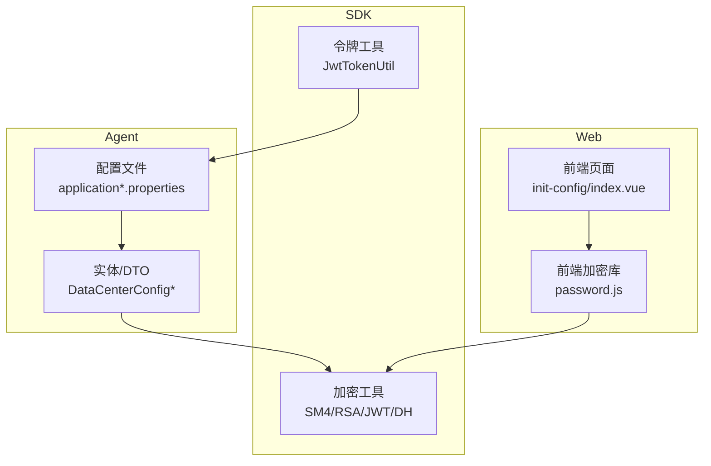
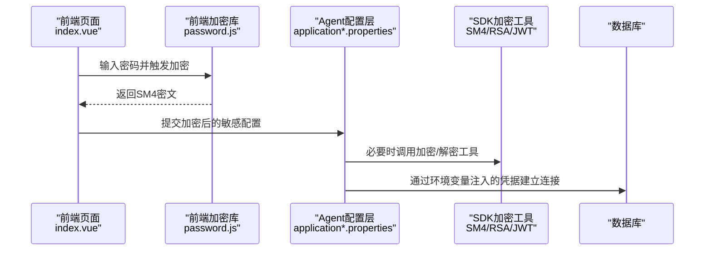
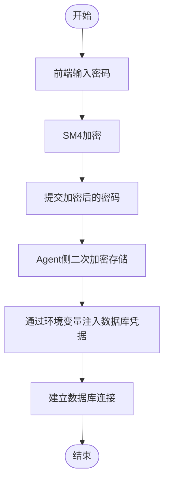
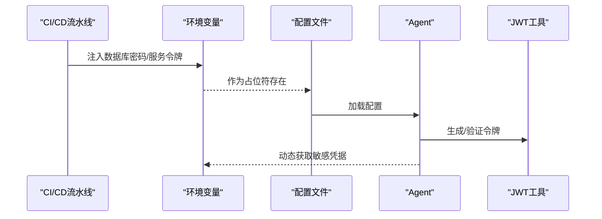
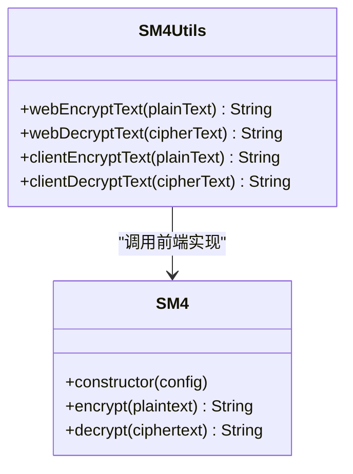
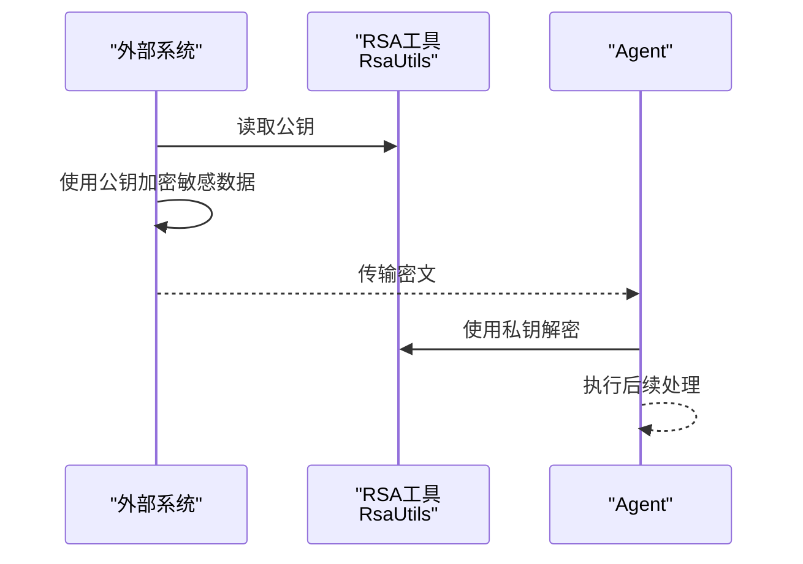
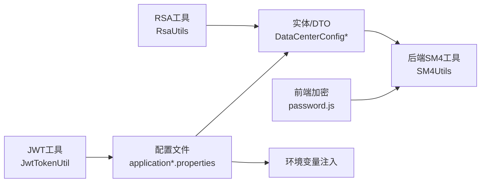

# 安全与敏感配置

<cite>
**本文引用的文件**
- [application.properties](file://watcher-agent/src/main/resources/application.properties)
- [application-dev.properties](file://watcher-agent/src/main/resources/application-dev.properties)
- [application-prod.properties](file://watcher-agent/src/main/resources/application-prod.properties)
- [DataCenterConfig.java](file://watcher-agent/src/main/java/com/virtual/cloud/om/agent/entity/DataCenterConfig.java)
- [DataCenterConfigDTO.java](file://watcher-agent/src/main/java/com/virtual/cloud/om/agent/dto/DataCenterConfigDTO.java)
- [PwdStrategy.java](file://watcher-sdk/src/main/java/com/virtual/cloud/om/sdk/entity/mysql/PwdStrategy.java)
- [JwtTokenUtil.java](file://watcher-sdk/src/main/java/com/virtual/cloud/om/sdk/utils/JwtTokenUtil.java)
- [RsaUtils.java](file://watcher-sdk/src/main/java/com/virtual/cloud/om/sdk/utils/RsaUtils.java)
- [DHUtil.java](file://watcher-sdk/src/main/java/com/virtual/cloud/om/sdk/utils/DHUtil.java)
- [SM4Utils.java](file://watcher-sdk/src/main/java/com/virtual/cloud/om/sdk/utils/sm4/SM4Utils.java)
- [password.js](file://watcher-web/src/utils/system/password.js)
- [index.vue](file://watcher-web/src/views/main/init-config/index.vue)
</cite>

## 目录
1. [简介](#简介)
2. [项目结构](#项目结构)
3. [核心组件](#核心组件)
4. [架构总览](#架构总览)
5. [详细组件分析](#详细组件分析)
6. [依赖关系分析](#依赖关系分析)
7. [性能考虑](#性能考虑)
8. [故障排查指南](#故障排查指南)
9. [结论](#结论)
10. [附录](#附录)

## 简介
本指南聚焦于ShowTime监控系统中“安全与敏感配置”的专业实践，围绕以下目标展开：
- 密码配置的安全管理：替代明文密码的策略与加密存储
- 敏感配置项的保护：数据库密码、服务令牌、API密钥等的加密处理
- 对称与非对称加密在配置管理中的应用：SM4与RSA
- 环境变量配置方法：将敏感信息从配置文件迁移到环境变量
- 配置文件权限管理：文件权限与访问控制最佳实践
- 安全配置审计与常见漏洞防护

本指南以仓库中实际代码与配置文件为依据，提供可落地的安全建议与实施步骤。

## 项目结构
本项目采用多模块结构，涉及Agent、SDK、Web、AI、Builder等多个子工程。与“安全与敏感配置”直接相关的关键位置如下：
- 配置文件集中于Agent模块的resources目录，包含开发、测试、生产等多套profile
- SDK模块提供加密工具类（SM4、RSA、JWT、DH等），用于敏感数据的加密与令牌签发
- Web前端提供密码输入与展示逻辑，包含SM4加密实现与界面交互
- Agent实体与DTO中存在敏感字段（如数据中心密码），体现敏感配置的承载与流转

**图表来源**
- [application.properties:1-80](file://watcher-agent/src/main/resources/application.properties#L1-L80)
- [application-dev.properties:1-72](file://watcher-agent/src/main/resources/application-dev.properties#L1-L72)
- [application-prod.properties:1-70](file://watcher-agent/src/main/resources/application-prod.properties#L1-L70)
- [DataCenterConfig.java:1-38](file://watcher-agent/src/main/java/com/virtual/cloud/om/agent/entity/DataCenterConfig.java#L1-L38)
- [DataCenterConfigDTO.java:1-26](file://watcher-agent/src/main/java/com/virtual/cloud/om/agent/dto/DataCenterConfigDTO.java#L1-L26)
- [SM4Utils.java:1-55](file://watcher-sdk/src/main/java/com/virtual/cloud/om/sdk/utils/sm4/SM4Utils.java#L1-L55)
- [RsaUtils.java:1-102](file://watcher-sdk/src/main/java/com/virtual/cloud/om/sdk/utils/RsaUtils.java#L1-L102)
- [JwtTokenUtil.java:1-88](file://watcher-sdk/src/main/java/com/virtual/cloud/om/sdk/utils/JwtTokenUtil.java#L1-L88)
- [password.js:1-458](file://watcher-web/src/utils/system/password.js#L1-L458)
- [index.vue:80-105](file://watcher-web/src/views/main/init-config/index.vue#L80-L105)

**章节来源**
- [application.properties:1-80](file://watcher-agent/src/main/resources/application.properties#L1-L80)
- [application-dev.properties:1-72](file://watcher-agent/src/main/resources/application-dev.properties#L1-L72)
- [application-prod.properties:1-70](file://watcher-agent/src/main/resources/application-prod.properties#L1-L70)
- [DataCenterConfig.java:1-38](file://watcher-agent/src/main/java/com/virtual/cloud/om/agent/entity/DataCenterConfig.java#L1-L38)
- [DataCenterConfigDTO.java:1-26](file://watcher-agent/src/main/java/com/virtual/cloud/om/agent/dto/DataCenterConfigDTO.java#L1-L26)
- [SM4Utils.java:1-55](file://watcher-sdk/src/main/java/com/virtual/cloud/om/sdk/utils/sm4/SM4Utils.java#L1-L55)
- [RsaUtils.java:1-102](file://watcher-sdk/src/main/java/com/virtual/cloud/om/sdk/utils/RsaUtils.java#L1-L102)
- [JwtTokenUtil.java:1-88](file://watcher-sdk/src/main/java/com/virtual/cloud/om/sdk/utils/JwtTokenUtil.java#L1-L88)
- [password.js:1-458](file://watcher-web/src/utils/system/password.js#L1-L458)
- [index.vue:80-105](file://watcher-web/src/views/main/init-config/index.vue#L80-L105)

## 核心组件
- 配置文件与敏感项
  - 数据库连接密码：spring.datasource.password（明文占位或空值）
  - 多个服务的用户名/密码：如UIS、CAS、Workspace等内部账号密码
  - 环境变量注入示例：UIS_PORT、CAS_PORT、ONESTOR_PORT等
- 加密工具类
  - SM4对称加密：SM4Utils与前端password.js中的SM4实现
  - RSA非对称加密：RsaUtils
  - JWT令牌：JwtTokenUtil
  - DH密钥协商：DHUtil
- 前端与Agent实体
  - 前端页面支持密码输入与切换显示
  - Agent实体/DTO中包含敏感字段（如数据中心密码）

**章节来源**
- [application.properties:48-51](file://watcher-agent/src/main/resources/application.properties#L48-L51)
- [application-dev.properties:40-48](file://watcher-agent/src/main/resources/application-dev.properties#L40-L48)
- [application-prod.properties:40-48](file://watcher-agent/src/main/resources/application-prod.properties#L40-L48)
- [SM4Utils.java:1-55](file://watcher-sdk/src/main/java/com/virtual/cloud/om/sdk/utils/sm4/SM4Utils.java#L1-L55)
- [RsaUtils.java:1-102](file://watcher-sdk/src/main/java/com/virtual/cloud/om/sdk/utils/RsaUtils.java#L1-L102)
- [JwtTokenUtil.java:1-88](file://watcher-sdk/src/main/java/com/virtual/cloud/om/sdk/utils/JwtTokenUtil.java#L1-L88)
- [DHUtil.java:1-311](file://watcher-sdk/src/main/java/com/virtual/cloud/om/sdk/utils/DHUtil.java#L1-L311)
- [index.vue:80-105](file://watcher-web/src/views/main/init-config/index.vue#L80-L105)
- [DataCenterConfig.java:29-33](file://watcher-agent/src/main/java/com/virtual/cloud/om/agent/entity/DataCenterConfig.java#L29-L33)

## 架构总览
下图展示了敏感配置在系统中的流转与保护路径：前端输入经SM4加密后传递至Agent；Agent侧可结合SDK工具进行进一步处理；数据库连接凭据通过环境变量注入，避免硬编码；JWT用于认证令牌签发与校验。

**图表来源**
- [index.vue:80-105](file://watcher-web/src/views/main/init-config/index.vue#L80-L105)
- [password.js:1-458](file://watcher-web/src/utils/system/password.js#L1-L458)
- [application-dev.properties:40-48](file://watcher-agent/src/main/resources/application-dev.properties#L40-L48)
- [application-prod.properties:40-48](file://watcher-agent/src/main/resources/application-prod.properties#L40-L48)
- [SM4Utils.java:1-55](file://watcher-sdk/src/main/java/com/virtual/cloud/om/sdk/utils/sm4/SM4Utils.java#L1-L55)
- [RsaUtils.java:1-102](file://watcher-sdk/src/main/java/com/virtual/cloud/om/sdk/utils/RsaUtils.java#L1-L102)
- [JwtTokenUtil.java:1-88](file://watcher-sdk/src/main/java/com/virtual/cloud/om/sdk/utils/JwtTokenUtil.java#L1-L88)

## 详细组件分析

### 密码配置与加密存储
- 明文密码现状
  - 数据库连接密码在开发/生产配置中存在明文占位或空值，应通过环境变量注入
  - 多个服务的用户名/密码在配置文件中以明文形式出现
- 替代方案与加密策略
  - 前端加密：使用SM4对密码进行加密后再提交
  - 后端存储：建议在Agent侧对敏感字段进行二次加密，并结合密钥管理系统
  - 环境变量注入：将数据库密码、服务令牌等敏感项从配置文件迁移到环境变量
- 实施要点
  - 前端：使用password.js中的SM4实现进行加密
  - 后端：使用SM4Utils或RsaUtils进行解密与处理
  - 存储：Agent实体/DTO中的敏感字段应仅在内存中处理，持久化前再次加密

**图表来源**
- [password.js:338-387](file://watcher-web/src/utils/system/password.js#L338-L387)
- [SM4Utils.java:20-31](file://watcher-sdk/src/main/java/com/virtual/cloud/om/sdk/utils/sm4/SM4Utils.java#L20-L31)
- [application-dev.properties:40-48](file://watcher-agent/src/main/resources/application-dev.properties#L40-L48)
- [application-prod.properties:40-48](file://watcher-agent/src/main/resources/application-prod.properties#L40-L48)

**章节来源**
- [application.properties:48-51](file://watcher-agent/src/main/resources/application.properties#L48-L51)
- [application-dev.properties:40-48](file://watcher-agent/src/main/resources/application-dev.properties#L40-L48)
- [application-prod.properties:40-48](file://watcher-agent/src/main/resources/application-prod.properties#L40-L48)
- [password.js:338-387](file://watcher-web/src/utils/system/password.js#L338-L387)
- [SM4Utils.java:20-31](file://watcher-sdk/src/main/java/com/virtual/cloud/om/sdk/utils/sm4/SM4Utils.java#L20-L31)

### 敏感配置项的保护机制
- 数据库密码
  - 当前配置中存在明文占位，建议通过环境变量注入
  - 在CI/CD中使用密钥管理服务（如KMS）动态注入
- 服务令牌与API密钥
  - UIS/CAS/OneStor等服务的用户名/密码应迁移至环境变量
  - 令牌签发与校验使用JWT工具进行统一管理
- 加密处理流程
  - 前端：SM4加密
  - 后端：解密与业务处理
  - 存储：二次加密与最小化暴露

**图表来源**
- [application-dev.properties:40-48](file://watcher-agent/src/main/resources/application-dev.properties#L40-L48)
- [application-prod.properties:40-48](file://watcher-agent/src/main/resources/application-prod.properties#L40-L48)
- [JwtTokenUtil.java:49-69](file://watcher-sdk/src/main/java/com/virtual/cloud/om/sdk/utils/JwtTokenUtil.java#L49-L69)

**章节来源**
- [application-dev.properties:40-48](file://watcher-agent/src/main/resources/application-dev.properties#L40-L48)
- [application-prod.properties:40-48](file://watcher-agent/src/main/resources/application-prod.properties#L40-L48)
- [JwtTokenUtil.java:49-69](file://watcher-sdk/src/main/java/com/virtual/cloud/om/sdk/utils/JwtTokenUtil.java#L49-L69)

### SM4对称加密在配置管理中的应用
- 前端实现
  - password.js提供SM4的完整实现，支持CBC/ECB模式、IV与填充
- 后端实现
  - SM4Utils封装了web与客户端场景下的加密/解密入口
- 应用场景
  - 前端将密码加密后提交至Agent
  - Agent侧根据场景选择合适的密钥与模式进行解密与处理

**图表来源**
- [SM4Utils.java:1-55](file://watcher-sdk/src/main/java/com/virtual/cloud/om/sdk/utils/sm4/SM4Utils.java#L1-L55)
- [password.js:95-156](file://watcher-web/src/utils/system/password.js#L95-L156)

**章节来源**
- [SM4Utils.java:1-55](file://watcher-sdk/src/main/java/com/virtual/cloud/om/sdk/utils/sm4/SM4Utils.java#L1-L55)
- [password.js:95-156](file://watcher-web/src/utils/system/password.js#L95-L156)

### RSA非对称加密在配置管理中的应用
- 工具类能力
  - RsaUtils提供公钥/私钥加载、密钥对生成、Base64编解码等
- 应用场景
  - 适合在Agent与外部系统之间进行密钥交换与敏感数据加密
  - 建议将私钥存放于受控环境，公钥用于对外加密

**图表来源**
- [RsaUtils.java:20-62](file://watcher-sdk/src/main/java/com/virtual/cloud/om/sdk/utils/RsaUtils.java#L20-L62)

**章节来源**
- [RsaUtils.java:20-62](file://watcher-sdk/src/main/java/com/virtual/cloud/om/sdk/utils/RsaUtils.java#L20-L62)

### 环境变量配置方法
- 现状
  - 配置文件中存在${VAR:default}形式的占位符，便于通过环境变量注入
- 建议
  - 将数据库密码、服务令牌、端口等敏感项统一通过环境变量注入
  - 在容器编排中使用密文卷或密钥管理服务，避免明文落盘

**章节来源**
- [application-dev.properties:40-48](file://watcher-agent/src/main/resources/application-dev.properties#L40-L48)
- [application-prod.properties:40-48](file://watcher-agent/src/main/resources/application-prod.properties#L40-L48)

### 配置文件权限管理最佳实践
- 文件权限
  - 仅授予必要用户/组读写权限，避免全局可读写
  - 配置文件所在目录同样需要严格权限控制
- 访问控制
  - 限制对配置文件的访问主体，启用审计日志
  - 在CI/CD中对配置文件进行签名与校验

[本节为通用实践指导，无需特定文件引用]

### 安全配置审计与常见漏洞防护
- 审计方法
  - 定期扫描配置文件中的明文密码与令牌
  - 检查环境变量注入是否正确生效
  - 核对加密流程是否被绕过
- 常见漏洞与防护
  - 明文密码：通过环境变量与密钥管理替换
  - 配置泄露：最小权限原则与只读部署
  - 令牌滥用：缩短有效期与定期轮换

[本节为通用实践指导，无需特定文件引用]

## 依赖关系分析
- 组件耦合
  - 前端password.js与SM4Utils在功能上互补，分别负责前端加密与后端工具
  - Agent配置文件与实体/DTO存在强耦合，敏感字段需统一治理
- 外部依赖
  - 环境变量注入依赖CI/CD与密钥管理服务
  - JWT依赖统一的密钥与算法配置

**图表来源**
- [password.js:338-387](file://watcher-web/src/utils/system/password.js#L338-L387)
- [SM4Utils.java:1-55](file://watcher-sdk/src/main/java/com/virtual/cloud/om/sdk/utils/sm4/SM4Utils.java#L1-L55)
- [application.properties:48-51](file://watcher-agent/src/main/resources/application.properties#L48-L51)
- [DataCenterConfig.java:29-33](file://watcher-agent/src/main/java/com/virtual/cloud/om/agent/entity/DataCenterConfig.java#L29-L33)
- [RsaUtils.java:1-102](file://watcher-sdk/src/main/java/com/virtual/cloud/om/sdk/utils/RsaUtils.java#L1-L102)
- [JwtTokenUtil.java:1-88](file://watcher-sdk/src/main/java/com/virtual/cloud/om/sdk/utils/JwtTokenUtil.java#L1-L88)

**章节来源**
- [application.properties:48-51](file://watcher-agent/src/main/resources/application.properties#L48-L51)
- [DataCenterConfig.java:29-33](file://watcher-agent/src/main/java/com/virtual/cloud/om/agent/entity/DataCenterConfig.java#L29-L33)
- [SM4Utils.java:1-55](file://watcher-sdk/src/main/java/com/virtual/cloud/om/sdk/utils/sm4/SM4Utils.java#L1-L55)
- [RsaUtils.java:1-102](file://watcher-sdk/src/main/java/com/virtual/cloud/om/sdk/utils/RsaUtils.java#L1-L102)
- [JwtTokenUtil.java:1-88](file://watcher-sdk/src/main/java/com/virtual/cloud/om/sdk/utils/JwtTokenUtil.java#L1-L88)
- [password.js:338-387](file://watcher-web/src/utils/system/password.js#L338-L387)

## 性能考虑
- 加密开销
  - SM4为对称加密，性能较高，适合大规模敏感数据处理
  - RSA为非对称加密，适合小量数据与密钥交换
- 并发与缓存
  - 建议在Agent侧缓存必要的密钥与令牌，减少重复计算
  - 对频繁访问的配置项进行本地缓存，降低I/O压力

[本节为通用指导，无需特定文件引用]

## 故障排查指南
- 前端加密异常
  - 检查password.js中SM4构造参数（key/iv/mode/outType）
  - 确认前后端密钥与模式一致
- 后端解密失败
  - 核对SM4Utils的密钥与IV配置
  - 检查Agent侧是否正确接收并处理加密数据
- 环境变量未生效
  - 确认CI/CD中环境变量已注入且优先级高于配置文件
  - 检查容器运行时的权限与可见性

**章节来源**
- [password.js:101-132](file://watcher-web/src/utils/system/password.js#L101-L132)
- [SM4Utils.java:5-13](file://watcher-sdk/src/main/java/com/virtual/cloud/om/sdk/utils/sm4/SM4Utils.java#L5-L13)
- [application-dev.properties:40-48](file://watcher-agent/src/main/resources/application-dev.properties#L40-L48)

## 结论
通过对ShowTime监控系统的安全与敏感配置进行系统化梳理，建议从以下方面入手：
- 将敏感信息从配置文件迁移至环境变量，并结合密钥管理服务
- 引入SM4对称加密与RSA非对称加密，形成“前端加密+后端解密”的闭环
- 建立统一的JWT令牌管理与审计机制
- 强化配置文件权限与访问控制，完善安全审计与漏洞防护

[本节为总结性内容，无需特定文件引用]

## 附录
- 关键实体与敏感字段
  - DataCenterConfig：包含ip、username、password、port、datacenterType
  - DataCenterConfigDTO：包含ip、username、password、comName、orgName
- 密码策略
  - PwdStrategy：定义密码最小长度、复杂度、有效期等策略

**章节来源**
- [DataCenterConfig.java:29-33](file://watcher-agent/src/main/java/com/virtual/cloud/om/agent/entity/DataCenterConfig.java#L29-L33)
- [DataCenterConfigDTO.java:18-19](file://watcher-agent/src/main/java/com/virtual/cloud/om/agent/dto/DataCenterConfigDTO.java#L18-L19)
- [PwdStrategy.java:29-42](file://watcher-sdk/src/main/java/com/virtual/cloud/om/sdk/entity/mysql/PwdStrategy.java#L29-L42)