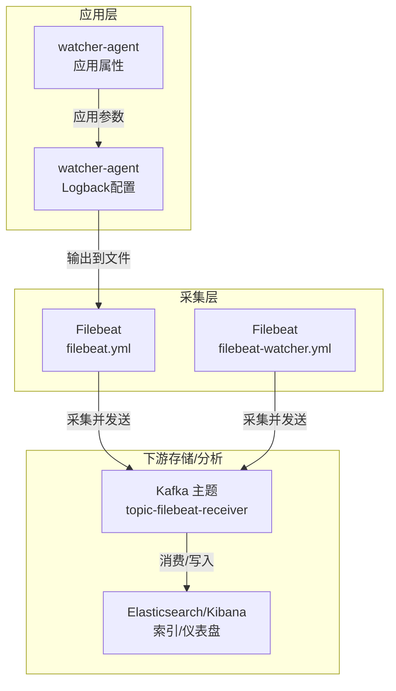
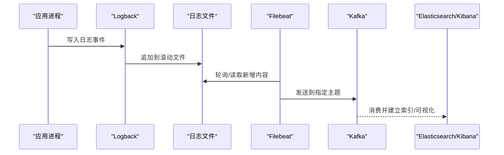
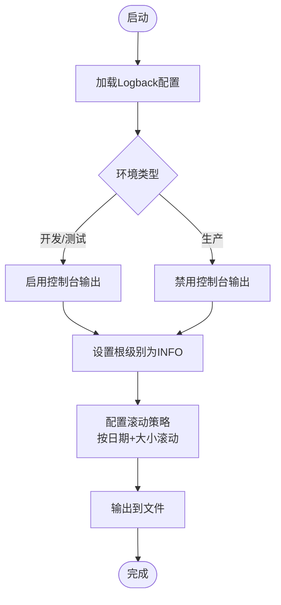
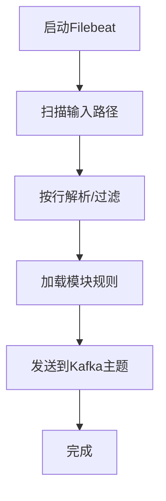

# 日志与监控配置

<cite>
**本文引用的文件**
- [logback-dev.xml](file://watcher-agent/src/main/resources/logback-dev.xml)
- [logback-test.xml](file://watcher-agent/src/main/resources/logback-test.xml)
- [logback-prod.xml](file://watcher-agent/src/main/resources/logback-prod.xml)
- [application-dev.properties](file://watcher-agent/src/main/resources/application-dev.properties)
- [application-test.properties](file://watcher-agent/src/main/resources/application-test.properties)
- [application-prod.properties](file://watcher-agent/src/main/resources/application-prod.properties)
- [filebeat.yml](file://watcher-builder/assembly/components/filebeat/filebeat-8.0.1-linux-x86_64/filebeat.yml)
- [filebeat-watcher.yml](file://watcher-builder/assembly/components/filebeat/filebeat-8.0.1-linux-x86_64/filebeat-watcher.yml)
</cite>

## 目录
1. [简介](#简介)
2. [项目结构](#项目结构)
3. [核心组件](#核心组件)
4. [架构总览](#架构总览)
5. [详细组件分析](#详细组件分析)
6. [依赖关系分析](#依赖关系分析)
7. [性能考量](#性能考量)
8. [故障排查指南](#故障排查指南)
9. [结论](#结论)
10. [附录](#附录)

## 简介
本指南聚焦于ShowTime监控系统中的日志与监控配置，覆盖以下主题：
- Logback在开发、测试、生产三类环境下的配置结构与差异
- 日志级别、输出格式、滚动策略等关键参数的作用与权衡
- Filebeat日志采集配置（输入路径、采集规则、输出目标）
- 监控端点配置（Actuator端点启用与访问控制）
- 性能优化建议与故障排查方法
- 日志聚合与分析的配置方案
- 配置变更的热更新机制

## 项目结构
围绕日志与监控的关键文件分布如下：
- 应用日志配置：Logback XML按环境拆分，位于 watcher-agent 模块资源目录
- 应用运行参数：application-{env}.properties 提供环境差异化配置
- 日志采集：Filebeat 配置位于 watcher-builder/assembly/components/filebeat 下
- 监控端点：Spring Boot Actuator 默认启用，结合安全策略进行访问控制

图表来源
- [logback-dev.xml:1-44](file://watcher-agent/src/main/resources/logback-dev.xml#L1-L44)
- [application-dev.properties:1-72](file://watcher-agent/src/main/resources/application-dev.properties#L1-L72)
- [filebeat.yml:1-231](file://watcher-builder/assembly/components/filebeat/filebeat-8.0.1-linux-x86_64/filebeat.yml#L1-L231)
- [filebeat-watcher.yml:1-17](file://watcher-builder/assembly/components/filebeat/filebeat-8.0.1-linux-x86_64/filebeat-watcher.yml#L1-L17)

章节来源
- [logback-dev.xml:1-44](file://watcher-agent/src/main/resources/logback-dev.xml#L1-L44)
- [logback-test.xml:1-45](file://watcher-agent/src/main/resources/logback-test.xml#L1-L45)
- [logback-prod.xml:1-35](file://watcher-agent/src/main/resources/logback-prod.xml#L1-L35)
- [application-dev.properties:1-72](file://watcher-agent/src/main/resources/application-dev.properties#L1-L72)
- [application-test.properties:1-66](file://watcher-agent/src/main/resources/application-test.properties#L1-L66)
- [application-prod.properties:1-70](file://watcher-agent/src/main/resources/application-prod.properties#L1-L70)
- [filebeat.yml:1-231](file://watcher-builder/assembly/components/filebeat/filebeat-8.0.1-linux-x86_64/filebeat.yml#L1-L231)
- [filebeat-watcher.yml:1-17](file://watcher-builder/assembly/components/filebeat/filebeat-8.0.1-linux-x86_64/filebeat-watcher.yml#L1-L17)

## 核心组件
- Logback配置（按环境）
  - 开发/测试：同时输出至文件与控制台，便于本地调试
  - 生产：仅输出至文件，减少控制台噪声与IO开销
- Filebeat配置
  - 通用配置：定义输入源、模块加载、输出目标（Kafka）
  - Watcher专用：限定输入路径与Kafka目标，便于独立部署
- 应用属性（按环境）
  - 数据库、消息队列、搜索引擎、外部服务等连接参数
  - 与日志采集路径、输出目标形成联动

章节来源
- [logback-dev.xml:28-40](file://watcher-agent/src/main/resources/logback-dev.xml#L28-L40)
- [logback-prod.xml:29-31](file://watcher-agent/src/main/resources/logback-prod.xml#L29-L31)
- [filebeat.yml:13-60](file://watcher-builder/assembly/components/filebeat/filebeat-8.0.1-linux-x86_64/filebeat.yml#L13-L60)
- [filebeat-watcher.yml:1-17](file://watcher-builder/assembly/components/filebeat/filebeat-8.0.1-linux-x86_64/filebeat-watcher.yml#L1-L17)
- [application-dev.properties:1-72](file://watcher-agent/src/main/resources/application-dev.properties#L1-L72)
- [application-test.properties:1-66](file://watcher-agent/src/main/resources/application-test.properties#L1-L66)
- [application-prod.properties:1-70](file://watcher-agent/src/main/resources/application-prod.properties#L1-L70)

## 架构总览
下图展示从应用日志到采集、再到下游存储/分析的整体链路。

图表来源
- [logback-dev.xml:8-26](file://watcher-agent/src/main/resources/logback-dev.xml#L8-L26)
- [filebeat.yml:13-60](file://watcher-builder/assembly/components/filebeat/filebeat-8.0.1-linux-x86_64/filebeat.yml#L13-L60)
- [filebeat-watcher.yml:13-17](file://watcher-builder/assembly/components/filebeat/filebeat-8.0.1-linux-x86_64/filebeat-watcher.yml#L13-L17)

## 详细组件分析

### Logback配置（按环境）
- 共同点
  - 使用滚动文件Appender，基于时间和大小的滚动策略
  - 统一编码与时间格式，保证跨环境一致性
  - 通过占位符注入日志根目录与应用名，便于部署时替换
- 差异点
  - 控制台输出：开发/测试环境开启STDOUT；生产环境关闭，降低IO与噪声
  - 根日志级别：统一为INFO，兼顾可观测性与性能
  - 第三方库抑制：对特定调度框架输出进行降噪，避免干扰

图表来源
- [logback-dev.xml:2-43](file://watcher-agent/src/main/resources/logback-dev.xml#L2-L43)
- [logback-test.xml:2-43](file://watcher-agent/src/main/resources/logback-test.xml#L2-L43)
- [logback-prod.xml:2-33](file://watcher-agent/src/main/resources/logback-prod.xml#L2-L33)

章节来源
- [logback-dev.xml:1-44](file://watcher-agent/src/main/resources/logback-dev.xml#L1-L44)
- [logback-test.xml:1-45](file://watcher-agent/src/main/resources/logback-test.xml#L1-L45)
- [logback-prod.xml:1-35](file://watcher-agent/src/main/resources/logback-prod.xml#L1-L35)

### 日志输出格式与字段
- 时间戳、级别、线程、MDC上下文（请求UUID、远端地址）、类名/方法/行号、消息体
- 建议在采集侧使用解析器或grok规则提取上述字段，以支持后续检索与告警

章节来源
- [logback-dev.xml:10-15](file://watcher-agent/src/main/resources/logback-dev.xml#L10-L15)
- [logback-test.xml:10-15](file://watcher-agent/src/main/resources/logback-test.xml#L10-L15)
- [logback-prod.xml:10-16](file://watcher-agent/src/main/resources/logback-prod.xml#L10-L16)

### 滚动策略与容量控制
- 单文件最大大小限制
- 历史保留数量
- 总体积上限，防止磁盘打满
- 建议结合磁盘分区容量与业务峰值流量进行容量评估

章节来源
- [logback-dev.xml:17-26](file://watcher-agent/src/main/resources/logback-dev.xml#L17-L26)
- [logback-test.xml:17-26](file://watcher-agent/src/main/resources/logback-test.xml#L17-L26)
- [logback-prod.xml:18-27](file://watcher-agent/src/main/resources/logback-prod.xml#L18-L27)

### Filebeat采集配置
- 通用配置
  - 输入类型为日志文件，启用并指定路径
  - 模块配置路径可动态加载
  - 输出目标：Kafka集群与主题
- Watcher专用配置
  - 限定输入路径为控制器日志
  - 输出目标：Kafka集群与主题

图表来源
- [filebeat.yml:15-60](file://watcher-builder/assembly/components/filebeat/filebeat-8.0.1-linux-x86_64/filebeat.yml#L15-L60)
- [filebeat-watcher.yml:2-16](file://watcher-builder/assembly/components/filebeat/filebeat-8.0.1-linux-x86_64/filebeat-watcher.yml#L2-L16)

章节来源
- [filebeat.yml:1-231](file://watcher-builder/assembly/components/filebeat/filebeat-8.0.1-linux-x86_64/filebeat.yml#L1-L231)
- [filebeat-watcher.yml:1-17](file://watcher-builder/assembly/components/filebeat/filebeat-8.0.1-linux-x86_64/filebeat-watcher.yml#L1-L17)

### 监控端点（Actuator）配置
- Spring Boot Actuator默认可用，建议结合安全策略启用访问控制
- 可通过属性文件开启/限制端点暴露范围，避免在公网直接暴露敏感信息
- 建议仅在受控网络内开放，并配合认证与授权

章节来源
- [application-dev.properties:1-72](file://watcher-agent/src/main/resources/application-dev.properties#L1-L72)
- [application-test.properties:1-66](file://watcher-agent/src/main/resources/application-test.properties#L1-L66)
- [application-prod.properties:1-70](file://watcher-agent/src/main/resources/application-prod.properties#L1-L70)

## 依赖关系分析
- 应用日志依赖Logback配置（按环境）
- Filebeat依赖应用日志输出（文件路径与滚动策略）
- Kafka作为采集汇聚通道，依赖Kafka集群可用性
- Elasticsearch/Kibana依赖Kafka数据流与索引模板

图表来源
- [application-dev.properties:1-72](file://watcher-agent/src/main/resources/application-dev.properties#L1-L72)
- [logback-dev.xml:1-44](file://watcher-agent/src/main/resources/logback-dev.xml#L1-L44)
- [filebeat.yml:1-231](file://watcher-builder/assembly/components/filebeat/filebeat-8.0.1-linux-x86_64/filebeat.yml#L1-L231)

章节来源
- [application-dev.properties:1-72](file://watcher-agent/src/main/resources/application-dev.properties#L1-L72)
- [application-test.properties:1-66](file://watcher-agent/src/main/resources/application-test.properties#L1-L66)
- [application-prod.properties:1-70](file://watcher-agent/src/main/resources/application-prod.properties#L1-L70)
- [logback-dev.xml:1-44](file://watcher-agent/src/main/resources/logback-dev.xml#L1-L44)
- [logback-test.xml:1-45](file://watcher-agent/src/main/resources/logback-test.xml#L1-L45)
- [logback-prod.xml:1-35](file://watcher-agent/src/main/resources/logback-prod.xml#L1-L35)
- [filebeat.yml:1-231](file://watcher-builder/assembly/components/filebeat/filebeat-8.0.1-linux-x86_64/filebeat.yml#L1-L231)
- [filebeat-watcher.yml:1-17](file://watcher-builder/assembly/components/filebeat/filebeat-8.0.1-linux-x86_64/filebeat-watcher.yml#L1-L17)

## 性能考量
- 日志级别
  - 生产环境建议保持INFO及以上，避免过细粒度日志带来的IO压力
- 输出目标
  - 生产环境关闭控制台输出，减少TTY写入开销
- 滚动策略
  - 合理设置单文件大小与历史保留数，避免频繁滚动造成写放大
  - 设置总容量上限，防止磁盘空间被日志占满
- 采集侧
  - Filebeat批量发送与缓冲区大小需与Kafka吞吐匹配
  - 仅采集必要路径，避免无效扫描
- 监控端点
  - 限制端点暴露范围，减少不必要的HTTP请求与序列化开销

## 故障排查指南
- 应用无法写入日志
  - 检查日志根目录是否存在且具备写权限
  - 检查滚动策略是否触发磁盘空间不足
- 日志未被采集
  - 检查Filebeat输入路径是否正确映射到应用日志文件
  - 检查Kafka连通性与主题是否存在
- 采集延迟高
  - 调整Filebeat的扫描周期与批量发送参数
  - 检查Kafka消费者组状态与分区分配
- 监控端点不可用
  - 检查Actuator端点是否启用与访问策略
  - 确认网络策略与防火墙放行

章节来源
- [logback-dev.xml:17-26](file://watcher-agent/src/main/resources/logback-dev.xml#L17-L26)
- [filebeat.yml:13-60](file://watcher-builder/assembly/components/filebeat/filebeat-8.0.1-linux-x86_64/filebeat.yml#L13-L60)
- [filebeat-watcher.yml:13-17](file://watcher-builder/assembly/components/filebeat/filebeat-8.0.1-linux-x86_64/filebeat-watcher.yml#L13-L17)

## 结论
- 通过按环境拆分的Logback配置，实现开发/测试/生产场景的差异化输出与性能权衡
- Filebeat提供稳定可靠的日志采集能力，结合Kafka实现高吞吐汇聚
- 建议在生产中严格控制日志级别与输出目标，配合滚动策略与容量上限保障稳定性
- 监控端点应谨慎暴露，结合安全策略与最小权限原则

## 附录
- 配置热更新机制
  - Logback配置启用扫描与周期刷新，修改XML后可自动生效
  - Filebeat支持模块配置的动态加载开关，便于在不重启的情况下调整采集规则
- 日志聚合与分析
  - 通过Kafka汇聚至Elasticsearch，结合Kibana构建仪表盘与告警
- 环境切换要点
  - 应用属性按环境区分，确保数据库、消息队列、搜索引擎等连接参数正确
  - 日志路径与输出目标需与部署拓扑一致

章节来源
- [logback-dev.xml:2-2](file://watcher-agent/src/main/resources/logback-dev.xml#L2-L2)
- [logback-test.xml:2-2](file://watcher-agent/src/main/resources/logback-test.xml#L2-L2)
- [logback-prod.xml:2-2](file://watcher-agent/src/main/resources/logback-prod.xml#L2-L2)
- [filebeat.yml:52-60](file://watcher-builder/assembly/components/filebeat/filebeat-8.0.1-linux-x86_64/filebeat.yml#L52-L60)
- [filebeat-watcher.yml:9-11](file://watcher-builder/assembly/components/filebeat/filebeat-8.0.1-linux-x86_64/filebeat-watcher.yml#L9-L11)