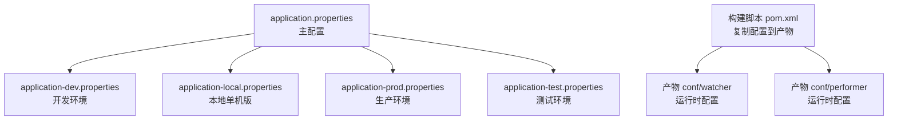
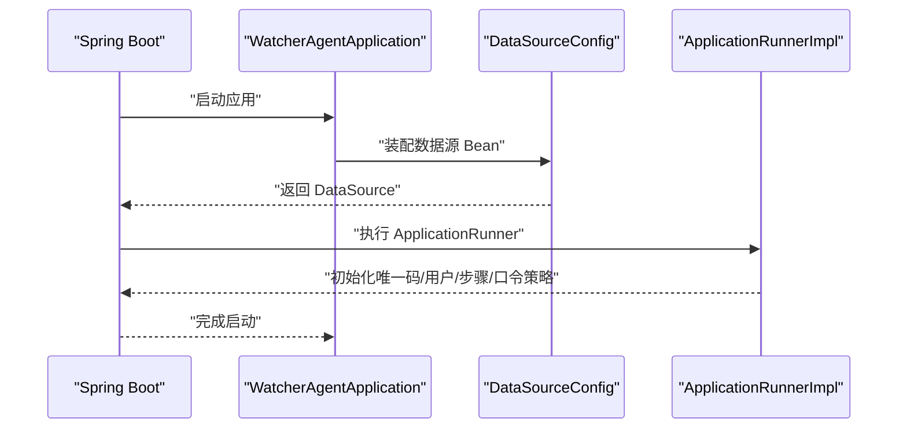
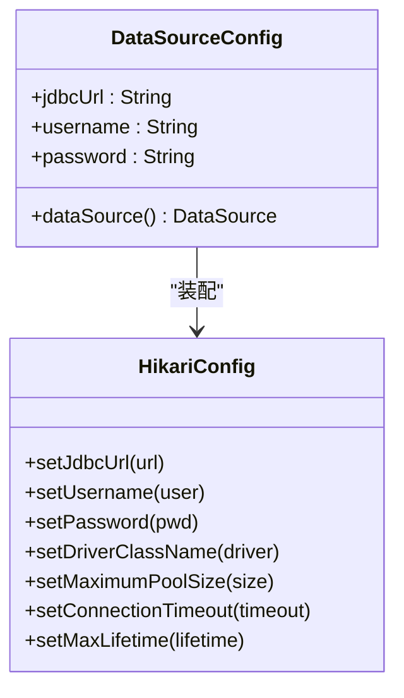
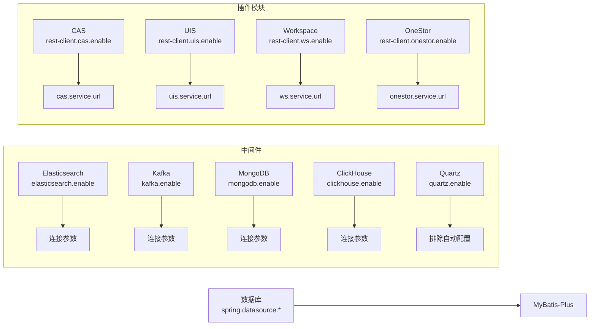

# 核心配置参数

<cite>
**本文引用的文件**
- [application.properties](file://watcher-agent/src/main/resources/application.properties)
- [application-dev.properties](file://watcher-agent/src/main/resources/application-dev.properties)
- [application-local.properties](file://watcher-agent/src/main/resources/application-local.properties)
- [application-prod.properties](file://watcher-agent/src/main/resources/application-prod.properties)
- [application-test.properties](file://watcher-agent/src/main/resources/application-test.properties)
- [DataSourceConfig.java](file://watcher-agent/src/main/java/com/virtual/cloud/om/agent/config/DataSourceConfig.java)
- [ApplicationRunnerImpl.java](file://watcher-agent/src/main/java/com/virtual/cloud/om/agent/config/ApplicationRunnerImpl.java)
- [webConfig.java](file://watcher-agent/src/main/java/com/virtual/cloud/om/agent/filter/webConfig.java)
- [WatcherAgentApplication.java](file://watcher-agent/src/main/java/com/virtual/cloud/om/agent/WatcherAgentApplication.java)
- [pom.xml](file://watcher-builder/pom.xml)
- [startup.sh](file://watcher-builder/assembly/bin/startup.sh)
- [shutdown.sh](file://watcher-builder/assembly/bin/shutdown.sh)
- [status.sh](file://watcher-builder/assembly/bin/status.sh)
</cite>

## 目录
1. [简介](#简介)
2. [项目结构与配置文件定位](#项目结构与配置文件定位)
3. [核心配置参数总览](#核心配置参数总览)
4. [架构概览与配置加载流程](#架构概览与配置加载流程)
5. [详细配置项解析](#详细配置项解析)
6. [依赖关系与模块开关映射](#依赖关系与模块开关映射)
7. [性能与稳定性建议](#性能与稳定性建议)
8. [故障排查与常见问题](#故障排查与常见问题)
9. [结论](#结论)

## 简介
本指南聚焦ShowTime监控系统中“Agent”侧的核心配置参数，围绕以下主题展开：服务器端口与上下文路径、应用名称、中间件开关（Elasticsearch、Kafka、MongoDB、ClickHouse、Quartz）、插件模块开关（CAS、UIS、Workspace、OneStor）、数据库连接与MyBatis-Plus参数、服务地址配置，并给出默认值、可选范围、实际应用场景以及配置优先级与覆盖规则。

## 项目结构与配置文件定位
- 配置文件位于Agent模块resources目录下，按环境拆分，主配置文件为application.properties，另有dev/local/prod/test四套环境配置。
- 构建打包阶段会将对应环境的配置文件复制到产物conf目录，便于部署后直接生效。

**图表来源**
- [application.properties:1-80](file://watcher-agent/src/main/resources/application.properties#L1-L80)
- [application-dev.properties:1-72](file://watcher-agent/src/main/resources/application-dev.properties#L1-L72)
- [application-local.properties:1-61](file://watcher-agent/src/main/resources/application-local.properties#L1-L61)
- [application-prod.properties:1-70](file://watcher-agent/src/main/resources/application-prod.properties#L1-L70)
- [application-test.properties:1-66](file://watcher-agent/src/main/resources/application-test.properties#L1-L66)
- [pom.xml:55-84](file://watcher-builder/pom.xml#L55-L84)

**章节来源**
- [application.properties:1-80](file://watcher-agent/src/main/resources/application.properties#L1-L80)
- [application-dev.properties:1-72](file://watcher-agent/src/main/resources/application-dev.properties#L1-L72)
- [application-local.properties:1-61](file://watcher-agent/src/main/resources/application-local.properties#L1-L61)
- [application-prod.properties:1-70](file://watcher-agent/src/main/resources/application-prod.properties#L1-L70)
- [application-test.properties:1-66](file://watcher-agent/src/main/resources/application-test.properties#L1-L66)
- [pom.xml:55-84](file://watcher-builder/pom.xml#L55-L84)

## 核心配置参数总览
- 服务器端口与上下文路径
  - server.port：HTTP监听端口，默认值见各环境配置；实际使用以当前激活的profile为准。
  - server.servlet.context-path：上下文路径，默认值见各环境配置。
  - spring.application.name：应用名称，默认值见各环境配置。
- 中间件开关
  - elasticsearch.enable、kafka.enable、mongodb.enable、clickhouse.enable、quartz.enable：布尔开关，控制对应中间件功能启用与否。
- 插件模块开关
  - rest-client.cas.enable、rest-client.uis.enable、rest-client.ws.enable、rest-client.onestor.enable：布尔开关，控制插件服务集成。
- 数据库与MyBatis-Plus
  - spring.datasource.*：数据源URL、用户名、密码、驱动类名。
  - MyBatis-Plus：mapper扫描路径、类型别名包、驼峰映射、日志实现等。
- 服务地址配置
  - cas.service.url、uis.service.url、ws.service.url、onestor.service.url：各插件服务访问地址。
- 其他
  - management.*：Actuator暴露与健康检查详情显示。
  - watcher.home：Agent工作根目录（用于存放资源或状态文件）。

**章节来源**
- [application.properties:1-80](file://watcher-agent/src/main/resources/application.properties#L1-L80)
- [application-dev.properties:1-72](file://watcher-agent/src/main/resources/application-dev.properties#L1-L72)
- [application-local.properties:1-61](file://watcher-agent/src/main/resources/application-local.properties#L1-L61)
- [application-prod.properties:1-70](file://watcher-agent/src/main/resources/application-prod.properties#L1-L70)
- [application-test.properties:1-66](file://watcher-agent/src/main/resources/application-test.properties#L1-L66)

## 架构概览与配置加载流程
- 启动入口与组件扫描
  - 应用入口类通过@SpringBootApplication启用调度并扫描多个包，排除Quartz自动配置，避免与自定义任务冲突。
- 配置加载顺序
  - 主配置文件提供默认值与通用开关；具体运行时采用激活的profile覆盖主配置。
  - 构建阶段将对应环境配置复制到产物conf目录，部署后由Agent进程直接读取。
- 关键流程
  - 启动时初始化数据库表与默认账号策略（ApplicationRunnerImpl），随后进入业务处理。
  - 数据源通过DataSourceConfig装配，使用Hikari连接池并设置MariaDB/MySQL兼容参数。

**图表来源**
- [WatcherAgentApplication.java:14-27](file://watcher-agent/src/main/java/com/virtual/cloud/om/agent/WatcherAgentApplication.java#L14-L27)
- [DataSourceConfig.java:18-45](file://watcher-agent/src/main/java/com/virtual/cloud/om/agent/config/DataSourceConfig.java#L18-L45)
- [ApplicationRunnerImpl.java:39-62](file://watcher-agent/src/main/java/com/virtual/cloud/om/agent/config/ApplicationRunnerImpl.java#L39-L62)

**章节来源**
- [WatcherAgentApplication.java:14-27](file://watcher-agent/src/main/java/com/virtual/cloud/om/agent/WatcherAgentApplication.java#L14-L27)
- [DataSourceConfig.java:18-45](file://watcher-agent/src/main/java/com/virtual/cloud/om/agent/config/DataSourceConfig.java#L18-L45)
- [ApplicationRunnerImpl.java:39-62](file://watcher-agent/src/main/java/com/virtual/cloud/om/agent/config/ApplicationRunnerImpl.java#L39-L62)

## 详细配置项解析

### 服务器端口与上下文路径
- server.port
  - 作用：HTTP服务监听端口。
  - 默认值：各环境不同，见对应配置文件。
  - 可选范围：常规端口范围（如1024–65535），需避开系统保留与占用端口。
  - 实际场景：开发环境可设为8888；生产环境按运维规范分配。
- server.servlet.context-path
  - 作用：应用上下文路径，用于多应用共存或反向代理路由。
  - 默认值：各环境不同，常见如“/watcher”。
  - 可选范围：符合URL路径规范的字符串。
  - 实际场景：统一前缀便于网关或反代转发。
- spring.application.name
  - 作用：应用标识，用于注册中心、日志聚合等。
  - 默认值：各环境不同，常见如“watcher-agent”。

**章节来源**
- [application.properties:1-4](file://watcher-agent/src/main/resources/application.properties#L1-L4)
- [application-local.properties:5-8](file://watcher-agent/src/main/resources/application-local.properties#L5-L8)
- [application-dev.properties:1-2](file://watcher-agent/src/main/resources/application-dev.properties#L1-L2)
- [application-prod.properties:1-2](file://watcher-agent/src/main/resources/application-prod.properties#L1-L2)
- [application-test.properties:1-2](file://watcher-agent/src/main/resources/application-test.properties#L1-L2)

### 中间件开关与启用条件
- elasticsearch.enable
  - 作用：是否启用Elasticsearch写入/查询。
  - 默认值：单机版禁用；集群版在相应环境开启。
  - 启用条件：需配合elasticsearch.*相关连接参数（集群名、主机、认证、超时等）。
- kafka.enable
  - 作用：是否启用Kafka消息通道。
  - 默认值：单机版禁用；集群版在相应环境开启。
  - 启用条件：需配置spring.kafka.bootstrap-servers等。
- mongodb.enable
  - 作用：是否启用MongoDB存储。
  - 默认值：单机版禁用；集群版在相应环境开启。
  - 启用条件：需配置spring.data.mongodb.uri等。
- clickhouse.enable
  - 作用：是否启用ClickHouse写入。
  - 默认值：单机版禁用；集群版在相应环境开启。
  - 启用条件：需配置chEndpoint/chUser/chPassword/chDatabase等。
- quartz.enable
  - 作用：是否启用Quartz定时任务。
  - 默认值：单机版禁用；集群版在相应环境开启。
  - 启用条件：需排除Quartz自动配置或自行装配。

注：上述开关在主配置与各环境配置中均有体现，启用时需同时补齐对应连接参数。

**章节来源**
- [application.properties:16-20](file://watcher-agent/src/main/resources/application.properties#L16-L20)
- [application-local.properties:16-20](file://watcher-agent/src/main/resources/application-local.properties#L16-L20)
- [application-dev.properties:3-31](file://watcher-agent/src/main/resources/application-dev.properties#L3-L31)
- [application-prod.properties:7-29](file://watcher-agent/src/main/resources/application-prod.properties#L7-L29)
- [application-test.properties:3-26](file://watcher-agent/src/main/resources/application-test.properties#L3-L26)

### 插件模块开关
- rest-client.cas.enable、rest-client.uis.enable、rest-client.ws.enable、rest-client.onestor.enable
  - 作用：控制是否启用与CAS、UIS、Workspace、OneStor的集成。
  - 默认值：单机版通常禁用；本地版可启用。
  - 启用条件：需配置对应服务地址（cas.service.url、uis.service.url、ws.service.url、onestor.service.url）及端口变量（如UIS_PORT/CAS_PORT等）。

**章节来源**
- [application.properties:25-28](file://watcher-agent/src/main/resources/application.properties#L25-L28)
- [application-local.properties:25-28](file://watcher-agent/src/main/resources/application-local.properties#L25-L28)
- [application-dev.properties:39-63](file://watcher-agent/src/main/resources/application-dev.properties#L39-L63)
- [application-prod.properties:39-63](file://watcher-agent/src/main/resources/application-prod.properties#L39-L63)
- [application-test.properties:34-58](file://watcher-agent/src/main/resources/application-test.properties#L34-L58)

### 数据库连接与MyBatis-Plus
- 数据库连接
  - spring.datasource.url：数据库连接串（MariaDB/MySQL）。
  - spring.datasource.username/password：账户凭据。
  - spring.datasource.driver-class-name：驱动类名（MariaDB或MySQL）。
  - DataSourceConfig：通过Hikari装配数据源，设置连接池大小、超时、时区等参数。
- MyBatis-Plus
  - mybatis-plus.mapper-locations：XML映射文件位置。
  - mybatis-plus.type-aliases-package：实体别名包。
  - mybatis-plus.configuration.map-underscore-to-camel-case：下划线转驼峰。
  - mybatis-plus.configuration.log-impl：日志实现。

**图表来源**
- [DataSourceConfig.java:18-45](file://watcher-agent/src/main/java/com/virtual/cloud/om/agent/config/DataSourceConfig.java#L18-L45)

**章节来源**
- [application.properties:48-58](file://watcher-agent/src/main/resources/application.properties#L48-L58)
- [application-local.properties:33-43](file://watcher-agent/src/main/resources/application-local.properties#L33-L43)
- [DataSourceConfig.java:18-45](file://watcher-agent/src/main/java/com/virtual/cloud/om/agent/config/DataSourceConfig.java#L18-L45)

### 服务地址配置
- cas.service.url、uis.service.url、ws.service.url、onestor.service.url
  - 作用：各插件服务的访问地址。
  - 默认值：本地开发环境示例地址；生产/测试环境按部署调整。
  - 可选范围：合法HTTP(S)地址。
  - 实际场景：与插件服务容器/域名一致，确保Agent可连通。

**章节来源**
- [application.properties:63-70](file://watcher-agent/src/main/resources/application.properties#L63-L70)
- [application-local.properties:47-54](file://watcher-agent/src/main/resources/application-local.properties#L47-L54)
- [application-dev.properties:60-63](file://watcher-agent/src/main/resources/application-dev.properties#L60-L63)
- [application-prod.properties:60-63](file://watcher-agent/src/main/resources/application-prod.properties#L60-L63)
- [application-test.properties:55-58](file://watcher-agent/src/main/resources/application-test.properties#L55-L58)

### 其他关键配置
- Actuator与健康检查
  - management.endpoints.web.exposure.include=*：暴露所有端点。
  - management.endpoint.health.show-details=always：始终展示健康详情。
- 访问拦截与白名单
  - webConfig：登录拦截器对特定路径放行（如Swagger、Kafka、采集接口等）。

**章节来源**
- [application.properties:10-11](file://watcher-agent/src/main/resources/application.properties#L10-L11)
- [application-local.properties:59-60](file://watcher-agent/src/main/resources/application-local.properties#L59-L60)
- [webConfig.java:20-35](file://watcher-agent/src/main/java/com/virtual/cloud/om/agent/filter/webConfig.java#L20-L35)

## 依赖关系与模块开关映射
- 中间件依赖
  - Elasticsearch/Kafka/MongoDB/ClickHouse：受各自enable开关控制；启用时需补齐连接参数。
  - Quartz：受enable开关控制；应用已排除自动配置，避免重复。
- 插件依赖
  - CAS/UIS/Workspace/OneStor：受对应enable开关控制；启用时需配置服务地址与端口变量。
- 数据依赖
  - 数据库：DataSourceConfig装配Hikari；MyBatis-Plus负责ORM映射。

**图表来源**
- [application.properties:16-28](file://watcher-agent/src/main/resources/application.properties#L16-L28)
- [application-local.properties:16-28](file://watcher-agent/src/main/resources/application-local.properties#L16-L28)
- [application-dev.properties:3-63](file://watcher-agent/src/main/resources/application-dev.properties#L3-L63)
- [application-prod.properties:7-63](file://watcher-agent/src/main/resources/application-prod.properties#L7-L63)
- [application-test.properties:3-58](file://watcher-agent/src/main/resources/application-test.properties#L3-L58)
- [WatcherAgentApplication.java:14-16](file://watcher-agent/src/main/java/com/virtual/cloud/om/agent/WatcherAgentApplication.java#L14-L16)
- [DataSourceConfig.java:18-45](file://watcher-agent/src/main/java/com/virtual/cloud/om/agent/config/DataSourceConfig.java#L18-L45)

**章节来源**
- [application.properties:16-28](file://watcher-agent/src/main/resources/application.properties#L16-L28)
- [application-local.properties:16-28](file://watcher-agent/src/main/resources/application-local.properties#L16-L28)
- [application-dev.properties:3-63](file://watcher-agent/src/main/resources/application-dev.properties#L3-L63)
- [application-prod.properties:7-63](file://watcher-agent/src/main/resources/application-prod.properties#L7-L63)
- [application-test.properties:3-58](file://watcher-agent/src/main/resources/application-test.properties#L3-L58)
- [WatcherAgentApplication.java:14-16](file://watcher-agent/src/main/java/com/virtual/cloud/om/agent/WatcherAgentApplication.java#L14-L16)
- [DataSourceConfig.java:18-45](file://watcher-agent/src/main/java/com/virtual/cloud/om/agent/config/DataSourceConfig.java#L18-L45)

## 性能与稳定性建议
- 连接池与超时
  - 建议结合流量与中间件能力调优Hikari连接池参数（最大池大小、空闲超时、最大生命周期）。
- 中间件启用策略
  - 在单机版或低负载场景禁用非必要中间件，减少资源消耗。
  - 集群版按需启用并配置高可用参数（如Kafka多Broker、ES集群、Mongo副本集）。
- 插件服务地址
  - 将插件服务部署在内网或就近机房，降低网络抖动与延迟。
- Actuator与安全
  - 在生产环境限制Actuator端点暴露范围，仅开放必要端点并配合鉴权。

[本节为通用建议，无需特定文件引用]

## 故障排查与常见问题
- 启动失败或无法连接数据库
  - 检查spring.datasource.*配置与网络连通性；确认驱动类名与数据库版本兼容。
  - 若使用MariaDB，请确保连接串与Hikari参数匹配。
- 中间件不可用
  - 确认对应enable开关已开启且连接参数完整；核对网络、认证与防火墙。
- 插件服务404/503
  - 检查服务地址配置与端口变量是否正确；确认插件服务已启动并可被Agent访问。
- Actuator端点不可见
  - 确认management.endpoints.web.exposure.include已正确配置。
- 进程状态与控制
  - 使用构建产物提供的startup.sh/shutdown.sh/status.sh进行启停与状态查询。

**章节来源**
- [DataSourceConfig.java:30-44](file://watcher-agent/src/main/java/com/virtual/cloud/om/agent/config/DataSourceConfig.java#L30-L44)
- [application.properties:48-58](file://watcher-agent/src/main/resources/application.properties#L48-L58)
- [application-dev.properties:3-63](file://watcher-agent/src/main/resources/application-dev.properties#L3-L63)
- [application-prod.properties:7-63](file://watcher-agent/src/main/resources/application-prod.properties#L7-L63)
- [application-test.properties:3-58](file://watcher-agent/src/main/resources/application-test.properties#L3-L58)
- [startup.sh](file://watcher-builder/assembly/bin/startup.sh)
- [shutdown.sh](file://watcher-builder/assembly/bin/shutdown.sh)
- [status.sh](file://watcher-builder/assembly/bin/status.sh)

## 结论
- ShowTime Agent的核心配置以application.properties为主，按环境拆分的配置文件提供差异化覆盖。
- 中间件与插件模块均通过布尔开关控制，启用时需同步补齐连接参数与服务地址。
- 数据库与MyBatis-Plus配置清晰明确，结合Hikari连接池可满足大多数场景的性能与稳定性需求。
- 建议在生产环境严格控制中间件与插件启用范围，按需配置连接参数与端点暴露策略。