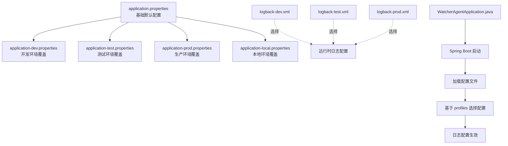
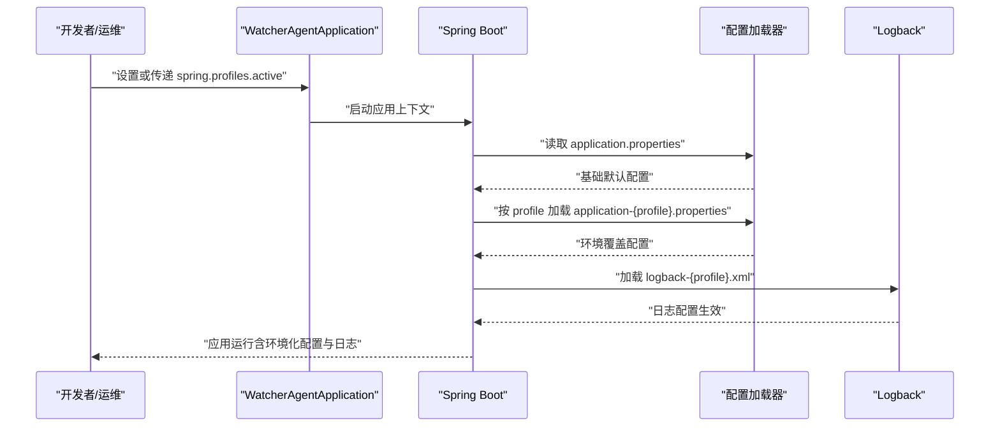

# 环境管理

<cite>
**本文引用的文件**
- [application.properties](file://watcher-agent/src/main/resources/application.properties)
- [application-dev.properties](file://watcher-agent/src/main/resources/application-dev.properties)
- [application-test.properties](file://watcher-agent/src/main/resources/application-test.properties)
- [application-prod.properties](file://watcher-agent/src/main/resources/application-prod.properties)
- [application-local.properties](file://watcher-agent/src/main/resources/application-local.properties)
- [logback-dev.xml](file://watcher-agent/src/main/resources/logback-dev.xml)
- [logback-test.xml](file://watcher-agent/src/main/resources/logback-test.xml)
- [logback-prod.xml](file://watcher-agent/src/main/resources/logback-prod.xml)
- [WatcherAgentApplication.java](file://watcher-agent/src/main/java/com/virtual/cloud/om/agent/WatcherAgentApplication.java)
- [pom.xml](file://watcher-agent/pom.xml)
- [pipeline.groovy](file://pipeline.groovy)
</cite>

## 目录
1. [简介](#简介)
2. [项目结构](#项目结构)
3. [核心组件](#核心组件)
4. [架构总览](#架构总览)
5. [详细组件分析](#详细组件分析)
6. [依赖分析](#依赖分析)
7. [性能考虑](#性能考虑)
8. [故障排查指南](#故障排查指南)
9. [结论](#结论)
10. [附录](#附录)

## 简介
本指南面向ShowTime监控系统的环境管理，聚焦于开发（dev）、测试（test）、生产（prod）与本地（local）四类环境的配置差异与最佳实践。内容涵盖：
- 基于Spring Profiles的环境切换机制与spring.profiles.active属性使用
- 不同环境的日志配置（logback配置文件选择与日志级别）
- 环境特定的数据库连接、中间件与服务地址配置
- 安全相关配置要点与隔离策略
- 环境切换验证方法与常见问题处理

## 项目结构
围绕“watcher-agent”模块，环境配置主要分布在以下位置：
- 应用配置：application.properties（基础默认）与application-{profile}.properties（各环境覆盖）
- 日志配置：logback-{profile}.xml（按环境选择）
- 启动入口：WatcherAgentApplication.java（Spring Boot启动类）
- 构建与打包：pom.xml（资源与插件配置）
- 持续交付：pipeline.groovy（CI/CD流程）

图表来源
- [application.properties:1-80](file://watcher-agent/src/main/resources/application.properties#L1-L80)
- [application-dev.properties:1-72](file://watcher-agent/src/main/resources/application-dev.properties#L1-L72)
- [application-test.properties:1-66](file://watcher-agent/src/main/resources/application-test.properties#L1-L66)
- [application-prod.properties:1-70](file://watcher-agent/src/main/resources/application-prod.properties#L1-L70)
- [application-local.properties:1-61](file://watcher-agent/src/main/resources/application-local.properties#L1-L61)
- [logback-dev.xml:1-44](file://watcher-agent/src/main/resources/logback-dev.xml#L1-L44)
- [logback-test.xml:1-45](file://watcher-agent/src/main/resources/logback-test.xml#L1-L45)
- [logback-prod.xml:1-35](file://watcher-agent/src/main/resources/logback-prod.xml#L1-L35)
- [WatcherAgentApplication.java:1-30](file://watcher-agent/src/main/java/com/virtual/cloud/om/agent/WatcherAgentApplication.java#L1-L30)

章节来源
- [application.properties:1-80](file://watcher-agent/src/main/resources/application.properties#L1-L80)
- [WatcherAgentApplication.java:1-30](file://watcher-agent/src/main/java/com/virtual/cloud/om/agent/WatcherAgentApplication.java#L1-L30)

## 核心组件
- 配置文件层次
  - 默认配置：集中定义基础属性与默认行为
  - 环境覆盖：各profile文件覆盖默认配置，体现环境差异
- 日志配置
  - 通过logback-{profile}.xml在不同环境选择不同的输出策略与根日志级别
- 启动与构建
  - Spring Boot启动类负责应用上下文初始化
  - Maven构建插件负责资源复制与打包

章节来源
- [application.properties:1-80](file://watcher-agent/src/main/resources/application.properties#L1-L80)
- [application-dev.properties:1-72](file://watcher-agent/src/main/resources/application-dev.properties#L1-L72)
- [application-test.properties:1-66](file://watcher-agent/src/main/resources/application-test.properties#L1-L66)
- [application-prod.properties:1-70](file://watcher-agent/src/main/resources/application-prod.properties#L1-L70)
- [application-local.properties:1-61](file://watcher-agent/src/main/resources/application-local.properties#L1-L61)
- [logback-dev.xml:1-44](file://watcher-agent/src/main/resources/logback-dev.xml#L1-L44)
- [logback-test.xml:1-45](file://watcher-agent/src/main/resources/logback-test.xml#L1-L45)
- [logback-prod.xml:1-35](file://watcher-agent/src/main/resources/logback-prod.xml#L1-L35)
- [WatcherAgentApplication.java:1-30](file://watcher-agent/src/main/java/com/virtual/cloud/om/agent/WatcherAgentApplication.java#L1-L30)
- [pom.xml:138-195](file://watcher-agent/pom.xml#L138-L195)

## 架构总览
下图展示了从启动到配置加载的关键流程，以及环境选择对配置与日志的影响。

图表来源
- [WatcherAgentApplication.java:24-27](file://watcher-agent/src/main/java/com/virtual/cloud/om/agent/WatcherAgentApplication.java#L24-L27)
- [application.properties:1-80](file://watcher-agent/src/main/resources/application.properties#L1-L80)
- [application-dev.properties:1-72](file://watcher-agent/src/main/resources/application-dev.properties#L1-L72)
- [application-test.properties:1-66](file://watcher-agent/src/main/resources/application-test.properties#L1-L66)
- [application-prod.properties:1-70](file://watcher-agent/src/main/resources/application-prod.properties#L1-L70)
- [logback-dev.xml:1-44](file://watcher-agent/src/main/resources/logback-dev.xml#L1-L44)
- [logback-test.xml:1-45](file://watcher-agent/src/main/resources/logback-test.xml#L1-L45)
- [logback-prod.xml:1-35](file://watcher-agent/src/main/resources/logback-prod.xml#L1-L35)

## 详细组件分析

### 环境切换与spring.profiles.active
- 默认激活环境
  - 在基础配置中设置了默认激活的profile，确保在未显式指定时也能正确加载对应配置
- 激活方式
  - 可通过JVM参数、环境变量或容器启动参数传入spring.profiles.active
  - 启动类本身不强制覆盖该属性，具体以运行时传参为准
- profile优先级
  - application-{profile}.properties会覆盖application.properties中的同名键

章节来源
- [application.properties:2-2](file://watcher-agent/src/main/resources/application.properties#L2-L2)
- [WatcherAgentApplication.java:24-27](file://watcher-agent/src/main/java/com/virtual/cloud/om/agent/WatcherAgentApplication.java#L24-L27)

### 开发环境（dev）
- 特点
  - 连接外部中间件（如MongoDB、Kafka、Elasticsearch），便于联调
  - 开启部分REST客户端开关，便于对接上游服务
  - 提供ClickHouse等可选存储配置
- 关键差异
  - 中间件地址与认证信息指向开发集群
  - 批量采集日志根路径等开发期专用参数
- 日志
  - 使用logback-dev.xml，根日志级别为INFO，并同时输出至控制台与文件

章节来源
- [application-dev.properties:1-72](file://watcher-agent/src/main/resources/application-dev.properties#L1-L72)
- [logback-dev.xml:1-44](file://watcher-agent/src/main/resources/logback-dev.xml#L1-L44)

### 测试环境（test）
- 特点
  - 连接测试集群的中间件与服务
  - 保留与上游服务对接能力，便于集成测试
- 关键差异
  - 中间件与服务地址指向测试集群
  - ClickHouse等可选存储配置
- 日志
  - 使用logback-test.xml，根日志级别为INFO，输出至文件与控制台

章节来源
- [application-test.properties:1-66](file://watcher-agent/src/main/resources/application-test.properties#L1-L66)
- [logback-test.xml:1-45](file://watcher-agent/src/main/resources/logback-test.xml#L1-L45)

### 生产环境（prod）
- 特点
  - 连接生产集群的中间件与服务，强调高可用与安全
  - 生产专用的中间件地址与认证信息
- 关键差异
  - Kafka多Broker配置提升可用性
  - Elasticsearch等中间件生产级参数
- 日志
  - 使用logback-prod.xml，根日志级别为INFO，仅输出至文件（不打印到控制台）

章节来源
- [application-prod.properties:1-70](file://watcher-agent/src/main/resources/application-prod.properties#L1-L70)
- [logback-prod.xml:1-35](file://watcher-agent/src/main/resources/logback-prod.xml#L1-L35)

### 本地环境（local）
- 特点
  - 适用于单机MySQL与禁用中间件的快速开发与调试
  - 默认禁用多种中间件与定时任务，降低启动复杂度
- 关键差异
  - 数据源指向本地MySQL
  - REST客户端开关按需开启
  - Actuator端点暴露，便于本地观测
- 日志
  - 本地环境未提供独立logback配置文件，通常沿用默认或通过其他方式覆盖

章节来源
- [application-local.properties:1-61](file://watcher-agent/src/main/resources/application-local.properties#L1-L61)

### 日志配置差异（logback）
- 文件选择
  - 运行时由spring.profiles.active决定加载logback-{profile}.xml
- 输出策略
  - dev/test：同时输出到文件与控制台，便于开发调试
  - prod：仅输出到文件，减少控制台噪声
- 滚动策略
  - 统一采用按大小与时间滚动，限制单文件大小与总容量，避免磁盘占用过大

章节来源
- [logback-dev.xml:1-44](file://watcher-agent/src/main/resources/logback-dev.xml#L1-L44)
- [logback-test.xml:1-45](file://watcher-agent/src/main/resources/logback-test.xml#L1-L45)
- [logback-prod.xml:1-35](file://watcher-agent/src/main/resources/logback-prod.xml#L1-L35)

### 数据库与中间件配置
- 数据库
  - local：本地MySQL（单机）
  - dev/test/prod：外部中间件（MongoDB、Kafka、Elasticsearch等）按环境配置
- 中间件
  - dev/test：单机或小集群
  - prod：多节点、高可用配置
- 服务地址
  - 各环境的服务URL与端口在对应application-{profile}.properties中配置

章节来源
- [application-local.properties:31-60](file://watcher-agent/src/main/resources/application-local.properties#L31-L60)
- [application-dev.properties:3-72](file://watcher-agent/src/main/resources/application-dev.properties#L3-L72)
- [application-test.properties:3-66](file://watcher-agent/src/main/resources/application-test.properties#L3-L66)
- [application-prod.properties:3-70](file://watcher-agent/src/main/resources/application-prod.properties#L3-L70)

### 安全配置要点
- 认证与授权
  - 各环境提供内部管理员账户示例，建议在生产环境替换为强口令与密钥管理
- 端点暴露
  - 本地环境默认开启Actuator端点，生产环境应谨慎开放并配合鉴权
- 传输安全
  - 建议在生产环境启用HTTPS与TLS，避免明文传输

章节来源
- [application-local.properties:57-61](file://watcher-agent/src/main/resources/application-local.properties#L57-L61)
- [application-dev.properties:37-72](file://watcher-agent/src/main/resources/application-dev.properties#L37-L72)
- [application-test.properties:31-66](file://watcher-agent/src/main/resources/application-test.properties#L31-L66)
- [application-prod.properties:37-70](file://watcher-agent/src/main/resources/application-prod.properties#L37-L70)

### 环境隔离与配置同步策略
- 隔离原则
  - 不同环境使用独立的中间件与服务地址，避免跨环境污染
  - 生产环境严格区分凭据与证书，禁止硬编码敏感信息
- 同步策略
  - 将非敏感配置纳入版本管理，敏感配置通过密钥管理或环境变量注入
  - CI/CD流水线中按环境注入spring.profiles.active与必要环境变量

章节来源
- [pipeline.groovy:1-72](file://pipeline.groovy#L1-L72)

## 依赖分析
- 启动类依赖
  - WatcherAgentApplication作为Spring Boot入口，负责应用上下文初始化
- 构建与资源
  - Maven插件负责资源复制与打包，确保运行时资源配置完整

图表来源
- [WatcherAgentApplication.java:1-30](file://watcher-agent/src/main/java/com/virtual/cloud/om/agent/WatcherAgentApplication.java#L1-L30)
- [application.properties:1-80](file://watcher-agent/src/main/resources/application.properties#L1-L80)
- [application-dev.properties:1-72](file://watcher-agent/src/main/resources/application-dev.properties#L1-L72)
- [application-test.properties:1-66](file://watcher-agent/src/main/resources/application-test.properties#L1-L66)
- [application-prod.properties:1-70](file://watcher-agent/src/main/resources/application-prod.properties#L1-L70)
- [logback-dev.xml:1-44](file://watcher-agent/src/main/resources/logback-dev.xml#L1-L44)
- [logback-test.xml:1-45](file://watcher-agent/src/main/resources/logback-test.xml#L1-L45)
- [logback-prod.xml:1-35](file://watcher-agent/src/main/resources/logback-prod.xml#L1-L35)

章节来源
- [WatcherAgentApplication.java:1-30](file://watcher-agent/src/main/java/com/virtual/cloud/om/agent/WatcherAgentApplication.java#L1-L30)
- [pom.xml:138-195](file://watcher-agent/pom.xml#L138-L195)

## 性能考虑
- 日志滚动策略
  - 控制单文件大小与总容量，避免I/O压力与磁盘空间不足
- 中间件连接池
  - 合理配置连接超时与最大连接数，避免在高负载下成为瓶颈
- 启动优化
  - 在开发环境禁用不必要的中间件与定时任务，缩短启动时间

## 故障排查指南
- 环境未生效
  - 检查是否正确设置spring.profiles.active（JVM参数、环境变量或容器启动参数）
  - 确认application-{profile}.properties存在且命名规范一致
- 日志异常
  - 检查当前profile对应的logback-{profile}.xml是否存在
  - 确认日志目录权限与磁盘空间充足
- 中间件连接失败
  - 核对application-{profile}.properties中的中间件地址与认证信息
  - 在开发/测试环境确认网络连通性与防火墙策略
- 生产环境端点泄露
  - 审核Actuator端点暴露范围，结合鉴权与白名单策略

章节来源
- [application.properties:1-80](file://watcher-agent/src/main/resources/application.properties#L1-L80)
- [logback-dev.xml:1-44](file://watcher-agent/src/main/resources/logback-dev.xml#L1-L44)
- [logback-test.xml:1-45](file://watcher-agent/src/main/resources/logback-test.xml#L1-L45)
- [logback-prod.xml:1-35](file://watcher-agent/src/main/resources/logback-prod.xml#L1-L35)
- [application-dev.properties:1-72](file://watcher-agent/src/main/resources/application-dev.properties#L1-L72)
- [application-test.properties:1-66](file://watcher-agent/src/main/resources/application-test.properties#L1-L66)
- [application-prod.properties:1-70](file://watcher-agent/src/main/resources/application-prod.properties#L1-L70)

## 结论
通过Spring Profiles与分环境配置文件，ShowTime监控系统实现了清晰的环境隔离与灵活的配置切换。结合logback按环境选择的日志策略、严格的中间件与服务地址分离，以及CI/CD流程中的环境注入，能够有效保障开发、测试与生产的稳定性与安全性。建议在生产环境中进一步强化凭据管理与端点访问控制，并持续完善配置同步与变更审计机制。

## 附录
- 环境切换最佳实践
  - 显式设置spring.profiles.active，避免默认回退
  - 使用环境变量或密钥管理工具注入敏感配置
  - 在CI/CD中按环境传递参数，统一构建与发布流程
- 常见问题速查
  - profile文件命名错误：确保与spring.profiles.active一致
  - 日志目录不可写：检查权限与磁盘空间
  - 中间件地址错误：核对application-{profile}.properties中的配置项