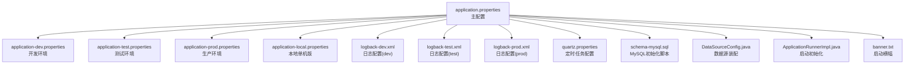
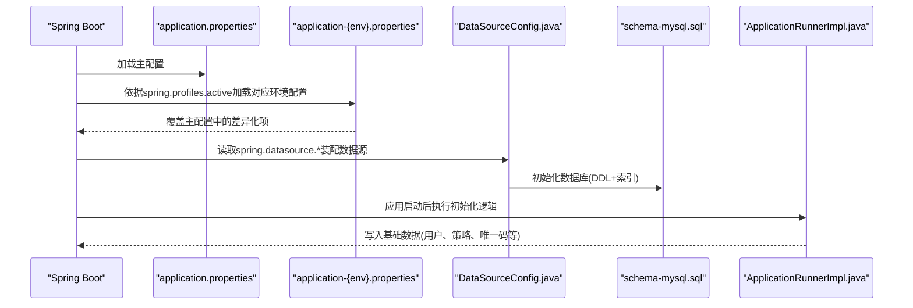
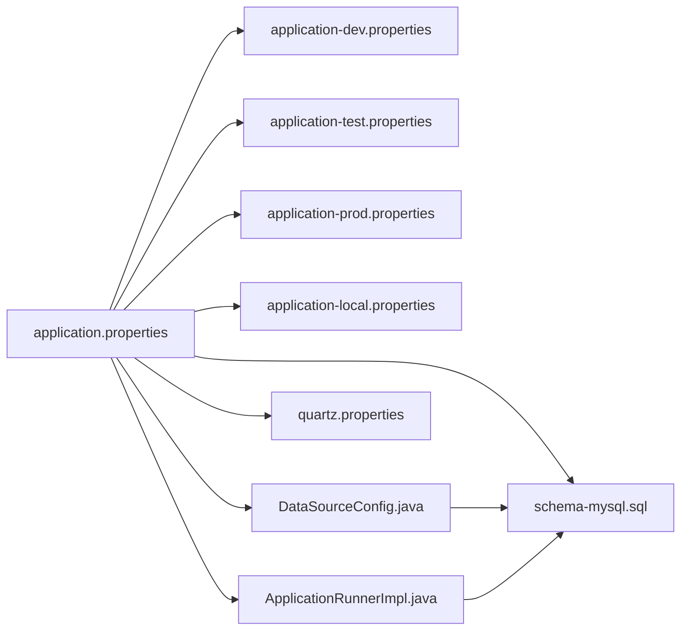

# 配置文件结构

<cite>
**本文引用的文件**
- [application.properties](file://watcher-agent/src/main/resources/application.properties)
- [application-dev.properties](file://watcher-agent/src/main/resources/application-dev.properties)
- [application-test.properties](file://watcher-agent/src/main/resources/application-test.properties)
- [application-prod.properties](file://watcher-agent/src/main/resources/application-prod.properties)
- [application-local.properties](file://watcher-agent/src/main/resources/application-local.properties)
- [logback-dev.xml](file://watcher-agent/src/main/resources/logback-dev.xml)
- [logback-test.xml](file://watcher-agent/src/main/resources/logback-test.xml)
- [logback-prod.xml](file://watcher-agent/src/main/resources/logback-prod.xml)
- [quartz.properties](file://watcher-agent/src/main/resources/quartz.properties)
- [schema-mysql.sql](file://watcher-agent/src/main/resources/schema-mysql.sql)
- [DataSourceConfig.java](file://watcher-agent/src/main/java/com/virtual/cloud/om/agent/config/DataSourceConfig.java)
- [ApplicationRunnerImpl.java](file://watcher-agent/src/main/java/com/virtual/cloud/om/agent/config/ApplicationRunnerImpl.java)
- [banner.txt](file://watcher-agent/src/main/resources/banner.txt)
</cite>

## 目录
1. [简介](#简介)
2. [项目结构](#项目结构)
3. [核心组件](#核心组件)
4. [架构总览](#架构总览)
5. [详细组件分析](#详细组件分析)
6. [依赖分析](#依赖分析)
7. [性能考虑](#性能考虑)
8. [故障排查指南](#故障排查指南)
9. [结论](#结论)
10. [附录](#附录)

## 简介
本文件面向ShowTime监控系统中的“Agent”子模块，系统性梳理其配置文件结构与使用方式，重点覆盖：
- 主配置文件application.properties的组织与层次关系
- 中间件开关、插件模块开关、数据源配置等关键段落
- 多环境配置文件（dev、test、prod、local）的差异与用途
- 通过spring.profiles.active进行环境切换的方法
- 配置最佳实践、命名规范、注释规范
- 配置验证方法与常见错误排查技巧

## 项目结构
Agent模块的配置相关文件主要位于resources目录下，采用“主配置 + 多环境配置 + 日志配置 + 定时任务配置 + 数据库初始化脚本”的分层组织方式。

图表来源
- [application.properties:1-80](file://watcher-agent/src/main/resources/application.properties#L1-L80)
- [application-dev.properties:1-72](file://watcher-agent/src/main/resources/application-dev.properties#L1-L72)
- [application-test.properties:1-66](file://watcher-agent/src/main/resources/application-test.properties#L1-L66)
- [application-prod.properties:1-70](file://watcher-agent/src/main/resources/application-prod.properties#L1-L70)
- [application-local.properties:1-61](file://watcher-agent/src/main/resources/application-local.properties#L1-L61)
- [logback-dev.xml:1-44](file://watcher-agent/src/main/resources/logback-dev.xml#L1-L44)
- [logback-test.xml:1-45](file://watcher-agent/src/main/resources/logback-test.xml#L1-L45)
- [logback-prod.xml:1-35](file://watcher-agent/src/main/resources/logback-prod.xml#L1-L35)
- [quartz.properties:1-45](file://watcher-agent/src/main/resources/quartz.properties#L1-L45)
- [schema-mysql.sql:1-204](file://watcher-agent/src/main/resources/schema-mysql.sql#L1-L204)
- [DataSourceConfig.java:1-47](file://watcher-agent/src/main/java/com/virtual/cloud/om/agent/config/DataSourceConfig.java#L1-L47)
- [ApplicationRunnerImpl.java:1-121](file://watcher-agent/src/main/java/com/virtual/cloud/om/agent/config/ApplicationRunnerImpl.java#L1-L121)
- [banner.txt:1-7](file://watcher-agent/src/main/resources/banner.txt#L1-L7)

章节来源
- [application.properties:1-80](file://watcher-agent/src/main/resources/application.properties#L1-L80)
- [application-dev.properties:1-72](file://watcher-agent/src/main/resources/application-dev.properties#L1-L72)
- [application-test.properties:1-66](file://watcher-agent/src/main/resources/application-test.properties#L1-L66)
- [application-prod.properties:1-70](file://watcher-agent/src/main/resources/application-prod.properties#L1-L70)
- [application-local.properties:1-61](file://watcher-agent/src/main/resources/application-local.properties#L1-L61)

## 核心组件
- 主配置文件：集中定义服务器端口、上下文路径、应用名、Spring特性、管理端点、中间件与插件开关、数据源、MyBatis-Plus、插件服务地址、系统参数等。
- 多环境配置文件：按环境覆盖主配置中的敏感或差异化项，如数据库连接、中间件地址、插件开关、日志与超时参数等。
- 日志配置：基于Logback的XML配置，区分开发/测试/生产三套策略，控制滚动策略、输出格式与级别。
- 定时任务配置：Quartz属性文件，定义线程池大小、JobStore实现与集群参数等。
- 数据库初始化：MySQL建表与索引初始化脚本，配合数据源与MyBatis-Plus使用。
- 数据源装配：通过Java配置类读取主配置中的数据源属性，构建HikariCP连接池。
- 启动初始化：应用启动后执行的初始化逻辑，确保基础数据存在。

章节来源
- [application.properties:1-80](file://watcher-agent/src/main/resources/application.properties#L1-L80)
- [logback-dev.xml:1-44](file://watcher-agent/src/main/resources/logback-dev.xml#L1-L44)
- [logback-test.xml:1-45](file://watcher-agent/src/main/resources/logback-test.xml#L1-L45)
- [logback-prod.xml:1-35](file://watcher-agent/src/main/resources/logback-prod.xml#L1-L35)
- [quartz.properties:1-45](file://watcher-agent/src/main/resources/quartz.properties#L1-L45)
- [schema-mysql.sql:1-204](file://watcher-agent/src/main/resources/schema-mysql.sql#L1-L204)
- [DataSourceConfig.java:1-47](file://watcher-agent/src/main/java/com/virtual/cloud/om/agent/config/DataSourceConfig.java#L1-L47)
- [ApplicationRunnerImpl.java:1-121](file://watcher-agent/src/main/java/com/virtual/cloud/om/agent/config/ApplicationRunnerImpl.java#L1-L121)

## 架构总览
下图展示配置文件在启动阶段的加载顺序与生效范围，以及与运行期组件的交互。

图表来源
- [application.properties:1-80](file://watcher-agent/src/main/resources/application.properties#L1-L80)
- [application-dev.properties:1-72](file://watcher-agent/src/main/resources/application-dev.properties#L1-L72)
- [application-test.properties:1-66](file://watcher-agent/src/main/resources/application-test.properties#L1-L66)
- [application-prod.properties:1-70](file://watcher-agent/src/main/resources/application-prod.properties#L1-L70)
- [application-local.properties:1-61](file://watcher-agent/src/main/resources/application-local.properties#L1-L61)
- [DataSourceConfig.java:1-47](file://watcher-agent/src/main/java/com/virtual/cloud/om/agent/config/DataSourceConfig.java#L1-L47)
- [schema-mysql.sql:1-204](file://watcher-agent/src/main/resources/schema-mysql.sql#L1-L204)
- [ApplicationRunnerImpl.java:1-121](file://watcher-agent/src/main/java/com/virtual/cloud/om/agent/config/ApplicationRunnerImpl.java#L1-L121)

## 详细组件分析

### 主配置文件 application.properties 的组织与层次
- 服务器与应用元信息
  - 服务器端口、上下文路径、应用名、循环依赖允许等
- 管理端点
  - 暴露所有Actuator端点，健康检查显示详细信息
- 中间件开关（默认全部禁用）
  - Elasticsearch、Kafka、MongoDB、ClickHouse、Quartz
- 插件模块开关（默认全部禁用）
  - CAS、UIS、Workspace、OneStor客户端
- 插件服务地址（占位，避免启动失败）
  - CAS、UIS、Workspace、OneStor服务URL
- 系统参数
  - watcher.home、who.are.you、批处理日志目录名等
- 数据源与ORM
  - JDBC URL、用户名、密码、驱动类名
  - MyBatis-Plus映射路径、实体包、驼峰映射、日志实现、Mapper扫描包

章节来源
- [application.properties:1-80](file://watcher-agent/src/main/resources/application.properties#L1-L80)

### 环境配置文件差异与用途
- dev（开发环境）
  - MongoDB、Kafka、Elasticsearch、ClickHouse等中间件连接信息
  - 插件开关与端口变量（UIS、CAS、OneStor）
  - 批量采集日志根路径
- test（测试环境）
  - 中间件连接信息与超时参数
  - 插件开关与端口变量
  - 批量采集日志根路径
- prod（生产环境）
  - 中间件连接信息与超时参数
  - 插件开关与端口变量
  - 批量采集日志根路径
- local（本地单机版）
  - MySQL单机版数据源（MySQL驱动）
  - 插件模块全部启用
  - 管理端点开放

章节来源
- [application-dev.properties:1-72](file://watcher-agent/src/main/resources/application-dev.properties#L1-L72)
- [application-test.properties:1-66](file://watcher-agent/src/main/resources/application-test.properties#L1-L66)
- [application-prod.properties:1-70](file://watcher-agent/src/main/resources/application-prod.properties#L1-L70)
- [application-local.properties:1-61](file://watcher-agent/src/main/resources/application-local.properties#L1-L61)

### 环境切换机制
- 通过spring.profiles.active指定当前环境
- 启动时由Spring加载对应application-{env}.properties
- 若未显式设置，默认使用local

章节来源
- [application.properties:2-2](file://watcher-agent/src/main/resources/application.properties#L2-L2)

### 日志配置（Logback）
- 开发/测试/生产三套配置
- 控制台与文件双通道输出
- 滚动策略：按日期与大小分割，保留历史数量与总容量上限
- 关键日志器抑制（如Quartz）

章节来源
- [logback-dev.xml:1-44](file://watcher-agent/src/main/resources/logback-dev.xml#L1-L44)
- [logback-test.xml:1-45](file://watcher-agent/src/main/resources/logback-test.xml#L1-L45)
- [logback-prod.xml:1-35](file://watcher-agent/src/main/resources/logback-prod.xml#L1-L35)

### 定时任务配置（Quartz）
- 线程池大小
- JobStore实现（支持MongoDB存储）
- 集群模式参数
- 可扩展自定义数据源与表前缀

章节来源
- [quartz.properties:1-45](file://watcher-agent/src/main/resources/quartz.properties#L1-L45)

### 数据库初始化与数据源装配
- schema-mysql.sql
  - 创建数据库与多个业务表（用户、密码策略、Agent唯一码、部署、参数、任务、操作日志、数据中心配置、告警、资源、指标数据）
  - 建立常用索引，便于查询
- DataSourceConfig.java
  - 从主配置读取JDBC URL、用户名、密码
  - 使用MariaDB驱动与HikariCP连接池
  - 设置连接池大小、超时、生命周期等参数
  - 配置MariaDB连接属性（SSL、公钥检索、时区）

章节来源
- [schema-mysql.sql:1-204](file://watcher-agent/src/main/resources/schema-mysql.sql#L1-L204)
- [DataSourceConfig.java:1-47](file://watcher-agent/src/main/java/com/virtual/cloud/om/agent/config/DataSourceConfig.java#L1-L47)

### 启动初始化（ApplicationRunnerImpl）
- 在应用启动后执行
- 初始化Agent唯一码、系统用户、步骤状态、密码策略
- 保证首次安装与升级后的基础数据一致性

章节来源
- [ApplicationRunnerImpl.java:1-121](file://watcher-agent/src/main/java/com/virtual/cloud/om/agent/config/ApplicationRunnerImpl.java#L1-L121)

### 配置项分类与命名规范建议
- 分类组织
  - 服务器与应用元信息
  - 管理端点
  - 中间件开关
  - 插件模块开关
  - 插件服务地址
  - 数据源与ORM
  - 批量采集日志路径
  - 系统参数
- 命名规范
  - 使用点号分隔层级，语义清晰
  - 敏感信息使用环境变量或外部密文
  - 不同环境使用application-{env}.properties覆盖差异化项
  - 注释简洁明确，避免冗余

### 配置验证方法
- 启动验证
  - 观察banner与日志输出，确认加载的profile与关键配置
  - 访问管理端点（如/actuator/health）查看健康状态
- 数据源验证
  - 确认数据库可连通，表结构与索引已初始化
- 插件连通性验证
  - 通过服务地址访问插件接口，验证鉴权与网络连通
- 日志验证
  - 检查日志滚动策略与输出级别，定位异常

### 常见配置错误与排查技巧
- 环境未正确切换
  - 症状：加载了错误的application-{env}.properties
  - 排查：检查spring.profiles.active是否设置正确；确认文件命名与内容一致
- 数据源无法连接
  - 症状：启动报错或数据库初始化失败
  - 排查：核对JDBC URL、用户名、密码；确认驱动类名与数据库版本兼容；检查连接池参数
- 插件鉴权失败
  - 症状：调用插件接口返回鉴权错误
  - 排查：核对插件服务地址、端口与凭据；确认插件模块开关已启用
- 日志不输出或过大
  - 症状：无日志或磁盘占用过高
  - 排查：核对Logback配置、滚动策略与输出级别；调整日志路径与容量限制
- Quartz集群冲突
  - 症状：任务重复执行或锁冲突
  - 排查：确认集群参数与JobStore实现；检查MongoDB连接与表前缀

## 依赖分析
- 配置依赖
  - application.properties为基线，各环境配置文件按需覆盖
  - DataSourceConfig.java依赖spring.datasource.*属性
  - ApplicationRunnerImpl依赖数据库初始化脚本与Mapper
- 组件耦合
  - 配置文件与运行期组件松耦合，通过Spring属性绑定实现解耦
  - 日志配置独立于业务代码，便于统一管理

图表来源
- [application.properties:1-80](file://watcher-agent/src/main/resources/application.properties#L1-L80)
- [application-dev.properties:1-72](file://watcher-agent/src/main/resources/application-dev.properties#L1-L72)
- [application-test.properties:1-66](file://watcher-agent/src/main/resources/application-test.properties#L1-L66)
- [application-prod.properties:1-70](file://watcher-agent/src/main/resources/application-prod.properties#L1-L70)
- [application-local.properties:1-61](file://watcher-agent/src/main/resources/application-local.properties#L1-L61)
- [DataSourceConfig.java:1-47](file://watcher-agent/src/main/java/com/virtual/cloud/om/agent/config/DataSourceConfig.java#L1-L47)
- [quartz.properties:1-45](file://watcher-agent/src/main/resources/quartz.properties#L1-L45)
- [schema-mysql.sql:1-204](file://watcher-agent/src/main/resources/schema-mysql.sql#L1-L204)
- [ApplicationRunnerImpl.java:1-121](file://watcher-agent/src/main/java/com/virtual/cloud/om/agent/config/ApplicationRunnerImpl.java#L1-L121)

## 性能考虑
- 连接池参数
  - 合理设置最大连接数、空闲超时与生命周期，避免频繁创建销毁连接
- 日志滚动策略
  - 控制单文件大小与总容量，平衡IO与磁盘空间
- 中间件开关
  - 在不需要的环境中禁用中间件，减少启动与运行开销
- Quartz集群
  - 在多实例部署时启用集群模式，避免任务重复执行

## 故障排查指南
- 启动失败
  - 检查spring.profiles.active与对应环境文件是否存在
  - 核对关键属性（如JDBC URL、插件服务地址）是否正确
- 数据库异常
  - 确认schema-mysql.sql已执行；检查表与索引是否完整
- 插件调用异常
  - 验证插件服务可达性与鉴权信息；开启相应模块开关
- 日志异常
  - 检查Logback配置与输出路径；确认滚动策略参数合理

章节来源
- [DataSourceConfig.java:1-47](file://watcher-agent/src/main/java/com/virtual/cloud/om/agent/config/DataSourceConfig.java#L1-L47)
- [schema-mysql.sql:1-204](file://watcher-agent/src/main/resources/schema-mysql.sql#L1-L204)
- [ApplicationRunnerImpl.java:1-121](file://watcher-agent/src/main/java/com/virtual/cloud/om/agent/config/ApplicationRunnerImpl.java#L1-L121)

## 结论
ShowTime Agent模块的配置体系以application.properties为核心，结合多环境配置文件实现灵活切换；通过Logback、Quartz、数据源与初始化流程形成完整的运行期支撑。遵循本文的分类组织、命名规范与验证方法，可显著提升配置的可维护性与稳定性。

## 附录
- 启动横幅
  - banner.txt用于美化启动输出，可按需定制

章节来源
- [banner.txt:1-7](file://watcher-agent/src/main/resources/banner.txt#L1-L7)