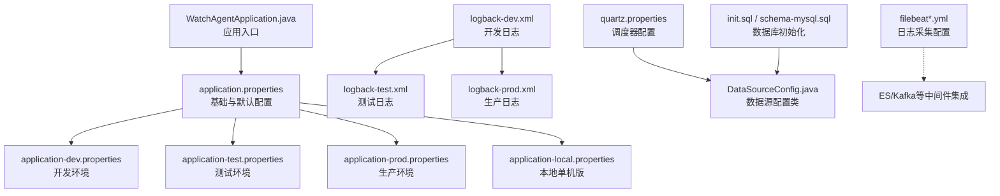
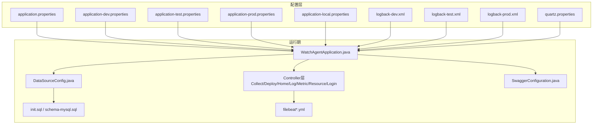
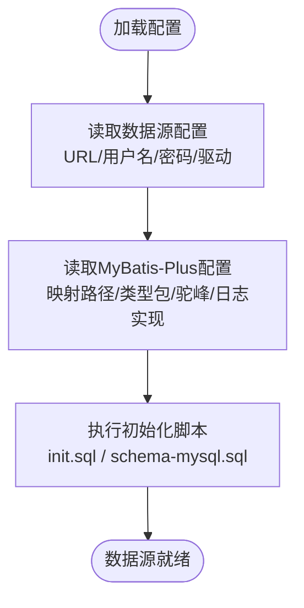
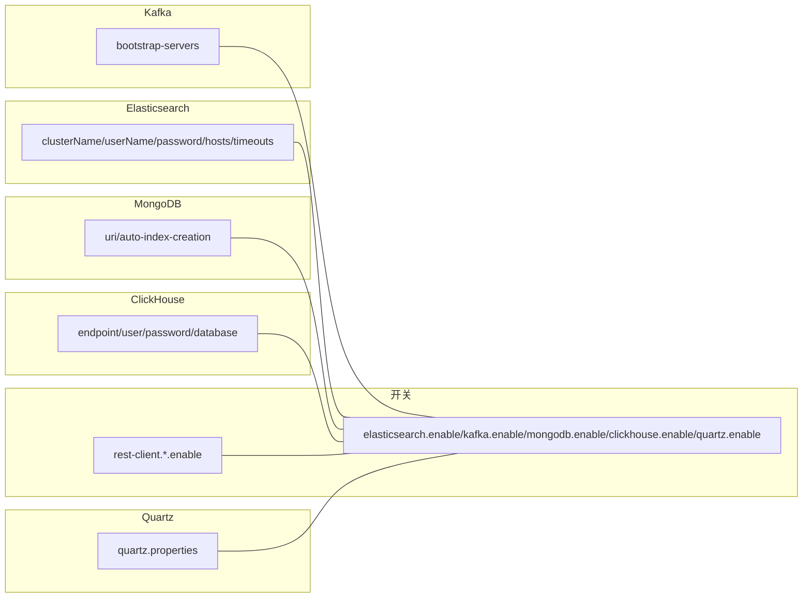
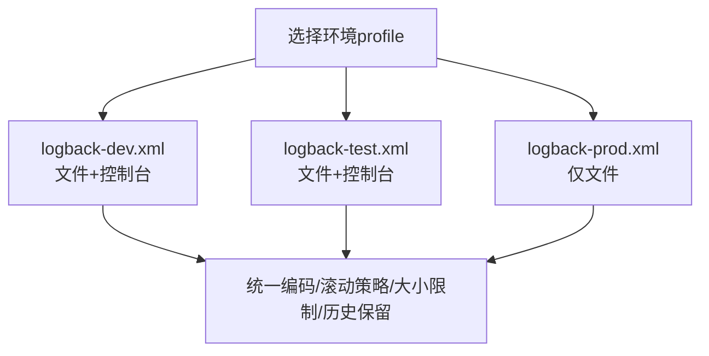
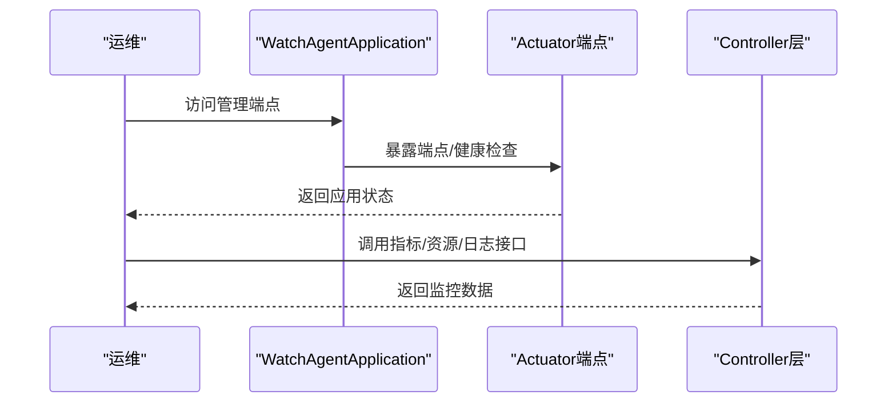
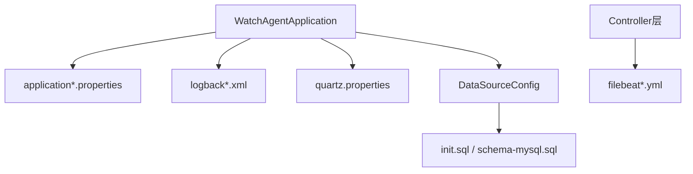

# 配置管理

<cite>
**本文引用的文件**
- [application.properties](file://watcher-agent/src/main/resources/application.properties)
- [application-dev.properties](file://watcher-agent/src/main/resources/application-dev.properties)
- [application-prod.properties](file://watcher-agent/src/main/resources/application-prod.properties)
- [application-test.properties](file://watcher-agent/src/main/resources/application-test.properties)
- [application-local.properties](file://watcher-agent/src/main/resources/application-local.properties)
- [logback-dev.xml](file://watcher-agent/src/main/resources/logback-dev.xml)
- [logback-prod.xml](file://watcher-agent/src/main/resources/logback-prod.xml)
- [logback-test.xml](file://watcher-agent/src/main/resources/logback-test.xml)
- [quartz.properties](file://watcher-agent/src/main/resources/quartz.properties)
- [WatchAgentApplication.java](file://watcher-agent/src/main/java/com/virtual/cloud/om/agent/WatcherAgentApplication.java)
- [DataSourceConfig.java](file://watcher-agent/src/main/java/com/virtual/cloud/om/agent/config/DataSourceConfig.java)
- [SwaggerConfiguration.java](file://watcher-agent/src/main/java/com/virtual/cloud/om/agent/config/SwaggerConfiguration.java)
- [CollectController.java](file://watcher-agent/src/main/java/com/virtual/cloud/om/agent/controller/CollectController.java)
- [DeployController.java](file://watcher-agent/src/main/java/com/virtual/cloud/om/agent/controller/DeployController.java)
- [HomeController.java](file://watcher-agent/src/main/java/com/virtual/cloud/om/agent/controller/HomeController.java)
- [LogController.java](file://watcher-agent/src/main/java/com/virtual/cloud/om/agent/controller/LogController.java)
- [LoginController.java](file://watcher-agent/src/main/java/com/virtual/cloud/om/agent/controller/LoginController.java)
- [MetricController.java](file://watcher-agent/src/main/java/com/virtual/cloud/om/agent/controller/MetricController.java)
- [ResourceController.java](file://watcher-agent/src/main/java/com/virtual/cloud/om/agent/controller/ResourceController.java)
- [ApplicationRunnerImpl.java](file://watcher-agent/src/main/java/com/virtual/cloud/om/agent/config/ApplicationRunnerImpl.java)
- [LoginInterceptor.java](file://watcher-agent/src/main/java/com/virtual/cloud/om/agent/filter/webConfig.java)
- [init.sql](file://watcher-agent/src/main/resources/database/init.sql)
- [schema-mysql.sql](file://watcher-agent/src/main/resources/schema-mysql.sql)
- [test.json](file://watcher-agent/src/main/resources/test.json)
- [resource.json](file://watcher-agent/src/main/resources/resource.json)
- [search.json](file://watcher-agent/src/main/resources/search.json)
- [es_mapping_serverlog.json](file://watcher-agent/src/main/resources/es_mapping_serverlog.json)
- [filebeat.yml](file://watcher-builder/assembly/components/filebeat/filebeat-8.0.1-linux-x86_64/filebeat.yml)
- [filebeat-watcher.yml](file://watcher-builder/assembly/components/filebeat/filebeat-8.0.1-linux-x86_64/filebeat-watcher.yml)
</cite>

## 目录
1. [简介](#简介)
2. [项目结构](#项目结构)
3. [核心组件](#核心组件)
4. [架构总览](#架构总览)
5. [详细组件分析](#详细组件分析)
6. [依赖分析](#依赖分析)
7. [性能考虑](#性能考虑)
8. [故障排查指南](#故障排查指南)
9. [结论](#结论)
10. [附录](#附录)

## 简介
本指南聚焦于ShowTime监控系统中“Agent”子系统的配置管理，围绕以下目标展开：  
- 解释配置文件结构与层次，涵盖application.properties、application-dev.properties、application-prod.properties、application-test.properties、application-local.properties的作用与差异；  
- 深入说明核心配置项：数据库连接、消息队列、日志级别、中间件与插件开关、监控参数等；  
- 介绍环境变量注入与敏感信息保护策略；  
- 说明配置热更新与动态配置管理现状与建议；  
- 提供配置模板、最佳实践与常见问题排查方法；  
- 明确不同部署环境的配置差异与切换方式。

## 项目结构
Agent子系统采用Spring Boot标准资源目录组织，配置文件位于resources目录下，按环境分层管理，并辅以日志配置、定时任务配置、数据库初始化脚本与Filebeat采集配置。

图表来源
- [application.properties:1-80](file://watcher-agent/src/main/resources/application.properties#L1-L80)
- [application-dev.properties:1-72](file://watcher-agent/src/main/resources/application-dev.properties#L1-L72)
- [application-prod.properties:1-70](file://watcher-agent/src/main/resources/application-prod.properties#L1-L70)
- [application-test.properties:1-66](file://watcher-agent/src/main/resources/application-test.properties#L1-L66)
- [application-local.properties:1-61](file://watcher-agent/src/main/resources/application-local.properties#L1-L61)
- [logback-dev.xml:1-44](file://watcher-agent/src/main/resources/logback-dev.xml#L1-L44)
- [logback-prod.xml:1-35](file://watcher-agent/src/main/resources/logback-prod.xml#L1-L35)
- [logback-test.xml:1-45](file://watcher-agent/src/main/resources/logback-test.xml#L1-L45)
- [quartz.properties](file://watcher-agent/src/main/resources/quartz.properties)
- [WatchAgentApplication.java](file://watcher-agent/src/main/java/com/virtual/cloud/om/agent/WatcherAgentApplication.java)
- [DataSourceConfig.java](file://watcher-agent/src/main/java/com/virtual/cloud/om/agent/config/DataSourceConfig.java)
- [init.sql](file://watcher-agent/src/main/resources/database/init.sql)
- [schema-mysql.sql](file://watcher-agent/src/main/resources/schema-mysql.sql)
- [filebeat.yml](file://watcher-builder/assembly/components/filebeat/filebeat-8.0.1-linux-x86_64/filebeat.yml)
- [filebeat-watcher.yml](file://watcher-builder/assembly/components/filebeat/filebeat-8.0.1-linux-x86_64/filebeat-watcher.yml)

章节来源
- [application.properties:1-80](file://watcher-agent/src/main/resources/application.properties#L1-L80)
- [application-dev.properties:1-72](file://watcher-agent/src/main/resources/application-dev.properties#L1-L72)
- [application-prod.properties:1-70](file://watcher-agent/src/main/resources/application-prod.properties#L1-L70)
- [application-test.properties:1-66](file://watcher-agent/src/main/resources/application-test.properties#L1-L66)
- [application-local.properties:1-61](file://watcher-agent/src/main/resources/application-local.properties#L1-L61)
- [logback-dev.xml:1-44](file://watcher-agent/src/main/resources/logback-dev.xml#L1-L44)
- [logback-prod.xml:1-35](file://watcher-agent/src/main/resources/logback-prod.xml#L1-L35)
- [logback-test.xml:1-45](file://watcher-agent/src/main/resources/logback-test.xml#L1-L45)
- [quartz.properties](file://watcher-agent/src/main/resources/quartz.properties)
- [WatchAgentApplication.java](file://watcher-agent/src/main/java/com/virtual/cloud/om/agent/WatcherAgentApplication.java)
- [DataSourceConfig.java](file://watcher-agent/src/main/java/com/virtual/cloud/om/agent/config/DataSourceConfig.java)
- [init.sql](file://watcher-agent/src/main/resources/database/init.sql)
- [schema-mysql.sql](file://watcher-agent/src/main/resources/schema-mysql.sql)
- [filebeat.yml](file://watcher-builder/assembly/components/filebeat/filebeat-8.0.1-linux-x86_64/filebeat.yml)
- [filebeat-watcher.yml](file://watcher-builder/assembly/components/filebeat/filebeat-watcher.yml)

## 核心组件
- 应用入口与配置加载
  - 应用入口通过主配置文件指定活动profile与上下文路径，随后按profile加载对应环境配置。
- 数据库与MyBatis-Plus
  - 数据源URL、用户名、密码、驱动由主配置或环境配置提供；MyBatis-Plus映射与驼峰规则在主配置中定义。
- 中间件与插件开关
  - 通过布尔开关控制ES、Kafka、MongoDB、ClickHouse、Quartz以及REST客户端模块的启用状态。
- 日志系统
  - 不同环境使用不同的logback配置文件，控制输出位置、滚动策略与根日志级别。
- 定时任务
  - Quartz配置文件用于调度器行为控制。
- 文件采集
  - Filebeat配置用于将Agent侧日志发送至集中式存储或流处理系统。

章节来源
- [WatchAgentApplication.java](file://watcher-agent/src/main/java/com/virtual/cloud/om/agent/WatcherAgentApplication.java)
- [application.properties:1-80](file://watcher-agent/src/main/resources/application.properties#L1-L80)
- [application-dev.properties:1-72](file://watcher-agent/src/main/resources/application-dev.properties#L1-L72)
- [application-prod.properties:1-70](file://watcher-agent/src/main/resources/application-prod.properties#L1-L70)
- [application-test.properties:1-66](file://watcher-agent/src/main/resources/application-test.properties#L1-L66)
- [application-local.properties:1-61](file://watcher-agent/src/main/resources/application-local.properties#L1-L61)
- [logback-dev.xml:1-44](file://watcher-agent/src/main/resources/logback-dev.xml#L1-L44)
- [logback-prod.xml:1-35](file://watcher-agent/src/main/resources/logback-prod.xml#L1-L35)
- [logback-test.xml:1-45](file://watcher-agent/src/main/resources/logback-test.xml#L1-L45)
- [quartz.properties](file://watcher-agent/src/main/resources/quartz.properties)
- [DataSourceConfig.java](file://watcher-agent/src/main/java/com/virtual/cloud/om/agent/config/DataSourceConfig.java)

## 架构总览
下图展示配置在系统中的作用与流向：主配置决定profile与基础参数，各环境配置覆盖差异化设置；日志配置独立于profile；定时任务与数据库初始化脚本作为基础设施支撑。

图表来源
- [application.properties:1-80](file://watcher-agent/src/main/resources/application.properties#L1-L80)
- [application-dev.properties:1-72](file://watcher-agent/src/main/resources/application-dev.properties#L1-L72)
- [application-prod.properties:1-70](file://watcher-agent/src/main/resources/application-prod.properties#L1-L70)
- [application-test.properties:1-66](file://watcher-agent/src/main/resources/application-test.properties#L1-L66)
- [application-local.properties:1-61](file://watcher-agent/src/main/resources/application-local.properties#L1-L61)
- [logback-dev.xml:1-44](file://watcher-agent/src/main/resources/logback-dev.xml#L1-L44)
- [logback-prod.xml:1-35](file://watcher-agent/src/main/resources/logback-prod.xml#L1-L35)
- [logback-test.xml:1-45](file://watcher-agent/src/main/resources/logback-test.xml#L1-L45)
- [quartz.properties](file://watcher-agent/src/main/resources/quartz.properties)
- [WatchAgentApplication.java](file://watcher-agent/src/main/java/com/virtual/cloud/om/agent/WatcherAgentApplication.java)
- [DataSourceConfig.java](file://watcher-agent/src/main/java/com/virtual/cloud/om/agent/config/DataSourceConfig.java)
- [CollectController.java](file://watcher-agent/src/main/java/com/virtual/cloud/om/agent/controller/CollectController.java)
- [DeployController.java](file://watcher-agent/src/main/java/com/virtual/cloud/om/agent/controller/DeployController.java)
- [HomeController.java](file://watcher-agent/src/main/java/com/virtual/cloud/om/agent/controller/HomeController.java)
- [LogController.java](file://watcher-agent/src/main/java/com/virtual/cloud/om/agent/controller/LogController.java)
- [MetricController.java](file://watcher-agent/src/main/java/com/virtual/cloud/om/agent/controller/MetricController.java)
- [ResourceController.java](file://watcher-agent/src/main/java/com/virtual/cloud/om/agent/controller/ResourceController.java)
- [LoginController.java](file://watcher-agent/src/main/java/com/virtual/cloud/om/agent/controller/LoginController.java)
- [SwaggerConfiguration.java](file://watcher-agent/src/main/java/com/virtual/cloud/om/agent/config/SwaggerConfiguration.java)
- [init.sql](file://watcher-agent/src/main/resources/database/init.sql)
- [schema-mysql.sql](file://watcher-agent/src/main/resources/schema-mysql.sql)
- [filebeat.yml](file://watcher-builder/assembly/components/filebeat/filebeat-8.0.1-linux-x86_64/filebeat.yml)
- [filebeat-watcher.yml](file://watcher-builder/assembly/components/filebeat/filebeat-watcher.yml)

## 详细组件分析

### 配置文件层次与差异
- application.properties：定义基础参数（端口、上下文路径、应用名、循环依赖允许）、管理端点、中间件与插件开关占位、数据源与MyBatis-Plus基础配置、服务地址占位、系统标识等。
- application-dev.properties：开发环境配置，启用部分中间件与插件，设置MongoDB、Kafka、ES、ClickHouse、UIS/CAS/OneStor等服务地址与端口占位，定义批量采集日志根路径等。
- application-test.properties：测试环境配置，与开发类似但指向测试集群地址。
- application-prod.properties：生产环境配置，启用生产级中间件与插件，使用生产集群地址与端口占位。
- application-local.properties：本地单机版配置，关闭大部分中间件与插件开关，启用必要的REST客户端，使用本地MySQL数据源与MyBatis-Plus配置，开启管理端点。

章节来源
- [application.properties:1-80](file://watcher-agent/src/main/resources/application.properties#L1-L80)
- [application-dev.properties:1-72](file://watcher-agent/src/main/resources/application-dev.properties#L1-L72)
- [application-prod.properties:1-70](file://watcher-agent/src/main/resources/application-prod.properties#L1-L70)
- [application-test.properties:1-66](file://watcher-agent/src/main/resources/application-test.properties#L1-L66)
- [application-local.properties:1-61](file://watcher-agent/src/main/resources/application-local.properties#L1-L61)

### 数据库连接配置
- 主配置中定义了MariaDB数据源的URL、用户名、密码、驱动类名；MyBatis-Plus的映射路径、类型包、驼峰转换与日志实现等。
- 本地单机版使用MySQL驱动与URL，其他环境多为MariaDB或占位符。
- 初始化脚本包含建库建表与基础数据，配合数据源配置完成数据库准备。

图表来源
- [application.properties:48-58](file://watcher-agent/src/main/resources/application.properties#L48-L58)
- [application-local.properties:33-43](file://watcher-agent/src/main/resources/application-local.properties#L33-L43)
- [init.sql](file://watcher-agent/src/main/resources/database/init.sql)
- [schema-mysql.sql](file://watcher-agent/src/main/resources/schema-mysql.sql)

章节来源
- [application.properties:48-58](file://watcher-agent/src/main/resources/application.properties#L48-L58)
- [application-local.properties:33-43](file://watcher-agent/src/main/resources/application-local.properties#L33-L43)
- [init.sql](file://watcher-agent/src/main/resources/database/init.sql)
- [schema-mysql.sql](file://watcher-agent/src/main/resources/schema-mysql.sql)

### 消息队列与中间件配置
- Kafka：通过bootstrap-servers配置集群地址；开发/测试/生产环境分别指向不同集群。
- Elasticsearch：配置集群名、用户名、密码、hosts、超时与连接上限等；开发/测试/生产环境指向不同集群。
- MongoDB：配置URI与索引创建；开发/测试/生产环境指向不同实例。
- ClickHouse：配置endpoint、用户、密码、数据库。
- Quartz：通过quartz.properties进行调度器配置。
- 插件开关：通过布尔开关控制各中间件与REST客户端模块的启用状态。

图表来源
- [application-dev.properties:8-31](file://watcher-agent/src/main/resources/application-dev.properties#L8-L31)
- [application-test.properties:5-26](file://watcher-agent/src/main/resources/application-test.properties#L5-L26)
- [application-prod.properties:7-29](file://watcher-agent/src/main/resources/application-prod.properties#L7-L29)
- [quartz.properties](file://watcher-agent/src/main/resources/quartz.properties)
- [application.properties:16-28](file://watcher-agent/src/main/resources/application.properties#L16-L28)

章节来源
- [application-dev.properties:8-31](file://watcher-agent/src/main/resources/application-dev.properties#L8-L31)
- [application-test.properties:5-26](file://watcher-agent/src/main/resources/application-test.properties#L5-L26)
- [application-prod.properties:7-29](file://watcher-agent/src/main/resources/application-prod.properties#L7-L29)
- [quartz.properties](file://watcher-agent/src/main/resources/quartz.properties)
- [application.properties:16-28](file://watcher-agent/src/main/resources/application.properties#L16-L28)

### 日志级别与输出配置
- 开发/测试/生产环境分别对应不同的logback配置文件，控制日志输出到文件与控制台、滚动策略、根日志级别与特定包的日志级别。
- 建议在开发环境开启控制台输出便于调试，在生产环境仅保留文件输出并降低日志级别。

图表来源
- [logback-dev.xml:1-44](file://watcher-agent/src/main/resources/logback-dev.xml#L1-L44)
- [logback-test.xml:1-45](file://watcher-agent/src/main/resources/logback-test.xml#L1-L45)
- [logback-prod.xml:1-35](file://watcher-agent/src/main/resources/logback-prod.xml#L1-L35)

章节来源
- [logback-dev.xml:1-44](file://watcher-agent/src/main/resources/logback-dev.xml#L1-L44)
- [logback-test.xml:1-45](file://watcher-agent/src/main/resources/logback-test.xml#L1-L45)
- [logback-prod.xml:1-35](file://watcher-agent/src/main/resources/logback-prod.xml#L1-L35)

### 监控参数与管理端点
- 管理端点暴露与健康检查详情显示在主配置中开启，便于运维观察应用状态。
- 控制器层提供指标、资源、日志、登录等接口，结合管理端点可实现全面监控。

图表来源
- [application.properties:10-11](file://watcher-agent/src/main/resources/application.properties#L10-L11)
- [WatchAgentApplication.java](file://watcher-agent/src/main/java/com/virtual/cloud/om/agent/WatcherAgentApplication.java)
- [MetricController.java](file://watcher-agent/src/main/java/com/virtual/cloud/om/agent/controller/MetricController.java)
- [ResourceController.java](file://watcher-agent/src/main/java/com/virtual/cloud/om/agent/controller/ResourceController.java)
- [LogController.java](file://watcher-agent/src/main/java/com/virtual/cloud/om/agent/controller/LogController.java)
- [LoginController.java](file://watcher-agent/src/main/java/com/virtual/cloud/om/agent/controller/LoginController.java)

章节来源
- [application.properties:10-11](file://watcher-agent/src/main/resources/application.properties#L10-L11)
- [WatchAgentApplication.java](file://watcher-agent/src/main/java/com/virtual/cloud/om/agent/WatcherAgentApplication.java)
- [MetricController.java](file://watcher-agent/src/main/java/com/virtual/cloud/om/agent/controller/MetricController.java)
- [ResourceController.java](file://watcher-agent/src/main/java/com/virtual/cloud/om/agent/controller/ResourceController.java)
- [LogController.java](file://watcher-agent/src/main/java/com/virtual/cloud/om/agent/controller/LogController.java)
- [LoginController.java](file://watcher-agent/src/main/java/com/virtual/cloud/om/agent/controller/LoginController.java)

### 环境变量与敏感信息保护
- 环境变量注入：多处配置使用占位符形式（如UIS_PORT、CAS_PORT等），可在启动时通过JVM参数或容器环境变量注入，避免硬编码。
- 敏感信息保护：建议将数据库密码、中间件认证凭据、服务密钥等放入安全的密管系统或容器环境变量中，不直接写入仓库。
- 密钥管理：结合平台提供的密钥管理能力，对敏感字段进行加密存储与解密使用。

章节来源
- [application-dev.properties:40-41](file://watcher-agent/src/main/resources/application-dev.properties#L40-L41)
- [application-dev.properties:53-54](file://watcher-agent/src/main/resources/application-dev.properties#L53-L54)
- [application-prod.properties:40-41](file://watcher-agent/src/main/resources/application-prod.properties#L40-L41)
- [application-prod.properties:53-54](file://watcher-agent/src/main/resources/application-prod.properties#L53-L54)
- [application-test.properties:35-36](file://watcher-agent/src/main/resources/application-test.properties#L35-L36)
- [application-test.properties:48-49](file://watcher-agent/src/main/resources/application-test.properties#L48-L49)

### 配置热更新与动态管理
- 当前仓库未发现显式的配置中心或动态刷新注解（如@RefreshScope）使用痕迹，配置主要通过profile加载并在启动时确定。
- 如需热更新，建议引入Spring Cloud Config或Nacos等配置中心，并在关键配置上启用动态刷新注解与HTTP端点。

章节来源
- [application.properties](file://watcher-agent/src/main/resources/application.properties#L2)
- [WatchAgentApplication.java](file://watcher-agent/src/main/java/com/virtual/cloud/om/agent/WatcherAgentApplication.java)

### 配置模板与最佳实践
- 配置模板建议
  - 数据库：区分开发/测试/生产三套数据源，本地单机版使用MySQL驱动与最小化配置。
  - 中间件：按环境启用必要组件，严格控制开关与超时参数。
  - 日志：开发/测试开启控制台输出，生产仅文件输出并设置合理滚动策略。
  - 环境变量：所有敏感字段使用占位符并通过外部注入。
- 最佳实践
  - 将敏感信息纳入密管，不提交至版本库。
  - 使用profile隔离环境差异，避免在代码中硬编码环境特有值。
  - 对关键配置（如数据库、消息队列、ES）建立变更审批与回滚预案。
  - 在生产环境开启最小权限原则与审计日志。

章节来源
- [application-local.properties:33-43](file://watcher-agent/src/main/resources/application-local.properties#L33-L43)
- [application-dev.properties:8-31](file://watcher-agent/src/main/resources/application-dev.properties#L8-L31)
- [application-test.properties:5-26](file://watcher-agent/src/main/resources/application-test.properties#L5-L26)
- [application-prod.properties:7-29](file://watcher-agent/src/main/resources/application-prod.properties#L7-L29)
- [logback-dev.xml:37-40](file://watcher-agent/src/main/resources/logback-dev.xml#L37-L40)
- [logback-prod.xml:29-31](file://watcher-agent/src/main/resources/logback-prod.xml#L29-L31)

## 依赖分析
- 配置耦合关系
  - WatchAgentApplication依赖主配置确定活动profile；DataSourceConfig依赖数据源配置；Controller层依赖业务配置与中间件开关。
- 外部依赖
  - 数据库初始化脚本与数据源配置强关联；Filebeat配置影响日志采集与下游存储/流处理。
- 潜在风险
  - profile选择错误会导致中间件与插件未正确启用或地址不匹配。
  - 日志配置不当可能导致磁盘空间压力与性能问题。

图表来源
- [WatchAgentApplication.java](file://watcher-agent/src/main/java/com/virtual/cloud/om/agent/WatcherAgentApplication.java)
- [application.properties:1-80](file://watcher-agent/src/main/resources/application.properties#L1-L80)
- [logback-dev.xml:1-44](file://watcher-agent/src/main/resources/logback-dev.xml#L1-L44)
- [quartz.properties](file://watcher-agent/src/main/resources/quartz.properties)
- [DataSourceConfig.java](file://watcher-agent/src/main/java/com/virtual/cloud/om/agent/config/DataSourceConfig.java)
- [init.sql](file://watcher-agent/src/main/resources/database/init.sql)
- [schema-mysql.sql](file://watcher-agent/src/main/resources/schema-mysql.sql)
- [filebeat.yml](file://watcher-builder/assembly/components/filebeat/filebeat-8.0.1-linux-x86_64/filebeat.yml)
- [filebeat-watcher.yml](file://watcher-builder/assembly/components/filebeat/filebeat-watcher.yml)

章节来源
- [WatchAgentApplication.java](file://watcher-agent/src/main/java/com/virtual/cloud/om/agent/WatcherAgentApplication.java)
- [application.properties:1-80](file://watcher-agent/src/main/resources/application.properties#L1-L80)
- [logback-dev.xml:1-44](file://watcher-agent/src/main/resources/logback-dev.xml#L1-L44)
- [quartz.properties](file://watcher-agent/src/main/resources/quartz.properties)
- [DataSourceConfig.java](file://watcher-agent/src/main/java/com/virtual/cloud/om/agent/config/DataSourceConfig.java)
- [init.sql](file://watcher-agent/src/main/resources/database/init.sql)
- [schema-mysql.sql](file://watcher-agent/src/main/resources/schema-mysql.sql)
- [filebeat.yml](file://watcher-builder/assembly/components/filebeat/filebeat-8.0.1-linux-x86_64/filebeat.yml)
- [filebeat-watcher.yml](file://watcher-builder/assembly/components/filebeat/filebeat-watcher.yml)

## 性能考虑
- 日志滚动策略：合理设置单文件大小与总容量，避免磁盘打满；生产环境建议仅文件输出并降低日志级别。
- 中间件连接池：ES/Kafka/MongoDB/ClickHouse的连接数与超时参数需结合实际负载调优。
- 数据库连接：确保连接池参数与查询优化，避免长事务与阻塞。
- 定时任务：Quartz配置应与业务周期匹配，避免高并发下的资源争用。

## 故障排查指南
- 启动失败
  - 检查活动profile是否正确；确认数据源URL/用户名/密码可用；核对数据库初始化脚本执行结果。
- 中间件不可用
  - 核对Kafka/ES/MongoDB/ClickHouse的地址、端口与认证信息；确认开关已启用。
- 日志异常
  - 检查logback配置文件是否与当前profile匹配；确认日志目录权限与磁盘空间。
- 端点访问
  - 确认管理端点已暴露且健康检查详情开启；检查防火墙与代理配置。
- 文件采集问题
  - 检查Filebeat配置与目标存储连通性；核对字段映射与索引模板。

章节来源
- [application.properties:10-11](file://watcher-agent/src/main/resources/application.properties#L10-L11)
- [application-dev.properties:8-31](file://watcher-agent/src/main/resources/application-dev.properties#L8-L31)
- [application-test.properties:5-26](file://watcher-agent/src/main/resources/application-test.properties#L5-L26)
- [application-prod.properties:7-29](file://watcher-agent/src/main/resources/application-prod.properties#L7-L29)
- [logback-dev.xml:1-44](file://watcher-agent/src/main/resources/logback-dev.xml#L1-L44)
- [logback-prod.xml:1-35](file://watcher-agent/src/main/resources/logback-prod.xml#L1-L35)
- [logback-test.xml:1-45](file://watcher-agent/src/main/resources/logback-test.xml#L1-L45)
- [filebeat.yml](file://watcher-builder/assembly/components/filebeat/filebeat-8.0.1-linux-x86_64/filebeat.yml)
- [filebeat-watcher.yml](file://watcher-builder/assembly/components/filebeat/filebeat-watcher.yml)

## 结论
本指南梳理了ShowTime Agent子系统的配置管理现状与最佳实践：通过多层配置文件实现环境隔离，结合日志与中间件开关满足不同场景需求；建议在生产环境中强化敏感信息保护与动态配置能力，并完善变更治理与回滚预案，以提升系统的稳定性与可维护性。

## 附录
- 不同部署环境的配置差异与切换方法
  - 切换方式：通过主配置的活动profile或启动参数指定目标profile；开发/测试/生产环境分别对应不同的application-*.properties文件。
  - 差异要点：数据源驱动与URL、中间件地址与开关、日志输出策略、管理端点暴露范围等。
- 配置验证工具与流程
  - 启动后访问管理端点查看健康状态；使用控制器接口验证核心功能；检查日志输出与滚动策略；验证Filebeat采集链路。
- 常见配置错误
  - profile选择错误导致中间件未启用；数据源凭据错误导致无法连接；日志目录无权限或磁盘空间不足；ES/Kafka/MongoDB/ClickHouse地址解析失败。

章节来源
- [application.properties](file://watcher-agent/src/main/resources/application.properties#L2)
- [application-dev.properties:1-72](file://watcher-agent/src/main/resources/application-dev.properties#L1-L72)
- [application-prod.properties:1-70](file://watcher-agent/src/main/resources/application-prod.properties#L1-L70)
- [application-test.properties:1-66](file://watcher-agent/src/main/resources/application-test.properties#L1-L66)
- [application-local.properties:1-61](file://watcher-agent/src/main/resources/application-local.properties#L1-L61)
- [logback-dev.xml:1-44](file://watcher-agent/src/main/resources/logback-dev.xml#L1-L44)
- [logback-prod.xml:1-35](file://watcher-agent/src/main/resources/logback-prod.xml#L1-L35)
- [logback-test.xml:1-45](file://watcher-agent/src/main/resources/logback-test.xml#L1-L45)
- [filebeat.yml](file://watcher-builder/assembly/components/filebeat/filebeat-8.0.1-linux-x86_64/filebeat.yml)
- [filebeat-watcher.yml](file://watcher-builder/assembly/components/filebeat/filebeat-watcher.yml)