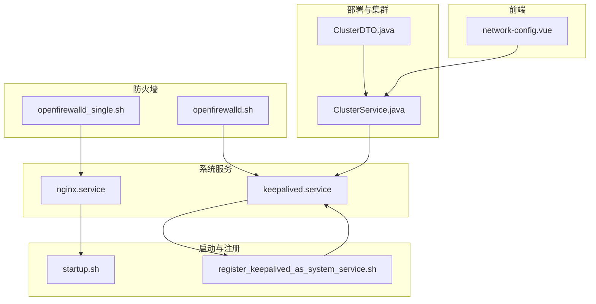
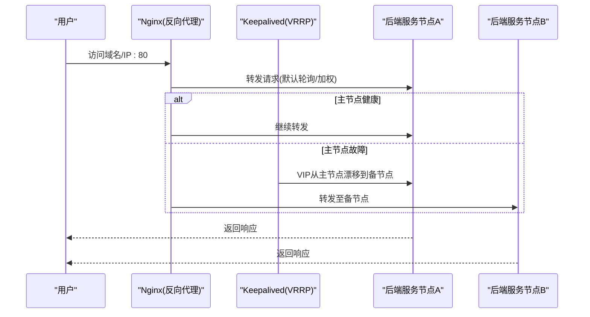
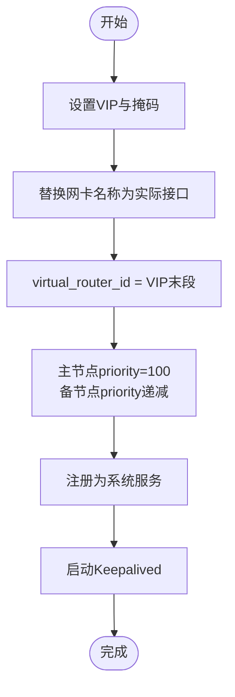
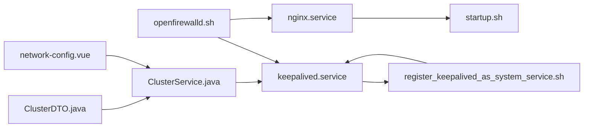

# 负载均衡配置

<cite>
**本文引用的文件**
- [nginx.service](file://watcher-builder/assembly/conf/nginx.service)
- [keepalived.service](file://watcher-builder/assembly/conf/keepalived.service)
- [openfirewalld.sh](file://watcher-builder/assembly/bin/openfirewalld.sh)
- [openfirewalld_single.sh](file://watcher-builder/assembly/bin/openfirewalld_single.sh)
- [startup.sh](file://watcher-builder/assembly/bin/startup.sh)
- [init.sh](file://watcher-builder/assembly/bin/init.sh)
- [register_keepalived_as_system_service.sh](file://watcher-builder/assembly/bin/register_keepalived_as_system_service.sh)
- [ClusterService.java](file://watcher-agent/src/main/java/com/virtual/cloud/om/agent/service/deploy/ClusterService.java)
- [ClusterDTO.java](file://watcher-sdk/src/main/java/com/virtual/cloud/om/sdk/dto/dataReport/cas/ClusterDTO.java)
- [network-config.vue](file://watcher-web/src/views/main/init-config/components/network-config.vue)
</cite>

## 目录
1. [简介](#简介)
2. [项目结构](#项目结构)
3. [核心组件](#核心组件)
4. [架构总览](#架构总览)
5. [详细组件分析](#详细组件分析)
6. [依赖关系分析](#依赖关系分析)
7. [性能考虑](#性能考虑)
8. [故障排查指南](#故障排查指南)
9. [结论](#结论)
10. [附录](#附录)

## 简介
本指南面向ShowTime监控系统中“负载均衡与高可用”的落地实施，围绕以下目标展开：  
- Nginx反向代理的配置原理与性能优化策略  
- Keepalived高可用负载均衡的配置方法（含VRRP协议与虚拟IP管理）  
- 健康检查机制的配置要点（检查间隔、超时、失败重试）  
- 负载均衡算法选择与权重分配  
- 防火墙与端口管理最佳实践  
- 性能监控与故障诊断方法  
- SSL/TLS证书配置与安全加固  

本指南以仓库中现有的服务单元、防火墙脚本、部署与集群配置代码为依据，结合前端初始化界面，形成可执行、可验证的实施路径。

## 项目结构
与负载均衡相关的关键位置如下：  
- systemd服务单元：Nginx与Keepalived的服务定义  
- 启动与注册脚本：组件启动、注册为系统服务  
- 防火墙脚本：开放VRRP多播与业务端口  
- 集群配置逻辑：通过SSH远程修改Keepalived配置并注册服务  
- 前端初始化界面：节点角色与VIP等参数输入

**图表来源**
- [nginx.service:1-14](file://watcher-builder/assembly/conf/nginx.service#L1-L14)
- [keepalived.service:1-14](file://watcher-builder/assembly/conf/keepalived.service#L1-L14)
- [startup.sh:1-81](file://watcher-builder/assembly/bin/startup.sh#L1-L81)
- [register_keepalived_as_system_service.sh:1-20](file://watcher-builder/assembly/bin/register_keepalived_as_system_service.sh#L1-L20)
- [openfirewalld.sh:1-21](file://watcher-builder/assembly/bin/openfirewalld.sh#L1-L21)
- [openfirewalld_single.sh:1-9](file://watcher-builder/assembly/bin/openfirewalld_single.sh#L1-L9)
- [ClusterService.java:240-278](file://watcher-agent/src/main/java/com/virtual/cloud/om/agent/service/deploy/ClusterService.java#L240-L278)
- [ClusterDTO.java:47-87](file://watcher-sdk/src/main/java/com/virtual/cloud/om/sdk/dto/dataReport/cas/ClusterDTO.java#L47-L87)
- [network-config.vue:69-84](file://watcher-web/src/views/main/init-config/components/network-config.vue#L69-L84)

**章节来源**
- [nginx.service:1-14](file://watcher-builder/assembly/conf/nginx.service#L1-L14)
- [keepalived.service:1-14](file://watcher-builder/assembly/conf/keepalived.service#L1-L14)
- [openfirewalld.sh:1-21](file://watcher-builder/assembly/bin/openfirewalld.sh#L1-L21)
- [openfirewalld_single.sh:1-9](file://watcher-builder/assembly/bin/openfirewalld_single.sh#L1-L9)
- [startup.sh:1-81](file://watcher-builder/assembly/bin/startup.sh#L1-L81)
- [register_keepalived_as_system_service.sh:1-20](file://watcher-builder/assembly/bin/register_keepalived_as_system_service.sh#L1-L20)
- [ClusterService.java:240-278](file://watcher-agent/src/main/java/com/virtual/cloud/om/agent/service/deploy/ClusterService.java#L240-L278)
- [ClusterDTO.java:47-87](file://watcher-sdk/src/main/java/com/virtual/cloud/om/sdk/dto/dataReport/cas/ClusterDTO.java#L47-L87)
- [network-config.vue:69-84](file://watcher-web/src/views/main/init-config/components/network-config.vue#L69-L84)

## 核心组件
- 反向代理与入口流量接入：由Nginx负责对外80/tcp端口的请求转发至后端服务节点。  
- 高可用与故障切换：Keepalived基于VRRP实现主备节点的虚拟IP漂移，确保单点故障下的业务连续性。  
- 防火墙与网络策略：通过firewalld开放VRRP多播与业务端口，保障心跳与业务流量正常通行。  
- 集群部署与配置下发：通过ClusterService对远端节点进行Keepalived配置修改与服务注册，配合ClusterDTO中的LB相关字段完成策略化配置。  
- 前端初始化：network-config.vue用于选择主备节点与输入VIP等参数，驱动后端部署流程。

**章节来源**
- [nginx.service:1-14](file://watcher-builder/assembly/conf/nginx.service#L1-L14)
- [keepalived.service:1-14](file://watcher-builder/assembly/conf/keepalived.service#L1-L14)
- [openfirewalld.sh:12-20](file://watcher-builder/assembly/bin/openfirewalld.sh#L12-L20)
- [openfirewalld_single.sh:7-8](file://watcher-builder/assembly/bin/openfirewalld_single.sh#L7-L8)
- [ClusterService.java:240-278](file://watcher-agent/src/main/java/com/virtual/cloud/om/agent/service/deploy/ClusterService.java#L240-L278)
- [ClusterDTO.java:47-87](file://watcher-sdk/src/main/java/com/virtual/cloud/om/sdk/dto/dataReport/cas/ClusterDTO.java#L47-L87)
- [network-config.vue:69-84](file://watcher-web/src/views/main/init-config/components/network-config.vue#L69-L84)

## 架构总览
下图展示从用户访问到后端服务的典型链路，以及高可用切换的触发条件。

**图表来源**
- [nginx.service:5-10](file://watcher-builder/assembly/conf/nginx.service#L5-L10)
- [keepalived.service:5-10](file://watcher-builder/assembly/conf/keepalived.service#L5-L10)
- [openfirewalld.sh:12-13](file://watcher-builder/assembly/bin/openfirewalld.sh#L12-L13)
- [ClusterService.java:240-278](file://watcher-agent/src/main/java/com/virtual/cloud/om/agent/service/deploy/ClusterService.java#L240-L278)

## 详细组件分析

### Nginx反向代理配置与性能优化
- 服务单元与生命周期控制：通过nginx.service定义启动、重启与停止命令，指向组件内置的startup.sh/restart.sh/shutdown.sh。  
- 入口端口：对外暴露80/tcp端口，由防火墙脚本统一放行。  
- 性能优化建议（基于现有脚本与服务定义的可操作面）：
  - 使用进程外日志与GC配置（参考组件启动脚本中的JVM GC相关选项），减少应用侧阻塞对Nginx的影响。  
  - 将静态资源与动态请求分离，利用缓存与压缩策略降低后端压力。  
  - 合理设置worker_processes与worker_connections，结合硬件核数与并发峰值评估。  
  - 开启连接复用与超时控制，避免长连接占用资源。  
  - 在上游健康检查失败时快速失败，避免放大后端压力。

**章节来源**
- [nginx.service:5-10](file://watcher-builder/assembly/conf/nginx.service#L5-L10)
- [openfirewalld_single.sh:7-8](file://watcher-builder/assembly/bin/openfirewalld_single.sh#L7-L8)
- [startup.sh:62-72](file://watcher-builder/assembly/bin/startup.sh#L62-L72)

### Keepalived高可用与VRRP配置
- 服务单元与生命周期：keepalived.service定义了启动、重启与停止命令，指向组件内置脚本。  
- 注册为系统服务：register_keepalived_as_system_service.sh会替换模板中的路径变量并启用服务。  
- 远端配置下发：ClusterService通过SSH修改远端Keepalived配置文件中的VIP、网卡、virtual_router_id与priority等关键项；随后注册并启动服务。  
- VRRP与虚拟IP管理：
  - virtual_router_id按VIP末段取值，确保同网段唯一性。  
  - priority主节点最高，备节点递减，保证主节点优先抢占。  
  - 网卡名称按远端实际接口替换，确保VRRP通告正确发送。  
- 防火墙要求：VRRP多播地址224.0.0.18需放行，INPUT与OUTPUT均需允许。

**图表来源**
- [ClusterService.java:240-278](file://watcher-agent/src/main/java/com/virtual/cloud/om/agent/service/deploy/ClusterService.java#L240-L278)
- [register_keepalived_as_system_service.sh:11-18](file://watcher-builder/assembly/bin/register_keepalived_as_system_service.sh#L11-L18)
- [openfirewalld.sh:12-13](file://watcher-builder/assembly/bin/openfirewalld.sh#L12-L13)

**章节来源**
- [keepalived.service:5-10](file://watcher-builder/assembly/conf/keepalived.service#L5-L10)
- [register_keepalived_as_system_service.sh:1-20](file://watcher-builder/assembly/bin/register_keepalived_as_system_service.sh#L1-L20)
- [ClusterService.java:240-278](file://watcher-agent/src/main/java/com/virtual/cloud/om/agent/service/deploy/ClusterService.java#L240-L278)
- [openfirewalld.sh:12-13](file://watcher-builder/assembly/bin/openfirewalld.sh#L12-L13)

### 健康检查机制配置
- 检查间隔与超时：ClusterDTO中提供enableLB、persistTime、checkInterval等字段，用于表达LB策略与健康检查周期。  
- 失败重试策略：结合persistTime可实现“持续时间”内的多次检查失败才判定为不可用，避免瞬时抖动导致误切。  
- 实施建议：
  - 将后端服务的存活探针与Nginx upstream健康状态联动，失败时及时摘除节点。  
  - 对不同业务类型设置差异化检查间隔与超时，避免IO密集型服务被过短周期压垮。  
  - 结合日志与指标（如错误率、响应时间）动态调整阈值。

**章节来源**
- [ClusterDTO.java:47-87](file://watcher-sdk/src/main/java/com/virtual/cloud/om/sdk/dto/dataReport/cas/ClusterDTO.java#L47-L87)

### 负载均衡算法与权重分配
- 算法选择：Nginx支持轮询、加权轮询、最少连接、哈希等多种算法；结合ClusterDTO的权重字段可实现加权策略。  
- 权重分配：根据节点性能与容量设置不同weight，提升高配节点的承载比例。  
- 动态调整：在不中断业务的前提下，通过热更新或灰度策略逐步调整权重，观察指标后再全量生效。

[本节为通用实践说明，无需特定文件引用]

### 防火墙与端口管理最佳实践
- VRRP多播：必须放行224.0.0.18多播地址的VRRP协议，且对INPUT与OUTPUT均需放行。  
- 业务端口：对外80/tcp需永久放行；若使用HTTPS，还需放行443/tcp。  
- 源地址白名单：可通过富规则限制仅允许指定源地址访问，降低攻击面。  
- 单机场景：openfirewalld_single.sh仅开放80/tcp，适合单节点部署验证。

**章节来源**
- [openfirewalld.sh:12-20](file://watcher-builder/assembly/bin/openfirewalld.sh#L12-L20)
- [openfirewalld_single.sh:7-8](file://watcher-builder/assembly/bin/openfirewalld_single.sh#L7-L8)

### SSL/TLS证书与安全加固
- 证书部署：在Nginx中配置证书与私钥路径，启用TLSv1.2及以上版本，禁用弱密码套件。  
- 安全加固：  
  - 强化SSH配置（示例脚本中已体现对Kex算法的更新），避免弱加密算法。  
  - 限制对管理端口的访问范围，仅允许受信网段。  
  - 启用HSTS与安全响应头，防止中间人攻击与会话劫持。  
  - 定期轮换证书与密钥，建立自动化续期与告警机制。

**章节来源**
- [init.sh:24-25](file://watcher-builder/assembly/bin/init.sh#L24-L25)

## 依赖关系分析
- systemd服务单元依赖于组件内置的startup/restart/shutdown脚本。  
- Keepalived依赖于防火墙对VRRP多播的放行。  
- 集群部署依赖于ClusterService通过SSH下发配置并注册服务。  
- 前端初始化界面提供节点角色与VIP等参数，驱动后端部署流程。

**图表来源**
- [nginx.service:5-10](file://watcher-builder/assembly/conf/nginx.service#L5-L10)
- [keepalived.service:5-10](file://watcher-builder/assembly/conf/keepalived.service#L5-L10)
- [register_keepalived_as_system_service.sh:11-18](file://watcher-builder/assembly/bin/register_keepalived_as_system_service.sh#L11-L18)
- [openfirewalld.sh:12-20](file://watcher-builder/assembly/bin/openfirewalld.sh#L12-L20)
- [ClusterService.java:240-278](file://watcher-agent/src/main/java/com/virtual/cloud/om/agent/service/deploy/ClusterService.java#L240-L278)
- [ClusterDTO.java:47-87](file://watcher-sdk/src/main/java/com/virtual/cloud/om/sdk/dto/dataReport/cas/ClusterDTO.java#L47-L87)
- [network-config.vue:69-84](file://watcher-web/src/views/main/init-config/components/network-config.vue#L69-L84)

**章节来源**
- [nginx.service:1-14](file://watcher-builder/assembly/conf/nginx.service#L1-L14)
- [keepalived.service:1-14](file://watcher-builder/assembly/conf/keepalived.service#L1-L14)
- [openfirewalld.sh:1-21](file://watcher-builder/assembly/bin/openfirewalld.sh#L1-L21)
- [register_keepalived_as_system_service.sh:1-20](file://watcher-builder/assembly/bin/register_keepalived_as_system_service.sh#L1-L20)
- [ClusterService.java:240-278](file://watcher-agent/src/main/java/com/virtual/cloud/om/agent/service/deploy/ClusterService.java#L240-L278)
- [ClusterDTO.java:47-87](file://watcher-sdk/src/main/java/com/virtual/cloud/om/sdk/dto/dataReport/cas/ClusterDTO.java#L47-L87)
- [network-config.vue:69-84](file://watcher-web/src/views/main/init-config/components/network-config.vue#L69-L84)

## 性能考虑
- 上游健康状态与Nginx配置联动，避免将流量转发至不健康节点。  
- 合理设置worker进程与连接上限，结合CPU核数与并发峰值评估。  
- 利用缓存与压缩策略降低后端压力，缩短响应时间。  
- 在高并发场景下，优先采用加权轮询或最少连接算法，结合权重动态调优。  
- 通过JVM GC日志与堆转储定位内存问题，避免因GC停顿影响整体吞吐。

[本节为通用实践说明，无需特定文件引用]

## 故障排查指南
- Keepalived无法漂移：  
  - 检查VRRP多播是否放行（224.0.0.18）。  
  - 核对virtual_router_id一致性与priority大小关系。  
  - 确认网卡名称替换是否正确，接口是否UP。  
- Nginx无法访问：  
  - 检查80/tcp是否放行。  
  - 查看Nginx错误日志与access日志，确认上游upstream配置与健康状态。  
- 集群部署失败：  
  - 通过ClusterService的SSH命令输出定位远端配置下发问题。  
  - 确认keepalived服务已注册并处于运行状态。  
- 前端初始化异常：  
  - 确认主备节点选择与VIP输入符合预期，避免与现有网络冲突。

**章节来源**
- [openfirewalld.sh:12-20](file://watcher-builder/assembly/bin/openfirewalld.sh#L12-L20)
- [ClusterService.java:240-278](file://watcher-agent/src/main/java/com/virtual/cloud/om/agent/service/deploy/ClusterService.java#L240-L278)
- [network-config.vue:69-84](file://watcher-web/src/views/main/init-config/components/network-config.vue#L69-L84)

## 结论
本指南基于仓库中的服务单元、防火墙脚本与部署逻辑，给出了Nginx与Keepalived在ShowTime中的实施路径。通过合理的健康检查策略、权重分配与防火墙配置，可在保证高可用的同时获得稳定的性能表现。建议在生产环境进一步完善监控与自动化运维能力，确保变更可追溯、故障可快速恢复。

## 附录
- 关键文件清单与职责概览：  
  - nginx.service：定义Nginx服务生命周期与执行脚本  
  - keepalived.service：定义Keepalived服务生命周期与执行脚本  
  - openfirewalld.sh/openfirewalld_single.sh：防火墙端口与VRRP多播放行  
  - register_keepalived_as_system_service.sh：将Keepalived注册为系统服务  
  - ClusterService.java：远端Keepalived配置下发与服务注册  
  - ClusterDTO.java：LB相关策略字段（检查间隔、持续时间等）  
  - network-config.vue：前端节点角色与VIP配置入口

**章节来源**
- [nginx.service:1-14](file://watcher-builder/assembly/conf/nginx.service#L1-L14)
- [keepalived.service:1-14](file://watcher-builder/assembly/conf/keepalived.service#L1-L14)
- [openfirewalld.sh:1-21](file://watcher-builder/assembly/bin/openfirewalld.sh#L1-L21)
- [openfirewalld_single.sh:1-9](file://watcher-builder/assembly/bin/openfirewalld_single.sh#L1-L9)
- [register_keepalived_as_system_service.sh:1-20](file://watcher-builder/assembly/bin/register_keepalived_as_system_service.sh#L1-L20)
- [ClusterService.java:240-278](file://watcher-agent/src/main/java/com/virtual/cloud/om/agent/service/deploy/ClusterService.java#L240-L278)
- [ClusterDTO.java:47-87](file://watcher-sdk/src/main/java/com/virtual/cloud/om/sdk/dto/dataReport/cas/ClusterDTO.java#L47-L87)
- [network-config.vue:69-84](file://watcher-web/src/views/main/init-config/components/network-config.vue#L69-L84)