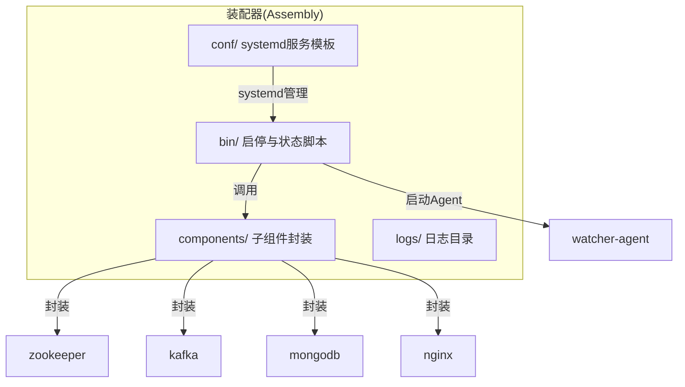
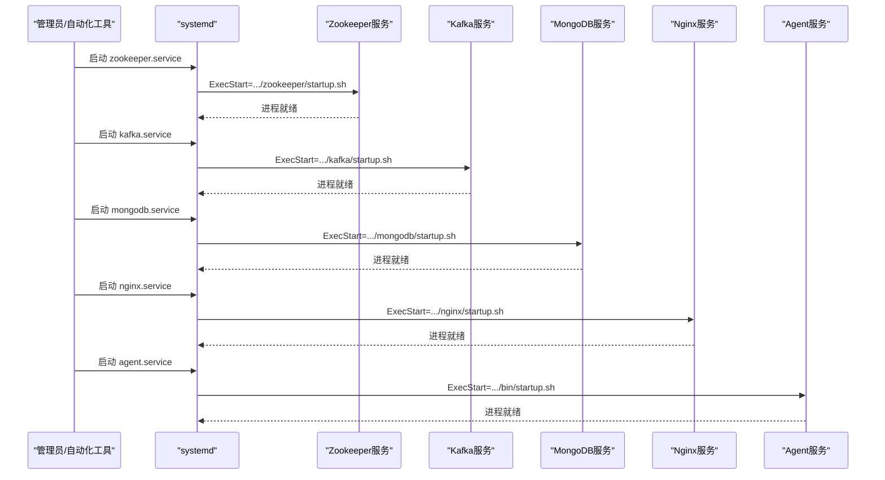
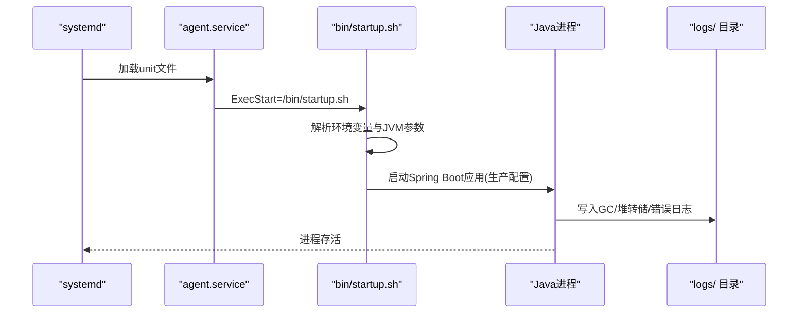
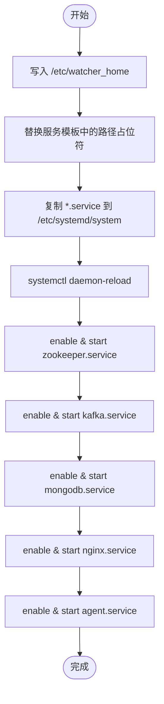
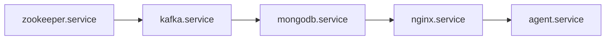

# 集群启动流程

<cite>
**本文引用的文件**
- [startup.sh](file://watcher-builder/assembly/bin/startup.sh)
- [shutdown.sh](file://watcher-builder/assembly/bin/shutdown.sh)
- [status.sh](file://watcher-builder/assembly/bin/status.sh)
- [check.sh](file://watcher-builder/assembly/bin/check.sh)
- [register_as_system_service_and_start.sh](file://watcher-builder/assembly/bin/register_as_system_service_and_start.sh)
- [agent.service](file://watcher-builder/assembly/conf/agent.service)
- [kafka.service](file://watcher-builder/assembly/conf/kafka.service)
- [mongodb.service](file://watcher-builder/assembly/conf/mongodb.service)
- [nginx.service](file://watcher-builder/assembly/conf/nginx.service)
- [zookeeper.service](file://watcher-builder/assembly/conf/zookeeper.service)
</cite>

## 目录
1. [简介](#简介)
2. [项目结构](#项目结构)
3. [核心组件](#核心组件)
4. [架构总览](#架构总览)
5. [详细组件分析](#详细组件分析)
6. [依赖分析](#依赖分析)
7. [性能考虑](#性能考虑)
8. [故障排查指南](#故障排查指南)
9. [结论](#结论)
10. [附录](#附录)

## 简介
本操作手册面向ShowTime监控系统集群的运维与部署人员，提供从单节点到多节点的完整启动流程说明。重点覆盖以下内容：
- 严格的启动顺序与依赖关系（Zookeeper → Kafka → MongoDB → Nginx → Agent）
- systemd服务注册与自动启动配置
- 启动过程中的关键检查点与错误处理机制
- 启动状态监控与健康检查方法
- 常见启动失败原因与解决方案
- 启动脚本工作原理与参数配置
- 自动化与批量部署建议

## 项目结构
本项目采用“装配器”模式，将各子系统组件打包为可分发包，并通过统一的bin与conf目录提供启动、停止、重启、状态查询与系统服务注册能力。

图示来源
- [startup.sh:1-81](file://watcher-builder/assembly/bin/startup.sh#L1-L81)
- [agent.service:1-14](file://watcher-builder/assembly/conf/agent.service#L1-L14)
- [kafka.service:1-14](file://watcher-builder/assembly/conf/kafka.service#L1-L14)
- [mongodb.service:1-14](file://watcher-builder/assembly/conf/mongodb.service#L1-L14)
- [nginx.service:1-14](file://watcher-builder/assembly/conf/nginx.service#L1-L14)
- [zookeeper.service:1-14](file://watcher-builder/assembly/conf/zookeeper.service#L1-L14)

章节来源
- [startup.sh:1-81](file://watcher-builder/assembly/bin/startup.sh#L1-L81)
- [agent.service:1-14](file://watcher-builder/assembly/conf/agent.service#L1-L14)
- [kafka.service:1-14](file://watcher-builder/assembly/conf/kafka.service#L1-L14)
- [mongodb.service:1-14](file://watcher-builder/assembly/conf/mongodb.service#L1-L14)
- [nginx.service:1-14](file://watcher-builder/assembly/conf/nginx.service#L1-L14)
- [zookeeper.service:1-14](file://watcher-builder/assembly/conf/zookeeper.service#L1-L14)

## 核心组件
- Agent服务：监控采集与上报的核心进程，由独立的Spring Boot应用实现，通过bin/startup.sh启动。
- Zookeeper：分布式协调服务，为Kafka等组件提供选举与元数据存储支持。
- Kafka：消息队列，用于日志与指标的异步传输。
- MongoDB：持久化存储，保存配置、状态与历史数据。
- Nginx：反向代理与静态资源服务，对外提供统一入口。
- systemd服务模板：以agent.service、kafka.service、mongodb.service、nginx.service、zookeeper.service形式提供自动启动与管理。

章节来源
- [startup.sh:1-81](file://watcher-builder/assembly/bin/startup.sh#L1-L81)
- [agent.service:1-14](file://watcher-builder/assembly/conf/agent.service#L1-L14)
- [kafka.service:1-14](file://watcher-builder/assembly/conf/kafka.service#L1-L14)
- [mongodb.service:1-14](file://watcher-builder/assembly/conf/mongodb.service#L1-L14)
- [nginx.service:1-14](file://watcher-builder/assembly/conf/nginx.service#L1-L14)
- [zookeeper.service:1-14](file://watcher-builder/assembly/conf/zookeeper.service#L1-L14)

## 架构总览
下图展示了ShowTime集群在systemd管理下的启动顺序与依赖关系。Agent服务作为最终端点，在所有上游依赖可用后启动；Zookeeper与Kafka优先于MongoDB与Nginx启动，确保消息通道与协调服务先就绪。

图示来源
- [register_as_system_service_and_start.sh:25-38](file://watcher-builder/assembly/bin/register_as_system_service_and_start.sh#L25-L38)
- [zookeeper.service:6-7](file://watcher-builder/assembly/conf/zookeeper.service#L6-L7)
- [kafka.service:6-7](file://watcher-builder/assembly/conf/kafka.service#L6-L7)
- [mongodb.service:6-7](file://watcher-builder/assembly/conf/mongodb.service#L6-L7)
- [nginx.service:6-7](file://watcher-builder/assembly/conf/nginx.service#L6-L7)
- [agent.service:6-7](file://watcher-builder/assembly/conf/agent.service#L6-L7)

## 详细组件分析

### Agent服务启动流程
- 启动方式：通过systemd加载agent.service，执行ExecStart指向的bin/startup.sh。
- 环境准备：startup.sh解析JAVA_HOME或PATH中的java，校验版本并设置JVM参数与日志路径。
- 运行参数：通过-Dloader.path加载lib、plugins与conf目录，激活spring.profiles.active为prod，指定spring.config.location与watcher.home。
- 进程标识：使用进程标志字符串避免误判其他Java进程，便于status与shutdown脚本识别。
- 日志与诊断：开启GC日志轮转、堆转储与错误日志输出，便于问题定位。

图示来源
- [agent.service:5-10](file://watcher-builder/assembly/conf/agent.service#L5-L10)
- [startup.sh:44-78](file://watcher-builder/assembly/bin/startup.sh#L44-L78)

章节来源
- [agent.service:1-14](file://watcher-builder/assembly/conf/agent.service#L1-L14)
- [startup.sh:1-81](file://watcher-builder/assembly/bin/startup.sh#L1-L81)

### Zookeeper服务
- 启动脚本：components/zookeeper/startup.sh（由zookeeper.service的ExecStart调用）。
- 依赖关系：在Kafka之前启动，确保Kafka能正确连接与初始化。
- 健康检查：可通过status脚本或systemctl status查看状态。

章节来源
- [zookeeper.service:1-14](file://watcher-builder/assembly/conf/zookeeper.service#L1-L14)

### Kafka服务
- 启动脚本：components/kafka/startup.sh（由kafka.service的ExecStart调用）。
- 依赖关系：在Zookeeper之后启动，依赖ZK完成元数据与协调功能。
- 健康检查：通过systemctl status与组件内部日志确认。

章节来源
- [kafka.service:1-14](file://watcher-builder/assembly/conf/kafka.service#L1-L14)

### MongoDB服务
- 启动脚本：components/mongodb/startup.sh（由mongodb.service的ExecStart调用）。
- 依赖关系：在Kafka与Zookeeper之后启动，为Agent提供持久化能力。
- 健康检查：通过status脚本或check.sh进行周期性检测与自愈。

章节来源
- [mongodb.service:1-14](file://watcher-builder/assembly/conf/mongodb.service#L1-L14)
- [check.sh:1-27](file://watcher-builder/assembly/bin/check.sh#L1-L27)

### Nginx服务
- 启动脚本：components/nginx/startup.sh（由nginx.service的ExecStart调用）。
- 依赖关系：在MongoDB之后启动，确保后端Agent与数据接口可用。
- 健康检查：通过systemctl status与访问测试验证。

章节来源
- [nginx.service:1-14](file://watcher-builder/assembly/conf/nginx.service#L1-L14)

### systemd服务注册与自动启动
- 注册脚本：register_as_system_service_and_start.sh负责写入/etc/watcher_home、替换服务模板中的路径占位符、复制至/etc/systemd/system并执行daemon-reload。
- 启动顺序：按Zookeeper → Kafka → MongoDB → Nginx → Agent依次enable并start。
- 反馈：输出INFO提示注册成功，后续可通过systemctl管理。

图示来源
- [register_as_system_service_and_start.sh:1-45](file://watcher-builder/assembly/bin/register_as_system_service_and_start.sh#L1-L45)

章节来源
- [register_as_system_service_and_start.sh:1-45](file://watcher-builder/assembly/bin/register_as_system_service_and_start.sh#L1-L45)

## 依赖分析
- Unit依赖：各*.service的[Unit]段声明After=network.target，确保网络就绪后再启动。
- 执行链路：systemd → ExecStart → 组件startup.sh → 组件内部启动逻辑。
- Agent依赖：Agent启动前需保证ZK/Kafka/MongoDB/Nginx均处于可用状态。

图示来源
- [zookeeper.service](file://watcher-builder/assembly/conf/zookeeper.service#L3)
- [kafka.service](file://watcher-builder/assembly/conf/kafka.service#L3)
- [mongodb.service](file://watcher-builder/assembly/conf/mongodb.service#L3)
- [nginx.service](file://watcher-builder/assembly/conf/nginx.service#L3)
- [agent.service](file://watcher-builder/assembly/conf/agent.service#L3)

章节来源
- [zookeeper.service:1-14](file://watcher-builder/assembly/conf/zookeeper.service#L1-L14)
- [kafka.service:1-14](file://watcher-builder/assembly/conf/kafka.service#L1-L14)
- [mongodb.service:1-14](file://watcher-builder/assembly/conf/mongodb.service#L1-L14)
- [nginx.service:1-14](file://watcher-builder/assembly/conf/nginx.service#L1-L14)
- [agent.service:1-14](file://watcher-builder/assembly/conf/agent.service#L1-L14)

## 性能考虑
- JVM内存与GC：startup.sh中设置了固定堆大小与GC日志轮转策略，建议结合实际负载调整-Xmx/-Xms与GC参数。
- 日志落盘：GC与堆转储日志写入独立目录，注意磁盘空间与保留策略。
- 并发与线程：Agent内部任务调度与消费者线程池应与硬件资源匹配，避免过载。

## 故障排查指南
- Agent未运行
  - 使用status.sh或systemctl status agent.service检查状态。
  - 查看logs/gc与logs/dump目录，定位OOM或GC异常。
  - 检查bin/startup.sh是否正确解析JAVA_HOME与JVM参数。
- Zookeeper/Kafka/MongoDB/Nginx未运行
  - 使用systemctl status 对应服务查看状态与错误日志。
  - 检查对应组件startup.sh的返回码与日志输出。
- 自愈与巡检
  - check.sh会周期性检测MongoDB与Agent状态，若发现异常则尝试自动修复（重启对应组件或Agent）。
- 常见失败原因
  - Java版本不满足要求（startup.sh对版本有校验）。
  - 端口冲突或网络不可达（ZK/Kafka/MongoDB/Nginx端口）。
  - 权限不足（脚本与日志目录权限）。
  - 配置文件缺失或路径错误（spring.config.location与watcher.home）。

章节来源
- [status.sh:1-10](file://watcher-builder/assembly/bin/status.sh#L1-L10)
- [startup.sh:1-81](file://watcher-builder/assembly/bin/startup.sh#L1-L81)
- [check.sh:1-27](file://watcher-builder/assembly/bin/check.sh#L1-L27)

## 结论
通过systemd统一管理与组件化的启动脚本，ShowTime监控系统实现了清晰的启动顺序与可恢复的自愈能力。遵循本文档的启动顺序与检查要点，可显著降低集群启动失败的概率，并提升运维效率。

## 附录

### 启动顺序与依赖清单
- Zookeeper → Kafka → MongoDB → Nginx → Agent
- systemd unit After=network.target，确保网络就绪
- Agent依赖ZK/Kafka/MongoDB/Nginx均可用

章节来源
- [register_as_system_service_and_start.sh:25-38](file://watcher-builder/assembly/bin/register_as_system_service_and_start.sh#L25-L38)
- [zookeeper.service](file://watcher-builder/assembly/conf/zookeeper.service#L3)
- [kafka.service](file://watcher-builder/assembly/conf/kafka.service#L3)
- [mongodb.service](file://watcher-builder/assembly/conf/mongodb.service#L3)
- [nginx.service](file://watcher-builder/assembly/conf/nginx.service#L3)
- [agent.service](file://watcher-builder/assembly/conf/agent.service#L3)

### 启动状态监控与健康检查
- systemd状态：systemctl status zookeeper.service/kafka.service/mongodb.service/nginx.service/agent.service
- Agent状态：bin/status.sh 或 ps -ef | grep watcher-agent-process-flag
- 自愈巡检：bin/check.sh（周期性检测并尝试修复）

章节来源
- [status.sh:1-10](file://watcher-builder/assembly/bin/status.sh#L1-L10)
- [check.sh:1-27](file://watcher-builder/assembly/bin/check.sh#L1-L27)

### 启动脚本工作原理与参数
- bin/startup.sh
  - Java版本校验与JVM参数设置
  - 解析WATCHER_ROOT、WATCHER_LIBDIR、PLUGIN_DIR、CONF_DIR
  - 以prod配置启动Spring Boot应用，写入GC/堆转储/错误日志
- systemd服务模板
  - ExecStart/ExecReload/ExecStop分别指向对应组件或bin脚本
  - RemainAfterExit=yes，便于systemd管理

章节来源
- [startup.sh:1-81](file://watcher-builder/assembly/bin/startup.sh#L1-L81)
- [agent.service:5-10](file://watcher-builder/assembly/conf/agent.service#L5-L10)
- [kafka.service:5-10](file://watcher-builder/assembly/conf/kafka.service#L5-L10)
- [mongodb.service:5-10](file://watcher-builder/assembly/conf/mongodb.service#L5-L10)
- [nginx.service:5-10](file://watcher-builder/assembly/conf/nginx.service#L5-L10)
- [zookeeper.service:5-10](file://watcher-builder/assembly/conf/zookeeper.service#L5-L10)

### 自动化与批量部署建议
- 使用register_as_system_service_and_start.sh在目标主机上完成服务注册与首次启动。
- 在CI/CD流水线中集成systemctl enable/start命令，确保新节点加入集群时自动启用。
- 将check.sh加入cron，实现持续健康巡检与自愈。
- 批量部署时，统一管理/etc/watcher_home与服务模板替换，确保路径一致。

章节来源
- [register_as_system_service_and_start.sh:1-45](file://watcher-builder/assembly/bin/register_as_system_service_and_start.sh#L1-L45)
- [check.sh:1-27](file://watcher-builder/assembly/bin/check.sh#L1-L27)