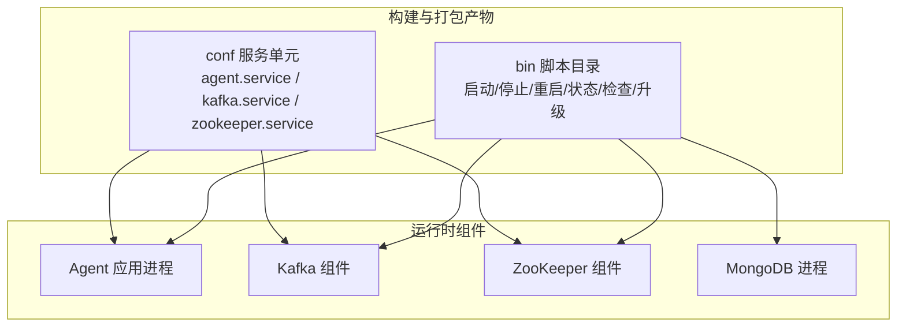
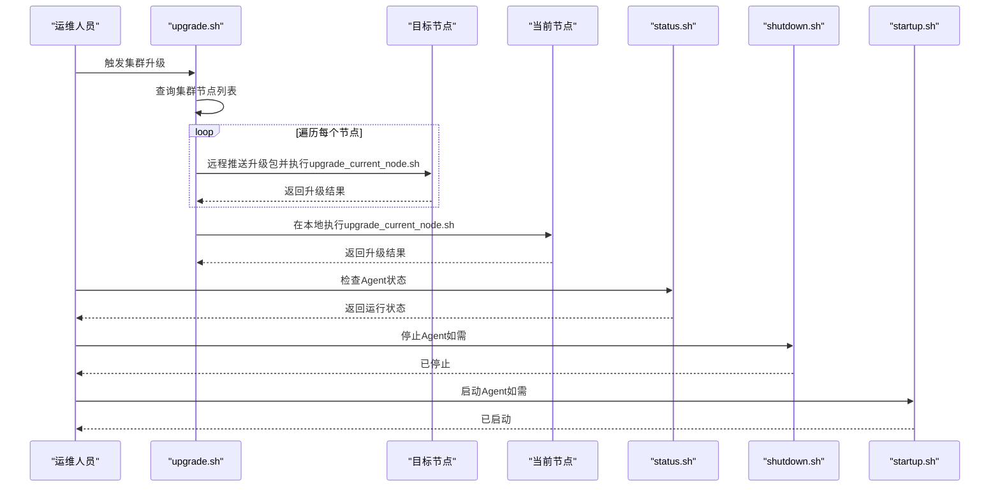
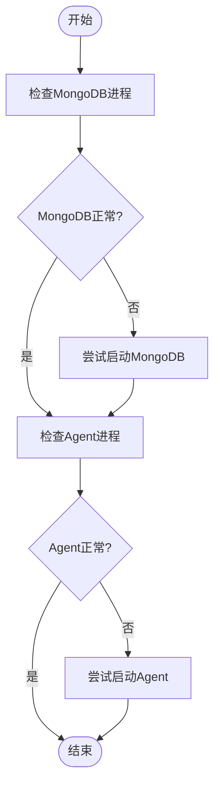
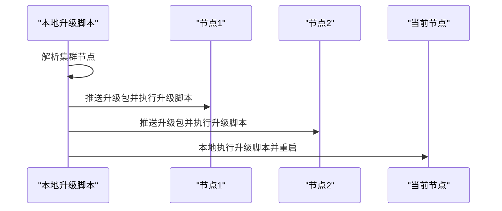
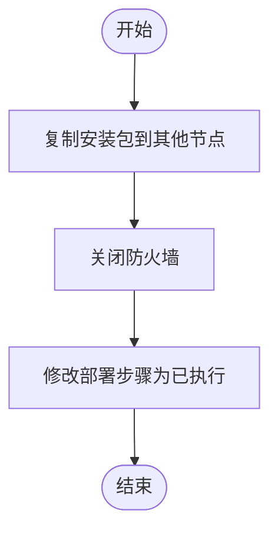
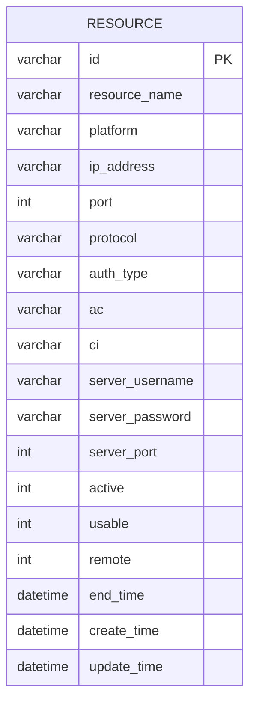
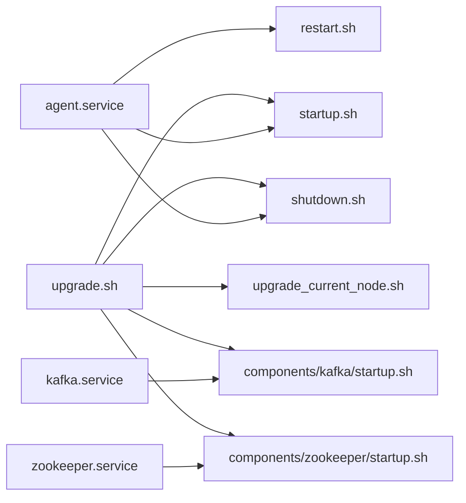

# 集群扩缩容操作

<cite>
**本文引用的文件**
- [init.sh](file://watcher-builder/assembly/bin/init.sh)
- [startup.sh](file://watcher-builder/assembly/bin/startup.sh)
- [shutdown.sh](file://watcher-builder/assembly/bin/shutdown.sh)
- [restart.sh](file://watcher-builder/assembly/bin/restart.sh)
- [status.sh](file://watcher-builder/assembly/bin/status.sh)
- [check.sh](file://watcher-builder/assembly/bin/check.sh)
- [upgrade.sh](file://watcher-builder/assembly/bin/upgrade.sh)
- [upgrade_current_node.sh](file://watcher-builder/assembly/bin/upgrade_current_node.sh)
- [agent.service](file://watcher-builder/assembly/conf/agent.service)
- [kafka.service](file://watcher-builder/assembly/conf/kafka.service)
- [zookeeper.service](file://watcher-builder/assembly/conf/zookeeper.service)
- [ClusterService.java](file://watcher-agent/src/main/java/com/virtual/cloud/om/agent/service/deploy/ClusterService.java)
- [BatchDeployVO.java](file://watcher-sdk/src/main/java/com/virtual/cloud/om/sdk/dto/deploy/BatchDeployVO.java)
- [DeployVO.java](file://watcher-sdk/src/main/java/com/virtual/cloud/om/sdk/dto/deploy/DeployVO.java)
- [schema-mysql.sql](file://watcher-agent/src/main/resources/schema-mysql.sql)
</cite>

## 目录
1. [简介](#简介)
2. [项目结构](#项目结构)
3. [核心组件](#核心组件)
4. [架构总览](#架构总览)
5. [详细组件分析](#详细组件分析)
6. [依赖关系分析](#依赖关系分析)
7. [性能考量](#性能考量)
8. [故障排查指南](#故障排查指南)
9. [结论](#结论)
10. [附录](#附录)

## 简介
本指南面向ShowTime监控系统运维工程师，提供集群扩缩容与滚动升级的完整操作手册。内容涵盖：
- 水平扩展：新增节点的准备、配置与加入流程
- 垂直扩展：JVM内存与GC参数的资源调整方法
- 缩容安全：节点退出与数据迁移策略
- 滚动升级：无感升级策略与实施步骤
- 容量评估与风险分析：基于系统组件与资源模型的评估方法
- 扩缩容监控与验证：健康检查、状态检测与日志审计
- 性能调优与配置优化：JVM、GC、线程池与连接参数
- 自动化脚本与工具：安装初始化、启停、重启、状态查询与升级

## 项目结构
围绕扩缩容与滚动升级的关键文件主要分布在以下模块：
- watcher-builder/assembly/bin：安装、启停、重启、状态、健康检查与升级脚本
- watcher-builder/assembly/conf：systemd服务单元定义（Agent、Kafka、ZooKeeper）
- watcher-agent：集群部署服务逻辑与数据库资源表结构
- watcher-sdk：部署与资源模型的数据传输对象（DTO）

图表来源
- [startup.sh](file://watcher-builder/assembly/bin/startup.sh#L78)
- [shutdown.sh](file://watcher-builder/assembly/bin/shutdown.sh#L22)
- [restart.sh](file://watcher-builder/assembly/bin/restart.sh#L8)
- [status.sh:3-8](file://watcher-builder/assembly/bin/status.sh#L3-L8)
- [check.sh:5-19](file://watcher-builder/assembly/bin/check.sh#L5-L19)
- [agent.service:7-9](file://watcher-builder/assembly/conf/agent.service#L7-L9)
- [kafka.service:7-9](file://watcher-builder/assembly/conf/kafka.service#L7-L9)
- [zookeeper.service:7-9](file://watcher-builder/assembly/conf/zookeeper.service#L7-L9)

章节来源
- [init.sh:1-35](file://watcher-builder/assembly/bin/init.sh#L1-L35)
- [startup.sh:1-81](file://watcher-builder/assembly/bin/startup.sh#L1-L81)
- [shutdown.sh:1-26](file://watcher-builder/assembly/bin/shutdown.sh#L1-L26)
- [restart.sh:1-9](file://watcher-builder/assembly/bin/restart.sh#L1-L9)
- [status.sh:1-10](file://watcher-builder/assembly/bin/status.sh#L1-L10)
- [check.sh:1-27](file://watcher-builder/assembly/bin/check.sh#L1-L27)
- [upgrade.sh:1-53](file://watcher-builder/assembly/bin/upgrade.sh#L1-L53)
- [upgrade_current_node.sh:1-44](file://watcher-builder/assembly/bin/upgrade_current_node.sh#L1-L44)
- [agent.service:1-14](file://watcher-builder/assembly/conf/agent.service#L1-L14)
- [kafka.service:1-14](file://watcher-builder/assembly/conf/kafka.service#L1-L14)
- [zookeeper.service:1-14](file://watcher-builder/assembly/conf/zookeeper.service#L1-L14)

## 核心组件
- 启停与状态管理：通过bin目录下的脚本控制Agent进程生命周期；status脚本用于快速判断Agent运行状态；check脚本负责定时巡检并自动修复异常。
- 升级机制：upgrade.sh遍历集群节点并远程执行upgrade_current_node.sh完成升级；当前节点在本地执行相同脚本后重启服务。
- systemd集成：agent.service、kafka.service、zookeeper.service定义了各组件的启动、重启与停止命令，便于系统级管理。
- 集群部署服务：ClusterService封装多节点批量部署流程，包含复制包、关闭防火墙、修改步骤等关键步骤。
- 数据模型：BatchDeployVO与DeployVO描述多节点部署的输入参数；resource表记录资源信息，支撑扩容后的资源注册与发现。

章节来源
- [startup.sh:62-72](file://watcher-builder/assembly/bin/startup.sh#L62-L72)
- [status.sh:3-8](file://watcher-builder/assembly/bin/status.sh#L3-L8)
- [check.sh:5-19](file://watcher-builder/assembly/bin/check.sh#L5-L19)
- [upgrade.sh:18-43](file://watcher-builder/assembly/bin/upgrade.sh#L18-L43)
- [upgrade_current_node.sh:24-35](file://watcher-builder/assembly/bin/upgrade_current_node.sh#L24-L35)
- [agent.service:7-9](file://watcher-builder/assembly/conf/agent.service#L7-L9)
- [ClusterService.java:56-67](file://watcher-agent/src/main/java/com/virtual/cloud/om/agent/service/deploy/ClusterService.java#L56-L67)
- [BatchDeployVO.java:16-38](file://watcher-sdk/src/main/java/com/virtual/cloud/om/sdk/dto/deploy/BatchDeployVO.java#L16-L38)
- [DeployVO.java:11-33](file://watcher-sdk/src/main/java/com/virtual/cloud/om/sdk/dto/deploy/DeployVO.java#L11-L33)
- [schema-mysql.sql:156-176](file://watcher-agent/src/main/resources/schema-mysql.sql#L156-L176)

## 架构总览
下图展示扩缩容与滚动升级涉及的组件交互与控制流：

图表来源
- [upgrade.sh:18-43](file://watcher-builder/assembly/bin/upgrade.sh#L18-L43)
- [upgrade_current_node.sh:24-35](file://watcher-builder/assembly/bin/upgrade_current_node.sh#L24-L35)
- [status.sh:3-8](file://watcher-builder/assembly/bin/status.sh#L3-L8)
- [shutdown.sh](file://watcher-builder/assembly/bin/shutdown.sh#L22)
- [startup.sh](file://watcher-builder/assembly/bin/startup.sh#L78)

## 详细组件分析

### 启停与健康检查组件
- 启动脚本：设置JVM内存与GC参数，加载配置与插件，以nohup方式启动Agent进程。
- 停止脚本：通过进程标志匹配终止Agent进程。
- 重启脚本：先停止再启动，保证配置变更生效。
- 状态脚本：基于进程名匹配判断Agent运行状态。
- 健康检查脚本：定时检查MongoDB与Agent进程，异常时自动尝试修复或重启。

图表来源
- [check.sh:5-19](file://watcher-builder/assembly/bin/check.sh#L5-L19)

章节来源
- [startup.sh:62-72](file://watcher-builder/assembly/bin/startup.sh#L62-L72)
- [shutdown.sh](file://watcher-builder/assembly/bin/shutdown.sh#L22)
- [restart.sh:6-8](file://watcher-builder/assembly/bin/restart.sh#L6-L8)
- [status.sh:3-8](file://watcher-builder/assembly/bin/status.sh#L3-L8)
- [check.sh:5-19](file://watcher-builder/assembly/bin/check.sh#L5-L19)

### 升级组件
- 集群升级：从本地读取集群节点列表，逐台推送升级包并执行升级脚本，最后升级当前节点并重启。
- 当前节点升级：复制bin/lib/plugins/conf等目录，保留关键配置，然后重启服务。

图表来源
- [upgrade.sh:28-43](file://watcher-builder/assembly/bin/upgrade.sh#L28-L43)
- [upgrade_current_node.sh:24-35](file://watcher-builder/assembly/bin/upgrade_current_node.sh#L24-L35)

章节来源
- [upgrade.sh:1-53](file://watcher-builder/assembly/bin/upgrade.sh#L1-L53)
- [upgrade_current_node.sh:1-44](file://watcher-builder/assembly/bin/upgrade_current_node.sh#L1-L44)

### 集群部署服务
- 多节点部署：支持主节点与两个从节点的批量部署，包含复制安装包、关闭防火墙、修改部署步骤等。
- 步骤化流程：通过内部步骤常量控制部署阶段，避免重复执行。

图表来源
- [ClusterService.java:61-67](file://watcher-agent/src/main/java/com/virtual/cloud/om/agent/service/deploy/ClusterService.java#L61-L67)

章节来源
- [ClusterService.java:56-67](file://watcher-agent/src/main/java/com/virtual/cloud/om/agent/service/deploy/ClusterService.java#L56-L67)

### 数据模型与资源注册
- 批量部署DTO：包含VIP、掩码与节点列表，提供主/从节点访问方法。
- 节点部署DTO：包含IP、用户名、密码与是否主节点标记。
- 资源表：记录资源ID、名称、平台、IP、端口、协议、认证信息、SSH权限与可用性等字段，支撑扩容后的资源登记。

图表来源
- [schema-mysql.sql:156-176](file://watcher-agent/src/main/resources/schema-mysql.sql#L156-L176)

章节来源
- [BatchDeployVO.java:16-38](file://watcher-sdk/src/main/java/com/virtual/cloud/om/sdk/dto/deploy/BatchDeployVO.java#L16-L38)
- [DeployVO.java:11-33](file://watcher-sdk/src/main/java/com/virtual/cloud/om/sdk/dto/deploy/DeployVO.java#L11-L33)
- [schema-mysql.sql:156-176](file://watcher-agent/src/main/resources/schema-mysql.sql#L156-L176)

## 依赖关系分析
- Agent进程由systemd服务单元管理，启动/重启/停止命令指向bin目录脚本。
- 升级脚本依赖远程SSH与文件分发工具，需要正确配置免密或凭据。
- 健康检查脚本依赖进程名匹配与组件启动脚本，确保异常可自愈。

图表来源
- [agent.service:7-9](file://watcher-builder/assembly/conf/agent.service#L7-L9)
- [kafka.service:7-9](file://watcher-builder/assembly/conf/kafka.service#L7-L9)
- [zookeeper.service:7-9](file://watcher-builder/assembly/conf/zookeeper.service#L7-L9)
- [upgrade.sh:35-36](file://watcher-builder/assembly/bin/upgrade.sh#L35-L36)
- [upgrade_current_node.sh:24-35](file://watcher-builder/assembly/bin/upgrade_current_node.sh#L24-L35)

章节来源
- [agent.service:1-14](file://watcher-builder/assembly/conf/agent.service#L1-L14)
- [kafka.service:1-14](file://watcher-builder/assembly/conf/kafka.service#L1-L14)
- [zookeeper.service:1-14](file://watcher-builder/assembly/conf/zookeeper.service#L1-L14)
- [upgrade.sh:1-53](file://watcher-builder/assembly/bin/upgrade.sh#L1-L53)
- [upgrade_current_node.sh:1-44](file://watcher-builder/assembly/bin/upgrade_current_node.sh#L1-L44)

## 性能考量
- JVM内存与GC参数：启动脚本中设置了堆大小与GC日志轮转参数，建议根据节点负载与数据量调整-Xmx/-Xms与GC日志策略。
- 线程池与并发：SDK层存在线程池与拒绝策略实现，建议结合业务峰值流量评估线程池容量与队列长度。
- 连接与超时：升级脚本中对HTTP请求头进行了设置，建议在高延迟网络环境下适当增加超时参数。
- 存储与IO：监控脚本关注MongoDB进程，建议同时关注磁盘IO与文件系统空间，避免因IO瓶颈导致Agent异常。

章节来源
- [startup.sh:62-72](file://watcher-builder/assembly/bin/startup.sh#L62-L72)
- [upgrade.sh](file://watcher-builder/assembly/bin/upgrade.sh#L18)

## 故障排查指南
- Agent未运行
  - 使用status脚本确认状态；若未运行，执行startup.sh启动。
  - 若持续失败，查看logs目录下的错误输出与GC日志。
- MongoDB异常
  - check.sh会自动尝试启动组件；若失败，检查配置与端口占用。
- 升级失败
  - 检查upgrade.sh输出日志，确认远程节点可达与凭据正确。
  - 在目标节点执行upgrade_current_node.sh验证本地升级流程。
- 服务不可用
  - 通过systemd服务单元的ExecStart/ExecReload/ExecStop定位实际命令。
  - 结合status与check脚本进行交叉验证。

章节来源
- [status.sh:3-8](file://watcher-builder/assembly/bin/status.sh#L3-L8)
- [check.sh:5-19](file://watcher-builder/assembly/bin/check.sh#L5-L19)
- [startup.sh](file://watcher-builder/assembly/bin/startup.sh#L78)
- [upgrade.sh:18-43](file://watcher-builder/assembly/bin/upgrade.sh#L18-L43)
- [upgrade_current_node.sh:24-35](file://watcher-builder/assembly/bin/upgrade_current_node.sh#L24-L35)
- [agent.service:7-9](file://watcher-builder/assembly/conf/agent.service#L7-L9)

## 结论
通过标准化的脚本与systemd服务集成，ShowTime监控系统实现了对Agent进程与周边组件的全生命周期管理。结合集群部署服务与升级脚本，可安全地完成水平扩展、垂直扩展与滚动升级。建议在实施扩缩容前进行容量评估与风险演练，并在过程中持续监控健康检查与日志输出，确保服务稳定与性能达标。

## 附录

### 水平扩展：新增节点实施步骤
- 准备阶段
  - 确认新节点网络连通性与SSH免密配置。
  - 备份现有集群配置与数据。
- 部署阶段
  - 使用集群部署服务复制安装包至新节点，关闭防火墙以便部署。
  - 在新节点执行初始化脚本完成安装与注册。
- 加入阶段
  - 将新节点加入集群，确保VIP与网络配置一致。
  - 通过状态检查脚本确认新节点上线。
- 验证阶段
  - 对比历史指标，确认新节点负载均衡生效。

章节来源
- [ClusterService.java:61-67](file://watcher-agent/src/main/java/com/virtual/cloud/om/agent/service/deploy/ClusterService.java#L61-L67)
- [init.sh:17-20](file://watcher-builder/assembly/bin/init.sh#L17-L20)

### 垂直扩展：资源配置调整方法
- JVM参数
  - 在启动脚本中调整-Xmx/-Xms与GC相关参数，按节点负载与内存容量评估。
- 线程池
  - 参考SDK线程池实现，结合业务峰值流量调整核心线程数与队列长度。
- 连接参数
  - 升级脚本中对HTTP请求头进行了设置，建议在网络环境不佳时增加超时参数。

章节来源
- [startup.sh:62-72](file://watcher-builder/assembly/bin/startup.sh#L62-L72)
- [upgrade.sh](file://watcher-builder/assembly/bin/upgrade.sh#L18)

### 缩容安全：节点退出与数据迁移
- 维护模式
  - 将目标节点置于维护模式，停止接收新任务。
- 数据迁移
  - 确保数据副本与一致性满足要求，逐步迁移工作负载。
- 节点退出
  - 从集群配置中移除节点，清理资源表记录。
- 验证
  - 通过监控与日志确认缩容后系统稳定性。

章节来源
- [schema-mysql.sql:156-176](file://watcher-agent/src/main/resources/schema-mysql.sql#L156-L176)

### 滚动升级：策略与实施
- 策略
  - 逐节点升级，保持至少一个节点在线以维持服务。
- 实施
  - 使用upgrade.sh遍历节点，远程推送并执行upgrade_current_node.sh。
  - 升级完成后检查Agent状态，必要时手动重启。

章节来源
- [upgrade.sh:28-43](file://watcher-builder/assembly/bin/upgrade.sh#L28-L43)
- [upgrade_current_node.sh:24-35](file://watcher-builder/assembly/bin/upgrade_current_node.sh#L24-L35)

### 容量评估与风险分析
- 评估维度
  - 节点数量与CPU/内存/存储资源
  - 网络带宽与延迟
  - 数据量增长与查询峰值
- 风险识别
  - 升级期间单点故障风险
  - 网络抖动导致的部署失败
  - GC压力与OOM风险

章节来源
- [startup.sh:62-72](file://watcher-builder/assembly/bin/startup.sh#L62-L72)
- [upgrade.sh](file://watcher-builder/assembly/bin/upgrade.sh#L18)

### 扩缩容监控与验证
- 进程监控
  - 使用status与check脚本定期巡检Agent与MongoDB。
- 日志审计
  - 关注logs目录下的错误输出与GC日志，定位异常。
- 指标对比
  - 对比扩缩容前后关键指标，确认系统健康。

章节来源
- [status.sh:3-8](file://watcher-builder/assembly/bin/status.sh#L3-L8)
- [check.sh:5-19](file://watcher-builder/assembly/bin/check.sh#L5-L19)
- [startup.sh](file://watcher-builder/assembly/bin/startup.sh#L78)

### 性能调优与配置优化建议
- JVM与GC
  - 根据负载调整堆大小与GC日志轮转策略。
- 线程池
  - 结合业务流量调整线程池参数，避免过载或饥饿。
- 连接与超时
  - 在高延迟网络中适当增加超时参数，提升稳定性。

章节来源
- [startup.sh:62-72](file://watcher-builder/assembly/bin/startup.sh#L62-L72)
- [upgrade.sh](file://watcher-builder/assembly/bin/upgrade.sh#L18)

### 自动化扩缩容脚本与工具使用
- 初始化与安装
  - 使用init.sh完成首次安装与服务注册。
- 启停与重启
  - 使用startup.sh、shutdown.sh与restart.sh管理Agent进程。
- 状态与健康检查
  - 使用status.sh与check.sh进行状态查询与自动修复。
- 升级
  - 使用upgrade.sh与upgrade_current_node.sh完成集群滚动升级。
- systemd集成
  - 通过agent.service、kafka.service、zookeeper.service实现系统级管理。

章节来源
- [init.sh:1-35](file://watcher-builder/assembly/bin/init.sh#L1-L35)
- [startup.sh:1-81](file://watcher-builder/assembly/bin/startup.sh#L1-L81)
- [shutdown.sh:1-26](file://watcher-builder/assembly/bin/shutdown.sh#L1-L26)
- [restart.sh:1-9](file://watcher-builder/assembly/bin/restart.sh#L1-L9)
- [status.sh:1-10](file://watcher-builder/assembly/bin/status.sh#L1-L10)
- [check.sh:1-27](file://watcher-builder/assembly/bin/check.sh#L1-L27)
- [upgrade.sh:1-53](file://watcher-builder/assembly/bin/upgrade.sh#L1-L53)
- [upgrade_current_node.sh:1-44](file://watcher-builder/assembly/bin/upgrade_current_node.sh#L1-L44)
- [agent.service:1-14](file://watcher-builder/assembly/conf/agent.service#L1-L14)
- [kafka.service:1-14](file://watcher-builder/assembly/conf/kafka.service#L1-L14)
- [zookeeper.service:1-14](file://watcher-builder/assembly/conf/zookeeper.service#L1-L14)