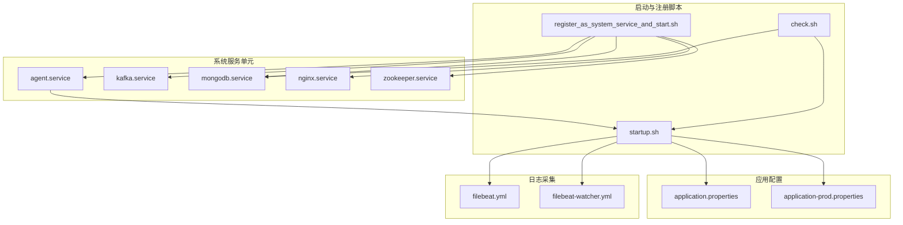
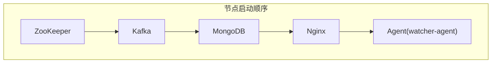
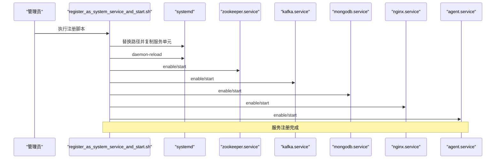

# 集群节点配置

<cite>
**本文引用的文件**
- [agent.service](file://watcher-builder/assembly/conf/agent.service)
- [kafka.service](file://watcher-builder/assembly/conf/kafka.service)
- [mongodb.service](file://watcher-builder/assembly/conf/mongodb.service)
- [nginx.service](file://watcher-builder/assembly/conf/nginx.service)
- [zookeeper.service](file://watcher-builder/assembly/conf/zookeeper.service)
- [startup.sh](file://watcher-builder/assembly/bin/startup.sh)
- [register_as_system_service_and_start.sh](file://watcher-builder/assembly/bin/register_as_system_service_and_start.sh)
- [check.sh](file://watcher-builder/assembly/bin/check.sh)
- [application.properties](file://watcher-agent/src/main/resources/application.properties)
- [application-prod.properties](file://watcher-agent/src/main/resources/application-prod.properties)
- [filebeat.yml](file://watcher-builder/assembly/components/filebeat/filebeat-8.0.1-linux-x86_64/filebeat.yml)
- [filebeat-watcher.yml](file://watcher-builder/assembly/components/filebeat/filebeat-8.0.1-linux-x86_64/filebeat-watcher.yml)
</cite>

## 目录
1. [简介](#简介)
2. [项目结构](#项目结构)
3. [核心组件](#核心组件)
4. [架构总览](#架构总览)
5. [详细组件分析](#详细组件分析)
6. [依赖关系分析](#依赖关系分析)
7. [性能考虑](#性能考虑)
8. [故障排除指南](#故障排除指南)
9. [结论](#结论)
10. [附录](#附录)

## 简介
本指南面向ShowTime监控系统的集群部署与运维，聚焦三类节点：监控代理节点、数据存储节点、管理节点。文档从硬件与软件依赖出发，系统梳理systemd服务配置、进程参数与资源限制、网络端口与安全策略，并给出节点发现与注册机制、配置验证与故障排除流程，以及配置模板的使用与自定义方法。

## 项目结构
围绕集群节点配置的关键目录与文件如下：
- systemd服务单元：agent.service、kafka.service、mongodb.service、nginx.service、zookeeper.service
- 启动与注册脚本：startup.sh、register_as_system_service_and_start.sh、check.sh
- 应用配置：application.properties（默认）、application-prod.properties（生产）
- 日志采集：filebeat.yml、filebeat-watcher.yml

图表来源
- [agent.service:1-14](file://watcher-builder/assembly/conf/agent.service#L1-L14)
- [kafka.service:1-14](file://watcher-builder/assembly/conf/kafka.service#L1-L14)
- [mongodb.service:1-14](file://watcher-builder/assembly/conf/mongodb.service#L1-L14)
- [nginx.service:1-14](file://watcher-builder/assembly/conf/nginx.service#L1-L14)
- [zookeeper.service:1-14](file://watcher-builder/assembly/conf/zookeeper.service#L1-L14)
- [register_as_system_service_and_start.sh:1-45](file://watcher-builder/assembly/bin/register_as_system_service_and_start.sh#L1-L45)
- [startup.sh:1-81](file://watcher-builder/assembly/bin/startup.sh#L1-L81)
- [application.properties:1-80](file://watcher-agent/src/main/resources/application.properties#L1-L80)
- [application-prod.properties:1-70](file://watcher-agent/src/main/resources/application-prod.properties#L1-L70)
- [filebeat.yml](file://watcher-builder/assembly/components/filebeat/filebeat-8.0.1-linux-x86_64/filebeat.yml)
- [filebeat-watcher.yml](file://watcher-builder/assembly/components/filebeat/filebeat-8.0.1-linux-x86_64/filebeat-watcher.yml)

章节来源
- [agent.service:1-14](file://watcher-builder/assembly/conf/agent.service#L1-L14)
- [register_as_system_service_and_start.sh:1-45](file://watcher-builder/assembly/bin/register_as_system_service_and_start.sh#L1-L45)
- [startup.sh:1-81](file://watcher-builder/assembly/bin/startup.sh#L1-L81)
- [application.properties:1-80](file://watcher-agent/src/main/resources/application.properties#L1-L80)
- [application-prod.properties:1-70](file://watcher-agent/src/main/resources/application-prod.properties#L1-L70)
- [filebeat.yml](file://watcher-builder/assembly/components/filebeat/filebeat-8.0.1-linux-x86_64/filebeat.yml)
- [filebeat-watcher.yml](file://watcher-builder/assembly/components/filebeat/filebeat-8.0.1-linux-x86_64/filebeat-watcher.yml)

## 核心组件
- 监控代理节点
  - 运行watcher-agent服务，负责指标采集、任务调度、日志上报等。
  - systemd单元：agent.service；启动脚本：startup.sh；应用配置：application.properties、application-prod.properties。
- 数据存储节点
  - 运行MongoDB、Kafka、ZooKeeper、Nginx等中间件，支撑元数据、消息队列、协调与反向代理。
  - systemd单元：mongodb.service、kafka.service、zookeeper.service、nginx.service。
- 管理节点
  - 提供统一管理与控制能力，通常与监控代理节点共存或独立部署，负责注册、发现与运维。

章节来源
- [agent.service:1-14](file://watcher-builder/assembly/conf/agent.service#L1-L14)
- [kafka.service:1-14](file://watcher-builder/assembly/conf/kafka.service#L1-L14)
- [mongodb.service:1-14](file://watcher-builder/assembly/conf/mongodb.service#L1-L14)
- [nginx.service:1-14](file://watcher-builder/assembly/conf/nginx.service#L1-L14)
- [zookeeper.service:1-14](file://watcher-builder/assembly/conf/zookeeper.service#L1-L14)
- [startup.sh:1-81](file://watcher-builder/assembly/bin/startup.sh#L1-L81)
- [application.properties:1-80](file://watcher-agent/src/main/resources/application.properties#L1-L80)
- [application-prod.properties:1-70](file://watcher-agent/src/main/resources/application-prod.properties#L1-L70)

## 架构总览
下图展示集群节点在systemd下的运行关系与依赖顺序：

图表来源
- [zookeeper.service:1-14](file://watcher-builder/assembly/conf/zookeeper.service#L1-L14)
- [kafka.service:1-14](file://watcher-builder/assembly/conf/kafka.service#L1-L14)
- [mongodb.service:1-14](file://watcher-builder/assembly/conf/mongodb.service#L1-L14)
- [nginx.service:1-14](file://watcher-builder/assembly/conf/nginx.service#L1-L14)
- [agent.service:1-14](file://watcher-builder/assembly/conf/agent.service#L1-L14)

## 详细组件分析

### systemd服务配置与进程参数
- 通用字段
  - 单元描述、网络就绪后启动、简单类型服务、执行入口与重启/停止命令、随多用户目标启用。
- 关键差异
  - ExecStart指向不同组件的startup.sh路径，确保各组件独立启停。
  - RemainAfterExit为yes，便于通过脚本控制生命周期。
- 进程参数与资源限制
  - 启动脚本中设置JVM内存与GC相关参数，包含堆大小、GC日志轮转、堆转储路径与错误日志输出。
  - 支持通过环境变量覆盖JVM参数，便于按节点规模调整。

章节来源
- [agent.service:1-14](file://watcher-builder/assembly/conf/agent.service#L1-L14)
- [kafka.service:1-14](file://watcher-builder/assembly/conf/kafka.service#L1-L14)
- [mongodb.service:1-14](file://watcher-builder/assembly/conf/mongodb.service#L1-L14)
- [nginx.service:1-14](file://watcher-builder/assembly/conf/nginx.service#L1-L14)
- [zookeeper.service:1-14](file://watcher-builder/assembly/conf/zookeeper.service#L1-L14)
- [startup.sh:60-78](file://watcher-builder/assembly/bin/startup.sh#L60-L78)

### 启动与注册流程（注册为系统服务并启动）
- 注册步骤
  - 写入watcher根目录到/etc/watcher_home；
  - 使用sed将服务单元中的路径占位符替换为实际路径；
  - 复制服务单元至/etc/systemd/system；
  - 执行daemon-reload；
  - 按顺序启用并启动ZooKeeper、Kafka、MongoDB、Nginx、Agent。
- 自检与恢复
  - 定时检查脚本会检测MongoDB与Agent进程状态，若异常则自动重启对应组件。

图表来源
- [register_as_system_service_and_start.sh:1-45](file://watcher-builder/assembly/bin/register_as_system_service_and_start.sh#L1-L45)
- [zookeeper.service:1-14](file://watcher-builder/assembly/conf/zookeeper.service#L1-L14)
- [kafka.service:1-14](file://watcher-builder/assembly/conf/kafka.service#L1-L14)
- [mongodb.service:1-14](file://watcher-builder/assembly/conf/mongodb.service#L1-L14)
- [nginx.service:1-14](file://watcher-builder/assembly/conf/nginx.service#L1-L14)
- [agent.service:1-14](file://watcher-builder/assembly/conf/agent.service#L1-L14)

章节来源
- [register_as_system_service_and_start.sh:1-45](file://watcher-builder/assembly/bin/register_as_system_service_and_start.sh#L1-L45)

### 应用配置文件结构与关键项
- 默认配置（application.properties）
  - 服务器端口、上下文路径、管理端点暴露、中间件与插件模块开关、数据库连接、CAS/UIS/Workspace/OneStor服务地址占位。
- 生产配置（application-prod.properties）
  - MongoDB连接串（含副本集）、Kafka集群地址、Elasticsearch连接参数、数据中心端口、批量采集日志根路径、REST客户端开关与端口占位、认证账户、OneStor服务地址与端口、ClickHouse连接参数。

章节来源
- [application.properties:1-80](file://watcher-agent/src/main/resources/application.properties#L1-L80)
- [application-prod.properties:1-70](file://watcher-agent/src/main/resources/application-prod.properties#L1-L70)

### 日志采集配置
- filebeat.yml：基础采集器配置，定义输入、过滤与输出。
- filebeat-watcher.yml：针对监控系统的定制化采集规则，建议结合节点角色选择性启用。

章节来源
- [filebeat.yml](file://watcher-builder/assembly/components/filebeat/filebeat-8.0.1-linux-x86_64/filebeat.yml)
- [filebeat-watcher.yml](file://watcher-builder/assembly/components/filebeat/filebeat-8.0.1-linux-x86_64/filebeat-watcher.yml)

## 依赖关系分析
- 组件耦合
  - Agent依赖ZooKeeper/Kafka/MongoDB/Nginx的可用性；ZooKeeper先于Kafka启动，Kafka先于MongoDB启动，形成稳定的依赖链。
- 外部依赖
  - Java运行时（版本校验）与系统包管理器（systemd）。
- 资源限制
  - JVM内存与GC参数在启动脚本中集中配置，便于统一管控。

图表来源
- [zookeeper.service:1-14](file://watcher-builder/assembly/conf/zookeeper.service#L1-L14)
- [kafka.service:1-14](file://watcher-builder/assembly/conf/kafka.service#L1-L14)
- [mongodb.service:1-14](file://watcher-builder/assembly/conf/mongodb.service#L1-L14)
- [nginx.service:1-14](file://watcher-builder/assembly/conf/nginx.service#L1-L14)
- [agent.service:1-14](file://watcher-builder/assembly/conf/agent.service#L1-L14)

章节来源
- [startup.sh:1-81](file://watcher-builder/assembly/bin/startup.sh#L1-L81)

## 性能考虑
- JVM参数调优
  - 建议根据节点负载与内存容量调整堆大小与GC策略参数，避免频繁Full GC与OOM。
- 磁盘与日志
  - GC与堆转储日志路径需挂载高IO磁盘，定期清理避免空间耗尽。
- 中间件并发
  - Elasticsearch连接超时、最大连接数与每路由最大连接数应结合吞吐量调优。
- 网络带宽
  - Kafka与Elasticsearch的网络带宽应满足指标与日志峰值写入需求。

## 故障排除指南
- 服务未启动
  - 检查systemd单元是否正确复制与重载；确认ExecStart路径与环境变量。
- Agent进程异常
  - 使用定时检查脚本定位问题；若进程标志缺失则自动重启Agent。
- MongoDB异常
  - 检查日志采集与健康状态；若停止则自动重启组件。
- 端口冲突
  - 核对各组件监听端口与防火墙放行情况；避免与宿主其他服务冲突。
- 配置不生效
  - 确认profile与配置文件加载顺序；检查spring.config.location与Docker/容器环境变量覆盖。

章节来源
- [check.sh:1-27](file://watcher-builder/assembly/bin/check.sh#L1-L27)
- [startup.sh:1-81](file://watcher-builder/assembly/bin/startup.sh#L1-L81)
- [application.properties:1-80](file://watcher-agent/src/main/resources/application.properties#L1-L80)
- [application-prod.properties:1-70](file://watcher-agent/src/main/resources/application-prod.properties#L1-L70)

## 结论
通过标准化的systemd服务单元、可调的JVM参数与完善的自检恢复机制，ShowTime监控系统可在不同节点角色上实现稳定、可扩展的集群部署。建议在生产环境中严格遵循端口与安全策略、定期评估性能参数，并建立自动化巡检与告警体系。

## 附录

### 节点类型与配置差异概览
- 监控代理节点
  - 角色：采集与上报
  - 关键配置：Agent端口、中间件开关、数据库与插件地址
  - 进程参数：JVM内存与GC
- 数据存储节点
  - 角色：协调、消息、存储、反向代理
  - 关键配置：ZooKeeper/Kafka/MongoDB/Nginx端口与集群地址
  - 进程参数：JVM与线程池参数（如适用）
- 管理节点
  - 角色：注册、发现、运维
  - 关键配置：REST客户端开关与端口、认证账户
  - 进程参数：JVM与连接池参数

章节来源
- [application.properties:1-80](file://watcher-agent/src/main/resources/application.properties#L1-L80)
- [application-prod.properties:1-70](file://watcher-agent/src/main/resources/application-prod.properties#L1-L70)
- [startup.sh:60-78](file://watcher-builder/assembly/bin/startup.sh#L60-L78)

### 网络配置与安全建议
- 端口开放
  - Agent：HTTP端口（默认）、调试端口（如启用）
  - ZooKeeper：集群通信端口
  - Kafka：Broker端口、控制器端口
  - MongoDB：数据库端口
  - Nginx：反向代理端口
- 防火墙与安全组
  - 仅放行必要端口；对管理端口进行白名单控制；启用TLS与认证。
- 节点发现与注册
  - 使用配置文件中的集群地址与端口；确保DNS或hosts解析一致；在注册脚本中完成服务单元替换与启用。

章节来源
- [application-prod.properties:1-70](file://watcher-agent/src/main/resources/application-prod.properties#L1-L70)
- [register_as_system_service_and_start.sh:1-45](file://watcher-builder/assembly/bin/register_as_system_service_and_start.sh#L1-L45)

### 配置模板使用与自定义
- 模板位置
  - systemd服务单元模板位于conf目录；启动脚本位于bin目录；应用配置位于resources目录；日志采集配置位于components/filebeat目录。
- 自定义步骤
  - 替换服务单元中的路径占位符为实际安装路径；
  - 调整JVM参数以适配硬件资源；
  - 在生产配置中填写真实的服务地址与端口；
  - 根据节点角色启用/禁用中间件与插件模块；
  - 配置日志采集规则以匹配监控场景。

章节来源
- [agent.service:1-14](file://watcher-builder/assembly/conf/agent.service#L1-L14)
- [register_as_system_service_and_start.sh:1-45](file://watcher-builder/assembly/bin/register_as_system_service_and_start.sh#L1-L45)
- [startup.sh:60-78](file://watcher-builder/assembly/bin/startup.sh#L60-L78)
- [application.properties:1-80](file://watcher-agent/src/main/resources/application.properties#L1-L80)
- [application-prod.properties:1-70](file://watcher-agent/src/main/resources/application-prod.properties#L1-L70)
- [filebeat.yml](file://watcher-builder/assembly/components/filebeat/filebeat-8.0.1-linux-x86_64/filebeat.yml)
- [filebeat-watcher.yml](file://watcher-builder/assembly/components/filebeat/filebeat-8.0.1-linux-x86_64/filebeat-watcher.yml)