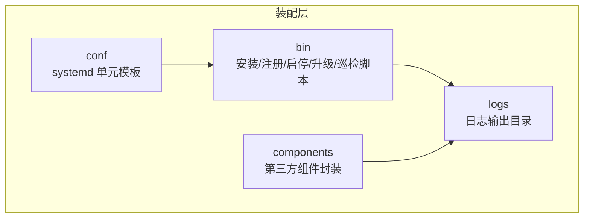
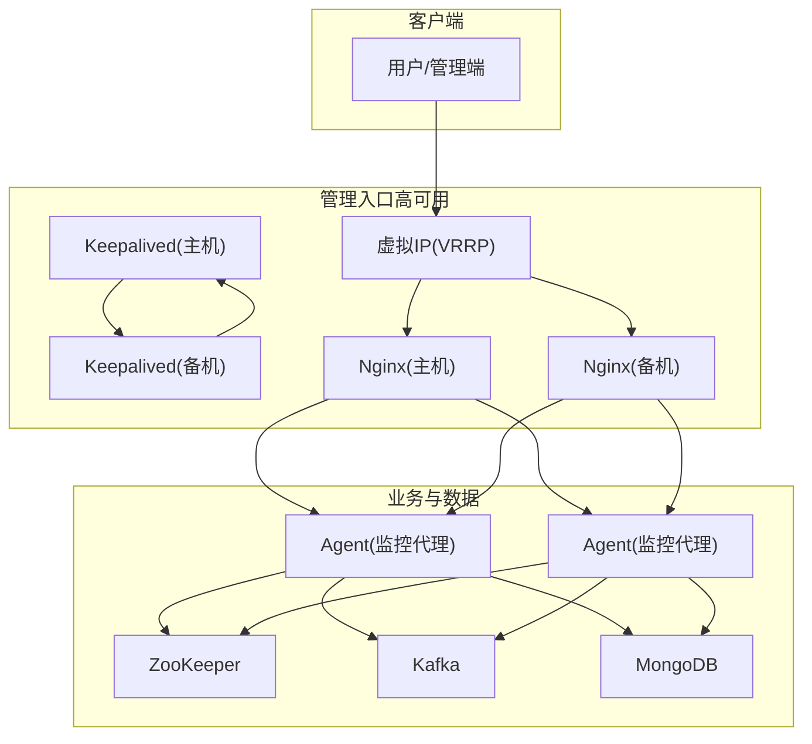
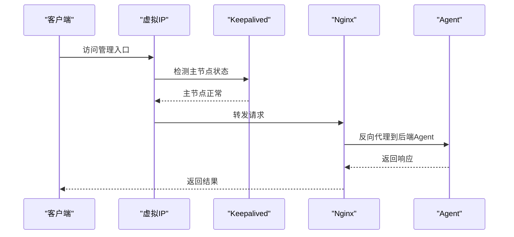
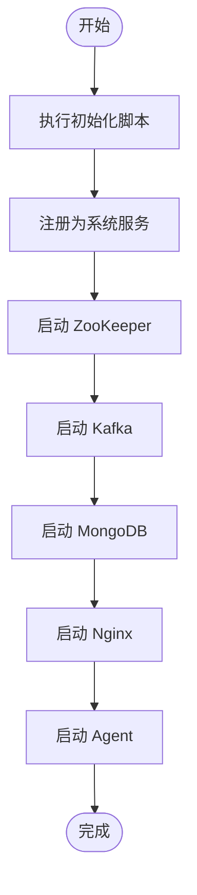
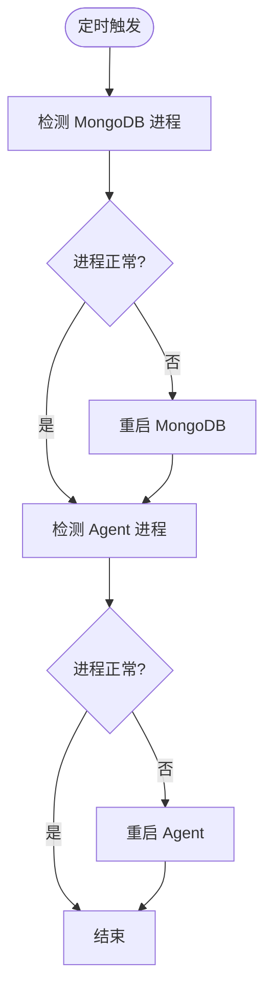
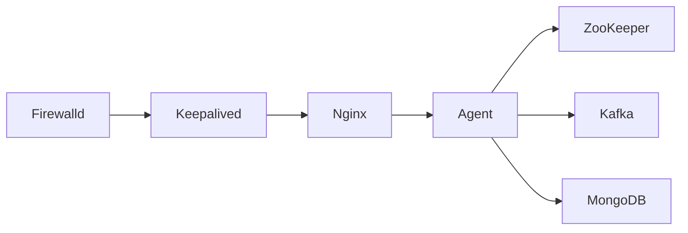
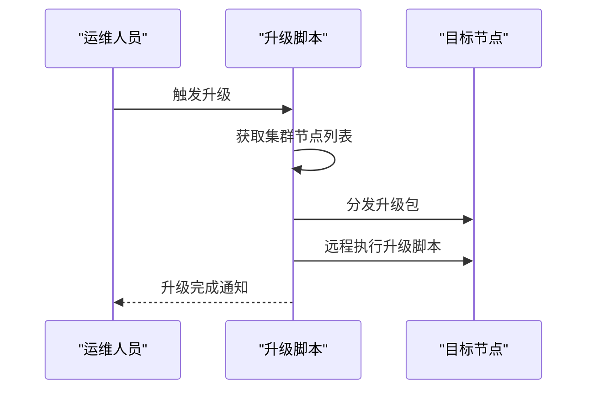

# 集群部署

<cite>
**本文引用的文件**
- [agent.service](file://watcher-builder/assembly/conf/agent.service)
- [kafka.service](file://watcher-builder/assembly/conf/kafka.service)
- [mongodb.service](file://watcher-builder/assembly/conf/mongodb.service)
- [nginx.service](file://watcher-builder/assembly/conf/nginx.service)
- [zookeeper.service](file://watcher-builder/assembly/conf/zookeeper.service)
- [keepalived.service](file://watcher-builder/assembly/conf/keepalived.service)
- [startup.sh](file://watcher-builder/assembly/bin/startup.sh)
- [init.sh](file://watcher-builder/assembly/bin/init.sh)
- [register_as_system_service_and_start.sh](file://watcher-builder/assembly/bin/register_as_system_service_and_start.sh)
- [register_keepalived_as_system_service.sh](file://watcher-builder/assembly/bin/register_keepalived_as_system_service.sh)
- [check.sh](file://watcher-builder/assembly/bin/check.sh)
- [openfirewalld.sh](file://watcher-builder/assembly/bin/openfirewalld.sh)
- [openfirewalld_single.sh](file://watcher-builder/assembly/bin/openfirewalld_single.sh)
- [upgrade.sh](file://watcher-builder/assembly/bin/upgrade.sh)
- [filebeat-watcher.yml](file://watcher-builder/assembly/components/filebeat/filebeat-8.0.1-linux-x86_64/filebeat-watcher.yml)
- [startup.sh（filebeat）](file://watcher-builder/assembly/components/filebeat/startup.sh)
</cite>

## 目录
1. [简介](#简介)
2. [项目结构](#项目结构)
3. [核心组件](#核心组件)
4. [架构总览](#架构总览)
5. [详细组件分析](#详细组件分析)
6. [依赖分析](#依赖分析)
7. [性能考虑](#性能考虑)
8. [故障排查指南](#故障排查指南)
9. [结论](#结论)
10. [附录](#附录)

## 简介
本方案面向ShowTime监控系统在生产环境的集群化部署与高可用运维，围绕“监控代理节点、数据存储节点、管理节点”的角色划分，结合Nginx反向代理与Keepalived实现高可用，提供完整的启动顺序、依赖关系、扩容缩容、健康检查、故障转移测试与灾难恢复演练、性能调优与容量规划建议。

## 项目结构
- 部署装配层位于 watcher-builder/assembly，包含服务单元文件、启动脚本、组件封装与配置模板。
- 关键目录与文件职责概览：
  - conf：各系统服务的 systemd 单元模板（agent、kafka、mongodb、nginx、zookeeper、keepalived）
  - bin：初始化、注册为系统服务、启动、停止、重启、升级、健康检查等脚本
  - components：第三方组件封装（如 filebeat）
  - logs：运行日志输出位置（由启动脚本统一创建）

**图表来源**
- [agent.service:1-14](file://watcher-builder/assembly/conf/agent.service#L1-L14)
- [startup.sh:55-58](file://watcher-builder/assembly/bin/startup.sh#L55-L58)

**章节来源**
- [agent.service:1-14](file://watcher-builder/assembly/conf/agent.service#L1-L14)
- [kafka.service:1-14](file://watcher-builder/assembly/conf/kafka.service#L1-L14)
- [mongodb.service:1-14](file://watcher-builder/assembly/conf/mongodb.service#L1-L14)
- [nginx.service:1-14](file://watcher-builder/assembly/conf/nginx.service#L1-L14)
- [zookeeper.service:1-14](file://watcher-builder/assembly/conf/zookeeper.service#L1-L14)
- [keepalived.service:1-14](file://watcher-builder/assembly/conf/keepalived.service#L1-L14)
- [startup.sh:55-58](file://watcher-builder/assembly/bin/startup.sh#L55-L58)

## 核心组件
- 监控代理节点（Agent）
  - 负责采集、上报与任务执行；通过 systemd 单元托管，随系统启动自动运行。
  - 启动脚本负责 JVM 参数、日志目录准备、Spring Profile 激活与进程守护。
- 数据存储节点（MongoDB、ZooKeeper、Kafka）
  - 作为后端数据与消息通道，提供高可用与可扩展能力。
  - systemd 单元统一管理，配合健康巡检脚本保障运行状态。
- 管理节点（Nginx + Keepalived）
  - Nginx 提供反向代理与静态资源服务；Keepalived 实现虚拟IP漂移，确保管理入口高可用。
- 日志采集（Filebeat）
  - 封装在 components 中，独立启动并按策略采集日志。

**章节来源**
- [startup.sh:74-78](file://watcher-builder/assembly/bin/startup.sh#L74-L78)
- [agent.service:5-10](file://watcher-builder/assembly/conf/agent.service#L5-L10)
- [mongodb.service:5-10](file://watcher-builder/assembly/conf/mongodb.service#L5-L10)
- [zookeeper.service:5-10](file://watcher-builder/assembly/conf/zookeeper.service#L5-L10)
- [kafka.service:5-10](file://watcher-builder/assembly/conf/kafka.service#L5-L10)
- [nginx.service:5-10](file://watcher-builder/assembly/conf/nginx.service#L5-L10)
- [keepalived.service:5-10](file://watcher-builder/assembly/conf/keepalived.service#L5-L10)
- [startup.sh（filebeat）:1-15](file://watcher-builder/assembly/components/filebeat/startup.sh#L1-L15)

## 架构总览
下图展示集群角色与组件交互关系，以及高可用路径（VIP漂移）：

**图表来源**
- [keepalived.service:1-14](file://watcher-builder/assembly/conf/keepalived.service#L1-L14)
- [nginx.service:1-14](file://watcher-builder/assembly/conf/nginx.service#L1-L14)
- [agent.service:1-14](file://watcher-builder/assembly/conf/agent.service#L1-L14)
- [zookeeper.service:1-14](file://watcher-builder/assembly/conf/zookeeper.service#L1-L14)
- [kafka.service:1-14](file://watcher-builder/assembly/conf/kafka.service#L1-L14)
- [mongodb.service:1-14](file://watcher-builder/assembly/conf/mongodb.service#L1-L14)

## 详细组件分析

### 角色分配与职责
- 监控代理节点（Agent）
  - 运行于每台被管主机或专用节点，负责指标采集、任务调度与上报。
  - systemd 单元模板定义了启动/重启/停止命令与依赖网络。
- 数据存储节点（MongoDB、ZooKeeper、Kafka）
  - MongoDB：持久化元数据与报表数据。
  - ZooKeeper：协调分布式状态与选举。
  - Kafka：异步消息通道，解耦采集与处理。
- 管理节点（Nginx + Keepalived）
  - Nginx：对外提供统一入口，反向代理到Agent节点。
  - Keepalived：通过VRRP实现VIP漂移，保证管理入口高可用。

**章节来源**
- [agent.service:1-14](file://watcher-builder/assembly/conf/agent.service#L1-L14)
- [mongodb.service:1-14](file://watcher-builder/assembly/conf/mongodb.service#L1-L14)
- [zookeeper.service:1-14](file://watcher-builder/assembly/conf/zookeeper.service#L1-L14)
- [kafka.service:1-14](file://watcher-builder/assembly/conf/kafka.service#L1-L14)
- [nginx.service:1-14](file://watcher-builder/assembly/conf/nginx.service#L1-L14)
- [keepalived.service:1-14](file://watcher-builder/assembly/conf/keepalived.service#L1-L14)

### 负载均衡与高可用配置
- Nginx 反向代理
  - systemd 单元托管，启动脚本指向组件内部的启动脚本。
  - 建议在 Nginx 层配置上游池（upstream）与健康检查，将请求分发至多个 Agent 节点。
- Keepalived 高可用
  - systemd 单元托管，启动脚本指向组件内部的启动脚本。
  - 通过 VRRP 配置主备节点与优先级，实现 VIP 自动漂移。
  - 防火墙需放行 VRRP 组播地址与管理端口。

**图表来源**
- [keepalived.service:5-10](file://watcher-builder/assembly/conf/keepalived.service#L5-L10)
- [nginx.service:5-10](file://watcher-builder/assembly/conf/nginx.service#L5-L10)
- [startup.sh:74-78](file://watcher-builder/assembly/bin/startup.sh#L74-L78)

**章节来源**
- [nginx.service:5-10](file://watcher-builder/assembly/conf/nginx.service#L5-L10)
- [keepalived.service:5-10](file://watcher-builder/assembly/conf/keepalived.service#L5-L10)
- [openfirewalld.sh:12-16](file://watcher-builder/assembly/bin/openfirewalld.sh#L12-L16)
- [openfirewalld_single.sh:7-8](file://watcher-builder/assembly/bin/openfirewalld_single.sh#L7-L8)

### 集群启动顺序与依赖关系
- 初始化与注册
  - 执行初始化脚本完成 HOME 路径写入、复制、master 节点组件启动与服务注册。
  - 注册为系统服务后，按顺序启用并启动 ZooKeeper、Kafka、MongoDB、Nginx、Agent。
- 启动顺序建议
  1) ZooKeeper（选举与协调）
  2) Kafka（消息通道）
  3) MongoDB（数据存储）
  4) Nginx（管理入口）
  5) Agent（监控代理）
- 依赖关系
  - Agent 依赖 ZooKeeper/Kafka/MongoDB 的可用性。
  - Nginx 依赖 Agent 的存活与响应。
  - Keepalived 依赖网络与防火墙策略。

**图表来源**
- [init.sh:17-20](file://watcher-builder/assembly/bin/init.sh#L17-L20)
- [register_as_system_service_and_start.sh:25-38](file://watcher-builder/assembly/bin/register_as_system_service_and_start.sh#L25-L38)

**章节来源**
- [init.sh:17-20](file://watcher-builder/assembly/bin/init.sh#L17-L20)
- [register_as_system_service_and_start.sh:25-38](file://watcher-builder/assembly/bin/register_as_system_service_and_start.sh#L25-L38)

### 集群扩容与缩容
- 扩容
  - 新增 Agent 节点：在目标主机执行初始化与注册流程，确保网络连通与防火墙放行。
  - 更新 Nginx 上游池，加入新 Agent 地址，并验证健康检查。
  - 如需提升数据层容量，按组件官方方式增加副本或分区。
- 缩容
  - 先将流量从计划下线节点迁移，再停止对应 Agent 服务。
  - 从 Nginx 上游池剔除该节点，确认其他节点负载均衡正常。
  - 对数据层进行备份与清理，避免残留元数据影响一致性。

**章节来源**
- [nginx.service:5-10](file://watcher-builder/assembly/conf/nginx.service#L5-L10)
- [startup.sh:74-78](file://watcher-builder/assembly/bin/startup.sh#L74-L78)

### 集群健康检查与状态监控
- 进程级健康检查
  - 定时巡检脚本对 MongoDB 与 Agent 进程进行检测，异常时自动重启对应组件。
  - 建议在巡检中增加 HTTP 探针（如访问 Agent 的健康接口），以更准确判断服务可用性。
- 日志与告警
  - 启动脚本统一创建 GC 与堆转储日志目录，便于问题定位。
  - 结合 Filebeat 将日志集中到统一平台，建立告警规则。

**图表来源**
- [check.sh:5-19](file://watcher-builder/assembly/bin/check.sh#L5-L19)

**章节来源**
- [check.sh:5-19](file://watcher-builder/assembly/bin/check.sh#L5-L19)
- [startup.sh:55-72](file://watcher-builder/assembly/bin/startup.sh#L55-L72)
- [startup.sh（filebeat）:1-15](file://watcher-builder/assembly/components/filebeat/startup.sh#L1-L15)
- [filebeat-watcher.yml](file://watcher-builder/assembly/components/filebeat/filebeat-8.0.1-linux-x86_64/filebeat-watcher.yml)

### 故障转移测试与灾难恢复演练
- 故障转移测试
  - 模拟主节点 Nginx 或 Keepalived 故障，验证 VIP 是否自动漂移到备机。
  - 检查备机 Nginx 能否正确转发请求至可用 Agent。
- 灾难恢复演练
  - 模拟 ZooKeeper/Kafka/MongoDB 全部宕机，验证 Agent 的降级策略与重试机制。
  - 演练完成后，逐步恢复组件并验证数据一致性与服务可用性。

**章节来源**
- [keepalived.service:5-10](file://watcher-builder/assembly/conf/keepalived.service#L5-L10)
- [nginx.service:5-10](file://watcher-builder/assembly/conf/nginx.service#L5-L10)

### 性能调优与容量规划
- JVM 与 GC
  - 启动脚本已设置固定堆大小与 GC 日志轮转参数，建议根据实际负载调整内存参数并定期分析 GC 日志。
- 并发与线程
  - 根据采集任务量与并发度，适当调整 Agent 的线程池与队列长度。
- 存储与网络
  - 数据层容量预留与 IO 抖动控制；网络带宽满足日志与指标上报峰值。
- 监控与告警
  - 建立 CPU、内存、磁盘、网络、连接数、队列长度等多维指标告警阈值。

**章节来源**
- [startup.sh:62-72](file://watcher-builder/assembly/bin/startup.sh#L62-L72)

## 依赖分析
- 组件耦合
  - Agent 依赖 ZooKeeper/Kafka/MongoDB；Nginx 依赖 Agent；Keepalived 依赖网络与防火墙。
- 外部依赖
  - Java 运行时、Systemd、Firewalld、SSH（用于升级脚本远程分发）。

**图表来源**
- [startup.sh:74-78](file://watcher-builder/assembly/bin/startup.sh#L74-L78)
- [nginx.service:5-10](file://watcher-builder/assembly/conf/nginx.service#L5-L10)
- [keepalived.service:5-10](file://watcher-builder/assembly/conf/keepalived.service#L5-L10)
- [openfirewalld.sh:12-16](file://watcher-builder/assembly/bin/openfirewalld.sh#L12-L16)

**章节来源**
- [startup.sh:74-78](file://watcher-builder/assembly/bin/startup.sh#L74-L78)
- [openfirewalld.sh:12-16](file://watcher-builder/assembly/bin/openfirewalld.sh#L12-L16)

## 性能考虑
- 启动阶段
  - 严格按顺序启动，避免 Agent 在数据层未就绪时反复失败。
- 运行阶段
  - 控制日志量与采样率，避免 IO 与网络拥塞。
  - 定期评估 GC 行为与堆使用趋势，必要时调整 JVM 参数。
- 扩容阶段
  - 逐步引入新节点，观察 Nginx 上游负载变化与 Agent 响应时间。

## 故障排查指南
- 常见问题定位
  - Agent 无法启动：检查 Java 版本、JVM 参数、日志目录权限与 Spring Profile。
  - 数据层不可用：查看 MongoDB 进程与端口监听，确认授权与网络策略。
  - 管理入口不可达：检查 Nginx 与 Keepalived 状态，确认 VIP 漂移与防火墙放行。
- 巡检与自愈
  - 使用巡检脚本自动重启异常进程；结合 Filebeat 将日志集中分析。

**章节来源**
- [startup.sh:14-25](file://watcher-builder/assembly/bin/startup.sh#L14-L25)
- [check.sh:5-19](file://watcher-builder/assembly/bin/check.sh#L5-L19)
- [startup.sh（filebeat）:1-15](file://watcher-builder/assembly/components/filebeat/startup.sh#L1-L15)

## 结论
通过 systemd 单元模板与统一的启动/注册/巡检脚本，ShowTime 监控系统实现了监控代理、数据存储与管理入口的标准化部署。结合 Nginx 与 Keepalived 的高可用方案，可在生产环境中获得稳定的管理入口与良好的故障恢复能力。建议在上线前完成防火墙策略、健康检查与灾备演练，并持续优化 JVM 与采集策略以满足业务增长需求。

## 附录
- 升级流程
  - 通过升级脚本拉取最新版本并逐节点执行升级脚本，最后升级当前节点，确保全集群一致。

**图表来源**
- [upgrade.sh:18-43](file://watcher-builder/assembly/bin/upgrade.sh#L18-L43)

**章节来源**
- [upgrade.sh:18-43](file://watcher-builder/assembly/bin/upgrade.sh#L18-L43)